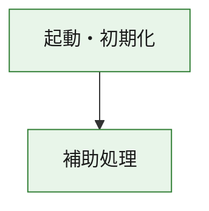
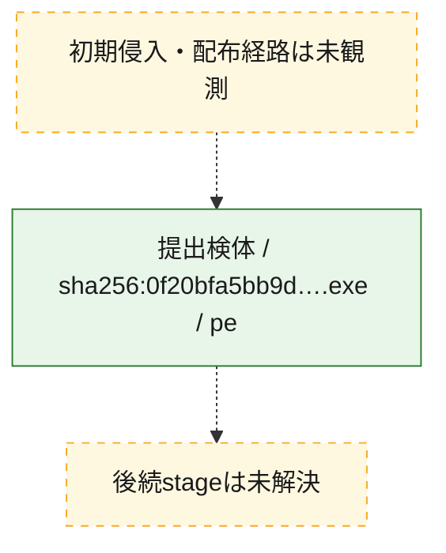
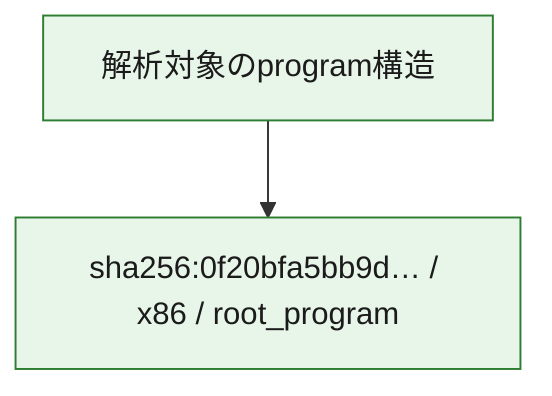

# 全体ロジック：0f20bfa5bb9dc9a475e79f7ead3e713ad93f53ddcdc078a63fb589787f5372e4

代表関数の静的証跡から、起動・初期化の処理群を確認しました。

## 読み方

- phaseの掲載順は解析上の整理順です。observed_call_edgesがない段階間の実行順を断定しません。
- 図の実線は静的に観測した関係、点線と黄色のノードは未観測・未解決の関係を示します。
- 図は静的な要約であり、動的実行を再現するものではありません。
- 詳細な関数解説とfingerprintは[STATIC-LOGIC.md](STATIC-LOGIC.md)を参照してください。

## 静的可視化

### 実行フロー

### 感染チェーン

### モジュール関係

## 処理段階

### 1. 起動・初期化

entry pointから初期化と後続処理への移行を確認します。
確度: `confirmed_static_function_evidence`

- `0f20bfa5bb9dc9a475e79f7ead3e713ad93f53ddcdc078a63fb589787f5372e4:ghidra:180001010` — 初期化と主要処理への分岐を行う入口関数です。 状態: `succeeded`、選定理由: `entry_point`, `meaningful_symbol_name`, `reviewed_call_centrality:22`, `role:entrypoint`, `small_program_complete_context`

### 2. 補助処理

主要処理を支える一般内部関数またはlibrary処理を確認します。
確度: `confirmed_static_function_evidence`

- `0f20bfa5bb9dc9a475e79f7ead3e713ad93f53ddcdc078a63fb589787f5372e4:ghidra:180001240` — 検体内部の一般処理を実装する関数です。 状態: `succeeded`、選定理由: `context_representative`, `reviewed_call_centrality:2`, `small_program_complete_context`
- `0f20bfa5bb9dc9a475e79f7ead3e713ad93f53ddcdc078a63fb589787f5372e4:ghidra:180001350` — 検体内部の一般処理を実装する関数です。 状態: `succeeded`、選定理由: `context_representative`, `reviewed_call_centrality:25`, `small_program_complete_context`
- `0f20bfa5bb9dc9a475e79f7ead3e713ad93f53ddcdc078a63fb589787f5372e4:ghidra:180003780` — 検体内部の一般処理を実装する関数です。 状態: `succeeded`、選定理由: `context_representative`, `reviewed_call_centrality:2`, `small_program_complete_context`
- `0f20bfa5bb9dc9a475e79f7ead3e713ad93f53ddcdc078a63fb589787f5372e4:ghidra:1800038e0` — 検体内部の一般処理を実装する関数です。 状態: `succeeded`、選定理由: `context_representative`, `reviewed_call_centrality:2`, `small_program_complete_context`

## 観測したcall関係

- `0f20bfa5bb9dc9a475e79f7ead3e713ad93f53ddcdc078a63fb589787f5372e4:ghidra:180001010` → `0f20bfa5bb9dc9a475e79f7ead3e713ad93f53ddcdc078a63fb589787f5372e4:ghidra:180001240` （`startup` → `support`）
- `0f20bfa5bb9dc9a475e79f7ead3e713ad93f53ddcdc078a63fb589787f5372e4:ghidra:180001010` → `0f20bfa5bb9dc9a475e79f7ead3e713ad93f53ddcdc078a63fb589787f5372e4:ghidra:180001350` （`startup` → `support`）
- `0f20bfa5bb9dc9a475e79f7ead3e713ad93f53ddcdc078a63fb589787f5372e4:ghidra:180001350` → `0f20bfa5bb9dc9a475e79f7ead3e713ad93f53ddcdc078a63fb589787f5372e4:ghidra:180001240` （`support` → `support`）
- `0f20bfa5bb9dc9a475e79f7ead3e713ad93f53ddcdc078a63fb589787f5372e4:ghidra:180001350` → `0f20bfa5bb9dc9a475e79f7ead3e713ad93f53ddcdc078a63fb589787f5372e4:ghidra:180003780` （`support` → `support`）
- `0f20bfa5bb9dc9a475e79f7ead3e713ad93f53ddcdc078a63fb589787f5372e4:ghidra:180001350` → `0f20bfa5bb9dc9a475e79f7ead3e713ad93f53ddcdc078a63fb589787f5372e4:ghidra:1800038e0` （`support` → `support`）
- `0f20bfa5bb9dc9a475e79f7ead3e713ad93f53ddcdc078a63fb589787f5372e4:ghidra:180003780` → `0f20bfa5bb9dc9a475e79f7ead3e713ad93f53ddcdc078a63fb589787f5372e4:ghidra:1800038e0` （`support` → `support`）
- `ghidra-function:057a8057f1cb1bad838a6c36` → `ghidra-function:54d470b4219afbf111acea0c` （`unclassified` → `unclassified`）
- `ghidra-function:9db8df339c363abfe0f51c2d` → `ghidra-external:0ef30b6ee4bff5bda25c1210` （`unclassified` → `unclassified`）
- `ghidra-function:9db8df339c363abfe0f51c2d` → `ghidra-external:10e26614b539585492a6961c` （`unclassified` → `unclassified`）
- `ghidra-function:9db8df339c363abfe0f51c2d` → `ghidra-external:1db0394a4b9688ec1c13f8f8` （`unclassified` → `unclassified`）
- `ghidra-function:9db8df339c363abfe0f51c2d` → `ghidra-external:2c819e288e83867fa882f483` （`unclassified` → `unclassified`）
- `ghidra-function:9db8df339c363abfe0f51c2d` → `ghidra-external:54550bcff58728a762fd4b53` （`unclassified` → `unclassified`）
- `ghidra-function:9db8df339c363abfe0f51c2d` → `ghidra-external:58a78292462208c1cff81dff` （`unclassified` → `unclassified`）
- `ghidra-function:9db8df339c363abfe0f51c2d` → `ghidra-external:5e7829897a77ee7493b42466` （`unclassified` → `unclassified`）
- `ghidra-function:9db8df339c363abfe0f51c2d` → `ghidra-external:69693ec010566019367c9c79` （`unclassified` → `unclassified`）
- `ghidra-function:9db8df339c363abfe0f51c2d` → `ghidra-external:707946e77db2c4741d8147eb` （`unclassified` → `unclassified`）
- `ghidra-function:9db8df339c363abfe0f51c2d` → `ghidra-external:8371564b892ca106d76035d3` （`unclassified` → `unclassified`）
- `ghidra-function:9db8df339c363abfe0f51c2d` → `ghidra-external:872a12d3ddfc102e1b600d2d` （`unclassified` → `unclassified`）
- `ghidra-function:9db8df339c363abfe0f51c2d` → `ghidra-external:8d135a29a77954f209930e56` （`unclassified` → `unclassified`）
- `ghidra-function:9db8df339c363abfe0f51c2d` → `ghidra-external:aa4c8dbae1109f7b47cbd5cb` （`unclassified` → `unclassified`）
- `ghidra-function:9db8df339c363abfe0f51c2d` → `ghidra-external:b0d971e231dc347ccfaed748` （`unclassified` → `unclassified`）
- `ghidra-function:9db8df339c363abfe0f51c2d` → `ghidra-external:bef704af2749fa35a4ce69ce` （`unclassified` → `unclassified`）
- `ghidra-function:9db8df339c363abfe0f51c2d` → `ghidra-external:c4df6d60526237a3bce6777e` （`unclassified` → `unclassified`）
- `ghidra-function:9db8df339c363abfe0f51c2d` → `ghidra-external:d42d531658df7778aa3f2c0c` （`unclassified` → `unclassified`）
- `ghidra-function:9db8df339c363abfe0f51c2d` → `ghidra-external:dc9f96278d5842150bc517bf` （`unclassified` → `unclassified`）
- `ghidra-function:9db8df339c363abfe0f51c2d` → `ghidra-external:de2040fb15c86342cd77b224` （`unclassified` → `unclassified`）
- `ghidra-function:9db8df339c363abfe0f51c2d` → `ghidra-external:e2a6a6ba1afceaedaf5009be` （`unclassified` → `unclassified`）
- `ghidra-function:9db8df339c363abfe0f51c2d` → `ghidra-external:e80d4fdf7fc2369fce39db17` （`unclassified` → `unclassified`）
- `ghidra-function:9db8df339c363abfe0f51c2d` → `ghidra-function:057a8057f1cb1bad838a6c36` （`unclassified` → `unclassified`）
- `ghidra-function:9db8df339c363abfe0f51c2d` → `ghidra-function:54d470b4219afbf111acea0c` （`unclassified` → `unclassified`）
- `ghidra-function:9db8df339c363abfe0f51c2d` → `ghidra-function:dde249e98d10c63628ddce01` （`unclassified` → `unclassified`）
- `ghidra-function:f4f17fa8b4c23b672e76511a` → `ghidra-function:1b288b01e05f62d3ff3f73d0` （`unclassified` → `unclassified`）
- `ghidra-function:f4f17fa8b4c23b672e76511a` → `ghidra-function:1cc4fa7fda5734cf8674de48` （`unclassified` → `unclassified`）
- `ghidra-function:f4f17fa8b4c23b672e76511a` → `ghidra-function:62b356cf6accd67d20464f8d` （`unclassified` → `unclassified`）
- `ghidra-function:f4f17fa8b4c23b672e76511a` → `ghidra-function:9db8df339c363abfe0f51c2d` （`unclassified` → `unclassified`）
- `ghidra-function:f4f17fa8b4c23b672e76511a` → `ghidra-function:9e5dfa6d8bce74a918ec3e9b` （`unclassified` → `unclassified`）
- `ghidra-function:f4f17fa8b4c23b672e76511a` → `ghidra-function:b07d14078b52d539ff095b81` （`unclassified` → `unclassified`）
- `ghidra-function:f4f17fa8b4c23b672e76511a` → `ghidra-function:cbcbc736f87cc53400cde6fe` （`unclassified` → `unclassified`）
- `ghidra-function:f4f17fa8b4c23b672e76511a` → `ghidra-function:d4bf21d4cb1f826437815fdf` （`unclassified` → `unclassified`）
- `ghidra-function:f4f17fa8b4c23b672e76511a` → `ghidra-function:d767c0606411b39d0f99945a` （`unclassified` → `unclassified`）
- `ghidra-function:f4f17fa8b4c23b672e76511a` → `ghidra-function:dde249e98d10c63628ddce01` （`unclassified` → `unclassified`）
- `ghidra-function:f4f17fa8b4c23b672e76511a` → `ghidra-function:f0d074ff5960927214add441` （`unclassified` → `unclassified`）
- `ghidra-function:f4f17fa8b4c23b672e76511a` → `ghidra-function:fdba683bf975c76c1443c669` （`unclassified` → `unclassified`）

## 解析範囲と制約

- 選定外関数は全体inventoryへ残しますが、関数本体の個別解説対象にはしていません。
- indirect call、難読化、packer、VM、壊れたcontrol flowによりcall関係が欠落する場合があります。
- 文書は静的解析に基づき、検体実行や外部通信による動的確認は行っていません。
