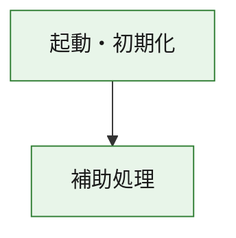
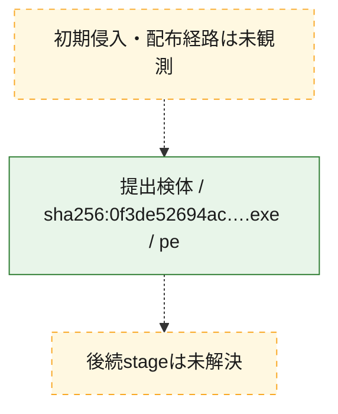
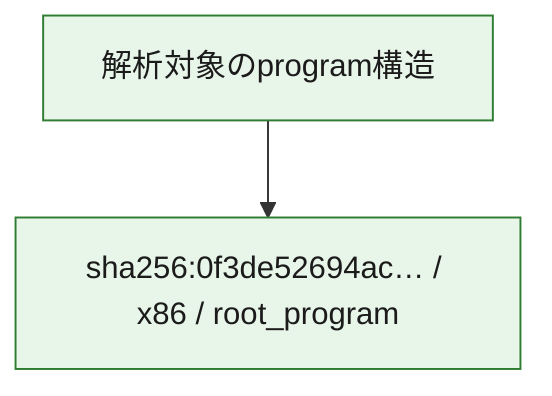

# 全体ロジック：0f3de52694acd8b9ec0aaf9d4d12d414d0319f2116a21a95a1caa4fd4ff32996

代表関数の静的証跡から、起動・初期化の処理群を確認しました。

## 読み方

- phaseの掲載順は解析上の整理順です。observed_call_edgesがない段階間の実行順を断定しません。
- 図の実線は静的に観測した関係、点線と黄色のノードは未観測・未解決の関係を示します。
- 図は静的な要約であり、動的実行を再現するものではありません。
- 詳細な関数解説とfingerprintは[STATIC-LOGIC.md](STATIC-LOGIC.md)を参照してください。

## 静的可視化

### 実行フロー

### 感染チェーン

### モジュール関係

## 処理段階

### 1. 起動・初期化

entry pointから初期化と後続処理への移行を確認します。
確度: `confirmed_static_function_evidence`

- `0f3de52694acd8b9ec0aaf9d4d12d414d0319f2116a21a95a1caa4fd4ff32996:ghidra:180001010` — 初期化と主要処理への分岐を行う入口関数です。 状態: `succeeded`、選定理由: `entry_point`, `meaningful_symbol_name`, `reviewed_call_centrality:22`, `role:entrypoint`, `small_program_complete_context`

### 2. 補助処理

主要処理を支える一般内部関数またはlibrary処理を確認します。
確度: `confirmed_static_function_evidence`

- `0f3de52694acd8b9ec0aaf9d4d12d414d0319f2116a21a95a1caa4fd4ff32996:ghidra:180001240` — 検体内部の一般処理を実装する関数です。 状態: `succeeded`、選定理由: `context_representative`, `reviewed_call_centrality:2`, `small_program_complete_context`
- `0f3de52694acd8b9ec0aaf9d4d12d414d0319f2116a21a95a1caa4fd4ff32996:ghidra:180001350` — 検体内部の一般処理を実装する関数です。 状態: `succeeded`、選定理由: `context_representative`, `reviewed_call_centrality:25`, `small_program_complete_context`
- `0f3de52694acd8b9ec0aaf9d4d12d414d0319f2116a21a95a1caa4fd4ff32996:ghidra:180003780` — 検体内部の一般処理を実装する関数です。 状態: `succeeded`、選定理由: `context_representative`, `reviewed_call_centrality:2`, `small_program_complete_context`
- `0f3de52694acd8b9ec0aaf9d4d12d414d0319f2116a21a95a1caa4fd4ff32996:ghidra:1800038e0` — 検体内部の一般処理を実装する関数です。 状態: `succeeded`、選定理由: `context_representative`, `reviewed_call_centrality:2`, `small_program_complete_context`

## 観測したcall関係

- `0f3de52694acd8b9ec0aaf9d4d12d414d0319f2116a21a95a1caa4fd4ff32996:ghidra:180001010` → `0f3de52694acd8b9ec0aaf9d4d12d414d0319f2116a21a95a1caa4fd4ff32996:ghidra:180001240` （`startup` → `support`）
- `0f3de52694acd8b9ec0aaf9d4d12d414d0319f2116a21a95a1caa4fd4ff32996:ghidra:180001010` → `0f3de52694acd8b9ec0aaf9d4d12d414d0319f2116a21a95a1caa4fd4ff32996:ghidra:180001350` （`startup` → `support`）
- `0f3de52694acd8b9ec0aaf9d4d12d414d0319f2116a21a95a1caa4fd4ff32996:ghidra:180001350` → `0f3de52694acd8b9ec0aaf9d4d12d414d0319f2116a21a95a1caa4fd4ff32996:ghidra:180001240` （`support` → `support`）
- `0f3de52694acd8b9ec0aaf9d4d12d414d0319f2116a21a95a1caa4fd4ff32996:ghidra:180001350` → `0f3de52694acd8b9ec0aaf9d4d12d414d0319f2116a21a95a1caa4fd4ff32996:ghidra:180003780` （`support` → `support`）
- `0f3de52694acd8b9ec0aaf9d4d12d414d0319f2116a21a95a1caa4fd4ff32996:ghidra:180001350` → `0f3de52694acd8b9ec0aaf9d4d12d414d0319f2116a21a95a1caa4fd4ff32996:ghidra:1800038e0` （`support` → `support`）
- `0f3de52694acd8b9ec0aaf9d4d12d414d0319f2116a21a95a1caa4fd4ff32996:ghidra:180003780` → `0f3de52694acd8b9ec0aaf9d4d12d414d0319f2116a21a95a1caa4fd4ff32996:ghidra:1800038e0` （`support` → `support`）
- `ghidra-function:4b1a80b00e13535df8ba68da` → `ghidra-external:010a57ad19fbc2ccabfc97fe` （`unclassified` → `unclassified`）
- `ghidra-function:4b1a80b00e13535df8ba68da` → `ghidra-external:082701209fa55efdeb4f8cfe` （`unclassified` → `unclassified`）
- `ghidra-function:4b1a80b00e13535df8ba68da` → `ghidra-external:14cb2ab5b580c28f28b5e955` （`unclassified` → `unclassified`）
- `ghidra-function:4b1a80b00e13535df8ba68da` → `ghidra-external:15b80a3d04bfb6c7810d0843` （`unclassified` → `unclassified`）
- `ghidra-function:4b1a80b00e13535df8ba68da` → `ghidra-external:2630d31b3fca236c395b2fec` （`unclassified` → `unclassified`）
- `ghidra-function:4b1a80b00e13535df8ba68da` → `ghidra-external:2834d34aefc02442d91bdc78` （`unclassified` → `unclassified`）
- `ghidra-function:4b1a80b00e13535df8ba68da` → `ghidra-external:2c52a2434f2ed59ccd6dc36f` （`unclassified` → `unclassified`）
- `ghidra-function:4b1a80b00e13535df8ba68da` → `ghidra-external:358ba49a96132bd2af4a8571` （`unclassified` → `unclassified`）
- `ghidra-function:4b1a80b00e13535df8ba68da` → `ghidra-external:4bc364e0d0505753607fb85b` （`unclassified` → `unclassified`）
- `ghidra-function:4b1a80b00e13535df8ba68da` → `ghidra-external:7addc170c30893f37013b9c0` （`unclassified` → `unclassified`）
- `ghidra-function:4b1a80b00e13535df8ba68da` → `ghidra-external:8ae4d28192273223170f747a` （`unclassified` → `unclassified`）
- `ghidra-function:4b1a80b00e13535df8ba68da` → `ghidra-external:974cb55b2ddc8a50e2f6baab` （`unclassified` → `unclassified`）
- `ghidra-function:4b1a80b00e13535df8ba68da` → `ghidra-external:97ed00608171537eca865b78` （`unclassified` → `unclassified`）
- `ghidra-function:4b1a80b00e13535df8ba68da` → `ghidra-external:b832c90145753efcaa04e781` （`unclassified` → `unclassified`）
- `ghidra-function:4b1a80b00e13535df8ba68da` → `ghidra-external:bf09b87cbabe5e0951c51a9a` （`unclassified` → `unclassified`）
- `ghidra-function:4b1a80b00e13535df8ba68da` → `ghidra-external:c1a9f64bf836d5cfb5609756` （`unclassified` → `unclassified`）
- `ghidra-function:4b1a80b00e13535df8ba68da` → `ghidra-external:c5bd818e67c8bd2b44e86c4c` （`unclassified` → `unclassified`）
- `ghidra-function:4b1a80b00e13535df8ba68da` → `ghidra-external:cf7a789e8640f656f5051b4f` （`unclassified` → `unclassified`）
- `ghidra-function:4b1a80b00e13535df8ba68da` → `ghidra-external:da144b06ba1f4d42230431c5` （`unclassified` → `unclassified`）
- `ghidra-function:4b1a80b00e13535df8ba68da` → `ghidra-external:f1509cfda83329b9ae98a7cc` （`unclassified` → `unclassified`）
- `ghidra-function:4b1a80b00e13535df8ba68da` → `ghidra-external:f6850de706850b049b6b9988` （`unclassified` → `unclassified`）
- `ghidra-function:4b1a80b00e13535df8ba68da` → `ghidra-function:0e06c5d340edb56fad9877be` （`unclassified` → `unclassified`）
- `ghidra-function:4b1a80b00e13535df8ba68da` → `ghidra-function:84abf21d5a836ab9d2001dde` （`unclassified` → `unclassified`）
- `ghidra-function:4b1a80b00e13535df8ba68da` → `ghidra-function:8d2fabb157a825e12356e875` （`unclassified` → `unclassified`）
- `ghidra-function:79ee5990b8683ff49ae139c0` → `ghidra-function:2b8245315b4f429ede2f044f` （`unclassified` → `unclassified`）
- `ghidra-function:79ee5990b8683ff49ae139c0` → `ghidra-function:38635fcffdfea26cfabec68b` （`unclassified` → `unclassified`）
- `ghidra-function:79ee5990b8683ff49ae139c0` → `ghidra-function:4b1a80b00e13535df8ba68da` （`unclassified` → `unclassified`）
- `ghidra-function:79ee5990b8683ff49ae139c0` → `ghidra-function:6da3a51672172c1247002f25` （`unclassified` → `unclassified`）
- `ghidra-function:79ee5990b8683ff49ae139c0` → `ghidra-function:76964fa7b082a2f9655f9436` （`unclassified` → `unclassified`）
- `ghidra-function:79ee5990b8683ff49ae139c0` → `ghidra-function:76f607b83d37726c8374622e` （`unclassified` → `unclassified`）
- `ghidra-function:79ee5990b8683ff49ae139c0` → `ghidra-function:8285b0e81a0587e589a56dc3` （`unclassified` → `unclassified`）
- `ghidra-function:79ee5990b8683ff49ae139c0` → `ghidra-function:8d2fabb157a825e12356e875` （`unclassified` → `unclassified`）
- `ghidra-function:79ee5990b8683ff49ae139c0` → `ghidra-function:9ddd10302683115cc3e31817` （`unclassified` → `unclassified`）
- `ghidra-function:79ee5990b8683ff49ae139c0` → `ghidra-function:b43ee10315be6a07f6db4958` （`unclassified` → `unclassified`）
- `ghidra-function:79ee5990b8683ff49ae139c0` → `ghidra-function:cb4ec1c114c3bc86c2c7062d` （`unclassified` → `unclassified`）
- `ghidra-function:79ee5990b8683ff49ae139c0` → `ghidra-function:f125ef2623b02aebeb863e05` （`unclassified` → `unclassified`）
- `ghidra-function:84abf21d5a836ab9d2001dde` → `ghidra-function:0e06c5d340edb56fad9877be` （`unclassified` → `unclassified`）

## 解析範囲と制約

- 選定外関数は全体inventoryへ残しますが、関数本体の個別解説対象にはしていません。
- indirect call、難読化、packer、VM、壊れたcontrol flowによりcall関係が欠落する場合があります。
- 文書は静的解析に基づき、検体実行や外部通信による動的確認は行っていません。
