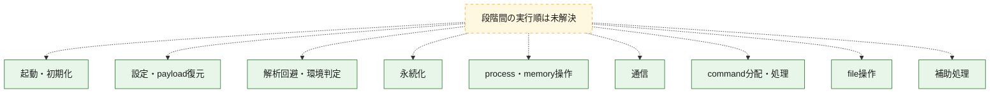
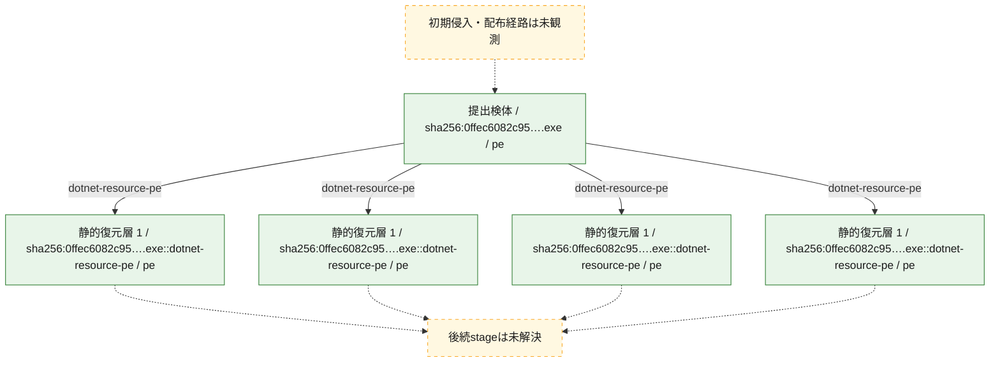
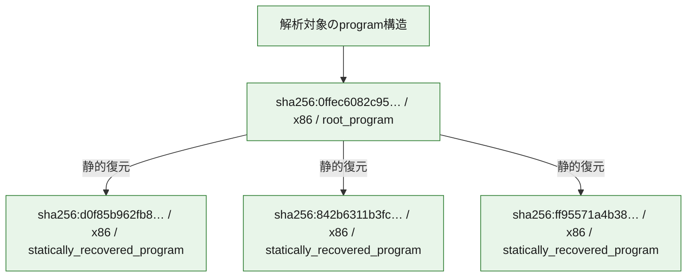

# 全体ロジック：0ffec6082c9540ac473d603f278168458f574ac9018ba5ed9b7b1e7ec1539133

代表関数の静的証跡から、起動・初期化、設定・payload復元、解析回避・環境判定、永続化、process・memory操作、通信、command分配・処理、file操作の処理群を確認しました。

## 読み方

- phaseの掲載順は解析上の整理順です。observed_call_edgesがない段階間の実行順を断定しません。
- 図の実線は静的に観測した関係、点線と黄色のノードは未観測・未解決の関係を示します。
- 図は静的な要約であり、動的実行を再現するものではありません。
- 詳細な関数解説とfingerprintは[STATIC-LOGIC.md](STATIC-LOGIC.md)を参照してください。

## 静的可視化

### 実行フロー

### 感染チェーン

### モジュール関係

## 処理段階

### 1. 起動・初期化

entry pointから初期化と後続処理への移行を確認します。
確度: `confirmed_static_function_evidence`

- `d0f85b962fb8f44cf0895ea091ba4340b155e0c96e2c69bcf896443d25bf63c9:ghidra:1800011ac` — 初期化と主要処理への分岐を行う入口関数です。 状態: `succeeded`、選定理由: `entry_point`, `meaningful_symbol_name`, `reviewed_call_centrality:3`, `role:entrypoint`, `small_program_complete_context`
- `ff95571a4b3880be2807cad8875ee6ccd0b2b705caf0d4d0d0f56950dd78ee5a:ghidra:180008a84` — 初期化と主要処理への分岐を行う入口関数です。 状態: `succeeded`、選定理由: `entry_point`, `meaningful_symbol_name`, `reviewed_call_centrality:5`, `role:entrypoint`
- `0ffec6082c9540ac473d603f278168458f574ac9018ba5ed9b7b1e7ec1539133:cil:0x06000026` — 初期化と主要処理への分岐を行う入口関数です。 状態: `succeeded`、選定理由: `entry_point`, `large_function:instructions=479`, `reviewed_call_centrality:98`
- `0ffec6082c9540ac473d603f278168458f574ac9018ba5ed9b7b1e7ec1539133:cil:0x0600002b` — 初期化と主要処理への分岐を行う入口関数です。 状態: `succeeded`、選定理由: `entry_point`, `reviewed_call_centrality:2`
- `0ffec6082c9540ac473d603f278168458f574ac9018ba5ed9b7b1e7ec1539133:cil:0x0600002c` — 初期化と主要処理への分岐を行う入口関数です。 状態: `succeeded`、選定理由: `entry_point`, `reviewed_call_centrality:2`

### 2. 設定・payload復元

設定、resource、payload、暗号化データの復元・変換を確認します。
確度: `confirmed_static_function_evidence`

- `0ffec6082c9540ac473d603f278168458f574ac9018ba5ed9b7b1e7ec1539133:cil:0x0600001f` — 設定、resource、payloadなどの解析・変換を行う関数です。 状態: `succeeded`、選定理由: `large_function:instructions=648`, `reviewed_call_centrality:76`, `role:config_or_data_transform`
- `0ffec6082c9540ac473d603f278168458f574ac9018ba5ed9b7b1e7ec1539133:cil:0x06000020` — 設定、resource、payloadなどの解析・変換を行う関数です。 状態: `succeeded`、選定理由: `large_function:instructions=95`, `reviewed_call_centrality:34`, `role:config_or_data_transform`
- `0ffec6082c9540ac473d603f278168458f574ac9018ba5ed9b7b1e7ec1539133:cil:0x06000021` — 設定、resource、payloadなどの解析・変換を行う関数です。 状態: `succeeded`、選定理由: `large_function:instructions=76`, `reviewed_call_centrality:28`, `role:config_or_data_transform`
- `0ffec6082c9540ac473d603f278168458f574ac9018ba5ed9b7b1e7ec1539133:cil:0x06000130` — 設定、resource、payloadなどの解析・変換を行う関数です。 状態: `succeeded`、選定理由: `large_function:instructions=89`, `reviewed_call_centrality:36`, `role:config_or_data_transform`
- `0ffec6082c9540ac473d603f278168458f574ac9018ba5ed9b7b1e7ec1539133:cil:0x0600015d` — 設定、resource、payloadなどの解析・変換を行う関数です。 状態: `succeeded`、選定理由: `large_function:instructions=150`, `reviewed_call_centrality:34`, `role:config_or_data_transform`
- `0ffec6082c9540ac473d603f278168458f574ac9018ba5ed9b7b1e7ec1539133:cil:0x0600015e` — 暗号、hash、encoding、または復号処理に関係する関数です。 状態: `succeeded`、選定理由: `large_function:instructions=200`, `reviewed_call_centrality:44`, `role:cryptographic_transform`

### 3. 解析回避・環境判定

debugger、sandbox、仮想環境、時間差などの判定を確認します。
確度: `confirmed_static_function_evidence`

- `ff95571a4b3880be2807cad8875ee6ccd0b2b705caf0d4d0d0f56950dd78ee5a:ghidra:18000226c` — debugger、仮想環境、sandbox、または時間差の確認に関係する関数です。 状態: `succeeded`、選定理由: `context_representative`, `reviewed_call_centrality:6`, `role:anti_analysis`
- `0ffec6082c9540ac473d603f278168458f574ac9018ba5ed9b7b1e7ec1539133:cil:0x0600012d` — debugger、仮想環境、sandbox、または時間差の確認に関係する関数です。 状態: `succeeded`、選定理由: `large_function:instructions=73`, `reviewed_call_centrality:28`, `role:anti_analysis`

### 4. 永続化

自動起動や永続化に関係する設定変更を確認します。
確度: `confirmed_static_function_evidence`

- `0ffec6082c9540ac473d603f278168458f574ac9018ba5ed9b7b1e7ec1539133:cil:0x0600003e` — 自動起動または永続化に関係する処理を含む関数です。 状態: `succeeded`、選定理由: `large_function:instructions=90`, `reviewed_call_centrality:28`, `role:persistence`

### 5. process・memory操作

process、thread、module、memory操作と実行移行を確認します。
確度: `confirmed_static_function_evidence_with_limits`

- `ff95571a4b3880be2807cad8875ee6ccd0b2b705caf0d4d0d0f56950dd78ee5a:ghidra:180001000` — process、thread、module、またはmemory操作に関係する関数です。 状態: `succeeded`、選定理由: `context_representative`, `reviewed_call_centrality:5`, `role:process_or_memory_operation`
- `ff95571a4b3880be2807cad8875ee6ccd0b2b705caf0d4d0d0f56950dd78ee5a:ghidra:180001050` — process、thread、module、またはmemory操作に関係する関数です。 状態: `succeeded`、選定理由: `context_representative`, `reviewed_call_centrality:11`, `role:process_or_memory_operation`
- `ff95571a4b3880be2807cad8875ee6ccd0b2b705caf0d4d0d0f56950dd78ee5a:ghidra:1800011f0` — process、thread、module、またはmemory操作に関係する関数です。 状態: `limited_bad_instruction_or_flow`、選定理由: `context_representative`, `reviewed_call_centrality:5`, `role:process_or_memory_operation`
- `ff95571a4b3880be2807cad8875ee6ccd0b2b705caf0d4d0d0f56950dd78ee5a:ghidra:180001284` — process、thread、module、またはmemory操作に関係する関数です。 状態: `succeeded`、選定理由: `context_representative`, `reviewed_call_centrality:5`, `role:process_or_memory_operation`
- `ff95571a4b3880be2807cad8875ee6ccd0b2b705caf0d4d0d0f56950dd78ee5a:ghidra:1800012dc` — process、thread、module、またはmemory操作に関係する関数です。 状態: `succeeded`、選定理由: `context_representative`, `reviewed_call_centrality:16`, `role:process_or_memory_operation`
- `ff95571a4b3880be2807cad8875ee6ccd0b2b705caf0d4d0d0f56950dd78ee5a:ghidra:1800014dc` — process、thread、module、またはmemory操作に関係する関数です。 状態: `limited_bad_instruction_or_flow`、選定理由: `context_representative`, `reviewed_call_centrality:5`, `role:process_or_memory_operation`
- `ff95571a4b3880be2807cad8875ee6ccd0b2b705caf0d4d0d0f56950dd78ee5a:ghidra:180001760` — process、thread、module、またはmemory操作に関係する関数です。 状態: `succeeded`、選定理由: `context_representative`, `reviewed_call_centrality:13`, `role:process_or_memory_operation`
- `ff95571a4b3880be2807cad8875ee6ccd0b2b705caf0d4d0d0f56950dd78ee5a:ghidra:1800019ec` — process、thread、module、またはmemory操作に関係する関数です。 状態: `limited_bad_instruction_or_flow`、選定理由: `context_representative`, `reviewed_call_centrality:7`, `role:process_or_memory_operation`
- `ff95571a4b3880be2807cad8875ee6ccd0b2b705caf0d4d0d0f56950dd78ee5a:ghidra:180001a6c` — process、thread、module、またはmemory操作に関係する関数です。 状態: `succeeded`、選定理由: `context_representative`, `reviewed_call_centrality:7`, `role:process_or_memory_operation`
- `ff95571a4b3880be2807cad8875ee6ccd0b2b705caf0d4d0d0f56950dd78ee5a:ghidra:180001b2c` — process、thread、module、またはmemory操作に関係する関数です。 状態: `succeeded`、選定理由: `context_representative`, `reviewed_call_centrality:25`, `role:process_or_memory_operation`
- `ff95571a4b3880be2807cad8875ee6ccd0b2b705caf0d4d0d0f56950dd78ee5a:ghidra:180001d48` — process、thread、module、またはmemory操作に関係する関数です。 状態: `succeeded`、選定理由: `context_representative`, `reviewed_call_centrality:7`, `role:process_or_memory_operation`
- `ff95571a4b3880be2807cad8875ee6ccd0b2b705caf0d4d0d0f56950dd78ee5a:ghidra:180001db0` — process、thread、module、またはmemory操作に関係する関数です。 状態: `succeeded`、選定理由: `context_representative`, `reviewed_call_centrality:17`, `role:process_or_memory_operation`
- `ff95571a4b3880be2807cad8875ee6ccd0b2b705caf0d4d0d0f56950dd78ee5a:ghidra:180001e88` — process、thread、module、またはmemory操作に関係する関数です。 状態: `succeeded`、選定理由: `context_representative`, `reviewed_call_centrality:13`, `role:process_or_memory_operation`
- `ff95571a4b3880be2807cad8875ee6ccd0b2b705caf0d4d0d0f56950dd78ee5a:ghidra:1800023cc` — process、thread、module、またはmemory操作に関係する関数です。 状態: `succeeded`、選定理由: `context_representative`, `reviewed_call_centrality:7`, `role:process_or_memory_operation`
- `ff95571a4b3880be2807cad8875ee6ccd0b2b705caf0d4d0d0f56950dd78ee5a:ghidra:1800024d8` — process、thread、module、またはmemory操作に関係する関数です。 状態: `succeeded`、選定理由: `context_representative`, `reviewed_call_centrality:8`, `role:process_or_memory_operation`
- `ff95571a4b3880be2807cad8875ee6ccd0b2b705caf0d4d0d0f56950dd78ee5a:ghidra:180002734` — process、thread、module、またはmemory操作に関係する関数です。 状態: `limited_bad_instruction_or_flow`、選定理由: `context_representative`, `reviewed_call_centrality:8`, `role:process_or_memory_operation`
- `0ffec6082c9540ac473d603f278168458f574ac9018ba5ed9b7b1e7ec1539133:cil:0x0600002d` — process、thread、module、またはmemory操作に関係する関数です。 状態: `succeeded`、選定理由: `large_function:instructions=85`, `reviewed_call_centrality:32`, `role:process_or_memory_operation`
- `0ffec6082c9540ac473d603f278168458f574ac9018ba5ed9b7b1e7ec1539133:cil:0x06000161` — process、thread、module、またはmemory操作に関係する関数です。 状態: `succeeded`、選定理由: `large_function:instructions=121`, `reviewed_call_centrality:52`, `role:process_or_memory_operation`

### 6. 通信

通信初期化、endpoint処理、送受信の役割を確認します。
確度: `confirmed_static_function_evidence`

- `0ffec6082c9540ac473d603f278168458f574ac9018ba5ed9b7b1e7ec1539133:cil:0x0600008d` — 通信初期化、送受信、またはendpoint処理に関係する関数です。 状態: `succeeded`、選定理由: `large_function:instructions=98`, `reviewed_call_centrality:34`, `role:network_communication`
- `0ffec6082c9540ac473d603f278168458f574ac9018ba5ed9b7b1e7ec1539133:cil:0x0600017f` — 通信初期化、送受信、またはendpoint処理に関係する関数です。 状態: `succeeded`、選定理由: `large_function:instructions=201`, `reviewed_call_centrality:50`, `role:network_communication`
- `0ffec6082c9540ac473d603f278168458f574ac9018ba5ed9b7b1e7ec1539133:cil:0x0600019a` — 通信初期化、送受信、またはendpoint処理に関係する関数です。 状態: `succeeded`、選定理由: `large_function:instructions=229`, `reviewed_call_centrality:24`, `role:network_communication`

### 7. command分配・処理

受信commandやtaskの解釈、分配、個別handlerへの移行を確認します。
確度: `confirmed_static_function_evidence_with_limits`

- `ff95571a4b3880be2807cad8875ee6ccd0b2b705caf0d4d0d0f56950dd78ee5a:ghidra:1800145c0` — commandの解釈、分配、または個別処理を担当する関数です。 状態: `limited_bad_instruction_or_flow`、選定理由: `meaningful_symbol_name`, `role:command_dispatch_or_handler`
- `0ffec6082c9540ac473d603f278168458f574ac9018ba5ed9b7b1e7ec1539133:cil:0x06000049` — commandの解釈、分配、または個別処理を担当する関数です。 状態: `succeeded`、選定理由: `large_function:instructions=132`, `reviewed_call_centrality:36`, `role:command_dispatch_or_handler`
- `0ffec6082c9540ac473d603f278168458f574ac9018ba5ed9b7b1e7ec1539133:cil:0x06000098` — commandの解釈、分配、または個別処理を担当する関数です。 状態: `succeeded`、選定理由: `large_function:instructions=269`, `reviewed_call_centrality:54`, `role:command_dispatch_or_handler`
- `0ffec6082c9540ac473d603f278168458f574ac9018ba5ed9b7b1e7ec1539133:cil:0x0600009d` — commandの解釈、分配、または個別処理を担当する関数です。 状態: `succeeded`、選定理由: `large_function:instructions=142`, `reviewed_call_centrality:40`, `role:command_dispatch_or_handler`
- `0ffec6082c9540ac473d603f278168458f574ac9018ba5ed9b7b1e7ec1539133:cil:0x060000da` — commandの解釈、分配、または個別処理を担当する関数です。 状態: `succeeded`、選定理由: `large_function:instructions=1009`, `reviewed_call_centrality:102`, `role:command_dispatch_or_handler`
- `0ffec6082c9540ac473d603f278168458f574ac9018ba5ed9b7b1e7ec1539133:cil:0x060000e0` — commandの解釈、分配、または個別処理を担当する関数です。 状態: `succeeded`、選定理由: `large_function:instructions=279`, `reviewed_call_centrality:44`, `role:command_dispatch_or_handler`
- `0ffec6082c9540ac473d603f278168458f574ac9018ba5ed9b7b1e7ec1539133:cil:0x06000103` — commandの解釈、分配、または個別処理を担当する関数です。 状態: `succeeded`、選定理由: `large_function:instructions=124`, `reviewed_call_centrality:40`, `role:command_dispatch_or_handler`
- `0ffec6082c9540ac473d603f278168458f574ac9018ba5ed9b7b1e7ec1539133:cil:0x06000106` — commandの解釈、分配、または個別処理を担当する関数です。 状態: `succeeded`、選定理由: `large_function:instructions=344`, `reviewed_call_centrality:76`, `role:command_dispatch_or_handler`
- `0ffec6082c9540ac473d603f278168458f574ac9018ba5ed9b7b1e7ec1539133:cil:0x06000109` — commandの解釈、分配、または個別処理を担当する関数です。 状態: `succeeded`、選定理由: `large_function:instructions=565`, `reviewed_call_centrality:54`, `role:command_dispatch_or_handler`
- `0ffec6082c9540ac473d603f278168458f574ac9018ba5ed9b7b1e7ec1539133:cil:0x0600010d` — commandの解釈、分配、または個別処理を担当する関数です。 状態: `succeeded`、選定理由: `large_function:instructions=70`, `reviewed_call_centrality:32`, `role:command_dispatch_or_handler`
- `0ffec6082c9540ac473d603f278168458f574ac9018ba5ed9b7b1e7ec1539133:cil:0x06000111` — commandの解釈、分配、または個別処理を担当する関数です。 状態: `succeeded`、選定理由: `large_function:instructions=87`, `reviewed_call_centrality:34`, `role:command_dispatch_or_handler`

### 8. file操作

fileやdirectoryの作成、読書き、削除を確認します。
確度: `confirmed_static_function_evidence`

- `0ffec6082c9540ac473d603f278168458f574ac9018ba5ed9b7b1e7ec1539133:cil:0x06000003` — fileまたはdirectoryの読書き・管理に関係する関数です。 状態: `succeeded`、選定理由: `large_function:instructions=104`, `reviewed_call_centrality:42`, `role:file_operation`
- `0ffec6082c9540ac473d603f278168458f574ac9018ba5ed9b7b1e7ec1539133:cil:0x06000050` — fileまたはdirectoryの読書き・管理に関係する関数です。 状態: `succeeded`、選定理由: `large_function:instructions=76`, `reviewed_call_centrality:32`, `role:file_operation`
- `0ffec6082c9540ac473d603f278168458f574ac9018ba5ed9b7b1e7ec1539133:cil:0x06000057` — fileまたはdirectoryの読書き・管理に関係する関数です。 状態: `succeeded`、選定理由: `large_function:instructions=122`, `reviewed_call_centrality:36`, `role:file_operation`
- `0ffec6082c9540ac473d603f278168458f574ac9018ba5ed9b7b1e7ec1539133:cil:0x06000060` — fileまたはdirectoryの読書き・管理に関係する関数です。 状態: `succeeded`、選定理由: `large_function:instructions=73`, `reviewed_call_centrality:34`, `role:file_operation`
- `0ffec6082c9540ac473d603f278168458f574ac9018ba5ed9b7b1e7ec1539133:cil:0x060000f5` — fileまたはdirectoryの読書き・管理に関係する関数です。 状態: `succeeded`、選定理由: `large_function:instructions=355`, `reviewed_call_centrality:36`, `role:file_operation`

### 9. 補助処理

主要処理を支える一般内部関数またはlibrary処理を確認します。
確度: `confirmed_static_function_evidence_with_limits`

- `d0f85b962fb8f44cf0895ea091ba4340b155e0c96e2c69bcf896443d25bf63c9:ghidra:180001284` — 検体内部の一般処理を実装する関数です。 状態: `succeeded`、選定理由: `context_representative`, `reviewed_call_centrality:5`, `small_program_complete_context`
- `d0f85b962fb8f44cf0895ea091ba4340b155e0c96e2c69bcf896443d25bf63c9:ghidra:180001594` — 検体内部の一般処理を実装する関数です。 状態: `succeeded`、選定理由: `context_representative`, `reviewed_call_centrality:3`, `small_program_complete_context`
- `d0f85b962fb8f44cf0895ea091ba4340b155e0c96e2c69bcf896443d25bf63c9:ghidra:1800016ac` — 検体内部の一般処理を実装する関数です。 状態: `succeeded`、選定理由: `context_representative`, `reviewed_call_centrality:1`, `small_program_complete_context`
- `842b6311b3fceab40ce2892faa37b2f5e52a3fc762e6211b1eb879ab32af1b3f:ghidra:10007585` — 検体内部の一般処理を実装する関数です。 状態: `succeeded`、選定理由: `meaningful_symbol_name`, `small_program_complete_context`
- `ff95571a4b3880be2807cad8875ee6ccd0b2b705caf0d4d0d0f56950dd78ee5a:ghidra:180001568` — 検体内部の一般処理を実装する関数です。 状態: `succeeded`、選定理由: `context_representative`, `reviewed_call_centrality:8`
- `ff95571a4b3880be2807cad8875ee6ccd0b2b705caf0d4d0d0f56950dd78ee5a:ghidra:1800015d4` — 検体内部の一般処理を実装する関数です。 状態: `succeeded`、選定理由: `context_representative`, `reviewed_call_centrality:5`
- `ff95571a4b3880be2807cad8875ee6ccd0b2b705caf0d4d0d0f56950dd78ee5a:ghidra:180001664` — 検体内部の一般処理を実装する関数です。 状態: `succeeded`、選定理由: `context_representative`, `reviewed_call_centrality:1`
- `ff95571a4b3880be2807cad8875ee6ccd0b2b705caf0d4d0d0f56950dd78ee5a:ghidra:180001f28` — 検体内部の一般処理を実装する関数です。 状態: `succeeded`、選定理由: `context_representative`, `reviewed_call_centrality:8`
- `ff95571a4b3880be2807cad8875ee6ccd0b2b705caf0d4d0d0f56950dd78ee5a:ghidra:18000203c` — 検体内部の一般処理を実装する関数です。 状態: `succeeded`、選定理由: `context_representative`, `reviewed_call_centrality:5`
- `ff95571a4b3880be2807cad8875ee6ccd0b2b705caf0d4d0d0f56950dd78ee5a:ghidra:18000211c` — 検体内部の一般処理を実装する関数です。 状態: `succeeded`、選定理由: `context_representative`, `reviewed_call_centrality:1`
- `ff95571a4b3880be2807cad8875ee6ccd0b2b705caf0d4d0d0f56950dd78ee5a:ghidra:180002180` — 検体内部の一般処理を実装する関数です。 状態: `limited_bad_instruction_or_flow`、選定理由: `context_representative`, `reviewed_call_centrality:5`
- `ff95571a4b3880be2807cad8875ee6ccd0b2b705caf0d4d0d0f56950dd78ee5a:ghidra:180002210` — 検体内部の一般処理を実装する関数です。 状態: `limited_bad_instruction_or_flow`、選定理由: `context_representative`, `reviewed_call_centrality:4`
- `ff95571a4b3880be2807cad8875ee6ccd0b2b705caf0d4d0d0f56950dd78ee5a:ghidra:180002398` — 検体内部の一般処理を実装する関数です。 状態: `succeeded`、選定理由: `context_representative`, `reviewed_call_centrality:2`
- `ff95571a4b3880be2807cad8875ee6ccd0b2b705caf0d4d0d0f56950dd78ee5a:ghidra:180002470` — 検体内部の一般処理を実装する関数です。 状態: `succeeded`、選定理由: `context_representative`, `reviewed_call_centrality:1`
- `ff95571a4b3880be2807cad8875ee6ccd0b2b705caf0d4d0d0f56950dd78ee5a:ghidra:1800024a4` — 検体内部の一般処理を実装する関数です。 状態: `succeeded`、選定理由: `context_representative`, `reviewed_call_centrality:1`
- `ff95571a4b3880be2807cad8875ee6ccd0b2b705caf0d4d0d0f56950dd78ee5a:ghidra:180004788` — 検体内部の一般処理を実装する関数です。 状態: `succeeded`、選定理由: `entry_point`, `meaningful_symbol_name`, `reviewed_call_centrality:2`
- `ff95571a4b3880be2807cad8875ee6ccd0b2b705caf0d4d0d0f56950dd78ee5a:ghidra:1800091ac` — 検体内部の一般処理を実装する関数です。 状態: `succeeded`、選定理由: `meaningful_symbol_name`
- `0ffec6082c9540ac473d603f278168458f574ac9018ba5ed9b7b1e7ec1539133:cil:0x06000061` — 検体内部の一般処理を実装する関数です。 状態: `succeeded`、選定理由: `large_function:instructions=69`, `reviewed_call_centrality:28`

## 観測したcall関係

- 代表関数間で直接解決できた呼出関係はありません。

## 解析範囲と制約

- 選定外関数は全体inventoryへ残しますが、関数本体の個別解説対象にはしていません。
- indirect call、難読化、packer、VM、壊れたcontrol flowによりcall関係が欠落する場合があります。
- 文書は静的解析に基づき、検体実行や外部通信による動的確認は行っていません。
