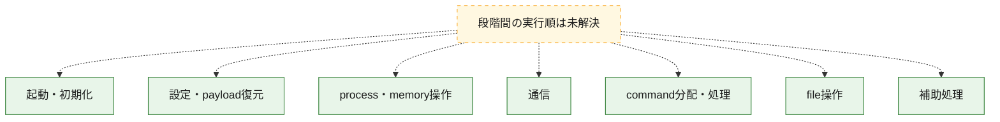
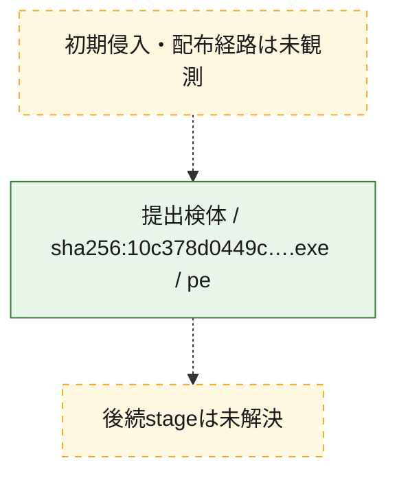
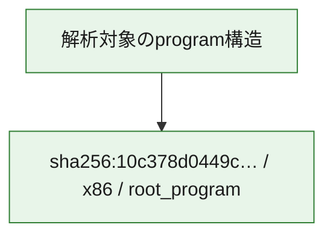

# 全体ロジック：10c378d0449cf7055587933980da9a48ad35a9f71543276573318a6b898c5734

代表関数の静的証跡から、起動・初期化、設定・payload復元、process・memory操作、通信、command分配・処理、file操作の処理群を確認しました。

## 読み方

- phaseの掲載順は解析上の整理順です。observed_call_edgesがない段階間の実行順を断定しません。
- 図の実線は静的に観測した関係、点線と黄色のノードは未観測・未解決の関係を示します。
- 図は静的な要約であり、動的実行を再現するものではありません。
- 詳細な関数解説とfingerprintは[STATIC-LOGIC.md](STATIC-LOGIC.md)を参照してください。

## 静的可視化

### 実行フロー

### 感染チェーン

### モジュール関係

## 処理段階

### 1. 起動・初期化

entry pointから初期化と後続処理への移行を確認します。
確度: `confirmed_static_function_evidence_with_limits`

- `10c378d0449cf7055587933980da9a48ad35a9f71543276573318a6b898c5734:ghidra:004a2ac0` — 初期化と主要処理への分岐を行う入口関数です。 状態: `succeeded`、選定理由: `entry_point`, `meaningful_symbol_name`, `probable_go_main_user_code`, `reviewed_call_centrality:4`, `role:entrypoint`
- `10c378d0449cf7055587933980da9a48ad35a9f71543276573318a6b898c5734:ghidra:004a2e40` — 初期化と主要処理への分岐を行う入口関数です。 状態: `succeeded`、選定理由: `entry_point`, `meaningful_symbol_name`, `probable_go_main_user_code`, `reviewed_call_centrality:4`, `role:entrypoint`
- `10c378d0449cf7055587933980da9a48ad35a9f71543276573318a6b898c5734:ghidra:004a2ee0` — 初期化と主要処理への分岐を行う入口関数です。 状態: `succeeded`、選定理由: `entry_point`, `meaningful_symbol_name`, `probable_go_main_user_code`, `reviewed_call_centrality:26`, `role:entrypoint`
- `10c378d0449cf7055587933980da9a48ad35a9f71543276573318a6b898c5734:ghidra:004a7420` — 初期化と主要処理への分岐を行う入口関数です。 状態: `succeeded`、選定理由: `entry_point`, `meaningful_symbol_name`, `probable_go_main_user_code`, `reviewed_call_centrality:24`, `role:entrypoint`
- `10c378d0449cf7055587933980da9a48ad35a9f71543276573318a6b898c5734:ghidra:004a8260` — 初期化と主要処理への分岐を行う入口関数です。 状態: `succeeded`、選定理由: `entry_point`, `meaningful_symbol_name`, `probable_go_main_user_code`, `reviewed_call_centrality:24`, `role:entrypoint`
- `10c378d0449cf7055587933980da9a48ad35a9f71543276573318a6b898c5734:ghidra:004aac00` — 初期化と主要処理への分岐を行う入口関数です。 状態: `failed`、選定理由: `entry_point`, `meaningful_symbol_name`, `probable_go_main_user_code`, `role:entrypoint`
- `10c378d0449cf7055587933980da9a48ad35a9f71543276573318a6b898c5734:ghidra:004b3600` — 初期化と主要処理への分岐を行う入口関数です。 状態: `succeeded`、選定理由: `entry_point`, `meaningful_symbol_name`, `probable_go_main_user_code`, `reviewed_call_centrality:26`, `role:entrypoint`
- `10c378d0449cf7055587933980da9a48ad35a9f71543276573318a6b898c5734:ghidra:004b4420` — 初期化と主要処理への分岐を行う入口関数です。 状態: `succeeded`、選定理由: `entry_point`, `meaningful_symbol_name`, `probable_go_main_user_code`, `reviewed_call_centrality:24`, `role:entrypoint`
- `10c378d0449cf7055587933980da9a48ad35a9f71543276573318a6b898c5734:ghidra:004b51e0` — 初期化と主要処理への分岐を行う入口関数です。 状態: `succeeded`、選定理由: `entry_point`, `meaningful_symbol_name`, `probable_go_main_user_code`, `reviewed_call_centrality:26`, `role:entrypoint`
- `10c378d0449cf7055587933980da9a48ad35a9f71543276573318a6b898c5734:ghidra:004b6080` — 初期化と主要処理への分岐を行う入口関数です。 状態: `succeeded`、選定理由: `entry_point`, `meaningful_symbol_name`, `probable_go_main_user_code`, `reviewed_call_centrality:24`, `role:entrypoint`
- `10c378d0449cf7055587933980da9a48ad35a9f71543276573318a6b898c5734:ghidra:004b6e60` — 初期化と主要処理への分岐を行う入口関数です。 状態: `failed`、選定理由: `entry_point`, `meaningful_symbol_name`, `probable_go_main_user_code`, `role:entrypoint`
- `10c378d0449cf7055587933980da9a48ad35a9f71543276573318a6b898c5734:ghidra:004beb40` — 初期化と主要処理への分岐を行う入口関数です。 状態: `failed`、選定理由: `entry_point`, `meaningful_symbol_name`, `probable_go_main_user_code`, `role:entrypoint`
- `10c378d0449cf7055587933980da9a48ad35a9f71543276573318a6b898c5734:ghidra:004c66a0` — 初期化と主要処理への分岐を行う入口関数です。 状態: `failed`、選定理由: `entry_point`, `meaningful_symbol_name`, `probable_go_main_user_code`, `role:entrypoint`
- `10c378d0449cf7055587933980da9a48ad35a9f71543276573318a6b898c5734:ghidra:004cd480` — 初期化と主要処理への分岐を行う入口関数です。 状態: `failed`、選定理由: `entry_point`, `meaningful_symbol_name`, `probable_go_main_user_code`, `role:entrypoint`
- `10c378d0449cf7055587933980da9a48ad35a9f71543276573318a6b898c5734:ghidra:004d7b80` — 初期化と主要処理への分岐を行う入口関数です。 状態: `failed`、選定理由: `entry_point`, `meaningful_symbol_name`, `probable_go_main_user_code`, `role:entrypoint`
- `10c378d0449cf7055587933980da9a48ad35a9f71543276573318a6b898c5734:ghidra:004e07c0` — 初期化と主要処理への分岐を行う入口関数です。 状態: `failed`、選定理由: `entry_point`, `meaningful_symbol_name`, `probable_go_main_user_code`, `role:entrypoint`
- `10c378d0449cf7055587933980da9a48ad35a9f71543276573318a6b898c5734:ghidra:004e9180` — 初期化と主要処理への分岐を行う入口関数です。 状態: `succeeded`、選定理由: `entry_point`, `meaningful_symbol_name`, `probable_go_main_user_code`, `reviewed_call_centrality:24`, `role:entrypoint`
- `10c378d0449cf7055587933980da9a48ad35a9f71543276573318a6b898c5734:ghidra:004ed600` — 初期化と主要処理への分岐を行う入口関数です。 状態: `failed`、選定理由: `entry_point`, `meaningful_symbol_name`, `probable_go_main_user_code`, `role:entrypoint`
- `10c378d0449cf7055587933980da9a48ad35a9f71543276573318a6b898c5734:ghidra:004f52c0` — 初期化と主要処理への分岐を行う入口関数です。 状態: `failed`、選定理由: `entry_point`, `meaningful_symbol_name`, `probable_go_main_user_code`, `role:entrypoint`
- `10c378d0449cf7055587933980da9a48ad35a9f71543276573318a6b898c5734:ghidra:00514040` — 初期化と主要処理への分岐を行う入口関数です。 状態: `succeeded`、選定理由: `entry_point`, `meaningful_symbol_name`, `probable_go_main_user_code`, `reviewed_call_centrality:25`, `role:entrypoint`
- `10c378d0449cf7055587933980da9a48ad35a9f71543276573318a6b898c5734:ghidra:00518600` — 初期化と主要処理への分岐を行う入口関数です。 状態: `succeeded`、選定理由: `entry_point`, `meaningful_symbol_name`, `probable_go_main_user_code`, `reviewed_call_centrality:25`, `role:entrypoint`
- `10c378d0449cf7055587933980da9a48ad35a9f71543276573318a6b898c5734:ghidra:0051bde0` — 初期化と主要処理への分岐を行う入口関数です。 状態: `failed`、選定理由: `entry_point`, `meaningful_symbol_name`, `probable_go_main_user_code`, `role:entrypoint`
- `10c378d0449cf7055587933980da9a48ad35a9f71543276573318a6b898c5734:ghidra:00525600` — 初期化と主要処理への分岐を行う入口関数です。 状態: `succeeded`、選定理由: `entry_point`, `meaningful_symbol_name`, `probable_go_main_user_code`, `reviewed_call_centrality:26`, `role:entrypoint`
- `10c378d0449cf7055587933980da9a48ad35a9f71543276573318a6b898c5734:ghidra:00529b20` — 初期化と主要処理への分岐を行う入口関数です。 状態: `succeeded`、選定理由: `entry_point`, `meaningful_symbol_name`, `probable_go_main_user_code`, `reviewed_call_centrality:24`, `role:entrypoint`

### 2. 設定・payload復元

設定、resource、payload、暗号化データの復元・変換を確認します。
確度: `confirmed_static_function_evidence`

- `10c378d0449cf7055587933980da9a48ad35a9f71543276573318a6b898c5734:ghidra:00474d40` — 設定、resource、payloadなどの解析・変換を行う関数です。 状態: `succeeded`、選定理由: `meaningful_symbol_name`, `reviewed_call_centrality:4`, `role:config_or_data_transform`
- `10c378d0449cf7055587933980da9a48ad35a9f71543276573318a6b898c5734:ghidra:0047be80` — 暗号、hash、encoding、または復号処理に関係する関数です。 状態: `succeeded`、選定理由: `meaningful_symbol_name`, `reviewed_call_centrality:7`, `role:cryptographic_transform`

### 3. process・memory操作

process、thread、module、memory操作と実行移行を確認します。
確度: `confirmed_static_function_evidence`

- `10c378d0449cf7055587933980da9a48ad35a9f71543276573318a6b898c5734:ghidra:00467fe0` — process、thread、module、またはmemory操作に関係する関数です。 状態: `succeeded`、選定理由: `meaningful_symbol_name`, `reviewed_call_centrality:3`, `role:process_or_memory_operation`

### 4. 通信

通信初期化、endpoint処理、送受信の役割を確認します。
確度: `confirmed_static_function_evidence`

- `10c378d0449cf7055587933980da9a48ad35a9f71543276573318a6b898c5734:ghidra:00490a00` — 通信初期化、送受信、またはendpoint処理に関係する関数です。 状態: `succeeded`、選定理由: `meaningful_symbol_name`, `reviewed_call_centrality:6`, `role:network_communication`

### 5. command分配・処理

受信commandやtaskの解釈、分配、個別handlerへの移行を確認します。
確度: `confirmed_static_function_evidence`

- `10c378d0449cf7055587933980da9a48ad35a9f71543276573318a6b898c5734:ghidra:0048fc60` — commandの解釈、分配、または個別処理を担当する関数です。 状態: `succeeded`、選定理由: `meaningful_symbol_name`, `reviewed_call_centrality:5`, `role:command_dispatch_or_handler`

### 6. file操作

fileやdirectoryの作成、読書き、削除を確認します。
確度: `confirmed_static_function_evidence`

- `10c378d0449cf7055587933980da9a48ad35a9f71543276573318a6b898c5734:ghidra:004904c0` — fileまたはdirectoryの読書き・管理に関係する関数です。 状態: `succeeded`、選定理由: `meaningful_symbol_name`, `reviewed_call_centrality:6`, `role:file_operation`

### 7. 補助処理

主要処理を支える一般内部関数またはlibrary処理を確認します。
確度: `confirmed_static_function_evidence`

- `10c378d0449cf7055587933980da9a48ad35a9f71543276573318a6b898c5734:ghidra:00401080` — compiler生成処理または汎用library処理とみられる関数です。 状態: `succeeded`、選定理由: `meaningful_symbol_name`, `reviewed_call_centrality:3`
- `10c378d0449cf7055587933980da9a48ad35a9f71543276573318a6b898c5734:ghidra:004607c0` — 検体内部の一般処理を実装する関数です。 状態: `succeeded`、選定理由: `meaningful_symbol_name`, `reviewed_call_centrality:3`

## 観測したcall関係

- `ghidra-function:1cb8758f339708ce51433b9e` → `ghidra-external:3dcee0d325184c06ca8f54a7` （`unclassified` → `unclassified`）
- `ghidra-function:1cb8758f339708ce51433b9e` → `ghidra-external:4031be1021cfb5f351904aec` （`unclassified` → `unclassified`）
- `ghidra-function:1cb8758f339708ce51433b9e` → `ghidra-external:57288006e514e6f934eb5179` （`unclassified` → `unclassified`）
- `ghidra-function:1cb8758f339708ce51433b9e` → `ghidra-external:ee1bcd42d65d7c75c3374bf7` （`unclassified` → `unclassified`）
- `ghidra-function:2b4588cb0d4f522b4701a156` → `ghidra-external:06660f1aedff537b211d663d` （`unclassified` → `unclassified`）
- `ghidra-function:2b4588cb0d4f522b4701a156` → `ghidra-external:131577f8332d0e26d4606e16` （`unclassified` → `unclassified`）
- `ghidra-function:2b4588cb0d4f522b4701a156` → `ghidra-external:6f5a989e8749224b4803fcd6` （`unclassified` → `unclassified`）
- `ghidra-function:2b4588cb0d4f522b4701a156` → `ghidra-external:a7898c5554cd12a1021c3b96` （`unclassified` → `unclassified`）
- `ghidra-function:35b47deac78680d0cf3f42f4` → `ghidra-external:0877ad4edc67d5d41f95188c` （`unclassified` → `unclassified`）
- `ghidra-function:35b47deac78680d0cf3f42f4` → `ghidra-external:131577f8332d0e26d4606e16` （`unclassified` → `unclassified`）
- `ghidra-function:35b47deac78680d0cf3f42f4` → `ghidra-external:2ac2e99714319e39653c87ef` （`unclassified` → `unclassified`）
- `ghidra-function:35b47deac78680d0cf3f42f4` → `ghidra-external:34011446b37d996ba1268c99` （`unclassified` → `unclassified`）
- `ghidra-function:35b47deac78680d0cf3f42f4` → `ghidra-external:36b06235b1169ab7469ba07e` （`unclassified` → `unclassified`）
- `ghidra-function:35b47deac78680d0cf3f42f4` → `ghidra-external:41be267363139b1b5facc249` （`unclassified` → `unclassified`）
- `ghidra-function:35b47deac78680d0cf3f42f4` → `ghidra-external:4dfd87af11e33325fd3364f5` （`unclassified` → `unclassified`）
- `ghidra-function:35b47deac78680d0cf3f42f4` → `ghidra-external:55d84b65c19b55a9877b97d8` （`unclassified` → `unclassified`）
- `ghidra-function:35b47deac78680d0cf3f42f4` → `ghidra-external:5b22d1f3547ef0812ef4dda2` （`unclassified` → `unclassified`）
- `ghidra-function:35b47deac78680d0cf3f42f4` → `ghidra-external:6fde4af2a42096ba9e96541e` （`unclassified` → `unclassified`）
- `ghidra-function:35b47deac78680d0cf3f42f4` → `ghidra-external:7948f304c8fb7c06e12c30bc` （`unclassified` → `unclassified`）
- `ghidra-function:35b47deac78680d0cf3f42f4` → `ghidra-external:79cd1c736394d1e34033d8a6` （`unclassified` → `unclassified`）
- `ghidra-function:35b47deac78680d0cf3f42f4` → `ghidra-external:814b5214c7957c75df7cd126` （`unclassified` → `unclassified`）
- `ghidra-function:35b47deac78680d0cf3f42f4` → `ghidra-external:9d76363ea653c3d4d615a1f9` （`unclassified` → `unclassified`）
- `ghidra-function:35b47deac78680d0cf3f42f4` → `ghidra-external:ab9fcd46040e8ac3b257b9b0` （`unclassified` → `unclassified`）
- `ghidra-function:35b47deac78680d0cf3f42f4` → `ghidra-external:c1010e2d01a1e120373a54fc` （`unclassified` → `unclassified`）
- `ghidra-function:35b47deac78680d0cf3f42f4` → `ghidra-external:c2294098187eb38f297ff81f` （`unclassified` → `unclassified`）
- `ghidra-function:35b47deac78680d0cf3f42f4` → `ghidra-external:c253c8cce071bfc1b556e316` （`unclassified` → `unclassified`）
- `ghidra-function:35b47deac78680d0cf3f42f4` → `ghidra-external:cf7f5cd08ddee1937eeff3cb` （`unclassified` → `unclassified`）
- `ghidra-function:35b47deac78680d0cf3f42f4` → `ghidra-external:d29b9cae8018cdbd7bdb720a` （`unclassified` → `unclassified`）
- `ghidra-function:35b47deac78680d0cf3f42f4` → `ghidra-external:d4c0657bea76817d0c57c066` （`unclassified` → `unclassified`）
- `ghidra-function:35b47deac78680d0cf3f42f4` → `ghidra-external:d91cb7896c7176198ea63e66` （`unclassified` → `unclassified`）
- `ghidra-function:35b47deac78680d0cf3f42f4` → `ghidra-external:ee1bcd42d65d7c75c3374bf7` （`unclassified` → `unclassified`）
- `ghidra-function:35b47deac78680d0cf3f42f4` → `ghidra-external:f796c8a9f2278afe0d1766bb` （`unclassified` → `unclassified`）
- `ghidra-function:38d597141e527be400a6c610` → `ghidra-external:0877ad4edc67d5d41f95188c` （`unclassified` → `unclassified`）
- `ghidra-function:38d597141e527be400a6c610` → `ghidra-external:131577f8332d0e26d4606e16` （`unclassified` → `unclassified`）
- `ghidra-function:38d597141e527be400a6c610` → `ghidra-external:2ac2e99714319e39653c87ef` （`unclassified` → `unclassified`）
- `ghidra-function:38d597141e527be400a6c610` → `ghidra-external:36b06235b1169ab7469ba07e` （`unclassified` → `unclassified`）
- `ghidra-function:38d597141e527be400a6c610` → `ghidra-external:41be267363139b1b5facc249` （`unclassified` → `unclassified`）
- `ghidra-function:38d597141e527be400a6c610` → `ghidra-external:4dfd87af11e33325fd3364f5` （`unclassified` → `unclassified`）
- `ghidra-function:38d597141e527be400a6c610` → `ghidra-external:55d84b65c19b55a9877b97d8` （`unclassified` → `unclassified`）
- `ghidra-function:38d597141e527be400a6c610` → `ghidra-external:5b22d1f3547ef0812ef4dda2` （`unclassified` → `unclassified`）
- `ghidra-function:38d597141e527be400a6c610` → `ghidra-external:6fde4af2a42096ba9e96541e` （`unclassified` → `unclassified`）
- `ghidra-function:38d597141e527be400a6c610` → `ghidra-external:7948f304c8fb7c06e12c30bc` （`unclassified` → `unclassified`）
- `ghidra-function:38d597141e527be400a6c610` → `ghidra-external:79cd1c736394d1e34033d8a6` （`unclassified` → `unclassified`）
- `ghidra-function:38d597141e527be400a6c610` → `ghidra-external:814b5214c7957c75df7cd126` （`unclassified` → `unclassified`）
- `ghidra-function:38d597141e527be400a6c610` → `ghidra-external:896f3758630ffabc8fb5bf9c` （`unclassified` → `unclassified`）
- `ghidra-function:38d597141e527be400a6c610` → `ghidra-external:9d76363ea653c3d4d615a1f9` （`unclassified` → `unclassified`）
- `ghidra-function:38d597141e527be400a6c610` → `ghidra-external:ab9fcd46040e8ac3b257b9b0` （`unclassified` → `unclassified`）
- `ghidra-function:38d597141e527be400a6c610` → `ghidra-external:c1010e2d01a1e120373a54fc` （`unclassified` → `unclassified`）
- `ghidra-function:38d597141e527be400a6c610` → `ghidra-external:c2294098187eb38f297ff81f` （`unclassified` → `unclassified`）
- `ghidra-function:38d597141e527be400a6c610` → `ghidra-external:c253c8cce071bfc1b556e316` （`unclassified` → `unclassified`）
- `ghidra-function:38d597141e527be400a6c610` → `ghidra-external:cf7f5cd08ddee1937eeff3cb` （`unclassified` → `unclassified`）
- `ghidra-function:38d597141e527be400a6c610` → `ghidra-external:d29b9cae8018cdbd7bdb720a` （`unclassified` → `unclassified`）
- `ghidra-function:38d597141e527be400a6c610` → `ghidra-external:d4c0657bea76817d0c57c066` （`unclassified` → `unclassified`）
- `ghidra-function:38d597141e527be400a6c610` → `ghidra-external:d5822f7d6efec901dce755ad` （`unclassified` → `unclassified`）
- `ghidra-function:38d597141e527be400a6c610` → `ghidra-external:d91cb7896c7176198ea63e66` （`unclassified` → `unclassified`）
- `ghidra-function:38d597141e527be400a6c610` → `ghidra-external:ee1bcd42d65d7c75c3374bf7` （`unclassified` → `unclassified`）
- `ghidra-function:38d597141e527be400a6c610` → `ghidra-external:f796c8a9f2278afe0d1766bb` （`unclassified` → `unclassified`）
- `ghidra-function:399b4b5d3e48adae66946f59` → `ghidra-external:011f3cfc8444fddffcdcce7b` （`unclassified` → `unclassified`）
- `ghidra-function:399b4b5d3e48adae66946f59` → `ghidra-external:1eb8e0056292d598e8b30e9a` （`unclassified` → `unclassified`）
- `ghidra-function:399b4b5d3e48adae66946f59` → `ghidra-external:35f302b90cb8f971c233072d` （`unclassified` → `unclassified`）
- `ghidra-function:399b4b5d3e48adae66946f59` → `ghidra-external:a603398db0880aac78360096` （`unclassified` → `unclassified`）
- `ghidra-function:399b4b5d3e48adae66946f59` → `ghidra-external:e75951166edb754c60fb44d2` （`unclassified` → `unclassified`）
- `ghidra-function:399b4b5d3e48adae66946f59` → `ghidra-external:ee1bcd42d65d7c75c3374bf7` （`unclassified` → `unclassified`）
- `ghidra-function:399b4b5d3e48adae66946f59` → `ghidra-external:fa254ac3facc003350752715` （`unclassified` → `unclassified`）
- `ghidra-function:3bacbbc6657ab59e71a67c23` → `ghidra-external:0877ad4edc67d5d41f95188c` （`unclassified` → `unclassified`）
- `ghidra-function:3bacbbc6657ab59e71a67c23` → `ghidra-external:131577f8332d0e26d4606e16` （`unclassified` → `unclassified`）
- `ghidra-function:3bacbbc6657ab59e71a67c23` → `ghidra-external:260da642b93788a47f88dc12` （`unclassified` → `unclassified`）
- `ghidra-function:3bacbbc6657ab59e71a67c23` → `ghidra-external:2ac2e99714319e39653c87ef` （`unclassified` → `unclassified`）
- `ghidra-function:3bacbbc6657ab59e71a67c23` → `ghidra-external:36b06235b1169ab7469ba07e` （`unclassified` → `unclassified`）
- `ghidra-function:3bacbbc6657ab59e71a67c23` → `ghidra-external:41be267363139b1b5facc249` （`unclassified` → `unclassified`）
- `ghidra-function:3bacbbc6657ab59e71a67c23` → `ghidra-external:4dfd87af11e33325fd3364f5` （`unclassified` → `unclassified`）
- `ghidra-function:3bacbbc6657ab59e71a67c23` → `ghidra-external:55d84b65c19b55a9877b97d8` （`unclassified` → `unclassified`）
- `ghidra-function:3bacbbc6657ab59e71a67c23` → `ghidra-external:5b22d1f3547ef0812ef4dda2` （`unclassified` → `unclassified`）
- `ghidra-function:3bacbbc6657ab59e71a67c23` → `ghidra-external:6fde4af2a42096ba9e96541e` （`unclassified` → `unclassified`）
- `ghidra-function:3bacbbc6657ab59e71a67c23` → `ghidra-external:7948f304c8fb7c06e12c30bc` （`unclassified` → `unclassified`）
- `ghidra-function:3bacbbc6657ab59e71a67c23` → `ghidra-external:79cd1c736394d1e34033d8a6` （`unclassified` → `unclassified`）
- `ghidra-function:3bacbbc6657ab59e71a67c23` → `ghidra-external:7cd71b37d05e066dedfb960d` （`unclassified` → `unclassified`）
- `ghidra-function:3bacbbc6657ab59e71a67c23` → `ghidra-external:814b5214c7957c75df7cd126` （`unclassified` → `unclassified`）
- `ghidra-function:3bacbbc6657ab59e71a67c23` → `ghidra-external:9d76363ea653c3d4d615a1f9` （`unclassified` → `unclassified`）
- `ghidra-function:3bacbbc6657ab59e71a67c23` → `ghidra-external:ab9fcd46040e8ac3b257b9b0` （`unclassified` → `unclassified`）
- `ghidra-function:3bacbbc6657ab59e71a67c23` → `ghidra-external:c1010e2d01a1e120373a54fc` （`unclassified` → `unclassified`）
- `ghidra-function:3bacbbc6657ab59e71a67c23` → `ghidra-external:c2294098187eb38f297ff81f` （`unclassified` → `unclassified`）
- `ghidra-function:3bacbbc6657ab59e71a67c23` → `ghidra-external:c253c8cce071bfc1b556e316` （`unclassified` → `unclassified`）
- `ghidra-function:3bacbbc6657ab59e71a67c23` → `ghidra-external:cf7f5cd08ddee1937eeff3cb` （`unclassified` → `unclassified`）
- `ghidra-function:3bacbbc6657ab59e71a67c23` → `ghidra-external:cfa9ab1fec7e581cfaf672ec` （`unclassified` → `unclassified`）
- `ghidra-function:3bacbbc6657ab59e71a67c23` → `ghidra-external:d29b9cae8018cdbd7bdb720a` （`unclassified` → `unclassified`）
- `ghidra-function:3bacbbc6657ab59e71a67c23` → `ghidra-external:d4c0657bea76817d0c57c066` （`unclassified` → `unclassified`）
- `ghidra-function:3bacbbc6657ab59e71a67c23` → `ghidra-external:d91cb7896c7176198ea63e66` （`unclassified` → `unclassified`）
- `ghidra-function:3bacbbc6657ab59e71a67c23` → `ghidra-external:ee1bcd42d65d7c75c3374bf7` （`unclassified` → `unclassified`）
- `ghidra-function:3bacbbc6657ab59e71a67c23` → `ghidra-external:f796c8a9f2278afe0d1766bb` （`unclassified` → `unclassified`）
- `ghidra-function:3eec2c1b41bda30c8291423b` → `ghidra-external:0877ad4edc67d5d41f95188c` （`unclassified` → `unclassified`）
- `ghidra-function:3eec2c1b41bda30c8291423b` → `ghidra-external:131577f8332d0e26d4606e16` （`unclassified` → `unclassified`）
- `ghidra-function:3eec2c1b41bda30c8291423b` → `ghidra-external:2ac2e99714319e39653c87ef` （`unclassified` → `unclassified`）
- `ghidra-function:3eec2c1b41bda30c8291423b` → `ghidra-external:36b06235b1169ab7469ba07e` （`unclassified` → `unclassified`）
- `ghidra-function:3eec2c1b41bda30c8291423b` → `ghidra-external:41be267363139b1b5facc249` （`unclassified` → `unclassified`）
- `ghidra-function:3eec2c1b41bda30c8291423b` → `ghidra-external:4dfd87af11e33325fd3364f5` （`unclassified` → `unclassified`）
- `ghidra-function:3eec2c1b41bda30c8291423b` → `ghidra-external:55d84b65c19b55a9877b97d8` （`unclassified` → `unclassified`）
- `ghidra-function:3eec2c1b41bda30c8291423b` → `ghidra-external:5b22d1f3547ef0812ef4dda2` （`unclassified` → `unclassified`）
- `ghidra-function:3eec2c1b41bda30c8291423b` → `ghidra-external:6fde4af2a42096ba9e96541e` （`unclassified` → `unclassified`）
- `ghidra-function:3eec2c1b41bda30c8291423b` → `ghidra-external:7948f304c8fb7c06e12c30bc` （`unclassified` → `unclassified`）
- `ghidra-function:3eec2c1b41bda30c8291423b` → `ghidra-external:79cd1c736394d1e34033d8a6` （`unclassified` → `unclassified`）
- `ghidra-function:3eec2c1b41bda30c8291423b` → `ghidra-external:7feccf6daecf5b12ad553530` （`unclassified` → `unclassified`）
- `ghidra-function:3eec2c1b41bda30c8291423b` → `ghidra-external:814b5214c7957c75df7cd126` （`unclassified` → `unclassified`）
- `ghidra-function:3eec2c1b41bda30c8291423b` → `ghidra-external:9d76363ea653c3d4d615a1f9` （`unclassified` → `unclassified`）
- `ghidra-function:3eec2c1b41bda30c8291423b` → `ghidra-external:a16f3e24e3ab5a6599c598d0` （`unclassified` → `unclassified`）
- `ghidra-function:3eec2c1b41bda30c8291423b` → `ghidra-external:ab9fcd46040e8ac3b257b9b0` （`unclassified` → `unclassified`）
- `ghidra-function:3eec2c1b41bda30c8291423b` → `ghidra-external:bb7b2a4cfaa6556eba2d60c8` （`unclassified` → `unclassified`）
- `ghidra-function:3eec2c1b41bda30c8291423b` → `ghidra-external:c1010e2d01a1e120373a54fc` （`unclassified` → `unclassified`）
- `ghidra-function:3eec2c1b41bda30c8291423b` → `ghidra-external:c2294098187eb38f297ff81f` （`unclassified` → `unclassified`）
- `ghidra-function:3eec2c1b41bda30c8291423b` → `ghidra-external:c253c8cce071bfc1b556e316` （`unclassified` → `unclassified`）
- `ghidra-function:3eec2c1b41bda30c8291423b` → `ghidra-external:cf7f5cd08ddee1937eeff3cb` （`unclassified` → `unclassified`）
- `ghidra-function:3eec2c1b41bda30c8291423b` → `ghidra-external:d29b9cae8018cdbd7bdb720a` （`unclassified` → `unclassified`）
- `ghidra-function:3eec2c1b41bda30c8291423b` → `ghidra-external:d4c0657bea76817d0c57c066` （`unclassified` → `unclassified`）
- `ghidra-function:3eec2c1b41bda30c8291423b` → `ghidra-external:d91cb7896c7176198ea63e66` （`unclassified` → `unclassified`）
- `ghidra-function:3eec2c1b41bda30c8291423b` → `ghidra-external:ee1bcd42d65d7c75c3374bf7` （`unclassified` → `unclassified`）
- `ghidra-function:3eec2c1b41bda30c8291423b` → `ghidra-external:f796c8a9f2278afe0d1766bb` （`unclassified` → `unclassified`）
- `ghidra-function:430bcbddd8f578997c8f1ef4` → `ghidra-external:0877ad4edc67d5d41f95188c` （`unclassified` → `unclassified`）
- `ghidra-function:430bcbddd8f578997c8f1ef4` → `ghidra-external:131577f8332d0e26d4606e16` （`unclassified` → `unclassified`）
- `ghidra-function:430bcbddd8f578997c8f1ef4` → `ghidra-external:2ac2e99714319e39653c87ef` （`unclassified` → `unclassified`）
- `ghidra-function:430bcbddd8f578997c8f1ef4` → `ghidra-external:36b06235b1169ab7469ba07e` （`unclassified` → `unclassified`）
- `ghidra-function:430bcbddd8f578997c8f1ef4` → `ghidra-external:41be267363139b1b5facc249` （`unclassified` → `unclassified`）
- `ghidra-function:430bcbddd8f578997c8f1ef4` → `ghidra-external:4dfd87af11e33325fd3364f5` （`unclassified` → `unclassified`）
- `ghidra-function:430bcbddd8f578997c8f1ef4` → `ghidra-external:55d84b65c19b55a9877b97d8` （`unclassified` → `unclassified`）
- `ghidra-function:430bcbddd8f578997c8f1ef4` → `ghidra-external:5b22d1f3547ef0812ef4dda2` （`unclassified` → `unclassified`）
- `ghidra-function:430bcbddd8f578997c8f1ef4` → `ghidra-external:6fde4af2a42096ba9e96541e` （`unclassified` → `unclassified`）
- `ghidra-function:430bcbddd8f578997c8f1ef4` → `ghidra-external:7948f304c8fb7c06e12c30bc` （`unclassified` → `unclassified`）
- `ghidra-function:430bcbddd8f578997c8f1ef4` → `ghidra-external:79cd1c736394d1e34033d8a6` （`unclassified` → `unclassified`）
- `ghidra-function:430bcbddd8f578997c8f1ef4` → `ghidra-external:814b5214c7957c75df7cd126` （`unclassified` → `unclassified`）
- `ghidra-function:430bcbddd8f578997c8f1ef4` → `ghidra-external:9d76363ea653c3d4d615a1f9` （`unclassified` → `unclassified`）
- `ghidra-function:430bcbddd8f578997c8f1ef4` → `ghidra-external:ab9fcd46040e8ac3b257b9b0` （`unclassified` → `unclassified`）
- `ghidra-function:430bcbddd8f578997c8f1ef4` → `ghidra-external:c1010e2d01a1e120373a54fc` （`unclassified` → `unclassified`）
- `ghidra-function:430bcbddd8f578997c8f1ef4` → `ghidra-external:c2294098187eb38f297ff81f` （`unclassified` → `unclassified`）
- `ghidra-function:430bcbddd8f578997c8f1ef4` → `ghidra-external:c253c8cce071bfc1b556e316` （`unclassified` → `unclassified`）
- `ghidra-function:430bcbddd8f578997c8f1ef4` → `ghidra-external:cf7f5cd08ddee1937eeff3cb` （`unclassified` → `unclassified`）
- `ghidra-function:430bcbddd8f578997c8f1ef4` → `ghidra-external:d29b9cae8018cdbd7bdb720a` （`unclassified` → `unclassified`）
- `ghidra-function:430bcbddd8f578997c8f1ef4` → `ghidra-external:d4c0657bea76817d0c57c066` （`unclassified` → `unclassified`）
- `ghidra-function:430bcbddd8f578997c8f1ef4` → `ghidra-external:d7e387cbfedad41510ea7f10` （`unclassified` → `unclassified`）
- `ghidra-function:430bcbddd8f578997c8f1ef4` → `ghidra-external:d91cb7896c7176198ea63e66` （`unclassified` → `unclassified`）
- `ghidra-function:430bcbddd8f578997c8f1ef4` → `ghidra-external:ee1bcd42d65d7c75c3374bf7` （`unclassified` → `unclassified`）
- `ghidra-function:430bcbddd8f578997c8f1ef4` → `ghidra-external:f796c8a9f2278afe0d1766bb` （`unclassified` → `unclassified`）
- `ghidra-function:50753b6cd3f18e623e348009` → `ghidra-external:2b5d841c0261af74ec842105` （`unclassified` → `unclassified`）
- `ghidra-function:50753b6cd3f18e623e348009` → `ghidra-external:50b9c086250a8ebbc4bc820e` （`unclassified` → `unclassified`）
- `ghidra-function:50753b6cd3f18e623e348009` → `ghidra-external:5160f6f9544d6ba5b304729b` （`unclassified` → `unclassified`）
- `ghidra-function:50753b6cd3f18e623e348009` → `ghidra-external:52ad137032de89dd09db95f2` （`unclassified` → `unclassified`）
- `ghidra-function:50753b6cd3f18e623e348009` → `ghidra-external:a16f3e24e3ab5a6599c598d0` （`unclassified` → `unclassified`）
- `ghidra-function:50753b6cd3f18e623e348009` → `ghidra-external:ee1bcd42d65d7c75c3374bf7` （`unclassified` → `unclassified`）
- `ghidra-function:62dd0ef710314bf3a364ccc3` → `ghidra-external:2b5d841c0261af74ec842105` （`unclassified` → `unclassified`）
- `ghidra-function:62dd0ef710314bf3a364ccc3` → `ghidra-external:4acda2077defd8056d5ac17c` （`unclassified` → `unclassified`）
- `ghidra-function:62dd0ef710314bf3a364ccc3` → `ghidra-external:52ad137032de89dd09db95f2` （`unclassified` → `unclassified`）
- `ghidra-function:62dd0ef710314bf3a364ccc3` → `ghidra-external:83a43c4295f6d8d78dbf83b6` （`unclassified` → `unclassified`）
- `ghidra-function:62dd0ef710314bf3a364ccc3` → `ghidra-external:a16f3e24e3ab5a6599c598d0` （`unclassified` → `unclassified`）
- `ghidra-function:62dd0ef710314bf3a364ccc3` → `ghidra-external:ee1bcd42d65d7c75c3374bf7` （`unclassified` → `unclassified`）
- `ghidra-function:6b9d6a9f9d3949c27112b239` → `ghidra-external:0877ad4edc67d5d41f95188c` （`unclassified` → `unclassified`）
- `ghidra-function:6b9d6a9f9d3949c27112b239` → `ghidra-external:131577f8332d0e26d4606e16` （`unclassified` → `unclassified`）
- `ghidra-function:6b9d6a9f9d3949c27112b239` → `ghidra-external:2ac2e99714319e39653c87ef` （`unclassified` → `unclassified`）
- `ghidra-function:6b9d6a9f9d3949c27112b239` → `ghidra-external:36b06235b1169ab7469ba07e` （`unclassified` → `unclassified`）
- `ghidra-function:6b9d6a9f9d3949c27112b239` → `ghidra-external:41be267363139b1b5facc249` （`unclassified` → `unclassified`）
- `ghidra-function:6b9d6a9f9d3949c27112b239` → `ghidra-external:4dfd87af11e33325fd3364f5` （`unclassified` → `unclassified`）
- `ghidra-function:6b9d6a9f9d3949c27112b239` → `ghidra-external:55d84b65c19b55a9877b97d8` （`unclassified` → `unclassified`）
- `ghidra-function:6b9d6a9f9d3949c27112b239` → `ghidra-external:5b22d1f3547ef0812ef4dda2` （`unclassified` → `unclassified`）
- `ghidra-function:6b9d6a9f9d3949c27112b239` → `ghidra-external:6fde4af2a42096ba9e96541e` （`unclassified` → `unclassified`）
- `ghidra-function:6b9d6a9f9d3949c27112b239` → `ghidra-external:7948f304c8fb7c06e12c30bc` （`unclassified` → `unclassified`）
- `ghidra-function:6b9d6a9f9d3949c27112b239` → `ghidra-external:79cd1c736394d1e34033d8a6` （`unclassified` → `unclassified`）
- `ghidra-function:6b9d6a9f9d3949c27112b239` → `ghidra-external:814b5214c7957c75df7cd126` （`unclassified` → `unclassified`）
- `ghidra-function:6b9d6a9f9d3949c27112b239` → `ghidra-external:896f3758630ffabc8fb5bf9c` （`unclassified` → `unclassified`）
- `ghidra-function:6b9d6a9f9d3949c27112b239` → `ghidra-external:9d76363ea653c3d4d615a1f9` （`unclassified` → `unclassified`）
- `ghidra-function:6b9d6a9f9d3949c27112b239` → `ghidra-external:ab9fcd46040e8ac3b257b9b0` （`unclassified` → `unclassified`）
- `ghidra-function:6b9d6a9f9d3949c27112b239` → `ghidra-external:c1010e2d01a1e120373a54fc` （`unclassified` → `unclassified`）
- `ghidra-function:6b9d6a9f9d3949c27112b239` → `ghidra-external:c2294098187eb38f297ff81f` （`unclassified` → `unclassified`）
- `ghidra-function:6b9d6a9f9d3949c27112b239` → `ghidra-external:c253c8cce071bfc1b556e316` （`unclassified` → `unclassified`）
- `ghidra-function:6b9d6a9f9d3949c27112b239` → `ghidra-external:cf7f5cd08ddee1937eeff3cb` （`unclassified` → `unclassified`）
- `ghidra-function:6b9d6a9f9d3949c27112b239` → `ghidra-external:d29b9cae8018cdbd7bdb720a` （`unclassified` → `unclassified`）
- `ghidra-function:6b9d6a9f9d3949c27112b239` → `ghidra-external:d4c0657bea76817d0c57c066` （`unclassified` → `unclassified`）
- `ghidra-function:6b9d6a9f9d3949c27112b239` → `ghidra-external:d91cb7896c7176198ea63e66` （`unclassified` → `unclassified`）
- `ghidra-function:6b9d6a9f9d3949c27112b239` → `ghidra-external:ee1bcd42d65d7c75c3374bf7` （`unclassified` → `unclassified`）
- `ghidra-function:6b9d6a9f9d3949c27112b239` → `ghidra-external:f796c8a9f2278afe0d1766bb` （`unclassified` → `unclassified`）
- `ghidra-function:7abad1076c8e653b63afbc23` → `ghidra-external:0877ad4edc67d5d41f95188c` （`unclassified` → `unclassified`）
- `ghidra-function:7abad1076c8e653b63afbc23` → `ghidra-external:131577f8332d0e26d4606e16` （`unclassified` → `unclassified`）
- `ghidra-function:7abad1076c8e653b63afbc23` → `ghidra-external:22fe70a49e30e8da03e23d31` （`unclassified` → `unclassified`）
- `ghidra-function:7abad1076c8e653b63afbc23` → `ghidra-external:2ac2e99714319e39653c87ef` （`unclassified` → `unclassified`）
- `ghidra-function:7abad1076c8e653b63afbc23` → `ghidra-external:2be8bc758a8eba13694a3ab8` （`unclassified` → `unclassified`）
- `ghidra-function:7abad1076c8e653b63afbc23` → `ghidra-external:36b06235b1169ab7469ba07e` （`unclassified` → `unclassified`）
- `ghidra-function:7abad1076c8e653b63afbc23` → `ghidra-external:41be267363139b1b5facc249` （`unclassified` → `unclassified`）
- `ghidra-function:7abad1076c8e653b63afbc23` → `ghidra-external:4dfd87af11e33325fd3364f5` （`unclassified` → `unclassified`）
- `ghidra-function:7abad1076c8e653b63afbc23` → `ghidra-external:55d84b65c19b55a9877b97d8` （`unclassified` → `unclassified`）
- `ghidra-function:7abad1076c8e653b63afbc23` → `ghidra-external:5b22d1f3547ef0812ef4dda2` （`unclassified` → `unclassified`）
- `ghidra-function:7abad1076c8e653b63afbc23` → `ghidra-external:6fde4af2a42096ba9e96541e` （`unclassified` → `unclassified`）
- `ghidra-function:7abad1076c8e653b63afbc23` → `ghidra-external:7948f304c8fb7c06e12c30bc` （`unclassified` → `unclassified`）
- `ghidra-function:7abad1076c8e653b63afbc23` → `ghidra-external:79cd1c736394d1e34033d8a6` （`unclassified` → `unclassified`）
- `ghidra-function:7abad1076c8e653b63afbc23` → `ghidra-external:7d2c7ce227a47e2b10448e0c` （`unclassified` → `unclassified`）
- `ghidra-function:7abad1076c8e653b63afbc23` → `ghidra-external:814b5214c7957c75df7cd126` （`unclassified` → `unclassified`）
- `ghidra-function:7abad1076c8e653b63afbc23` → `ghidra-external:9d76363ea653c3d4d615a1f9` （`unclassified` → `unclassified`）
- `ghidra-function:7abad1076c8e653b63afbc23` → `ghidra-external:ab9fcd46040e8ac3b257b9b0` （`unclassified` → `unclassified`）
- `ghidra-function:7abad1076c8e653b63afbc23` → `ghidra-external:c1010e2d01a1e120373a54fc` （`unclassified` → `unclassified`）
- `ghidra-function:7abad1076c8e653b63afbc23` → `ghidra-external:c2294098187eb38f297ff81f` （`unclassified` → `unclassified`）
- `ghidra-function:7abad1076c8e653b63afbc23` → `ghidra-external:c253c8cce071bfc1b556e316` （`unclassified` → `unclassified`）
- `ghidra-function:7abad1076c8e653b63afbc23` → `ghidra-external:cf7f5cd08ddee1937eeff3cb` （`unclassified` → `unclassified`）
- `ghidra-function:7abad1076c8e653b63afbc23` → `ghidra-external:d29b9cae8018cdbd7bdb720a` （`unclassified` → `unclassified`）
- `ghidra-function:7abad1076c8e653b63afbc23` → `ghidra-external:d4c0657bea76817d0c57c066` （`unclassified` → `unclassified`）
- `ghidra-function:7abad1076c8e653b63afbc23` → `ghidra-external:d91cb7896c7176198ea63e66` （`unclassified` → `unclassified`）
- 残り143件は`static-logic.json`に記録しています。

## 解析範囲と制約

- 選定外関数は全体inventoryへ残しますが、関数本体の個別解説対象にはしていません。
- indirect call、難読化、packer、VM、壊れたcontrol flowによりcall関係が欠落する場合があります。
- 文書は静的解析に基づき、検体実行や外部通信による動的確認は行っていません。
