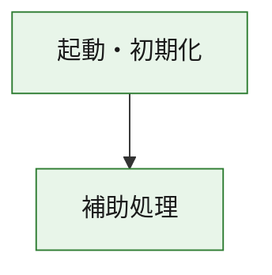
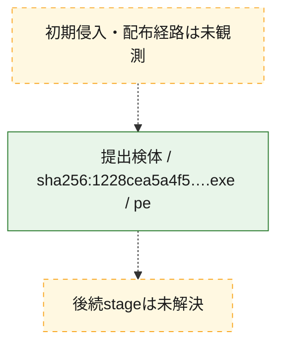
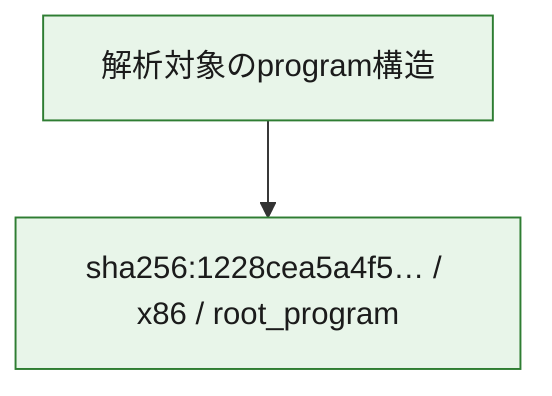

# 全体ロジック：1228cea5a4f51e5f7ba8ddd4fcbb5f04f903e20c4e5729ddf1b9d5f70e3f1cd1

代表関数の静的証跡から、起動・初期化の処理群を確認しました。

## 読み方

- phaseの掲載順は解析上の整理順です。observed_call_edgesがない段階間の実行順を断定しません。
- 図の実線は静的に観測した関係、点線と黄色のノードは未観測・未解決の関係を示します。
- 図は静的な要約であり、動的実行を再現するものではありません。
- 詳細な関数解説とfingerprintは[STATIC-LOGIC.md](STATIC-LOGIC.md)を参照してください。

## 静的可視化

### 実行フロー

### 感染チェーン

### モジュール関係

## 処理段階

### 1. 起動・初期化

entry pointから初期化と後続処理への移行を確認します。
確度: `confirmed_static_function_evidence`

- `1228cea5a4f51e5f7ba8ddd4fcbb5f04f903e20c4e5729ddf1b9d5f70e3f1cd1:ghidra:180001010` — 初期化と主要処理への分岐を行う入口関数です。 状態: `succeeded`、選定理由: `entry_point`, `meaningful_symbol_name`, `reviewed_call_centrality:22`, `role:entrypoint`, `small_program_complete_context`

### 2. 補助処理

主要処理を支える一般内部関数またはlibrary処理を確認します。
確度: `confirmed_static_function_evidence`

- `1228cea5a4f51e5f7ba8ddd4fcbb5f04f903e20c4e5729ddf1b9d5f70e3f1cd1:ghidra:180001240` — 検体内部の一般処理を実装する関数です。 状態: `succeeded`、選定理由: `context_representative`, `reviewed_call_centrality:2`, `small_program_complete_context`
- `1228cea5a4f51e5f7ba8ddd4fcbb5f04f903e20c4e5729ddf1b9d5f70e3f1cd1:ghidra:180001350` — 検体内部の一般処理を実装する関数です。 状態: `succeeded`、選定理由: `context_representative`, `reviewed_call_centrality:25`, `small_program_complete_context`
- `1228cea5a4f51e5f7ba8ddd4fcbb5f04f903e20c4e5729ddf1b9d5f70e3f1cd1:ghidra:180003780` — 検体内部の一般処理を実装する関数です。 状態: `succeeded`、選定理由: `context_representative`, `reviewed_call_centrality:2`, `small_program_complete_context`
- `1228cea5a4f51e5f7ba8ddd4fcbb5f04f903e20c4e5729ddf1b9d5f70e3f1cd1:ghidra:1800038e0` — 検体内部の一般処理を実装する関数です。 状態: `succeeded`、選定理由: `context_representative`, `reviewed_call_centrality:2`, `small_program_complete_context`

## 観測したcall関係

- `1228cea5a4f51e5f7ba8ddd4fcbb5f04f903e20c4e5729ddf1b9d5f70e3f1cd1:ghidra:180001010` → `1228cea5a4f51e5f7ba8ddd4fcbb5f04f903e20c4e5729ddf1b9d5f70e3f1cd1:ghidra:180001240` （`startup` → `support`）
- `1228cea5a4f51e5f7ba8ddd4fcbb5f04f903e20c4e5729ddf1b9d5f70e3f1cd1:ghidra:180001010` → `1228cea5a4f51e5f7ba8ddd4fcbb5f04f903e20c4e5729ddf1b9d5f70e3f1cd1:ghidra:180001350` （`startup` → `support`）
- `1228cea5a4f51e5f7ba8ddd4fcbb5f04f903e20c4e5729ddf1b9d5f70e3f1cd1:ghidra:180001350` → `1228cea5a4f51e5f7ba8ddd4fcbb5f04f903e20c4e5729ddf1b9d5f70e3f1cd1:ghidra:180001240` （`support` → `support`）
- `1228cea5a4f51e5f7ba8ddd4fcbb5f04f903e20c4e5729ddf1b9d5f70e3f1cd1:ghidra:180001350` → `1228cea5a4f51e5f7ba8ddd4fcbb5f04f903e20c4e5729ddf1b9d5f70e3f1cd1:ghidra:180003780` （`support` → `support`）
- `1228cea5a4f51e5f7ba8ddd4fcbb5f04f903e20c4e5729ddf1b9d5f70e3f1cd1:ghidra:180001350` → `1228cea5a4f51e5f7ba8ddd4fcbb5f04f903e20c4e5729ddf1b9d5f70e3f1cd1:ghidra:1800038e0` （`support` → `support`）
- `1228cea5a4f51e5f7ba8ddd4fcbb5f04f903e20c4e5729ddf1b9d5f70e3f1cd1:ghidra:180003780` → `1228cea5a4f51e5f7ba8ddd4fcbb5f04f903e20c4e5729ddf1b9d5f70e3f1cd1:ghidra:1800038e0` （`support` → `support`）
- `ghidra-function:6c5774af85f69ae7e03cb1a1` → `ghidra-external:0536672f4d13abdb44c995f7` （`unclassified` → `unclassified`）
- `ghidra-function:6c5774af85f69ae7e03cb1a1` → `ghidra-external:116f6b061c2f900d8b99d86e` （`unclassified` → `unclassified`）
- `ghidra-function:6c5774af85f69ae7e03cb1a1` → `ghidra-external:22ad146e1c3f098858d1d9c0` （`unclassified` → `unclassified`）
- `ghidra-function:6c5774af85f69ae7e03cb1a1` → `ghidra-external:2bea3ba701b401772a7dd6bc` （`unclassified` → `unclassified`）
- `ghidra-function:6c5774af85f69ae7e03cb1a1` → `ghidra-external:2c7dff93205ce230ba51c76d` （`unclassified` → `unclassified`）
- `ghidra-function:6c5774af85f69ae7e03cb1a1` → `ghidra-external:3e071494dc39946cf0bff8cf` （`unclassified` → `unclassified`）
- `ghidra-function:6c5774af85f69ae7e03cb1a1` → `ghidra-external:4553687ff5064cc635746bf1` （`unclassified` → `unclassified`）
- `ghidra-function:6c5774af85f69ae7e03cb1a1` → `ghidra-external:49f13721200b5a4825e7d36c` （`unclassified` → `unclassified`）
- `ghidra-function:6c5774af85f69ae7e03cb1a1` → `ghidra-external:59a03c374ea25593dc9e2e39` （`unclassified` → `unclassified`）
- `ghidra-function:6c5774af85f69ae7e03cb1a1` → `ghidra-external:5a782abb0b89b9d0e3308391` （`unclassified` → `unclassified`）
- `ghidra-function:6c5774af85f69ae7e03cb1a1` → `ghidra-external:8615d014bccf158fdb98805a` （`unclassified` → `unclassified`）
- `ghidra-function:6c5774af85f69ae7e03cb1a1` → `ghidra-external:9041c62902c694a82fbeada2` （`unclassified` → `unclassified`）
- `ghidra-function:6c5774af85f69ae7e03cb1a1` → `ghidra-external:97cb4a329f857cb3c30b2ac0` （`unclassified` → `unclassified`）
- `ghidra-function:6c5774af85f69ae7e03cb1a1` → `ghidra-external:ad889b491e93bba9fb44a884` （`unclassified` → `unclassified`）
- `ghidra-function:6c5774af85f69ae7e03cb1a1` → `ghidra-external:b207ed511760a7f5c98fac60` （`unclassified` → `unclassified`）
- `ghidra-function:6c5774af85f69ae7e03cb1a1` → `ghidra-external:bf82e8fc3aa1efb9d9e8609d` （`unclassified` → `unclassified`）
- `ghidra-function:6c5774af85f69ae7e03cb1a1` → `ghidra-external:c35751dc76f5ff9a38dc69e1` （`unclassified` → `unclassified`）
- `ghidra-function:6c5774af85f69ae7e03cb1a1` → `ghidra-external:c3f665a28fa09c4f353232e9` （`unclassified` → `unclassified`）
- `ghidra-function:6c5774af85f69ae7e03cb1a1` → `ghidra-external:dd00a31d638ce8c579f29b25` （`unclassified` → `unclassified`）
- `ghidra-function:6c5774af85f69ae7e03cb1a1` → `ghidra-external:df79cfb8a7e4bf507aeaf127` （`unclassified` → `unclassified`）
- `ghidra-function:6c5774af85f69ae7e03cb1a1` → `ghidra-external:ece614dd8cf8f9c3bbe735eb` （`unclassified` → `unclassified`）
- `ghidra-function:6c5774af85f69ae7e03cb1a1` → `ghidra-function:24eb79ab424f48be17773e88` （`unclassified` → `unclassified`）
- `ghidra-function:6c5774af85f69ae7e03cb1a1` → `ghidra-function:5132b46fcd62b275478b39ff` （`unclassified` → `unclassified`）
- `ghidra-function:6c5774af85f69ae7e03cb1a1` → `ghidra-function:9995f71cf64d270bfa2a20e9` （`unclassified` → `unclassified`）
- `ghidra-function:9995f71cf64d270bfa2a20e9` → `ghidra-function:5132b46fcd62b275478b39ff` （`unclassified` → `unclassified`）
- `ghidra-function:9ee6bd32208958d675faebef` → `ghidra-function:044f31ecf146f0be33ccdd63` （`unclassified` → `unclassified`）
- `ghidra-function:9ee6bd32208958d675faebef` → `ghidra-function:097dcc2ff0cfbdb15c12497a` （`unclassified` → `unclassified`）
- `ghidra-function:9ee6bd32208958d675faebef` → `ghidra-function:1a60ff2d65b7c1a88113fac8` （`unclassified` → `unclassified`）
- `ghidra-function:9ee6bd32208958d675faebef` → `ghidra-function:1e95efa4c78cdec7a90d66e7` （`unclassified` → `unclassified`）
- `ghidra-function:9ee6bd32208958d675faebef` → `ghidra-function:24eb79ab424f48be17773e88` （`unclassified` → `unclassified`）
- `ghidra-function:9ee6bd32208958d675faebef` → `ghidra-function:335b3a69f86ab269b4f2be7e` （`unclassified` → `unclassified`）
- `ghidra-function:9ee6bd32208958d675faebef` → `ghidra-function:5eb6dbf8b82f1465dd20686e` （`unclassified` → `unclassified`）
- `ghidra-function:9ee6bd32208958d675faebef` → `ghidra-function:6c5774af85f69ae7e03cb1a1` （`unclassified` → `unclassified`）
- `ghidra-function:9ee6bd32208958d675faebef` → `ghidra-function:85e7124e6e293e29f5773a14` （`unclassified` → `unclassified`）
- `ghidra-function:9ee6bd32208958d675faebef` → `ghidra-function:c7b70955293e245ac70548ad` （`unclassified` → `unclassified`）
- `ghidra-function:9ee6bd32208958d675faebef` → `ghidra-function:e2eb8d72b7d63bb32ddccd3c` （`unclassified` → `unclassified`）
- `ghidra-function:9ee6bd32208958d675faebef` → `ghidra-function:f1adec7361401d868d526359` （`unclassified` → `unclassified`）

## 解析範囲と制約

- 選定外関数は全体inventoryへ残しますが、関数本体の個別解説対象にはしていません。
- indirect call、難読化、packer、VM、壊れたcontrol flowによりcall関係が欠落する場合があります。
- 文書は静的解析に基づき、検体実行や外部通信による動的確認は行っていません。
