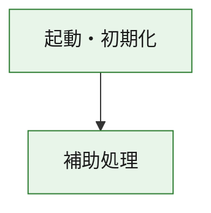
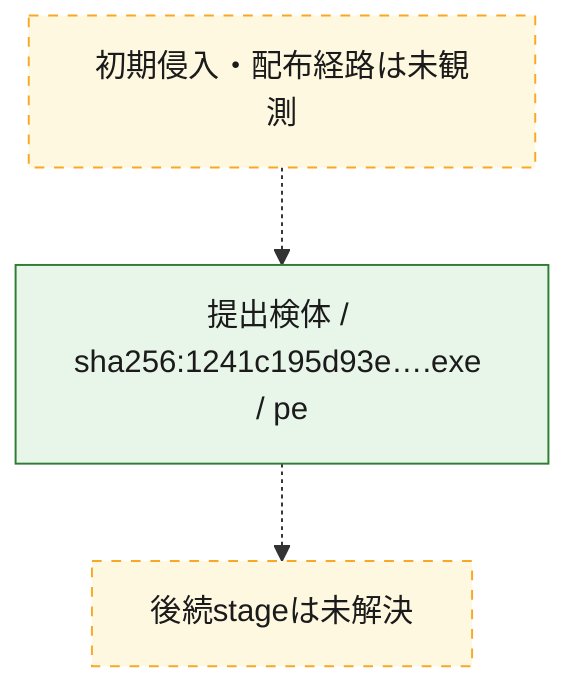
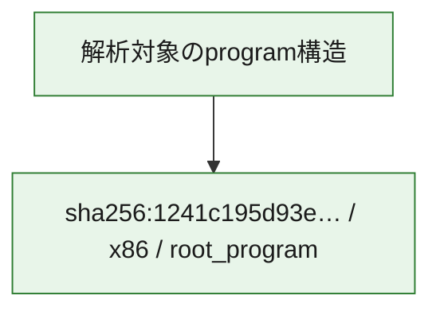

# 全体ロジック：1241c195d93e96796bc2f96923a11392f57676129d6978e5eefb036a00b63547

代表関数の静的証跡から、起動・初期化の処理群を確認しました。

## 読み方

- phaseの掲載順は解析上の整理順です。observed_call_edgesがない段階間の実行順を断定しません。
- 図の実線は静的に観測した関係、点線と黄色のノードは未観測・未解決の関係を示します。
- 図は静的な要約であり、動的実行を再現するものではありません。
- 詳細な関数解説とfingerprintは[STATIC-LOGIC.md](STATIC-LOGIC.md)を参照してください。

## 静的可視化

### 実行フロー

### 感染チェーン

### モジュール関係

## 処理段階

### 1. 起動・初期化

entry pointから初期化と後続処理への移行を確認します。
確度: `confirmed_static_function_evidence`

- `1241c195d93e96796bc2f96923a11392f57676129d6978e5eefb036a00b63547:ghidra:180001010` — 初期化と主要処理への分岐を行う入口関数です。 状態: `succeeded`、選定理由: `entry_point`, `meaningful_symbol_name`, `reviewed_call_centrality:22`, `role:entrypoint`, `small_program_complete_context`

### 2. 補助処理

主要処理を支える一般内部関数またはlibrary処理を確認します。
確度: `confirmed_static_function_evidence`

- `1241c195d93e96796bc2f96923a11392f57676129d6978e5eefb036a00b63547:ghidra:180001240` — 検体内部の一般処理を実装する関数です。 状態: `succeeded`、選定理由: `context_representative`, `reviewed_call_centrality:2`, `small_program_complete_context`
- `1241c195d93e96796bc2f96923a11392f57676129d6978e5eefb036a00b63547:ghidra:180001350` — 検体内部の一般処理を実装する関数です。 状態: `succeeded`、選定理由: `context_representative`, `reviewed_call_centrality:25`, `small_program_complete_context`
- `1241c195d93e96796bc2f96923a11392f57676129d6978e5eefb036a00b63547:ghidra:180003780` — 検体内部の一般処理を実装する関数です。 状態: `succeeded`、選定理由: `context_representative`, `reviewed_call_centrality:2`, `small_program_complete_context`
- `1241c195d93e96796bc2f96923a11392f57676129d6978e5eefb036a00b63547:ghidra:1800038e0` — 検体内部の一般処理を実装する関数です。 状態: `succeeded`、選定理由: `context_representative`, `reviewed_call_centrality:2`, `small_program_complete_context`

## 観測したcall関係

- `1241c195d93e96796bc2f96923a11392f57676129d6978e5eefb036a00b63547:ghidra:180001010` → `1241c195d93e96796bc2f96923a11392f57676129d6978e5eefb036a00b63547:ghidra:180001240` （`startup` → `support`）
- `1241c195d93e96796bc2f96923a11392f57676129d6978e5eefb036a00b63547:ghidra:180001010` → `1241c195d93e96796bc2f96923a11392f57676129d6978e5eefb036a00b63547:ghidra:180001350` （`startup` → `support`）
- `1241c195d93e96796bc2f96923a11392f57676129d6978e5eefb036a00b63547:ghidra:180001350` → `1241c195d93e96796bc2f96923a11392f57676129d6978e5eefb036a00b63547:ghidra:180001240` （`support` → `support`）
- `1241c195d93e96796bc2f96923a11392f57676129d6978e5eefb036a00b63547:ghidra:180001350` → `1241c195d93e96796bc2f96923a11392f57676129d6978e5eefb036a00b63547:ghidra:180003780` （`support` → `support`）
- `1241c195d93e96796bc2f96923a11392f57676129d6978e5eefb036a00b63547:ghidra:180001350` → `1241c195d93e96796bc2f96923a11392f57676129d6978e5eefb036a00b63547:ghidra:1800038e0` （`support` → `support`）
- `1241c195d93e96796bc2f96923a11392f57676129d6978e5eefb036a00b63547:ghidra:180003780` → `1241c195d93e96796bc2f96923a11392f57676129d6978e5eefb036a00b63547:ghidra:1800038e0` （`support` → `support`）
- `ghidra-function:225a00d4669cebc22177463f` → `ghidra-function:0475e6ab318654a24b131e99` （`unclassified` → `unclassified`）
- `ghidra-function:225a00d4669cebc22177463f` → `ghidra-function:07bd71d6652e1f843c52943e` （`unclassified` → `unclassified`）
- `ghidra-function:225a00d4669cebc22177463f` → `ghidra-function:0d819870651adbcb20e60122` （`unclassified` → `unclassified`）
- `ghidra-function:225a00d4669cebc22177463f` → `ghidra-function:16b104ad773026d831980e23` （`unclassified` → `unclassified`）
- `ghidra-function:225a00d4669cebc22177463f` → `ghidra-function:2312e052589a3ab334761eb2` （`unclassified` → `unclassified`）
- `ghidra-function:225a00d4669cebc22177463f` → `ghidra-function:6ff955fc473c491fa2d2bc40` （`unclassified` → `unclassified`）
- `ghidra-function:225a00d4669cebc22177463f` → `ghidra-function:70d09c58749a0d0579905e4c` （`unclassified` → `unclassified`）
- `ghidra-function:225a00d4669cebc22177463f` → `ghidra-function:7f6a90917d9a3ccb44e732be` （`unclassified` → `unclassified`）
- `ghidra-function:225a00d4669cebc22177463f` → `ghidra-function:a00c2d8fff5cbd3eb0c4d0bd` （`unclassified` → `unclassified`）
- `ghidra-function:225a00d4669cebc22177463f` → `ghidra-function:a5709200eb975bab76a34725` （`unclassified` → `unclassified`）
- `ghidra-function:225a00d4669cebc22177463f` → `ghidra-function:a6c6dd17bd1d3cbeef7bd58b` （`unclassified` → `unclassified`）
- `ghidra-function:225a00d4669cebc22177463f` → `ghidra-function:aa18cea3bf56ac5d6b356052` （`unclassified` → `unclassified`）
- `ghidra-function:7f6a90917d9a3ccb44e732be` → `ghidra-external:0d24af8480ba74e471cd4188` （`unclassified` → `unclassified`）
- `ghidra-function:7f6a90917d9a3ccb44e732be` → `ghidra-external:140e5699f81f10b1d1e8d1d1` （`unclassified` → `unclassified`）
- `ghidra-function:7f6a90917d9a3ccb44e732be` → `ghidra-external:1e0fa41d05fa86af96d7da9c` （`unclassified` → `unclassified`）
- `ghidra-function:7f6a90917d9a3ccb44e732be` → `ghidra-external:23f0d9fc2cf62bbb03005959` （`unclassified` → `unclassified`）
- `ghidra-function:7f6a90917d9a3ccb44e732be` → `ghidra-external:28b3fc0449d5de2093386657` （`unclassified` → `unclassified`）
- `ghidra-function:7f6a90917d9a3ccb44e732be` → `ghidra-external:3945ce3bb8ce5c28fb90c339` （`unclassified` → `unclassified`）
- `ghidra-function:7f6a90917d9a3ccb44e732be` → `ghidra-external:39d5d13203407239ed432a41` （`unclassified` → `unclassified`）
- `ghidra-function:7f6a90917d9a3ccb44e732be` → `ghidra-external:62c88dd71f630f91dfd37983` （`unclassified` → `unclassified`）
- `ghidra-function:7f6a90917d9a3ccb44e732be` → `ghidra-external:7044a568a8a7f47af05dfa4a` （`unclassified` → `unclassified`）
- `ghidra-function:7f6a90917d9a3ccb44e732be` → `ghidra-external:8399b55e718c41f033500912` （`unclassified` → `unclassified`）
- `ghidra-function:7f6a90917d9a3ccb44e732be` → `ghidra-external:840324a3dd6db9f4587c9506` （`unclassified` → `unclassified`）
- `ghidra-function:7f6a90917d9a3ccb44e732be` → `ghidra-external:8f572e5b075cc84d316e7d36` （`unclassified` → `unclassified`）
- `ghidra-function:7f6a90917d9a3ccb44e732be` → `ghidra-external:997e449517beb6686cf366bd` （`unclassified` → `unclassified`）
- `ghidra-function:7f6a90917d9a3ccb44e732be` → `ghidra-external:a3bdcc089b064c5efb81c9fa` （`unclassified` → `unclassified`）
- `ghidra-function:7f6a90917d9a3ccb44e732be` → `ghidra-external:b45b0829cd9294f50b38134a` （`unclassified` → `unclassified`）
- `ghidra-function:7f6a90917d9a3ccb44e732be` → `ghidra-external:b51e06d22e57cddde24d41b9` （`unclassified` → `unclassified`）
- `ghidra-function:7f6a90917d9a3ccb44e732be` → `ghidra-external:c5c08a5b4377071bc16849ba` （`unclassified` → `unclassified`）
- `ghidra-function:7f6a90917d9a3ccb44e732be` → `ghidra-external:ca75e138c540cb891eb86404` （`unclassified` → `unclassified`）
- `ghidra-function:7f6a90917d9a3ccb44e732be` → `ghidra-external:ea28bcb00c5938795d542680` （`unclassified` → `unclassified`）
- `ghidra-function:7f6a90917d9a3ccb44e732be` → `ghidra-external:f460691df86f3949bcb4c09a` （`unclassified` → `unclassified`）
- `ghidra-function:7f6a90917d9a3ccb44e732be` → `ghidra-external:fa5794019b7caf7d1ecbf345` （`unclassified` → `unclassified`）
- `ghidra-function:7f6a90917d9a3ccb44e732be` → `ghidra-function:10720f00ae88d5be046a4060` （`unclassified` → `unclassified`）
- `ghidra-function:7f6a90917d9a3ccb44e732be` → `ghidra-function:70d09c58749a0d0579905e4c` （`unclassified` → `unclassified`）
- `ghidra-function:7f6a90917d9a3ccb44e732be` → `ghidra-function:fe5d36e852c0f5d8e2a0de00` （`unclassified` → `unclassified`）
- `ghidra-function:fe5d36e852c0f5d8e2a0de00` → `ghidra-function:10720f00ae88d5be046a4060` （`unclassified` → `unclassified`）

## 解析範囲と制約

- 選定外関数は全体inventoryへ残しますが、関数本体の個別解説対象にはしていません。
- indirect call、難読化、packer、VM、壊れたcontrol flowによりcall関係が欠落する場合があります。
- 文書は静的解析に基づき、検体実行や外部通信による動的確認は行っていません。
