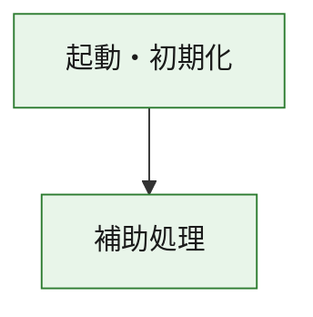
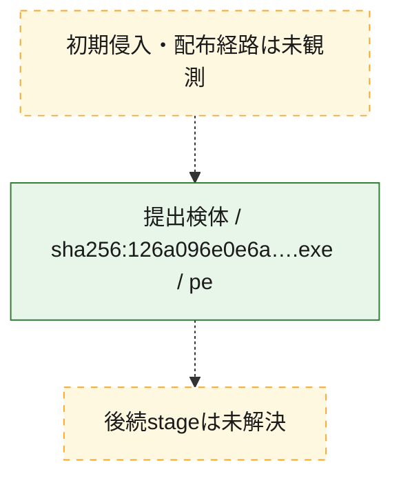
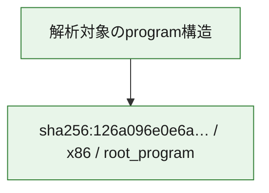

# 全体ロジック：126a096e0e6a6c157fec7fe12ec37a93aba07b84118dcb60ec0693baab1deee3

代表関数の静的証跡から、起動・初期化の処理群を確認しました。

## 読み方

- phaseの掲載順は解析上の整理順です。observed_call_edgesがない段階間の実行順を断定しません。
- 図の実線は静的に観測した関係、点線と黄色のノードは未観測・未解決の関係を示します。
- 図は静的な要約であり、動的実行を再現するものではありません。
- 詳細な関数解説とfingerprintは[STATIC-LOGIC.md](STATIC-LOGIC.md)を参照してください。

## 静的可視化

### 実行フロー

### 感染チェーン

### モジュール関係

## 処理段階

### 1. 起動・初期化

entry pointから初期化と後続処理への移行を確認します。
確度: `confirmed_static_function_evidence`

- `126a096e0e6a6c157fec7fe12ec37a93aba07b84118dcb60ec0693baab1deee3:ghidra:180001010` — 初期化と主要処理への分岐を行う入口関数です。 状態: `succeeded`、選定理由: `entry_point`, `meaningful_symbol_name`, `reviewed_call_centrality:22`, `role:entrypoint`, `small_program_complete_context`

### 2. 補助処理

主要処理を支える一般内部関数またはlibrary処理を確認します。
確度: `confirmed_static_function_evidence`

- `126a096e0e6a6c157fec7fe12ec37a93aba07b84118dcb60ec0693baab1deee3:ghidra:180001240` — 検体内部の一般処理を実装する関数です。 状態: `succeeded`、選定理由: `context_representative`, `reviewed_call_centrality:2`, `small_program_complete_context`
- `126a096e0e6a6c157fec7fe12ec37a93aba07b84118dcb60ec0693baab1deee3:ghidra:180001350` — 検体内部の一般処理を実装する関数です。 状態: `succeeded`、選定理由: `context_representative`, `reviewed_call_centrality:25`, `small_program_complete_context`
- `126a096e0e6a6c157fec7fe12ec37a93aba07b84118dcb60ec0693baab1deee3:ghidra:180003780` — 検体内部の一般処理を実装する関数です。 状態: `succeeded`、選定理由: `context_representative`, `reviewed_call_centrality:2`, `small_program_complete_context`
- `126a096e0e6a6c157fec7fe12ec37a93aba07b84118dcb60ec0693baab1deee3:ghidra:1800038e0` — 検体内部の一般処理を実装する関数です。 状態: `succeeded`、選定理由: `context_representative`, `reviewed_call_centrality:2`, `small_program_complete_context`

## 観測したcall関係

- `126a096e0e6a6c157fec7fe12ec37a93aba07b84118dcb60ec0693baab1deee3:ghidra:180001010` → `126a096e0e6a6c157fec7fe12ec37a93aba07b84118dcb60ec0693baab1deee3:ghidra:180001240` （`startup` → `support`）
- `126a096e0e6a6c157fec7fe12ec37a93aba07b84118dcb60ec0693baab1deee3:ghidra:180001010` → `126a096e0e6a6c157fec7fe12ec37a93aba07b84118dcb60ec0693baab1deee3:ghidra:180001350` （`startup` → `support`）
- `126a096e0e6a6c157fec7fe12ec37a93aba07b84118dcb60ec0693baab1deee3:ghidra:180001350` → `126a096e0e6a6c157fec7fe12ec37a93aba07b84118dcb60ec0693baab1deee3:ghidra:180001240` （`support` → `support`）
- `126a096e0e6a6c157fec7fe12ec37a93aba07b84118dcb60ec0693baab1deee3:ghidra:180001350` → `126a096e0e6a6c157fec7fe12ec37a93aba07b84118dcb60ec0693baab1deee3:ghidra:180003780` （`support` → `support`）
- `126a096e0e6a6c157fec7fe12ec37a93aba07b84118dcb60ec0693baab1deee3:ghidra:180001350` → `126a096e0e6a6c157fec7fe12ec37a93aba07b84118dcb60ec0693baab1deee3:ghidra:1800038e0` （`support` → `support`）
- `126a096e0e6a6c157fec7fe12ec37a93aba07b84118dcb60ec0693baab1deee3:ghidra:180003780` → `126a096e0e6a6c157fec7fe12ec37a93aba07b84118dcb60ec0693baab1deee3:ghidra:1800038e0` （`support` → `support`）
- `ghidra-function:00bab040967e042ec0e662bf` → `ghidra-function:88bf4ffe90e290ecc91497a3` （`unclassified` → `unclassified`）
- `ghidra-function:5b3092522bf255d6611dcd6e` → `ghidra-function:54771fea8216d4bd57284328` （`unclassified` → `unclassified`）
- `ghidra-function:5b3092522bf255d6611dcd6e` → `ghidra-function:65b690571abf98b785cabd19` （`unclassified` → `unclassified`）
- `ghidra-function:5b3092522bf255d6611dcd6e` → `ghidra-function:72beea61c8a0eef756163da9` （`unclassified` → `unclassified`）
- `ghidra-function:5b3092522bf255d6611dcd6e` → `ghidra-function:7a5b279aa2dcb61b0f43200f` （`unclassified` → `unclassified`）
- `ghidra-function:5b3092522bf255d6611dcd6e` → `ghidra-function:8356590f4aa713b7f8e6024a` （`unclassified` → `unclassified`）
- `ghidra-function:5b3092522bf255d6611dcd6e` → `ghidra-function:882c4cb139d4e048b2135864` （`unclassified` → `unclassified`）
- `ghidra-function:5b3092522bf255d6611dcd6e` → `ghidra-function:92f9f7470e08e921a2b840da` （`unclassified` → `unclassified`）
- `ghidra-function:5b3092522bf255d6611dcd6e` → `ghidra-function:a14d173a3925725c53a79fe9` （`unclassified` → `unclassified`）
- `ghidra-function:5b3092522bf255d6611dcd6e` → `ghidra-function:c5c59b0f71e60322d26a2801` （`unclassified` → `unclassified`）
- `ghidra-function:5b3092522bf255d6611dcd6e` → `ghidra-function:d126d909e970edef32f32585` （`unclassified` → `unclassified`）
- `ghidra-function:5b3092522bf255d6611dcd6e` → `ghidra-function:e5a7f15106d93b08cd38e263` （`unclassified` → `unclassified`）
- `ghidra-function:5b3092522bf255d6611dcd6e` → `ghidra-function:f5f4cec8a0d0477876321393` （`unclassified` → `unclassified`）
- `ghidra-function:65b690571abf98b785cabd19` → `ghidra-external:00e179bc1d7fc74bdc2bd959` （`unclassified` → `unclassified`）
- `ghidra-function:65b690571abf98b785cabd19` → `ghidra-external:1a72aa6796f931bb9d983e8c` （`unclassified` → `unclassified`）
- `ghidra-function:65b690571abf98b785cabd19` → `ghidra-external:2e2d5c218902d8dcb4d47d51` （`unclassified` → `unclassified`）
- `ghidra-function:65b690571abf98b785cabd19` → `ghidra-external:35b8ce22c41ccd5654e37f69` （`unclassified` → `unclassified`）
- `ghidra-function:65b690571abf98b785cabd19` → `ghidra-external:4ba4ec5e3e1dfe135a42b46b` （`unclassified` → `unclassified`）
- `ghidra-function:65b690571abf98b785cabd19` → `ghidra-external:5b04c51e8d25d404597fdadc` （`unclassified` → `unclassified`）
- `ghidra-function:65b690571abf98b785cabd19` → `ghidra-external:6911e72bd8874988b4db431b` （`unclassified` → `unclassified`）
- `ghidra-function:65b690571abf98b785cabd19` → `ghidra-external:7689d57e38f77f830a9c5261` （`unclassified` → `unclassified`）
- `ghidra-function:65b690571abf98b785cabd19` → `ghidra-external:8b8afbcc44659215e9d48a9f` （`unclassified` → `unclassified`）
- `ghidra-function:65b690571abf98b785cabd19` → `ghidra-external:91fc0fc1640ad16836e369e0` （`unclassified` → `unclassified`）
- `ghidra-function:65b690571abf98b785cabd19` → `ghidra-external:96c601823a780e6bb290a02e` （`unclassified` → `unclassified`）
- `ghidra-function:65b690571abf98b785cabd19` → `ghidra-external:9cf24c627f524c2be7706efb` （`unclassified` → `unclassified`）
- `ghidra-function:65b690571abf98b785cabd19` → `ghidra-external:a68a80d9af211c3815284f4d` （`unclassified` → `unclassified`）
- `ghidra-function:65b690571abf98b785cabd19` → `ghidra-external:ba86c19d366cc44a20babcb8` （`unclassified` → `unclassified`）
- `ghidra-function:65b690571abf98b785cabd19` → `ghidra-external:c1fc67793d650570b5616c0c` （`unclassified` → `unclassified`）
- `ghidra-function:65b690571abf98b785cabd19` → `ghidra-external:cb45acafe491f9f350857619` （`unclassified` → `unclassified`）
- `ghidra-function:65b690571abf98b785cabd19` → `ghidra-external:d7f6a39671c9aec2a9995fae` （`unclassified` → `unclassified`）
- `ghidra-function:65b690571abf98b785cabd19` → `ghidra-external:d941c5fbc75343ca4a160a59` （`unclassified` → `unclassified`）
- `ghidra-function:65b690571abf98b785cabd19` → `ghidra-external:dd32f26e6619225213b5aaab` （`unclassified` → `unclassified`）
- `ghidra-function:65b690571abf98b785cabd19` → `ghidra-external:f87c9f9233baee7229e5c2f0` （`unclassified` → `unclassified`）
- `ghidra-function:65b690571abf98b785cabd19` → `ghidra-external:faed2519baf1eb4f8bbe798e` （`unclassified` → `unclassified`）
- `ghidra-function:65b690571abf98b785cabd19` → `ghidra-function:00bab040967e042ec0e662bf` （`unclassified` → `unclassified`）
- `ghidra-function:65b690571abf98b785cabd19` → `ghidra-function:88bf4ffe90e290ecc91497a3` （`unclassified` → `unclassified`）
- `ghidra-function:65b690571abf98b785cabd19` → `ghidra-function:92f9f7470e08e921a2b840da` （`unclassified` → `unclassified`）

## 解析範囲と制約

- 選定外関数は全体inventoryへ残しますが、関数本体の個別解説対象にはしていません。
- indirect call、難読化、packer、VM、壊れたcontrol flowによりcall関係が欠落する場合があります。
- 文書は静的解析に基づき、検体実行や外部通信による動的確認は行っていません。
