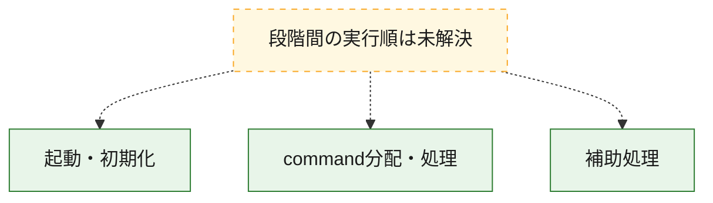
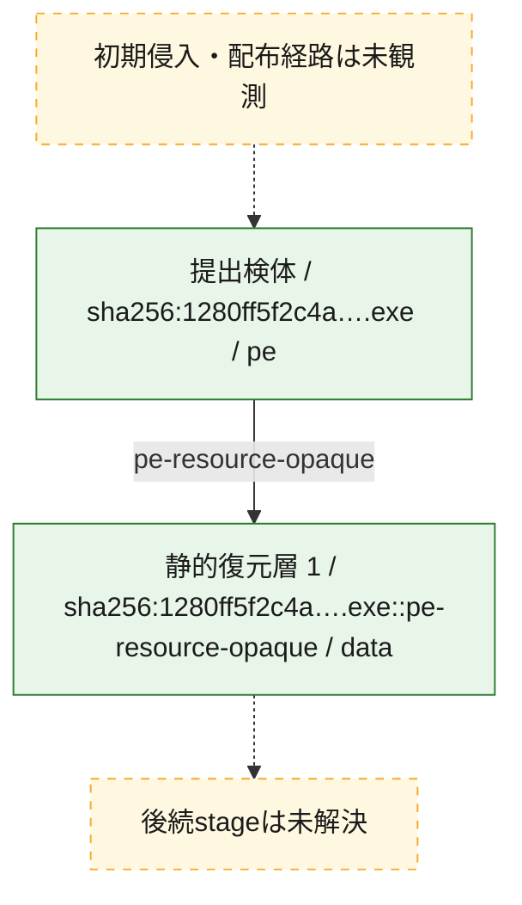
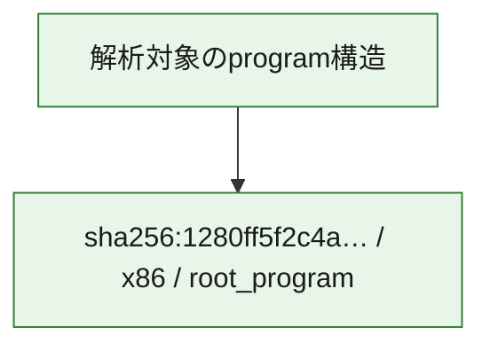

# 全体ロジック：1280ff5f2c4a59e8a9301d8e2eb7c2e9774ec6026a48905c52d23fb1974438bf

代表関数の静的証跡から、起動・初期化、command分配・処理の処理群を確認しました。

## 読み方

- phaseの掲載順は解析上の整理順です。observed_call_edgesがない段階間の実行順を断定しません。
- 図の実線は静的に観測した関係、点線と黄色のノードは未観測・未解決の関係を示します。
- 図は静的な要約であり、動的実行を再現するものではありません。
- 詳細な関数解説とfingerprintは[STATIC-LOGIC.md](STATIC-LOGIC.md)を参照してください。

## 静的可視化

### 実行フロー

### 感染チェーン

### モジュール関係

## 処理段階

### 1. 起動・初期化

entry pointから初期化と後続処理への移行を確認します。
確度: `confirmed_static_function_evidence`

- `1280ff5f2c4a59e8a9301d8e2eb7c2e9774ec6026a48905c52d23fb1974438bf:ghidra:180171fd4` — 初期化と主要処理への分岐を行う入口関数です。 状態: `succeeded`、選定理由: `entry_point`, `meaningful_symbol_name`, `reviewed_call_centrality:5`, `role:entrypoint`

### 2. command分配・処理

受信commandやtaskの解釈、分配、個別handlerへの移行を確認します。
確度: `confirmed_static_function_evidence_with_limits`

- `1280ff5f2c4a59e8a9301d8e2eb7c2e9774ec6026a48905c52d23fb1974438bf:ghidra:1801728f0` — commandの解釈、分配、または個別処理を担当する関数です。 状態: `limited_bad_instruction_or_flow`、選定理由: `meaningful_symbol_name`, `role:command_dispatch_or_handler`

### 3. 補助処理

主要処理を支える一般内部関数またはlibrary処理を確認します。
確度: `confirmed_static_function_evidence_with_limits`

- `1280ff5f2c4a59e8a9301d8e2eb7c2e9774ec6026a48905c52d23fb1974438bf:ghidra:180001020` — 検体内部の一般処理を実装する関数です。 状態: `succeeded`、選定理由: `context_representative`, `reviewed_call_centrality:3`
- `1280ff5f2c4a59e8a9301d8e2eb7c2e9774ec6026a48905c52d23fb1974438bf:ghidra:1800010a0` — 検体内部の一般処理を実装する関数です。 状態: `succeeded`、選定理由: `context_representative`, `reviewed_call_centrality:1`
- `1280ff5f2c4a59e8a9301d8e2eb7c2e9774ec6026a48905c52d23fb1974438bf:ghidra:180001130` — 検体内部の一般処理を実装する関数です。 状態: `succeeded`、選定理由: `context_representative`, `reviewed_call_centrality:1`
- `1280ff5f2c4a59e8a9301d8e2eb7c2e9774ec6026a48905c52d23fb1974438bf:ghidra:180001210` — 検体内部の一般処理を実装する関数です。 状態: `limited_bad_instruction_or_flow`、選定理由: `context_representative`
- `1280ff5f2c4a59e8a9301d8e2eb7c2e9774ec6026a48905c52d23fb1974438bf:ghidra:180001280` — 検体内部の一般処理を実装する関数です。 状態: `succeeded`、選定理由: `meaningful_symbol_name`
- `1280ff5f2c4a59e8a9301d8e2eb7c2e9774ec6026a48905c52d23fb1974438bf:ghidra:180001290` — 検体内部の一般処理を実装する関数です。 状態: `succeeded`、選定理由: `context_representative`, `reviewed_call_centrality:2`
- `1280ff5f2c4a59e8a9301d8e2eb7c2e9774ec6026a48905c52d23fb1974438bf:ghidra:1800012f0` — 検体内部の一般処理を実装する関数です。 状態: `succeeded`、選定理由: `context_representative`, `reviewed_call_centrality:4`
- `1280ff5f2c4a59e8a9301d8e2eb7c2e9774ec6026a48905c52d23fb1974438bf:ghidra:1800014a0` — 検体内部の一般処理を実装する関数です。 状態: `succeeded`、選定理由: `context_representative`
- `1280ff5f2c4a59e8a9301d8e2eb7c2e9774ec6026a48905c52d23fb1974438bf:ghidra:1800014f0` — 検体内部の一般処理を実装する関数です。 状態: `succeeded`、選定理由: `context_representative`
- `1280ff5f2c4a59e8a9301d8e2eb7c2e9774ec6026a48905c52d23fb1974438bf:ghidra:180001580` — 検体内部の一般処理を実装する関数です。 状態: `succeeded`、選定理由: `context_representative`, `reviewed_call_centrality:10`
- `1280ff5f2c4a59e8a9301d8e2eb7c2e9774ec6026a48905c52d23fb1974438bf:ghidra:180001650` — 検体内部の一般処理を実装する関数です。 状態: `limited_bad_instruction_or_flow`、選定理由: `context_representative`, `reviewed_call_centrality:3`
- `1280ff5f2c4a59e8a9301d8e2eb7c2e9774ec6026a48905c52d23fb1974438bf:ghidra:1800016f0` — 検体内部の一般処理を実装する関数です。 状態: `limited_bad_instruction_or_flow`、選定理由: `context_representative`, `reviewed_call_centrality:3`
- `1280ff5f2c4a59e8a9301d8e2eb7c2e9774ec6026a48905c52d23fb1974438bf:ghidra:1800017a0` — 検体内部の一般処理を実装する関数です。 状態: `succeeded`、選定理由: `context_representative`
- `1280ff5f2c4a59e8a9301d8e2eb7c2e9774ec6026a48905c52d23fb1974438bf:ghidra:180001840` — 検体内部の一般処理を実装する関数です。 状態: `succeeded`、選定理由: `context_representative`, `reviewed_call_centrality:3`
- `1280ff5f2c4a59e8a9301d8e2eb7c2e9774ec6026a48905c52d23fb1974438bf:ghidra:1800018e0` — 検体内部の一般処理を実装する関数です。 状態: `succeeded`、選定理由: `context_representative`, `reviewed_call_centrality:3`
- `1280ff5f2c4a59e8a9301d8e2eb7c2e9774ec6026a48905c52d23fb1974438bf:ghidra:1800019e0` — 検体内部の一般処理を実装する関数です。 状態: `succeeded`、選定理由: `context_representative`, `reviewed_call_centrality:7`
- `1280ff5f2c4a59e8a9301d8e2eb7c2e9774ec6026a48905c52d23fb1974438bf:ghidra:180001b00` — 検体内部の一般処理を実装する関数です。 状態: `succeeded`、選定理由: `context_representative`, `reviewed_call_centrality:7`
- `1280ff5f2c4a59e8a9301d8e2eb7c2e9774ec6026a48905c52d23fb1974438bf:ghidra:180001c20` — 検体内部の一般処理を実装する関数です。 状態: `limited_bad_instruction_or_flow`、選定理由: `context_representative`, `reviewed_call_centrality:2`
- `1280ff5f2c4a59e8a9301d8e2eb7c2e9774ec6026a48905c52d23fb1974438bf:ghidra:180001c60` — 検体内部の一般処理を実装する関数です。 状態: `succeeded`、選定理由: `context_representative`, `reviewed_call_centrality:4`
- `1280ff5f2c4a59e8a9301d8e2eb7c2e9774ec6026a48905c52d23fb1974438bf:ghidra:180001d80` — 検体内部の一般処理を実装する関数です。 状態: `succeeded`、選定理由: `context_representative`, `reviewed_call_centrality:4`
- `1280ff5f2c4a59e8a9301d8e2eb7c2e9774ec6026a48905c52d23fb1974438bf:ghidra:180001ed0` — 検体内部の一般処理を実装する関数です。 状態: `limited_bad_instruction_or_flow`、選定理由: `context_representative`, `reviewed_call_centrality:8`
- `1280ff5f2c4a59e8a9301d8e2eb7c2e9774ec6026a48905c52d23fb1974438bf:ghidra:180002040` — 検体内部の一般処理を実装する関数です。 状態: `succeeded`、選定理由: `context_representative`, `reviewed_call_centrality:4`
- `1280ff5f2c4a59e8a9301d8e2eb7c2e9774ec6026a48905c52d23fb1974438bf:ghidra:180002140` — 検体内部の一般処理を実装する関数です。 状態: `succeeded`、選定理由: `context_representative`, `reviewed_call_centrality:7`
- `1280ff5f2c4a59e8a9301d8e2eb7c2e9774ec6026a48905c52d23fb1974438bf:ghidra:1800022f0` — 検体内部の一般処理を実装する関数です。 状態: `succeeded`、選定理由: `context_representative`
- `1280ff5f2c4a59e8a9301d8e2eb7c2e9774ec6026a48905c52d23fb1974438bf:ghidra:180002360` — 検体内部の一般処理を実装する関数です。 状態: `succeeded`、選定理由: `context_representative`, `reviewed_call_centrality:2`
- `1280ff5f2c4a59e8a9301d8e2eb7c2e9774ec6026a48905c52d23fb1974438bf:ghidra:180002470` — 検体内部の一般処理を実装する関数です。 状態: `succeeded`、選定理由: `context_representative`, `reviewed_call_centrality:2`
- `1280ff5f2c4a59e8a9301d8e2eb7c2e9774ec6026a48905c52d23fb1974438bf:ghidra:180002580` — 検体内部の一般処理を実装する関数です。 状態: `succeeded`、選定理由: `context_representative`, `reviewed_call_centrality:2`
- `1280ff5f2c4a59e8a9301d8e2eb7c2e9774ec6026a48905c52d23fb1974438bf:ghidra:180002690` — 検体内部の一般処理を実装する関数です。 状態: `succeeded`、選定理由: `context_representative`, `reviewed_call_centrality:1`
- `1280ff5f2c4a59e8a9301d8e2eb7c2e9774ec6026a48905c52d23fb1974438bf:ghidra:1800026e0` — 検体内部の一般処理を実装する関数です。 状態: `succeeded`、選定理由: `context_representative`, `reviewed_call_centrality:2`
- `1280ff5f2c4a59e8a9301d8e2eb7c2e9774ec6026a48905c52d23fb1974438bf:ghidra:1800027f0` — 検体内部の一般処理を実装する関数です。 状態: `succeeded`、選定理由: `context_representative`, `reviewed_call_centrality:1`

## 観測したcall関係

- `1280ff5f2c4a59e8a9301d8e2eb7c2e9774ec6026a48905c52d23fb1974438bf:ghidra:180001130` → `1280ff5f2c4a59e8a9301d8e2eb7c2e9774ec6026a48905c52d23fb1974438bf:ghidra:180001290` （`support` → `support`）
- `1280ff5f2c4a59e8a9301d8e2eb7c2e9774ec6026a48905c52d23fb1974438bf:ghidra:180001650` → `1280ff5f2c4a59e8a9301d8e2eb7c2e9774ec6026a48905c52d23fb1974438bf:ghidra:180001580` （`support` → `support`）
- `1280ff5f2c4a59e8a9301d8e2eb7c2e9774ec6026a48905c52d23fb1974438bf:ghidra:1800016f0` → `1280ff5f2c4a59e8a9301d8e2eb7c2e9774ec6026a48905c52d23fb1974438bf:ghidra:180001580` （`support` → `support`）
- `1280ff5f2c4a59e8a9301d8e2eb7c2e9774ec6026a48905c52d23fb1974438bf:ghidra:1800019e0` → `1280ff5f2c4a59e8a9301d8e2eb7c2e9774ec6026a48905c52d23fb1974438bf:ghidra:180001020` （`support` → `support`）
- `1280ff5f2c4a59e8a9301d8e2eb7c2e9774ec6026a48905c52d23fb1974438bf:ghidra:180001b00` → `1280ff5f2c4a59e8a9301d8e2eb7c2e9774ec6026a48905c52d23fb1974438bf:ghidra:180001020` （`support` → `support`）
- `1280ff5f2c4a59e8a9301d8e2eb7c2e9774ec6026a48905c52d23fb1974438bf:ghidra:180002360` → `1280ff5f2c4a59e8a9301d8e2eb7c2e9774ec6026a48905c52d23fb1974438bf:ghidra:180001580` （`support` → `support`）
- `1280ff5f2c4a59e8a9301d8e2eb7c2e9774ec6026a48905c52d23fb1974438bf:ghidra:180002470` → `1280ff5f2c4a59e8a9301d8e2eb7c2e9774ec6026a48905c52d23fb1974438bf:ghidra:180001580` （`support` → `support`）
- `1280ff5f2c4a59e8a9301d8e2eb7c2e9774ec6026a48905c52d23fb1974438bf:ghidra:180002580` → `1280ff5f2c4a59e8a9301d8e2eb7c2e9774ec6026a48905c52d23fb1974438bf:ghidra:180001580` （`support` → `support`）
- `1280ff5f2c4a59e8a9301d8e2eb7c2e9774ec6026a48905c52d23fb1974438bf:ghidra:180002690` → `1280ff5f2c4a59e8a9301d8e2eb7c2e9774ec6026a48905c52d23fb1974438bf:ghidra:180001580` （`support` → `support`）
- `1280ff5f2c4a59e8a9301d8e2eb7c2e9774ec6026a48905c52d23fb1974438bf:ghidra:1800026e0` → `1280ff5f2c4a59e8a9301d8e2eb7c2e9774ec6026a48905c52d23fb1974438bf:ghidra:180001580` （`support` → `support`）
- `1280ff5f2c4a59e8a9301d8e2eb7c2e9774ec6026a48905c52d23fb1974438bf:ghidra:1800027f0` → `1280ff5f2c4a59e8a9301d8e2eb7c2e9774ec6026a48905c52d23fb1974438bf:ghidra:180001580` （`support` → `support`）
- `ghidra-function:00404c371d1996e2709e09d9` → `ghidra-function:b30646203f6d02c8a6f000c3` （`unclassified` → `unclassified`）
- `ghidra-function:030d0b3b6ab7f917eac42a33` → `ghidra-function:cae33117605d0ced4c0787fb` （`unclassified` → `unclassified`）
- `ghidra-function:057cc1cfed0c56b68ccda8b9` → `ghidra-function:cb89e216dddaf8f164ba39e7` （`unclassified` → `unclassified`）
- `ghidra-function:1ee37b2471e569a48aca2c3b` → `ghidra-external:4d6370840aab39db87c655ef` （`unclassified` → `unclassified`）
- `ghidra-function:1ee37b2471e569a48aca2c3b` → `ghidra-function:7e7b6118764abea9c75de9d1` （`unclassified` → `unclassified`）
- `ghidra-function:1ee37b2471e569a48aca2c3b` → `ghidra-function:89cd8966546dca177ef86bb2` （`unclassified` → `unclassified`）
- `ghidra-function:221c476c13e1795ee0b44739` → `ghidra-function:01ed8f3f4d321ed64ad36e58` （`unclassified` → `unclassified`）
- `ghidra-function:221c476c13e1795ee0b44739` → `ghidra-function:0faa532e39da1218a739391a` （`unclassified` → `unclassified`）
- `ghidra-function:221c476c13e1795ee0b44739` → `ghidra-function:81568da59e33333f9c5faf8f` （`unclassified` → `unclassified`）
- `ghidra-function:221c476c13e1795ee0b44739` → `ghidra-function:b0e9fe1c458435b9b842dc51` （`unclassified` → `unclassified`）
- `ghidra-function:31c10867ce525ecf806037c8` → `ghidra-external:4d6370840aab39db87c655ef` （`unclassified` → `unclassified`）
- `ghidra-function:31c10867ce525ecf806037c8` → `ghidra-function:7e7b6118764abea9c75de9d1` （`unclassified` → `unclassified`）
- `ghidra-function:31c10867ce525ecf806037c8` → `ghidra-function:89cd8966546dca177ef86bb2` （`unclassified` → `unclassified`）
- `ghidra-function:45814d970ef1d4acbe92b228` → `ghidra-function:04223255323599ba2e7165e2` （`unclassified` → `unclassified`）
- `ghidra-function:45814d970ef1d4acbe92b228` → `ghidra-function:b30646203f6d02c8a6f000c3` （`unclassified` → `unclassified`）
- `ghidra-function:45814d970ef1d4acbe92b228` → `ghidra-function:c4c65c787761e441ad87fd25` （`unclassified` → `unclassified`）
- `ghidra-function:45814d970ef1d4acbe92b228` → `ghidra-function:c63ddc25d905b706d704fe54` （`unclassified` → `unclassified`）
- `ghidra-function:56544bf07de27574b372dd49` → `ghidra-function:b30646203f6d02c8a6f000c3` （`unclassified` → `unclassified`）
- `ghidra-function:56544bf07de27574b372dd49` → `ghidra-function:e8a5ee59346cf596ff8cb720` （`unclassified` → `unclassified`）
- `ghidra-function:585c9186ba81519167f82304` → `ghidra-function:04223255323599ba2e7165e2` （`unclassified` → `unclassified`）
- `ghidra-function:585c9186ba81519167f82304` → `ghidra-function:b30646203f6d02c8a6f000c3` （`unclassified` → `unclassified`）
- `ghidra-function:585c9186ba81519167f82304` → `ghidra-function:c4c65c787761e441ad87fd25` （`unclassified` → `unclassified`）
- `ghidra-function:585c9186ba81519167f82304` → `ghidra-function:c63ddc25d905b706d704fe54` （`unclassified` → `unclassified`）
- `ghidra-function:69d44d935b24ac4ccb99d097` → `ghidra-function:6e6f942071353f125203c3d0` （`unclassified` → `unclassified`）
- `ghidra-function:69d44d935b24ac4ccb99d097` → `ghidra-function:cae33117605d0ced4c0787fb` （`unclassified` → `unclassified`）
- `ghidra-function:74aa8aa038cbe2dd1b7383d6` → `ghidra-function:3fe3d1ad5c5b549220664673` （`unclassified` → `unclassified`）
- `ghidra-function:74aa8aa038cbe2dd1b7383d6` → `ghidra-function:cae33117605d0ced4c0787fb` （`unclassified` → `unclassified`）
- `ghidra-function:7c8e8093067f333747f4d153` → `ghidra-function:1b30a705a0a1f639b33f2271` （`unclassified` → `unclassified`）
- `ghidra-function:807e93934684ebbaf7f4db37` → `ghidra-function:b30646203f6d02c8a6f000c3` （`unclassified` → `unclassified`）
- `ghidra-function:807e93934684ebbaf7f4db37` → `ghidra-function:e8a5ee59346cf596ff8cb720` （`unclassified` → `unclassified`）
- `ghidra-function:875058033213e34bfbe49883` → `ghidra-function:3fe3d1ad5c5b549220664673` （`unclassified` → `unclassified`）
- `ghidra-function:875058033213e34bfbe49883` → `ghidra-function:cae33117605d0ced4c0787fb` （`unclassified` → `unclassified`）
- `ghidra-function:91eee5e0d582d0d65ed39881` → `ghidra-function:cae33117605d0ced4c0787fb` （`unclassified` → `unclassified`）
- `ghidra-function:9816603c39d8ae4ee9626a2e` → `ghidra-external:c7fb4e4fc7f96e5eb8012d49` （`unclassified` → `unclassified`）
- `ghidra-function:9816603c39d8ae4ee9626a2e` → `ghidra-function:61f6fab8f1e337f52fe19a23` （`unclassified` → `unclassified`）
- `ghidra-function:9816603c39d8ae4ee9626a2e` → `ghidra-function:7a270980bca25a38e80b3f6f` （`unclassified` → `unclassified`）
- `ghidra-function:9816603c39d8ae4ee9626a2e` → `ghidra-function:9daff510418a37d15fd836ba` （`unclassified` → `unclassified`）
- `ghidra-function:9816603c39d8ae4ee9626a2e` → `ghidra-function:aca2c7f5cfc906a5d9f4e640` （`unclassified` → `unclassified`）
- `ghidra-function:bfc729dd860f25bb450c0bb9` → `ghidra-function:0ebeab77b8e4b739153d0d22` （`unclassified` → `unclassified`）
- `ghidra-function:bfc729dd860f25bb450c0bb9` → `ghidra-function:2b8077c1a5f20563c7a5425f` （`unclassified` → `unclassified`）
- `ghidra-function:bfc729dd860f25bb450c0bb9` → `ghidra-function:59b5253297e2a6d30fd924ce` （`unclassified` → `unclassified`）
- `ghidra-function:bfc729dd860f25bb450c0bb9` → `ghidra-function:89cd8966546dca177ef86bb2` （`unclassified` → `unclassified`）
- `ghidra-function:bfc729dd860f25bb450c0bb9` → `ghidra-function:b30646203f6d02c8a6f000c3` （`unclassified` → `unclassified`）
- `ghidra-function:c43babdc60599ecdaccdbfff` → `ghidra-function:0ebeab77b8e4b739153d0d22` （`unclassified` → `unclassified`）
- `ghidra-function:c43babdc60599ecdaccdbfff` → `ghidra-function:b30646203f6d02c8a6f000c3` （`unclassified` → `unclassified`）
- `ghidra-function:c63ddc25d905b706d704fe54` → `ghidra-function:1190d026e3e2313be3412025` （`unclassified` → `unclassified`）
- `ghidra-function:c6c132ab8b5a08a3cb44acc8` → `ghidra-external:4d6370840aab39db87c655ef` （`unclassified` → `unclassified`）
- `ghidra-function:c6c132ab8b5a08a3cb44acc8` → `ghidra-function:1138df3ae54889901dcd3821` （`unclassified` → `unclassified`）
- `ghidra-function:c6c132ab8b5a08a3cb44acc8` → `ghidra-function:40d28827c2c305896cfeb489` （`unclassified` → `unclassified`）
- `ghidra-function:cae33117605d0ced4c0787fb` → `ghidra-function:3fe3d1ad5c5b549220664673` （`unclassified` → `unclassified`）
- `ghidra-function:cae33117605d0ced4c0787fb` → `ghidra-function:e52292a2bb35614dbc5e5c41` （`unclassified` → `unclassified`）
- `ghidra-function:cb89e216dddaf8f164ba39e7` → `ghidra-external:4d6370840aab39db87c655ef` （`unclassified` → `unclassified`）
- `ghidra-function:d335a348b4a2cf2af7cffd0c` → `ghidra-function:6e6f942071353f125203c3d0` （`unclassified` → `unclassified`）
- `ghidra-function:d335a348b4a2cf2af7cffd0c` → `ghidra-function:cae33117605d0ced4c0787fb` （`unclassified` → `unclassified`）
- `ghidra-function:e9a00594a9d9464a4d6c1e41` → `ghidra-function:3fe3d1ad5c5b549220664673` （`unclassified` → `unclassified`）
- `ghidra-function:e9a00594a9d9464a4d6c1e41` → `ghidra-function:cae33117605d0ced4c0787fb` （`unclassified` → `unclassified`）
- `ghidra-function:f937ab4d4688db41e7fb803d` → `ghidra-function:3fe3d1ad5c5b549220664673` （`unclassified` → `unclassified`）
- `ghidra-function:f937ab4d4688db41e7fb803d` → `ghidra-function:cae33117605d0ced4c0787fb` （`unclassified` → `unclassified`）

## 解析範囲と制約

- 選定外関数は全体inventoryへ残しますが、関数本体の個別解説対象にはしていません。
- indirect call、難読化、packer、VM、壊れたcontrol flowによりcall関係が欠落する場合があります。
- 文書は静的解析に基づき、検体実行や外部通信による動的確認は行っていません。
