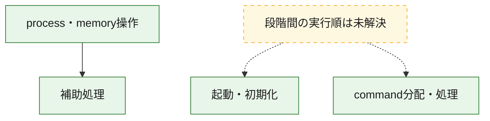
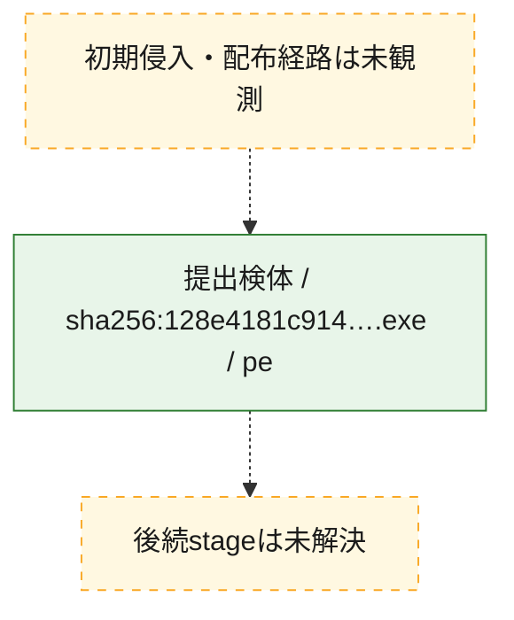
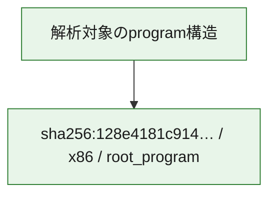

# 全体ロジック：128e4181c914a8d31bf910661a568189588c018ce11fe9065551f496ae06ce47

代表関数の静的証跡から、起動・初期化、process・memory操作、command分配・処理の処理群を確認しました。

## 読み方

- phaseの掲載順は解析上の整理順です。observed_call_edgesがない段階間の実行順を断定しません。
- 図の実線は静的に観測した関係、点線と黄色のノードは未観測・未解決の関係を示します。
- 図は静的な要約であり、動的実行を再現するものではありません。
- 詳細な関数解説とfingerprintは[STATIC-LOGIC.md](STATIC-LOGIC.md)を参照してください。

## 静的可視化

### 実行フロー

### 感染チェーン

### モジュール関係

## 処理段階

### 1. 起動・初期化

entry pointから初期化と後続処理への移行を確認します。
確度: `confirmed_static_function_evidence_with_limits`

- `128e4181c914a8d31bf910661a568189588c018ce11fe9065551f496ae06ce47:ghidra:140016d60` — 初期化と主要処理への分岐を行う入口関数です。 状態: `limited_bad_instruction_or_flow`、選定理由: `entry_point`, `meaningful_symbol_name`, `reviewed_call_centrality:9`, `role:entrypoint`

### 2. process・memory操作

process、thread、module、memory操作と実行移行を確認します。
確度: `confirmed_static_function_evidence`

- `128e4181c914a8d31bf910661a568189588c018ce11fe9065551f496ae06ce47:ghidra:1400015f0` — process、thread、module、またはmemory操作に関係する関数です。 状態: `succeeded`、選定理由: `context_representative`, `reviewed_call_centrality:9`, `role:process_or_memory_operation`

### 3. command分配・処理

受信commandやtaskの解釈、分配、個別handlerへの移行を確認します。
確度: `confirmed_static_function_evidence_with_limits`

- `128e4181c914a8d31bf910661a568189588c018ce11fe9065551f496ae06ce47:ghidra:14002cea0` — commandの解釈、分配、または個別処理を担当する関数です。 状態: `limited_bad_instruction_or_flow`、選定理由: `meaningful_symbol_name`, `role:command_dispatch_or_handler`

### 4. 補助処理

主要処理を支える一般内部関数またはlibrary処理を確認します。
確度: `confirmed_static_function_evidence`

- `128e4181c914a8d31bf910661a568189588c018ce11fe9065551f496ae06ce47:ghidra:140001000` — 検体内部の一般処理を実装する関数です。 状態: `succeeded`、選定理由: `context_representative`, `reviewed_call_centrality:14`
- `128e4181c914a8d31bf910661a568189588c018ce11fe9065551f496ae06ce47:ghidra:140001110` — 検体内部の一般処理を実装する関数です。 状態: `succeeded`、選定理由: `context_representative`, `reviewed_call_centrality:2`
- `128e4181c914a8d31bf910661a568189588c018ce11fe9065551f496ae06ce47:ghidra:140001170` — 検体内部の一般処理を実装する関数です。 状態: `succeeded`、選定理由: `context_representative`, `reviewed_call_centrality:2`
- `128e4181c914a8d31bf910661a568189588c018ce11fe9065551f496ae06ce47:ghidra:1400011d0` — 検体内部の一般処理を実装する関数です。 状態: `succeeded`、選定理由: `context_representative`, `reviewed_call_centrality:2`
- `128e4181c914a8d31bf910661a568189588c018ce11fe9065551f496ae06ce47:ghidra:140001230` — 検体内部の一般処理を実装する関数です。 状態: `succeeded`、選定理由: `context_representative`, `reviewed_call_centrality:2`
- `128e4181c914a8d31bf910661a568189588c018ce11fe9065551f496ae06ce47:ghidra:140001290` — 検体内部の一般処理を実装する関数です。 状態: `succeeded`、選定理由: `context_representative`, `reviewed_call_centrality:2`
- `128e4181c914a8d31bf910661a568189588c018ce11fe9065551f496ae06ce47:ghidra:1400012f0` — 検体内部の一般処理を実装する関数です。 状態: `succeeded`、選定理由: `context_representative`, `reviewed_call_centrality:2`
- `128e4181c914a8d31bf910661a568189588c018ce11fe9065551f496ae06ce47:ghidra:140001350` — 検体内部の一般処理を実装する関数です。 状態: `succeeded`、選定理由: `context_representative`, `reviewed_call_centrality:2`
- `128e4181c914a8d31bf910661a568189588c018ce11fe9065551f496ae06ce47:ghidra:1400013b0` — 検体内部の一般処理を実装する関数です。 状態: `succeeded`、選定理由: `context_representative`, `reviewed_call_centrality:2`
- `128e4181c914a8d31bf910661a568189588c018ce11fe9065551f496ae06ce47:ghidra:140001410` — 検体内部の一般処理を実装する関数です。 状態: `succeeded`、選定理由: `context_representative`, `reviewed_call_centrality:2`
- `128e4181c914a8d31bf910661a568189588c018ce11fe9065551f496ae06ce47:ghidra:140001470` — 検体内部の一般処理を実装する関数です。 状態: `succeeded`、選定理由: `context_representative`, `reviewed_call_centrality:2`
- `128e4181c914a8d31bf910661a568189588c018ce11fe9065551f496ae06ce47:ghidra:1400014d0` — 検体内部の一般処理を実装する関数です。 状態: `succeeded`、選定理由: `context_representative`, `reviewed_call_centrality:2`
- `128e4181c914a8d31bf910661a568189588c018ce11fe9065551f496ae06ce47:ghidra:140001530` — 検体内部の一般処理を実装する関数です。 状態: `succeeded`、選定理由: `context_representative`, `reviewed_call_centrality:2`
- `128e4181c914a8d31bf910661a568189588c018ce11fe9065551f496ae06ce47:ghidra:140001590` — 検体内部の一般処理を実装する関数です。 状態: `succeeded`、選定理由: `context_representative`, `reviewed_call_centrality:2`
- `128e4181c914a8d31bf910661a568189588c018ce11fe9065551f496ae06ce47:ghidra:140001750` — 検体内部の一般処理を実装する関数です。 状態: `succeeded`、選定理由: `context_representative`, `reviewed_call_centrality:2`
- `128e4181c914a8d31bf910661a568189588c018ce11fe9065551f496ae06ce47:ghidra:1400017b0` — 検体内部の一般処理を実装する関数です。 状態: `succeeded`、選定理由: `context_representative`, `reviewed_call_centrality:2`
- `128e4181c914a8d31bf910661a568189588c018ce11fe9065551f496ae06ce47:ghidra:140001810` — 検体内部の一般処理を実装する関数です。 状態: `succeeded`、選定理由: `context_representative`, `reviewed_call_centrality:26`
- `128e4181c914a8d31bf910661a568189588c018ce11fe9065551f496ae06ce47:ghidra:140001a30` — 検体内部の一般処理を実装する関数です。 状態: `succeeded`、選定理由: `context_representative`, `reviewed_call_centrality:2`
- `128e4181c914a8d31bf910661a568189588c018ce11fe9065551f496ae06ce47:ghidra:140001a90` — 検体内部の一般処理を実装する関数です。 状態: `succeeded`、選定理由: `context_representative`, `reviewed_call_centrality:2`
- `128e4181c914a8d31bf910661a568189588c018ce11fe9065551f496ae06ce47:ghidra:140001af0` — 検体内部の一般処理を実装する関数です。 状態: `succeeded`、選定理由: `context_representative`, `reviewed_call_centrality:2`
- `128e4181c914a8d31bf910661a568189588c018ce11fe9065551f496ae06ce47:ghidra:140001b50` — 検体内部の一般処理を実装する関数です。 状態: `succeeded`、選定理由: `context_representative`, `reviewed_call_centrality:2`
- `128e4181c914a8d31bf910661a568189588c018ce11fe9065551f496ae06ce47:ghidra:140001bb0` — 検体内部の一般処理を実装する関数です。 状態: `succeeded`、選定理由: `context_representative`, `reviewed_call_centrality:2`
- `128e4181c914a8d31bf910661a568189588c018ce11fe9065551f496ae06ce47:ghidra:140001c10` — 検体内部の一般処理を実装する関数です。 状態: `succeeded`、選定理由: `context_representative`, `reviewed_call_centrality:2`
- `128e4181c914a8d31bf910661a568189588c018ce11fe9065551f496ae06ce47:ghidra:140001c70` — 検体内部の一般処理を実装する関数です。 状態: `succeeded`、選定理由: `context_representative`, `reviewed_call_centrality:2`
- `128e4181c914a8d31bf910661a568189588c018ce11fe9065551f496ae06ce47:ghidra:140001cd0` — 検体内部の一般処理を実装する関数です。 状態: `succeeded`、選定理由: `context_representative`, `reviewed_call_centrality:2`
- `128e4181c914a8d31bf910661a568189588c018ce11fe9065551f496ae06ce47:ghidra:140001d30` — 検体内部の一般処理を実装する関数です。 状態: `succeeded`、選定理由: `context_representative`, `reviewed_call_centrality:2`
- `128e4181c914a8d31bf910661a568189588c018ce11fe9065551f496ae06ce47:ghidra:140001d90` — 検体内部の一般処理を実装する関数です。 状態: `succeeded`、選定理由: `context_representative`, `reviewed_call_centrality:2`
- `128e4181c914a8d31bf910661a568189588c018ce11fe9065551f496ae06ce47:ghidra:140001df0` — 検体内部の一般処理を実装する関数です。 状態: `succeeded`、選定理由: `context_representative`, `reviewed_call_centrality:2`
- `128e4181c914a8d31bf910661a568189588c018ce11fe9065551f496ae06ce47:ghidra:14002ce8c` — 検体内部の一般処理を実装する関数です。 状態: `succeeded`、選定理由: `meaningful_symbol_name`

## 観測したcall関係

- `128e4181c914a8d31bf910661a568189588c018ce11fe9065551f496ae06ce47:ghidra:140001000` → `128e4181c914a8d31bf910661a568189588c018ce11fe9065551f496ae06ce47:ghidra:140001110` （`support` → `support`）
- `128e4181c914a8d31bf910661a568189588c018ce11fe9065551f496ae06ce47:ghidra:140001000` → `128e4181c914a8d31bf910661a568189588c018ce11fe9065551f496ae06ce47:ghidra:140001170` （`support` → `support`）
- `128e4181c914a8d31bf910661a568189588c018ce11fe9065551f496ae06ce47:ghidra:140001000` → `128e4181c914a8d31bf910661a568189588c018ce11fe9065551f496ae06ce47:ghidra:1400011d0` （`support` → `support`）
- `128e4181c914a8d31bf910661a568189588c018ce11fe9065551f496ae06ce47:ghidra:140001000` → `128e4181c914a8d31bf910661a568189588c018ce11fe9065551f496ae06ce47:ghidra:140001230` （`support` → `support`）
- `128e4181c914a8d31bf910661a568189588c018ce11fe9065551f496ae06ce47:ghidra:140001000` → `128e4181c914a8d31bf910661a568189588c018ce11fe9065551f496ae06ce47:ghidra:140001290` （`support` → `support`）
- `128e4181c914a8d31bf910661a568189588c018ce11fe9065551f496ae06ce47:ghidra:140001000` → `128e4181c914a8d31bf910661a568189588c018ce11fe9065551f496ae06ce47:ghidra:1400012f0` （`support` → `support`）
- `128e4181c914a8d31bf910661a568189588c018ce11fe9065551f496ae06ce47:ghidra:140001000` → `128e4181c914a8d31bf910661a568189588c018ce11fe9065551f496ae06ce47:ghidra:140001350` （`support` → `support`）
- `128e4181c914a8d31bf910661a568189588c018ce11fe9065551f496ae06ce47:ghidra:140001000` → `128e4181c914a8d31bf910661a568189588c018ce11fe9065551f496ae06ce47:ghidra:1400013b0` （`support` → `support`）
- `128e4181c914a8d31bf910661a568189588c018ce11fe9065551f496ae06ce47:ghidra:140001000` → `128e4181c914a8d31bf910661a568189588c018ce11fe9065551f496ae06ce47:ghidra:140001410` （`support` → `support`）
- `128e4181c914a8d31bf910661a568189588c018ce11fe9065551f496ae06ce47:ghidra:140001000` → `128e4181c914a8d31bf910661a568189588c018ce11fe9065551f496ae06ce47:ghidra:140001470` （`support` → `support`）
- `128e4181c914a8d31bf910661a568189588c018ce11fe9065551f496ae06ce47:ghidra:140001000` → `128e4181c914a8d31bf910661a568189588c018ce11fe9065551f496ae06ce47:ghidra:1400014d0` （`support` → `support`）
- `128e4181c914a8d31bf910661a568189588c018ce11fe9065551f496ae06ce47:ghidra:140001000` → `128e4181c914a8d31bf910661a568189588c018ce11fe9065551f496ae06ce47:ghidra:140001530` （`support` → `support`）
- `128e4181c914a8d31bf910661a568189588c018ce11fe9065551f496ae06ce47:ghidra:140001000` → `128e4181c914a8d31bf910661a568189588c018ce11fe9065551f496ae06ce47:ghidra:140001590` （`support` → `support`）
- `128e4181c914a8d31bf910661a568189588c018ce11fe9065551f496ae06ce47:ghidra:1400015f0` → `128e4181c914a8d31bf910661a568189588c018ce11fe9065551f496ae06ce47:ghidra:140001750` （`execution` → `support`）
- `128e4181c914a8d31bf910661a568189588c018ce11fe9065551f496ae06ce47:ghidra:1400015f0` → `128e4181c914a8d31bf910661a568189588c018ce11fe9065551f496ae06ce47:ghidra:1400017b0` （`execution` → `support`）
- `128e4181c914a8d31bf910661a568189588c018ce11fe9065551f496ae06ce47:ghidra:140001810` → `128e4181c914a8d31bf910661a568189588c018ce11fe9065551f496ae06ce47:ghidra:140001a30` （`support` → `support`）
- `128e4181c914a8d31bf910661a568189588c018ce11fe9065551f496ae06ce47:ghidra:140001810` → `128e4181c914a8d31bf910661a568189588c018ce11fe9065551f496ae06ce47:ghidra:140001a90` （`support` → `support`）
- `128e4181c914a8d31bf910661a568189588c018ce11fe9065551f496ae06ce47:ghidra:140001810` → `128e4181c914a8d31bf910661a568189588c018ce11fe9065551f496ae06ce47:ghidra:140001af0` （`support` → `support`）
- `128e4181c914a8d31bf910661a568189588c018ce11fe9065551f496ae06ce47:ghidra:140001810` → `128e4181c914a8d31bf910661a568189588c018ce11fe9065551f496ae06ce47:ghidra:140001b50` （`support` → `support`）
- `128e4181c914a8d31bf910661a568189588c018ce11fe9065551f496ae06ce47:ghidra:140001810` → `128e4181c914a8d31bf910661a568189588c018ce11fe9065551f496ae06ce47:ghidra:140001bb0` （`support` → `support`）
- `128e4181c914a8d31bf910661a568189588c018ce11fe9065551f496ae06ce47:ghidra:140001810` → `128e4181c914a8d31bf910661a568189588c018ce11fe9065551f496ae06ce47:ghidra:140001c10` （`support` → `support`）
- `128e4181c914a8d31bf910661a568189588c018ce11fe9065551f496ae06ce47:ghidra:140001810` → `128e4181c914a8d31bf910661a568189588c018ce11fe9065551f496ae06ce47:ghidra:140001c70` （`support` → `support`）
- `128e4181c914a8d31bf910661a568189588c018ce11fe9065551f496ae06ce47:ghidra:140001810` → `128e4181c914a8d31bf910661a568189588c018ce11fe9065551f496ae06ce47:ghidra:140001cd0` （`support` → `support`）
- `128e4181c914a8d31bf910661a568189588c018ce11fe9065551f496ae06ce47:ghidra:140001810` → `128e4181c914a8d31bf910661a568189588c018ce11fe9065551f496ae06ce47:ghidra:140001d30` （`support` → `support`）
- `128e4181c914a8d31bf910661a568189588c018ce11fe9065551f496ae06ce47:ghidra:140001810` → `128e4181c914a8d31bf910661a568189588c018ce11fe9065551f496ae06ce47:ghidra:140001d90` （`support` → `support`）
- `128e4181c914a8d31bf910661a568189588c018ce11fe9065551f496ae06ce47:ghidra:140001810` → `128e4181c914a8d31bf910661a568189588c018ce11fe9065551f496ae06ce47:ghidra:140001df0` （`support` → `support`）
- `ghidra-function:0bfba86fa657e7ecbea67804` → `ghidra-function:0b871b3238e5ee216eab4274` （`unclassified` → `unclassified`）
- `ghidra-function:14095338f835173152da7d4c` → `ghidra-function:bcca1aa43c1120c862056aa1` （`unclassified` → `unclassified`）
- `ghidra-function:1c3166472812f621c3259c26` → `ghidra-function:c94a795fbc1f776d1e9c39f9` （`unclassified` → `unclassified`）
- `ghidra-function:278ed8a412c4691cdea61c30` → `ghidra-function:fe440ea2d59b472413729566` （`unclassified` → `unclassified`）
- `ghidra-function:3375d78f1f7beab87bc7dbee` → `ghidra-function:f8c6ea8a1ae1ea9c4659b209` （`unclassified` → `unclassified`）
- `ghidra-function:3d9cd609d9b91b55cce95564` → `ghidra-function:f60a5a2f987b3e1bab9fe913` （`unclassified` → `unclassified`）
- `ghidra-function:3fb6de4d53a2a5443ac65b22` → `ghidra-function:7af95908c41b5bdd5d5213a0` （`unclassified` → `unclassified`）
- `ghidra-function:4f54d423d2dbe34041f887bd` → `ghidra-function:fe440ea2d59b472413729566` （`unclassified` → `unclassified`）
- `ghidra-function:57f79d9139f848f86c1f403b` → `ghidra-function:bcca1aa43c1120c862056aa1` （`unclassified` → `unclassified`）
- `ghidra-function:5d79f61e4812dd1196024b4c` → `ghidra-external:27bdf1c8eb5e0d98fefa4289` （`unclassified` → `unclassified`）
- `ghidra-function:5d79f61e4812dd1196024b4c` → `ghidra-external:2eb2c6dcd898b9fd0c33cd87` （`unclassified` → `unclassified`）
- `ghidra-function:5d79f61e4812dd1196024b4c` → `ghidra-external:5862b68e24f29c2d3f51720d` （`unclassified` → `unclassified`）
- `ghidra-function:5d79f61e4812dd1196024b4c` → `ghidra-external:9afcb126d7e6695ceec70b97` （`unclassified` → `unclassified`）
- `ghidra-function:5d79f61e4812dd1196024b4c` → `ghidra-external:c0c1d8cfdd45c420526fd169` （`unclassified` → `unclassified`）
- `ghidra-function:5d79f61e4812dd1196024b4c` → `ghidra-function:4725ea4d2ca9346689ac67b5` （`unclassified` → `unclassified`）
- `ghidra-function:5d79f61e4812dd1196024b4c` → `ghidra-function:cbee7ebfa20d5c0fa87b01a6` （`unclassified` → `unclassified`）
- `ghidra-function:68cfa1c129c3a780dcf96f5f` → `ghidra-function:3f5cb6e3a6a8bd713de0f228` （`unclassified` → `unclassified`）
- `ghidra-function:7691b3c6ce506897bb7d58ab` → `ghidra-function:469f4552fde1ec1a6f3a29ff` （`unclassified` → `unclassified`）
- `ghidra-function:7be37d148e6ac4b16cbc9b06` → `ghidra-function:3218e9e5cc0b418063e1eb31` （`unclassified` → `unclassified`）
- `ghidra-function:84daae6912053f89bdea7d22` → `ghidra-function:82daafd967ddf4dfec85b014` （`unclassified` → `unclassified`）
- `ghidra-function:8a84f133537327f59f723710` → `ghidra-function:1d0f0c231d302ff5013fef82` （`unclassified` → `unclassified`）
- `ghidra-function:9172179054cb79b7d2aed314` → `ghidra-function:bcca1aa43c1120c862056aa1` （`unclassified` → `unclassified`）
- `ghidra-function:97e07118ebee15cd589864dc` → `ghidra-function:3375d78f1f7beab87bc7dbee` （`unclassified` → `unclassified`）
- `ghidra-function:97e07118ebee15cd589864dc` → `ghidra-function:3d9cd609d9b91b55cce95564` （`unclassified` → `unclassified`）
- `ghidra-function:97e07118ebee15cd589864dc` → `ghidra-function:68cfa1c129c3a780dcf96f5f` （`unclassified` → `unclassified`）
- `ghidra-function:97e07118ebee15cd589864dc` → `ghidra-function:7691b3c6ce506897bb7d58ab` （`unclassified` → `unclassified`）
- `ghidra-function:97e07118ebee15cd589864dc` → `ghidra-function:7be37d148e6ac4b16cbc9b06` （`unclassified` → `unclassified`）
- `ghidra-function:97e07118ebee15cd589864dc` → `ghidra-function:84daae6912053f89bdea7d22` （`unclassified` → `unclassified`）
- `ghidra-function:97e07118ebee15cd589864dc` → `ghidra-function:a920c9182fef9186fd158be7` （`unclassified` → `unclassified`）
- `ghidra-function:97e07118ebee15cd589864dc` → `ghidra-function:b39de2d2eae4677a968adaf4` （`unclassified` → `unclassified`）
- `ghidra-function:97e07118ebee15cd589864dc` → `ghidra-function:b6b8a1183650b1b4083313c7` （`unclassified` → `unclassified`）
- `ghidra-function:97e07118ebee15cd589864dc` → `ghidra-function:c92d01bacbb50c086bc5e109` （`unclassified` → `unclassified`）
- `ghidra-function:97e07118ebee15cd589864dc` → `ghidra-function:d95cfc5584b34734f8009aac` （`unclassified` → `unclassified`）
- `ghidra-function:97e07118ebee15cd589864dc` → `ghidra-function:e09fda3c568cb08ffe072753` （`unclassified` → `unclassified`）
- `ghidra-function:97e07118ebee15cd589864dc` → `ghidra-function:f27b06b82799456e09e9c47c` （`unclassified` → `unclassified`）
- `ghidra-function:97e07118ebee15cd589864dc` → `ghidra-function:f68a11a1d09ded8c8f71ab15` （`unclassified` → `unclassified`）
- `ghidra-function:a6fc12538c24b9c55ffc7ed1` → `ghidra-function:fe440ea2d59b472413729566` （`unclassified` → `unclassified`）
- `ghidra-function:a920c9182fef9186fd158be7` → `ghidra-function:7b3de56f9a7a9eb59f7d7683` （`unclassified` → `unclassified`）
- `ghidra-function:b6b8a1183650b1b4083313c7` → `ghidra-function:7b3de56f9a7a9eb59f7d7683` （`unclassified` → `unclassified`）
- `ghidra-function:c92d01bacbb50c086bc5e109` → `ghidra-function:fe440ea2d59b472413729566` （`unclassified` → `unclassified`）
- `ghidra-function:cc9a4b145f03d9476effdcd0` → `ghidra-function:fe440ea2d59b472413729566` （`unclassified` → `unclassified`）
- `ghidra-function:d83404684bf5e3150fef0396` → `ghidra-function:fe440ea2d59b472413729566` （`unclassified` → `unclassified`）
- `ghidra-function:d95cfc5584b34734f8009aac` → `ghidra-function:469f4552fde1ec1a6f3a29ff` （`unclassified` → `unclassified`）
- `ghidra-function:e09fda3c568cb08ffe072753` → `ghidra-function:f60a5a2f987b3e1bab9fe913` （`unclassified` → `unclassified`）
- `ghidra-function:e62f75c25c5b2927099e4b3b` → `ghidra-function:4893f75ed87b0c67dd34a66e` （`unclassified` → `unclassified`）
- `ghidra-function:ed53c33792a91ddb64bde9bf` → `ghidra-function:0bfba86fa657e7ecbea67804` （`unclassified` → `unclassified`）
- `ghidra-function:ed53c33792a91ddb64bde9bf` → `ghidra-function:14095338f835173152da7d4c` （`unclassified` → `unclassified`）
- `ghidra-function:ed53c33792a91ddb64bde9bf` → `ghidra-function:17892f0dae8a2d522e1bc490` （`unclassified` → `unclassified`）
- `ghidra-function:ed53c33792a91ddb64bde9bf` → `ghidra-function:19c8a3312d8c1e8059b87d40` （`unclassified` → `unclassified`）
- `ghidra-function:ed53c33792a91ddb64bde9bf` → `ghidra-function:1c3166472812f621c3259c26` （`unclassified` → `unclassified`）
- `ghidra-function:ed53c33792a91ddb64bde9bf` → `ghidra-function:278ed8a412c4691cdea61c30` （`unclassified` → `unclassified`）
- `ghidra-function:ed53c33792a91ddb64bde9bf` → `ghidra-function:32f473230f7370f4d1ac2733` （`unclassified` → `unclassified`）
- `ghidra-function:ed53c33792a91ddb64bde9bf` → `ghidra-function:3fb6de4d53a2a5443ac65b22` （`unclassified` → `unclassified`）
- `ghidra-function:ed53c33792a91ddb64bde9bf` → `ghidra-function:4f54d423d2dbe34041f887bd` （`unclassified` → `unclassified`）
- `ghidra-function:ed53c33792a91ddb64bde9bf` → `ghidra-function:53d619f87dacfa52ad220381` （`unclassified` → `unclassified`）
- `ghidra-function:ed53c33792a91ddb64bde9bf` → `ghidra-function:57f79d9139f848f86c1f403b` （`unclassified` → `unclassified`）
- `ghidra-function:ed53c33792a91ddb64bde9bf` → `ghidra-function:632ff5f4a5836f22deae2d29` （`unclassified` → `unclassified`）
- `ghidra-function:ed53c33792a91ddb64bde9bf` → `ghidra-function:7e89281a1e06d0dcf835dc90` （`unclassified` → `unclassified`）
- `ghidra-function:ed53c33792a91ddb64bde9bf` → `ghidra-function:80a0bef14d12e79037d44f8f` （`unclassified` → `unclassified`）
- `ghidra-function:ed53c33792a91ddb64bde9bf` → `ghidra-function:9172179054cb79b7d2aed314` （`unclassified` → `unclassified`）
- `ghidra-function:ed53c33792a91ddb64bde9bf` → `ghidra-function:9bc8200dce83cd01e97ed815` （`unclassified` → `unclassified`）
- `ghidra-function:ed53c33792a91ddb64bde9bf` → `ghidra-function:a6fc12538c24b9c55ffc7ed1` （`unclassified` → `unclassified`）
- `ghidra-function:ed53c33792a91ddb64bde9bf` → `ghidra-function:b39de2d2eae4677a968adaf4` （`unclassified` → `unclassified`）
- `ghidra-function:ed53c33792a91ddb64bde9bf` → `ghidra-function:d83404684bf5e3150fef0396` （`unclassified` → `unclassified`）
- `ghidra-function:ed53c33792a91ddb64bde9bf` → `ghidra-function:deeb4502005cdbeaede53dcd` （`unclassified` → `unclassified`）
- `ghidra-function:ed53c33792a91ddb64bde9bf` → `ghidra-function:df1635cdc47ce47bb396fa6d` （`unclassified` → `unclassified`）
- `ghidra-function:ed53c33792a91ddb64bde9bf` → `ghidra-function:e270539827cb429f0af6629d` （`unclassified` → `unclassified`）
- `ghidra-function:ed53c33792a91ddb64bde9bf` → `ghidra-function:e62f75c25c5b2927099e4b3b` （`unclassified` → `unclassified`）
- `ghidra-function:ed53c33792a91ddb64bde9bf` → `ghidra-function:fb751386b2a90a23b9199317` （`unclassified` → `unclassified`）
- `ghidra-function:f27b06b82799456e09e9c47c` → `ghidra-function:3f08fe2b5b9eda5dcd500cf4` （`unclassified` → `unclassified`）
- `ghidra-function:f47107f37bd89ad2e95ba1a3` → `ghidra-function:64582ab18d84bf881e56bd8a` （`unclassified` → `unclassified`）
- `ghidra-function:f47107f37bd89ad2e95ba1a3` → `ghidra-function:80a0bef14d12e79037d44f8f` （`unclassified` → `unclassified`）
- `ghidra-function:f47107f37bd89ad2e95ba1a3` → `ghidra-function:8a84f133537327f59f723710` （`unclassified` → `unclassified`）
- `ghidra-function:f47107f37bd89ad2e95ba1a3` → `ghidra-function:b39de2d2eae4677a968adaf4` （`unclassified` → `unclassified`）
- `ghidra-function:f47107f37bd89ad2e95ba1a3` → `ghidra-function:bd4fb161264ff4ddb76a6b53` （`unclassified` → `unclassified`）
- `ghidra-function:f47107f37bd89ad2e95ba1a3` → `ghidra-function:cc9a4b145f03d9476effdcd0` （`unclassified` → `unclassified`）
- `ghidra-function:f68a11a1d09ded8c8f71ab15` → `ghidra-function:7b3de56f9a7a9eb59f7d7683` （`unclassified` → `unclassified`）

## 解析範囲と制約

- 選定外関数は全体inventoryへ残しますが、関数本体の個別解説対象にはしていません。
- indirect call、難読化、packer、VM、壊れたcontrol flowによりcall関係が欠落する場合があります。
- 文書は静的解析に基づき、検体実行や外部通信による動的確認は行っていません。
