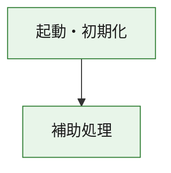
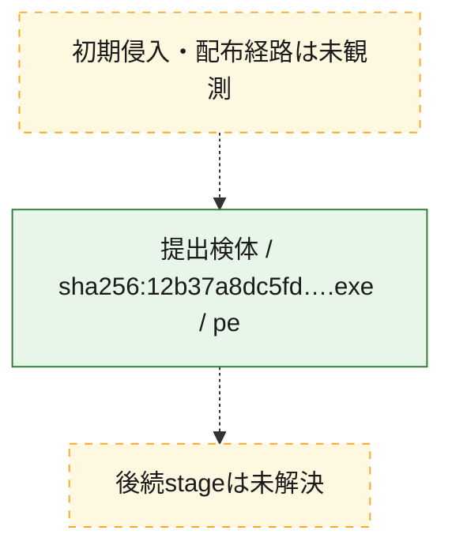
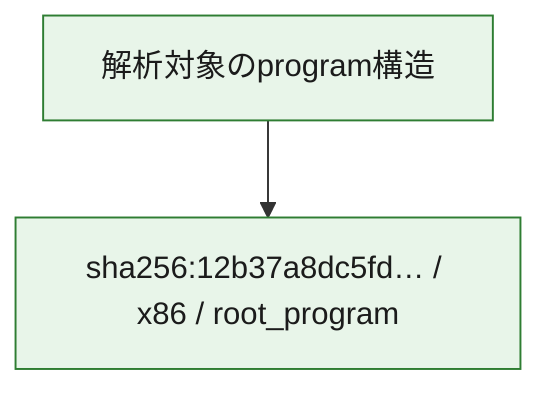

# 全体ロジック：12b37a8dc5fdd43fb9c2c7826fb46b4f0276f372e1f3f7dda41b9be60176c7f2

代表関数の静的証跡から、起動・初期化の処理群を確認しました。

## 読み方

- phaseの掲載順は解析上の整理順です。observed_call_edgesがない段階間の実行順を断定しません。
- 図の実線は静的に観測した関係、点線と黄色のノードは未観測・未解決の関係を示します。
- 図は静的な要約であり、動的実行を再現するものではありません。
- 詳細な関数解説とfingerprintは[STATIC-LOGIC.md](STATIC-LOGIC.md)を参照してください。

## 静的可視化

### 実行フロー

### 感染チェーン

### モジュール関係

## 処理段階

### 1. 起動・初期化

entry pointから初期化と後続処理への移行を確認します。
確度: `confirmed_static_function_evidence`

- `12b37a8dc5fdd43fb9c2c7826fb46b4f0276f372e1f3f7dda41b9be60176c7f2:ghidra:180001010` — 初期化と主要処理への分岐を行う入口関数です。 状態: `succeeded`、選定理由: `entry_point`, `meaningful_symbol_name`, `reviewed_call_centrality:22`, `role:entrypoint`, `small_program_complete_context`

### 2. 補助処理

主要処理を支える一般内部関数またはlibrary処理を確認します。
確度: `confirmed_static_function_evidence`

- `12b37a8dc5fdd43fb9c2c7826fb46b4f0276f372e1f3f7dda41b9be60176c7f2:ghidra:180001240` — 検体内部の一般処理を実装する関数です。 状態: `succeeded`、選定理由: `context_representative`, `reviewed_call_centrality:2`, `small_program_complete_context`
- `12b37a8dc5fdd43fb9c2c7826fb46b4f0276f372e1f3f7dda41b9be60176c7f2:ghidra:180001350` — 検体内部の一般処理を実装する関数です。 状態: `succeeded`、選定理由: `context_representative`, `reviewed_call_centrality:25`, `small_program_complete_context`
- `12b37a8dc5fdd43fb9c2c7826fb46b4f0276f372e1f3f7dda41b9be60176c7f2:ghidra:180003780` — 検体内部の一般処理を実装する関数です。 状態: `succeeded`、選定理由: `context_representative`, `reviewed_call_centrality:2`, `small_program_complete_context`
- `12b37a8dc5fdd43fb9c2c7826fb46b4f0276f372e1f3f7dda41b9be60176c7f2:ghidra:1800038e0` — 検体内部の一般処理を実装する関数です。 状態: `succeeded`、選定理由: `context_representative`, `reviewed_call_centrality:2`, `small_program_complete_context`

## 観測したcall関係

- `12b37a8dc5fdd43fb9c2c7826fb46b4f0276f372e1f3f7dda41b9be60176c7f2:ghidra:180001010` → `12b37a8dc5fdd43fb9c2c7826fb46b4f0276f372e1f3f7dda41b9be60176c7f2:ghidra:180001240` （`startup` → `support`）
- `12b37a8dc5fdd43fb9c2c7826fb46b4f0276f372e1f3f7dda41b9be60176c7f2:ghidra:180001010` → `12b37a8dc5fdd43fb9c2c7826fb46b4f0276f372e1f3f7dda41b9be60176c7f2:ghidra:180001350` （`startup` → `support`）
- `12b37a8dc5fdd43fb9c2c7826fb46b4f0276f372e1f3f7dda41b9be60176c7f2:ghidra:180001350` → `12b37a8dc5fdd43fb9c2c7826fb46b4f0276f372e1f3f7dda41b9be60176c7f2:ghidra:180001240` （`support` → `support`）
- `12b37a8dc5fdd43fb9c2c7826fb46b4f0276f372e1f3f7dda41b9be60176c7f2:ghidra:180001350` → `12b37a8dc5fdd43fb9c2c7826fb46b4f0276f372e1f3f7dda41b9be60176c7f2:ghidra:180003780` （`support` → `support`）
- `12b37a8dc5fdd43fb9c2c7826fb46b4f0276f372e1f3f7dda41b9be60176c7f2:ghidra:180001350` → `12b37a8dc5fdd43fb9c2c7826fb46b4f0276f372e1f3f7dda41b9be60176c7f2:ghidra:1800038e0` （`support` → `support`）
- `12b37a8dc5fdd43fb9c2c7826fb46b4f0276f372e1f3f7dda41b9be60176c7f2:ghidra:180003780` → `12b37a8dc5fdd43fb9c2c7826fb46b4f0276f372e1f3f7dda41b9be60176c7f2:ghidra:1800038e0` （`support` → `support`）
- `ghidra-function:3932b16f70cd8fdcc050210f` → `ghidra-external:1d2fef9410d2b5caa461b388` （`unclassified` → `unclassified`）
- `ghidra-function:3932b16f70cd8fdcc050210f` → `ghidra-external:338b03baa2691b632bd0e6cb` （`unclassified` → `unclassified`）
- `ghidra-function:3932b16f70cd8fdcc050210f` → `ghidra-external:49c93c4e98829bd75acaa085` （`unclassified` → `unclassified`）
- `ghidra-function:3932b16f70cd8fdcc050210f` → `ghidra-external:4a1ad6431d59b52f4b2474d0` （`unclassified` → `unclassified`）
- `ghidra-function:3932b16f70cd8fdcc050210f` → `ghidra-external:4a7d25216c2e0155b6227f84` （`unclassified` → `unclassified`）
- `ghidra-function:3932b16f70cd8fdcc050210f` → `ghidra-external:4c30afb42fe31ce9cbf0909c` （`unclassified` → `unclassified`）
- `ghidra-function:3932b16f70cd8fdcc050210f` → `ghidra-external:57a7312211011cee1f00a899` （`unclassified` → `unclassified`）
- `ghidra-function:3932b16f70cd8fdcc050210f` → `ghidra-external:76a6e327afe922527f45e384` （`unclassified` → `unclassified`）
- `ghidra-function:3932b16f70cd8fdcc050210f` → `ghidra-external:80e78d8d5b5e6bfd86368c4a` （`unclassified` → `unclassified`）
- `ghidra-function:3932b16f70cd8fdcc050210f` → `ghidra-external:98deb3c93c39a3d976e16424` （`unclassified` → `unclassified`）
- `ghidra-function:3932b16f70cd8fdcc050210f` → `ghidra-external:9bf2c8128d123c538c2df3dd` （`unclassified` → `unclassified`）
- `ghidra-function:3932b16f70cd8fdcc050210f` → `ghidra-external:a34b311ef42a62bcc45f3593` （`unclassified` → `unclassified`）
- `ghidra-function:3932b16f70cd8fdcc050210f` → `ghidra-external:a6a5fdc23a813009d890d39c` （`unclassified` → `unclassified`）
- `ghidra-function:3932b16f70cd8fdcc050210f` → `ghidra-external:ac36ac33b83a5fa45074ec38` （`unclassified` → `unclassified`）
- `ghidra-function:3932b16f70cd8fdcc050210f` → `ghidra-external:b52932a2a8ecb97082bea2a0` （`unclassified` → `unclassified`）
- `ghidra-function:3932b16f70cd8fdcc050210f` → `ghidra-external:cfe47c2d31f166c14ff68c94` （`unclassified` → `unclassified`）
- `ghidra-function:3932b16f70cd8fdcc050210f` → `ghidra-external:d3e598d43e04a61a2d74e593` （`unclassified` → `unclassified`）
- `ghidra-function:3932b16f70cd8fdcc050210f` → `ghidra-external:d45c619d256850f7fb2ec4eb` （`unclassified` → `unclassified`）
- `ghidra-function:3932b16f70cd8fdcc050210f` → `ghidra-external:da9bd2070ab804a5056f2de2` （`unclassified` → `unclassified`）
- `ghidra-function:3932b16f70cd8fdcc050210f` → `ghidra-external:e2dc12e5f0162133d397535a` （`unclassified` → `unclassified`）
- `ghidra-function:3932b16f70cd8fdcc050210f` → `ghidra-external:f9a9b8597181c969824b5043` （`unclassified` → `unclassified`）
- `ghidra-function:3932b16f70cd8fdcc050210f` → `ghidra-function:7d4b7bb77d20becbd4133eb0` （`unclassified` → `unclassified`）
- `ghidra-function:3932b16f70cd8fdcc050210f` → `ghidra-function:85190228159d650d2947fb30` （`unclassified` → `unclassified`）
- `ghidra-function:3932b16f70cd8fdcc050210f` → `ghidra-function:efbb489c82507d64f84f301c` （`unclassified` → `unclassified`）
- `ghidra-function:ec50c8f4bf463d60c3ae953b` → `ghidra-function:0e5d5ac3cc5040bf1daa8c58` （`unclassified` → `unclassified`）
- `ghidra-function:ec50c8f4bf463d60c3ae953b` → `ghidra-function:3932b16f70cd8fdcc050210f` （`unclassified` → `unclassified`）
- `ghidra-function:ec50c8f4bf463d60c3ae953b` → `ghidra-function:446f05006fcbac6da68823e8` （`unclassified` → `unclassified`）
- `ghidra-function:ec50c8f4bf463d60c3ae953b` → `ghidra-function:4ecb4f92c38308341d1a5b02` （`unclassified` → `unclassified`）
- `ghidra-function:ec50c8f4bf463d60c3ae953b` → `ghidra-function:7d4b7bb77d20becbd4133eb0` （`unclassified` → `unclassified`）
- `ghidra-function:ec50c8f4bf463d60c3ae953b` → `ghidra-function:a814761d8423461d7335e07f` （`unclassified` → `unclassified`）
- `ghidra-function:ec50c8f4bf463d60c3ae953b` → `ghidra-function:be2e55a0fb593985c6a6ac7a` （`unclassified` → `unclassified`）
- `ghidra-function:ec50c8f4bf463d60c3ae953b` → `ghidra-function:bf4f41fe093c44a70ce82b8e` （`unclassified` → `unclassified`）
- `ghidra-function:ec50c8f4bf463d60c3ae953b` → `ghidra-function:c23f3007cc621e7d5f1b53fd` （`unclassified` → `unclassified`）
- `ghidra-function:ec50c8f4bf463d60c3ae953b` → `ghidra-function:c35ffddb29b46f879494267d` （`unclassified` → `unclassified`）
- `ghidra-function:ec50c8f4bf463d60c3ae953b` → `ghidra-function:d40183666f62a194ac4f947a` （`unclassified` → `unclassified`）
- `ghidra-function:ec50c8f4bf463d60c3ae953b` → `ghidra-function:faca79ea0cdeb6895cec4abe` （`unclassified` → `unclassified`）
- `ghidra-function:efbb489c82507d64f84f301c` → `ghidra-function:85190228159d650d2947fb30` （`unclassified` → `unclassified`）

## 解析範囲と制約

- 選定外関数は全体inventoryへ残しますが、関数本体の個別解説対象にはしていません。
- indirect call、難読化、packer、VM、壊れたcontrol flowによりcall関係が欠落する場合があります。
- 文書は静的解析に基づき、検体実行や外部通信による動的確認は行っていません。
