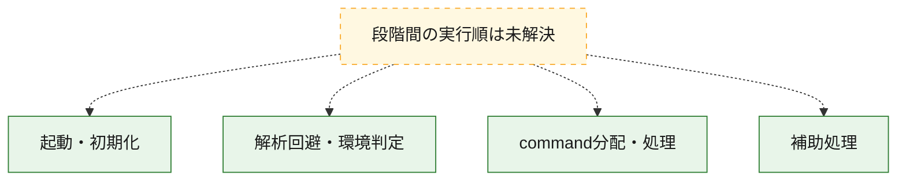
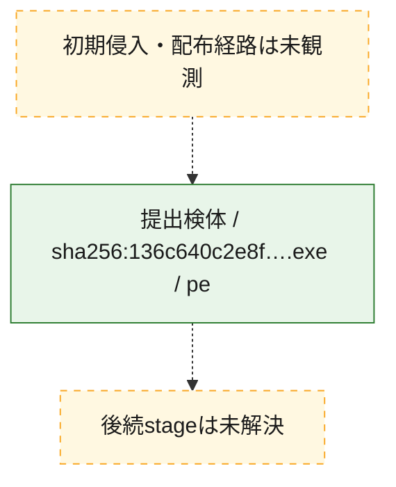
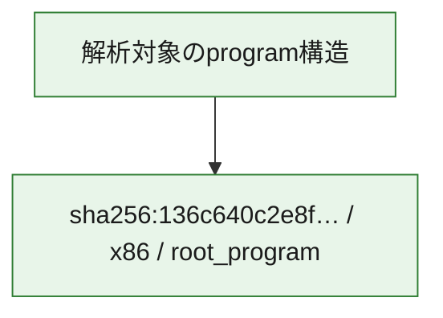

# 全体ロジック：136c640c2e8fa24a757f072ab07e41563cb178852282fcf4fa36572df94b7fac

代表関数の静的証跡から、起動・初期化、解析回避・環境判定、command分配・処理の処理群を確認しました。

## 読み方

- phaseの掲載順は解析上の整理順です。observed_call_edgesがない段階間の実行順を断定しません。
- 図の実線は静的に観測した関係、点線と黄色のノードは未観測・未解決の関係を示します。
- 図は静的な要約であり、動的実行を再現するものではありません。
- 詳細な関数解説とfingerprintは[STATIC-LOGIC.md](STATIC-LOGIC.md)を参照してください。

## 静的可視化

### 実行フロー

### 感染チェーン

### モジュール関係

## 処理段階

### 1. 起動・初期化

entry pointから初期化と後続処理への移行を確認します。
確度: `confirmed_static_function_evidence`

- `136c640c2e8fa24a757f072ab07e41563cb178852282fcf4fa36572df94b7fac:ghidra:14006c5f0` — 初期化と主要処理への分岐を行う入口関数です。 状態: `succeeded`、選定理由: `entry_point`, `meaningful_symbol_name`, `reviewed_call_centrality:22`, `role:entrypoint`

### 2. 解析回避・環境判定

debugger、sandbox、仮想環境、時間差などの判定を確認します。
確度: `confirmed_static_function_evidence`

- `136c640c2e8fa24a757f072ab07e41563cb178852282fcf4fa36572df94b7fac:ghidra:14006b110` — debugger、仮想環境、sandbox、または時間差の確認に関係する関数です。 状態: `succeeded`、選定理由: `context_representative`, `reviewed_call_centrality:6`, `role:anti_analysis`

### 3. command分配・処理

受信commandやtaskの解釈、分配、個別handlerへの移行を確認します。
確度: `confirmed_static_function_evidence_with_limits`

- `136c640c2e8fa24a757f072ab07e41563cb178852282fcf4fa36572df94b7fac:ghidra:140077af0` — commandの解釈、分配、または個別処理を担当する関数です。 状態: `limited_bad_instruction_or_flow`、選定理由: `meaningful_symbol_name`, `reviewed_call_centrality:1`, `role:command_dispatch_or_handler`

### 4. 補助処理

主要処理を支える一般内部関数またはlibrary処理を確認します。
確度: `confirmed_static_function_evidence_with_limits`

- `136c640c2e8fa24a757f072ab07e41563cb178852282fcf4fa36572df94b7fac:ghidra:140001000` — 検体内部の一般処理を実装する関数です。 状態: `failed`、選定理由: `context_representative`, `reviewed_call_centrality:1`
- `136c640c2e8fa24a757f072ab07e41563cb178852282fcf4fa36572df94b7fac:ghidra:14003fee0` — 検体内部の一般処理を実装する関数です。 状態: `succeeded`、選定理由: `context_representative`, `reviewed_call_centrality:2`
- `136c640c2e8fa24a757f072ab07e41563cb178852282fcf4fa36572df94b7fac:ghidra:140046230` — 検体内部の一般処理を実装する関数です。 状態: `succeeded`、選定理由: `context_representative`, `reviewed_call_centrality:3`
- `136c640c2e8fa24a757f072ab07e41563cb178852282fcf4fa36572df94b7fac:ghidra:140048c80` — 検体内部の一般処理を実装する関数です。 状態: `succeeded`、選定理由: `context_representative`, `reviewed_call_centrality:4`
- `136c640c2e8fa24a757f072ab07e41563cb178852282fcf4fa36572df94b7fac:ghidra:14004e260` — 検体内部の一般処理を実装する関数です。 状態: `succeeded`、選定理由: `context_representative`, `reviewed_call_centrality:4`
- `136c640c2e8fa24a757f072ab07e41563cb178852282fcf4fa36572df94b7fac:ghidra:140051b10` — 検体内部の一般処理を実装する関数です。 状態: `succeeded`、選定理由: `context_representative`, `reviewed_call_centrality:3`
- `136c640c2e8fa24a757f072ab07e41563cb178852282fcf4fa36572df94b7fac:ghidra:1400532c0` — 検体内部の一般処理を実装する関数です。 状態: `succeeded`、選定理由: `context_representative`, `reviewed_call_centrality:2`
- `136c640c2e8fa24a757f072ab07e41563cb178852282fcf4fa36572df94b7fac:ghidra:140054780` — 検体内部の一般処理を実装する関数です。 状態: `succeeded`、選定理由: `context_representative`, `reviewed_call_centrality:4`
- `136c640c2e8fa24a757f072ab07e41563cb178852282fcf4fa36572df94b7fac:ghidra:140055760` — 検体内部の一般処理を実装する関数です。 状態: `succeeded`、選定理由: `context_representative`, `reviewed_call_centrality:1`
- `136c640c2e8fa24a757f072ab07e41563cb178852282fcf4fa36572df94b7fac:ghidra:140056b60` — 検体内部の一般処理を実装する関数です。 状態: `succeeded`、選定理由: `context_representative`, `reviewed_call_centrality:4`
- `136c640c2e8fa24a757f072ab07e41563cb178852282fcf4fa36572df94b7fac:ghidra:140059d30` — 検体内部の一般処理を実装する関数です。 状態: `succeeded`、選定理由: `context_representative`, `reviewed_call_centrality:3`
- `136c640c2e8fa24a757f072ab07e41563cb178852282fcf4fa36572df94b7fac:ghidra:14005c2b0` — 検体内部の一般処理を実装する関数です。 状態: `succeeded`、選定理由: `context_representative`, `reviewed_call_centrality:3`
- `136c640c2e8fa24a757f072ab07e41563cb178852282fcf4fa36572df94b7fac:ghidra:14005de50` — 検体内部の一般処理を実装する関数です。 状態: `succeeded`、選定理由: `context_representative`, `reviewed_call_centrality:3`
- `136c640c2e8fa24a757f072ab07e41563cb178852282fcf4fa36572df94b7fac:ghidra:1400609f0` — 検体内部の一般処理を実装する関数です。 状態: `succeeded`、選定理由: `context_representative`, `reviewed_call_centrality:3`
- `136c640c2e8fa24a757f072ab07e41563cb178852282fcf4fa36572df94b7fac:ghidra:1400622f0` — 検体内部の一般処理を実装する関数です。 状態: `succeeded`、選定理由: `context_representative`, `reviewed_call_centrality:6`
- `136c640c2e8fa24a757f072ab07e41563cb178852282fcf4fa36572df94b7fac:ghidra:14006aec0` — 検体内部の一般処理を実装する関数です。 状態: `limited_bad_instruction_or_flow`、選定理由: `context_representative`, `reviewed_call_centrality:1`
- `136c640c2e8fa24a757f072ab07e41563cb178852282fcf4fa36572df94b7fac:ghidra:14006af2e` — 検体内部の一般処理を実装する関数です。 状態: `succeeded`、選定理由: `context_representative`, `reviewed_call_centrality:7`
- `136c640c2e8fa24a757f072ab07e41563cb178852282fcf4fa36572df94b7fac:ghidra:14006afc0` — 検体内部の一般処理を実装する関数です。 状態: `succeeded`、選定理由: `context_representative`, `reviewed_call_centrality:9`
- `136c640c2e8fa24a757f072ab07e41563cb178852282fcf4fa36572df94b7fac:ghidra:14006b3c0` — 検体内部の一般処理を実装する関数です。 状態: `limited_bad_instruction_or_flow`、選定理由: `context_representative`, `reviewed_call_centrality:2`
- `136c640c2e8fa24a757f072ab07e41563cb178852282fcf4fa36572df94b7fac:ghidra:14006b7f0` — 検体内部の一般処理を実装する関数です。 状態: `limited_bad_instruction_or_flow`、選定理由: `context_representative`, `reviewed_call_centrality:2`
- `136c640c2e8fa24a757f072ab07e41563cb178852282fcf4fa36572df94b7fac:ghidra:14006bc20` — 検体内部の一般処理を実装する関数です。 状態: `limited_bad_instruction_or_flow`、選定理由: `context_representative`
- `136c640c2e8fa24a757f072ab07e41563cb178852282fcf4fa36572df94b7fac:ghidra:14006bed0` — 検体内部の一般処理を実装する関数です。 状態: `limited_bad_instruction_or_flow`、選定理由: `context_representative`
- `136c640c2e8fa24a757f072ab07e41563cb178852282fcf4fa36572df94b7fac:ghidra:14006c180` — 検体内部の一般処理を実装する関数です。 状態: `succeeded`、選定理由: `context_representative`
- `136c640c2e8fa24a757f072ab07e41563cb178852282fcf4fa36572df94b7fac:ghidra:14006c1a0` — 検体内部の一般処理を実装する関数です。 状態: `succeeded`、選定理由: `context_representative`
- `136c640c2e8fa24a757f072ab07e41563cb178852282fcf4fa36572df94b7fac:ghidra:14006c290` — 検体内部の一般処理を実装する関数です。 状態: `succeeded`、選定理由: `context_representative`
- `136c640c2e8fa24a757f072ab07e41563cb178852282fcf4fa36572df94b7fac:ghidra:14006c2b0` — 検体内部の一般処理を実装する関数です。 状態: `succeeded`、選定理由: `context_representative`
- `136c640c2e8fa24a757f072ab07e41563cb178852282fcf4fa36572df94b7fac:ghidra:14006c390` — 検体内部の一般処理を実装する関数です。 状態: `succeeded`、選定理由: `context_representative`, `reviewed_call_centrality:20`
- `136c640c2e8fa24a757f072ab07e41563cb178852282fcf4fa36572df94b7fac:ghidra:14006c450` — 検体内部の一般処理を実装する関数です。 状態: `succeeded`、選定理由: `context_representative`, `reviewed_call_centrality:1`
- `136c640c2e8fa24a757f072ab07e41563cb178852282fcf4fa36572df94b7fac:ghidra:14006d500` — 検体内部の一般処理を実装する関数です。 状態: `succeeded`、選定理由: `meaningful_symbol_name`, `reviewed_call_centrality:1`

## 観測したcall関係

- 代表関数間で直接解決できた呼出関係はありません。

## 解析範囲と制約

- 選定外関数は全体inventoryへ残しますが、関数本体の個別解説対象にはしていません。
- indirect call、難読化、packer、VM、壊れたcontrol flowによりcall関係が欠落する場合があります。
- 文書は静的解析に基づき、検体実行や外部通信による動的確認は行っていません。
