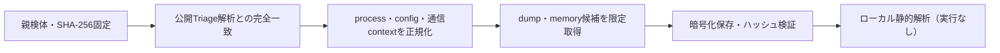

# Triage公開解析・後段取得証跡

## 完全ハッシュ一致

- [260814-stx5kadq3t](https://tria.ge/260814-stx5kadq3t): ファミリー候補 `未確定`、評価score `None`

## プロセス・通信

- 観測process: `取得できず`
- raw commandは保存せず、command SHA-256と処理patternだけをJSONへ保持します。
- sandbox background trafficは`context_only`であり、C2へ自動昇格しません。

- 取得できませんでした。

## 後段取得物

- `4170cbe4b5679002b47201d6ff42ffb2f7924849429ecd152f7343f111cb2638` / `memory_image` / 8192 bytes / 親と同一: `false` / 静的解析: `partial`
- `1b4338104637271022e7e6bc8eb8ad786e989630e439bc0811db484e4ffc73ca` / `memory_image` / 4980736 bytes / 親と同一: `false` / 静的解析: `partial`
- `170fe0d4434098f28789023d34093959acc7b99f4051984eb755c1717e0fe0ca` / `memory_image` / 1773568 bytes / 親と同一: `false` / 静的解析: `partial`
- `8b2d8b2067c830b524824c81c403c9bf30108c6c2dea410a96da2b6597a79340` / `memory_image` / 4980736 bytes / 親と同一: `false` / 静的解析: `partial`
- `e3819833ff1cd9513a025cc93cd32258d1a31b637ce63f9c345749322052513b` / `memory_image` / 4980736 bytes / 親と同一: `false` / 静的解析: `partial`
- `7e76fa8a77a4a1f89f7f20211219c1b99d90a20ccb83cc36b29a4042bf56b8cb` / `memory_image` / 4980736 bytes / 親と同一: `false` / 静的解析: `partial`
- `cbd4177260bd6704c26fdba92dde03f31480ac3011af57280599c9f1c0296382` / `memory_image` / 4980736 bytes / 親と同一: `false` / 静的解析: `partial`
- `d8ff623c9437155bea52ae5ff98f1ef5f7e8fdcf46f47c59aabdbc1eeb57d385` / `memory_image` / 65536 bytes / 親と同一: `false` / 静的解析: `partial`
- `724ec65830ac54e5c4c8ae8ad3499d86f71d6c3513b3c904e2d4498cd8472f46` / `memory_image` / 65536 bytes / 親と同一: `false` / 静的解析: `partial`
- `24aed6526459586ad2a840db900e22a28afc0e382ac72e498e87c98b9011c714` / `memory_image` / 139264 bytes / 親と同一: `false` / 静的解析: `partial`
- `91f6d320fa32af2bf79e5e897b70ae7c9c0298b8183f4ecfe6a03725114352f6` / `memory_image` / 4980736 bytes / 親と同一: `false` / 静的解析: `partial`
- `fe1d213b63b56fdbf7af8f8dd800159a54837508b96c44e53deb0683bc722db0` / `memory_image` / 4980736 bytes / 親と同一: `false` / 静的解析: `partial`
- `583d55ea75fbdf050b30d431414bd9d93a306af3540a6eaa2bc982a057013745` / `memory_image` / 1773568 bytes / 親と同一: `false` / 静的解析: `partial`
- `b34988adde7e9ed122f6823742eecffc676dac68a410760ba2362e40f9fd88aa` / `memory_image` / 4980736 bytes / 親と同一: `false` / 静的解析: `partial`
- `05e150aa7ecb2d15d1962678b8389879f0b8feab00096fd3d4086e49b541a31f` / `memory_image` / 4980736 bytes / 親と同一: `false` / 静的解析: `partial`
- `d1f99421aba422530e417e1f28011e306e13c4acea1776c4dd3761fbb3d7ff6a` / `memory_image` / 1773568 bytes / 親と同一: `false` / 静的解析: `partial`
- `c5c3268c5bdc46b02ab115ef736e62bb4ea1dd5ba3ee9c0f45b554eaca777a6d` / `memory_image` / 8192 bytes / 親と同一: `false` / 静的解析: `partial`
- `6ca068f59aa81a286c06c9e7c2849c14396af60d3316790b91323dbf22411ce1` / `memory_image` / 4980736 bytes / 親と同一: `false` / 静的解析: `partial`
- `66cee837743e7c09b29434738791b62e7e9a64c605f552c5b91e1e6eb433f133` / `memory_image` / 4980736 bytes / 親と同一: `false` / 静的解析: `partial`
- `5edad97ade229cc676623d3144aad226befeacd4b84572b2932665053d509a62` / `memory_image` / 4980736 bytes / 親と同一: `false` / 静的解析: `partial`
- `f09cac78c9e2824a86e10143c308b5f29f359d8b2a527e9db56b52028f599cca` / `memory_image` / 4980736 bytes / 親と同一: `false` / 静的解析: `partial`
- `1968be3abee6b263803b2b0d67c4d7967e205f4f8090c1356ad2cab2100f0d3c` / `memory_image` / 4980736 bytes / 親と同一: `false` / 静的解析: `partial`
- `2d72f4a7c69f109ddf7e48501850067dd110f01beb09257f0ca0d5f3bcfda330` / `memory_image` / 1773568 bytes / 親と同一: `false` / 静的解析: `partial`
- `466fd8fed1f34bdb8c5bb231e645b72d851ac54bee1b75b3cb6f211f03f5cfdb` / `memory_image` / 4980736 bytes / 親と同一: `false` / 静的解析: `partial`
- `0d90a89d278212b5afba1c68cb8271b1a50ea726e9a8d4a2fbb015c9053d2099` / `memory_image` / 4980736 bytes / 親と同一: `false` / 静的解析: `partial`
- `849529521534b144be2da9d17e8d1c9976de25dca3ae42a4b67958879e59293e` / `memory_image` / 4980736 bytes / 親と同一: `false` / 静的解析: `partial`
- `1eda02008a0ce330bce3cbba4169d1e6d2d5c13c4dfd01ad32ec604c7d817831` / `memory_image` / 4980736 bytes / 親と同一: `false` / 静的解析: `partial`
- `615f05ec22b67a697c37b1aa17150d04a62d5156fa46216be34c1a751501ed1f` / `memory_image` / 4980736 bytes / 親と同一: `false` / 静的解析: `partial`
- `848bb1ac42e0a4df55e084654e9b069233950348acaee611683853081780bd51` / `memory_image` / 4980736 bytes / 親と同一: `false` / 静的解析: `partial`
- `e6e04c4bd035b18c020c9df4fd0eb87804bf8739dd247fbbe436a6a5f526e2a1` / `memory_image` / 4980736 bytes / 親と同一: `false` / 静的解析: `partial`
- `89a14cf1cc4daebcaa91ba7852b5790f82f6e79e5da43258f1a817d7d382f2f5` / `memory_image` / 4980736 bytes / 親と同一: `false` / 静的解析: `partial`
- `c4b2d5d1f1978b08a61dd2af3f2b8a77ccb0812d071b4add317fa8162515e710` / `memory_image` / 4980736 bytes / 親と同一: `false` / 静的解析: `partial`
- `bab60ec2ef368dc2350f8cde97af21e6a4be6160253b7d821615db35a860d0c1` / `memory_image` / 139264 bytes / 親と同一: `false` / 静的解析: `partial`
- `945d6e858f3f4b7c6f54b7616acadfd0af8d4d323856ecacd0b2e90177d7c588` / `memory_image` / 4980736 bytes / 親と同一: `false` / 静的解析: `partial`
- `53e60115812e11165b443d59cf7001aa7f74204ee3839e1b193c559b169228dc` / `memory_image` / 4980736 bytes / 親と同一: `false` / 静的解析: `partial`

## 判定境界

Triage由来のfamily、process、config、通信は外部sandbox証跡です。Config extractorが返したendpointはC2候補として扱いますが、静的設定復元またはprocess帰属とprotocol応答が揃うまでは確認済みC2とはしません。取得成果物と検体は実行していません。
