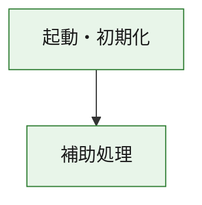
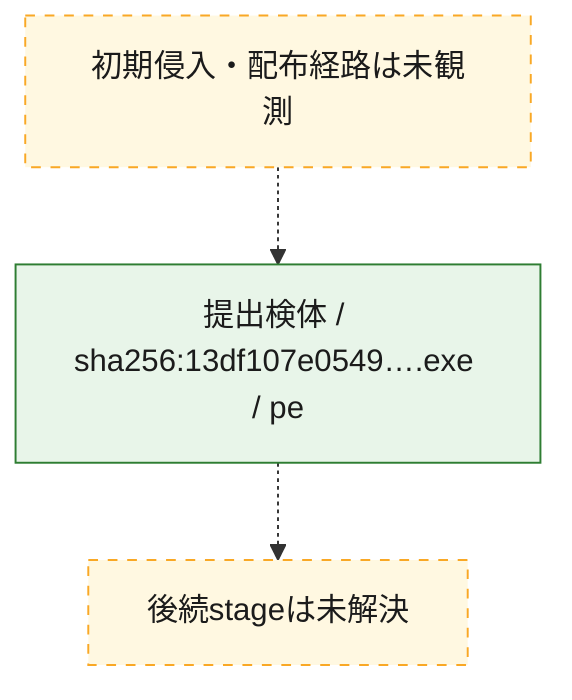
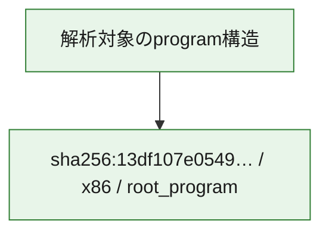

# 全体ロジック：13df107e0549aaa781f0bd23cf64dedeefad302e479ab8b91212e4d84629c5ec

代表関数の静的証跡から、起動・初期化の処理群を確認しました。

## 読み方

- phaseの掲載順は解析上の整理順です。observed_call_edgesがない段階間の実行順を断定しません。
- 図の実線は静的に観測した関係、点線と黄色のノードは未観測・未解決の関係を示します。
- 図は静的な要約であり、動的実行を再現するものではありません。
- 詳細な関数解説とfingerprintは[STATIC-LOGIC.md](STATIC-LOGIC.md)を参照してください。

## 静的可視化

### 実行フロー

### 感染チェーン

### モジュール関係

## 処理段階

### 1. 起動・初期化

entry pointから初期化と後続処理への移行を確認します。
確度: `confirmed_static_function_evidence`

- `13df107e0549aaa781f0bd23cf64dedeefad302e479ab8b91212e4d84629c5ec:ghidra:180001010` — 初期化と主要処理への分岐を行う入口関数です。 状態: `succeeded`、選定理由: `entry_point`, `meaningful_symbol_name`, `reviewed_call_centrality:22`, `role:entrypoint`, `small_program_complete_context`

### 2. 補助処理

主要処理を支える一般内部関数またはlibrary処理を確認します。
確度: `confirmed_static_function_evidence`

- `13df107e0549aaa781f0bd23cf64dedeefad302e479ab8b91212e4d84629c5ec:ghidra:180001240` — 検体内部の一般処理を実装する関数です。 状態: `succeeded`、選定理由: `context_representative`, `reviewed_call_centrality:2`, `small_program_complete_context`
- `13df107e0549aaa781f0bd23cf64dedeefad302e479ab8b91212e4d84629c5ec:ghidra:180001350` — 検体内部の一般処理を実装する関数です。 状態: `succeeded`、選定理由: `context_representative`, `reviewed_call_centrality:25`, `small_program_complete_context`
- `13df107e0549aaa781f0bd23cf64dedeefad302e479ab8b91212e4d84629c5ec:ghidra:180003780` — 検体内部の一般処理を実装する関数です。 状態: `succeeded`、選定理由: `context_representative`, `reviewed_call_centrality:2`, `small_program_complete_context`
- `13df107e0549aaa781f0bd23cf64dedeefad302e479ab8b91212e4d84629c5ec:ghidra:1800038e0` — 検体内部の一般処理を実装する関数です。 状態: `succeeded`、選定理由: `context_representative`, `reviewed_call_centrality:2`, `small_program_complete_context`

## 観測したcall関係

- `13df107e0549aaa781f0bd23cf64dedeefad302e479ab8b91212e4d84629c5ec:ghidra:180001010` → `13df107e0549aaa781f0bd23cf64dedeefad302e479ab8b91212e4d84629c5ec:ghidra:180001240` （`startup` → `support`）
- `13df107e0549aaa781f0bd23cf64dedeefad302e479ab8b91212e4d84629c5ec:ghidra:180001010` → `13df107e0549aaa781f0bd23cf64dedeefad302e479ab8b91212e4d84629c5ec:ghidra:180001350` （`startup` → `support`）
- `13df107e0549aaa781f0bd23cf64dedeefad302e479ab8b91212e4d84629c5ec:ghidra:180001350` → `13df107e0549aaa781f0bd23cf64dedeefad302e479ab8b91212e4d84629c5ec:ghidra:180001240` （`support` → `support`）
- `13df107e0549aaa781f0bd23cf64dedeefad302e479ab8b91212e4d84629c5ec:ghidra:180001350` → `13df107e0549aaa781f0bd23cf64dedeefad302e479ab8b91212e4d84629c5ec:ghidra:180003780` （`support` → `support`）
- `13df107e0549aaa781f0bd23cf64dedeefad302e479ab8b91212e4d84629c5ec:ghidra:180001350` → `13df107e0549aaa781f0bd23cf64dedeefad302e479ab8b91212e4d84629c5ec:ghidra:1800038e0` （`support` → `support`）
- `13df107e0549aaa781f0bd23cf64dedeefad302e479ab8b91212e4d84629c5ec:ghidra:180003780` → `13df107e0549aaa781f0bd23cf64dedeefad302e479ab8b91212e4d84629c5ec:ghidra:1800038e0` （`support` → `support`）
- `ghidra-function:1035bb21074734318a66f6b5` → `ghidra-function:9a9d83ccf7991aa9ca558c8c` （`unclassified` → `unclassified`）
- `ghidra-function:87315ae80e650c9b57735f0b` → `ghidra-external:04ee855bb03d6cc613ea57e7` （`unclassified` → `unclassified`）
- `ghidra-function:87315ae80e650c9b57735f0b` → `ghidra-external:10d8607b32c595ac2d7819dc` （`unclassified` → `unclassified`）
- `ghidra-function:87315ae80e650c9b57735f0b` → `ghidra-external:28baa4fda539bb27d07e2f3a` （`unclassified` → `unclassified`）
- `ghidra-function:87315ae80e650c9b57735f0b` → `ghidra-external:33f30bcc66fa65942278c41f` （`unclassified` → `unclassified`）
- `ghidra-function:87315ae80e650c9b57735f0b` → `ghidra-external:37a4b25e88036bca466e1261` （`unclassified` → `unclassified`）
- `ghidra-function:87315ae80e650c9b57735f0b` → `ghidra-external:44ac0282b788ef31e9efb541` （`unclassified` → `unclassified`）
- `ghidra-function:87315ae80e650c9b57735f0b` → `ghidra-external:4b5959c706432e72cc2d3171` （`unclassified` → `unclassified`）
- `ghidra-function:87315ae80e650c9b57735f0b` → `ghidra-external:4b8fbd997852c8e733259350` （`unclassified` → `unclassified`）
- `ghidra-function:87315ae80e650c9b57735f0b` → `ghidra-external:52cb43a11a315232634649df` （`unclassified` → `unclassified`）
- `ghidra-function:87315ae80e650c9b57735f0b` → `ghidra-external:6b170fea465d69dabf33f0be` （`unclassified` → `unclassified`）
- `ghidra-function:87315ae80e650c9b57735f0b` → `ghidra-external:6d40888b770b6a0034d9a1ef` （`unclassified` → `unclassified`）
- `ghidra-function:87315ae80e650c9b57735f0b` → `ghidra-external:73ecfbff09f25b135c25a612` （`unclassified` → `unclassified`）
- `ghidra-function:87315ae80e650c9b57735f0b` → `ghidra-external:775ef8b7566413f770fd9d20` （`unclassified` → `unclassified`）
- `ghidra-function:87315ae80e650c9b57735f0b` → `ghidra-external:8203faf62379cc21de060ed4` （`unclassified` → `unclassified`）
- `ghidra-function:87315ae80e650c9b57735f0b` → `ghidra-external:870751ff8086377a2d22a3cd` （`unclassified` → `unclassified`）
- `ghidra-function:87315ae80e650c9b57735f0b` → `ghidra-external:a327b228923cc0d998cb7c36` （`unclassified` → `unclassified`）
- `ghidra-function:87315ae80e650c9b57735f0b` → `ghidra-external:a6cd80f29f27bef8f22ec440` （`unclassified` → `unclassified`）
- `ghidra-function:87315ae80e650c9b57735f0b` → `ghidra-external:adab0db9ad1567d16863be0f` （`unclassified` → `unclassified`）
- `ghidra-function:87315ae80e650c9b57735f0b` → `ghidra-external:b09233565a0d255a55d87d31` （`unclassified` → `unclassified`）
- `ghidra-function:87315ae80e650c9b57735f0b` → `ghidra-external:cc4b28268aa3629eb3c64a22` （`unclassified` → `unclassified`）
- `ghidra-function:87315ae80e650c9b57735f0b` → `ghidra-external:cebe706dcf0afc464bcd1205` （`unclassified` → `unclassified`）
- `ghidra-function:87315ae80e650c9b57735f0b` → `ghidra-function:1035bb21074734318a66f6b5` （`unclassified` → `unclassified`）
- `ghidra-function:87315ae80e650c9b57735f0b` → `ghidra-function:5fd124018944a4dcb78168ff` （`unclassified` → `unclassified`）
- `ghidra-function:87315ae80e650c9b57735f0b` → `ghidra-function:9a9d83ccf7991aa9ca558c8c` （`unclassified` → `unclassified`）
- `ghidra-function:a6b68b8e4af44218853ef445` → `ghidra-function:02ecb639ced27a88941ad0f6` （`unclassified` → `unclassified`）
- `ghidra-function:a6b68b8e4af44218853ef445` → `ghidra-function:06f881f87e494a88c0098bae` （`unclassified` → `unclassified`）
- `ghidra-function:a6b68b8e4af44218853ef445` → `ghidra-function:141d3c1e07f9f98b81453ba6` （`unclassified` → `unclassified`）
- `ghidra-function:a6b68b8e4af44218853ef445` → `ghidra-function:3dbc6c0110a25caec9afa6d8` （`unclassified` → `unclassified`）
- `ghidra-function:a6b68b8e4af44218853ef445` → `ghidra-function:5cc9e770447fab91e7c05f05` （`unclassified` → `unclassified`）
- `ghidra-function:a6b68b8e4af44218853ef445` → `ghidra-function:5fd124018944a4dcb78168ff` （`unclassified` → `unclassified`）
- `ghidra-function:a6b68b8e4af44218853ef445` → `ghidra-function:7dc6cecd7e466c535d7d1b51` （`unclassified` → `unclassified`）
- `ghidra-function:a6b68b8e4af44218853ef445` → `ghidra-function:87315ae80e650c9b57735f0b` （`unclassified` → `unclassified`）
- `ghidra-function:a6b68b8e4af44218853ef445` → `ghidra-function:8ad767b1fd5e8c92b9a1bda8` （`unclassified` → `unclassified`）
- `ghidra-function:a6b68b8e4af44218853ef445` → `ghidra-function:99dfb0aebb1d855d39774f3a` （`unclassified` → `unclassified`）
- `ghidra-function:a6b68b8e4af44218853ef445` → `ghidra-function:e438ce09f8c9d8d6242be7d1` （`unclassified` → `unclassified`）
- `ghidra-function:a6b68b8e4af44218853ef445` → `ghidra-function:f8d142786da405bcc27f025f` （`unclassified` → `unclassified`）

## 解析範囲と制約

- 選定外関数は全体inventoryへ残しますが、関数本体の個別解説対象にはしていません。
- indirect call、難読化、packer、VM、壊れたcontrol flowによりcall関係が欠落する場合があります。
- 文書は静的解析に基づき、検体実行や外部通信による動的確認は行っていません。
