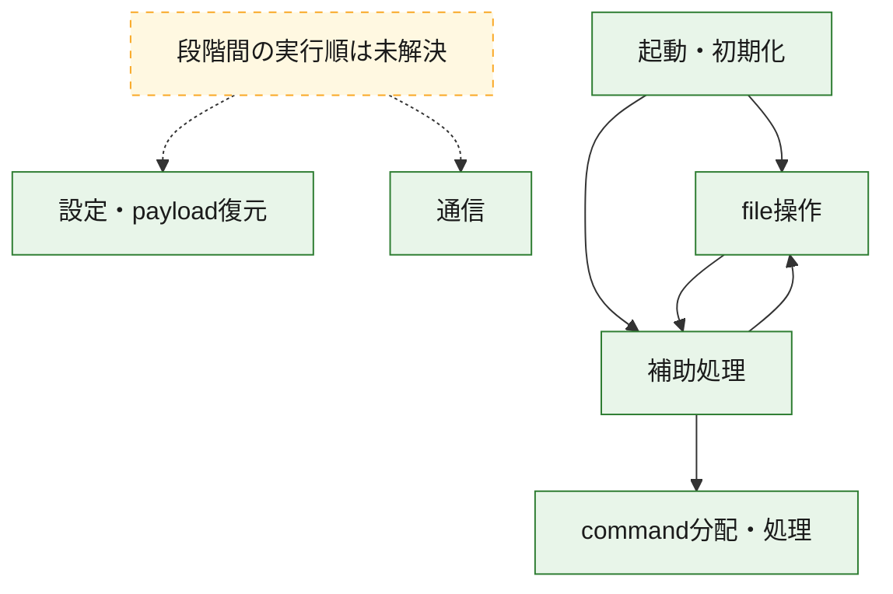

# 全体ロジック：1490b87b9f74a3e71867005ce44bf98244719d51a431e0bc09f3c7f44e41d09a

代表関数の静的証跡から、起動・初期化、設定・payload復元、通信、command分配・処理、file操作の処理群を確認しました。

## 読み方

- phaseの掲載順は解析上の整理順です。observed_call_edgesがない段階間の実行順を断定しません。
- 図の実線は静的に観測した関係、点線と黄色のノードは未観測・未解決の関係を示します。
- 図は静的な要約であり、動的実行を再現するものではありません。
- 詳細な関数解説とfingerprintは[STATIC-LOGIC.md](STATIC-LOGIC.md)を参照してください。

## 静的可視化

### 実行フロー

### 感染チェーン

```mermaid
flowchart TD
  chain_initial["初期侵入・配布経路は未観測"]
  chain_01["提出検体 / sha256:1490b87b9f74….exe / pe"]
  chain_02["静的復元層 1 / sha256:1490b87b9f74….exe::nsis-member-000-pe.dll / pe"]
  chain_03["静的復元層 1 / sha256:1490b87b9f74….exe::nsis-member-001-7z.7z / 7z"]
  chain_04["静的復元層 1 / sha256:1490b87b9f74….exe::nsis-member-002-pe.dll / pe"]
  chain_05["静的復元層 1 / sha256:1490b87b9f74….exe::nsis-member-003-pe.dll / pe"]
  chain_06["静的復元層 2 / sha256:1490b87b9f74….exe::nsis-member-001-7z.7z::7z-asar / asar"]
  chain_07["静的復元層 2 / sha256:1490b87b9f74….exe::nsis-member-001-7z.7z::7z-data / data"]
  chain_08["静的復元層 2 / sha256:1490b87b9f74….exe::nsis-member-001-7z.7z::7z-data / data"]
  chain_09["静的復元層 2 / sha256:1490b87b9f74….exe::nsis-member-001-7z.7z::7z-data / data"]
  chain_10["静的復元層 2 / sha256:1490b87b9f74….exe::nsis-member-001-7z.7z::7z-data / data"]
  chain_11["静的復元層 2 / sha256:1490b87b9f74….exe::nsis-member-001-7z.7z::7z-pe / pe"]
  chain_12["静的復元層 2 / sha256:1490b87b9f74….exe::nsis-member-001-7z.7z::7z-pe / pe"]
  chain_13["静的復元層 2 / sha256:1490b87b9f74….exe::nsis-member-001-7z.7z::7z-pe / pe"]
  chain_14["静的復元層 2 / sha256:1490b87b9f74….exe::nsis-member-001-7z.7z::7z-pe / pe"]
  chain_15["静的復元層 2 / sha256:1490b87b9f74….exe::nsis-member-001-7z.7z::7z-pe / pe"]
  chain_16["静的復元層 2 / sha256:1490b87b9f74….exe::nsis-member-001-7z.7z::7z-pe / pe"]
  chain_01 -->|nsis-member-000-pe.dll| chain_02
  chain_01 -->|nsis-member-001-7z.7z| chain_03
  chain_01 -->|nsis-member-002-pe.dll| chain_04
  chain_01 -->|nsis-member-003-pe.dll| chain_05
  chain_03 -->|7z-asar| chain_06
  chain_03 -->|7z-data| chain_07
  chain_03 -->|7z-data| chain_08
  chain_03 -->|7z-data| chain_09
  chain_03 -->|7z-data| chain_10
  chain_03 -->|7z-pe| chain_11
  chain_03 -->|7z-pe| chain_12
  chain_03 -->|7z-pe| chain_13
  chain_03 -->|7z-pe| chain_14
  chain_03 -->|7z-pe| chain_15
  chain_03 -->|7z-pe| chain_16
  chain_initial -.-> chain_01
  chain_more["その他7層はstatic-layers.jsonを参照"]
  chain_02 -.-> chain_more
  chain_04 -.-> chain_more
  chain_05 -.-> chain_more
  chain_06 -.-> chain_more
  chain_07 -.-> chain_more
  chain_08 -.-> chain_more
  chain_09 -.-> chain_more
  chain_10 -.-> chain_more
  chain_11 -.-> chain_more
  chain_12 -.-> chain_more
  chain_13 -.-> chain_more
  chain_14 -.-> chain_more
  chain_15 -.-> chain_more
  chain_16 -.-> chain_more
  class chain_more unresolved
  class chain_01,chain_02,chain_03,chain_04,chain_05,chain_06,chain_07,chain_08,chain_09,chain_10,chain_11,chain_12,chain_13,chain_14,chain_15,chain_16 confirmed
  class chain_initial unresolved
  classDef confirmed fill:#e8f5e9,stroke:#2e7d32,color:#1b1b1b
  classDef unresolved fill:#fff8e1,stroke:#f9a825,color:#1b1b1b,stroke-dasharray:5 5
```

### モジュール関係

```mermaid
flowchart TD
  module_scope["解析対象のprogram構造"]
  module_01["sha256:3eb38ae99653… / x86 / statically_recovered_program"]
  module_02["sha256:b72e9013a620… / x86 / statically_recovered_program"]
  module_03["sha256:9b1fbf0c11c5… / x86 / statically_recovered_program"]
  module_04["sha256:b393f05e8ff9… / x86 / statically_recovered_program"]
  module_05["sha256:7bee4e33d89e… / x86 / statically_recovered_program"]
  module_06["sha256:d5df2f59cc8b… / x86 / statically_recovered_program"]
  module_07["sha256:c8476ee68088… / x86 / statically_recovered_program"]
  module_08["sha256:699c951ba1ea… / x86 / statically_recovered_program"]
  module_09["sha256:7353f25dc5cf… / x86 / statically_recovered_program"]
  module_10["sha256:680ea3717671… / x86 / statically_recovered_program"]
  module_11["sha256:ee039e42a494… / x86 / statically_recovered_program"]
  module_12["sha256:1490b87b9f74… / x86 / root_program"]
  module_12 -->|静的復元| module_01
  module_12 -->|静的復元| module_02
  module_12 -->|静的復元| module_04
  module_scope --> module_12
  module_parent_unknown["復元元・親moduleは未特定"]
  module_parent_unknown -.-> module_03
  module_parent_unknown -.-> module_05
  module_parent_unknown -.-> module_06
  module_parent_unknown -.-> module_07
  module_parent_unknown -.-> module_08
  module_parent_unknown -.-> module_09
  module_parent_unknown -.-> module_10
  module_parent_unknown -.-> module_11
  class module_parent_unknown unresolved
  class module_scope confirmed
  class module_01,module_02,module_03,module_04,module_05,module_06,module_07,module_08,module_09,module_10,module_11,module_12 confirmed
  classDef confirmed fill:#e8f5e9,stroke:#2e7d32,color:#1b1b1b
  classDef unresolved fill:#fff8e1,stroke:#f9a825,color:#1b1b1b,stroke-dasharray:5 5
```

## 処理段階

### 1. 起動・初期化

entry pointから初期化と後続処理への移行を確認します。
確度: `confirmed_static_function_evidence`

- `3eb38ae99653a7dbc724132ee240f6e5c4af4bfe7c01d31d23faf373f9f2eaca:ghidra:10002993` — 初期化と主要処理への分岐を行う入口関数です。 状態: `succeeded`、選定理由: `entry_point`, `meaningful_symbol_name`, `reviewed_call_centrality:2`, `role:entrypoint`, `small_program_complete_context`
- `b72e9013a6204e9f01076dc38dabbf30870d44dfc66962adbf73619d4331601e:ghidra:1000eab9` — 初期化と主要処理への分岐を行う入口関数です。 状態: `succeeded`、選定理由: `call_graph_centrality:in=0,out=3`, `entry_point`, `meaningful_symbol_name`, `reviewed_call_centrality:3`, `reviewed_call_centrality:5`, `role:entrypoint`, `small_program_complete_context`
- `7bee4e33d89e5a4f2b3bc74d632f7c773ae9a399b6b2ba6d29b1192e25695a8b:ghidra:18001b760` — 初期化と主要処理への分岐を行う入口関数です。 状態: `succeeded`、選定理由: `entry_point`, `meaningful_symbol_name`, `reviewed_call_centrality:5`, `role:entrypoint`
- `d5df2f59cc8b32abd6178250e7d1370a7f37270cc727449e21778080b5e29cd2:ghidra:18005e8a0` — 初期化と主要処理への分岐を行う入口関数です。 状態: `succeeded`、選定理由: `entry_point`, `meaningful_symbol_name`, `reviewed_call_centrality:5`, `role:entrypoint`
- `c8476ee68088d72b9fab25703093df19237d14387016b77f472e10c99c9415ed:ghidra:1800b8f80` — 初期化と主要処理への分岐を行う入口関数です。 状態: `succeeded`、選定理由: `entry_point`, `meaningful_symbol_name`, `reviewed_call_centrality:5`, `role:entrypoint`
- `7353f25dc5cf84d09894e3e0461cef0e56799adbc617fce37620ca67240b547d:ghidra:180293cb0` — 初期化と主要処理への分岐を行う入口関数です。 状態: `succeeded`、選定理由: `entry_point`, `meaningful_symbol_name`, `reviewed_call_centrality:4`, `role:entrypoint`
- `680ea3717671c896d516517ff322976ab708f18862135be4216a27ad57353dcc:ghidra:180380010` — 初期化と主要処理への分岐を行う入口関数です。 状態: `succeeded`、選定理由: `entry_point`, `meaningful_symbol_name`, `reviewed_call_centrality:5`, `role:entrypoint`
- `ee039e42a4948e9f26ece8515f3c699014fa7803ae597cd3427fa1548962f9af:ghidra:1804c64e0` — 初期化と主要処理への分岐を行う入口関数です。 状態: `succeeded`、選定理由: `entry_point`, `meaningful_symbol_name`, `reviewed_call_centrality:5`, `role:entrypoint`
- `1490b87b9f74a3e71867005ce44bf98244719d51a431e0bc09f3c7f44e41d09a:ghidra:0040338f` — 初期化と主要処理への分岐を行う入口関数です。 状態: `succeeded`、選定理由: `call_graph_centrality:in=0,out=18`, `entry_point`, `large_function:instructions=410`, `meaningful_symbol_name`, `reviewed_call_centrality:18`, `reviewed_call_centrality:67`, `role:entrypoint`

### 2. 設定・payload復元

設定、resource、payload、暗号化データの復元・変換を確認します。
確度: `confirmed_static_function_evidence_with_limits`

- `7bee4e33d89e5a4f2b3bc74d632f7c773ae9a399b6b2ba6d29b1192e25695a8b:ghidra:180001610` — 設定、resource、payloadなどの解析・変換を行う関数です。 状態: `failed_empty`、選定理由: `entry_point`, `meaningful_symbol_name`, `role:config_or_data_transform`
- `7bee4e33d89e5a4f2b3bc74d632f7c773ae9a399b6b2ba6d29b1192e25695a8b:ghidra:1800018b0` — 設定、resource、payloadなどの解析・変換を行う関数です。 状態: `failed_empty`、選定理由: `entry_point`, `meaningful_symbol_name`, `role:config_or_data_transform`
- `ee039e42a4948e9f26ece8515f3c699014fa7803ae597cd3427fa1548962f9af:ghidra:18000b6d0` — 設定、resource、payloadなどの解析・変換を行う関数です。 状態: `succeeded`、選定理由: `entry_point`, `meaningful_symbol_name`, `reviewed_call_centrality:9`, `role:config_or_data_transform`
- `ee039e42a4948e9f26ece8515f3c699014fa7803ae597cd3427fa1548962f9af:ghidra:18000bdb0` — 設定、resource、payloadなどの解析・変換を行う関数です。 状態: `succeeded`、選定理由: `entry_point`, `meaningful_symbol_name`, `reviewed_call_centrality:7`, `role:config_or_data_transform`
- `ee039e42a4948e9f26ece8515f3c699014fa7803ae597cd3427fa1548962f9af:ghidra:180024a10` — 設定、resource、payloadなどの解析・変換を行う関数です。 状態: `succeeded`、選定理由: `entry_point`, `meaningful_symbol_name`, `reviewed_call_centrality:28`, `role:config_or_data_transform`
- `ee039e42a4948e9f26ece8515f3c699014fa7803ae597cd3427fa1548962f9af:ghidra:180024ac0` — 設定、resource、payloadなどの解析・変換を行う関数です。 状態: `succeeded`、選定理由: `entry_point`, `meaningful_symbol_name`, `reviewed_call_centrality:24`, `role:config_or_data_transform`
- `ee039e42a4948e9f26ece8515f3c699014fa7803ae597cd3427fa1548962f9af:ghidra:180024b70` — 設定、resource、payloadなどの解析・変換を行う関数です。 状態: `succeeded`、選定理由: `entry_point`, `meaningful_symbol_name`, `reviewed_call_centrality:18`, `role:config_or_data_transform`
- `ee039e42a4948e9f26ece8515f3c699014fa7803ae597cd3427fa1548962f9af:ghidra:1800327f0` — 設定、resource、payloadなどの解析・変換を行う関数です。 状態: `succeeded`、選定理由: `entry_point`, `meaningful_symbol_name`, `reviewed_call_centrality:19`, `role:config_or_data_transform`
- `ee039e42a4948e9f26ece8515f3c699014fa7803ae597cd3427fa1548962f9af:ghidra:180040e40` — 設定、resource、payloadなどの解析・変換を行う関数です。 状態: `succeeded`、選定理由: `entry_point`, `meaningful_symbol_name`, `reviewed_call_centrality:28`, `role:config_or_data_transform`
- `ee039e42a4948e9f26ece8515f3c699014fa7803ae597cd3427fa1548962f9af:ghidra:180040e50` — 設定、resource、payloadなどの解析・変換を行う関数です。 状態: `succeeded`、選定理由: `entry_point`, `meaningful_symbol_name`, `reviewed_call_centrality:24`, `role:config_or_data_transform`
- `ee039e42a4948e9f26ece8515f3c699014fa7803ae597cd3427fa1548962f9af:ghidra:180040e60` — 設定、resource、payloadなどの解析・変換を行う関数です。 状態: `succeeded`、選定理由: `entry_point`, `meaningful_symbol_name`, `reviewed_call_centrality:18`, `role:config_or_data_transform`
- `ee039e42a4948e9f26ece8515f3c699014fa7803ae597cd3427fa1548962f9af:ghidra:180042250` — 設定、resource、payloadなどの解析・変換を行う関数です。 状態: `succeeded`、選定理由: `entry_point`, `meaningful_symbol_name`, `reviewed_call_centrality:19`, `role:config_or_data_transform`

### 3. 通信

通信初期化、endpoint処理、送受信の役割を確認します。
確度: `confirmed_static_function_evidence`

- `c8476ee68088d72b9fab25703093df19237d14387016b77f472e10c99c9415ed:ghidra:18004c0e0` — 通信初期化、送受信、またはendpoint処理に関係する関数です。 状態: `succeeded`、選定理由: `entry_point`, `meaningful_symbol_name`, `reviewed_call_centrality:11`, `role:network_communication`
- `c8476ee68088d72b9fab25703093df19237d14387016b77f472e10c99c9415ed:ghidra:18004de70` — 通信初期化、送受信、またはendpoint処理に関係する関数です。 状態: `succeeded`、選定理由: `entry_point`, `meaningful_symbol_name`, `reviewed_call_centrality:4`, `role:network_communication`

### 4. command分配・処理

受信commandやtaskの解釈、分配、個別handlerへの移行を確認します。
確度: `confirmed_static_function_evidence_with_limits`

- `7bee4e33d89e5a4f2b3bc74d632f7c773ae9a399b6b2ba6d29b1192e25695a8b:ghidra:180045920` — commandの解釈、分配、または個別処理を担当する関数です。 状態: `limited_bad_instruction_or_flow`、選定理由: `meaningful_symbol_name`, `reviewed_call_centrality:28`, `role:command_dispatch_or_handler`
- `d5df2f59cc8b32abd6178250e7d1370a7f37270cc727449e21778080b5e29cd2:ghidra:180031b30` — commandの解釈、分配、または個別処理を担当する関数です。 状態: `succeeded`、選定理由: `entry_point`, `meaningful_symbol_name`, `reviewed_call_centrality:4`, `role:command_dispatch_or_handler`
- `d5df2f59cc8b32abd6178250e7d1370a7f37270cc727449e21778080b5e29cd2:ghidra:180034a30` — commandの解釈、分配、または個別処理を担当する関数です。 状態: `succeeded`、選定理由: `entry_point`, `meaningful_symbol_name`, `reviewed_call_centrality:4`, `role:command_dispatch_or_handler`
- `d5df2f59cc8b32abd6178250e7d1370a7f37270cc727449e21778080b5e29cd2:ghidra:180034a90` — commandの解釈、分配、または個別処理を担当する関数です。 状態: `succeeded`、選定理由: `entry_point`, `meaningful_symbol_name`, `reviewed_call_centrality:4`, `role:command_dispatch_or_handler`
- `d5df2f59cc8b32abd6178250e7d1370a7f37270cc727449e21778080b5e29cd2:ghidra:180034af0` — commandの解釈、分配、または個別処理を担当する関数です。 状態: `succeeded`、選定理由: `entry_point`, `meaningful_symbol_name`, `reviewed_call_centrality:4`, `role:command_dispatch_or_handler`
- `d5df2f59cc8b32abd6178250e7d1370a7f37270cc727449e21778080b5e29cd2:ghidra:180034b50` — commandの解釈、分配、または個別処理を担当する関数です。 状態: `succeeded`、選定理由: `entry_point`, `meaningful_symbol_name`, `reviewed_call_centrality:4`, `role:command_dispatch_or_handler`
- `d5df2f59cc8b32abd6178250e7d1370a7f37270cc727449e21778080b5e29cd2:ghidra:180034bb0` — commandの解釈、分配、または個別処理を担当する関数です。 状態: `succeeded`、選定理由: `entry_point`, `meaningful_symbol_name`, `reviewed_call_centrality:4`, `role:command_dispatch_or_handler`
- `d5df2f59cc8b32abd6178250e7d1370a7f37270cc727449e21778080b5e29cd2:ghidra:180034c10` — commandの解釈、分配、または個別処理を担当する関数です。 状態: `succeeded`、選定理由: `entry_point`, `meaningful_symbol_name`, `reviewed_call_centrality:4`, `role:command_dispatch_or_handler`
- `d5df2f59cc8b32abd6178250e7d1370a7f37270cc727449e21778080b5e29cd2:ghidra:180034c70` — commandの解釈、分配、または個別処理を担当する関数です。 状態: `succeeded`、選定理由: `entry_point`, `meaningful_symbol_name`, `reviewed_call_centrality:4`, `role:command_dispatch_or_handler`
- `d5df2f59cc8b32abd6178250e7d1370a7f37270cc727449e21778080b5e29cd2:ghidra:180035330` — commandの解釈、分配、または個別処理を担当する関数です。 状態: `succeeded`、選定理由: `entry_point`, `meaningful_symbol_name`, `reviewed_call_centrality:4`, `role:command_dispatch_or_handler`
- `d5df2f59cc8b32abd6178250e7d1370a7f37270cc727449e21778080b5e29cd2:ghidra:180035390` — commandの解釈、分配、または個別処理を担当する関数です。 状態: `succeeded`、選定理由: `entry_point`, `meaningful_symbol_name`, `reviewed_call_centrality:4`, `role:command_dispatch_or_handler`
- `d5df2f59cc8b32abd6178250e7d1370a7f37270cc727449e21778080b5e29cd2:ghidra:180035cf0` — commandの解釈、分配、または個別処理を担当する関数です。 状態: `succeeded`、選定理由: `entry_point`, `meaningful_symbol_name`, `reviewed_call_centrality:4`, `role:command_dispatch_or_handler`
- `d5df2f59cc8b32abd6178250e7d1370a7f37270cc727449e21778080b5e29cd2:ghidra:1800364a0` — commandの解釈、分配、または個別処理を担当する関数です。 状態: `succeeded`、選定理由: `entry_point`, `meaningful_symbol_name`, `reviewed_call_centrality:4`, `role:command_dispatch_or_handler`
- `d5df2f59cc8b32abd6178250e7d1370a7f37270cc727449e21778080b5e29cd2:ghidra:180036620` — commandの解釈、分配、または個別処理を担当する関数です。 状態: `succeeded`、選定理由: `entry_point`, `meaningful_symbol_name`, `reviewed_call_centrality:4`, `role:command_dispatch_or_handler`
- `c8476ee68088d72b9fab25703093df19237d14387016b77f472e10c99c9415ed:ghidra:1800ef0f0` — commandの解釈、分配、または個別処理を担当する関数です。 状態: `limited_bad_instruction_or_flow`、選定理由: `meaningful_symbol_name`, `reviewed_call_centrality:6`, `role:command_dispatch_or_handler`
- `7353f25dc5cf84d09894e3e0461cef0e56799adbc617fce37620ca67240b547d:ghidra:180387ce0` — commandの解釈、分配、または個別処理を担当する関数です。 状態: `limited_bad_instruction_or_flow`、選定理由: `meaningful_symbol_name`, `role:command_dispatch_or_handler`
- `680ea3717671c896d516517ff322976ab708f18862135be4216a27ad57353dcc:ghidra:180035460` — commandの解釈、分配、または個別処理を担当する関数です。 状態: `succeeded`、選定理由: `entry_point`, `meaningful_symbol_name`, `reviewed_call_centrality:9`, `role:command_dispatch_or_handler`
- `680ea3717671c896d516517ff322976ab708f18862135be4216a27ad57353dcc:ghidra:1800355d0` — commandの解釈、分配、または個別処理を担当する関数です。 状態: `succeeded`、選定理由: `entry_point`, `meaningful_symbol_name`, `reviewed_call_centrality:10`, `role:command_dispatch_or_handler`
- `680ea3717671c896d516517ff322976ab708f18862135be4216a27ad57353dcc:ghidra:180035640` — commandの解釈、分配、または個別処理を担当する関数です。 状態: `succeeded`、選定理由: `entry_point`, `meaningful_symbol_name`, `reviewed_call_centrality:2`, `role:command_dispatch_or_handler`
- `680ea3717671c896d516517ff322976ab708f18862135be4216a27ad57353dcc:ghidra:180035690` — commandの解釈、分配、または個別処理を担当する関数です。 状態: `succeeded`、選定理由: `entry_point`, `meaningful_symbol_name`, `reviewed_call_centrality:6`, `role:command_dispatch_or_handler`
- `680ea3717671c896d516517ff322976ab708f18862135be4216a27ad57353dcc:ghidra:1800357a0` — commandの解釈、分配、または個別処理を担当する関数です。 状態: `succeeded`、選定理由: `entry_point`, `meaningful_symbol_name`, `reviewed_call_centrality:7`, `role:command_dispatch_or_handler`
- `680ea3717671c896d516517ff322976ab708f18862135be4216a27ad57353dcc:ghidra:1800357f0` — commandの解釈、分配、または個別処理を担当する関数です。 状態: `succeeded`、選定理由: `entry_point`, `meaningful_symbol_name`, `reviewed_call_centrality:6`, `role:command_dispatch_or_handler`
- `680ea3717671c896d516517ff322976ab708f18862135be4216a27ad57353dcc:ghidra:1800358f0` — commandの解釈、分配、または個別処理を担当する関数です。 状態: `succeeded`、選定理由: `entry_point`, `meaningful_symbol_name`, `reviewed_call_centrality:1`, `role:command_dispatch_or_handler`
- `680ea3717671c896d516517ff322976ab708f18862135be4216a27ad57353dcc:ghidra:180035930` — commandの解釈、分配、または個別処理を担当する関数です。 状態: `succeeded`、選定理由: `entry_point`, `meaningful_symbol_name`, `reviewed_call_centrality:4`, `role:command_dispatch_or_handler`
- `680ea3717671c896d516517ff322976ab708f18862135be4216a27ad57353dcc:ghidra:1800366c0` — commandの解釈、分配、または個別処理を担当する関数です。 状態: `succeeded`、選定理由: `entry_point`, `meaningful_symbol_name`, `reviewed_call_centrality:8`, `role:command_dispatch_or_handler`
- `680ea3717671c896d516517ff322976ab708f18862135be4216a27ad57353dcc:ghidra:180036720` — commandの解釈、分配、または個別処理を担当する関数です。 状態: `succeeded`、選定理由: `entry_point`, `meaningful_symbol_name`, `reviewed_call_centrality:8`, `role:command_dispatch_or_handler`
- `680ea3717671c896d516517ff322976ab708f18862135be4216a27ad57353dcc:ghidra:180038f70` — commandの解釈、分配、または個別処理を担当する関数です。 状態: `succeeded`、選定理由: `entry_point`, `meaningful_symbol_name`, `reviewed_call_centrality:7`, `role:command_dispatch_or_handler`
- `680ea3717671c896d516517ff322976ab708f18862135be4216a27ad57353dcc:ghidra:180039440` — commandの解釈、分配、または個別処理を担当する関数です。 状態: `succeeded`、選定理由: `entry_point`, `meaningful_symbol_name`, `reviewed_call_centrality:8`, `role:command_dispatch_or_handler`
- `680ea3717671c896d516517ff322976ab708f18862135be4216a27ad57353dcc:ghidra:18003a1e0` — commandの解釈、分配、または個別処理を担当する関数です。 状態: `succeeded`、選定理由: `entry_point`, `meaningful_symbol_name`, `reviewed_call_centrality:2`, `role:command_dispatch_or_handler`
- `ee039e42a4948e9f26ece8515f3c699014fa7803ae597cd3427fa1548962f9af:ghidra:180024180` — commandの解釈、分配、または個別処理を担当する関数です。 状態: `succeeded`、選定理由: `entry_point`, `meaningful_symbol_name`, `reviewed_call_centrality:25`, `role:command_dispatch_or_handler`
- `ee039e42a4948e9f26ece8515f3c699014fa7803ae597cd3427fa1548962f9af:ghidra:180024250` — commandの解釈、分配、または個別処理を担当する関数です。 状態: `succeeded`、選定理由: `entry_point`, `meaningful_symbol_name`, `reviewed_call_centrality:23`, `role:command_dispatch_or_handler`
- `ee039e42a4948e9f26ece8515f3c699014fa7803ae597cd3427fa1548962f9af:ghidra:180040d80` — commandの解釈、分配、または個別処理を担当する関数です。 状態: `succeeded`、選定理由: `entry_point`, `meaningful_symbol_name`, `reviewed_call_centrality:25`, `role:command_dispatch_or_handler`
- `ee039e42a4948e9f26ece8515f3c699014fa7803ae597cd3427fa1548962f9af:ghidra:180040d90` — commandの解釈、分配、または個別処理を担当する関数です。 状態: `succeeded`、選定理由: `entry_point`, `meaningful_symbol_name`, `reviewed_call_centrality:23`, `role:command_dispatch_or_handler`

### 5. file操作

fileやdirectoryの作成、読書き、削除を確認します。
確度: `confirmed_static_function_evidence`

- `7353f25dc5cf84d09894e3e0461cef0e56799adbc617fce37620ca67240b547d:ghidra:1800e77d0` — fileまたはdirectoryの読書き・管理に関係する関数です。 状態: `succeeded`、選定理由: `entry_point`, `meaningful_symbol_name`, `reviewed_call_centrality:13`, `role:file_operation`
- `7353f25dc5cf84d09894e3e0461cef0e56799adbc617fce37620ca67240b547d:ghidra:1800e7a40` — fileまたはdirectoryの読書き・管理に関係する関数です。 状態: `succeeded`、選定理由: `entry_point`, `meaningful_symbol_name`, `reviewed_call_centrality:9`, `role:file_operation`
- `1490b87b9f74a3e71867005ce44bf98244719d51a431e0bc09f3c7f44e41d09a:ghidra:004059cc` — fileまたはdirectoryの読書き・管理に関係する関数です。 状態: `succeeded`、選定理由: `call_graph_centrality:in=2,out=11`, `large_function:instructions=148`, `reviewed_call_centrality:13`, `reviewed_call_centrality:22`, `role:file_operation`

### 6. 補助処理

主要処理を支える一般内部関数またはlibrary処理を確認します。
確度: `confirmed_static_function_evidence_with_limits`

- `b72e9013a6204e9f01076dc38dabbf30870d44dfc66962adbf73619d4331601e:ghidra:10005968` — 検体内部の一般処理を実装する関数です。 状態: `succeeded`、選定理由: `call_graph_centrality:in=1,out=2`, `reviewed_call_centrality:3`, `reviewed_call_centrality:5`, `small_program_complete_context`
- `9b1fbf0c11c520ae714af8aa9af12cfd48503eedecd7398d8992ee94d1b4dc37:ghidra:00401eda` — 検体内部の一般処理を実装する関数です。 状態: `succeeded`、選定理由: `meaningful_symbol_name`, `small_program_complete_context`
- `b393f05e8ff919ef071181050e1873c9a776e1a0ae8329aefff7007d0cadf592:ghidra:100248ac` — 検体内部の一般処理を実装する関数です。 状態: `failed_empty`、選定理由: `meaningful_symbol_name`, `small_program_complete_context`
- `7bee4e33d89e5a4f2b3bc74d632f7c773ae9a399b6b2ba6d29b1192e25695a8b:ghidra:180001710` — 検体内部の一般処理を実装する関数です。 状態: `succeeded`、選定理由: `entry_point`, `meaningful_symbol_name`, `reviewed_call_centrality:2`
- `7bee4e33d89e5a4f2b3bc74d632f7c773ae9a399b6b2ba6d29b1192e25695a8b:ghidra:180001750` — 検体内部の一般処理を実装する関数です。 状態: `succeeded`、選定理由: `entry_point`, `meaningful_symbol_name`, `reviewed_call_centrality:2`
- `7bee4e33d89e5a4f2b3bc74d632f7c773ae9a399b6b2ba6d29b1192e25695a8b:ghidra:180001790` — 検体内部の一般処理を実装する関数です。 状態: `succeeded`、選定理由: `entry_point`, `meaningful_symbol_name`, `reviewed_call_centrality:2`
- `7bee4e33d89e5a4f2b3bc74d632f7c773ae9a399b6b2ba6d29b1192e25695a8b:ghidra:1800017d0` — 検体内部の一般処理を実装する関数です。 状態: `succeeded`、選定理由: `entry_point`, `meaningful_symbol_name`, `reviewed_call_centrality:2`
- `7bee4e33d89e5a4f2b3bc74d632f7c773ae9a399b6b2ba6d29b1192e25695a8b:ghidra:180001810` — 検体内部の一般処理を実装する関数です。 状態: `succeeded`、選定理由: `entry_point`, `meaningful_symbol_name`, `reviewed_call_centrality:2`
- `7bee4e33d89e5a4f2b3bc74d632f7c773ae9a399b6b2ba6d29b1192e25695a8b:ghidra:180001850` — 検体内部の一般処理を実装する関数です。 状態: `succeeded`、選定理由: `entry_point`, `meaningful_symbol_name`, `reviewed_call_centrality:2`
- `7bee4e33d89e5a4f2b3bc74d632f7c773ae9a399b6b2ba6d29b1192e25695a8b:ghidra:180001880` — 検体内部の一般処理を実装する関数です。 状態: `succeeded`、選定理由: `entry_point`, `meaningful_symbol_name`, `reviewed_call_centrality:2`
- `7bee4e33d89e5a4f2b3bc74d632f7c773ae9a399b6b2ba6d29b1192e25695a8b:ghidra:1800018f0` — 検体内部の一般処理を実装する関数です。 状態: `succeeded`、選定理由: `entry_point`, `meaningful_symbol_name`, `reviewed_call_centrality:2`
- `7bee4e33d89e5a4f2b3bc74d632f7c773ae9a399b6b2ba6d29b1192e25695a8b:ghidra:180001930` — 検体内部の一般処理を実装する関数です。 状態: `succeeded`、選定理由: `entry_point`, `meaningful_symbol_name`, `reviewed_call_centrality:2`
- `7bee4e33d89e5a4f2b3bc74d632f7c773ae9a399b6b2ba6d29b1192e25695a8b:ghidra:180001950` — 検体内部の一般処理を実装する関数です。 状態: `succeeded`、選定理由: `entry_point`, `meaningful_symbol_name`, `reviewed_call_centrality:2`
- `7bee4e33d89e5a4f2b3bc74d632f7c773ae9a399b6b2ba6d29b1192e25695a8b:ghidra:180001980` — 検体内部の一般処理を実装する関数です。 状態: `succeeded`、選定理由: `entry_point`, `meaningful_symbol_name`, `reviewed_call_centrality:2`
- `7bee4e33d89e5a4f2b3bc74d632f7c773ae9a399b6b2ba6d29b1192e25695a8b:ghidra:1800019b0` — 検体内部の一般処理を実装する関数です。 状態: `succeeded`、選定理由: `entry_point`, `meaningful_symbol_name`, `reviewed_call_centrality:2`
- `7bee4e33d89e5a4f2b3bc74d632f7c773ae9a399b6b2ba6d29b1192e25695a8b:ghidra:1800019d0` — 検体内部の一般処理を実装する関数です。 状態: `succeeded`、選定理由: `entry_point`, `meaningful_symbol_name`, `reviewed_call_centrality:2`
- `7bee4e33d89e5a4f2b3bc74d632f7c773ae9a399b6b2ba6d29b1192e25695a8b:ghidra:180001a00` — 検体内部の一般処理を実装する関数です。 状態: `succeeded`、選定理由: `entry_point`, `meaningful_symbol_name`, `reviewed_call_centrality:2`
- `7bee4e33d89e5a4f2b3bc74d632f7c773ae9a399b6b2ba6d29b1192e25695a8b:ghidra:180001a40` — 検体内部の一般処理を実装する関数です。 状態: `succeeded`、選定理由: `entry_point`, `meaningful_symbol_name`, `reviewed_call_centrality:2`
- `7bee4e33d89e5a4f2b3bc74d632f7c773ae9a399b6b2ba6d29b1192e25695a8b:ghidra:180001a80` — 検体内部の一般処理を実装する関数です。 状態: `succeeded`、選定理由: `entry_point`, `meaningful_symbol_name`, `reviewed_call_centrality:2`
- `7bee4e33d89e5a4f2b3bc74d632f7c773ae9a399b6b2ba6d29b1192e25695a8b:ghidra:180001ac0` — 検体内部の一般処理を実装する関数です。 状態: `succeeded`、選定理由: `entry_point`, `meaningful_symbol_name`, `reviewed_call_centrality:2`
- `7bee4e33d89e5a4f2b3bc74d632f7c773ae9a399b6b2ba6d29b1192e25695a8b:ghidra:180001af0` — 検体内部の一般処理を実装する関数です。 状態: `succeeded`、選定理由: `entry_point`, `meaningful_symbol_name`, `reviewed_call_centrality:2`
- `7bee4e33d89e5a4f2b3bc74d632f7c773ae9a399b6b2ba6d29b1192e25695a8b:ghidra:180001b30` — 検体内部の一般処理を実装する関数です。 状態: `succeeded`、選定理由: `entry_point`, `meaningful_symbol_name`, `reviewed_call_centrality:2`
- `7bee4e33d89e5a4f2b3bc74d632f7c773ae9a399b6b2ba6d29b1192e25695a8b:ghidra:180001b60` — 検体内部の一般処理を実装する関数です。 状態: `succeeded`、選定理由: `entry_point`, `meaningful_symbol_name`, `reviewed_call_centrality:2`
- `7bee4e33d89e5a4f2b3bc74d632f7c773ae9a399b6b2ba6d29b1192e25695a8b:ghidra:180001b90` — 検体内部の一般処理を実装する関数です。 状態: `succeeded`、選定理由: `entry_point`, `meaningful_symbol_name`, `reviewed_call_centrality:2`
- `7bee4e33d89e5a4f2b3bc74d632f7c773ae9a399b6b2ba6d29b1192e25695a8b:ghidra:180001bb0` — 検体内部の一般処理を実装する関数です。 状態: `succeeded`、選定理由: `entry_point`, `meaningful_symbol_name`, `reviewed_call_centrality:2`
- `7bee4e33d89e5a4f2b3bc74d632f7c773ae9a399b6b2ba6d29b1192e25695a8b:ghidra:180001be0` — 検体内部の一般処理を実装する関数です。 状態: `succeeded`、選定理由: `entry_point`, `meaningful_symbol_name`, `reviewed_call_centrality:2`
- `7bee4e33d89e5a4f2b3bc74d632f7c773ae9a399b6b2ba6d29b1192e25695a8b:ghidra:180001c20` — 検体内部の一般処理を実装する関数です。 状態: `succeeded`、選定理由: `entry_point`, `meaningful_symbol_name`, `reviewed_call_centrality:2`
- `7bee4e33d89e5a4f2b3bc74d632f7c773ae9a399b6b2ba6d29b1192e25695a8b:ghidra:180001c60` — 検体内部の一般処理を実装する関数です。 状態: `succeeded`、選定理由: `entry_point`, `meaningful_symbol_name`, `reviewed_call_centrality:2`
- `7bee4e33d89e5a4f2b3bc74d632f7c773ae9a399b6b2ba6d29b1192e25695a8b:ghidra:180001ca0` — 検体内部の一般処理を実装する関数です。 状態: `succeeded`、選定理由: `entry_point`, `meaningful_symbol_name`, `reviewed_call_centrality:2`
- `7bee4e33d89e5a4f2b3bc74d632f7c773ae9a399b6b2ba6d29b1192e25695a8b:ghidra:180001cd0` — 検体内部の一般処理を実装する関数です。 状態: `succeeded`、選定理由: `entry_point`, `meaningful_symbol_name`, `reviewed_call_centrality:2`
- `7bee4e33d89e5a4f2b3bc74d632f7c773ae9a399b6b2ba6d29b1192e25695a8b:ghidra:18001a7a0` — compiler生成処理または汎用library処理とみられる関数です。 状態: `succeeded`、選定理由: `entry_point`, `meaningful_symbol_name`, `reviewed_call_centrality:2`
- `d5df2f59cc8b32abd6178250e7d1370a7f37270cc727449e21778080b5e29cd2:ghidra:180031740` — 検体内部の一般処理を実装する関数です。 状態: `succeeded`、選定理由: `entry_point`, `meaningful_symbol_name`, `reviewed_call_centrality:15`
- `d5df2f59cc8b32abd6178250e7d1370a7f37270cc727449e21778080b5e29cd2:ghidra:180031850` — 検体内部の一般処理を実装する関数です。 状態: `succeeded`、選定理由: `entry_point`, `meaningful_symbol_name`, `reviewed_call_centrality:5`
- `d5df2f59cc8b32abd6178250e7d1370a7f37270cc727449e21778080b5e29cd2:ghidra:180031a30` — 検体内部の一般処理を実装する関数です。 状態: `limited_bad_instruction_or_flow`、選定理由: `entry_point`, `meaningful_symbol_name`, `reviewed_call_centrality:8`
- `d5df2f59cc8b32abd6178250e7d1370a7f37270cc727449e21778080b5e29cd2:ghidra:180031ac0` — 検体内部の一般処理を実装する関数です。 状態: `succeeded`、選定理由: `entry_point`, `meaningful_symbol_name`, `reviewed_call_centrality:4`
- `d5df2f59cc8b32abd6178250e7d1370a7f37270cc727449e21778080b5e29cd2:ghidra:180031bc0` — 検体内部の一般処理を実装する関数です。 状態: `succeeded`、選定理由: `entry_point`, `meaningful_symbol_name`, `reviewed_call_centrality:4`
- `d5df2f59cc8b32abd6178250e7d1370a7f37270cc727449e21778080b5e29cd2:ghidra:180031c30` — 検体内部の一般処理を実装する関数です。 状態: `succeeded`、選定理由: `entry_point`, `meaningful_symbol_name`, `reviewed_call_centrality:17`
- `d5df2f59cc8b32abd6178250e7d1370a7f37270cc727449e21778080b5e29cd2:ghidra:180031ef0` — 検体内部の一般処理を実装する関数です。 状態: `succeeded`、選定理由: `entry_point`, `meaningful_symbol_name`, `reviewed_call_centrality:17`
- `d5df2f59cc8b32abd6178250e7d1370a7f37270cc727449e21778080b5e29cd2:ghidra:1800321b0` — 検体内部の一般処理を実装する関数です。 状態: `succeeded`、選定理由: `entry_point`, `meaningful_symbol_name`, `reviewed_call_centrality:17`
- `d5df2f59cc8b32abd6178250e7d1370a7f37270cc727449e21778080b5e29cd2:ghidra:180032480` — 検体内部の一般処理を実装する関数です。 状態: `succeeded`、選定理由: `entry_point`, `meaningful_symbol_name`, `reviewed_call_centrality:39`
- `d5df2f59cc8b32abd6178250e7d1370a7f37270cc727449e21778080b5e29cd2:ghidra:180032af0` — 検体内部の一般処理を実装する関数です。 状態: `limited_bad_instruction_or_flow`、選定理由: `entry_point`, `meaningful_symbol_name`, `reviewed_call_centrality:17`
- `d5df2f59cc8b32abd6178250e7d1370a7f37270cc727449e21778080b5e29cd2:ghidra:180032c90` — 検体内部の一般処理を実装する関数です。 状態: `succeeded`、選定理由: `entry_point`, `meaningful_symbol_name`, `reviewed_call_centrality:10`
- `d5df2f59cc8b32abd6178250e7d1370a7f37270cc727449e21778080b5e29cd2:ghidra:180032d60` — 検体内部の一般処理を実装する関数です。 状態: `succeeded`、選定理由: `entry_point`, `meaningful_symbol_name`, `reviewed_call_centrality:4`
- `d5df2f59cc8b32abd6178250e7d1370a7f37270cc727449e21778080b5e29cd2:ghidra:180032dc0` — 検体内部の一般処理を実装する関数です。 状態: `succeeded`、選定理由: `entry_point`, `meaningful_symbol_name`, `reviewed_call_centrality:4`
- `d5df2f59cc8b32abd6178250e7d1370a7f37270cc727449e21778080b5e29cd2:ghidra:180032e20` — 検体内部の一般処理を実装する関数です。 状態: `succeeded`、選定理由: `entry_point`, `meaningful_symbol_name`, `reviewed_call_centrality:4`
- `d5df2f59cc8b32abd6178250e7d1370a7f37270cc727449e21778080b5e29cd2:ghidra:180032e80` — 検体内部の一般処理を実装する関数です。 状態: `succeeded`、選定理由: `entry_point`, `meaningful_symbol_name`, `reviewed_call_centrality:4`
- `d5df2f59cc8b32abd6178250e7d1370a7f37270cc727449e21778080b5e29cd2:ghidra:180032ee0` — 検体内部の一般処理を実装する関数です。 状態: `succeeded`、選定理由: `entry_point`, `meaningful_symbol_name`, `reviewed_call_centrality:4`
- `d5df2f59cc8b32abd6178250e7d1370a7f37270cc727449e21778080b5e29cd2:ghidra:180032f40` — 検体内部の一般処理を実装する関数です。 状態: `succeeded`、選定理由: `entry_point`, `meaningful_symbol_name`, `reviewed_call_centrality:4`
- `d5df2f59cc8b32abd6178250e7d1370a7f37270cc727449e21778080b5e29cd2:ghidra:180032fa0` — 検体内部の一般処理を実装する関数です。 状態: `succeeded`、選定理由: `entry_point`, `meaningful_symbol_name`, `reviewed_call_centrality:8`
- `c8476ee68088d72b9fab25703093df19237d14387016b77f472e10c99c9415ed:ghidra:18004b770` — 検体内部の一般処理を実装する関数です。 状態: `succeeded`、選定理由: `entry_point`, `meaningful_symbol_name`, `reviewed_call_centrality:8`
- `c8476ee68088d72b9fab25703093df19237d14387016b77f472e10c99c9415ed:ghidra:18004b970` — 検体内部の一般処理を実装する関数です。 状態: `succeeded`、選定理由: `entry_point`, `meaningful_symbol_name`, `reviewed_call_centrality:31`
- `c8476ee68088d72b9fab25703093df19237d14387016b77f472e10c99c9415ed:ghidra:18004c120` — 検体内部の一般処理を実装する関数です。 状態: `succeeded`、選定理由: `entry_point`, `meaningful_symbol_name`, `reviewed_call_centrality:4`
- `c8476ee68088d72b9fab25703093df19237d14387016b77f472e10c99c9415ed:ghidra:18004c1f0` — 検体内部の一般処理を実装する関数です。 状態: `succeeded`、選定理由: `entry_point`, `meaningful_symbol_name`, `reviewed_call_centrality:1`
- `c8476ee68088d72b9fab25703093df19237d14387016b77f472e10c99c9415ed:ghidra:18004c260` — 検体内部の一般処理を実装する関数です。 状態: `succeeded`、選定理由: `entry_point`, `meaningful_symbol_name`
- `c8476ee68088d72b9fab25703093df19237d14387016b77f472e10c99c9415ed:ghidra:18004c2b0` — 検体内部の一般処理を実装する関数です。 状態: `succeeded`、選定理由: `entry_point`, `meaningful_symbol_name`, `reviewed_call_centrality:3`
- `c8476ee68088d72b9fab25703093df19237d14387016b77f472e10c99c9415ed:ghidra:18004c310` — 検体内部の一般処理を実装する関数です。 状態: `succeeded`、選定理由: `entry_point`, `meaningful_symbol_name`, `reviewed_call_centrality:3`
- `c8476ee68088d72b9fab25703093df19237d14387016b77f472e10c99c9415ed:ghidra:18004c3e0` — 検体内部の一般処理を実装する関数です。 状態: `succeeded`、選定理由: `entry_point`, `meaningful_symbol_name`, `reviewed_call_centrality:4`
- `c8476ee68088d72b9fab25703093df19237d14387016b77f472e10c99c9415ed:ghidra:18004c490` — 検体内部の一般処理を実装する関数です。 状態: `succeeded`、選定理由: `entry_point`, `meaningful_symbol_name`, `reviewed_call_centrality:2`
- `c8476ee68088d72b9fab25703093df19237d14387016b77f472e10c99c9415ed:ghidra:18004c850` — 検体内部の一般処理を実装する関数です。 状態: `succeeded`、選定理由: `entry_point`, `meaningful_symbol_name`, `reviewed_call_centrality:5`
- `c8476ee68088d72b9fab25703093df19237d14387016b77f472e10c99c9415ed:ghidra:18004d3c0` — 検体内部の一般処理を実装する関数です。 状態: `succeeded`、選定理由: `entry_point`, `meaningful_symbol_name`, `reviewed_call_centrality:4`
- `c8476ee68088d72b9fab25703093df19237d14387016b77f472e10c99c9415ed:ghidra:18004d950` — 検体内部の一般処理を実装する関数です。 状態: `succeeded`、選定理由: `entry_point`, `meaningful_symbol_name`, `reviewed_call_centrality:7`
- `c8476ee68088d72b9fab25703093df19237d14387016b77f472e10c99c9415ed:ghidra:180050770` — 検体内部の一般処理を実装する関数です。 状態: `succeeded`、選定理由: `entry_point`, `meaningful_symbol_name`, `reviewed_call_centrality:9`
- `c8476ee68088d72b9fab25703093df19237d14387016b77f472e10c99c9415ed:ghidra:180050950` — 検体内部の一般処理を実装する関数です。 状態: `succeeded`、選定理由: `entry_point`, `meaningful_symbol_name`, `reviewed_call_centrality:3`
- `c8476ee68088d72b9fab25703093df19237d14387016b77f472e10c99c9415ed:ghidra:1800522c0` — 検体内部の一般処理を実装する関数です。 状態: `succeeded`、選定理由: `entry_point`, `meaningful_symbol_name`, `reviewed_call_centrality:5`
- `c8476ee68088d72b9fab25703093df19237d14387016b77f472e10c99c9415ed:ghidra:1800525f0` — 検体内部の一般処理を実装する関数です。 状態: `succeeded`、選定理由: `entry_point`, `meaningful_symbol_name`
- `c8476ee68088d72b9fab25703093df19237d14387016b77f472e10c99c9415ed:ghidra:180052920` — 検体内部の一般処理を実装する関数です。 状態: `succeeded`、選定理由: `entry_point`, `meaningful_symbol_name`, `reviewed_call_centrality:11`
- `c8476ee68088d72b9fab25703093df19237d14387016b77f472e10c99c9415ed:ghidra:180052b40` — 検体内部の一般処理を実装する関数です。 状態: `succeeded`、選定理由: `entry_point`, `meaningful_symbol_name`
- `c8476ee68088d72b9fab25703093df19237d14387016b77f472e10c99c9415ed:ghidra:180052f50` — 検体内部の一般処理を実装する関数です。 状態: `succeeded`、選定理由: `entry_point`, `meaningful_symbol_name`, `reviewed_call_centrality:2`
- `c8476ee68088d72b9fab25703093df19237d14387016b77f472e10c99c9415ed:ghidra:180053d20` — 検体内部の一般処理を実装する関数です。 状態: `succeeded`、選定理由: `entry_point`, `meaningful_symbol_name`, `reviewed_call_centrality:5`
- `c8476ee68088d72b9fab25703093df19237d14387016b77f472e10c99c9415ed:ghidra:180053da0` — 検体内部の一般処理を実装する関数です。 状態: `succeeded`、選定理由: `entry_point`, `meaningful_symbol_name`, `reviewed_call_centrality:27`
- `c8476ee68088d72b9fab25703093df19237d14387016b77f472e10c99c9415ed:ghidra:1800543c0` — 検体内部の一般処理を実装する関数です。 状態: `succeeded`、選定理由: `entry_point`, `meaningful_symbol_name`, `reviewed_call_centrality:8`
- `c8476ee68088d72b9fab25703093df19237d14387016b77f472e10c99c9415ed:ghidra:180054ad0` — 検体内部の一般処理を実装する関数です。 状態: `succeeded`、選定理由: `entry_point`, `meaningful_symbol_name`, `reviewed_call_centrality:7`
- `c8476ee68088d72b9fab25703093df19237d14387016b77f472e10c99c9415ed:ghidra:180055b20` — 検体内部の一般処理を実装する関数です。 状態: `succeeded`、選定理由: `entry_point`, `meaningful_symbol_name`, `reviewed_call_centrality:68`
- `c8476ee68088d72b9fab25703093df19237d14387016b77f472e10c99c9415ed:ghidra:1800644f0` — 検体内部の一般処理を実装する関数です。 状態: `succeeded`、選定理由: `entry_point`, `meaningful_symbol_name`, `reviewed_call_centrality:1`
- `c8476ee68088d72b9fab25703093df19237d14387016b77f472e10c99c9415ed:ghidra:1800649d0` — 検体内部の一般処理を実装する関数です。 状態: `succeeded`、選定理由: `entry_point`, `meaningful_symbol_name`, `reviewed_call_centrality:1`
- `c8476ee68088d72b9fab25703093df19237d14387016b77f472e10c99c9415ed:ghidra:1800653a0` — 検体内部の一般処理を実装する関数です。 状態: `succeeded`、選定理由: `entry_point`, `meaningful_symbol_name`, `reviewed_call_centrality:2`
- `c8476ee68088d72b9fab25703093df19237d14387016b77f472e10c99c9415ed:ghidra:180065570` — 検体内部の一般処理を実装する関数です。 状態: `succeeded`、選定理由: `entry_point`, `meaningful_symbol_name`
- `699c951ba1ea9547bdc20882ed07768530fd448ac4ecaa34dadffed6696d5f65:ghidra:140003f10` — 検体内部の一般処理を実装する関数です。 状態: `limited_bad_instruction_or_flow`、選定理由: `context_representative`, `reviewed_call_centrality:1`
- `699c951ba1ea9547bdc20882ed07768530fd448ac4ecaa34dadffed6696d5f65:ghidra:140004110` — 検体内部の一般処理を実装する関数です。 状態: `limited_bad_instruction_or_flow`、選定理由: `context_representative`, `reviewed_call_centrality:1`
- `699c951ba1ea9547bdc20882ed07768530fd448ac4ecaa34dadffed6696d5f65:ghidra:140004138` — 検体内部の一般処理を実装する関数です。 状態: `limited_bad_instruction_or_flow`、選定理由: `context_representative`, `reviewed_call_centrality:1`
- `699c951ba1ea9547bdc20882ed07768530fd448ac4ecaa34dadffed6696d5f65:ghidra:14000418c` — 検体内部の一般処理を実装する関数です。 状態: `limited_bad_instruction_or_flow`、選定理由: `context_representative`, `reviewed_call_centrality:1`
- `699c951ba1ea9547bdc20882ed07768530fd448ac4ecaa34dadffed6696d5f65:ghidra:1400041b4` — 検体内部の一般処理を実装する関数です。 状態: `limited_bad_instruction_or_flow`、選定理由: `context_representative`, `reviewed_call_centrality:1`
- `699c951ba1ea9547bdc20882ed07768530fd448ac4ecaa34dadffed6696d5f65:ghidra:1400041d8` — 検体内部の一般処理を実装する関数です。 状態: `limited_bad_instruction_or_flow`、選定理由: `context_representative`, `reviewed_call_centrality:1`
- `699c951ba1ea9547bdc20882ed07768530fd448ac4ecaa34dadffed6696d5f65:ghidra:140004248` — 検体内部の一般処理を実装する関数です。 状態: `limited_bad_instruction_or_flow`、選定理由: `context_representative`, `reviewed_call_centrality:1`
- `699c951ba1ea9547bdc20882ed07768530fd448ac4ecaa34dadffed6696d5f65:ghidra:1400042cc` — 検体内部の一般処理を実装する関数です。 状態: `limited_bad_instruction_or_flow`、選定理由: `context_representative`, `reviewed_call_centrality:1`
- `699c951ba1ea9547bdc20882ed07768530fd448ac4ecaa34dadffed6696d5f65:ghidra:140004344` — 検体内部の一般処理を実装する関数です。 状態: `limited_bad_instruction_or_flow`、選定理由: `context_representative`, `reviewed_call_centrality:1`
- `699c951ba1ea9547bdc20882ed07768530fd448ac4ecaa34dadffed6696d5f65:ghidra:140004470` — 検体内部の一般処理を実装する関数です。 状態: `limited_bad_instruction_or_flow`、選定理由: `context_representative`, `reviewed_call_centrality:1`
- `699c951ba1ea9547bdc20882ed07768530fd448ac4ecaa34dadffed6696d5f65:ghidra:14000459c` — 検体内部の一般処理を実装する関数です。 状態: `limited_bad_instruction_or_flow`、選定理由: `context_representative`, `reviewed_call_centrality:1`
- `699c951ba1ea9547bdc20882ed07768530fd448ac4ecaa34dadffed6696d5f65:ghidra:14000463c` — 検体内部の一般処理を実装する関数です。 状態: `limited_bad_instruction_or_flow`、選定理由: `context_representative`, `reviewed_call_centrality:1`
- `699c951ba1ea9547bdc20882ed07768530fd448ac4ecaa34dadffed6696d5f65:ghidra:1400046c4` — 検体内部の一般処理を実装する関数です。 状態: `limited_bad_instruction_or_flow`、選定理由: `context_representative`, `reviewed_call_centrality:1`
- `699c951ba1ea9547bdc20882ed07768530fd448ac4ecaa34dadffed6696d5f65:ghidra:14000474c` — 検体内部の一般処理を実装する関数です。 状態: `limited_bad_instruction_or_flow`、選定理由: `context_representative`, `reviewed_call_centrality:1`
- `699c951ba1ea9547bdc20882ed07768530fd448ac4ecaa34dadffed6696d5f65:ghidra:140004764` — 検体内部の一般処理を実装する関数です。 状態: `limited_bad_instruction_or_flow`、選定理由: `context_representative`, `reviewed_call_centrality:1`
- `699c951ba1ea9547bdc20882ed07768530fd448ac4ecaa34dadffed6696d5f65:ghidra:140004804` — 検体内部の一般処理を実装する関数です。 状態: `limited_bad_instruction_or_flow`、選定理由: `context_representative`, `reviewed_call_centrality:1`
- `699c951ba1ea9547bdc20882ed07768530fd448ac4ecaa34dadffed6696d5f65:ghidra:140004874` — 検体内部の一般処理を実装する関数です。 状態: `limited_bad_instruction_or_flow`、選定理由: `context_representative`, `reviewed_call_centrality:1`
- `699c951ba1ea9547bdc20882ed07768530fd448ac4ecaa34dadffed6696d5f65:ghidra:1400048d4` — 検体内部の一般処理を実装する関数です。 状態: `limited_bad_instruction_or_flow`、選定理由: `context_representative`, `reviewed_call_centrality:1`
- `699c951ba1ea9547bdc20882ed07768530fd448ac4ecaa34dadffed6696d5f65:ghidra:140004928` — 検体内部の一般処理を実装する関数です。 状態: `limited_bad_instruction_or_flow`、選定理由: `context_representative`, `reviewed_call_centrality:1`
- `699c951ba1ea9547bdc20882ed07768530fd448ac4ecaa34dadffed6696d5f65:ghidra:1400049a0` — 検体内部の一般処理を実装する関数です。 状態: `limited_bad_instruction_or_flow`、選定理由: `context_representative`, `reviewed_call_centrality:1`
- `699c951ba1ea9547bdc20882ed07768530fd448ac4ecaa34dadffed6696d5f65:ghidra:1400049fc` — 検体内部の一般処理を実装する関数です。 状態: `limited_bad_instruction_or_flow`、選定理由: `context_representative`, `reviewed_call_centrality:1`
- `699c951ba1ea9547bdc20882ed07768530fd448ac4ecaa34dadffed6696d5f65:ghidra:140004a54` — 検体内部の一般処理を実装する関数です。 状態: `limited_bad_instruction_or_flow`、選定理由: `context_representative`, `reviewed_call_centrality:1`
- `699c951ba1ea9547bdc20882ed07768530fd448ac4ecaa34dadffed6696d5f65:ghidra:140004adc` — 検体内部の一般処理を実装する関数です。 状態: `limited_bad_instruction_or_flow`、選定理由: `context_representative`, `reviewed_call_centrality:1`
- `699c951ba1ea9547bdc20882ed07768530fd448ac4ecaa34dadffed6696d5f65:ghidra:140004b30` — 検体内部の一般処理を実装する関数です。 状態: `limited_bad_instruction_or_flow`、選定理由: `context_representative`, `reviewed_call_centrality:1`
- `699c951ba1ea9547bdc20882ed07768530fd448ac4ecaa34dadffed6696d5f65:ghidra:140004bc4` — 検体内部の一般処理を実装する関数です。 状態: `limited_bad_instruction_or_flow`、選定理由: `context_representative`, `reviewed_call_centrality:1`
- `699c951ba1ea9547bdc20882ed07768530fd448ac4ecaa34dadffed6696d5f65:ghidra:140004c18` — 検体内部の一般処理を実装する関数です。 状態: `limited_bad_instruction_or_flow`、選定理由: `context_representative`, `reviewed_call_centrality:1`
- `699c951ba1ea9547bdc20882ed07768530fd448ac4ecaa34dadffed6696d5f65:ghidra:140004cb0` — 検体内部の一般処理を実装する関数です。 状態: `limited_bad_instruction_or_flow`、選定理由: `context_representative`, `reviewed_call_centrality:1`
- `699c951ba1ea9547bdc20882ed07768530fd448ac4ecaa34dadffed6696d5f65:ghidra:140004d8c` — 検体内部の一般処理を実装する関数です。 状態: `limited_bad_instruction_or_flow`、選定理由: `context_representative`, `reviewed_call_centrality:1`
- `699c951ba1ea9547bdc20882ed07768530fd448ac4ecaa34dadffed6696d5f65:ghidra:140004e7c` — 検体内部の一般処理を実装する関数です。 状態: `limited_bad_instruction_or_flow`、選定理由: `context_representative`, `reviewed_call_centrality:1`
- `699c951ba1ea9547bdc20882ed07768530fd448ac4ecaa34dadffed6696d5f65:ghidra:140004f80` — 検体内部の一般処理を実装する関数です。 状態: `limited_bad_instruction_or_flow`、選定理由: `context_representative`, `reviewed_call_centrality:1`
- `699c951ba1ea9547bdc20882ed07768530fd448ac4ecaa34dadffed6696d5f65:ghidra:140004fd0` — 検体内部の一般処理を実装する関数です。 状態: `limited_bad_instruction_or_flow`、選定理由: `context_representative`, `reviewed_call_centrality:1`
- `699c951ba1ea9547bdc20882ed07768530fd448ac4ecaa34dadffed6696d5f65:ghidra:140005068` — 検体内部の一般処理を実装する関数です。 状態: `limited_bad_instruction_or_flow`、選定理由: `context_representative`, `reviewed_call_centrality:1`
- `7353f25dc5cf84d09894e3e0461cef0e56799adbc617fce37620ca67240b547d:ghidra:180007c20` — 検体内部の一般処理を実装する関数です。 状態: `succeeded`、選定理由: `entry_point`, `meaningful_symbol_name`, `reviewed_call_centrality:1`
- `7353f25dc5cf84d09894e3e0461cef0e56799adbc617fce37620ca67240b547d:ghidra:180007c60` — 検体内部の一般処理を実装する関数です。 状態: `succeeded`、選定理由: `entry_point`, `meaningful_symbol_name`, `reviewed_call_centrality:1`
- `7353f25dc5cf84d09894e3e0461cef0e56799adbc617fce37620ca67240b547d:ghidra:180007cb0` — 検体内部の一般処理を実装する関数です。 状態: `succeeded`、選定理由: `entry_point`, `meaningful_symbol_name`, `reviewed_call_centrality:1`
- `7353f25dc5cf84d09894e3e0461cef0e56799adbc617fce37620ca67240b547d:ghidra:180007cf0` — 検体内部の一般処理を実装する関数です。 状態: `succeeded`、選定理由: `entry_point`, `meaningful_symbol_name`, `reviewed_call_centrality:1`
- `7353f25dc5cf84d09894e3e0461cef0e56799adbc617fce37620ca67240b547d:ghidra:180007d30` — 検体内部の一般処理を実装する関数です。 状態: `succeeded`、選定理由: `entry_point`, `meaningful_symbol_name`, `reviewed_call_centrality:5`
- `7353f25dc5cf84d09894e3e0461cef0e56799adbc617fce37620ca67240b547d:ghidra:180007ed0` — 検体内部の一般処理を実装する関数です。 状態: `succeeded`、選定理由: `entry_point`, `meaningful_symbol_name`, `reviewed_call_centrality:4`
- `7353f25dc5cf84d09894e3e0461cef0e56799adbc617fce37620ca67240b547d:ghidra:180008070` — 検体内部の一般処理を実装する関数です。 状態: `succeeded`、選定理由: `entry_point`, `meaningful_symbol_name`, `reviewed_call_centrality:2`
- `7353f25dc5cf84d09894e3e0461cef0e56799adbc617fce37620ca67240b547d:ghidra:180008080` — 検体内部の一般処理を実装する関数です。 状態: `succeeded`、選定理由: `entry_point`, `meaningful_symbol_name`, `reviewed_call_centrality:3`
- `7353f25dc5cf84d09894e3e0461cef0e56799adbc617fce37620ca67240b547d:ghidra:180008130` — 検体内部の一般処理を実装する関数です。 状態: `succeeded`、選定理由: `entry_point`, `meaningful_symbol_name`, `reviewed_call_centrality:5`
- `7353f25dc5cf84d09894e3e0461cef0e56799adbc617fce37620ca67240b547d:ghidra:180008250` — 検体内部の一般処理を実装する関数です。 状態: `succeeded`、選定理由: `entry_point`, `meaningful_symbol_name`, `reviewed_call_centrality:4`
- `7353f25dc5cf84d09894e3e0461cef0e56799adbc617fce37620ca67240b547d:ghidra:180018190` — 検体内部の一般処理を実装する関数です。 状態: `succeeded`、選定理由: `entry_point`, `meaningful_symbol_name`, `reviewed_call_centrality:13`
- `7353f25dc5cf84d09894e3e0461cef0e56799adbc617fce37620ca67240b547d:ghidra:1800e98b0` — 検体内部の一般処理を実装する関数です。 状態: `succeeded`、選定理由: `entry_point`, `meaningful_symbol_name`, `reviewed_call_centrality:1`
- `7353f25dc5cf84d09894e3e0461cef0e56799adbc617fce37620ca67240b547d:ghidra:1800e9930` — 検体内部の一般処理を実装する関数です。 状態: `succeeded`、選定理由: `entry_point`, `meaningful_symbol_name`, `reviewed_call_centrality:5`
- `7353f25dc5cf84d09894e3e0461cef0e56799adbc617fce37620ca67240b547d:ghidra:1800e9a40` — 検体内部の一般処理を実装する関数です。 状態: `succeeded`、選定理由: `entry_point`, `meaningful_symbol_name`, `reviewed_call_centrality:7`
- `7353f25dc5cf84d09894e3e0461cef0e56799adbc617fce37620ca67240b547d:ghidra:1800e9bf0` — 検体内部の一般処理を実装する関数です。 状態: `succeeded`、選定理由: `entry_point`, `meaningful_symbol_name`, `reviewed_call_centrality:10`
- `7353f25dc5cf84d09894e3e0461cef0e56799adbc617fce37620ca67240b547d:ghidra:1800eabb0` — 検体内部の一般処理を実装する関数です。 状態: `succeeded`、選定理由: `entry_point`, `meaningful_symbol_name`, `reviewed_call_centrality:5`
- `7353f25dc5cf84d09894e3e0461cef0e56799adbc617fce37620ca67240b547d:ghidra:1800eb4c0` — 検体内部の一般処理を実装する関数です。 状態: `succeeded`、選定理由: `entry_point`, `meaningful_symbol_name`, `reviewed_call_centrality:1`
- `7353f25dc5cf84d09894e3e0461cef0e56799adbc617fce37620ca67240b547d:ghidra:1800eb500` — 検体内部の一般処理を実装する関数です。 状態: `succeeded`、選定理由: `entry_point`, `meaningful_symbol_name`, `reviewed_call_centrality:6`
- `7353f25dc5cf84d09894e3e0461cef0e56799adbc617fce37620ca67240b547d:ghidra:1800ebac0` — 検体内部の一般処理を実装する関数です。 状態: `succeeded`、選定理由: `entry_point`, `meaningful_symbol_name`, `reviewed_call_centrality:1`
- `7353f25dc5cf84d09894e3e0461cef0e56799adbc617fce37620ca67240b547d:ghidra:1800ebaf0` — 検体内部の一般処理を実装する関数です。 状態: `succeeded`、選定理由: `entry_point`, `meaningful_symbol_name`, `reviewed_call_centrality:1`
- `7353f25dc5cf84d09894e3e0461cef0e56799adbc617fce37620ca67240b547d:ghidra:1800ebb20` — 検体内部の一般処理を実装する関数です。 状態: `succeeded`、選定理由: `entry_point`, `meaningful_symbol_name`, `reviewed_call_centrality:1`
- `7353f25dc5cf84d09894e3e0461cef0e56799adbc617fce37620ca67240b547d:ghidra:1800ebb50` — 検体内部の一般処理を実装する関数です。 状態: `succeeded`、選定理由: `entry_point`, `meaningful_symbol_name`, `reviewed_call_centrality:1`
- `7353f25dc5cf84d09894e3e0461cef0e56799adbc617fce37620ca67240b547d:ghidra:1800ebb80` — 検体内部の一般処理を実装する関数です。 状態: `succeeded`、選定理由: `entry_point`, `meaningful_symbol_name`, `reviewed_call_centrality:6`
- `7353f25dc5cf84d09894e3e0461cef0e56799adbc617fce37620ca67240b547d:ghidra:1800ec840` — 検体内部の一般処理を実装する関数です。 状態: `succeeded`、選定理由: `entry_point`, `meaningful_symbol_name`, `reviewed_call_centrality:9`
- `7353f25dc5cf84d09894e3e0461cef0e56799adbc617fce37620ca67240b547d:ghidra:1800ecbb0` — 検体内部の一般処理を実装する関数です。 状態: `succeeded`、選定理由: `entry_point`, `meaningful_symbol_name`, `reviewed_call_centrality:6`
- `7353f25dc5cf84d09894e3e0461cef0e56799adbc617fce37620ca67240b547d:ghidra:1800ecda0` — 検体内部の一般処理を実装する関数です。 状態: `succeeded`、選定理由: `entry_point`, `meaningful_symbol_name`
- `7353f25dc5cf84d09894e3e0461cef0e56799adbc617fce37620ca67240b547d:ghidra:180123010` — 検体内部の一般処理を実装する関数です。 状態: `succeeded`、選定理由: `entry_point`, `meaningful_symbol_name`
- `7353f25dc5cf84d09894e3e0461cef0e56799adbc617fce37620ca67240b547d:ghidra:180294220` — 検体内部の一般処理を実装する関数です。 状態: `succeeded`、選定理由: `meaningful_symbol_name`
- `680ea3717671c896d516517ff322976ab708f18862135be4216a27ad57353dcc:ghidra:18002f760` — 検体内部の一般処理を実装する関数です。 状態: `succeeded`、選定理由: `entry_point`, `meaningful_symbol_name`, `reviewed_call_centrality:5`
- `680ea3717671c896d516517ff322976ab708f18862135be4216a27ad57353dcc:ghidra:18002f7b0` — 検体内部の一般処理を実装する関数です。 状態: `succeeded`、選定理由: `entry_point`, `meaningful_symbol_name`
- `680ea3717671c896d516517ff322976ab708f18862135be4216a27ad57353dcc:ghidra:18002f7d0` — 検体内部の一般処理を実装する関数です。 状態: `succeeded`、選定理由: `entry_point`, `meaningful_symbol_name`, `reviewed_call_centrality:8`
- `680ea3717671c896d516517ff322976ab708f18862135be4216a27ad57353dcc:ghidra:18002f7f0` — 検体内部の一般処理を実装する関数です。 状態: `succeeded`、選定理由: `entry_point`, `meaningful_symbol_name`
- `680ea3717671c896d516517ff322976ab708f18862135be4216a27ad57353dcc:ghidra:18002f8d0` — 検体内部の一般処理を実装する関数です。 状態: `succeeded`、選定理由: `entry_point`, `meaningful_symbol_name`, `reviewed_call_centrality:15`
- `680ea3717671c896d516517ff322976ab708f18862135be4216a27ad57353dcc:ghidra:18002fd60` — 検体内部の一般処理を実装する関数です。 状態: `succeeded`、選定理由: `entry_point`, `meaningful_symbol_name`, `reviewed_call_centrality:9`
- `680ea3717671c896d516517ff322976ab708f18862135be4216a27ad57353dcc:ghidra:18002fdc0` — 検体内部の一般処理を実装する関数です。 状態: `succeeded`、選定理由: `entry_point`, `meaningful_symbol_name`, `reviewed_call_centrality:1`
- `680ea3717671c896d516517ff322976ab708f18862135be4216a27ad57353dcc:ghidra:18002fe20` — 検体内部の一般処理を実装する関数です。 状態: `limited_bad_instruction_or_flow`、選定理由: `entry_point`, `meaningful_symbol_name`, `reviewed_call_centrality:3`
- `680ea3717671c896d516517ff322976ab708f18862135be4216a27ad57353dcc:ghidra:18002fe80` — 検体内部の一般処理を実装する関数です。 状態: `succeeded`、選定理由: `entry_point`, `meaningful_symbol_name`, `reviewed_call_centrality:4`
- `680ea3717671c896d516517ff322976ab708f18862135be4216a27ad57353dcc:ghidra:18002fec0` — 検体内部の一般処理を実装する関数です。 状態: `succeeded`、選定理由: `entry_point`, `meaningful_symbol_name`, `reviewed_call_centrality:4`
- `680ea3717671c896d516517ff322976ab708f18862135be4216a27ad57353dcc:ghidra:18002ffd0` — 検体内部の一般処理を実装する関数です。 状態: `succeeded`、選定理由: `entry_point`, `meaningful_symbol_name`, `reviewed_call_centrality:10`
- `680ea3717671c896d516517ff322976ab708f18862135be4216a27ad57353dcc:ghidra:180030230` — 検体内部の一般処理を実装する関数です。 状態: `limited_bad_instruction_or_flow`、選定理由: `entry_point`, `meaningful_symbol_name`, `reviewed_call_centrality:5`
- `680ea3717671c896d516517ff322976ab708f18862135be4216a27ad57353dcc:ghidra:180030290` — 検体内部の一般処理を実装する関数です。 状態: `succeeded`、選定理由: `entry_point`, `meaningful_symbol_name`, `reviewed_call_centrality:2`
- `680ea3717671c896d516517ff322976ab708f18862135be4216a27ad57353dcc:ghidra:180030300` — 検体内部の一般処理を実装する関数です。 状態: `limited_bad_instruction_or_flow`、選定理由: `entry_point`, `meaningful_symbol_name`, `reviewed_call_centrality:5`
- `680ea3717671c896d516517ff322976ab708f18862135be4216a27ad57353dcc:ghidra:180030350` — 検体内部の一般処理を実装する関数です。 状態: `succeeded`、選定理由: `entry_point`, `meaningful_symbol_name`, `reviewed_call_centrality:5`
- `680ea3717671c896d516517ff322976ab708f18862135be4216a27ad57353dcc:ghidra:1800303a0` — 検体内部の一般処理を実装する関数です。 状態: `succeeded`、選定理由: `entry_point`, `meaningful_symbol_name`, `reviewed_call_centrality:6`
- `680ea3717671c896d516517ff322976ab708f18862135be4216a27ad57353dcc:ghidra:1800303f0` — 検体内部の一般処理を実装する関数です。 状態: `succeeded`、選定理由: `entry_point`, `meaningful_symbol_name`, `reviewed_call_centrality:36`
- `680ea3717671c896d516517ff322976ab708f18862135be4216a27ad57353dcc:ghidra:18037f0e0` — compiler生成処理または汎用library処理とみられる関数です。 状態: `succeeded`、選定理由: `entry_point`, `meaningful_symbol_name`, `reviewed_call_centrality:1`
- `ee039e42a4948e9f26ece8515f3c699014fa7803ae597cd3427fa1548962f9af:ghidra:18000b7d0` — 検体内部の一般処理を実装する関数です。 状態: `succeeded`、選定理由: `entry_point`, `meaningful_symbol_name`, `reviewed_call_centrality:7`
- `ee039e42a4948e9f26ece8515f3c699014fa7803ae597cd3427fa1548962f9af:ghidra:18000b880` — 検体内部の一般処理を実装する関数です。 状態: `succeeded`、選定理由: `entry_point`, `meaningful_symbol_name`, `reviewed_call_centrality:9`
- `ee039e42a4948e9f26ece8515f3c699014fa7803ae597cd3427fa1548962f9af:ghidra:18000b970` — 検体内部の一般処理を実装する関数です。 状態: `succeeded`、選定理由: `entry_point`, `meaningful_symbol_name`, `reviewed_call_centrality:9`
- `ee039e42a4948e9f26ece8515f3c699014fa7803ae597cd3427fa1548962f9af:ghidra:18000ba50` — 検体内部の一般処理を実装する関数です。 状態: `succeeded`、選定理由: `entry_point`, `meaningful_symbol_name`, `reviewed_call_centrality:9`
- `ee039e42a4948e9f26ece8515f3c699014fa7803ae597cd3427fa1548962f9af:ghidra:18000bb40` — 検体内部の一般処理を実装する関数です。 状態: `succeeded`、選定理由: `entry_point`, `meaningful_symbol_name`, `reviewed_call_centrality:11`
- `ee039e42a4948e9f26ece8515f3c699014fa7803ae597cd3427fa1548962f9af:ghidra:18000bc50` — 検体内部の一般処理を実装する関数です。 状態: `succeeded`、選定理由: `entry_point`, `meaningful_symbol_name`, `reviewed_call_centrality:7`
- `ee039e42a4948e9f26ece8515f3c699014fa7803ae597cd3427fa1548962f9af:ghidra:18000bcf0` — 検体内部の一般処理を実装する関数です。 状態: `succeeded`、選定理由: `entry_point`, `meaningful_symbol_name`, `reviewed_call_centrality:9`
- `ee039e42a4948e9f26ece8515f3c699014fa7803ae597cd3427fa1548962f9af:ghidra:18000be70` — 検体内部の一般処理を実装する関数です。 状態: `succeeded`、選定理由: `entry_point`, `meaningful_symbol_name`, `reviewed_call_centrality:7`
- `ee039e42a4948e9f26ece8515f3c699014fa7803ae597cd3427fa1548962f9af:ghidra:18000bf30` — 検体内部の一般処理を実装する関数です。 状態: `succeeded`、選定理由: `entry_point`, `meaningful_symbol_name`, `reviewed_call_centrality:6`
- `ee039e42a4948e9f26ece8515f3c699014fa7803ae597cd3427fa1548962f9af:ghidra:18000bfc0` — 検体内部の一般処理を実装する関数です。 状態: `succeeded`、選定理由: `entry_point`, `meaningful_symbol_name`, `reviewed_call_centrality:6`
- `ee039e42a4948e9f26ece8515f3c699014fa7803ae597cd3427fa1548962f9af:ghidra:18000c050` — 検体内部の一般処理を実装する関数です。 状態: `succeeded`、選定理由: `entry_point`, `meaningful_symbol_name`, `reviewed_call_centrality:6`
- `ee039e42a4948e9f26ece8515f3c699014fa7803ae597cd3427fa1548962f9af:ghidra:18000c0f0` — 検体内部の一般処理を実装する関数です。 状態: `succeeded`、選定理由: `entry_point`, `meaningful_symbol_name`, `reviewed_call_centrality:6`
- `ee039e42a4948e9f26ece8515f3c699014fa7803ae597cd3427fa1548962f9af:ghidra:18000c180` — 検体内部の一般処理を実装する関数です。 状態: `succeeded`、選定理由: `entry_point`, `meaningful_symbol_name`, `reviewed_call_centrality:6`
- `ee039e42a4948e9f26ece8515f3c699014fa7803ae597cd3427fa1548962f9af:ghidra:18000c220` — 検体内部の一般処理を実装する関数です。 状態: `succeeded`、選定理由: `entry_point`, `meaningful_symbol_name`, `reviewed_call_centrality:7`
- `ee039e42a4948e9f26ece8515f3c699014fa7803ae597cd3427fa1548962f9af:ghidra:18000c2d0` — 検体内部の一般処理を実装する関数です。 状態: `succeeded`、選定理由: `entry_point`, `meaningful_symbol_name`, `reviewed_call_centrality:9`
- `ee039e42a4948e9f26ece8515f3c699014fa7803ae597cd3427fa1548962f9af:ghidra:18000c3b0` — 検体内部の一般処理を実装する関数です。 状態: `succeeded`、選定理由: `entry_point`, `meaningful_symbol_name`, `reviewed_call_centrality:7`
- `ee039e42a4948e9f26ece8515f3c699014fa7803ae597cd3427fa1548962f9af:ghidra:1804c5490` — compiler生成処理または汎用library処理とみられる関数です。 状態: `succeeded`、選定理由: `entry_point`, `meaningful_symbol_name`, `reviewed_call_centrality:1`
- `1490b87b9f74a3e71867005ce44bf98244719d51a431e0bc09f3c7f44e41d09a:ghidra:00401389` — 検体内部の一般処理を実装する関数です。 状態: `succeeded`、選定理由: `call_graph_centrality:in=2,out=2`, `reviewed_call_centrality:4`, `reviewed_call_centrality:8`
- `1490b87b9f74a3e71867005ce44bf98244719d51a431e0bc09f3c7f44e41d09a:ghidra:0040140b` — 検体内部の一般処理を実装する関数です。 状態: `succeeded`、選定理由: `call_graph_centrality:in=2,out=1`, `reviewed_call_centrality:3`
- `1490b87b9f74a3e71867005ce44bf98244719d51a431e0bc09f3c7f44e41d09a:ghidra:00402e79` — 検体内部の一般処理を実装する関数です。 状態: `succeeded`、選定理由: `call_graph_centrality:in=1,out=1`, `reviewed_call_centrality:10`, `reviewed_call_centrality:2`
- `1490b87b9f74a3e71867005ce44bf98244719d51a431e0bc09f3c7f44e41d09a:ghidra:00402edd` — 検体内部の一般処理を実装する関数です。 状態: `succeeded`、選定理由: `call_graph_centrality:in=1,out=9`, `large_function:instructions=182`, `reviewed_call_centrality:10`, `reviewed_call_centrality:20`
- `1490b87b9f74a3e71867005ce44bf98244719d51a431e0bc09f3c7f44e41d09a:ghidra:00403116` — 検体内部の一般処理を実装する関数です。 状態: `succeeded`、選定理由: `call_graph_centrality:in=1,out=5`, `large_function:instructions=166`, `reviewed_call_centrality:12`, `reviewed_call_centrality:6`
- `1490b87b9f74a3e71867005ce44bf98244719d51a431e0bc09f3c7f44e41d09a:ghidra:00403331` — 検体内部の一般処理を実装する関数です。 状態: `succeeded`、選定理由: `call_graph_centrality:in=2,out=1`, `reviewed_call_centrality:3`
- `1490b87b9f74a3e71867005ce44bf98244719d51a431e0bc09f3c7f44e41d09a:ghidra:0040335e` — 検体内部の一般処理を実装する関数です。 状態: `succeeded`、選定理由: `call_graph_centrality:in=1,out=5`, `reviewed_call_centrality:6`
- `1490b87b9f74a3e71867005ce44bf98244719d51a431e0bc09f3c7f44e41d09a:ghidra:004038d0` — 検体内部の一般処理を実装する関数です。 状態: `succeeded`、選定理由: `call_graph_centrality:in=1,out=2`, `reviewed_call_centrality:3`, `reviewed_call_centrality:5`
- `1490b87b9f74a3e71867005ce44bf98244719d51a431e0bc09f3c7f44e41d09a:ghidra:004039aa` — 検体内部の一般処理を実装する関数です。 状態: `succeeded`、選定理由: `call_graph_centrality:in=1,out=16`, `large_function:instructions=215`, `reviewed_call_centrality:17`, `reviewed_call_centrality:35`
- `1490b87b9f74a3e71867005ce44bf98244719d51a431e0bc09f3c7f44e41d09a:ghidra:00403c80` — 検体内部の一般処理を実装する関数です。 状態: `succeeded`、選定理由: `call_graph_centrality:in=1,out=4`, `large_function:instructions=66`, `reviewed_call_centrality:5`
- `1490b87b9f74a3e71867005ce44bf98244719d51a431e0bc09f3c7f44e41d09a:ghidra:00405322` — 検体内部の一般処理を実装する関数です。 状態: `succeeded`、選定理由: `call_graph_centrality:in=2,out=3`, `large_function:instructions=72`, `reviewed_call_centrality:5`, `reviewed_call_centrality:9`
- `1490b87b9f74a3e71867005ce44bf98244719d51a431e0bc09f3c7f44e41d09a:ghidra:004053f5` — 検体内部の一般処理を実装する関数です。 状態: `succeeded`、選定理由: `call_graph_centrality:in=1,out=2`, `reviewed_call_centrality:3`, `reviewed_call_centrality:7`
- `1490b87b9f74a3e71867005ce44bf98244719d51a431e0bc09f3c7f44e41d09a:ghidra:00405b8f` — 検体内部の一般処理を実装する関数です。 状態: `succeeded`、選定理由: `call_graph_centrality:in=4,out=2`, `reviewed_call_centrality:6`, `reviewed_call_centrality:8`
- `1490b87b9f74a3e71867005ce44bf98244719d51a431e0bc09f3c7f44e41d09a:ghidra:00405bbc` — 検体内部の一般処理を実装する関数です。 状態: `succeeded`、選定理由: `call_graph_centrality:in=4,out=0`, `reviewed_call_centrality:4`, `reviewed_call_centrality:6`
- `1490b87b9f74a3e71867005ce44bf98244719d51a431e0bc09f3c7f44e41d09a:ghidra:00405bdb` — 検体内部の一般処理を実装する関数です。 状態: `succeeded`、選定理由: `call_graph_centrality:in=4,out=1`, `reviewed_call_centrality:5`, `reviewed_call_centrality:7`
- `1490b87b9f74a3e71867005ce44bf98244719d51a431e0bc09f3c7f44e41d09a:ghidra:00405c3a` — 検体内部の一般処理を実装する関数です。 状態: `succeeded`、選定理由: `call_graph_centrality:in=1,out=1`, `reviewed_call_centrality:2`, `reviewed_call_centrality:4`
- `1490b87b9f74a3e71867005ce44bf98244719d51a431e0bc09f3c7f44e41d09a:ghidra:00405c97` — 検体内部の一般処理を実装する関数です。 状態: `succeeded`、選定理由: `call_graph_centrality:in=3,out=7`, `reviewed_call_centrality:10`, `reviewed_call_centrality:12`
- `1490b87b9f74a3e71867005ce44bf98244719d51a431e0bc09f3c7f44e41d09a:ghidra:00405d6b` — 検体内部の一般処理を実装する関数です。 状態: `succeeded`、選定理由: `call_graph_centrality:in=4,out=0`, `reviewed_call_centrality:4`, `reviewed_call_centrality:5`
- `1490b87b9f74a3e71867005ce44bf98244719d51a431e0bc09f3c7f44e41d09a:ghidra:00405f06` — 検体内部の一般処理を実装する関数です。 状態: `succeeded`、選定理由: `call_graph_centrality:in=1,out=6`, `large_function:instructions=130`, `reviewed_call_centrality:23`, `reviewed_call_centrality:7`
- `1490b87b9f74a3e71867005ce44bf98244719d51a431e0bc09f3c7f44e41d09a:ghidra:00406080` — 検体内部の一般処理を実装する関数です。 状態: `succeeded`、選定理由: `call_graph_centrality:in=2,out=1`, `reviewed_call_centrality:3`, `reviewed_call_centrality:5`
- `1490b87b9f74a3e71867005ce44bf98244719d51a431e0bc09f3c7f44e41d09a:ghidra:00406188` — 検体内部の一般処理を実装する関数です。 状態: `succeeded`、選定理由: `call_graph_centrality:in=2,out=1`, `reviewed_call_centrality:3`, `reviewed_call_centrality:7`
- `1490b87b9f74a3e71867005ce44bf98244719d51a431e0bc09f3c7f44e41d09a:ghidra:00406201` — 検体内部の一般処理を実装する関数です。 状態: `succeeded`、選定理由: `call_graph_centrality:in=3,out=0`, `reviewed_call_centrality:3`, `reviewed_call_centrality:5`
- `1490b87b9f74a3e71867005ce44bf98244719d51a431e0bc09f3c7f44e41d09a:ghidra:0040621a` — 検体内部の一般処理を実装する関数です。 状態: `succeeded`、選定理由: `call_graph_centrality:in=2,out=0`, `large_function:instructions=70`, `reviewed_call_centrality:2`
- `1490b87b9f74a3e71867005ce44bf98244719d51a431e0bc09f3c7f44e41d09a:ghidra:004062ba` — 検体内部の一般処理を実装する関数です。 状態: `succeeded`、選定理由: `call_graph_centrality:in=6,out=0`, `reviewed_call_centrality:6`, `reviewed_call_centrality:8`
- `1490b87b9f74a3e71867005ce44bf98244719d51a431e0bc09f3c7f44e41d09a:ghidra:004062dc` — 検体内部の一般処理を実装する関数です。 状態: `succeeded`、選定理由: `call_graph_centrality:in=7,out=7`, `large_function:instructions=209`, `reviewed_call_centrality:14`, `reviewed_call_centrality:24`
- `1490b87b9f74a3e71867005ce44bf98244719d51a431e0bc09f3c7f44e41d09a:ghidra:0040654e` — 検体内部の一般処理を実装する関数です。 状態: `succeeded`、選定理由: `call_graph_centrality:in=3,out=3`, `large_function:instructions=69`, `reviewed_call_centrality:10`, `reviewed_call_centrality:6`
- `1490b87b9f74a3e71867005ce44bf98244719d51a431e0bc09f3c7f44e41d09a:ghidra:00406624` — 検体内部の一般処理を実装する関数です。 状態: `succeeded`、選定理由: `call_graph_centrality:in=3,out=0`, `reviewed_call_centrality:3`, `reviewed_call_centrality:9`
- `1490b87b9f74a3e71867005ce44bf98244719d51a431e0bc09f3c7f44e41d09a:ghidra:00406694` — 検体内部の一般処理を実装する関数です。 状態: `succeeded`、選定理由: `call_graph_centrality:in=3,out=1`, `reviewed_call_centrality:4`, `reviewed_call_centrality:8`
- `1490b87b9f74a3e71867005ce44bf98244719d51a431e0bc09f3c7f44e41d09a:ghidra:004067f5` — 検体内部の一般処理を実装する関数です。 状態: `succeeded`、選定理由: `call_graph_centrality:in=1,out=1`, `reviewed_call_centrality:2`, `reviewed_call_centrality:4`
- `1490b87b9f74a3e71867005ce44bf98244719d51a431e0bc09f3c7f44e41d09a:ghidra:00407284` — 検体内部の一般処理を実装する関数です。 状態: `succeeded`、選定理由: `call_graph_centrality:in=1,out=1`, `reviewed_call_centrality:2`

## 観測したcall関係

- `1490b87b9f74a3e71867005ce44bf98244719d51a431e0bc09f3c7f44e41d09a:ghidra:0040140b` → `1490b87b9f74a3e71867005ce44bf98244719d51a431e0bc09f3c7f44e41d09a:ghidra:00401389` （`support` → `support`）
- `1490b87b9f74a3e71867005ce44bf98244719d51a431e0bc09f3c7f44e41d09a:ghidra:00402edd` → `1490b87b9f74a3e71867005ce44bf98244719d51a431e0bc09f3c7f44e41d09a:ghidra:00402e79` （`support` → `support`）
- `1490b87b9f74a3e71867005ce44bf98244719d51a431e0bc09f3c7f44e41d09a:ghidra:00402edd` → `1490b87b9f74a3e71867005ce44bf98244719d51a431e0bc09f3c7f44e41d09a:ghidra:00403116` （`support` → `support`）
- `1490b87b9f74a3e71867005ce44bf98244719d51a431e0bc09f3c7f44e41d09a:ghidra:00402edd` → `1490b87b9f74a3e71867005ce44bf98244719d51a431e0bc09f3c7f44e41d09a:ghidra:00403331` （`support` → `support`）
- `1490b87b9f74a3e71867005ce44bf98244719d51a431e0bc09f3c7f44e41d09a:ghidra:00402edd` → `1490b87b9f74a3e71867005ce44bf98244719d51a431e0bc09f3c7f44e41d09a:ghidra:00405bdb` （`support` → `support`）
- `1490b87b9f74a3e71867005ce44bf98244719d51a431e0bc09f3c7f44e41d09a:ghidra:00402edd` → `1490b87b9f74a3e71867005ce44bf98244719d51a431e0bc09f3c7f44e41d09a:ghidra:00405d6b` （`support` → `support`）
- `1490b87b9f74a3e71867005ce44bf98244719d51a431e0bc09f3c7f44e41d09a:ghidra:00402edd` → `1490b87b9f74a3e71867005ce44bf98244719d51a431e0bc09f3c7f44e41d09a:ghidra:004062ba` （`support` → `support`）
- `1490b87b9f74a3e71867005ce44bf98244719d51a431e0bc09f3c7f44e41d09a:ghidra:00403116` → `1490b87b9f74a3e71867005ce44bf98244719d51a431e0bc09f3c7f44e41d09a:ghidra:00403331` （`support` → `support`）
- `1490b87b9f74a3e71867005ce44bf98244719d51a431e0bc09f3c7f44e41d09a:ghidra:00403116` → `1490b87b9f74a3e71867005ce44bf98244719d51a431e0bc09f3c7f44e41d09a:ghidra:00405322` （`support` → `support`）
- `1490b87b9f74a3e71867005ce44bf98244719d51a431e0bc09f3c7f44e41d09a:ghidra:00403116` → `1490b87b9f74a3e71867005ce44bf98244719d51a431e0bc09f3c7f44e41d09a:ghidra:004067f5` （`support` → `support`）
- `1490b87b9f74a3e71867005ce44bf98244719d51a431e0bc09f3c7f44e41d09a:ghidra:0040335e` → `1490b87b9f74a3e71867005ce44bf98244719d51a431e0bc09f3c7f44e41d09a:ghidra:00405b8f` （`support` → `support`）
- `1490b87b9f74a3e71867005ce44bf98244719d51a431e0bc09f3c7f44e41d09a:ghidra:0040335e` → `1490b87b9f74a3e71867005ce44bf98244719d51a431e0bc09f3c7f44e41d09a:ghidra:0040654e` （`support` → `support`）
- `1490b87b9f74a3e71867005ce44bf98244719d51a431e0bc09f3c7f44e41d09a:ghidra:0040338f` → `1490b87b9f74a3e71867005ce44bf98244719d51a431e0bc09f3c7f44e41d09a:ghidra:0040140b` （`startup` → `support`）
- `1490b87b9f74a3e71867005ce44bf98244719d51a431e0bc09f3c7f44e41d09a:ghidra:0040338f` → `1490b87b9f74a3e71867005ce44bf98244719d51a431e0bc09f3c7f44e41d09a:ghidra:00402edd` （`startup` → `support`）
- `1490b87b9f74a3e71867005ce44bf98244719d51a431e0bc09f3c7f44e41d09a:ghidra:0040338f` → `1490b87b9f74a3e71867005ce44bf98244719d51a431e0bc09f3c7f44e41d09a:ghidra:0040335e` （`startup` → `support`）
- `1490b87b9f74a3e71867005ce44bf98244719d51a431e0bc09f3c7f44e41d09a:ghidra:0040338f` → `1490b87b9f74a3e71867005ce44bf98244719d51a431e0bc09f3c7f44e41d09a:ghidra:004038d0` （`startup` → `support`）
- `1490b87b9f74a3e71867005ce44bf98244719d51a431e0bc09f3c7f44e41d09a:ghidra:0040338f` → `1490b87b9f74a3e71867005ce44bf98244719d51a431e0bc09f3c7f44e41d09a:ghidra:004039aa` （`startup` → `support`）
- `1490b87b9f74a3e71867005ce44bf98244719d51a431e0bc09f3c7f44e41d09a:ghidra:0040338f` → `1490b87b9f74a3e71867005ce44bf98244719d51a431e0bc09f3c7f44e41d09a:ghidra:004059cc` （`startup` → `file_activity`）
- `1490b87b9f74a3e71867005ce44bf98244719d51a431e0bc09f3c7f44e41d09a:ghidra:0040338f` → `1490b87b9f74a3e71867005ce44bf98244719d51a431e0bc09f3c7f44e41d09a:ghidra:00405bbc` （`startup` → `support`）
- `1490b87b9f74a3e71867005ce44bf98244719d51a431e0bc09f3c7f44e41d09a:ghidra:0040338f` → `1490b87b9f74a3e71867005ce44bf98244719d51a431e0bc09f3c7f44e41d09a:ghidra:00405c97` （`startup` → `support`）
- `1490b87b9f74a3e71867005ce44bf98244719d51a431e0bc09f3c7f44e41d09a:ghidra:0040338f` → `1490b87b9f74a3e71867005ce44bf98244719d51a431e0bc09f3c7f44e41d09a:ghidra:00406080` （`startup` → `support`）
- `1490b87b9f74a3e71867005ce44bf98244719d51a431e0bc09f3c7f44e41d09a:ghidra:0040338f` → `1490b87b9f74a3e71867005ce44bf98244719d51a431e0bc09f3c7f44e41d09a:ghidra:004062ba` （`startup` → `support`）
- `1490b87b9f74a3e71867005ce44bf98244719d51a431e0bc09f3c7f44e41d09a:ghidra:0040338f` → `1490b87b9f74a3e71867005ce44bf98244719d51a431e0bc09f3c7f44e41d09a:ghidra:004062dc` （`startup` → `support`）
- `1490b87b9f74a3e71867005ce44bf98244719d51a431e0bc09f3c7f44e41d09a:ghidra:0040338f` → `1490b87b9f74a3e71867005ce44bf98244719d51a431e0bc09f3c7f44e41d09a:ghidra:00406624` （`startup` → `support`）
- `1490b87b9f74a3e71867005ce44bf98244719d51a431e0bc09f3c7f44e41d09a:ghidra:0040338f` → `1490b87b9f74a3e71867005ce44bf98244719d51a431e0bc09f3c7f44e41d09a:ghidra:00406694` （`startup` → `support`）
- `1490b87b9f74a3e71867005ce44bf98244719d51a431e0bc09f3c7f44e41d09a:ghidra:004038d0` → `1490b87b9f74a3e71867005ce44bf98244719d51a431e0bc09f3c7f44e41d09a:ghidra:004059cc` （`support` → `file_activity`）
- `1490b87b9f74a3e71867005ce44bf98244719d51a431e0bc09f3c7f44e41d09a:ghidra:004039aa` → `1490b87b9f74a3e71867005ce44bf98244719d51a431e0bc09f3c7f44e41d09a:ghidra:0040140b` （`support` → `support`）
- `1490b87b9f74a3e71867005ce44bf98244719d51a431e0bc09f3c7f44e41d09a:ghidra:004039aa` → `1490b87b9f74a3e71867005ce44bf98244719d51a431e0bc09f3c7f44e41d09a:ghidra:00403c80` （`support` → `support`）
- `1490b87b9f74a3e71867005ce44bf98244719d51a431e0bc09f3c7f44e41d09a:ghidra:004039aa` → `1490b87b9f74a3e71867005ce44bf98244719d51a431e0bc09f3c7f44e41d09a:ghidra:004053f5` （`support` → `support`）
- `1490b87b9f74a3e71867005ce44bf98244719d51a431e0bc09f3c7f44e41d09a:ghidra:004039aa` → `1490b87b9f74a3e71867005ce44bf98244719d51a431e0bc09f3c7f44e41d09a:ghidra:00405b8f` （`support` → `support`）
- `1490b87b9f74a3e71867005ce44bf98244719d51a431e0bc09f3c7f44e41d09a:ghidra:004039aa` → `1490b87b9f74a3e71867005ce44bf98244719d51a431e0bc09f3c7f44e41d09a:ghidra:00405bbc` （`support` → `support`）
- `1490b87b9f74a3e71867005ce44bf98244719d51a431e0bc09f3c7f44e41d09a:ghidra:004039aa` → `1490b87b9f74a3e71867005ce44bf98244719d51a431e0bc09f3c7f44e41d09a:ghidra:00405bdb` （`support` → `support`）
- `1490b87b9f74a3e71867005ce44bf98244719d51a431e0bc09f3c7f44e41d09a:ghidra:004039aa` → `1490b87b9f74a3e71867005ce44bf98244719d51a431e0bc09f3c7f44e41d09a:ghidra:00405c97` （`support` → `support`）
- `1490b87b9f74a3e71867005ce44bf98244719d51a431e0bc09f3c7f44e41d09a:ghidra:004039aa` → `1490b87b9f74a3e71867005ce44bf98244719d51a431e0bc09f3c7f44e41d09a:ghidra:00406188` （`support` → `support`）
- `1490b87b9f74a3e71867005ce44bf98244719d51a431e0bc09f3c7f44e41d09a:ghidra:004039aa` → `1490b87b9f74a3e71867005ce44bf98244719d51a431e0bc09f3c7f44e41d09a:ghidra:00406201` （`support` → `support`）
- `1490b87b9f74a3e71867005ce44bf98244719d51a431e0bc09f3c7f44e41d09a:ghidra:004039aa` → `1490b87b9f74a3e71867005ce44bf98244719d51a431e0bc09f3c7f44e41d09a:ghidra:004062ba` （`support` → `support`）
- `1490b87b9f74a3e71867005ce44bf98244719d51a431e0bc09f3c7f44e41d09a:ghidra:004039aa` → `1490b87b9f74a3e71867005ce44bf98244719d51a431e0bc09f3c7f44e41d09a:ghidra:004062dc` （`support` → `support`）
- `1490b87b9f74a3e71867005ce44bf98244719d51a431e0bc09f3c7f44e41d09a:ghidra:004039aa` → `1490b87b9f74a3e71867005ce44bf98244719d51a431e0bc09f3c7f44e41d09a:ghidra:00406624` （`support` → `support`）
- `1490b87b9f74a3e71867005ce44bf98244719d51a431e0bc09f3c7f44e41d09a:ghidra:004039aa` → `1490b87b9f74a3e71867005ce44bf98244719d51a431e0bc09f3c7f44e41d09a:ghidra:00406694` （`support` → `support`）
- `1490b87b9f74a3e71867005ce44bf98244719d51a431e0bc09f3c7f44e41d09a:ghidra:00403c80` → `1490b87b9f74a3e71867005ce44bf98244719d51a431e0bc09f3c7f44e41d09a:ghidra:00406201` （`support` → `support`）
- `1490b87b9f74a3e71867005ce44bf98244719d51a431e0bc09f3c7f44e41d09a:ghidra:00403c80` → `1490b87b9f74a3e71867005ce44bf98244719d51a431e0bc09f3c7f44e41d09a:ghidra:0040621a` （`support` → `support`）
- `1490b87b9f74a3e71867005ce44bf98244719d51a431e0bc09f3c7f44e41d09a:ghidra:00403c80` → `1490b87b9f74a3e71867005ce44bf98244719d51a431e0bc09f3c7f44e41d09a:ghidra:004062dc` （`support` → `support`）
- `1490b87b9f74a3e71867005ce44bf98244719d51a431e0bc09f3c7f44e41d09a:ghidra:00405322` → `1490b87b9f74a3e71867005ce44bf98244719d51a431e0bc09f3c7f44e41d09a:ghidra:004062dc` （`support` → `support`）
- `1490b87b9f74a3e71867005ce44bf98244719d51a431e0bc09f3c7f44e41d09a:ghidra:004053f5` → `1490b87b9f74a3e71867005ce44bf98244719d51a431e0bc09f3c7f44e41d09a:ghidra:00401389` （`support` → `support`）
- `1490b87b9f74a3e71867005ce44bf98244719d51a431e0bc09f3c7f44e41d09a:ghidra:004059cc` → `1490b87b9f74a3e71867005ce44bf98244719d51a431e0bc09f3c7f44e41d09a:ghidra:00405322` （`file_activity` → `support`）
- `1490b87b9f74a3e71867005ce44bf98244719d51a431e0bc09f3c7f44e41d09a:ghidra:004059cc` → `1490b87b9f74a3e71867005ce44bf98244719d51a431e0bc09f3c7f44e41d09a:ghidra:00405b8f` （`file_activity` → `support`）
- `1490b87b9f74a3e71867005ce44bf98244719d51a431e0bc09f3c7f44e41d09a:ghidra:004059cc` → `1490b87b9f74a3e71867005ce44bf98244719d51a431e0bc09f3c7f44e41d09a:ghidra:00405bdb` （`file_activity` → `support`）
- `1490b87b9f74a3e71867005ce44bf98244719d51a431e0bc09f3c7f44e41d09a:ghidra:004059cc` → `1490b87b9f74a3e71867005ce44bf98244719d51a431e0bc09f3c7f44e41d09a:ghidra:00405c97` （`file_activity` → `support`）
- `1490b87b9f74a3e71867005ce44bf98244719d51a431e0bc09f3c7f44e41d09a:ghidra:004059cc` → `1490b87b9f74a3e71867005ce44bf98244719d51a431e0bc09f3c7f44e41d09a:ghidra:00406080` （`file_activity` → `support`）
- `1490b87b9f74a3e71867005ce44bf98244719d51a431e0bc09f3c7f44e41d09a:ghidra:004059cc` → `1490b87b9f74a3e71867005ce44bf98244719d51a431e0bc09f3c7f44e41d09a:ghidra:004062ba` （`file_activity` → `support`）
- `1490b87b9f74a3e71867005ce44bf98244719d51a431e0bc09f3c7f44e41d09a:ghidra:00405c3a` → `1490b87b9f74a3e71867005ce44bf98244719d51a431e0bc09f3c7f44e41d09a:ghidra:00405bbc` （`support` → `support`）
- `1490b87b9f74a3e71867005ce44bf98244719d51a431e0bc09f3c7f44e41d09a:ghidra:00405c97` → `1490b87b9f74a3e71867005ce44bf98244719d51a431e0bc09f3c7f44e41d09a:ghidra:00405b8f` （`support` → `support`）
- `1490b87b9f74a3e71867005ce44bf98244719d51a431e0bc09f3c7f44e41d09a:ghidra:00405c97` → `1490b87b9f74a3e71867005ce44bf98244719d51a431e0bc09f3c7f44e41d09a:ghidra:00405bdb` （`support` → `support`）
- `1490b87b9f74a3e71867005ce44bf98244719d51a431e0bc09f3c7f44e41d09a:ghidra:00405c97` → `1490b87b9f74a3e71867005ce44bf98244719d51a431e0bc09f3c7f44e41d09a:ghidra:00405c3a` （`support` → `support`）
- `1490b87b9f74a3e71867005ce44bf98244719d51a431e0bc09f3c7f44e41d09a:ghidra:00405c97` → `1490b87b9f74a3e71867005ce44bf98244719d51a431e0bc09f3c7f44e41d09a:ghidra:004062ba` （`support` → `support`）
- `1490b87b9f74a3e71867005ce44bf98244719d51a431e0bc09f3c7f44e41d09a:ghidra:00405c97` → `1490b87b9f74a3e71867005ce44bf98244719d51a431e0bc09f3c7f44e41d09a:ghidra:0040654e` （`support` → `support`）
- `1490b87b9f74a3e71867005ce44bf98244719d51a431e0bc09f3c7f44e41d09a:ghidra:00405f06` → `1490b87b9f74a3e71867005ce44bf98244719d51a431e0bc09f3c7f44e41d09a:ghidra:00405d6b` （`support` → `support`）
- `1490b87b9f74a3e71867005ce44bf98244719d51a431e0bc09f3c7f44e41d09a:ghidra:00405f06` → `1490b87b9f74a3e71867005ce44bf98244719d51a431e0bc09f3c7f44e41d09a:ghidra:004062dc` （`support` → `support`）
- `1490b87b9f74a3e71867005ce44bf98244719d51a431e0bc09f3c7f44e41d09a:ghidra:00406080` → `1490b87b9f74a3e71867005ce44bf98244719d51a431e0bc09f3c7f44e41d09a:ghidra:00405f06` （`support` → `support`）
- `1490b87b9f74a3e71867005ce44bf98244719d51a431e0bc09f3c7f44e41d09a:ghidra:004062dc` → `1490b87b9f74a3e71867005ce44bf98244719d51a431e0bc09f3c7f44e41d09a:ghidra:00406188` （`support` → `support`）
- `1490b87b9f74a3e71867005ce44bf98244719d51a431e0bc09f3c7f44e41d09a:ghidra:004062dc` → `1490b87b9f74a3e71867005ce44bf98244719d51a431e0bc09f3c7f44e41d09a:ghidra:00406201` （`support` → `support`）
- `1490b87b9f74a3e71867005ce44bf98244719d51a431e0bc09f3c7f44e41d09a:ghidra:004062dc` → `1490b87b9f74a3e71867005ce44bf98244719d51a431e0bc09f3c7f44e41d09a:ghidra:004062ba` （`support` → `support`）
- `1490b87b9f74a3e71867005ce44bf98244719d51a431e0bc09f3c7f44e41d09a:ghidra:004062dc` → `1490b87b9f74a3e71867005ce44bf98244719d51a431e0bc09f3c7f44e41d09a:ghidra:0040654e` （`support` → `support`）
- `1490b87b9f74a3e71867005ce44bf98244719d51a431e0bc09f3c7f44e41d09a:ghidra:0040654e` → `1490b87b9f74a3e71867005ce44bf98244719d51a431e0bc09f3c7f44e41d09a:ghidra:00405bbc` （`support` → `support`）
- `1490b87b9f74a3e71867005ce44bf98244719d51a431e0bc09f3c7f44e41d09a:ghidra:0040654e` → `1490b87b9f74a3e71867005ce44bf98244719d51a431e0bc09f3c7f44e41d09a:ghidra:00405d6b` （`support` → `support`）
- `1490b87b9f74a3e71867005ce44bf98244719d51a431e0bc09f3c7f44e41d09a:ghidra:00406694` → `1490b87b9f74a3e71867005ce44bf98244719d51a431e0bc09f3c7f44e41d09a:ghidra:00406624` （`support` → `support`）
- `1490b87b9f74a3e71867005ce44bf98244719d51a431e0bc09f3c7f44e41d09a:ghidra:004067f5` → `1490b87b9f74a3e71867005ce44bf98244719d51a431e0bc09f3c7f44e41d09a:ghidra:00405d6b` （`support` → `support`）
- `1490b87b9f74a3e71867005ce44bf98244719d51a431e0bc09f3c7f44e41d09a:ghidra:004067f5` → `1490b87b9f74a3e71867005ce44bf98244719d51a431e0bc09f3c7f44e41d09a:ghidra:00407284` （`support` → `support`）
- `1490b87b9f74a3e71867005ce44bf98244719d51a431e0bc09f3c7f44e41d09a:ghidra:00407284` → `1490b87b9f74a3e71867005ce44bf98244719d51a431e0bc09f3c7f44e41d09a:ghidra:00405d6b` （`support` → `support`）
- `680ea3717671c896d516517ff322976ab708f18862135be4216a27ad57353dcc:ghidra:18002fec0` → `680ea3717671c896d516517ff322976ab708f18862135be4216a27ad57353dcc:ghidra:18002ffd0` （`support` → `support`）
- `7353f25dc5cf84d09894e3e0461cef0e56799adbc617fce37620ca67240b547d:ghidra:1800e98b0` → `7353f25dc5cf84d09894e3e0461cef0e56799adbc617fce37620ca67240b547d:ghidra:1800e9930` （`support` → `support`）
- `7353f25dc5cf84d09894e3e0461cef0e56799adbc617fce37620ca67240b547d:ghidra:1800e9a40` → `7353f25dc5cf84d09894e3e0461cef0e56799adbc617fce37620ca67240b547d:ghidra:1800e77d0` （`support` → `file_activity`）
- `7353f25dc5cf84d09894e3e0461cef0e56799adbc617fce37620ca67240b547d:ghidra:1800e9a40` → `7353f25dc5cf84d09894e3e0461cef0e56799adbc617fce37620ca67240b547d:ghidra:1800e9930` （`support` → `support`）
- `7bee4e33d89e5a4f2b3bc74d632f7c773ae9a399b6b2ba6d29b1192e25695a8b:ghidra:180001710` → `7bee4e33d89e5a4f2b3bc74d632f7c773ae9a399b6b2ba6d29b1192e25695a8b:ghidra:180045920` （`support` → `dispatch`）
- `7bee4e33d89e5a4f2b3bc74d632f7c773ae9a399b6b2ba6d29b1192e25695a8b:ghidra:180001750` → `7bee4e33d89e5a4f2b3bc74d632f7c773ae9a399b6b2ba6d29b1192e25695a8b:ghidra:180045920` （`support` → `dispatch`）
- `7bee4e33d89e5a4f2b3bc74d632f7c773ae9a399b6b2ba6d29b1192e25695a8b:ghidra:180001790` → `7bee4e33d89e5a4f2b3bc74d632f7c773ae9a399b6b2ba6d29b1192e25695a8b:ghidra:180045920` （`support` → `dispatch`）
- `7bee4e33d89e5a4f2b3bc74d632f7c773ae9a399b6b2ba6d29b1192e25695a8b:ghidra:1800017d0` → `7bee4e33d89e5a4f2b3bc74d632f7c773ae9a399b6b2ba6d29b1192e25695a8b:ghidra:180045920` （`support` → `dispatch`）
- `7bee4e33d89e5a4f2b3bc74d632f7c773ae9a399b6b2ba6d29b1192e25695a8b:ghidra:180001810` → `7bee4e33d89e5a4f2b3bc74d632f7c773ae9a399b6b2ba6d29b1192e25695a8b:ghidra:180045920` （`support` → `dispatch`）
- `7bee4e33d89e5a4f2b3bc74d632f7c773ae9a399b6b2ba6d29b1192e25695a8b:ghidra:180001850` → `7bee4e33d89e5a4f2b3bc74d632f7c773ae9a399b6b2ba6d29b1192e25695a8b:ghidra:180045920` （`support` → `dispatch`）
- `7bee4e33d89e5a4f2b3bc74d632f7c773ae9a399b6b2ba6d29b1192e25695a8b:ghidra:180001880` → `7bee4e33d89e5a4f2b3bc74d632f7c773ae9a399b6b2ba6d29b1192e25695a8b:ghidra:180045920` （`support` → `dispatch`）
- `7bee4e33d89e5a4f2b3bc74d632f7c773ae9a399b6b2ba6d29b1192e25695a8b:ghidra:1800018f0` → `7bee4e33d89e5a4f2b3bc74d632f7c773ae9a399b6b2ba6d29b1192e25695a8b:ghidra:180045920` （`support` → `dispatch`）
- `7bee4e33d89e5a4f2b3bc74d632f7c773ae9a399b6b2ba6d29b1192e25695a8b:ghidra:180001930` → `7bee4e33d89e5a4f2b3bc74d632f7c773ae9a399b6b2ba6d29b1192e25695a8b:ghidra:180045920` （`support` → `dispatch`）
- `7bee4e33d89e5a4f2b3bc74d632f7c773ae9a399b6b2ba6d29b1192e25695a8b:ghidra:180001950` → `7bee4e33d89e5a4f2b3bc74d632f7c773ae9a399b6b2ba6d29b1192e25695a8b:ghidra:180045920` （`support` → `dispatch`）
- `7bee4e33d89e5a4f2b3bc74d632f7c773ae9a399b6b2ba6d29b1192e25695a8b:ghidra:180001980` → `7bee4e33d89e5a4f2b3bc74d632f7c773ae9a399b6b2ba6d29b1192e25695a8b:ghidra:180045920` （`support` → `dispatch`）
- `7bee4e33d89e5a4f2b3bc74d632f7c773ae9a399b6b2ba6d29b1192e25695a8b:ghidra:1800019b0` → `7bee4e33d89e5a4f2b3bc74d632f7c773ae9a399b6b2ba6d29b1192e25695a8b:ghidra:180045920` （`support` → `dispatch`）
- `7bee4e33d89e5a4f2b3bc74d632f7c773ae9a399b6b2ba6d29b1192e25695a8b:ghidra:1800019d0` → `7bee4e33d89e5a4f2b3bc74d632f7c773ae9a399b6b2ba6d29b1192e25695a8b:ghidra:180045920` （`support` → `dispatch`）
- `7bee4e33d89e5a4f2b3bc74d632f7c773ae9a399b6b2ba6d29b1192e25695a8b:ghidra:180001a00` → `7bee4e33d89e5a4f2b3bc74d632f7c773ae9a399b6b2ba6d29b1192e25695a8b:ghidra:180045920` （`support` → `dispatch`）
- `7bee4e33d89e5a4f2b3bc74d632f7c773ae9a399b6b2ba6d29b1192e25695a8b:ghidra:180001a40` → `7bee4e33d89e5a4f2b3bc74d632f7c773ae9a399b6b2ba6d29b1192e25695a8b:ghidra:180045920` （`support` → `dispatch`）
- `7bee4e33d89e5a4f2b3bc74d632f7c773ae9a399b6b2ba6d29b1192e25695a8b:ghidra:180001a80` → `7bee4e33d89e5a4f2b3bc74d632f7c773ae9a399b6b2ba6d29b1192e25695a8b:ghidra:180045920` （`support` → `dispatch`）
- `7bee4e33d89e5a4f2b3bc74d632f7c773ae9a399b6b2ba6d29b1192e25695a8b:ghidra:180001ac0` → `7bee4e33d89e5a4f2b3bc74d632f7c773ae9a399b6b2ba6d29b1192e25695a8b:ghidra:180045920` （`support` → `dispatch`）
- `7bee4e33d89e5a4f2b3bc74d632f7c773ae9a399b6b2ba6d29b1192e25695a8b:ghidra:180001af0` → `7bee4e33d89e5a4f2b3bc74d632f7c773ae9a399b6b2ba6d29b1192e25695a8b:ghidra:180045920` （`support` → `dispatch`）
- `7bee4e33d89e5a4f2b3bc74d632f7c773ae9a399b6b2ba6d29b1192e25695a8b:ghidra:180001b30` → `7bee4e33d89e5a4f2b3bc74d632f7c773ae9a399b6b2ba6d29b1192e25695a8b:ghidra:180045920` （`support` → `dispatch`）
- `7bee4e33d89e5a4f2b3bc74d632f7c773ae9a399b6b2ba6d29b1192e25695a8b:ghidra:180001b60` → `7bee4e33d89e5a4f2b3bc74d632f7c773ae9a399b6b2ba6d29b1192e25695a8b:ghidra:180045920` （`support` → `dispatch`）
- `7bee4e33d89e5a4f2b3bc74d632f7c773ae9a399b6b2ba6d29b1192e25695a8b:ghidra:180001b90` → `7bee4e33d89e5a4f2b3bc74d632f7c773ae9a399b6b2ba6d29b1192e25695a8b:ghidra:180045920` （`support` → `dispatch`）
- `7bee4e33d89e5a4f2b3bc74d632f7c773ae9a399b6b2ba6d29b1192e25695a8b:ghidra:180001bb0` → `7bee4e33d89e5a4f2b3bc74d632f7c773ae9a399b6b2ba6d29b1192e25695a8b:ghidra:180045920` （`support` → `dispatch`）
- `7bee4e33d89e5a4f2b3bc74d632f7c773ae9a399b6b2ba6d29b1192e25695a8b:ghidra:180001be0` → `7bee4e33d89e5a4f2b3bc74d632f7c773ae9a399b6b2ba6d29b1192e25695a8b:ghidra:180045920` （`support` → `dispatch`）
- `7bee4e33d89e5a4f2b3bc74d632f7c773ae9a399b6b2ba6d29b1192e25695a8b:ghidra:180001c20` → `7bee4e33d89e5a4f2b3bc74d632f7c773ae9a399b6b2ba6d29b1192e25695a8b:ghidra:180045920` （`support` → `dispatch`）
- `7bee4e33d89e5a4f2b3bc74d632f7c773ae9a399b6b2ba6d29b1192e25695a8b:ghidra:180001c60` → `7bee4e33d89e5a4f2b3bc74d632f7c773ae9a399b6b2ba6d29b1192e25695a8b:ghidra:180045920` （`support` → `dispatch`）
- `7bee4e33d89e5a4f2b3bc74d632f7c773ae9a399b6b2ba6d29b1192e25695a8b:ghidra:180001ca0` → `7bee4e33d89e5a4f2b3bc74d632f7c773ae9a399b6b2ba6d29b1192e25695a8b:ghidra:180045920` （`support` → `dispatch`）
- `7bee4e33d89e5a4f2b3bc74d632f7c773ae9a399b6b2ba6d29b1192e25695a8b:ghidra:180001cd0` → `7bee4e33d89e5a4f2b3bc74d632f7c773ae9a399b6b2ba6d29b1192e25695a8b:ghidra:180045920` （`support` → `dispatch`）
- `7bee4e33d89e5a4f2b3bc74d632f7c773ae9a399b6b2ba6d29b1192e25695a8b:ghidra:18001a7a0` → `7bee4e33d89e5a4f2b3bc74d632f7c773ae9a399b6b2ba6d29b1192e25695a8b:ghidra:180045920` （`support` → `dispatch`）
- `b72e9013a6204e9f01076dc38dabbf30870d44dfc66962adbf73619d4331601e:ghidra:1000eab9` → `b72e9013a6204e9f01076dc38dabbf30870d44dfc66962adbf73619d4331601e:ghidra:10005968` （`startup` → `support`）
- `c8476ee68088d72b9fab25703093df19237d14387016b77f472e10c99c9415ed:ghidra:18004b770` → `c8476ee68088d72b9fab25703093df19237d14387016b77f472e10c99c9415ed:ghidra:1800ef0f0` （`support` → `dispatch`）
- `c8476ee68088d72b9fab25703093df19237d14387016b77f472e10c99c9415ed:ghidra:18004b970` → `c8476ee68088d72b9fab25703093df19237d14387016b77f472e10c99c9415ed:ghidra:18004b770` （`support` → `support`）
- `c8476ee68088d72b9fab25703093df19237d14387016b77f472e10c99c9415ed:ghidra:18004b970` → `c8476ee68088d72b9fab25703093df19237d14387016b77f472e10c99c9415ed:ghidra:18004c2b0` （`support` → `support`）
- `c8476ee68088d72b9fab25703093df19237d14387016b77f472e10c99c9415ed:ghidra:18004b970` → `c8476ee68088d72b9fab25703093df19237d14387016b77f472e10c99c9415ed:ghidra:18004d3c0` （`support` → `support`）
- `c8476ee68088d72b9fab25703093df19237d14387016b77f472e10c99c9415ed:ghidra:18004b970` → `c8476ee68088d72b9fab25703093df19237d14387016b77f472e10c99c9415ed:ghidra:1800ef0f0` （`support` → `dispatch`）
- `c8476ee68088d72b9fab25703093df19237d14387016b77f472e10c99c9415ed:ghidra:18004c1f0` → `c8476ee68088d72b9fab25703093df19237d14387016b77f472e10c99c9415ed:ghidra:1800ef0f0` （`support` → `dispatch`）
- `c8476ee68088d72b9fab25703093df19237d14387016b77f472e10c99c9415ed:ghidra:1800522c0` → `c8476ee68088d72b9fab25703093df19237d14387016b77f472e10c99c9415ed:ghidra:18004c2b0` （`support` → `support`）
- `c8476ee68088d72b9fab25703093df19237d14387016b77f472e10c99c9415ed:ghidra:1800522c0` → `c8476ee68088d72b9fab25703093df19237d14387016b77f472e10c99c9415ed:ghidra:180052920` （`support` → `support`）
- `c8476ee68088d72b9fab25703093df19237d14387016b77f472e10c99c9415ed:ghidra:180052920` → `c8476ee68088d72b9fab25703093df19237d14387016b77f472e10c99c9415ed:ghidra:18004c310` （`support` → `support`）
- `c8476ee68088d72b9fab25703093df19237d14387016b77f472e10c99c9415ed:ghidra:180052920` → `c8476ee68088d72b9fab25703093df19237d14387016b77f472e10c99c9415ed:ghidra:1800ef0f0` （`support` → `dispatch`）
- `c8476ee68088d72b9fab25703093df19237d14387016b77f472e10c99c9415ed:ghidra:180053da0` → `c8476ee68088d72b9fab25703093df19237d14387016b77f472e10c99c9415ed:ghidra:18004d3c0` （`support` → `support`）
- `c8476ee68088d72b9fab25703093df19237d14387016b77f472e10c99c9415ed:ghidra:180053da0` → `c8476ee68088d72b9fab25703093df19237d14387016b77f472e10c99c9415ed:ghidra:18004d950` （`support` → `support`）
- `c8476ee68088d72b9fab25703093df19237d14387016b77f472e10c99c9415ed:ghidra:180053da0` → `c8476ee68088d72b9fab25703093df19237d14387016b77f472e10c99c9415ed:ghidra:1800522c0` （`support` → `support`）
- `c8476ee68088d72b9fab25703093df19237d14387016b77f472e10c99c9415ed:ghidra:180053da0` → `c8476ee68088d72b9fab25703093df19237d14387016b77f472e10c99c9415ed:ghidra:180052920` （`support` → `support`）
- `c8476ee68088d72b9fab25703093df19237d14387016b77f472e10c99c9415ed:ghidra:180053da0` → `c8476ee68088d72b9fab25703093df19237d14387016b77f472e10c99c9415ed:ghidra:1800ef0f0` （`support` → `dispatch`）
- `c8476ee68088d72b9fab25703093df19237d14387016b77f472e10c99c9415ed:ghidra:1800543c0` → `c8476ee68088d72b9fab25703093df19237d14387016b77f472e10c99c9415ed:ghidra:180052920` （`support` → `support`）
- `c8476ee68088d72b9fab25703093df19237d14387016b77f472e10c99c9415ed:ghidra:1800543c0` → `c8476ee68088d72b9fab25703093df19237d14387016b77f472e10c99c9415ed:ghidra:1800ef0f0` （`support` → `dispatch`）
- `c8476ee68088d72b9fab25703093df19237d14387016b77f472e10c99c9415ed:ghidra:180054ad0` → `c8476ee68088d72b9fab25703093df19237d14387016b77f472e10c99c9415ed:ghidra:18004c3e0` （`support` → `support`）
- `c8476ee68088d72b9fab25703093df19237d14387016b77f472e10c99c9415ed:ghidra:180055b20` → `c8476ee68088d72b9fab25703093df19237d14387016b77f472e10c99c9415ed:ghidra:18004b970` （`support` → `support`）
- `c8476ee68088d72b9fab25703093df19237d14387016b77f472e10c99c9415ed:ghidra:180055b20` → `c8476ee68088d72b9fab25703093df19237d14387016b77f472e10c99c9415ed:ghidra:18004c3e0` （`support` → `support`）
- `c8476ee68088d72b9fab25703093df19237d14387016b77f472e10c99c9415ed:ghidra:180055b20` → `c8476ee68088d72b9fab25703093df19237d14387016b77f472e10c99c9415ed:ghidra:18004d950` （`support` → `support`）
- `ghidra-function:0010211903f2a882110d97ef` → `ghidra-external:69f6a8ec659ed458ea815436` （`unclassified` → `unclassified`）
- `ghidra-function:045613cfdf438a0fa2b1ca79` → `ghidra-external:9e7a3652026d679c4b2c1d16` （`unclassified` → `unclassified`）
- `ghidra-function:045613cfdf438a0fa2b1ca79` → `ghidra-function:0701009e9cefa6cc6f1f9745` （`unclassified` → `unclassified`）
- `ghidra-function:045613cfdf438a0fa2b1ca79` → `ghidra-function:4670cfd1c6a5d213e83c603d` （`unclassified` → `unclassified`）
- `ghidra-function:045613cfdf438a0fa2b1ca79` → `ghidra-function:5430eb4319f61db617b7a3ac` （`unclassified` → `unclassified`）
- `ghidra-function:045613cfdf438a0fa2b1ca79` → `ghidra-function:5e254202ce262bf994618e7c` （`unclassified` → `unclassified`）
- `ghidra-function:045613cfdf438a0fa2b1ca79` → `ghidra-function:89fbfdea998b9317c7f21685` （`unclassified` → `unclassified`）
- `ghidra-function:045613cfdf438a0fa2b1ca79` → `ghidra-function:d883bbf98457db2ca227e382` （`unclassified` → `unclassified`）
- `ghidra-function:045613cfdf438a0fa2b1ca79` → `ghidra-function:fb7d70e792f4e0b593a54929` （`unclassified` → `unclassified`）
- `ghidra-function:04ad904ed6d08e9a3348f6a4` → `ghidra-function:0788c4adab3e92997ce97e89` （`unclassified` → `unclassified`）
- `ghidra-function:04ad904ed6d08e9a3348f6a4` → `ghidra-function:1ead26b3c552839980032095` （`unclassified` → `unclassified`）
- `ghidra-function:04ad904ed6d08e9a3348f6a4` → `ghidra-function:5876a2bb492e800bf733f128` （`unclassified` → `unclassified`）
- `ghidra-function:04ad904ed6d08e9a3348f6a4` → `ghidra-function:74f9010c4312514aa0d75455` （`unclassified` → `unclassified`）
- `ghidra-function:04ad904ed6d08e9a3348f6a4` → `ghidra-function:87317bef1d82378b7c8fa8cb` （`unclassified` → `unclassified`）
- `ghidra-function:04ad904ed6d08e9a3348f6a4` → `ghidra-function:92a287b676a1fb3b48154e12` （`unclassified` → `unclassified`）
- `ghidra-function:04ad904ed6d08e9a3348f6a4` → `ghidra-function:9452ac36201715ea417dd1cc` （`unclassified` → `unclassified`）
- `ghidra-function:04ad904ed6d08e9a3348f6a4` → `ghidra-function:9d381dc277381409f86b6f02` （`unclassified` → `unclassified`）
- `ghidra-function:04ad904ed6d08e9a3348f6a4` → `ghidra-function:d238274ee87a8713521e98b1` （`unclassified` → `unclassified`）
- `ghidra-function:04ad904ed6d08e9a3348f6a4` → `ghidra-function:d258c5fc970563659e91d045` （`unclassified` → `unclassified`）
- `ghidra-function:04ad904ed6d08e9a3348f6a4` → `ghidra-function:d5928d5db18320e11014222f` （`unclassified` → `unclassified`）
- `ghidra-function:04ad904ed6d08e9a3348f6a4` → `ghidra-function:eacc5996a851ceb2f86f26cb` （`unclassified` → `unclassified`）
- `ghidra-function:04ad904ed6d08e9a3348f6a4` → `ghidra-function:f26d421661c837cd92462904` （`unclassified` → `unclassified`）
- `ghidra-function:04ad904ed6d08e9a3348f6a4` → `ghidra-function:f663a7245804efffd433ee31` （`unclassified` → `unclassified`）
- `ghidra-function:0519ec33bad83755e5ecf48e` → `ghidra-external:ac92e1a6ae9c031590a17756` （`unclassified` → `unclassified`）
- `ghidra-function:0519ec33bad83755e5ecf48e` → `ghidra-function:39ae38f03a51822169efbf65` （`unclassified` → `unclassified`）
- `ghidra-function:0519ec33bad83755e5ecf48e` → `ghidra-function:a7932650e016327a4df57c36` （`unclassified` → `unclassified`）
- `ghidra-function:0519ec33bad83755e5ecf48e` → `ghidra-function:fefab2768cb714435edde324` （`unclassified` → `unclassified`）
- `ghidra-function:057263b68ecdc4f0b19fd421` → `ghidra-external:3229ea5163bf6f08d02ab2a8` （`unclassified` → `unclassified`）
- `ghidra-function:057263b68ecdc4f0b19fd421` → `ghidra-function:5430eb4319f61db617b7a3ac` （`unclassified` → `unclassified`）
- `ghidra-function:057263b68ecdc4f0b19fd421` → `ghidra-function:6c89c3e750a5d7b7d61d37ea` （`unclassified` → `unclassified`）
- `ghidra-function:057263b68ecdc4f0b19fd421` → `ghidra-function:9c50044e36b06448e0585970` （`unclassified` → `unclassified`）
- `ghidra-function:057263b68ecdc4f0b19fd421` → `ghidra-function:c6c3f1918cd73660708e4ed4` （`unclassified` → `unclassified`）
- `ghidra-function:057263b68ecdc4f0b19fd421` → `ghidra-function:ebbf4ea7ea85e2ad3b9e2cdb` （`unclassified` → `unclassified`）
- `ghidra-function:0761e28c71cd1f520c3ef60f` → `ghidra-external:ce85ac7323d5078fd50cefae` （`unclassified` → `unclassified`）
- `ghidra-function:0761e28c71cd1f520c3ef60f` → `ghidra-external:e224da0d8e843aa08a9f3b8c` （`unclassified` → `unclassified`）
- `ghidra-function:0761e28c71cd1f520c3ef60f` → `ghidra-external:f0736a31f0ecb694e7b5afed` （`unclassified` → `unclassified`）
- `ghidra-function:0761e28c71cd1f520c3ef60f` → `ghidra-function:066d5bf5031b0431c05a3b34` （`unclassified` → `unclassified`）
- `ghidra-function:0761e28c71cd1f520c3ef60f` → `ghidra-function:454fca5ba8e736b14d0ef4f6` （`unclassified` → `unclassified`）
- `ghidra-function:0761e28c71cd1f520c3ef60f` → `ghidra-function:5c116774105094db9de265a5` （`unclassified` → `unclassified`）
- `ghidra-function:0761e28c71cd1f520c3ef60f` → `ghidra-function:905a880aaa5b3810a3d45c1d` （`unclassified` → `unclassified`）
- `ghidra-function:0761e28c71cd1f520c3ef60f` → `ghidra-function:92a73c055ab9fd0e92c56542` （`unclassified` → `unclassified`）
- `ghidra-function:0761e28c71cd1f520c3ef60f` → `ghidra-function:c6adcc0a9c9bbf9133270901` （`unclassified` → `unclassified`）
- `ghidra-function:0761e28c71cd1f520c3ef60f` → `ghidra-function:c7949edcd3431b495c0c8006` （`unclassified` → `unclassified`）
- `ghidra-function:0761e28c71cd1f520c3ef60f` → `ghidra-function:e48d17ed455c72c31c90024b` （`unclassified` → `unclassified`）
- `ghidra-function:08a01e1b4924f7bc5f7b4997` → `ghidra-external:02db8827c498ef418b542d8a` （`unclassified` → `unclassified`）
- `ghidra-function:08a01e1b4924f7bc5f7b4997` → `ghidra-external:0418a65bddeb406058b3e86d` （`unclassified` → `unclassified`）
- `ghidra-function:08a01e1b4924f7bc5f7b4997` → `ghidra-external:669e87403643d0e62c16970b` （`unclassified` → `unclassified`）
- `ghidra-function:08a01e1b4924f7bc5f7b4997` → `ghidra-function:5430eb4319f61db617b7a3ac` （`unclassified` → `unclassified`）
- `ghidra-function:08a01e1b4924f7bc5f7b4997` → `ghidra-function:c1a55dda64d8a46a4cd0b584` （`unclassified` → `unclassified`）
- `ghidra-function:0a2a61a92b67ed132dbba6d3` → `ghidra-function:27f86185a54247137f6aeefa` （`unclassified` → `unclassified`）
- `ghidra-function:0a2a61a92b67ed132dbba6d3` → `ghidra-function:41ebd4a3a0a9c984d10d1551` （`unclassified` → `unclassified`）
- `ghidra-function:0aa364250b255d8a0a0bcd5c` → `ghidra-external:11c8174fcc6a30a404715357` （`unclassified` → `unclassified`）
- `ghidra-function:0aa364250b255d8a0a0bcd5c` → `ghidra-external:1f5a4403b3b0f8e54b778553` （`unclassified` → `unclassified`）
- `ghidra-function:0aa364250b255d8a0a0bcd5c` → `ghidra-external:39c392ae1cd5039873434041` （`unclassified` → `unclassified`）
- `ghidra-function:0aa364250b255d8a0a0bcd5c` → `ghidra-external:51f65ab3e1ebf78cd5be7b7e` （`unclassified` → `unclassified`）
- `ghidra-function:0aa364250b255d8a0a0bcd5c` → `ghidra-external:5b7a8ab4cfd5b2c8b506701e` （`unclassified` → `unclassified`）
- `ghidra-function:0aa364250b255d8a0a0bcd5c` → `ghidra-external:5e19c07c9291d044717878b6` （`unclassified` → `unclassified`）
- `ghidra-function:0aa364250b255d8a0a0bcd5c` → `ghidra-external:6f53cf965f0ab66d5260d2a3` （`unclassified` → `unclassified`）
- `ghidra-function:0aa364250b255d8a0a0bcd5c` → `ghidra-external:762d89946c895da52c104930` （`unclassified` → `unclassified`）
- `ghidra-function:0aa364250b255d8a0a0bcd5c` → `ghidra-external:79986a9c07ee34c238975dd1` （`unclassified` → `unclassified`）
- `ghidra-function:0aa364250b255d8a0a0bcd5c` → `ghidra-external:79eb768d53b213d052e9fc5f` （`unclassified` → `unclassified`）
- `ghidra-function:0aa364250b255d8a0a0bcd5c` → `ghidra-external:98feb636328dd47ed3d6b293` （`unclassified` → `unclassified`）
- `ghidra-function:0aa364250b255d8a0a0bcd5c` → `ghidra-external:9c69fdcbd1cd5e35b02bf5bd` （`unclassified` → `unclassified`）
- `ghidra-function:0aa364250b255d8a0a0bcd5c` → `ghidra-external:a0deedd3691d95b35daa1067` （`unclassified` → `unclassified`）
- `ghidra-function:0aa364250b255d8a0a0bcd5c` → `ghidra-external:b4b68e71ac118f04578b2345` （`unclassified` → `unclassified`）
- `ghidra-function:0aa364250b255d8a0a0bcd5c` → `ghidra-external:d0f8c95349ae1fe76a51f0ab` （`unclassified` → `unclassified`）
- `ghidra-function:0aa364250b255d8a0a0bcd5c` → `ghidra-function:150fab8a32ab804dd10982b4` （`unclassified` → `unclassified`）
- `ghidra-function:0aa364250b255d8a0a0bcd5c` → `ghidra-function:169a2c77a31b261fc1dae36d` （`unclassified` → `unclassified`）
- `ghidra-function:0aa364250b255d8a0a0bcd5c` → `ghidra-function:1d34953849abf025ea082d10` （`unclassified` → `unclassified`）
- `ghidra-function:0aa364250b255d8a0a0bcd5c` → `ghidra-function:2c840623e4a4a6eab5018938` （`unclassified` → `unclassified`）
- `ghidra-function:0aa364250b255d8a0a0bcd5c` → `ghidra-function:708db64e629f58d25c2f79ba` （`unclassified` → `unclassified`）
- `ghidra-function:0aa364250b255d8a0a0bcd5c` → `ghidra-function:88bbf6d2d2356fff5cd8ce2a` （`unclassified` → `unclassified`）
- `ghidra-function:0aa364250b255d8a0a0bcd5c` → `ghidra-function:8c513774bf9059f5b95fc5b1` （`unclassified` → `unclassified`）
- `ghidra-function:0aa364250b255d8a0a0bcd5c` → `ghidra-function:976fcfa36fb1ab30b0b655aa` （`unclassified` → `unclassified`）
- `ghidra-function:0aa364250b255d8a0a0bcd5c` → `ghidra-function:9e54e9205ebc900debfa61af` （`unclassified` → `unclassified`）
- `ghidra-function:0aa364250b255d8a0a0bcd5c` → `ghidra-function:c5b1370f549038493f187486` （`unclassified` → `unclassified`）
- `ghidra-function:0aa364250b255d8a0a0bcd5c` → `ghidra-function:ca4f6023ab76e37411de93de` （`unclassified` → `unclassified`）
- 残り1399件は`static-logic.json`に記録しています。

## 解析範囲と制約

- 選定外関数は全体inventoryへ残しますが、関数本体の個別解説対象にはしていません。
- indirect call、難読化、packer、VM、壊れたcontrol flowによりcall関係が欠落する場合があります。
- 文書は静的解析に基づき、検体実行や外部通信による動的確認は行っていません。
