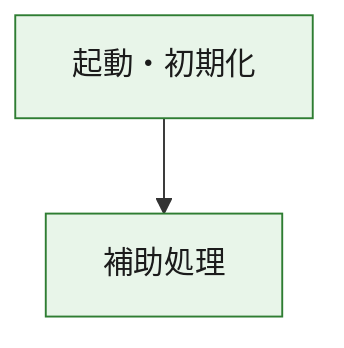
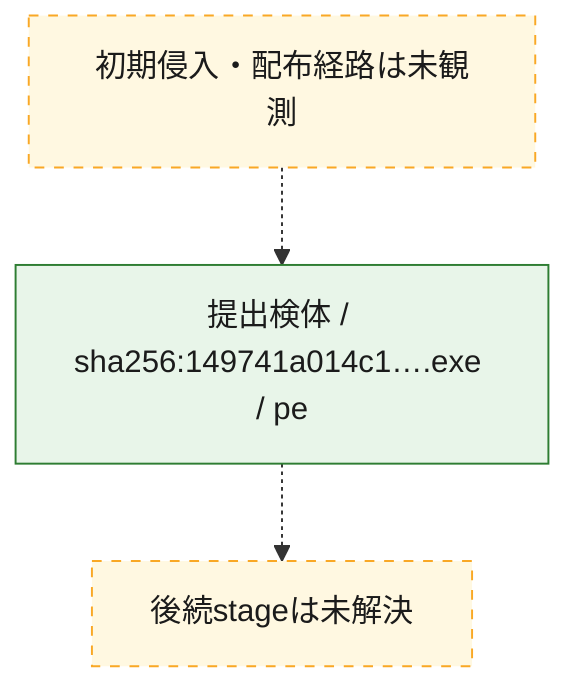
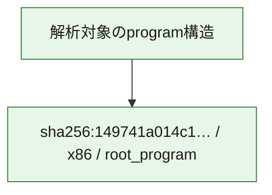

# 全体ロジック：149741a014c14da7cc4eaf0f6ee9879044697af0132662fb49ba812b8b50386f

代表関数の静的証跡から、起動・初期化の処理群を確認しました。

## 読み方

- phaseの掲載順は解析上の整理順です。observed_call_edgesがない段階間の実行順を断定しません。
- 図の実線は静的に観測した関係、点線と黄色のノードは未観測・未解決の関係を示します。
- 図は静的な要約であり、動的実行を再現するものではありません。
- 詳細な関数解説とfingerprintは[STATIC-LOGIC.md](STATIC-LOGIC.md)を参照してください。

## 静的可視化

### 実行フロー

### 感染チェーン

### モジュール関係

## 処理段階

### 1. 起動・初期化

entry pointから初期化と後続処理への移行を確認します。
確度: `confirmed_static_function_evidence`

- `149741a014c14da7cc4eaf0f6ee9879044697af0132662fb49ba812b8b50386f:ghidra:1400014c0` — 初期化と主要処理への分岐を行う入口関数です。 状態: `succeeded`、選定理由: `entry_point`, `meaningful_symbol_name`, `reviewed_call_centrality:1`, `role:entrypoint`

### 2. 補助処理

主要処理を支える一般内部関数またはlibrary処理を確認します。
確度: `confirmed_static_function_evidence_with_limits`

- `149741a014c14da7cc4eaf0f6ee9879044697af0132662fb49ba812b8b50386f:ghidra:140001000` — 検体内部の一般処理を実装する関数です。 状態: `succeeded`、選定理由: `context_representative`
- `149741a014c14da7cc4eaf0f6ee9879044697af0132662fb49ba812b8b50386f:ghidra:140001010` — 検体内部の一般処理を実装する関数です。 状態: `succeeded`、選定理由: `context_representative`, `reviewed_call_centrality:6`
- `149741a014c14da7cc4eaf0f6ee9879044697af0132662fb49ba812b8b50386f:ghidra:140001140` — 検体内部の一般処理を実装する関数です。 状態: `succeeded`、選定理由: `context_representative`, `reviewed_call_centrality:1`
- `149741a014c14da7cc4eaf0f6ee9879044697af0132662fb49ba812b8b50386f:ghidra:140001190` — 検体内部の一般処理を実装する関数です。 状態: `succeeded`、選定理由: `context_representative`, `reviewed_call_centrality:24`
- `149741a014c14da7cc4eaf0f6ee9879044697af0132662fb49ba812b8b50386f:ghidra:1400014e0` — 検体内部の一般処理を実装する関数です。 状態: `succeeded`、選定理由: `context_representative`, `reviewed_call_centrality:1`
- `149741a014c14da7cc4eaf0f6ee9879044697af0132662fb49ba812b8b50386f:ghidra:140001500` — 検体内部の一般処理を実装する関数です。 状態: `succeeded`、選定理由: `context_representative`, `reviewed_call_centrality:1`
- `149741a014c14da7cc4eaf0f6ee9879044697af0132662fb49ba812b8b50386f:ghidra:140001520` — 検体内部の一般処理を実装する関数です。 状態: `succeeded`、選定理由: `context_representative`, `reviewed_call_centrality:1`
- `149741a014c14da7cc4eaf0f6ee9879044697af0132662fb49ba812b8b50386f:ghidra:140001530` — 検体内部の一般処理を実装する関数です。 状態: `succeeded`、選定理由: `context_representative`
- `149741a014c14da7cc4eaf0f6ee9879044697af0132662fb49ba812b8b50386f:ghidra:140001560` — 検体内部の一般処理を実装する関数です。 状態: `succeeded`、選定理由: `context_representative`
- `149741a014c14da7cc4eaf0f6ee9879044697af0132662fb49ba812b8b50386f:ghidra:1400015d0` — 検体内部の一般処理を実装する関数です。 状態: `succeeded`、選定理由: `context_representative`, `reviewed_call_centrality:1`
- `149741a014c14da7cc4eaf0f6ee9879044697af0132662fb49ba812b8b50386f:ghidra:140001620` — 検体内部の一般処理を実装する関数です。 状態: `succeeded`、選定理由: `context_representative`, `reviewed_call_centrality:4`
- `149741a014c14da7cc4eaf0f6ee9879044697af0132662fb49ba812b8b50386f:ghidra:1400016e0` — 検体内部の一般処理を実装する関数です。 状態: `succeeded`、選定理由: `context_representative`, `reviewed_call_centrality:1`
- `149741a014c14da7cc4eaf0f6ee9879044697af0132662fb49ba812b8b50386f:ghidra:140001760` — 検体内部の一般処理を実装する関数です。 状態: `succeeded`、選定理由: `context_representative`
- `149741a014c14da7cc4eaf0f6ee9879044697af0132662fb49ba812b8b50386f:ghidra:1400017c0` — 検体内部の一般処理を実装する関数です。 状態: `succeeded`、選定理由: `context_representative`, `reviewed_call_centrality:1`
- `149741a014c14da7cc4eaf0f6ee9879044697af0132662fb49ba812b8b50386f:ghidra:140001840` — 検体内部の一般処理を実装する関数です。 状態: `succeeded`、選定理由: `context_representative`
- `149741a014c14da7cc4eaf0f6ee9879044697af0132662fb49ba812b8b50386f:ghidra:140001910` — 検体内部の一般処理を実装する関数です。 状態: `succeeded`、選定理由: `context_representative`
- `149741a014c14da7cc4eaf0f6ee9879044697af0132662fb49ba812b8b50386f:ghidra:140001940` — 検体内部の一般処理を実装する関数です。 状態: `succeeded`、選定理由: `context_representative`
- `149741a014c14da7cc4eaf0f6ee9879044697af0132662fb49ba812b8b50386f:ghidra:140001980` — 検体内部の一般処理を実装する関数です。 状態: `succeeded`、選定理由: `context_representative`, `reviewed_call_centrality:3`
- `149741a014c14da7cc4eaf0f6ee9879044697af0132662fb49ba812b8b50386f:ghidra:140001a50` — 検体内部の一般処理を実装する関数です。 状態: `succeeded`、選定理由: `context_representative`, `reviewed_call_centrality:2`
- `149741a014c14da7cc4eaf0f6ee9879044697af0132662fb49ba812b8b50386f:ghidra:140001a80` — 検体内部の一般処理を実装する関数です。 状態: `succeeded`、選定理由: `context_representative`
- `149741a014c14da7cc4eaf0f6ee9879044697af0132662fb49ba812b8b50386f:ghidra:140001ae0` — 検体内部の一般処理を実装する関数です。 状態: `succeeded`、選定理由: `context_representative`
- `149741a014c14da7cc4eaf0f6ee9879044697af0132662fb49ba812b8b50386f:ghidra:140001b50` — 検体内部の一般処理を実装する関数です。 状態: `succeeded`、選定理由: `context_representative`
- `149741a014c14da7cc4eaf0f6ee9879044697af0132662fb49ba812b8b50386f:ghidra:140001bb0` — 検体内部の一般処理を実装する関数です。 状態: `succeeded`、選定理由: `context_representative`, `reviewed_call_centrality:1`
- `149741a014c14da7cc4eaf0f6ee9879044697af0132662fb49ba812b8b50386f:ghidra:140001c50` — 検体内部の一般処理を実装する関数です。 状態: `succeeded`、選定理由: `context_representative`
- `149741a014c14da7cc4eaf0f6ee9879044697af0132662fb49ba812b8b50386f:ghidra:140001d10` — 検体内部の一般処理を実装する関数です。 状態: `succeeded`、選定理由: `context_representative`, `reviewed_call_centrality:1`
- `149741a014c14da7cc4eaf0f6ee9879044697af0132662fb49ba812b8b50386f:ghidra:140001da0` — 検体内部の一般処理を実装する関数です。 状態: `succeeded`、選定理由: `context_representative`, `reviewed_call_centrality:2`
- `149741a014c14da7cc4eaf0f6ee9879044697af0132662fb49ba812b8b50386f:ghidra:140001e50` — 検体内部の一般処理を実装する関数です。 状態: `succeeded`、選定理由: `context_representative`, `reviewed_call_centrality:2`
- `149741a014c14da7cc4eaf0f6ee9879044697af0132662fb49ba812b8b50386f:ghidra:14000ac00` — compiler生成処理または汎用library処理とみられる関数です。 状態: `succeeded`、選定理由: `entry_point`, `meaningful_symbol_name`, `reviewed_call_centrality:1`
- `149741a014c14da7cc4eaf0f6ee9879044697af0132662fb49ba812b8b50386f:ghidra:14000ac30` — compiler生成処理または汎用library処理とみられる関数です。 状態: `succeeded`、選定理由: `entry_point`, `meaningful_symbol_name`, `reviewed_call_centrality:3`
- `149741a014c14da7cc4eaf0f6ee9879044697af0132662fb49ba812b8b50386f:ghidra:14000b770` — compiler生成処理または汎用library処理とみられる関数です。 状態: `limited_bad_instruction_or_flow`、選定理由: `entry_point`, `meaningful_symbol_name`, `reviewed_call_centrality:7`
- `149741a014c14da7cc4eaf0f6ee9879044697af0132662fb49ba812b8b50386f:ghidra:1400113d0` — compiler生成処理または汎用library処理とみられる関数です。 状態: `succeeded`、選定理由: `entry_point`, `meaningful_symbol_name`, `reviewed_call_centrality:28`

## 観測したcall関係

- `149741a014c14da7cc4eaf0f6ee9879044697af0132662fb49ba812b8b50386f:ghidra:140001190` → `149741a014c14da7cc4eaf0f6ee9879044697af0132662fb49ba812b8b50386f:ghidra:14000ac30` （`support` → `support`）
- `149741a014c14da7cc4eaf0f6ee9879044697af0132662fb49ba812b8b50386f:ghidra:1400014c0` → `149741a014c14da7cc4eaf0f6ee9879044697af0132662fb49ba812b8b50386f:ghidra:140001190` （`startup` → `support`）
- `149741a014c14da7cc4eaf0f6ee9879044697af0132662fb49ba812b8b50386f:ghidra:1400014e0` → `149741a014c14da7cc4eaf0f6ee9879044697af0132662fb49ba812b8b50386f:ghidra:140001190` （`support` → `support`）
- `149741a014c14da7cc4eaf0f6ee9879044697af0132662fb49ba812b8b50386f:ghidra:1400016e0` → `149741a014c14da7cc4eaf0f6ee9879044697af0132662fb49ba812b8b50386f:ghidra:140001620` （`support` → `support`）
- `149741a014c14da7cc4eaf0f6ee9879044697af0132662fb49ba812b8b50386f:ghidra:1400017c0` → `149741a014c14da7cc4eaf0f6ee9879044697af0132662fb49ba812b8b50386f:ghidra:140001620` （`support` → `support`）
- `149741a014c14da7cc4eaf0f6ee9879044697af0132662fb49ba812b8b50386f:ghidra:140001d10` → `149741a014c14da7cc4eaf0f6ee9879044697af0132662fb49ba812b8b50386f:ghidra:140001620` （`support` → `support`）
- `149741a014c14da7cc4eaf0f6ee9879044697af0132662fb49ba812b8b50386f:ghidra:140001da0` → `149741a014c14da7cc4eaf0f6ee9879044697af0132662fb49ba812b8b50386f:ghidra:140001a50` （`support` → `support`）
- `149741a014c14da7cc4eaf0f6ee9879044697af0132662fb49ba812b8b50386f:ghidra:140001e50` → `149741a014c14da7cc4eaf0f6ee9879044697af0132662fb49ba812b8b50386f:ghidra:1400015d0` （`support` → `support`）
- `149741a014c14da7cc4eaf0f6ee9879044697af0132662fb49ba812b8b50386f:ghidra:140001e50` → `149741a014c14da7cc4eaf0f6ee9879044697af0132662fb49ba812b8b50386f:ghidra:140001620` （`support` → `support`）
- `ghidra-function:12827d362f7a2f922640ba3e` → `ghidra-external:53bb3c1bfddfe22aa6ac4287` （`unclassified` → `unclassified`）
- `ghidra-function:1ecf27ab3747ddc025f8c407` → `ghidra-function:ba20455d413a42b7daf65867` （`unclassified` → `unclassified`）
- `ghidra-function:30afc59a1567f9045019ee50` → `ghidra-function:8859d3349b6e90f0c62b24cb` （`unclassified` → `unclassified`）
- `ghidra-function:4721185a4b6f879179d34ca9` → `ghidra-external:07cf9ddb59be1084db767374` （`unclassified` → `unclassified`）
- `ghidra-function:4721185a4b6f879179d34ca9` → `ghidra-external:56f96e587e5d5baacff347c4` （`unclassified` → `unclassified`）
- `ghidra-function:4721185a4b6f879179d34ca9` → `ghidra-external:e81283806f5c8ad0456c1048` （`unclassified` → `unclassified`）
- `ghidra-function:5949606291dd26e6d1215b30` → `ghidra-external:30fb4f3d17a0b18c33df15ea` （`unclassified` → `unclassified`）
- `ghidra-function:6306fd3dbe5f3f31e0893700` → `ghidra-function:ba20455d413a42b7daf65867` （`unclassified` → `unclassified`）
- `ghidra-function:6306fd3dbe5f3f31e0893700` → `ghidra-function:c785d29b81e5b880bf31715f` （`unclassified` → `unclassified`）
- `ghidra-function:6d540b74a803cbced4da7c4e` → `ghidra-function:8859d3349b6e90f0c62b24cb` （`unclassified` → `unclassified`）
- `ghidra-function:6f7032c7d11146f55b6fe9c1` → `ghidra-external:56f96e587e5d5baacff347c4` （`unclassified` → `unclassified`）
- `ghidra-function:6f7032c7d11146f55b6fe9c1` → `ghidra-function:01c67c28fb5f6ebe4b9f5a15` （`unclassified` → `unclassified`）
- `ghidra-function:6f7032c7d11146f55b6fe9c1` → `ghidra-function:204e449351dbed38ed9b3f0f` （`unclassified` → `unclassified`）
- `ghidra-function:6f7032c7d11146f55b6fe9c1` → `ghidra-function:579a5634a627f5b9f9b2e4ef` （`unclassified` → `unclassified`）
- `ghidra-function:6f7032c7d11146f55b6fe9c1` → `ghidra-function:6e266ea26b02065787bb313e` （`unclassified` → `unclassified`）
- `ghidra-function:7be9d870956d411620dee23e` → `ghidra-external:e29ed4d26f13ba768f4e9377` （`unclassified` → `unclassified`）
- `ghidra-function:7be9d870956d411620dee23e` → `ghidra-function:ad3502ebff608c9a3fbcff70` （`unclassified` → `unclassified`）
- `ghidra-function:8859d3349b6e90f0c62b24cb` → `ghidra-external:2c4acea3f80c3ad4d91f8c36` （`unclassified` → `unclassified`）
- `ghidra-function:8859d3349b6e90f0c62b24cb` → `ghidra-external:4509a4e7d0f68906335b8e2b` （`unclassified` → `unclassified`）
- `ghidra-function:8859d3349b6e90f0c62b24cb` → `ghidra-external:53bb3c1bfddfe22aa6ac4287` （`unclassified` → `unclassified`）
- `ghidra-function:8859d3349b6e90f0c62b24cb` → `ghidra-external:a6911ce052c1679bcbd8e1f4` （`unclassified` → `unclassified`）
- `ghidra-function:8859d3349b6e90f0c62b24cb` → `ghidra-external:abb923b36f8943803cba5a6d` （`unclassified` → `unclassified`）
- `ghidra-function:8859d3349b6e90f0c62b24cb` → `ghidra-external:cc34c9138269309fa8980c59` （`unclassified` → `unclassified`）
- `ghidra-function:8859d3349b6e90f0c62b24cb` → `ghidra-external:e81283806f5c8ad0456c1048` （`unclassified` → `unclassified`）
- `ghidra-function:8859d3349b6e90f0c62b24cb` → `ghidra-external:faf9951612084a54812b50c7` （`unclassified` → `unclassified`）
- `ghidra-function:8859d3349b6e90f0c62b24cb` → `ghidra-external:fc6c75277a35fe631eaafe7b` （`unclassified` → `unclassified`）
- `ghidra-function:8859d3349b6e90f0c62b24cb` → `ghidra-function:56b15bd7133d2f2f3cff3629` （`unclassified` → `unclassified`）
- `ghidra-function:8859d3349b6e90f0c62b24cb` → `ghidra-function:7be9d870956d411620dee23e` （`unclassified` → `unclassified`）
- `ghidra-function:8859d3349b6e90f0c62b24cb` → `ghidra-function:7ecf35720f4e5a1239d86a5e` （`unclassified` → `unclassified`）
- `ghidra-function:8859d3349b6e90f0c62b24cb` → `ghidra-function:a4291ad04cf249e94fa47a9b` （`unclassified` → `unclassified`）
- `ghidra-function:8859d3349b6e90f0c62b24cb` → `ghidra-function:c747a19ea3892a9ad8dff327` （`unclassified` → `unclassified`）
- `ghidra-function:8859d3349b6e90f0c62b24cb` → `ghidra-function:cdceebb4da6f689c735be762` （`unclassified` → `unclassified`）
- `ghidra-function:8859d3349b6e90f0c62b24cb` → `ghidra-function:dd4a2d57040fe76c66fb349e` （`unclassified` → `unclassified`）
- `ghidra-function:8859d3349b6e90f0c62b24cb` → `ghidra-function:e1bd6d7a9c50ea2a08cbacd3` （`unclassified` → `unclassified`）
- `ghidra-function:8859d3349b6e90f0c62b24cb` → `ghidra-function:e558f5d6c78927087052f3d1` （`unclassified` → `unclassified`）
- `ghidra-function:8859d3349b6e90f0c62b24cb` → `ghidra-function:eac61513cf5290e67a8a9189` （`unclassified` → `unclassified`）
- `ghidra-function:8d6db8fbea95b1aa77384f75` → `ghidra-external:53bb3c1bfddfe22aa6ac4287` （`unclassified` → `unclassified`）
- `ghidra-function:8d6db8fbea95b1aa77384f75` → `ghidra-function:af2c8560910e4b7901f485c1` （`unclassified` → `unclassified`）
- `ghidra-function:91221bb846b0b6a748504cd7` → `ghidra-function:ba20455d413a42b7daf65867` （`unclassified` → `unclassified`）
- `ghidra-function:9c77a500466c0d590721d9de` → `ghidra-function:ad3502ebff608c9a3fbcff70` （`unclassified` → `unclassified`）
- `ghidra-function:af2c8560910e4b7901f485c1` → `ghidra-function:6e2a17c77863e3a5e5a45ab8` （`unclassified` → `unclassified`）
- `ghidra-function:bf458f49e51829b05128d987` → `ghidra-function:ba20455d413a42b7daf65867` （`unclassified` → `unclassified`）
- `ghidra-function:c34815b4649623cfb9559c9d` → `ghidra-external:bcb03cc71b8f456d3d8635ea` （`unclassified` → `unclassified`）
- `ghidra-function:c34815b4649623cfb9559c9d` → `ghidra-external:e29ed4d26f13ba768f4e9377` （`unclassified` → `unclassified`）
- `ghidra-function:c34815b4649623cfb9559c9d` → `ghidra-function:216871f7910fc9fe47488745` （`unclassified` → `unclassified`）
- `ghidra-function:c34815b4649623cfb9559c9d` → `ghidra-function:66bf578bdcbb00212ba56e13` （`unclassified` → `unclassified`）
- `ghidra-function:c34815b4649623cfb9559c9d` → `ghidra-function:95ddcee3abdcad570c85d6dc` （`unclassified` → `unclassified`）
- `ghidra-function:c34815b4649623cfb9559c9d` → `ghidra-function:e9c06c3298411a3d7b597f44` （`unclassified` → `unclassified`）
- `ghidra-function:c6591e65967403448150bec6` → `ghidra-external:e093b8d94cccddc8c35467a9` （`unclassified` → `unclassified`）
- `ghidra-function:cd22efa19f4d651279857831` → `ghidra-external:e093b8d94cccddc8c35467a9` （`unclassified` → `unclassified`）
- `ghidra-function:d6101e322169b60592391fbe` → `ghidra-external:4386cc1b6801aebb2666737b` （`unclassified` → `unclassified`）
- `ghidra-function:d6101e322169b60592391fbe` → `ghidra-function:0225eccf672415c5e9d7b1ce` （`unclassified` → `unclassified`）
- `ghidra-function:d6101e322169b60592391fbe` → `ghidra-function:25c0f723c03265f4608098b6` （`unclassified` → `unclassified`）
- `ghidra-function:d6101e322169b60592391fbe` → `ghidra-function:51afded4d19e6742e3e62340` （`unclassified` → `unclassified`）
- `ghidra-function:d6101e322169b60592391fbe` → `ghidra-function:5f539ba746b55e7b20f7f929` （`unclassified` → `unclassified`）
- `ghidra-function:d6101e322169b60592391fbe` → `ghidra-function:66f3195021748ac7531b585d` （`unclassified` → `unclassified`）
- `ghidra-function:d6101e322169b60592391fbe` → `ghidra-function:74c94427d43a9bf9ac80b8b6` （`unclassified` → `unclassified`）
- `ghidra-function:d6101e322169b60592391fbe` → `ghidra-function:8517a4de4f8c5c650cdd7581` （`unclassified` → `unclassified`）
- `ghidra-function:d6101e322169b60592391fbe` → `ghidra-function:90d0f6d1dfb10e8a772c265b` （`unclassified` → `unclassified`）
- `ghidra-function:d6101e322169b60592391fbe` → `ghidra-function:a4291ad04cf249e94fa47a9b` （`unclassified` → `unclassified`）
- `ghidra-function:d6101e322169b60592391fbe` → `ghidra-function:ae572d765a00752c3ace50a9` （`unclassified` → `unclassified`）
- `ghidra-function:d6101e322169b60592391fbe` → `ghidra-function:b9aa54c0739a39a687637a4a` （`unclassified` → `unclassified`）
- `ghidra-function:d6101e322169b60592391fbe` → `ghidra-function:c6b6b6b92bbf7a18120cad0c` （`unclassified` → `unclassified`）
- `ghidra-function:d6101e322169b60592391fbe` → `ghidra-function:cb822969a154af54a2e370f1` （`unclassified` → `unclassified`）
- `ghidra-function:d6101e322169b60592391fbe` → `ghidra-function:d35571f951363ba5b51b849a` （`unclassified` → `unclassified`）
- `ghidra-function:d6101e322169b60592391fbe` → `ghidra-function:d762fd1c4ae38100a77ca65d` （`unclassified` → `unclassified`）
- `ghidra-function:d6101e322169b60592391fbe` → `ghidra-function:da1625d71abc75121aafbc7e` （`unclassified` → `unclassified`）
- `ghidra-function:d6101e322169b60592391fbe` → `ghidra-function:e558f5d6c78927087052f3d1` （`unclassified` → `unclassified`）
- `ghidra-function:d6101e322169b60592391fbe` → `ghidra-function:ee605e5535cb6a278f27be04` （`unclassified` → `unclassified`）
- `ghidra-function:d6101e322169b60592391fbe` → `ghidra-function:f35a3aee6d36de0988d5646f` （`unclassified` → `unclassified`）

## 解析範囲と制約

- 選定外関数は全体inventoryへ残しますが、関数本体の個別解説対象にはしていません。
- indirect call、難読化、packer、VM、壊れたcontrol flowによりcall関係が欠落する場合があります。
- 文書は静的解析に基づき、検体実行や外部通信による動的確認は行っていません。
