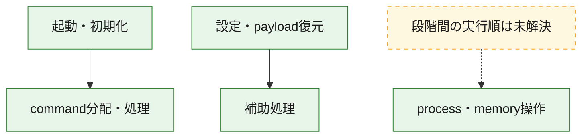
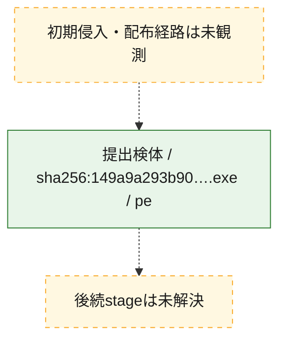
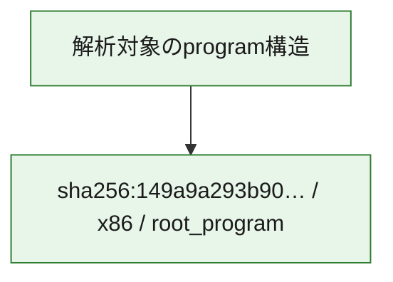

# 全体ロジック：149a9a293b908ffaf3adcc7a332f0aa297517dd518ef97463208807605d9c26e

代表関数の静的証跡から、起動・初期化、設定・payload復元、process・memory操作、command分配・処理の処理群を確認しました。

## 読み方

- phaseの掲載順は解析上の整理順です。observed_call_edgesがない段階間の実行順を断定しません。
- 図の実線は静的に観測した関係、点線と黄色のノードは未観測・未解決の関係を示します。
- 図は静的な要約であり、動的実行を再現するものではありません。
- 詳細な関数解説とfingerprintは[STATIC-LOGIC.md](STATIC-LOGIC.md)を参照してください。

## 静的可視化

### 実行フロー

### 感染チェーン

### モジュール関係

## 処理段階

### 1. 起動・初期化

entry pointから初期化と後続処理への移行を確認します。
確度: `confirmed_static_function_evidence`

- `149a9a293b908ffaf3adcc7a332f0aa297517dd518ef97463208807605d9c26e:ghidra:140005db8` — 初期化と主要処理への分岐を行う入口関数です。 状態: `succeeded`、選定理由: `entry_point`, `meaningful_symbol_name`, `reviewed_call_centrality:22`, `role:entrypoint`

### 2. 設定・payload復元

設定、resource、payload、暗号化データの復元・変換を確認します。
確度: `confirmed_static_function_evidence`

- `149a9a293b908ffaf3adcc7a332f0aa297517dd518ef97463208807605d9c26e:ghidra:140001418` — 暗号、hash、encoding、または復号処理に関係する関数です。 状態: `succeeded`、選定理由: `context_representative`, `reviewed_call_centrality:17`, `role:cryptographic_transform`

### 3. process・memory操作

process、thread、module、memory操作と実行移行を確認します。
確度: `confirmed_static_function_evidence`

- `149a9a293b908ffaf3adcc7a332f0aa297517dd518ef97463208807605d9c26e:ghidra:140001bb8` — process、thread、module、またはmemory操作に関係する関数です。 状態: `succeeded`、選定理由: `context_representative`, `reviewed_call_centrality:24`, `role:process_or_memory_operation`

### 4. command分配・処理

受信commandやtaskの解釈、分配、個別handlerへの移行を確認します。
確度: `confirmed_static_function_evidence_with_limits`

- `149a9a293b908ffaf3adcc7a332f0aa297517dd518ef97463208807605d9c26e:ghidra:140006940` — commandの解釈、分配、または個別処理を担当する関数です。 状態: `limited_bad_instruction_or_flow`、選定理由: `meaningful_symbol_name`, `reviewed_call_centrality:1`, `role:command_dispatch_or_handler`

### 5. 補助処理

主要処理を支える一般内部関数またはlibrary処理を確認します。
確度: `confirmed_static_function_evidence`

- `149a9a293b908ffaf3adcc7a332f0aa297517dd518ef97463208807605d9c26e:ghidra:140001000` — 検体内部の一般処理を実装する関数です。 状態: `succeeded`、選定理由: `context_representative`, `reviewed_call_centrality:1`
- `149a9a293b908ffaf3adcc7a332f0aa297517dd518ef97463208807605d9c26e:ghidra:140001050` — 検体内部の一般処理を実装する関数です。 状態: `succeeded`、選定理由: `context_representative`, `reviewed_call_centrality:2`
- `149a9a293b908ffaf3adcc7a332f0aa297517dd518ef97463208807605d9c26e:ghidra:140001098` — 検体内部の一般処理を実装する関数です。 状態: `succeeded`、選定理由: `context_representative`, `reviewed_call_centrality:3`
- `149a9a293b908ffaf3adcc7a332f0aa297517dd518ef97463208807605d9c26e:ghidra:140001114` — 検体内部の一般処理を実装する関数です。 状態: `succeeded`、選定理由: `context_representative`, `reviewed_call_centrality:3`
- `149a9a293b908ffaf3adcc7a332f0aa297517dd518ef97463208807605d9c26e:ghidra:140001134` — 検体内部の一般処理を実装する関数です。 状態: `succeeded`、選定理由: `context_representative`, `reviewed_call_centrality:2`
- `149a9a293b908ffaf3adcc7a332f0aa297517dd518ef97463208807605d9c26e:ghidra:140001174` — 検体内部の一般処理を実装する関数です。 状態: `succeeded`、選定理由: `context_representative`, `reviewed_call_centrality:2`
- `149a9a293b908ffaf3adcc7a332f0aa297517dd518ef97463208807605d9c26e:ghidra:1400011b4` — 検体内部の一般処理を実装する関数です。 状態: `succeeded`、選定理由: `context_representative`, `reviewed_call_centrality:2`
- `149a9a293b908ffaf3adcc7a332f0aa297517dd518ef97463208807605d9c26e:ghidra:1400011c8` — 検体内部の一般処理を実装する関数です。 状態: `succeeded`、選定理由: `context_representative`, `reviewed_call_centrality:4`
- `149a9a293b908ffaf3adcc7a332f0aa297517dd518ef97463208807605d9c26e:ghidra:1400011f8` — 検体内部の一般処理を実装する関数です。 状態: `succeeded`、選定理由: `context_representative`, `reviewed_call_centrality:11`
- `149a9a293b908ffaf3adcc7a332f0aa297517dd518ef97463208807605d9c26e:ghidra:1400018e8` — 検体内部の一般処理を実装する関数です。 状態: `succeeded`、選定理由: `context_representative`, `reviewed_call_centrality:9`
- `149a9a293b908ffaf3adcc7a332f0aa297517dd518ef97463208807605d9c26e:ghidra:140001b98` — 検体内部の一般処理を実装する関数です。 状態: `succeeded`、選定理由: `context_representative`, `reviewed_call_centrality:2`
- `149a9a293b908ffaf3adcc7a332f0aa297517dd518ef97463208807605d9c26e:ghidra:140002690` — 検体内部の一般処理を実装する関数です。 状態: `succeeded`、選定理由: `context_representative`, `reviewed_call_centrality:9`
- `149a9a293b908ffaf3adcc7a332f0aa297517dd518ef97463208807605d9c26e:ghidra:140002748` — 検体内部の一般処理を実装する関数です。 状態: `succeeded`、選定理由: `context_representative`, `reviewed_call_centrality:5`
- `149a9a293b908ffaf3adcc7a332f0aa297517dd518ef97463208807605d9c26e:ghidra:140002894` — 検体内部の一般処理を実装する関数です。 状態: `succeeded`、選定理由: `context_representative`, `reviewed_call_centrality:1`
- `149a9a293b908ffaf3adcc7a332f0aa297517dd518ef97463208807605d9c26e:ghidra:140002954` — 検体内部の一般処理を実装する関数です。 状態: `succeeded`、選定理由: `context_representative`, `reviewed_call_centrality:2`
- `149a9a293b908ffaf3adcc7a332f0aa297517dd518ef97463208807605d9c26e:ghidra:1400029f8` — 検体内部の一般処理を実装する関数です。 状態: `succeeded`、選定理由: `context_representative`, `reviewed_call_centrality:3`
- `149a9a293b908ffaf3adcc7a332f0aa297517dd518ef97463208807605d9c26e:ghidra:140002afc` — 検体内部の一般処理を実装する関数です。 状態: `succeeded`、選定理由: `context_representative`, `reviewed_call_centrality:5`
- `149a9a293b908ffaf3adcc7a332f0aa297517dd518ef97463208807605d9c26e:ghidra:140002bd8` — 検体内部の一般処理を実装する関数です。 状態: `succeeded`、選定理由: `context_representative`, `reviewed_call_centrality:11`
- `149a9a293b908ffaf3adcc7a332f0aa297517dd518ef97463208807605d9c26e:ghidra:140002c84` — 検体内部の一般処理を実装する関数です。 状態: `succeeded`、選定理由: `context_representative`, `reviewed_call_centrality:16`
- `149a9a293b908ffaf3adcc7a332f0aa297517dd518ef97463208807605d9c26e:ghidra:140002eb8` — 検体内部の一般処理を実装する関数です。 状態: `succeeded`、選定理由: `context_representative`, `reviewed_call_centrality:11`
- `149a9a293b908ffaf3adcc7a332f0aa297517dd518ef97463208807605d9c26e:ghidra:140002f28` — 検体内部の一般処理を実装する関数です。 状態: `succeeded`、選定理由: `context_representative`, `reviewed_call_centrality:10`
- `149a9a293b908ffaf3adcc7a332f0aa297517dd518ef97463208807605d9c26e:ghidra:140003058` — 検体内部の一般処理を実装する関数です。 状態: `succeeded`、選定理由: `context_representative`, `reviewed_call_centrality:10`
- `149a9a293b908ffaf3adcc7a332f0aa297517dd518ef97463208807605d9c26e:ghidra:1400030c8` — 検体内部の一般処理を実装する関数です。 状態: `succeeded`、選定理由: `context_representative`, `reviewed_call_centrality:10`
- `149a9a293b908ffaf3adcc7a332f0aa297517dd518ef97463208807605d9c26e:ghidra:140003138` — 検体内部の一般処理を実装する関数です。 状態: `succeeded`、選定理由: `context_representative`, `reviewed_call_centrality:6`
- `149a9a293b908ffaf3adcc7a332f0aa297517dd518ef97463208807605d9c26e:ghidra:140003258` — 検体内部の一般処理を実装する関数です。 状態: `succeeded`、選定理由: `context_representative`, `reviewed_call_centrality:13`
- `149a9a293b908ffaf3adcc7a332f0aa297517dd518ef97463208807605d9c26e:ghidra:140003318` — 検体内部の一般処理を実装する関数です。 状態: `succeeded`、選定理由: `context_representative`, `reviewed_call_centrality:11`
- `149a9a293b908ffaf3adcc7a332f0aa297517dd518ef97463208807605d9c26e:ghidra:1400033bc` — 検体内部の一般処理を実装する関数です。 状態: `succeeded`、選定理由: `context_representative`, `reviewed_call_centrality:9`
- `149a9a293b908ffaf3adcc7a332f0aa297517dd518ef97463208807605d9c26e:ghidra:140005f88` — 検体内部の一般処理を実装する関数です。 状態: `succeeded`、選定理由: `meaningful_symbol_name`

## 観測したcall関係

- `149a9a293b908ffaf3adcc7a332f0aa297517dd518ef97463208807605d9c26e:ghidra:140001418` → `149a9a293b908ffaf3adcc7a332f0aa297517dd518ef97463208807605d9c26e:ghidra:1400011f8` （`configuration` → `support`）
- `149a9a293b908ffaf3adcc7a332f0aa297517dd518ef97463208807605d9c26e:ghidra:140002954` → `149a9a293b908ffaf3adcc7a332f0aa297517dd518ef97463208807605d9c26e:ghidra:140002748` （`support` → `support`）
- `149a9a293b908ffaf3adcc7a332f0aa297517dd518ef97463208807605d9c26e:ghidra:140002bd8` → `149a9a293b908ffaf3adcc7a332f0aa297517dd518ef97463208807605d9c26e:ghidra:140002690` （`support` → `support`）
- `149a9a293b908ffaf3adcc7a332f0aa297517dd518ef97463208807605d9c26e:ghidra:140002c84` → `149a9a293b908ffaf3adcc7a332f0aa297517dd518ef97463208807605d9c26e:ghidra:140002690` （`support` → `support`）
- `149a9a293b908ffaf3adcc7a332f0aa297517dd518ef97463208807605d9c26e:ghidra:140002eb8` → `149a9a293b908ffaf3adcc7a332f0aa297517dd518ef97463208807605d9c26e:ghidra:140002690` （`support` → `support`）
- `149a9a293b908ffaf3adcc7a332f0aa297517dd518ef97463208807605d9c26e:ghidra:140002f28` → `149a9a293b908ffaf3adcc7a332f0aa297517dd518ef97463208807605d9c26e:ghidra:140002690` （`support` → `support`）
- `149a9a293b908ffaf3adcc7a332f0aa297517dd518ef97463208807605d9c26e:ghidra:1400030c8` → `149a9a293b908ffaf3adcc7a332f0aa297517dd518ef97463208807605d9c26e:ghidra:140002894` （`support` → `support`）
- `149a9a293b908ffaf3adcc7a332f0aa297517dd518ef97463208807605d9c26e:ghidra:140003138` → `149a9a293b908ffaf3adcc7a332f0aa297517dd518ef97463208807605d9c26e:ghidra:140002690` （`support` → `support`）
- `149a9a293b908ffaf3adcc7a332f0aa297517dd518ef97463208807605d9c26e:ghidra:140003258` → `149a9a293b908ffaf3adcc7a332f0aa297517dd518ef97463208807605d9c26e:ghidra:140002690` （`support` → `support`）
- `149a9a293b908ffaf3adcc7a332f0aa297517dd518ef97463208807605d9c26e:ghidra:140003258` → `149a9a293b908ffaf3adcc7a332f0aa297517dd518ef97463208807605d9c26e:ghidra:140002954` （`support` → `support`）
- `149a9a293b908ffaf3adcc7a332f0aa297517dd518ef97463208807605d9c26e:ghidra:140003318` → `149a9a293b908ffaf3adcc7a332f0aa297517dd518ef97463208807605d9c26e:ghidra:140002690` （`support` → `support`）
- `149a9a293b908ffaf3adcc7a332f0aa297517dd518ef97463208807605d9c26e:ghidra:1400033bc` → `149a9a293b908ffaf3adcc7a332f0aa297517dd518ef97463208807605d9c26e:ghidra:140002690` （`support` → `support`）
- `149a9a293b908ffaf3adcc7a332f0aa297517dd518ef97463208807605d9c26e:ghidra:1400033bc` → `149a9a293b908ffaf3adcc7a332f0aa297517dd518ef97463208807605d9c26e:ghidra:1400029f8` （`support` → `support`）
- `149a9a293b908ffaf3adcc7a332f0aa297517dd518ef97463208807605d9c26e:ghidra:140005db8` → `149a9a293b908ffaf3adcc7a332f0aa297517dd518ef97463208807605d9c26e:ghidra:140006940` （`startup` → `dispatch`）
- `ghidra-function:0af6b33be93ed5499f9e7953` → `ghidra-function:210f6c0bd4373549ec22a730` （`unclassified` → `unclassified`）
- `ghidra-function:0af6b33be93ed5499f9e7953` → `ghidra-function:410ab761d749bed16a25677e` （`unclassified` → `unclassified`）
- `ghidra-function:13bd8b5a9abe947513c57999` → `ghidra-function:eeec3b8791b20ec79dba1466` （`unclassified` → `unclassified`）
- `ghidra-function:371140221870611cacafd1c6` → `ghidra-external:36664abc007ac209d6f20cbe` （`unclassified` → `unclassified`）
- `ghidra-function:371140221870611cacafd1c6` → `ghidra-external:3951fb9a6e3e461e5bcb632d` （`unclassified` → `unclassified`）
- `ghidra-function:371140221870611cacafd1c6` → `ghidra-external:b4991bc352d5eb7b33e8ed1a` （`unclassified` → `unclassified`）
- `ghidra-function:371140221870611cacafd1c6` → `ghidra-external:cea8879d1f96645164078be9` （`unclassified` → `unclassified`）
- `ghidra-function:371140221870611cacafd1c6` → `ghidra-external:f546b9c0184be1d5101bdc96` （`unclassified` → `unclassified`）
- `ghidra-function:371140221870611cacafd1c6` → `ghidra-function:221e80380f475693f16bbeac` （`unclassified` → `unclassified`）
- `ghidra-function:371140221870611cacafd1c6` → `ghidra-function:410ab761d749bed16a25677e` （`unclassified` → `unclassified`）
- `ghidra-function:371140221870611cacafd1c6` → `ghidra-function:4a97789c1955bc782ac9a2bf` （`unclassified` → `unclassified`）
- `ghidra-function:371140221870611cacafd1c6` → `ghidra-function:61989003ad9c74df81f8786b` （`unclassified` → `unclassified`）
- `ghidra-function:371140221870611cacafd1c6` → `ghidra-function:74f501a8cb41bdc746fd6a8b` （`unclassified` → `unclassified`）
- `ghidra-function:371140221870611cacafd1c6` → `ghidra-function:922a9b78372112c15e72e50c` （`unclassified` → `unclassified`）
- `ghidra-function:371140221870611cacafd1c6` → `ghidra-function:a73ad8047338f5f580896f18` （`unclassified` → `unclassified`）
- `ghidra-function:371140221870611cacafd1c6` → `ghidra-function:b7608f0ff3ceb4d56bc1d727` （`unclassified` → `unclassified`）
- `ghidra-function:371140221870611cacafd1c6` → `ghidra-function:c5bec173398597f559b86c4b` （`unclassified` → `unclassified`）
- `ghidra-function:371140221870611cacafd1c6` → `ghidra-function:de8913b0005989883c06be91` （`unclassified` → `unclassified`）
- `ghidra-function:371140221870611cacafd1c6` → `ghidra-function:f995eaac13a3c92ece4e948d` （`unclassified` → `unclassified`）
- `ghidra-function:4d278831b0bb3bed9cbaa247` → `ghidra-function:b8ef9387275bae4754ddefd8` （`unclassified` → `unclassified`）
- `ghidra-function:5dbc487043e6228ca0b49d19` → `ghidra-external:02c9d2d4dc991b649b6ce82e` （`unclassified` → `unclassified`）
- `ghidra-function:5dbc487043e6228ca0b49d19` → `ghidra-external:4e3c8ce2249f0e4a74da1cf9` （`unclassified` → `unclassified`）
- `ghidra-function:5dbc487043e6228ca0b49d19` → `ghidra-external:59fe9e187cbdcf0c5ec36d15` （`unclassified` → `unclassified`）
- `ghidra-function:5dbc487043e6228ca0b49d19` → `ghidra-external:67509077cf376364d2bda18c` （`unclassified` → `unclassified`）
- `ghidra-function:5dbc487043e6228ca0b49d19` → `ghidra-external:ad4cc17dff42cde9497fb60f` （`unclassified` → `unclassified`）
- `ghidra-function:5dbc487043e6228ca0b49d19` → `ghidra-external:b217eb163b4e73a21042f1b7` （`unclassified` → `unclassified`）
- `ghidra-function:5dbc487043e6228ca0b49d19` → `ghidra-external:ccc8862f9527c34a15f966e0` （`unclassified` → `unclassified`）
- `ghidra-function:5dbc487043e6228ca0b49d19` → `ghidra-external:d8c4b74109a6a09b4678ba27` （`unclassified` → `unclassified`）
- `ghidra-function:5dbc487043e6228ca0b49d19` → `ghidra-function:0750adb1b461ec7ad1f389f2` （`unclassified` → `unclassified`）
- `ghidra-function:5dbc487043e6228ca0b49d19` → `ghidra-function:4d278831b0bb3bed9cbaa247` （`unclassified` → `unclassified`）
- `ghidra-function:5dbc487043e6228ca0b49d19` → `ghidra-function:81774dc42d8345fd545ffd4c` （`unclassified` → `unclassified`）
- `ghidra-function:5e80395e2a8ccd6adf98ffb6` → `ghidra-external:2e293af5c3b2e2b78f66a632` （`unclassified` → `unclassified`）
- `ghidra-function:5e80395e2a8ccd6adf98ffb6` → `ghidra-external:5148b5f34c3873d341e3a55f` （`unclassified` → `unclassified`）
- `ghidra-function:5e80395e2a8ccd6adf98ffb6` → `ghidra-external:88cffec8e61491f17bdae506` （`unclassified` → `unclassified`）
- `ghidra-function:5e80395e2a8ccd6adf98ffb6` → `ghidra-external:9cbfe0c16769e60c72ba873b` （`unclassified` → `unclassified`）
- `ghidra-function:5e80395e2a8ccd6adf98ffb6` → `ghidra-function:4d278831b0bb3bed9cbaa247` （`unclassified` → `unclassified`）
- `ghidra-function:5e80395e2a8ccd6adf98ffb6` → `ghidra-function:81774dc42d8345fd545ffd4c` （`unclassified` → `unclassified`）
- `ghidra-function:6c75bfc73d0a5c922ef05955` → `ghidra-external:36664abc007ac209d6f20cbe` （`unclassified` → `unclassified`）
- `ghidra-function:6c75bfc73d0a5c922ef05955` → `ghidra-external:3dca48195e1a1c240f23a71e` （`unclassified` → `unclassified`）
- `ghidra-function:6c75bfc73d0a5c922ef05955` → `ghidra-external:73e2b339b89a4da943d9e612` （`unclassified` → `unclassified`）
- `ghidra-function:6c75bfc73d0a5c922ef05955` → `ghidra-external:b4991bc352d5eb7b33e8ed1a` （`unclassified` → `unclassified`）
- `ghidra-function:6c75bfc73d0a5c922ef05955` → `ghidra-external:cea8879d1f96645164078be9` （`unclassified` → `unclassified`）
- `ghidra-function:6c75bfc73d0a5c922ef05955` → `ghidra-function:023a0c203a719132ba462969` （`unclassified` → `unclassified`）
- `ghidra-function:6c75bfc73d0a5c922ef05955` → `ghidra-function:0ff61bdb31e34a7eafe635dd` （`unclassified` → `unclassified`）
- `ghidra-function:6c75bfc73d0a5c922ef05955` → `ghidra-function:1fccf9fc35f01ff6b8421c72` （`unclassified` → `unclassified`）
- `ghidra-function:6c75bfc73d0a5c922ef05955` → `ghidra-function:3102a57bf2a5e770440b3153` （`unclassified` → `unclassified`）
- `ghidra-function:6c75bfc73d0a5c922ef05955` → `ghidra-function:410ab761d749bed16a25677e` （`unclassified` → `unclassified`）
- `ghidra-function:6c75bfc73d0a5c922ef05955` → `ghidra-function:7a370429d535a626cf58d0e3` （`unclassified` → `unclassified`）
- `ghidra-function:6c75bfc73d0a5c922ef05955` → `ghidra-function:a2e2434cf1a10f97f91bb97a` （`unclassified` → `unclassified`）
- `ghidra-function:6c75bfc73d0a5c922ef05955` → `ghidra-function:c5bec173398597f559b86c4b` （`unclassified` → `unclassified`）
- `ghidra-function:756e04fb6306bd9a485527f9` → `ghidra-external:36664abc007ac209d6f20cbe` （`unclassified` → `unclassified`）
- `ghidra-function:756e04fb6306bd9a485527f9` → `ghidra-external:518605c225af1733f18a5dce` （`unclassified` → `unclassified`）
- `ghidra-function:756e04fb6306bd9a485527f9` → `ghidra-external:73e2b339b89a4da943d9e612` （`unclassified` → `unclassified`）
- `ghidra-function:756e04fb6306bd9a485527f9` → `ghidra-external:88cffec8e61491f17bdae506` （`unclassified` → `unclassified`）
- `ghidra-function:756e04fb6306bd9a485527f9` → `ghidra-external:907326c09e555c7d327750b7` （`unclassified` → `unclassified`）
- `ghidra-function:756e04fb6306bd9a485527f9` → `ghidra-external:b4991bc352d5eb7b33e8ed1a` （`unclassified` → `unclassified`）
- `ghidra-function:756e04fb6306bd9a485527f9` → `ghidra-external:ccc8862f9527c34a15f966e0` （`unclassified` → `unclassified`）
- `ghidra-function:756e04fb6306bd9a485527f9` → `ghidra-external:f546b9c0184be1d5101bdc96` （`unclassified` → `unclassified`）
- `ghidra-function:756e04fb6306bd9a485527f9` → `ghidra-function:210f6c0bd4373549ec22a730` （`unclassified` → `unclassified`）
- `ghidra-function:756e04fb6306bd9a485527f9` → `ghidra-function:410ab761d749bed16a25677e` （`unclassified` → `unclassified`）
- `ghidra-function:756e04fb6306bd9a485527f9` → `ghidra-function:4d278831b0bb3bed9cbaa247` （`unclassified` → `unclassified`）
- `ghidra-function:756e04fb6306bd9a485527f9` → `ghidra-function:81774dc42d8345fd545ffd4c` （`unclassified` → `unclassified`）
- `ghidra-function:756e04fb6306bd9a485527f9` → `ghidra-function:919df61232551b80f0f474a1` （`unclassified` → `unclassified`）
- `ghidra-function:756e04fb6306bd9a485527f9` → `ghidra-function:c5bec173398597f559b86c4b` （`unclassified` → `unclassified`）
- `ghidra-function:756e04fb6306bd9a485527f9` → `ghidra-function:efe35a76609b5dd7f6aa3f29` （`unclassified` → `unclassified`）
- `ghidra-function:7b3c9a8d6eca916a07315bcd` → `ghidra-function:eeec3b8791b20ec79dba1466` （`unclassified` → `unclassified`）
- `ghidra-function:83df12be20c6bfef88fc184c` → `ghidra-external:02c9d2d4dc991b649b6ce82e` （`unclassified` → `unclassified`）
- `ghidra-function:83df12be20c6bfef88fc184c` → `ghidra-external:4e3c8ce2249f0e4a74da1cf9` （`unclassified` → `unclassified`）
- `ghidra-function:83df12be20c6bfef88fc184c` → `ghidra-external:67509077cf376364d2bda18c` （`unclassified` → `unclassified`）
- `ghidra-function:83df12be20c6bfef88fc184c` → `ghidra-external:88cffec8e61491f17bdae506` （`unclassified` → `unclassified`）
- `ghidra-function:83df12be20c6bfef88fc184c` → `ghidra-external:ad4cc17dff42cde9497fb60f` （`unclassified` → `unclassified`）
- `ghidra-function:83df12be20c6bfef88fc184c` → `ghidra-external:b217eb163b4e73a21042f1b7` （`unclassified` → `unclassified`）
- `ghidra-function:83df12be20c6bfef88fc184c` → `ghidra-external:ccc8862f9527c34a15f966e0` （`unclassified` → `unclassified`）
- `ghidra-function:83df12be20c6bfef88fc184c` → `ghidra-external:d8c4b74109a6a09b4678ba27` （`unclassified` → `unclassified`）
- `ghidra-function:83df12be20c6bfef88fc184c` → `ghidra-function:0750adb1b461ec7ad1f389f2` （`unclassified` → `unclassified`）
- `ghidra-function:83df12be20c6bfef88fc184c` → `ghidra-function:4d278831b0bb3bed9cbaa247` （`unclassified` → `unclassified`）
- `ghidra-function:83df12be20c6bfef88fc184c` → `ghidra-function:81774dc42d8345fd545ffd4c` （`unclassified` → `unclassified`）
- `ghidra-function:a27aab21799b263274cfbf55` → `ghidra-external:cf62d74e6b5f7baa8a58de38` （`unclassified` → `unclassified`）
- `ghidra-function:a27aab21799b263274cfbf55` → `ghidra-function:35993b135e2693e474255f42` （`unclassified` → `unclassified`）
- `ghidra-function:a27aab21799b263274cfbf55` → `ghidra-function:b8ef9387275bae4754ddefd8` （`unclassified` → `unclassified`）
- `ghidra-function:a2e2434cf1a10f97f91bb97a` → `ghidra-external:cea8879d1f96645164078be9` （`unclassified` → `unclassified`）
- `ghidra-function:a2e2434cf1a10f97f91bb97a` → `ghidra-function:1fccf9fc35f01ff6b8421c72` （`unclassified` → `unclassified`）
- `ghidra-function:a2e2434cf1a10f97f91bb97a` → `ghidra-function:410ab761d749bed16a25677e` （`unclassified` → `unclassified`）
- `ghidra-function:a2e2434cf1a10f97f91bb97a` → `ghidra-function:5ec11b165a9e6d1825d38a12` （`unclassified` → `unclassified`）
- `ghidra-function:a2e2434cf1a10f97f91bb97a` → `ghidra-function:83e0a0b7b52b304f9396571e` （`unclassified` → `unclassified`）
- `ghidra-function:a2e2434cf1a10f97f91bb97a` → `ghidra-function:890c3814e58fcd99b145f91e` （`unclassified` → `unclassified`）
- `ghidra-function:a59ac873447ac806ac1bd535` → `ghidra-external:129d62d9ff834be553838512` （`unclassified` → `unclassified`）
- `ghidra-function:a59ac873447ac806ac1bd535` → `ghidra-external:73e2b339b89a4da943d9e612` （`unclassified` → `unclassified`）
- `ghidra-function:a84cb564db6a450506997b84` → `ghidra-function:b7608f0ff3ceb4d56bc1d727` （`unclassified` → `unclassified`）
- `ghidra-function:b8727c7bbc9bd2291e9fbf63` → `ghidra-external:095bd536c7c1fed3666d00b7` （`unclassified` → `unclassified`）
- `ghidra-function:b8727c7bbc9bd2291e9fbf63` → `ghidra-external:382c4c155be94a7d9cd01d50` （`unclassified` → `unclassified`）
- `ghidra-function:b8727c7bbc9bd2291e9fbf63` → `ghidra-external:3c59147f572268faef5dbd62` （`unclassified` → `unclassified`）
- `ghidra-function:b8727c7bbc9bd2291e9fbf63` → `ghidra-external:67509077cf376364d2bda18c` （`unclassified` → `unclassified`）
- `ghidra-function:b8727c7bbc9bd2291e9fbf63` → `ghidra-external:68ca340f44a55021ceae5c69` （`unclassified` → `unclassified`）
- `ghidra-function:b8727c7bbc9bd2291e9fbf63` → `ghidra-external:7460017250c946b9149ad255` （`unclassified` → `unclassified`）
- `ghidra-function:b8727c7bbc9bd2291e9fbf63` → `ghidra-external:9d1a304781bcaeffed6ab6a5` （`unclassified` → `unclassified`）
- `ghidra-function:b8727c7bbc9bd2291e9fbf63` → `ghidra-external:b9257d508a6e0b641cf9f700` （`unclassified` → `unclassified`）
- `ghidra-function:b8727c7bbc9bd2291e9fbf63` → `ghidra-external:ccf341b630a8f54cd2179a46` （`unclassified` → `unclassified`）
- `ghidra-function:b8727c7bbc9bd2291e9fbf63` → `ghidra-external:db1cace98c785ea613aad919` （`unclassified` → `unclassified`）
- `ghidra-function:b8727c7bbc9bd2291e9fbf63` → `ghidra-external:f0b7e4b476fdad63ab8bd985` （`unclassified` → `unclassified`）
- `ghidra-function:b8727c7bbc9bd2291e9fbf63` → `ghidra-external:fab78fed4901d9f6c1e473ea` （`unclassified` → `unclassified`）
- `ghidra-function:b8727c7bbc9bd2291e9fbf63` → `ghidra-function:101222539a917d9df1c44397` （`unclassified` → `unclassified`）
- `ghidra-function:b8727c7bbc9bd2291e9fbf63` → `ghidra-function:17e2dfb77abc955e168e7ed4` （`unclassified` → `unclassified`）
- `ghidra-function:b8727c7bbc9bd2291e9fbf63` → `ghidra-function:317fc969c3bb22622d2a7a20` （`unclassified` → `unclassified`）
- `ghidra-function:b8727c7bbc9bd2291e9fbf63` → `ghidra-function:4f79622313e0d809656998e0` （`unclassified` → `unclassified`）
- `ghidra-function:b8727c7bbc9bd2291e9fbf63` → `ghidra-function:55b97f88f1f1276db0b7f0e4` （`unclassified` → `unclassified`）
- `ghidra-function:b8727c7bbc9bd2291e9fbf63` → `ghidra-function:66434df710c5c37272104bff` （`unclassified` → `unclassified`）
- `ghidra-function:b8727c7bbc9bd2291e9fbf63` → `ghidra-function:794b667524f02acebda943f2` （`unclassified` → `unclassified`）
- `ghidra-function:b8727c7bbc9bd2291e9fbf63` → `ghidra-function:a47c399da5255aac53ad666f` （`unclassified` → `unclassified`）
- `ghidra-function:b8727c7bbc9bd2291e9fbf63` → `ghidra-function:ae39200194c2ffc9e373a71b` （`unclassified` → `unclassified`）
- `ghidra-function:b8727c7bbc9bd2291e9fbf63` → `ghidra-function:f123170fdb02ea0e7f543c1e` （`unclassified` → `unclassified`）
- `ghidra-function:b908e762f24a3f5195d2b7ab` → `ghidra-external:14f12f4efb83fb9cdf638050` （`unclassified` → `unclassified`）
- `ghidra-function:b908e762f24a3f5195d2b7ab` → `ghidra-external:4b5b071b5203540ea1bc9db8` （`unclassified` → `unclassified`）
- `ghidra-function:b908e762f24a3f5195d2b7ab` → `ghidra-external:73e2b339b89a4da943d9e612` （`unclassified` → `unclassified`）
- `ghidra-function:b9fcfcd76df01d57d26d6d72` → `ghidra-external:b4991bc352d5eb7b33e8ed1a` （`unclassified` → `unclassified`）
- `ghidra-function:b9fcfcd76df01d57d26d6d72` → `ghidra-external:cea8879d1f96645164078be9` （`unclassified` → `unclassified`）
- `ghidra-function:b9fcfcd76df01d57d26d6d72` → `ghidra-function:81774dc42d8345fd545ffd4c` （`unclassified` → `unclassified`）
- `ghidra-function:b9fcfcd76df01d57d26d6d72` → `ghidra-function:e929e24b9d77cbb6370fc665` （`unclassified` → `unclassified`）
- `ghidra-function:b9fcfcd76df01d57d26d6d72` → `ghidra-function:efe35a76609b5dd7f6aa3f29` （`unclassified` → `unclassified`）
- `ghidra-function:bab715c5a2e636212f4a58e5` → `ghidra-external:02c9d2d4dc991b649b6ce82e` （`unclassified` → `unclassified`）
- `ghidra-function:bab715c5a2e636212f4a58e5` → `ghidra-external:4e3c8ce2249f0e4a74da1cf9` （`unclassified` → `unclassified`）
- `ghidra-function:bab715c5a2e636212f4a58e5` → `ghidra-external:67509077cf376364d2bda18c` （`unclassified` → `unclassified`）
- `ghidra-function:bab715c5a2e636212f4a58e5` → `ghidra-external:88cffec8e61491f17bdae506` （`unclassified` → `unclassified`）
- `ghidra-function:bab715c5a2e636212f4a58e5` → `ghidra-external:ad4cc17dff42cde9497fb60f` （`unclassified` → `unclassified`）
- `ghidra-function:bab715c5a2e636212f4a58e5` → `ghidra-external:b217eb163b4e73a21042f1b7` （`unclassified` → `unclassified`）
- `ghidra-function:bab715c5a2e636212f4a58e5` → `ghidra-external:c6358aef5bd14e76ede42bec` （`unclassified` → `unclassified`）
- `ghidra-function:bab715c5a2e636212f4a58e5` → `ghidra-external:d8c4b74109a6a09b4678ba27` （`unclassified` → `unclassified`）
- `ghidra-function:bab715c5a2e636212f4a58e5` → `ghidra-function:0750adb1b461ec7ad1f389f2` （`unclassified` → `unclassified`）
- `ghidra-function:bab715c5a2e636212f4a58e5` → `ghidra-function:81774dc42d8345fd545ffd4c` （`unclassified` → `unclassified`）
- `ghidra-function:bfe803213fdab2054318d610` → `ghidra-external:02c9d2d4dc991b649b6ce82e` （`unclassified` → `unclassified`）
- `ghidra-function:bfe803213fdab2054318d610` → `ghidra-external:4e3c8ce2249f0e4a74da1cf9` （`unclassified` → `unclassified`）
- `ghidra-function:bfe803213fdab2054318d610` → `ghidra-external:67509077cf376364d2bda18c` （`unclassified` → `unclassified`）
- `ghidra-function:bfe803213fdab2054318d610` → `ghidra-external:88cffec8e61491f17bdae506` （`unclassified` → `unclassified`）
- `ghidra-function:bfe803213fdab2054318d610` → `ghidra-external:ad4cc17dff42cde9497fb60f` （`unclassified` → `unclassified`）
- `ghidra-function:bfe803213fdab2054318d610` → `ghidra-external:b217eb163b4e73a21042f1b7` （`unclassified` → `unclassified`）
- `ghidra-function:bfe803213fdab2054318d610` → `ghidra-external:d8c4b74109a6a09b4678ba27` （`unclassified` → `unclassified`）
- `ghidra-function:bfe803213fdab2054318d610` → `ghidra-function:0750adb1b461ec7ad1f389f2` （`unclassified` → `unclassified`）
- `ghidra-function:bfe803213fdab2054318d610` → `ghidra-function:231f9aece7e46ae079a21f1a` （`unclassified` → `unclassified`）
- `ghidra-function:bfe803213fdab2054318d610` → `ghidra-function:81774dc42d8345fd545ffd4c` （`unclassified` → `unclassified`）
- `ghidra-function:c747efa1642f7aa0017f62c3` → `ghidra-external:42f3be5b8657a5c6e4a9f324` （`unclassified` → `unclassified`）
- `ghidra-function:d1c2d0b88856cb1397e025fe` → `ghidra-external:02c9d2d4dc991b649b6ce82e` （`unclassified` → `unclassified`）
- `ghidra-function:d1c2d0b88856cb1397e025fe` → `ghidra-external:1cbf9b23bc95902720a5d390` （`unclassified` → `unclassified`）
- `ghidra-function:d1c2d0b88856cb1397e025fe` → `ghidra-external:4e3c8ce2249f0e4a74da1cf9` （`unclassified` → `unclassified`）
- `ghidra-function:d1c2d0b88856cb1397e025fe` → `ghidra-external:67509077cf376364d2bda18c` （`unclassified` → `unclassified`）
- `ghidra-function:d1c2d0b88856cb1397e025fe` → `ghidra-external:88cffec8e61491f17bdae506` （`unclassified` → `unclassified`）
- `ghidra-function:d1c2d0b88856cb1397e025fe` → `ghidra-external:ad4cc17dff42cde9497fb60f` （`unclassified` → `unclassified`）
- `ghidra-function:d1c2d0b88856cb1397e025fe` → `ghidra-external:b217eb163b4e73a21042f1b7` （`unclassified` → `unclassified`）
- `ghidra-function:d1c2d0b88856cb1397e025fe` → `ghidra-external:d8c4b74109a6a09b4678ba27` （`unclassified` → `unclassified`）
- `ghidra-function:d1c2d0b88856cb1397e025fe` → `ghidra-function:0750adb1b461ec7ad1f389f2` （`unclassified` → `unclassified`）
- `ghidra-function:d1c2d0b88856cb1397e025fe` → `ghidra-function:4d278831b0bb3bed9cbaa247` （`unclassified` → `unclassified`）
- `ghidra-function:d1c2d0b88856cb1397e025fe` → `ghidra-function:81774dc42d8345fd545ffd4c` （`unclassified` → `unclassified`）
- `ghidra-function:dff090463f25d9be6b6f20ef` → `ghidra-external:73e2b339b89a4da943d9e612` （`unclassified` → `unclassified`）
- `ghidra-function:dff090463f25d9be6b6f20ef` → `ghidra-external:88cffec8e61491f17bdae506` （`unclassified` → `unclassified`）
- `ghidra-function:dff090463f25d9be6b6f20ef` → `ghidra-external:b4991bc352d5eb7b33e8ed1a` （`unclassified` → `unclassified`）
- `ghidra-function:dff090463f25d9be6b6f20ef` → `ghidra-function:0af6b33be93ed5499f9e7953` （`unclassified` → `unclassified`）
- `ghidra-function:dff090463f25d9be6b6f20ef` → `ghidra-function:410ab761d749bed16a25677e` （`unclassified` → `unclassified`）
- `ghidra-function:dff090463f25d9be6b6f20ef` → `ghidra-function:4d278831b0bb3bed9cbaa247` （`unclassified` → `unclassified`）
- `ghidra-function:dff090463f25d9be6b6f20ef` → `ghidra-function:81774dc42d8345fd545ffd4c` （`unclassified` → `unclassified`）
- `ghidra-function:dff090463f25d9be6b6f20ef` → `ghidra-function:c5bec173398597f559b86c4b` （`unclassified` → `unclassified`）
- `ghidra-function:e47e028460bb2bbc68a5e610` → `ghidra-external:02c9d2d4dc991b649b6ce82e` （`unclassified` → `unclassified`）
- `ghidra-function:e47e028460bb2bbc68a5e610` → `ghidra-external:4e3c8ce2249f0e4a74da1cf9` （`unclassified` → `unclassified`）
- `ghidra-function:e47e028460bb2bbc68a5e610` → `ghidra-external:518605c225af1733f18a5dce` （`unclassified` → `unclassified`）
- `ghidra-function:e47e028460bb2bbc68a5e610` → `ghidra-external:67509077cf376364d2bda18c` （`unclassified` → `unclassified`）
- `ghidra-function:e47e028460bb2bbc68a5e610` → `ghidra-external:907326c09e555c7d327750b7` （`unclassified` → `unclassified`）
- `ghidra-function:e47e028460bb2bbc68a5e610` → `ghidra-external:ad4cc17dff42cde9497fb60f` （`unclassified` → `unclassified`）
- `ghidra-function:e47e028460bb2bbc68a5e610` → `ghidra-external:b217eb163b4e73a21042f1b7` （`unclassified` → `unclassified`）
- `ghidra-function:e47e028460bb2bbc68a5e610` → `ghidra-external:ccc8862f9527c34a15f966e0` （`unclassified` → `unclassified`）
- `ghidra-function:e47e028460bb2bbc68a5e610` → `ghidra-external:d8c4b74109a6a09b4678ba27` （`unclassified` → `unclassified`）
- `ghidra-function:e47e028460bb2bbc68a5e610` → `ghidra-function:0750adb1b461ec7ad1f389f2` （`unclassified` → `unclassified`）
- `ghidra-function:e47e028460bb2bbc68a5e610` → `ghidra-function:4d278831b0bb3bed9cbaa247` （`unclassified` → `unclassified`）
- `ghidra-function:e47e028460bb2bbc68a5e610` → `ghidra-function:81774dc42d8345fd545ffd4c` （`unclassified` → `unclassified`）
- `ghidra-function:e47e028460bb2bbc68a5e610` → `ghidra-function:ebf3c7fcdaf58f2ffe17bb71` （`unclassified` → `unclassified`）
- `ghidra-function:ea3a4d78f23638f49338a0f2` → `ghidra-function:eeec3b8791b20ec79dba1466` （`unclassified` → `unclassified`）
- `ghidra-function:ebf3c7fcdaf58f2ffe17bb71` → `ghidra-function:a27aab21799b263274cfbf55` （`unclassified` → `unclassified`）
- `ghidra-function:f3c524b04b4cec64e1efd141` → `ghidra-external:b4991bc352d5eb7b33e8ed1a` （`unclassified` → `unclassified`）
- `ghidra-function:f3c524b04b4cec64e1efd141` → `ghidra-function:0d22c73a319b98d90ef703aa` （`unclassified` → `unclassified`）
- `ghidra-function:f3fe4c2a82d231a7fb95e53b` → `ghidra-external:73e2b339b89a4da943d9e612` （`unclassified` → `unclassified`）
- `ghidra-function:f3fe4c2a82d231a7fb95e53b` → `ghidra-external:b4991bc352d5eb7b33e8ed1a` （`unclassified` → `unclassified`）
- `ghidra-function:f3fe4c2a82d231a7fb95e53b` → `ghidra-function:1cc30cc55ec892bfd9c6041e` （`unclassified` → `unclassified`）
- `ghidra-function:f3fe4c2a82d231a7fb95e53b` → `ghidra-function:395a03f866525087fe3548d0` （`unclassified` → `unclassified`）
- `ghidra-function:f3fe4c2a82d231a7fb95e53b` → `ghidra-function:410ab761d749bed16a25677e` （`unclassified` → `unclassified`）
- `ghidra-function:f3fe4c2a82d231a7fb95e53b` → `ghidra-function:c5bec173398597f559b86c4b` （`unclassified` → `unclassified`）
- `ghidra-function:f3fe4c2a82d231a7fb95e53b` → `ghidra-function:caf20c0a751f7d4d40b85839` （`unclassified` → `unclassified`）
- `ghidra-function:f3fe4c2a82d231a7fb95e53b` → `ghidra-function:d91250960a0698738fe37c73` （`unclassified` → `unclassified`）
- `ghidra-function:fba03c79eff8a724c6ff3481` → `ghidra-function:023a0c203a719132ba462969` （`unclassified` → `unclassified`）
- `ghidra-function:fba03c79eff8a724c6ff3481` → `ghidra-function:1fccf9fc35f01ff6b8421c72` （`unclassified` → `unclassified`）
- 残り10件は`static-logic.json`に記録しています。

## 解析範囲と制約

- 選定外関数は全体inventoryへ残しますが、関数本体の個別解説対象にはしていません。
- indirect call、難読化、packer、VM、壊れたcontrol flowによりcall関係が欠落する場合があります。
- 文書は静的解析に基づき、検体実行や外部通信による動的確認は行っていません。
