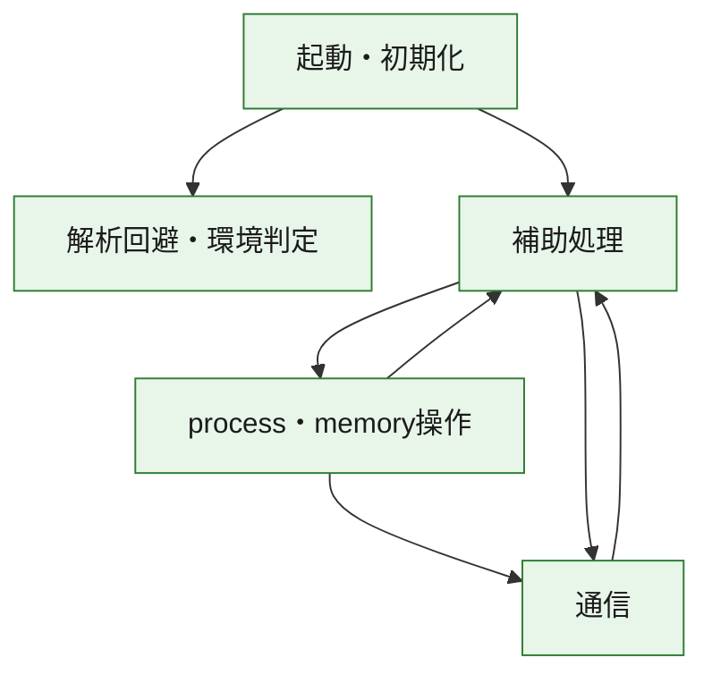
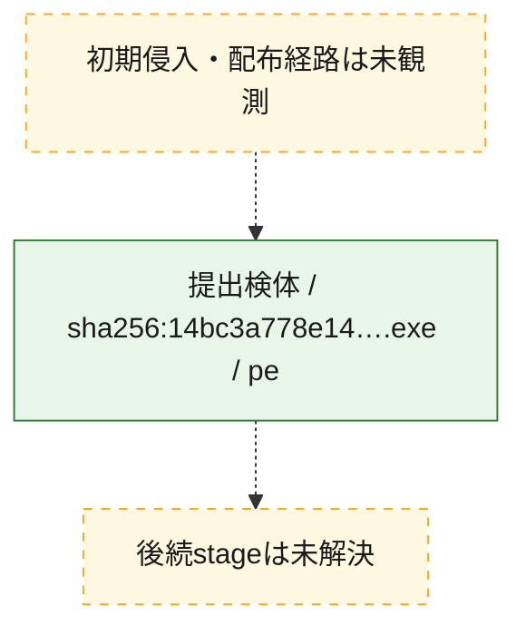
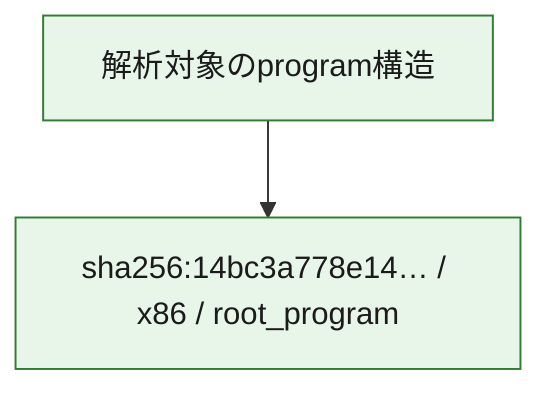

# 全体ロジック：14bc3a778e14a6eef9eaec220b8902af61f153efef037280a7ce21af47ddfc3f

代表関数の静的証跡から、起動・初期化、解析回避・環境判定、process・memory操作、通信の処理群を確認しました。

## 読み方

- phaseの掲載順は解析上の整理順です。observed_call_edgesがない段階間の実行順を断定しません。
- 図の実線は静的に観測した関係、点線と黄色のノードは未観測・未解決の関係を示します。
- 図は静的な要約であり、動的実行を再現するものではありません。
- 詳細な関数解説とfingerprintは[STATIC-LOGIC.md](STATIC-LOGIC.md)を参照してください。

## 静的可視化

### 実行フロー

### 感染チェーン

### モジュール関係

## 処理段階

### 1. 起動・初期化

entry pointから初期化と後続処理への移行を確認します。
確度: `confirmed_static_function_evidence`

- `14bc3a778e14a6eef9eaec220b8902af61f153efef037280a7ce21af47ddfc3f:ghidra:00402b07` — 初期化と主要処理への分岐を行う入口関数です。 状態: `succeeded`、選定理由: `call_graph_centrality:in=0,out=2`, `entry_point`, `meaningful_symbol_name`, `reviewed_call_centrality:2`, `role:entrypoint`, `small_program_complete_context`

### 2. 解析回避・環境判定

debugger、sandbox、仮想環境、時間差などの判定を確認します。
確度: `confirmed_static_function_evidence`

- `14bc3a778e14a6eef9eaec220b8902af61f153efef037280a7ce21af47ddfc3f:ghidra:00402e88` — debugger、仮想環境、sandbox、または時間差の確認に関係する関数です。 状態: `succeeded`、選定理由: `call_graph_centrality:in=1,out=5`, `reviewed_call_centrality:11`, `reviewed_call_centrality:6`, `role:anti_analysis`, `small_program_complete_context`

### 3. process・memory操作

process、thread、module、memory操作と実行移行を確認します。
確度: `confirmed_static_function_evidence`

- `14bc3a778e14a6eef9eaec220b8902af61f153efef037280a7ce21af47ddfc3f:ghidra:00402430` — process、thread、module、またはmemory操作に関係する関数です。 状態: `succeeded`、選定理由: `call_graph_centrality:in=0,out=17`, `large_function:instructions=155`, `reviewed_call_centrality:17`, `reviewed_call_centrality:26`, `role:process_or_memory_operation`, `small_program_complete_context`
- `14bc3a778e14a6eef9eaec220b8902af61f153efef037280a7ce21af47ddfc3f:ghidra:00402690` — process、thread、module、またはmemory操作に関係する関数です。 状態: `succeeded`、選定理由: `call_graph_centrality:in=1,out=12`, `large_function:instructions=68`, `reviewed_call_centrality:14`, `reviewed_call_centrality:23`, `role:process_or_memory_operation`, `small_program_complete_context`

### 4. 通信

通信初期化、endpoint処理、送受信の役割を確認します。
確度: `confirmed_static_function_evidence`

- `14bc3a778e14a6eef9eaec220b8902af61f153efef037280a7ce21af47ddfc3f:ghidra:004010d0` — 通信初期化、送受信、またはendpoint処理に関係する関数です。 状態: `succeeded`、選定理由: `call_graph_centrality:in=1,out=4`, `reviewed_call_centrality:5`, `reviewed_call_centrality:6`, `role:network_communication`, `small_program_complete_context`
- `14bc3a778e14a6eef9eaec220b8902af61f153efef037280a7ce21af47ddfc3f:ghidra:00401150` — 通信初期化、送受信、またはendpoint処理に関係する関数です。 状態: `succeeded`、選定理由: `call_graph_centrality:in=1,out=2`, `reviewed_call_centrality:3`, `reviewed_call_centrality:5`, `role:network_communication`, `small_program_complete_context`
- `14bc3a778e14a6eef9eaec220b8902af61f153efef037280a7ce21af47ddfc3f:ghidra:00401190` — 通信初期化、送受信、またはendpoint処理に関係する関数です。 状態: `succeeded`、選定理由: `call_graph_centrality:in=1,out=2`, `reviewed_call_centrality:4`, `role:network_communication`, `small_program_complete_context`
- `14bc3a778e14a6eef9eaec220b8902af61f153efef037280a7ce21af47ddfc3f:ghidra:00401470` — 通信初期化、送受信、またはendpoint処理に関係する関数です。 状態: `succeeded`、選定理由: `call_graph_centrality:in=2,out=2`, `reviewed_call_centrality:4`, `reviewed_call_centrality:6`, `role:network_communication`, `small_program_complete_context`
- `14bc3a778e14a6eef9eaec220b8902af61f153efef037280a7ce21af47ddfc3f:ghidra:00401710` — 通信初期化、送受信、またはendpoint処理に関係する関数です。 状態: `succeeded`、選定理由: `call_graph_centrality:in=1,out=4`, `reviewed_call_centrality:5`, `reviewed_call_centrality:8`, `role:network_communication`, `small_program_complete_context`
- `14bc3a778e14a6eef9eaec220b8902af61f153efef037280a7ce21af47ddfc3f:ghidra:00401790` — 通信初期化、送受信、またはendpoint処理に関係する関数です。 状態: `succeeded`、選定理由: `call_graph_centrality:in=1,out=4`, `reviewed_call_centrality:6`, `role:network_communication`, `small_program_complete_context`
- `14bc3a778e14a6eef9eaec220b8902af61f153efef037280a7ce21af47ddfc3f:ghidra:00401800` — 通信初期化、送受信、またはendpoint処理に関係する関数です。 状態: `succeeded`、選定理由: `call_graph_centrality:in=1,out=7`, `large_function:instructions=71`, `reviewed_call_centrality:13`, `reviewed_call_centrality:8`, `role:network_communication`, `small_program_complete_context`
- `14bc3a778e14a6eef9eaec220b8902af61f153efef037280a7ce21af47ddfc3f:ghidra:00401900` — 通信初期化、送受信、またはendpoint処理に関係する関数です。 状態: `succeeded`、選定理由: `call_graph_centrality:in=1,out=8`, `large_function:instructions=86`, `reviewed_call_centrality:16`, `reviewed_call_centrality:9`, `role:network_communication`, `small_program_complete_context`
- `14bc3a778e14a6eef9eaec220b8902af61f153efef037280a7ce21af47ddfc3f:ghidra:00401a10` — 通信初期化、送受信、またはendpoint処理に関係する関数です。 状態: `succeeded`、選定理由: `call_graph_centrality:in=1,out=20`, `large_function:instructions=595`, `reviewed_call_centrality:28`, `reviewed_call_centrality:29`, `role:network_communication`, `small_program_complete_context`

### 5. 補助処理

主要処理を支える一般内部関数またはlibrary処理を確認します。
確度: `confirmed_static_function_evidence`

- `14bc3a778e14a6eef9eaec220b8902af61f153efef037280a7ce21af47ddfc3f:ghidra:00401000` — 検体内部の一般処理を実装する関数です。 状態: `succeeded`、選定理由: `call_graph_centrality:in=1,out=1`, `reviewed_call_centrality:2`, `small_program_complete_context`
- `14bc3a778e14a6eef9eaec220b8902af61f153efef037280a7ce21af47ddfc3f:ghidra:00401030` — 検体内部の一般処理を実装する関数です。 状態: `succeeded`、選定理由: `call_graph_centrality:in=1,out=1`, `reviewed_call_centrality:2`, `small_program_complete_context`
- `14bc3a778e14a6eef9eaec220b8902af61f153efef037280a7ce21af47ddfc3f:ghidra:004011f0` — 検体内部の一般処理を実装する関数です。 状態: `succeeded`、選定理由: `call_graph_centrality:in=1,out=1`, `reviewed_call_centrality:2`, `reviewed_call_centrality:3`, `small_program_complete_context`
- `14bc3a778e14a6eef9eaec220b8902af61f153efef037280a7ce21af47ddfc3f:ghidra:00401260` — 検体内部の一般処理を実装する関数です。 状態: `succeeded`、選定理由: `call_graph_centrality:in=1,out=1`, `large_function:instructions=65`, `reviewed_call_centrality:3`, `small_program_complete_context`
- `14bc3a778e14a6eef9eaec220b8902af61f153efef037280a7ce21af47ddfc3f:ghidra:00401350` — 検体内部の一般処理を実装する関数です。 状態: `succeeded`、選定理由: `call_graph_centrality:in=1,out=4`, `reviewed_call_centrality:5`, `reviewed_call_centrality:6`, `small_program_complete_context`
- `14bc3a778e14a6eef9eaec220b8902af61f153efef037280a7ce21af47ddfc3f:ghidra:004013c0` — 検体内部の一般処理を実装する関数です。 状態: `succeeded`、選定理由: `call_graph_centrality:in=1,out=1`, `reviewed_call_centrality:2`, `small_program_complete_context`
- `14bc3a778e14a6eef9eaec220b8902af61f153efef037280a7ce21af47ddfc3f:ghidra:00401430` — 検体内部の一般処理を実装する関数です。 状態: `succeeded`、選定理由: `call_graph_centrality:in=2,out=0`, `reviewed_call_centrality:2`, `small_program_complete_context`
- `14bc3a778e14a6eef9eaec220b8902af61f153efef037280a7ce21af47ddfc3f:ghidra:004014c0` — 検体内部の一般処理を実装する関数です。 状態: `succeeded`、選定理由: `call_graph_centrality:in=1,out=5`, `large_function:instructions=156`, `reviewed_call_centrality:11`, `reviewed_call_centrality:6`, `small_program_complete_context`
- `14bc3a778e14a6eef9eaec220b8902af61f153efef037280a7ce21af47ddfc3f:ghidra:004018e0` — 検体内部の一般処理を実装する関数です。 状態: `succeeded`、選定理由: `call_graph_centrality:in=2,out=1`, `reviewed_call_centrality:3`, `small_program_complete_context`
- `14bc3a778e14a6eef9eaec220b8902af61f153efef037280a7ce21af47ddfc3f:ghidra:004022e0` — 検体内部の一般処理を実装する関数です。 状態: `succeeded`、選定理由: `call_graph_centrality:in=1,out=1`, `reviewed_call_centrality:2`, `small_program_complete_context`
- `14bc3a778e14a6eef9eaec220b8902af61f153efef037280a7ce21af47ddfc3f:ghidra:00402300` — 検体内部の一般処理を実装する関数です。 状態: `succeeded`、選定理由: `call_graph_centrality:in=0,out=12`, `large_function:instructions=77`, `reviewed_call_centrality:12`, `reviewed_call_centrality:14`, `small_program_complete_context`
- `14bc3a778e14a6eef9eaec220b8902af61f153efef037280a7ce21af47ddfc3f:ghidra:00402847` — 検体内部の一般処理を実装する関数です。 状態: `succeeded`、選定理由: `call_graph_centrality:in=1,out=14`, `large_function:instructions=136`, `reviewed_call_centrality:15`, `reviewed_call_centrality:22`, `small_program_complete_context`
- `14bc3a778e14a6eef9eaec220b8902af61f153efef037280a7ce21af47ddfc3f:ghidra:00402c80` — 検体内部の一般処理を実装する関数です。 状態: `succeeded`、選定理由: `call_graph_centrality:in=1,out=0`, `reviewed_call_centrality:1`, `small_program_complete_context`
- `14bc3a778e14a6eef9eaec220b8902af61f153efef037280a7ce21af47ddfc3f:ghidra:00402cc0` — 検体内部の一般処理を実装する関数です。 状態: `succeeded`、選定理由: `call_graph_centrality:in=1,out=0`, `reviewed_call_centrality:1`, `small_program_complete_context`
- `14bc3a778e14a6eef9eaec220b8902af61f153efef037280a7ce21af47ddfc3f:ghidra:00402d10` — 検体内部の一般処理を実装する関数です。 状態: `succeeded`、選定理由: `call_graph_centrality:in=1,out=2`, `reviewed_call_centrality:3`, `reviewed_call_centrality:4`, `small_program_complete_context`
- `14bc3a778e14a6eef9eaec220b8902af61f153efef037280a7ce21af47ddfc3f:ghidra:00402ddc` — 検体内部の一般処理を実装する関数です。 状態: `succeeded`、選定理由: `call_graph_centrality:in=1,out=0`, `reviewed_call_centrality:1`, `small_program_complete_context`
- `14bc3a778e14a6eef9eaec220b8902af61f153efef037280a7ce21af47ddfc3f:ghidra:00402e21` — compiler生成処理または汎用library処理とみられる関数です。 状態: `succeeded`、選定理由: `call_graph_centrality:in=1,out=0`, `meaningful_symbol_name`, `reviewed_call_centrality:1`, `small_program_complete_context`
- `14bc3a778e14a6eef9eaec220b8902af61f153efef037280a7ce21af47ddfc3f:ghidra:00402e35` — 検体内部の一般処理を実装する関数です。 状態: `succeeded`、選定理由: `call_graph_centrality:in=0,out=1`, `reviewed_call_centrality:1`, `small_program_complete_context`

## 観測したcall関係

- `14bc3a778e14a6eef9eaec220b8902af61f153efef037280a7ce21af47ddfc3f:ghidra:004010d0` → `14bc3a778e14a6eef9eaec220b8902af61f153efef037280a7ce21af47ddfc3f:ghidra:00401470` （`communication` → `communication`）
- `14bc3a778e14a6eef9eaec220b8902af61f153efef037280a7ce21af47ddfc3f:ghidra:00401190` → `14bc3a778e14a6eef9eaec220b8902af61f153efef037280a7ce21af47ddfc3f:ghidra:00401260` （`communication` → `support`）
- `14bc3a778e14a6eef9eaec220b8902af61f153efef037280a7ce21af47ddfc3f:ghidra:00401710` → `14bc3a778e14a6eef9eaec220b8902af61f153efef037280a7ce21af47ddfc3f:ghidra:00401470` （`communication` → `communication`）
- `14bc3a778e14a6eef9eaec220b8902af61f153efef037280a7ce21af47ddfc3f:ghidra:00401790` → `14bc3a778e14a6eef9eaec220b8902af61f153efef037280a7ce21af47ddfc3f:ghidra:00401710` （`communication` → `communication`）
- `14bc3a778e14a6eef9eaec220b8902af61f153efef037280a7ce21af47ddfc3f:ghidra:00401800` → `14bc3a778e14a6eef9eaec220b8902af61f153efef037280a7ce21af47ddfc3f:ghidra:00401430` （`communication` → `support`）
- `14bc3a778e14a6eef9eaec220b8902af61f153efef037280a7ce21af47ddfc3f:ghidra:00401800` → `14bc3a778e14a6eef9eaec220b8902af61f153efef037280a7ce21af47ddfc3f:ghidra:004018e0` （`communication` → `support`）
- `14bc3a778e14a6eef9eaec220b8902af61f153efef037280a7ce21af47ddfc3f:ghidra:00401a10` → `14bc3a778e14a6eef9eaec220b8902af61f153efef037280a7ce21af47ddfc3f:ghidra:004010d0` （`communication` → `communication`）
- `14bc3a778e14a6eef9eaec220b8902af61f153efef037280a7ce21af47ddfc3f:ghidra:00401a10` → `14bc3a778e14a6eef9eaec220b8902af61f153efef037280a7ce21af47ddfc3f:ghidra:00401150` （`communication` → `communication`）
- `14bc3a778e14a6eef9eaec220b8902af61f153efef037280a7ce21af47ddfc3f:ghidra:00401a10` → `14bc3a778e14a6eef9eaec220b8902af61f153efef037280a7ce21af47ddfc3f:ghidra:00401190` （`communication` → `communication`）
- `14bc3a778e14a6eef9eaec220b8902af61f153efef037280a7ce21af47ddfc3f:ghidra:00401a10` → `14bc3a778e14a6eef9eaec220b8902af61f153efef037280a7ce21af47ddfc3f:ghidra:004011f0` （`communication` → `support`）
- `14bc3a778e14a6eef9eaec220b8902af61f153efef037280a7ce21af47ddfc3f:ghidra:00401a10` → `14bc3a778e14a6eef9eaec220b8902af61f153efef037280a7ce21af47ddfc3f:ghidra:00401350` （`communication` → `support`）
- `14bc3a778e14a6eef9eaec220b8902af61f153efef037280a7ce21af47ddfc3f:ghidra:00401a10` → `14bc3a778e14a6eef9eaec220b8902af61f153efef037280a7ce21af47ddfc3f:ghidra:004013c0` （`communication` → `support`）
- `14bc3a778e14a6eef9eaec220b8902af61f153efef037280a7ce21af47ddfc3f:ghidra:00401a10` → `14bc3a778e14a6eef9eaec220b8902af61f153efef037280a7ce21af47ddfc3f:ghidra:004014c0` （`communication` → `support`）
- `14bc3a778e14a6eef9eaec220b8902af61f153efef037280a7ce21af47ddfc3f:ghidra:00401a10` → `14bc3a778e14a6eef9eaec220b8902af61f153efef037280a7ce21af47ddfc3f:ghidra:004022e0` （`communication` → `support`）
- `14bc3a778e14a6eef9eaec220b8902af61f153efef037280a7ce21af47ddfc3f:ghidra:00402300` → `14bc3a778e14a6eef9eaec220b8902af61f153efef037280a7ce21af47ddfc3f:ghidra:00401430` （`support` → `support`）
- `14bc3a778e14a6eef9eaec220b8902af61f153efef037280a7ce21af47ddfc3f:ghidra:00402300` → `14bc3a778e14a6eef9eaec220b8902af61f153efef037280a7ce21af47ddfc3f:ghidra:004018e0` （`support` → `support`）
- `14bc3a778e14a6eef9eaec220b8902af61f153efef037280a7ce21af47ddfc3f:ghidra:00402300` → `14bc3a778e14a6eef9eaec220b8902af61f153efef037280a7ce21af47ddfc3f:ghidra:00401a10` （`support` → `communication`）
- `14bc3a778e14a6eef9eaec220b8902af61f153efef037280a7ce21af47ddfc3f:ghidra:00402430` → `14bc3a778e14a6eef9eaec220b8902af61f153efef037280a7ce21af47ddfc3f:ghidra:00401000` （`execution` → `support`）
- `14bc3a778e14a6eef9eaec220b8902af61f153efef037280a7ce21af47ddfc3f:ghidra:00402430` → `14bc3a778e14a6eef9eaec220b8902af61f153efef037280a7ce21af47ddfc3f:ghidra:00401800` （`execution` → `communication`）
- `14bc3a778e14a6eef9eaec220b8902af61f153efef037280a7ce21af47ddfc3f:ghidra:00402430` → `14bc3a778e14a6eef9eaec220b8902af61f153efef037280a7ce21af47ddfc3f:ghidra:00401900` （`execution` → `communication`）
- `14bc3a778e14a6eef9eaec220b8902af61f153efef037280a7ce21af47ddfc3f:ghidra:00402690` → `14bc3a778e14a6eef9eaec220b8902af61f153efef037280a7ce21af47ddfc3f:ghidra:00401030` （`execution` → `support`）
- `14bc3a778e14a6eef9eaec220b8902af61f153efef037280a7ce21af47ddfc3f:ghidra:00402690` → `14bc3a778e14a6eef9eaec220b8902af61f153efef037280a7ce21af47ddfc3f:ghidra:00401790` （`execution` → `communication`）
- `14bc3a778e14a6eef9eaec220b8902af61f153efef037280a7ce21af47ddfc3f:ghidra:00402847` → `14bc3a778e14a6eef9eaec220b8902af61f153efef037280a7ce21af47ddfc3f:ghidra:00402690` （`support` → `execution`）
- `14bc3a778e14a6eef9eaec220b8902af61f153efef037280a7ce21af47ddfc3f:ghidra:00402847` → `14bc3a778e14a6eef9eaec220b8902af61f153efef037280a7ce21af47ddfc3f:ghidra:00402d10` （`support` → `support`）
- `14bc3a778e14a6eef9eaec220b8902af61f153efef037280a7ce21af47ddfc3f:ghidra:00402847` → `14bc3a778e14a6eef9eaec220b8902af61f153efef037280a7ce21af47ddfc3f:ghidra:00402ddc` （`support` → `support`）
- `14bc3a778e14a6eef9eaec220b8902af61f153efef037280a7ce21af47ddfc3f:ghidra:00402847` → `14bc3a778e14a6eef9eaec220b8902af61f153efef037280a7ce21af47ddfc3f:ghidra:00402e21` （`support` → `support`）
- `14bc3a778e14a6eef9eaec220b8902af61f153efef037280a7ce21af47ddfc3f:ghidra:00402b07` → `14bc3a778e14a6eef9eaec220b8902af61f153efef037280a7ce21af47ddfc3f:ghidra:00402847` （`startup` → `support`）
- `14bc3a778e14a6eef9eaec220b8902af61f153efef037280a7ce21af47ddfc3f:ghidra:00402b07` → `14bc3a778e14a6eef9eaec220b8902af61f153efef037280a7ce21af47ddfc3f:ghidra:00402e88` （`startup` → `evasion`）
- `14bc3a778e14a6eef9eaec220b8902af61f153efef037280a7ce21af47ddfc3f:ghidra:00402d10` → `14bc3a778e14a6eef9eaec220b8902af61f153efef037280a7ce21af47ddfc3f:ghidra:00402c80` （`support` → `support`）
- `14bc3a778e14a6eef9eaec220b8902af61f153efef037280a7ce21af47ddfc3f:ghidra:00402d10` → `14bc3a778e14a6eef9eaec220b8902af61f153efef037280a7ce21af47ddfc3f:ghidra:00402cc0` （`support` → `support`）
- `ghidra-function:010820c504a2ff5c1b05cc88` → `ghidra-function:162cf71385e58ca0d40e203d` （`unclassified` → `unclassified`）
- `ghidra-function:010820c504a2ff5c1b05cc88` → `ghidra-function:27188666dfd989efa6d20ad7` （`unclassified` → `unclassified`）
- `ghidra-function:010820c504a2ff5c1b05cc88` → `ghidra-function:3bd58a2b22694f22ac6f39de` （`unclassified` → `unclassified`）
- `ghidra-function:010820c504a2ff5c1b05cc88` → `ghidra-function:81b73742edcc5bfe6de75bfc` （`unclassified` → `unclassified`）
- `ghidra-function:010820c504a2ff5c1b05cc88` → `ghidra-function:c683b3716e79834445551b4a` （`unclassified` → `unclassified`）
- `ghidra-function:0234900de57915b9a4224c40` → `ghidra-function:e701a539f1cddf60ba2cbe25` （`unclassified` → `unclassified`）
- `ghidra-function:078e6aca9a83dca95c5005d8` → `ghidra-function:94965aa6b0774e565c663538` （`unclassified` → `unclassified`）
- `ghidra-function:1f3d50aec24c198f2904bde3` → `ghidra-function:0bf0c4890525c0a3058bfc19` （`unclassified` → `unclassified`）
- `ghidra-function:1f3d50aec24c198f2904bde3` → `ghidra-function:41c6af52b8aabf9bff8b4344` （`unclassified` → `unclassified`）
- `ghidra-function:1f3d50aec24c198f2904bde3` → `ghidra-function:6c5df0411c21b3565f110c29` （`unclassified` → `unclassified`）
- `ghidra-function:1f3d50aec24c198f2904bde3` → `ghidra-function:7fb1b2fbf686a5f8691fc112` （`unclassified` → `unclassified`）
- `ghidra-function:1f3d50aec24c198f2904bde3` → `ghidra-function:9098cdf20f17ec5b3f50a58a` （`unclassified` → `unclassified`）
- `ghidra-function:24148acd5a31973b38f03b2e` → `ghidra-external:e4170a5d8d9cf7428717134a` （`unclassified` → `unclassified`）
- `ghidra-function:24148acd5a31973b38f03b2e` → `ghidra-function:2bf732321a123d67ba2e80e7` （`unclassified` → `unclassified`）
- `ghidra-function:311d511c1b769df7bcab0532` → `ghidra-function:35a425fdd96380808ac9b9b7` （`unclassified` → `unclassified`）
- `ghidra-function:311d511c1b769df7bcab0532` → `ghidra-function:413b974f9f012731672c76f6` （`unclassified` → `unclassified`）
- `ghidra-function:311d511c1b769df7bcab0532` → `ghidra-function:416544e44b9cd33428c6f88d` （`unclassified` → `unclassified`）
- `ghidra-function:311d511c1b769df7bcab0532` → `ghidra-function:612e3f0400aabfb5d0e94375` （`unclassified` → `unclassified`）
- `ghidra-function:311d511c1b769df7bcab0532` → `ghidra-function:8472185f0f1a03099b8a6799` （`unclassified` → `unclassified`）
- `ghidra-function:311d511c1b769df7bcab0532` → `ghidra-function:9ed4e4809ea62b313f2935c4` （`unclassified` → `unclassified`）
- `ghidra-function:311d511c1b769df7bcab0532` → `ghidra-function:b55363ab90aba0bb69487d03` （`unclassified` → `unclassified`）
- `ghidra-function:311d511c1b769df7bcab0532` → `ghidra-function:c67ba77d823da79930570686` （`unclassified` → `unclassified`）
- `ghidra-function:311d511c1b769df7bcab0532` → `ghidra-function:d8da5abae507e4f3488e5706` （`unclassified` → `unclassified`）
- `ghidra-function:311d511c1b769df7bcab0532` → `ghidra-function:dff02aa5415e895c52642536` （`unclassified` → `unclassified`）
- `ghidra-function:311d511c1b769df7bcab0532` → `ghidra-function:e1384b6089691bc420095a01` （`unclassified` → `unclassified`）
- `ghidra-function:311d511c1b769df7bcab0532` → `ghidra-function:f876acbd916e43b4aaa2e51f` （`unclassified` → `unclassified`）
- `ghidra-function:311d511c1b769df7bcab0532` → `ghidra-function:f8e7154db4f4b9be21c5985c` （`unclassified` → `unclassified`）
- `ghidra-function:311d511c1b769df7bcab0532` → `ghidra-function:f95e87572bea07315dbac18c` （`unclassified` → `unclassified`）
- `ghidra-function:34441cb82bad7b896b62c7a7` → `ghidra-function:1d7818b2059c0ee694f55103` （`unclassified` → `unclassified`）
- `ghidra-function:34441cb82bad7b896b62c7a7` → `ghidra-function:e01ed6a9b00c5e782cd07861` （`unclassified` → `unclassified`）
- `ghidra-function:379a5a5bf57000410e1f5e41` → `ghidra-function:17318f95f00d6bbb6e030b2e` （`unclassified` → `unclassified`）
- `ghidra-function:379a5a5bf57000410e1f5e41` → `ghidra-function:87fbd029af826d2ce82a2982` （`unclassified` → `unclassified`）
- `ghidra-function:379a5a5bf57000410e1f5e41` → `ghidra-function:90a5804d4dfd353dab0fb986` （`unclassified` → `unclassified`）
- `ghidra-function:379a5a5bf57000410e1f5e41` → `ghidra-function:a0b0b2e999f4666468809dc6` （`unclassified` → `unclassified`）
- `ghidra-function:40088f3dd46d79ad768d6217` → `ghidra-function:41c6af52b8aabf9bff8b4344` （`unclassified` → `unclassified`）
- `ghidra-function:40088f3dd46d79ad768d6217` → `ghidra-function:94965aa6b0774e565c663538` （`unclassified` → `unclassified`）
- `ghidra-function:40088f3dd46d79ad768d6217` → `ghidra-function:d65393c1dc8596a2b8274e53` （`unclassified` → `unclassified`）
- `ghidra-function:40088f3dd46d79ad768d6217` → `ghidra-function:ef8b13b37bebee8f8b8b0215` （`unclassified` → `unclassified`）
- `ghidra-function:591e3ab3c057a2ab432e477f` → `ghidra-function:4a4dbc874964429ad2ca57c8` （`unclassified` → `unclassified`）
- `ghidra-function:591e3ab3c057a2ab432e477f` → `ghidra-function:700a3e83cb958db86da9bad6` （`unclassified` → `unclassified`）
- `ghidra-function:591e3ab3c057a2ab432e477f` → `ghidra-function:7220b23854623fa3565d3269` （`unclassified` → `unclassified`）
- `ghidra-function:591e3ab3c057a2ab432e477f` → `ghidra-function:7ddecb0d581a184a84664226` （`unclassified` → `unclassified`）
- `ghidra-function:591e3ab3c057a2ab432e477f` → `ghidra-function:81b73742edcc5bfe6de75bfc` （`unclassified` → `unclassified`）
- `ghidra-function:591e3ab3c057a2ab432e477f` → `ghidra-function:93f7f9cb5d6e689e9b45a07d` （`unclassified` → `unclassified`）
- `ghidra-function:591e3ab3c057a2ab432e477f` → `ghidra-function:fbdb8731b7e07221fdd65fdf` （`unclassified` → `unclassified`）
- `ghidra-function:6c5b61d00464ff00f80000a7` → `ghidra-function:00629332caecf53613edd3b9` （`unclassified` → `unclassified`）
- `ghidra-function:6c5b61d00464ff00f80000a7` → `ghidra-function:41c6af52b8aabf9bff8b4344` （`unclassified` → `unclassified`）
- `ghidra-function:6c5b61d00464ff00f80000a7` → `ghidra-function:700a3e83cb958db86da9bad6` （`unclassified` → `unclassified`）
- `ghidra-function:6c5b61d00464ff00f80000a7` → `ghidra-function:86895c5c47ae832b9d7eebbf` （`unclassified` → `unclassified`）
- `ghidra-function:6c5b61d00464ff00f80000a7` → `ghidra-function:8b9b285c3cd3ff5a04f70c89` （`unclassified` → `unclassified`）
- `ghidra-function:6c5b61d00464ff00f80000a7` → `ghidra-function:93f7f9cb5d6e689e9b45a07d` （`unclassified` → `unclassified`）
- `ghidra-function:6c5b61d00464ff00f80000a7` → `ghidra-function:94965aa6b0774e565c663538` （`unclassified` → `unclassified`）
- `ghidra-function:6c5b61d00464ff00f80000a7` → `ghidra-function:9d1e26326f7a21339eaf676f` （`unclassified` → `unclassified`）
- `ghidra-function:6c5b61d00464ff00f80000a7` → `ghidra-function:b2cbc502ff345f47243cb074` （`unclassified` → `unclassified`）
- `ghidra-function:6c5b61d00464ff00f80000a7` → `ghidra-function:bbf2acfbc739bdc4371d8876` （`unclassified` → `unclassified`）
- `ghidra-function:6c5b61d00464ff00f80000a7` → `ghidra-function:ef8b13b37bebee8f8b8b0215` （`unclassified` → `unclassified`）
- `ghidra-function:6c5b61d00464ff00f80000a7` → `ghidra-function:ff5227283aebff8fa96ff75e` （`unclassified` → `unclassified`）
- `ghidra-function:700a3e83cb958db86da9bad6` → `ghidra-function:59a69f1a0c38e856e37cb081` （`unclassified` → `unclassified`）
- `ghidra-function:87fbd029af826d2ce82a2982` → `ghidra-function:973cfa65f5865cae839d54d2` （`unclassified` → `unclassified`）
- `ghidra-function:87fbd029af826d2ce82a2982` → `ghidra-function:9d05bfed7934bd1b272766d7` （`unclassified` → `unclassified`）
- `ghidra-function:8a1bae080861d60110247699` → `ghidra-function:1f3d50aec24c198f2904bde3` （`unclassified` → `unclassified`）
- `ghidra-function:8a1bae080861d60110247699` → `ghidra-function:311d511c1b769df7bcab0532` （`unclassified` → `unclassified`）
- `ghidra-function:9a2e4f8789079a6706538d02` → `ghidra-function:078e6aca9a83dca95c5005d8` （`unclassified` → `unclassified`）
- `ghidra-function:9a2e4f8789079a6706538d02` → `ghidra-function:41c6af52b8aabf9bff8b4344` （`unclassified` → `unclassified`）
- `ghidra-function:9a2e4f8789079a6706538d02` → `ghidra-function:4690c2e74d5570ff629a1de2` （`unclassified` → `unclassified`）
- `ghidra-function:9a2e4f8789079a6706538d02` → `ghidra-function:58e18e57074d0476413df808` （`unclassified` → `unclassified`）
- `ghidra-function:9a2e4f8789079a6706538d02` → `ghidra-function:591e3ab3c057a2ab432e477f` （`unclassified` → `unclassified`）
- `ghidra-function:9a2e4f8789079a6706538d02` → `ghidra-function:6bb4927e63307fd5299d80bf` （`unclassified` → `unclassified`）
- `ghidra-function:9a2e4f8789079a6706538d02` → `ghidra-function:86895c5c47ae832b9d7eebbf` （`unclassified` → `unclassified`）
- `ghidra-function:9a2e4f8789079a6706538d02` → `ghidra-function:94965aa6b0774e565c663538` （`unclassified` → `unclassified`）
- `ghidra-function:9a2e4f8789079a6706538d02` → `ghidra-function:95e383663513d31244bd0b18` （`unclassified` → `unclassified`）
- `ghidra-function:9a2e4f8789079a6706538d02` → `ghidra-function:a5ca612175055b396b93a971` （`unclassified` → `unclassified`）
- `ghidra-function:9a2e4f8789079a6706538d02` → `ghidra-function:aaddaba019b5454002dff3a4` （`unclassified` → `unclassified`）
- `ghidra-function:9a2e4f8789079a6706538d02` → `ghidra-function:b2cbc502ff345f47243cb074` （`unclassified` → `unclassified`）
- `ghidra-function:9a2e4f8789079a6706538d02` → `ghidra-function:d0d081a96a81bfe1f379a177` （`unclassified` → `unclassified`）
- `ghidra-function:9a2e4f8789079a6706538d02` → `ghidra-function:ef8b13b37bebee8f8b8b0215` （`unclassified` → `unclassified`）
- `ghidra-function:9a2e4f8789079a6706538d02` → `ghidra-function:f8e7154db4f4b9be21c5985c` （`unclassified` → `unclassified`）
- `ghidra-function:9a2e4f8789079a6706538d02` → `ghidra-function:fc5a791b67167b1a2605c8c4` （`unclassified` → `unclassified`）
- `ghidra-function:9a2e4f8789079a6706538d02` → `ghidra-function:fc971f226cecfc938a05d2f2` （`unclassified` → `unclassified`）
- `ghidra-function:9d1e26326f7a21339eaf676f` → `ghidra-external:01b747d1b67804a8f6c094dc` （`unclassified` → `unclassified`）
- `ghidra-function:9d1e26326f7a21339eaf676f` → `ghidra-external:207f000f23a835db23379a64` （`unclassified` → `unclassified`）
- `ghidra-function:9d1e26326f7a21339eaf676f` → `ghidra-external:3f9484765cde52636127d4c3` （`unclassified` → `unclassified`）
- `ghidra-function:9d1e26326f7a21339eaf676f` → `ghidra-external:4384a7d082e53ad2a438b93a` （`unclassified` → `unclassified`）
- `ghidra-function:9d1e26326f7a21339eaf676f` → `ghidra-external:6b0c3f5079a2d3932a496c51` （`unclassified` → `unclassified`）
- `ghidra-function:9d1e26326f7a21339eaf676f` → `ghidra-external:d775240c5d64e7386f2d3ecb` （`unclassified` → `unclassified`）
- `ghidra-function:9d1e26326f7a21339eaf676f` → `ghidra-external:e4ca2c10c0683a625536a211` （`unclassified` → `unclassified`）
- `ghidra-function:9d1e26326f7a21339eaf676f` → `ghidra-function:010820c504a2ff5c1b05cc88` （`unclassified` → `unclassified`）
- `ghidra-function:9d1e26326f7a21339eaf676f` → `ghidra-function:17318f95f00d6bbb6e030b2e` （`unclassified` → `unclassified`）
- `ghidra-function:9d1e26326f7a21339eaf676f` → `ghidra-function:2b6293f35b9ddffca316d98f` （`unclassified` → `unclassified`）
- `ghidra-function:9d1e26326f7a21339eaf676f` → `ghidra-function:34441cb82bad7b896b62c7a7` （`unclassified` → `unclassified`）
- `ghidra-function:9d1e26326f7a21339eaf676f` → `ghidra-function:40088f3dd46d79ad768d6217` （`unclassified` → `unclassified`）
- `ghidra-function:9d1e26326f7a21339eaf676f` → `ghidra-function:4fc6d0022ca7701958641d41` （`unclassified` → `unclassified`）
- `ghidra-function:9d1e26326f7a21339eaf676f` → `ghidra-function:57e6ca304b477f35802e177c` （`unclassified` → `unclassified`）
- `ghidra-function:9d1e26326f7a21339eaf676f` → `ghidra-function:66df1152c2723bfab7563215` （`unclassified` → `unclassified`）
- `ghidra-function:9d1e26326f7a21339eaf676f` → `ghidra-function:81b73742edcc5bfe6de75bfc` （`unclassified` → `unclassified`）
- `ghidra-function:9d1e26326f7a21339eaf676f` → `ghidra-function:94965aa6b0774e565c663538` （`unclassified` → `unclassified`）
- `ghidra-function:9d1e26326f7a21339eaf676f` → `ghidra-function:a0b0b2e999f4666468809dc6` （`unclassified` → `unclassified`）
- `ghidra-function:9d1e26326f7a21339eaf676f` → `ghidra-function:a1c05ab0d973b463d15e9867` （`unclassified` → `unclassified`）
- `ghidra-function:9d1e26326f7a21339eaf676f` → `ghidra-function:b2cbc502ff345f47243cb074` （`unclassified` → `unclassified`）
- `ghidra-function:9d1e26326f7a21339eaf676f` → `ghidra-function:b3ba62ba0dd53dcecbf84262` （`unclassified` → `unclassified`）
- `ghidra-function:9d1e26326f7a21339eaf676f` → `ghidra-function:b6d1c7df8250a3935d10d71a` （`unclassified` → `unclassified`）
- `ghidra-function:9d1e26326f7a21339eaf676f` → `ghidra-function:c4af7381a1b03950181cbb1c` （`unclassified` → `unclassified`）
- `ghidra-function:9d1e26326f7a21339eaf676f` → `ghidra-function:d08efb2103af35cfa1fc7111` （`unclassified` → `unclassified`）
- `ghidra-function:9d1e26326f7a21339eaf676f` → `ghidra-function:dab1e97d3d586bb7453bbc46` （`unclassified` → `unclassified`）
- `ghidra-function:9d1e26326f7a21339eaf676f` → `ghidra-function:e963635697014908ac520935` （`unclassified` → `unclassified`）
- `ghidra-function:9d1e26326f7a21339eaf676f` → `ghidra-function:f8e7154db4f4b9be21c5985c` （`unclassified` → `unclassified`）
- `ghidra-function:a1c05ab0d973b463d15e9867` → `ghidra-function:94965aa6b0774e565c663538` （`unclassified` → `unclassified`）
- `ghidra-function:b6d1c7df8250a3935d10d71a` → `ghidra-external:01b747d1b67804a8f6c094dc` （`unclassified` → `unclassified`）
- `ghidra-function:b6d1c7df8250a3935d10d71a` → `ghidra-function:24148acd5a31973b38f03b2e` （`unclassified` → `unclassified`）
- `ghidra-function:b6d1c7df8250a3935d10d71a` → `ghidra-function:e9aab875ead04e8e695cac55` （`unclassified` → `unclassified`）
- `ghidra-function:c4af7381a1b03950181cbb1c` → `ghidra-function:785c917b89f5d501b57b6b9a` （`unclassified` → `unclassified`）
- `ghidra-function:c88415cd8a26a7be720f729c` → `ghidra-external:01b747d1b67804a8f6c094dc` （`unclassified` → `unclassified`）
- `ghidra-function:c88415cd8a26a7be720f729c` → `ghidra-function:34dce4bb6bbd9d51d272ced4` （`unclassified` → `unclassified`）
- `ghidra-function:c88415cd8a26a7be720f729c` → `ghidra-function:379a5a5bf57000410e1f5e41` （`unclassified` → `unclassified`）
- `ghidra-function:c88415cd8a26a7be720f729c` → `ghidra-function:b3ba62ba0dd53dcecbf84262` （`unclassified` → `unclassified`）
- `ghidra-function:c88415cd8a26a7be720f729c` → `ghidra-function:c88c9e5a6c7b853925916574` （`unclassified` → `unclassified`）
- `ghidra-function:cdecf0e1a14d97dfb1067339` → `ghidra-function:b3bc03091573f85023ef4f34` （`unclassified` → `unclassified`）
- `ghidra-function:d08efb2103af35cfa1fc7111` → `ghidra-function:7231aa5b5952dfb8e97eb84b` （`unclassified` → `unclassified`）
- `ghidra-function:d8da5abae507e4f3488e5706` → `ghidra-external:e4170a5d8d9cf7428717134a` （`unclassified` → `unclassified`）
- `ghidra-function:d8da5abae507e4f3488e5706` → `ghidra-function:0234900de57915b9a4224c40` （`unclassified` → `unclassified`）
- `ghidra-function:d8da5abae507e4f3488e5706` → `ghidra-function:1d0c83993c3204995d1ade4f` （`unclassified` → `unclassified`）
- `ghidra-function:d8da5abae507e4f3488e5706` → `ghidra-function:58e18e57074d0476413df808` （`unclassified` → `unclassified`）
- `ghidra-function:d8da5abae507e4f3488e5706` → `ghidra-function:6bb4927e63307fd5299d80bf` （`unclassified` → `unclassified`）
- `ghidra-function:d8da5abae507e4f3488e5706` → `ghidra-function:81b73742edcc5bfe6de75bfc` （`unclassified` → `unclassified`）
- `ghidra-function:d8da5abae507e4f3488e5706` → `ghidra-function:a5ca612175055b396b93a971` （`unclassified` → `unclassified`）
- `ghidra-function:d8da5abae507e4f3488e5706` → `ghidra-function:c666ee61a66812f1099e876f` （`unclassified` → `unclassified`）
- `ghidra-function:d8da5abae507e4f3488e5706` → `ghidra-function:c88415cd8a26a7be720f729c` （`unclassified` → `unclassified`）
- `ghidra-function:d8da5abae507e4f3488e5706` → `ghidra-function:e106ee506e49e1a09fa98883` （`unclassified` → `unclassified`）
- `ghidra-function:d8da5abae507e4f3488e5706` → `ghidra-function:f1e02eca5295a2dbf2083a47` （`unclassified` → `unclassified`）
- `ghidra-function:d8da5abae507e4f3488e5706` → `ghidra-function:f8e7154db4f4b9be21c5985c` （`unclassified` → `unclassified`）
- `ghidra-function:d8da5abae507e4f3488e5706` → `ghidra-function:fc5a791b67167b1a2605c8c4` （`unclassified` → `unclassified`）
- `ghidra-function:dab1e97d3d586bb7453bbc46` → `ghidra-function:34dce4bb6bbd9d51d272ced4` （`unclassified` → `unclassified`）
- `ghidra-function:dab1e97d3d586bb7453bbc46` → `ghidra-function:87fbd029af826d2ce82a2982` （`unclassified` → `unclassified`）
- `ghidra-function:dab1e97d3d586bb7453bbc46` → `ghidra-function:90a5804d4dfd353dab0fb986` （`unclassified` → `unclassified`）
- `ghidra-function:dab1e97d3d586bb7453bbc46` → `ghidra-function:c88c9e5a6c7b853925916574` （`unclassified` → `unclassified`）
- `ghidra-function:f95e87572bea07315dbac18c` → `ghidra-external:01b747d1b67804a8f6c094dc` （`unclassified` → `unclassified`）
- `ghidra-function:f95e87572bea07315dbac18c` → `ghidra-function:075a716f739e285e1672769c` （`unclassified` → `unclassified`）
- `ghidra-function:f95e87572bea07315dbac18c` → `ghidra-function:fd711962cef46ba4f44e4084` （`unclassified` → `unclassified`）
- `ghidra-function:fc971f226cecfc938a05d2f2` → `ghidra-function:1a0e405d521ab3cf4c3681ec` （`unclassified` → `unclassified`）
- `ghidra-function:fc971f226cecfc938a05d2f2` → `ghidra-function:2d4ae6dfa4b7dc03002026ee` （`unclassified` → `unclassified`）
- `ghidra-function:fc971f226cecfc938a05d2f2` → `ghidra-function:35f50eb6b5e73f19077f68ab` （`unclassified` → `unclassified`）
- `ghidra-function:fc971f226cecfc938a05d2f2` → `ghidra-function:3be57bdef322e7b5e322aec5` （`unclassified` → `unclassified`）
- `ghidra-function:fc971f226cecfc938a05d2f2` → `ghidra-function:4a4dbc874964429ad2ca57c8` （`unclassified` → `unclassified`）
- `ghidra-function:fc971f226cecfc938a05d2f2` → `ghidra-function:66df1152c2723bfab7563215` （`unclassified` → `unclassified`）
- `ghidra-function:fc971f226cecfc938a05d2f2` → `ghidra-function:c265355646d4af3a1d3b28c2` （`unclassified` → `unclassified`）
- `ghidra-function:fc971f226cecfc938a05d2f2` → `ghidra-function:fbdb8731b7e07221fdd65fdf` （`unclassified` → `unclassified`）

## 解析範囲と制約

- 選定外関数は全体inventoryへ残しますが、関数本体の個別解説対象にはしていません。
- indirect call、難読化、packer、VM、壊れたcontrol flowによりcall関係が欠落する場合があります。
- 文書は静的解析に基づき、検体実行や外部通信による動的確認は行っていません。
