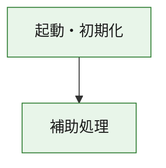
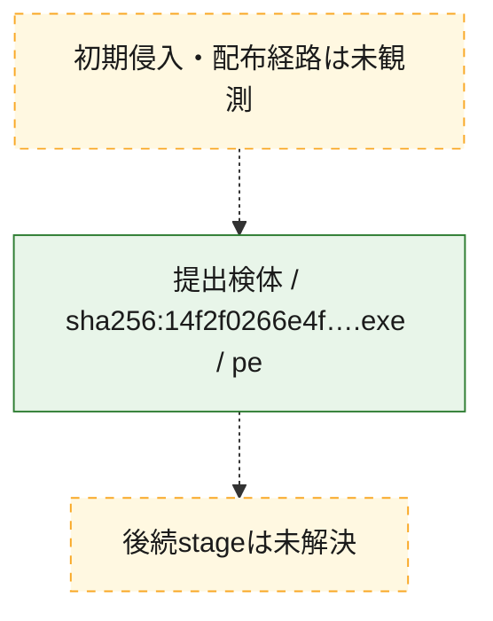
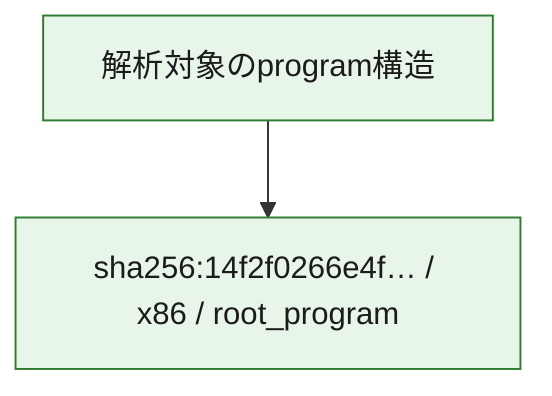

# 全体ロジック：14f2f0266e4f480e2a38bb3f5ac46fe9f3662a07c59a499378527b348cd40019

代表関数の静的証跡から、起動・初期化の処理群を確認しました。

## 読み方

- phaseの掲載順は解析上の整理順です。observed_call_edgesがない段階間の実行順を断定しません。
- 図の実線は静的に観測した関係、点線と黄色のノードは未観測・未解決の関係を示します。
- 図は静的な要約であり、動的実行を再現するものではありません。
- 詳細な関数解説とfingerprintは[STATIC-LOGIC.md](STATIC-LOGIC.md)を参照してください。

## 静的可視化

### 実行フロー

### 感染チェーン

### モジュール関係

## 処理段階

### 1. 起動・初期化

entry pointから初期化と後続処理への移行を確認します。
確度: `confirmed_static_function_evidence`

- `14f2f0266e4f480e2a38bb3f5ac46fe9f3662a07c59a499378527b348cd40019:ghidra:180001010` — 初期化と主要処理への分岐を行う入口関数です。 状態: `succeeded`、選定理由: `entry_point`, `meaningful_symbol_name`, `reviewed_call_centrality:22`, `role:entrypoint`, `small_program_complete_context`

### 2. 補助処理

主要処理を支える一般内部関数またはlibrary処理を確認します。
確度: `confirmed_static_function_evidence`

- `14f2f0266e4f480e2a38bb3f5ac46fe9f3662a07c59a499378527b348cd40019:ghidra:180001240` — 検体内部の一般処理を実装する関数です。 状態: `succeeded`、選定理由: `context_representative`, `reviewed_call_centrality:2`, `small_program_complete_context`
- `14f2f0266e4f480e2a38bb3f5ac46fe9f3662a07c59a499378527b348cd40019:ghidra:180001350` — 検体内部の一般処理を実装する関数です。 状態: `succeeded`、選定理由: `context_representative`, `reviewed_call_centrality:25`, `small_program_complete_context`
- `14f2f0266e4f480e2a38bb3f5ac46fe9f3662a07c59a499378527b348cd40019:ghidra:180003780` — 検体内部の一般処理を実装する関数です。 状態: `succeeded`、選定理由: `context_representative`, `reviewed_call_centrality:2`, `small_program_complete_context`
- `14f2f0266e4f480e2a38bb3f5ac46fe9f3662a07c59a499378527b348cd40019:ghidra:1800038e0` — 検体内部の一般処理を実装する関数です。 状態: `succeeded`、選定理由: `context_representative`, `reviewed_call_centrality:2`, `small_program_complete_context`

## 観測したcall関係

- `14f2f0266e4f480e2a38bb3f5ac46fe9f3662a07c59a499378527b348cd40019:ghidra:180001010` → `14f2f0266e4f480e2a38bb3f5ac46fe9f3662a07c59a499378527b348cd40019:ghidra:180001240` （`startup` → `support`）
- `14f2f0266e4f480e2a38bb3f5ac46fe9f3662a07c59a499378527b348cd40019:ghidra:180001010` → `14f2f0266e4f480e2a38bb3f5ac46fe9f3662a07c59a499378527b348cd40019:ghidra:180001350` （`startup` → `support`）
- `14f2f0266e4f480e2a38bb3f5ac46fe9f3662a07c59a499378527b348cd40019:ghidra:180001350` → `14f2f0266e4f480e2a38bb3f5ac46fe9f3662a07c59a499378527b348cd40019:ghidra:180001240` （`support` → `support`）
- `14f2f0266e4f480e2a38bb3f5ac46fe9f3662a07c59a499378527b348cd40019:ghidra:180001350` → `14f2f0266e4f480e2a38bb3f5ac46fe9f3662a07c59a499378527b348cd40019:ghidra:180003780` （`support` → `support`）
- `14f2f0266e4f480e2a38bb3f5ac46fe9f3662a07c59a499378527b348cd40019:ghidra:180001350` → `14f2f0266e4f480e2a38bb3f5ac46fe9f3662a07c59a499378527b348cd40019:ghidra:1800038e0` （`support` → `support`）
- `14f2f0266e4f480e2a38bb3f5ac46fe9f3662a07c59a499378527b348cd40019:ghidra:180003780` → `14f2f0266e4f480e2a38bb3f5ac46fe9f3662a07c59a499378527b348cd40019:ghidra:1800038e0` （`support` → `support`）
- `ghidra-function:2ce16537f7e6e34aadfcfcd1` → `ghidra-external:35c20bde305a96e76f160b88` （`unclassified` → `unclassified`）
- `ghidra-function:2ce16537f7e6e34aadfcfcd1` → `ghidra-external:3d6b6df79e22214eddcab062` （`unclassified` → `unclassified`）
- `ghidra-function:2ce16537f7e6e34aadfcfcd1` → `ghidra-external:47da5adc2bd0e2b4f2c38ee0` （`unclassified` → `unclassified`）
- `ghidra-function:2ce16537f7e6e34aadfcfcd1` → `ghidra-external:4eb9ed2ca91c5dd505412076` （`unclassified` → `unclassified`）
- `ghidra-function:2ce16537f7e6e34aadfcfcd1` → `ghidra-external:5f640338acc2f97e9d6eac5a` （`unclassified` → `unclassified`）
- `ghidra-function:2ce16537f7e6e34aadfcfcd1` → `ghidra-external:67530e8309a5a937e15b0709` （`unclassified` → `unclassified`）
- `ghidra-function:2ce16537f7e6e34aadfcfcd1` → `ghidra-external:743361f79959b77a8a66617c` （`unclassified` → `unclassified`）
- `ghidra-function:2ce16537f7e6e34aadfcfcd1` → `ghidra-external:7eba97887261aef8a2b22f91` （`unclassified` → `unclassified`）
- `ghidra-function:2ce16537f7e6e34aadfcfcd1` → `ghidra-external:7f71e8d38a9ce15fc839aecf` （`unclassified` → `unclassified`）
- `ghidra-function:2ce16537f7e6e34aadfcfcd1` → `ghidra-external:7fcea129a0bfcd032b07a839` （`unclassified` → `unclassified`）
- `ghidra-function:2ce16537f7e6e34aadfcfcd1` → `ghidra-external:96b58309aaf45f6524c40ddf` （`unclassified` → `unclassified`）
- `ghidra-function:2ce16537f7e6e34aadfcfcd1` → `ghidra-external:9a6924df64b8492b82449651` （`unclassified` → `unclassified`）
- `ghidra-function:2ce16537f7e6e34aadfcfcd1` → `ghidra-external:a7002febae1f4ea4eebbc4ed` （`unclassified` → `unclassified`）
- `ghidra-function:2ce16537f7e6e34aadfcfcd1` → `ghidra-external:b144a4b9c69287ff9447da76` （`unclassified` → `unclassified`）
- `ghidra-function:2ce16537f7e6e34aadfcfcd1` → `ghidra-external:b8d4f39a1ab1a512872d3bb5` （`unclassified` → `unclassified`）
- `ghidra-function:2ce16537f7e6e34aadfcfcd1` → `ghidra-external:ce6e61dffc141a338b1bee2f` （`unclassified` → `unclassified`）
- `ghidra-function:2ce16537f7e6e34aadfcfcd1` → `ghidra-external:d162c465bee21c372a1c04bc` （`unclassified` → `unclassified`）
- `ghidra-function:2ce16537f7e6e34aadfcfcd1` → `ghidra-external:d73cebf28f3f6d37f7a96e11` （`unclassified` → `unclassified`）
- `ghidra-function:2ce16537f7e6e34aadfcfcd1` → `ghidra-external:d9fe99c04f3ec78555612743` （`unclassified` → `unclassified`）
- `ghidra-function:2ce16537f7e6e34aadfcfcd1` → `ghidra-external:ddc627321be0f1bc452577c1` （`unclassified` → `unclassified`）
- `ghidra-function:2ce16537f7e6e34aadfcfcd1` → `ghidra-external:de9f609cfad7aef43f219324` （`unclassified` → `unclassified`）
- `ghidra-function:2ce16537f7e6e34aadfcfcd1` → `ghidra-function:3e6ffe2dfcb26131758df855` （`unclassified` → `unclassified`）
- `ghidra-function:2ce16537f7e6e34aadfcfcd1` → `ghidra-function:62865d8546cfd5a8605f0e12` （`unclassified` → `unclassified`）
- `ghidra-function:2ce16537f7e6e34aadfcfcd1` → `ghidra-function:f54d511a2ffd078ae838ab61` （`unclassified` → `unclassified`）
- `ghidra-function:ce319cf5f405b9409e4f2f9a` → `ghidra-function:2ce16537f7e6e34aadfcfcd1` （`unclassified` → `unclassified`）
- `ghidra-function:ce319cf5f405b9409e4f2f9a` → `ghidra-function:50fff038113c2a01967b413c` （`unclassified` → `unclassified`）
- `ghidra-function:ce319cf5f405b9409e4f2f9a` → `ghidra-function:5cae3502f62e18d9329df8e7` （`unclassified` → `unclassified`）
- `ghidra-function:ce319cf5f405b9409e4f2f9a` → `ghidra-function:5d79b15ecb2ad0a56808a117` （`unclassified` → `unclassified`）
- `ghidra-function:ce319cf5f405b9409e4f2f9a` → `ghidra-function:62865d8546cfd5a8605f0e12` （`unclassified` → `unclassified`）
- `ghidra-function:ce319cf5f405b9409e4f2f9a` → `ghidra-function:6f091ef477d65f9fee5767ca` （`unclassified` → `unclassified`）
- `ghidra-function:ce319cf5f405b9409e4f2f9a` → `ghidra-function:75e168150250ea8900200e5b` （`unclassified` → `unclassified`）
- `ghidra-function:ce319cf5f405b9409e4f2f9a` → `ghidra-function:7d326d29890498cc3a47e05a` （`unclassified` → `unclassified`）
- `ghidra-function:ce319cf5f405b9409e4f2f9a` → `ghidra-function:92221fdfb9afc6aed907bf11` （`unclassified` → `unclassified`）
- `ghidra-function:ce319cf5f405b9409e4f2f9a` → `ghidra-function:babb064e3e002abb76585075` （`unclassified` → `unclassified`）
- `ghidra-function:ce319cf5f405b9409e4f2f9a` → `ghidra-function:bd1a52bcab9476d4a7b6eeb8` （`unclassified` → `unclassified`）
- `ghidra-function:ce319cf5f405b9409e4f2f9a` → `ghidra-function:da2cf13dbfc5dba171036a98` （`unclassified` → `unclassified`）
- `ghidra-function:f54d511a2ffd078ae838ab61` → `ghidra-function:3e6ffe2dfcb26131758df855` （`unclassified` → `unclassified`）

## 解析範囲と制約

- 選定外関数は全体inventoryへ残しますが、関数本体の個別解説対象にはしていません。
- indirect call、難読化、packer、VM、壊れたcontrol flowによりcall関係が欠落する場合があります。
- 文書は静的解析に基づき、検体実行や外部通信による動的確認は行っていません。
