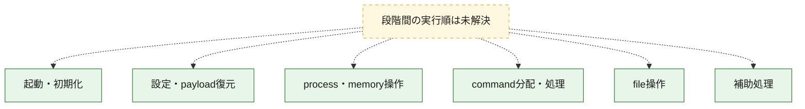
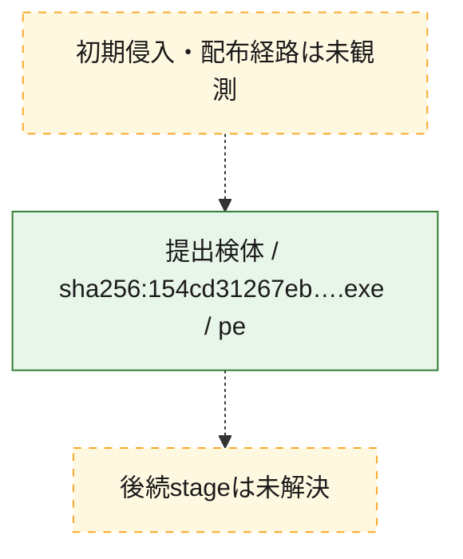
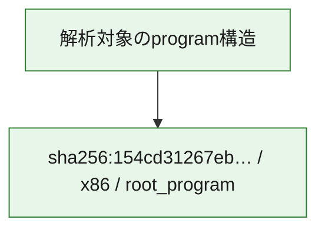

# 全体ロジック：154cd31267eb00894463d732adbf1000e22a965dd6ac04c92d258d4dd62cb067

代表関数の静的証跡から、起動・初期化、設定・payload復元、process・memory操作、command分配・処理、file操作の処理群を確認しました。

## 読み方

- phaseの掲載順は解析上の整理順です。observed_call_edgesがない段階間の実行順を断定しません。
- 図の実線は静的に観測した関係、点線と黄色のノードは未観測・未解決の関係を示します。
- 図は静的な要約であり、動的実行を再現するものではありません。
- 詳細な関数解説とfingerprintは[STATIC-LOGIC.md](STATIC-LOGIC.md)を参照してください。

## 静的可視化

### 実行フロー

### 感染チェーン

### モジュール関係

## 処理段階

### 1. 起動・初期化

entry pointから初期化と後続処理への移行を確認します。
確度: `confirmed_static_function_evidence`

- `154cd31267eb00894463d732adbf1000e22a965dd6ac04c92d258d4dd62cb067:ghidra:00401532` — 初期化と主要処理への分岐を行う入口関数です。 状態: `succeeded`、選定理由: `call_graph_centrality:in=0,out=2`, `entry_point`, `meaningful_symbol_name`, `reviewed_call_centrality:2`, `role:entrypoint`

### 2. 設定・payload復元

設定、resource、payload、暗号化データの復元・変換を確認します。
確度: `confirmed_static_function_evidence`

- `154cd31267eb00894463d732adbf1000e22a965dd6ac04c92d258d4dd62cb067:ghidra:0040a8f0` — 設定、resource、payloadなどの解析・変換を行う関数です。 状態: `succeeded`、選定理由: `call_graph_centrality:in=1,out=1`, `reviewed_call_centrality:2`, `reviewed_call_centrality:3`, `role:config_or_data_transform`

### 3. process・memory操作

process、thread、module、memory操作と実行移行を確認します。
確度: `confirmed_static_function_evidence`

- `154cd31267eb00894463d732adbf1000e22a965dd6ac04c92d258d4dd62cb067:ghidra:00408d8b` — process、thread、module、またはmemory操作に関係する関数です。 状態: `succeeded`、選定理由: `call_graph_centrality:in=8,out=27`, `large_function:instructions=297`, `reviewed_call_centrality:35`, `reviewed_call_centrality:42`, `role:process_or_memory_operation`

### 4. command分配・処理

受信commandやtaskの解釈、分配、個別handlerへの移行を確認します。
確度: `confirmed_static_function_evidence_with_limits`

- `154cd31267eb00894463d732adbf1000e22a965dd6ac04c92d258d4dd62cb067:ghidra:00402ec0` — commandの解釈、分配、または個別処理を担当する関数です。 状態: `limited_bad_instruction_or_flow`、選定理由: `call_graph_centrality:in=1,out=1`, `meaningful_symbol_name`, `reviewed_call_centrality:2`, `role:command_dispatch_or_handler`
- `154cd31267eb00894463d732adbf1000e22a965dd6ac04c92d258d4dd62cb067:ghidra:0040ab5e` — commandの解釈、分配、または個別処理を担当する関数です。 状態: `limited_bad_instruction_or_flow`、選定理由: `call_graph_centrality:in=0,out=4`, `meaningful_symbol_name`, `reviewed_call_centrality:4`, `reviewed_call_centrality:6`, `role:command_dispatch_or_handler`
- `154cd31267eb00894463d732adbf1000e22a965dd6ac04c92d258d4dd62cb067:ghidra:0040abfd` — commandの解釈、分配、または個別処理を担当する関数です。 状態: `succeeded`、選定理由: `call_graph_centrality:in=0,out=1`, `meaningful_symbol_name`, `reviewed_call_centrality:1`, `reviewed_call_centrality:2`, `role:command_dispatch_or_handler`
- `154cd31267eb00894463d732adbf1000e22a965dd6ac04c92d258d4dd62cb067:ghidra:0040ac33` — commandの解釈、分配、または個別処理を担当する関数です。 状態: `succeeded`、選定理由: `call_graph_centrality:in=0,out=1`, `meaningful_symbol_name`, `reviewed_call_centrality:1`, `reviewed_call_centrality:2`, `role:command_dispatch_or_handler`
- `154cd31267eb00894463d732adbf1000e22a965dd6ac04c92d258d4dd62cb067:ghidra:0040ac69` — commandの解釈、分配、または個別処理を担当する関数です。 状態: `succeeded`、選定理由: `call_graph_centrality:in=0,out=1`, `meaningful_symbol_name`, `reviewed_call_centrality:1`, `reviewed_call_centrality:2`, `role:command_dispatch_or_handler`
- `154cd31267eb00894463d732adbf1000e22a965dd6ac04c92d258d4dd62cb067:ghidra:0040b382` — commandの解釈、分配、または個別処理を担当する関数です。 状態: `succeeded`、選定理由: `call_graph_centrality:in=1,out=5`, `meaningful_symbol_name`, `reviewed_call_centrality:6`, `reviewed_call_centrality:8`, `role:command_dispatch_or_handler`
- `154cd31267eb00894463d732adbf1000e22a965dd6ac04c92d258d4dd62cb067:ghidra:0040b41b` — commandの解釈、分配、または個別処理を担当する関数です。 状態: `succeeded`、選定理由: `call_graph_centrality:in=2,out=6`, `meaningful_symbol_name`, `reviewed_call_centrality:10`, `reviewed_call_centrality:8`, `role:command_dispatch_or_handler`
- `154cd31267eb00894463d732adbf1000e22a965dd6ac04c92d258d4dd62cb067:ghidra:0040b49b` — commandの解釈、分配、または個別処理を担当する関数です。 状態: `succeeded`、選定理由: `call_graph_centrality:in=1,out=17`, `large_function:instructions=302`, `reviewed_call_centrality:18`, `reviewed_call_centrality:22`, `role:command_dispatch_or_handler`
- `154cd31267eb00894463d732adbf1000e22a965dd6ac04c92d258d4dd62cb067:ghidra:0040b840` — commandの解釈、分配、または個別処理を担当する関数です。 状態: `succeeded`、選定理由: `call_graph_centrality:in=1,out=5`, `large_function:instructions=111`, `reviewed_call_centrality:6`, `reviewed_call_centrality:7`, `role:command_dispatch_or_handler`
- `154cd31267eb00894463d732adbf1000e22a965dd6ac04c92d258d4dd62cb067:ghidra:0040bb06` — commandの解釈、分配、または個別処理を担当する関数です。 状態: `succeeded`、選定理由: `call_graph_centrality:in=5,out=1`, `reviewed_call_centrality:6`, `role:command_dispatch_or_handler`
- `154cd31267eb00894463d732adbf1000e22a965dd6ac04c92d258d4dd62cb067:ghidra:0040bf69` — commandの解釈、分配、または個別処理を担当する関数です。 状態: `succeeded`、選定理由: `call_graph_centrality:in=3,out=7`, `reviewed_call_centrality:10`, `reviewed_call_centrality:13`, `role:command_dispatch_or_handler`, `role:config_or_data_transform`

### 5. file操作

fileやdirectoryの作成、読書き、削除を確認します。
確度: `confirmed_static_function_evidence`

- `154cd31267eb00894463d732adbf1000e22a965dd6ac04c92d258d4dd62cb067:ghidra:0040a4c6` — fileまたはdirectoryの読書き・管理に関係する関数です。 状態: `succeeded`、選定理由: `call_graph_centrality:in=0,out=1`, `reviewed_call_centrality:1`, `reviewed_call_centrality:4`, `role:file_operation`
- `154cd31267eb00894463d732adbf1000e22a965dd6ac04c92d258d4dd62cb067:ghidra:0040a522` — fileまたはdirectoryの読書き・管理に関係する関数です。 状態: `succeeded`、選定理由: `call_graph_centrality:in=5,out=1`, `large_function:instructions=67`, `reviewed_call_centrality:6`, `reviewed_call_centrality:9`, `role:file_operation`
- `154cd31267eb00894463d732adbf1000e22a965dd6ac04c92d258d4dd62cb067:ghidra:0040a5c2` — fileまたはdirectoryの読書き・管理に関係する関数です。 状態: `succeeded`、選定理由: `call_graph_centrality:in=0,out=1`, `meaningful_symbol_name`, `reviewed_call_centrality:1`, `reviewed_call_centrality:3`, `role:file_operation`
- `154cd31267eb00894463d732adbf1000e22a965dd6ac04c92d258d4dd62cb067:ghidra:0040a612` — fileまたはdirectoryの読書き・管理に関係する関数です。 状態: `succeeded`、選定理由: `call_graph_centrality:in=0,out=1`, `reviewed_call_centrality:1`, `reviewed_call_centrality:4`, `role:file_operation`
- `154cd31267eb00894463d732adbf1000e22a965dd6ac04c92d258d4dd62cb067:ghidra:0040a676` — fileまたはdirectoryの読書き・管理に関係する関数です。 状態: `succeeded`、選定理由: `call_graph_centrality:in=4,out=1`, `meaningful_symbol_name`, `reviewed_call_centrality:5`, `role:file_operation`

### 6. 補助処理

主要処理を支える一般内部関数またはlibrary処理を確認します。
確度: `confirmed_static_function_evidence`

- `154cd31267eb00894463d732adbf1000e22a965dd6ac04c92d258d4dd62cb067:ghidra:0040135f` — compiler生成処理または汎用library処理とみられる関数です。 状態: `succeeded`、選定理由: `call_graph_centrality:in=1,out=18`, `large_function:instructions=110`, `meaningful_symbol_name`, `reviewed_call_centrality:19`, `reviewed_call_centrality:22`
- `154cd31267eb00894463d732adbf1000e22a965dd6ac04c92d258d4dd62cb067:ghidra:004037bd` — 検体内部の一般処理を実装する関数です。 状態: `succeeded`、選定理由: `call_graph_centrality:in=23,out=1`, `meaningful_symbol_name`, `reviewed_call_centrality:24`, `reviewed_call_centrality:25`
- `154cd31267eb00894463d732adbf1000e22a965dd6ac04c92d258d4dd62cb067:ghidra:0040385d` — 検体内部の一般処理を実装する関数です。 状態: `succeeded`、選定理由: `call_graph_centrality:in=37,out=1`, `meaningful_symbol_name`, `reviewed_call_centrality:38`, `reviewed_call_centrality:41`
- `154cd31267eb00894463d732adbf1000e22a965dd6ac04c92d258d4dd62cb067:ghidra:00403c40` — 検体内部の一般処理を実装する関数です。 状態: `succeeded`、選定理由: `call_graph_centrality:in=24,out=1`, `meaningful_symbol_name`, `reviewed_call_centrality:25`
- `154cd31267eb00894463d732adbf1000e22a965dd6ac04c92d258d4dd62cb067:ghidra:00403d3a` — 検体内部の一般処理を実装する関数です。 状態: `succeeded`、選定理由: `call_graph_centrality:in=24,out=3`, `meaningful_symbol_name`, `reviewed_call_centrality:27`
- `154cd31267eb00894463d732adbf1000e22a965dd6ac04c92d258d4dd62cb067:ghidra:00403d91` — 検体内部の一般処理を実装する関数です。 状態: `succeeded`、選定理由: `call_graph_centrality:in=18,out=3`, `meaningful_symbol_name`, `reviewed_call_centrality:21`, `reviewed_call_centrality:22`
- `154cd31267eb00894463d732adbf1000e22a965dd6ac04c92d258d4dd62cb067:ghidra:00403f7c` — 検体内部の一般処理を実装する関数です。 状態: `succeeded`、選定理由: `call_graph_centrality:in=1,out=27`, `large_function:instructions=1201`, `reviewed_call_centrality:28`, `reviewed_call_centrality:34`
- `154cd31267eb00894463d732adbf1000e22a965dd6ac04c92d258d4dd62cb067:ghidra:004053f7` — 検体内部の一般処理を実装する関数です。 状態: `succeeded`、選定理由: `call_graph_centrality:in=4,out=14`, `large_function:instructions=359`, `reviewed_call_centrality:18`, `reviewed_call_centrality:19`
- `154cd31267eb00894463d732adbf1000e22a965dd6ac04c92d258d4dd62cb067:ghidra:00405b0e` — 検体内部の一般処理を実装する関数です。 状態: `succeeded`、選定理由: `call_graph_centrality:in=5,out=20`, `large_function:instructions=578`, `reviewed_call_centrality:25`, `reviewed_call_centrality:29`
- `154cd31267eb00894463d732adbf1000e22a965dd6ac04c92d258d4dd62cb067:ghidra:00406c8c` — 検体内部の一般処理を実装する関数です。 状態: `succeeded`、選定理由: `call_graph_centrality:in=2,out=18`, `large_function:instructions=332`, `reviewed_call_centrality:20`, `reviewed_call_centrality:24`
- `154cd31267eb00894463d732adbf1000e22a965dd6ac04c92d258d4dd62cb067:ghidra:00407170` — 検体内部の一般処理を実装する関数です。 状態: `succeeded`、選定理由: `call_graph_centrality:in=28,out=1`, `meaningful_symbol_name`, `reviewed_call_centrality:29`, `reviewed_call_centrality:30`
- `154cd31267eb00894463d732adbf1000e22a965dd6ac04c92d258d4dd62cb067:ghidra:0040729c` — 検体内部の一般処理を実装する関数です。 状態: `succeeded`、選定理由: `call_graph_centrality:in=4,out=31`, `large_function:instructions=673`, `reviewed_call_centrality:35`, `reviewed_call_centrality:45`
- `154cd31267eb00894463d732adbf1000e22a965dd6ac04c92d258d4dd62cb067:ghidra:00408284` — 検体内部の一般処理を実装する関数です。 状態: `succeeded`、選定理由: `call_graph_centrality:in=7,out=14`, `large_function:instructions=305`, `reviewed_call_centrality:21`, `reviewed_call_centrality:23`

## 観測したcall関係

- 代表関数間で直接解決できた呼出関係はありません。

## 解析範囲と制約

- 選定外関数は全体inventoryへ残しますが、関数本体の個別解説対象にはしていません。
- indirect call、難読化、packer、VM、壊れたcontrol flowによりcall関係が欠落する場合があります。
- 文書は静的解析に基づき、検体実行や外部通信による動的確認は行っていません。
