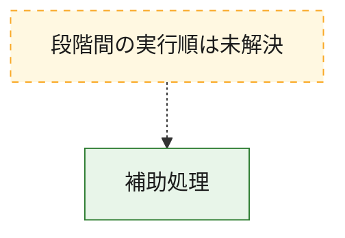
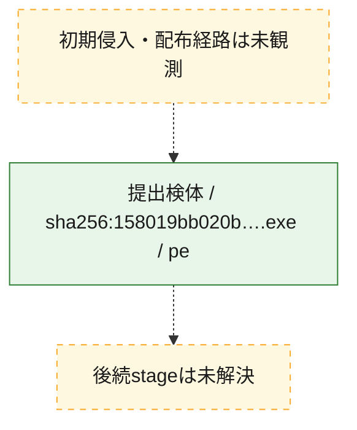
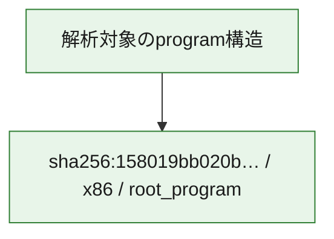

# 全体ロジック：158019bb020b4efa9df745c86046fe117474d3662b9a5506cd1394d4fb97a30c

代表関数から主要なmalware処理段階を自動分類できませんでした。

## 読み方

- phaseの掲載順は解析上の整理順です。observed_call_edgesがない段階間の実行順を断定しません。
- 図の実線は静的に観測した関係、点線と黄色のノードは未観測・未解決の関係を示します。
- 図は静的な要約であり、動的実行を再現するものではありません。
- 詳細な関数解説とfingerprintは[STATIC-LOGIC.md](STATIC-LOGIC.md)を参照してください。

## 静的可視化

### 実行フロー

### 感染チェーン

### モジュール関係

## 処理段階

### 1. 補助処理

主要処理を支える一般内部関数またはlibrary処理を確認します。
確度: `confirmed_static_function_evidence_with_limits`

- `158019bb020b4efa9df745c86046fe117474d3662b9a5506cd1394d4fb97a30c:ghidra:140004290` — 検体内部の一般処理を実装する関数です。 状態: `limited_bad_instruction_or_flow`、選定理由: `context_representative`, `reviewed_call_centrality:1`
- `158019bb020b4efa9df745c86046fe117474d3662b9a5506cd1394d4fb97a30c:ghidra:140004314` — 検体内部の一般処理を実装する関数です。 状態: `limited_bad_instruction_or_flow`、選定理由: `context_representative`, `reviewed_call_centrality:1`
- `158019bb020b4efa9df745c86046fe117474d3662b9a5506cd1394d4fb97a30c:ghidra:140004368` — 検体内部の一般処理を実装する関数です。 状態: `limited_bad_instruction_or_flow`、選定理由: `context_representative`, `reviewed_call_centrality:1`
- `158019bb020b4efa9df745c86046fe117474d3662b9a5506cd1394d4fb97a30c:ghidra:140004390` — 検体内部の一般処理を実装する関数です。 状態: `limited_bad_instruction_or_flow`、選定理由: `context_representative`, `reviewed_call_centrality:1`
- `158019bb020b4efa9df745c86046fe117474d3662b9a5506cd1394d4fb97a30c:ghidra:1400043b8` — 検体内部の一般処理を実装する関数です。 状態: `limited_bad_instruction_or_flow`、選定理由: `context_representative`, `reviewed_call_centrality:1`
- `158019bb020b4efa9df745c86046fe117474d3662b9a5506cd1394d4fb97a30c:ghidra:140004418` — 検体内部の一般処理を実装する関数です。 状態: `limited_bad_instruction_or_flow`、選定理由: `context_representative`, `reviewed_call_centrality:1`
- `158019bb020b4efa9df745c86046fe117474d3662b9a5506cd1394d4fb97a30c:ghidra:140004464` — 検体内部の一般処理を実装する関数です。 状態: `limited_bad_instruction_or_flow`、選定理由: `context_representative`, `reviewed_call_centrality:1`
- `158019bb020b4efa9df745c86046fe117474d3662b9a5506cd1394d4fb97a30c:ghidra:1400044e8` — 検体内部の一般処理を実装する関数です。 状態: `limited_bad_instruction_or_flow`、選定理由: `context_representative`, `reviewed_call_centrality:1`
- `158019bb020b4efa9df745c86046fe117474d3662b9a5506cd1394d4fb97a30c:ghidra:140004560` — 検体内部の一般処理を実装する関数です。 状態: `limited_bad_instruction_or_flow`、選定理由: `context_representative`, `reviewed_call_centrality:1`
- `158019bb020b4efa9df745c86046fe117474d3662b9a5506cd1394d4fb97a30c:ghidra:1400045cc` — 検体内部の一般処理を実装する関数です。 状態: `limited_bad_instruction_or_flow`、選定理由: `context_representative`, `reviewed_call_centrality:1`
- `158019bb020b4efa9df745c86046fe117474d3662b9a5506cd1394d4fb97a30c:ghidra:1400046f8` — 検体内部の一般処理を実装する関数です。 状態: `limited_bad_instruction_or_flow`、選定理由: `context_representative`, `reviewed_call_centrality:1`
- `158019bb020b4efa9df745c86046fe117474d3662b9a5506cd1394d4fb97a30c:ghidra:140004824` — 検体内部の一般処理を実装する関数です。 状態: `limited_bad_instruction_or_flow`、選定理由: `context_representative`, `reviewed_call_centrality:1`
- `158019bb020b4efa9df745c86046fe117474d3662b9a5506cd1394d4fb97a30c:ghidra:1400048c4` — 検体内部の一般処理を実装する関数です。 状態: `limited_bad_instruction_or_flow`、選定理由: `context_representative`, `reviewed_call_centrality:1`
- `158019bb020b4efa9df745c86046fe117474d3662b9a5506cd1394d4fb97a30c:ghidra:140004940` — 検体内部の一般処理を実装する関数です。 状態: `limited_bad_instruction_or_flow`、選定理由: `context_representative`, `reviewed_call_centrality:1`
- `158019bb020b4efa9df745c86046fe117474d3662b9a5506cd1394d4fb97a30c:ghidra:1400049b8` — 検体内部の一般処理を実装する関数です。 状態: `limited_bad_instruction_or_flow`、選定理由: `context_representative`, `reviewed_call_centrality:1`
- `158019bb020b4efa9df745c86046fe117474d3662b9a5506cd1394d4fb97a30c:ghidra:140004a40` — 検体内部の一般処理を実装する関数です。 状態: `limited_bad_instruction_or_flow`、選定理由: `context_representative`, `reviewed_call_centrality:1`
- `158019bb020b4efa9df745c86046fe117474d3662b9a5506cd1394d4fb97a30c:ghidra:140004ac8` — 検体内部の一般処理を実装する関数です。 状態: `limited_bad_instruction_or_flow`、選定理由: `context_representative`, `reviewed_call_centrality:1`
- `158019bb020b4efa9df745c86046fe117474d3662b9a5506cd1394d4fb97a30c:ghidra:140004ae0` — 検体内部の一般処理を実装する関数です。 状態: `limited_bad_instruction_or_flow`、選定理由: `context_representative`, `reviewed_call_centrality:1`
- `158019bb020b4efa9df745c86046fe117474d3662b9a5506cd1394d4fb97a30c:ghidra:140004b80` — 検体内部の一般処理を実装する関数です。 状態: `limited_bad_instruction_or_flow`、選定理由: `context_representative`, `reviewed_call_centrality:1`
- `158019bb020b4efa9df745c86046fe117474d3662b9a5506cd1394d4fb97a30c:ghidra:140004c08` — 検体内部の一般処理を実装する関数です。 状態: `limited_bad_instruction_or_flow`、選定理由: `context_representative`, `reviewed_call_centrality:1`
- `158019bb020b4efa9df745c86046fe117474d3662b9a5506cd1394d4fb97a30c:ghidra:140004c78` — 検体内部の一般処理を実装する関数です。 状態: `limited_bad_instruction_or_flow`、選定理由: `context_representative`, `reviewed_call_centrality:1`
- `158019bb020b4efa9df745c86046fe117474d3662b9a5506cd1394d4fb97a30c:ghidra:140004cd8` — 検体内部の一般処理を実装する関数です。 状態: `limited_bad_instruction_or_flow`、選定理由: `context_representative`, `reviewed_call_centrality:1`
- `158019bb020b4efa9df745c86046fe117474d3662b9a5506cd1394d4fb97a30c:ghidra:140004d2c` — 検体内部の一般処理を実装する関数です。 状態: `limited_bad_instruction_or_flow`、選定理由: `context_representative`, `reviewed_call_centrality:1`
- `158019bb020b4efa9df745c86046fe117474d3662b9a5506cd1394d4fb97a30c:ghidra:140004da4` — 検体内部の一般処理を実装する関数です。 状態: `limited_bad_instruction_or_flow`、選定理由: `context_representative`, `reviewed_call_centrality:1`
- `158019bb020b4efa9df745c86046fe117474d3662b9a5506cd1394d4fb97a30c:ghidra:140004e00` — 検体内部の一般処理を実装する関数です。 状態: `limited_bad_instruction_or_flow`、選定理由: `context_representative`, `reviewed_call_centrality:1`
- `158019bb020b4efa9df745c86046fe117474d3662b9a5506cd1394d4fb97a30c:ghidra:140004e58` — 検体内部の一般処理を実装する関数です。 状態: `limited_bad_instruction_or_flow`、選定理由: `context_representative`, `reviewed_call_centrality:1`
- `158019bb020b4efa9df745c86046fe117474d3662b9a5506cd1394d4fb97a30c:ghidra:140004ee0` — 検体内部の一般処理を実装する関数です。 状態: `limited_bad_instruction_or_flow`、選定理由: `context_representative`, `reviewed_call_centrality:1`
- `158019bb020b4efa9df745c86046fe117474d3662b9a5506cd1394d4fb97a30c:ghidra:140004f60` — 検体内部の一般処理を実装する関数です。 状態: `limited_bad_instruction_or_flow`、選定理由: `context_representative`, `reviewed_call_centrality:1`
- `158019bb020b4efa9df745c86046fe117474d3662b9a5506cd1394d4fb97a30c:ghidra:140004fb4` — 検体内部の一般処理を実装する関数です。 状態: `limited_bad_instruction_or_flow`、選定理由: `context_representative`, `reviewed_call_centrality:1`
- `158019bb020b4efa9df745c86046fe117474d3662b9a5506cd1394d4fb97a30c:ghidra:140005048` — 検体内部の一般処理を実装する関数です。 状態: `limited_bad_instruction_or_flow`、選定理由: `context_representative`, `reviewed_call_centrality:1`
- `158019bb020b4efa9df745c86046fe117474d3662b9a5506cd1394d4fb97a30c:ghidra:14000509c` — 検体内部の一般処理を実装する関数です。 状態: `limited_bad_instruction_or_flow`、選定理由: `context_representative`, `reviewed_call_centrality:1`
- `158019bb020b4efa9df745c86046fe117474d3662b9a5506cd1394d4fb97a30c:ghidra:140005134` — 検体内部の一般処理を実装する関数です。 状態: `limited_bad_instruction_or_flow`、選定理由: `context_representative`, `reviewed_call_centrality:1`

## 観測したcall関係

- `ghidra-function:00ddedd266f08f1d1920026b` → `ghidra-external:c24055f076103259e6b8da78` （`unclassified` → `unclassified`）
- `ghidra-function:01a2fd89e0b2a77d3ec37e48` → `ghidra-external:c24055f076103259e6b8da78` （`unclassified` → `unclassified`）
- `ghidra-function:03fbaab3fbd4f2819ce50ee9` → `ghidra-external:c24055f076103259e6b8da78` （`unclassified` → `unclassified`）
- `ghidra-function:1397f95e151cf0e4c87ad6f4` → `ghidra-external:c24055f076103259e6b8da78` （`unclassified` → `unclassified`）
- `ghidra-function:21cbae1a232484a0ec1b6748` → `ghidra-external:c24055f076103259e6b8da78` （`unclassified` → `unclassified`）
- `ghidra-function:3c1994f068c976872c68aef7` → `ghidra-external:c24055f076103259e6b8da78` （`unclassified` → `unclassified`）
- `ghidra-function:3d139f8721a1bc6075612814` → `ghidra-external:c24055f076103259e6b8da78` （`unclassified` → `unclassified`）
- `ghidra-function:4b780ebff6c33fc79a6b3437` → `ghidra-external:c24055f076103259e6b8da78` （`unclassified` → `unclassified`）
- `ghidra-function:6caf3713def256ca3be085e8` → `ghidra-external:c24055f076103259e6b8da78` （`unclassified` → `unclassified`）
- `ghidra-function:7c8bbe501a7c67402659e466` → `ghidra-external:c24055f076103259e6b8da78` （`unclassified` → `unclassified`）
- `ghidra-function:7f726f3dd23cca5a3d4e6d4f` → `ghidra-external:c24055f076103259e6b8da78` （`unclassified` → `unclassified`）
- `ghidra-function:85f60ed0a46c0bb26e15b6bb` → `ghidra-external:c24055f076103259e6b8da78` （`unclassified` → `unclassified`）
- `ghidra-function:90ebc620ca7c04f76d61cd70` → `ghidra-external:c24055f076103259e6b8da78` （`unclassified` → `unclassified`）
- `ghidra-function:957120927c00b8761e5719f3` → `ghidra-external:c24055f076103259e6b8da78` （`unclassified` → `unclassified`）
- `ghidra-function:9a24fa8d5dfc1a808764fa8b` → `ghidra-external:c24055f076103259e6b8da78` （`unclassified` → `unclassified`）
- `ghidra-function:9a3b66b1a363362a6c27243b` → `ghidra-external:c24055f076103259e6b8da78` （`unclassified` → `unclassified`）
- `ghidra-function:a9d6424a507e38e67db08f63` → `ghidra-external:c24055f076103259e6b8da78` （`unclassified` → `unclassified`）
- `ghidra-function:aed1db8a98d942e1d6eebaea` → `ghidra-external:c24055f076103259e6b8da78` （`unclassified` → `unclassified`）
- `ghidra-function:b9da0276ba08239f6c492328` → `ghidra-external:c24055f076103259e6b8da78` （`unclassified` → `unclassified`）
- `ghidra-function:c604e8e45ffb47f3c2881e5f` → `ghidra-external:c24055f076103259e6b8da78` （`unclassified` → `unclassified`）
- `ghidra-function:c7986594edc80e6088745e39` → `ghidra-external:c24055f076103259e6b8da78` （`unclassified` → `unclassified`）
- `ghidra-function:dd5a14ef1112b1b4c77f87a8` → `ghidra-external:c24055f076103259e6b8da78` （`unclassified` → `unclassified`）
- `ghidra-function:e1a7c0ff726b382348c19432` → `ghidra-external:c24055f076103259e6b8da78` （`unclassified` → `unclassified`）
- `ghidra-function:e1b52cb9dbf2fc216d89fc63` → `ghidra-external:c24055f076103259e6b8da78` （`unclassified` → `unclassified`）
- `ghidra-function:e621d8e1eecc63e8c78f6c64` → `ghidra-external:c24055f076103259e6b8da78` （`unclassified` → `unclassified`）
- `ghidra-function:e79f75827f113e7b9ff2dcd1` → `ghidra-external:c24055f076103259e6b8da78` （`unclassified` → `unclassified`）
- `ghidra-function:f4c86b4572afe2bc032dcdca` → `ghidra-external:c24055f076103259e6b8da78` （`unclassified` → `unclassified`）
- `ghidra-function:f5128e6fd82756920665ab90` → `ghidra-external:c24055f076103259e6b8da78` （`unclassified` → `unclassified`）
- `ghidra-function:f598270c139e19325aa6a424` → `ghidra-external:c24055f076103259e6b8da78` （`unclassified` → `unclassified`）
- `ghidra-function:f9ad03e1e21914b17b08c41a` → `ghidra-external:c24055f076103259e6b8da78` （`unclassified` → `unclassified`）
- `ghidra-function:fb982b3c8aba9ccdc608677a` → `ghidra-external:c24055f076103259e6b8da78` （`unclassified` → `unclassified`）
- `ghidra-function:fede38a9c85ba0dae6a8b646` → `ghidra-external:c24055f076103259e6b8da78` （`unclassified` → `unclassified`）

## 解析範囲と制約

- 選定外関数は全体inventoryへ残しますが、関数本体の個別解説対象にはしていません。
- indirect call、難読化、packer、VM、壊れたcontrol flowによりcall関係が欠落する場合があります。
- 文書は静的解析に基づき、検体実行や外部通信による動的確認は行っていません。
