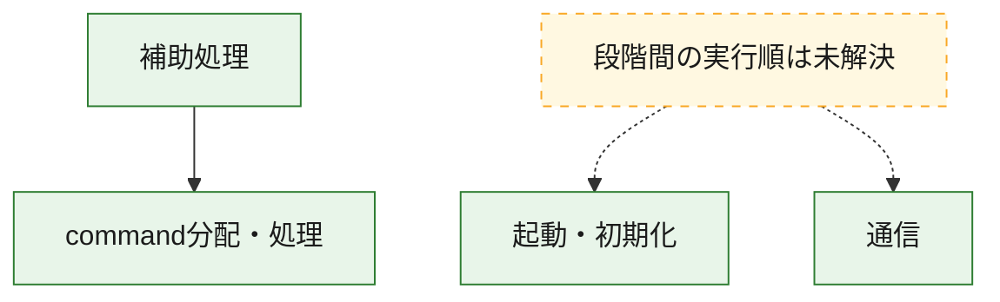
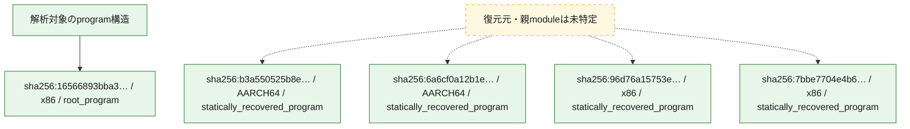

# 全体ロジック：16566893bba36287df9fab1cd9a38b821a815aa2fc5141fb7b6e5309cbd769c7

代表関数の静的証跡から、起動・初期化、通信、command分配・処理の処理群を確認しました。

## 読み方

- phaseの掲載順は解析上の整理順です。observed_call_edgesがない段階間の実行順を断定しません。
- 図の実線は静的に観測した関係、点線と黄色のノードは未観測・未解決の関係を示します。
- 図は静的な要約であり、動的実行を再現するものではありません。
- 詳細な関数解説とfingerprintは[STATIC-LOGIC.md](STATIC-LOGIC.md)を参照してください。

## 静的可視化

### 実行フロー

### 感染チェーン

```mermaid
flowchart TD
  chain_initial["初期侵入・配布経路は未観測"]
  chain_01["提出検体 / sha256:16566893bba3….exe / pe"]
  chain_02["静的復元層 1 / sha256:16566893bba3….exe::nsis-member-004-7z.7z / 7z"]
  chain_03["静的復元層 2 / sha256:16566893bba3….exe::nsis-member-004-7z.7z::7z-asar / asar"]
  chain_04["静的復元層 3 / sha256:16566893bba3….exe::nsis-member-004-7z.7z::7z-asar::asar-n / pe"]
  chain_05["静的復元層 3 / sha256:16566893bba3….exe::nsis-member-004-7z.7z::7z-asar::asar-n / pe"]
  chain_06["静的復元層 3 / sha256:16566893bba3….exe::nsis-member-004-7z.7z::7z-asar::asar-s / script"]
  chain_07["静的復元層 3 / sha256:16566893bba3….exe::nsis-member-004-7z.7z::7z-asar::asar-s / script"]
  chain_08["静的復元層 3 / sha256:16566893bba3….exe::nsis-member-004-7z.7z::7z-asar::asar-s / script"]
  chain_09["静的復元層 3 / sha256:16566893bba3….exe::nsis-member-004-7z.7z::7z-asar::asar-s / script"]
  chain_10["静的復元層 3 / sha256:16566893bba3….exe::nsis-member-004-7z.7z::7z-asar::asar-s / script"]
  chain_11["静的復元層 3 / sha256:16566893bba3….exe::nsis-member-004-7z.7z::7z-asar::asar-s / script"]
  chain_12["静的復元層 3 / sha256:16566893bba3….exe::nsis-member-004-7z.7z::7z-asar::asar-s / script"]
  chain_13["静的復元層 3 / sha256:16566893bba3….exe::nsis-member-004-7z.7z::7z-asar::asar-s / script"]
  chain_14["静的復元層 3 / sha256:16566893bba3….exe::nsis-member-004-7z.7z::7z-asar::asar-s / script"]
  chain_15["静的復元層 3 / sha256:16566893bba3….exe::nsis-member-004-7z.7z::7z-asar::asar-s / script"]
  chain_16["静的復元層 3 / sha256:16566893bba3….exe::nsis-member-004-7z.7z::7z-asar::asar-s / script"]
  chain_01 -->|nsis-member-004-7z.7z| chain_02
  chain_02 -->|7z-asar| chain_03
  chain_03 -->|asar-native| chain_04
  chain_03 -->|asar-native| chain_05
  chain_03 -->|asar-script| chain_06
  chain_03 -->|asar-script| chain_07
  chain_03 -->|asar-script| chain_08
  chain_03 -->|asar-script| chain_09
  chain_03 -->|asar-script| chain_10
  chain_03 -->|asar-script| chain_11
  chain_03 -->|asar-script| chain_12
  chain_03 -->|asar-script| chain_13
  chain_03 -->|asar-script| chain_14
  chain_03 -->|asar-script| chain_15
  chain_03 -->|asar-script| chain_16
  chain_initial -.-> chain_01
  chain_more["その他240層はstatic-layers.jsonを参照"]
  chain_04 -.-> chain_more
  chain_05 -.-> chain_more
  chain_06 -.-> chain_more
  chain_07 -.-> chain_more
  chain_08 -.-> chain_more
  chain_09 -.-> chain_more
  chain_10 -.-> chain_more
  chain_11 -.-> chain_more
  chain_12 -.-> chain_more
  chain_13 -.-> chain_more
  chain_14 -.-> chain_more
  chain_15 -.-> chain_more
  chain_16 -.-> chain_more
  class chain_more unresolved
  class chain_01,chain_02,chain_03,chain_04,chain_05,chain_06,chain_07,chain_08,chain_09,chain_10,chain_11,chain_12,chain_13,chain_14,chain_15,chain_16 confirmed
  class chain_initial unresolved
  classDef confirmed fill:#e8f5e9,stroke:#2e7d32,color:#1b1b1b
  classDef unresolved fill:#fff8e1,stroke:#f9a825,color:#1b1b1b,stroke-dasharray:5 5
```

### モジュール関係

## 処理段階

### 1. 起動・初期化

entry pointから初期化と後続処理への移行を確認します。
確度: `confirmed_static_function_evidence`

- `96d76a15753e6588abd7a4494985230b795ef8490eb0ebaeb255836bacf2b211:ghidra:1800950a0` — 初期化と主要処理への分岐を行う入口関数です。 状態: `succeeded`、選定理由: `entry_point`, `meaningful_symbol_name`, `reviewed_call_centrality:5`, `role:entrypoint`
- `7bbe7704e4b68ca6c2c54ddc80df52413b3d14500aefbf6ef6b05316e3ca42ef:ghidra:180137efc` — 初期化と主要処理への分岐を行う入口関数です。 状態: `succeeded`、選定理由: `entry_point`, `meaningful_symbol_name`, `reviewed_call_centrality:5`, `role:entrypoint`
- `16566893bba36287df9fab1cd9a38b821a815aa2fc5141fb7b6e5309cbd769c7:ghidra:0040338f` — 初期化と主要処理への分岐を行う入口関数です。 状態: `succeeded`、選定理由: `entry_point`, `large_function:instructions=421`, `meaningful_symbol_name`, `reviewed_call_centrality:51`, `role:entrypoint`, `small_program_complete_context`

### 2. 通信

通信初期化、endpoint処理、送受信の役割を確認します。
確度: `confirmed_static_function_evidence_with_limits`

- `96d76a15753e6588abd7a4494985230b795ef8490eb0ebaeb255836bacf2b211:ghidra:180096856` — 通信初期化、送受信、またはendpoint処理に関係する関数です。 状態: `limited_bad_instruction_or_flow`、選定理由: `meaningful_symbol_name`, `reviewed_call_centrality:1`, `role:network_communication`

### 3. command分配・処理

受信commandやtaskの解釈、分配、個別handlerへの移行を確認します。
確度: `confirmed_static_function_evidence_with_limits`

- `b3a550525b8e357d2a89a1c35374966b2beab4a916064beb9821b1970c534b91:ghidra:180008dc0` — commandの解釈、分配、または個別処理を担当する関数です。 状態: `limited_bad_instruction_or_flow`、選定理由: `meaningful_symbol_name`, `role:command_dispatch_or_handler`
- `6a6cf0a12b1ed4323dc48e4a48ad828e54220fc082365f610520e3f70312e48f:ghidra:180007210` — commandの解釈、分配、または個別処理を担当する関数です。 状態: `limited_bad_instruction_or_flow`、選定理由: `meaningful_symbol_name`, `role:command_dispatch_or_handler`, `small_program_complete_context`
- `96d76a15753e6588abd7a4494985230b795ef8490eb0ebaeb255836bacf2b211:ghidra:180095ab0` — commandの解釈、分配、または個別処理を担当する関数です。 状態: `limited_bad_instruction_or_flow`、選定理由: `meaningful_symbol_name`, `reviewed_call_centrality:1`, `role:command_dispatch_or_handler`
- `7bbe7704e4b68ca6c2c54ddc80df52413b3d14500aefbf6ef6b05316e3ca42ef:ghidra:180151e20` — commandの解釈、分配、または個別処理を担当する関数です。 状態: `limited_bad_instruction_or_flow`、選定理由: `meaningful_symbol_name`, `role:command_dispatch_or_handler`

### 4. 補助処理

主要処理を支える一般内部関数またはlibrary処理を確認します。
確度: `confirmed_static_function_evidence_with_limits`

- `b3a550525b8e357d2a89a1c35374966b2beab4a916064beb9821b1970c534b91:ghidra:18000a3f8` — 検体内部の一般処理を実装する関数です。 状態: `succeeded`、選定理由: `meaningful_symbol_name`
- `b3a550525b8e357d2a89a1c35374966b2beab4a916064beb9821b1970c534b91:ghidra:180018dd0` — 検体内部の一般処理を実装する関数です。 状態: `limited_bad_instruction_or_flow`、選定理由: `meaningful_symbol_name`, `reviewed_call_centrality:1`
- `b3a550525b8e357d2a89a1c35374966b2beab4a916064beb9821b1970c534b91:ghidra:180018ddc` — 検体内部の一般処理を実装する関数です。 状態: `limited_bad_instruction_or_flow`、選定理由: `meaningful_symbol_name`, `reviewed_call_centrality:1`
- `b3a550525b8e357d2a89a1c35374966b2beab4a916064beb9821b1970c534b91:ghidra:180018de8` — 検体内部の一般処理を実装する関数です。 状態: `limited_bad_instruction_or_flow`、選定理由: `meaningful_symbol_name`, `reviewed_call_centrality:1`
- `b3a550525b8e357d2a89a1c35374966b2beab4a916064beb9821b1970c534b91:ghidra:180018df4` — 検体内部の一般処理を実装する関数です。 状態: `limited_bad_instruction_or_flow`、選定理由: `meaningful_symbol_name`, `reviewed_call_centrality:1`
- `b3a550525b8e357d2a89a1c35374966b2beab4a916064beb9821b1970c534b91:ghidra:180018e00` — 検体内部の一般処理を実装する関数です。 状態: `limited_bad_instruction_or_flow`、選定理由: `meaningful_symbol_name`, `reviewed_call_centrality:1`
- `b3a550525b8e357d2a89a1c35374966b2beab4a916064beb9821b1970c534b91:ghidra:180018e0c` — 検体内部の一般処理を実装する関数です。 状態: `limited_bad_instruction_or_flow`、選定理由: `meaningful_symbol_name`, `reviewed_call_centrality:1`
- `b3a550525b8e357d2a89a1c35374966b2beab4a916064beb9821b1970c534b91:ghidra:180018e18` — 検体内部の一般処理を実装する関数です。 状態: `limited_bad_instruction_or_flow`、選定理由: `meaningful_symbol_name`, `reviewed_call_centrality:1`
- `b3a550525b8e357d2a89a1c35374966b2beab4a916064beb9821b1970c534b91:ghidra:180018e24` — 検体内部の一般処理を実装する関数です。 状態: `limited_bad_instruction_or_flow`、選定理由: `meaningful_symbol_name`, `reviewed_call_centrality:1`
- `b3a550525b8e357d2a89a1c35374966b2beab4a916064beb9821b1970c534b91:ghidra:180018e30` — 検体内部の一般処理を実装する関数です。 状態: `limited_bad_instruction_or_flow`、選定理由: `meaningful_symbol_name`, `reviewed_call_centrality:1`
- `b3a550525b8e357d2a89a1c35374966b2beab4a916064beb9821b1970c534b91:ghidra:180018e3c` — 検体内部の一般処理を実装する関数です。 状態: `limited_bad_instruction_or_flow`、選定理由: `meaningful_symbol_name`, `reviewed_call_centrality:1`
- `b3a550525b8e357d2a89a1c35374966b2beab4a916064beb9821b1970c534b91:ghidra:180018e48` — 検体内部の一般処理を実装する関数です。 状態: `limited_bad_instruction_or_flow`、選定理由: `meaningful_symbol_name`, `reviewed_call_centrality:1`
- `b3a550525b8e357d2a89a1c35374966b2beab4a916064beb9821b1970c534b91:ghidra:180018e54` — 検体内部の一般処理を実装する関数です。 状態: `limited_bad_instruction_or_flow`、選定理由: `meaningful_symbol_name`, `reviewed_call_centrality:1`
- `b3a550525b8e357d2a89a1c35374966b2beab4a916064beb9821b1970c534b91:ghidra:180018e60` — 検体内部の一般処理を実装する関数です。 状態: `limited_bad_instruction_or_flow`、選定理由: `meaningful_symbol_name`, `reviewed_call_centrality:1`
- `b3a550525b8e357d2a89a1c35374966b2beab4a916064beb9821b1970c534b91:ghidra:180018e6c` — 検体内部の一般処理を実装する関数です。 状態: `limited_bad_instruction_or_flow`、選定理由: `meaningful_symbol_name`, `reviewed_call_centrality:1`
- `b3a550525b8e357d2a89a1c35374966b2beab4a916064beb9821b1970c534b91:ghidra:180018e78` — 検体内部の一般処理を実装する関数です。 状態: `limited_bad_instruction_or_flow`、選定理由: `meaningful_symbol_name`, `reviewed_call_centrality:1`
- `b3a550525b8e357d2a89a1c35374966b2beab4a916064beb9821b1970c534b91:ghidra:180018e84` — 検体内部の一般処理を実装する関数です。 状態: `limited_bad_instruction_or_flow`、選定理由: `meaningful_symbol_name`, `reviewed_call_centrality:1`
- `b3a550525b8e357d2a89a1c35374966b2beab4a916064beb9821b1970c534b91:ghidra:180018e90` — 検体内部の一般処理を実装する関数です。 状態: `limited_bad_instruction_or_flow`、選定理由: `meaningful_symbol_name`, `reviewed_call_centrality:1`
- `b3a550525b8e357d2a89a1c35374966b2beab4a916064beb9821b1970c534b91:ghidra:180018e9c` — 検体内部の一般処理を実装する関数です。 状態: `limited_bad_instruction_or_flow`、選定理由: `meaningful_symbol_name`, `reviewed_call_centrality:1`
- `b3a550525b8e357d2a89a1c35374966b2beab4a916064beb9821b1970c534b91:ghidra:180018ea8` — 検体内部の一般処理を実装する関数です。 状態: `limited_bad_instruction_or_flow`、選定理由: `meaningful_symbol_name`, `reviewed_call_centrality:1`
- `b3a550525b8e357d2a89a1c35374966b2beab4a916064beb9821b1970c534b91:ghidra:180018eb4` — 検体内部の一般処理を実装する関数です。 状態: `limited_bad_instruction_or_flow`、選定理由: `meaningful_symbol_name`, `reviewed_call_centrality:1`
- `b3a550525b8e357d2a89a1c35374966b2beab4a916064beb9821b1970c534b91:ghidra:180018ec0` — 検体内部の一般処理を実装する関数です。 状態: `limited_bad_instruction_or_flow`、選定理由: `meaningful_symbol_name`, `reviewed_call_centrality:1`
- `b3a550525b8e357d2a89a1c35374966b2beab4a916064beb9821b1970c534b91:ghidra:180018ecc` — 検体内部の一般処理を実装する関数です。 状態: `limited_bad_instruction_or_flow`、選定理由: `meaningful_symbol_name`, `reviewed_call_centrality:1`
- `b3a550525b8e357d2a89a1c35374966b2beab4a916064beb9821b1970c534b91:ghidra:180018ed8` — 検体内部の一般処理を実装する関数です。 状態: `limited_bad_instruction_or_flow`、選定理由: `meaningful_symbol_name`, `reviewed_call_centrality:1`
- `b3a550525b8e357d2a89a1c35374966b2beab4a916064beb9821b1970c534b91:ghidra:180018ee4` — 検体内部の一般処理を実装する関数です。 状態: `limited_bad_instruction_or_flow`、選定理由: `meaningful_symbol_name`, `reviewed_call_centrality:1`
- `b3a550525b8e357d2a89a1c35374966b2beab4a916064beb9821b1970c534b91:ghidra:180018ef0` — 検体内部の一般処理を実装する関数です。 状態: `limited_bad_instruction_or_flow`、選定理由: `meaningful_symbol_name`, `reviewed_call_centrality:1`
- `b3a550525b8e357d2a89a1c35374966b2beab4a916064beb9821b1970c534b91:ghidra:180018efc` — 検体内部の一般処理を実装する関数です。 状態: `limited_bad_instruction_or_flow`、選定理由: `meaningful_symbol_name`, `reviewed_call_centrality:1`
- `b3a550525b8e357d2a89a1c35374966b2beab4a916064beb9821b1970c534b91:ghidra:180018f08` — 検体内部の一般処理を実装する関数です。 状態: `limited_bad_instruction_or_flow`、選定理由: `meaningful_symbol_name`, `reviewed_call_centrality:1`
- `b3a550525b8e357d2a89a1c35374966b2beab4a916064beb9821b1970c534b91:ghidra:180018f14` — 検体内部の一般処理を実装する関数です。 状態: `limited_bad_instruction_or_flow`、選定理由: `meaningful_symbol_name`, `reviewed_call_centrality:1`
- `b3a550525b8e357d2a89a1c35374966b2beab4a916064beb9821b1970c534b91:ghidra:180018f20` — 検体内部の一般処理を実装する関数です。 状態: `limited_bad_instruction_or_flow`、選定理由: `meaningful_symbol_name`, `reviewed_call_centrality:1`
- `b3a550525b8e357d2a89a1c35374966b2beab4a916064beb9821b1970c534b91:ghidra:180018f2c` — 検体内部の一般処理を実装する関数です。 状態: `limited_bad_instruction_or_flow`、選定理由: `meaningful_symbol_name`, `reviewed_call_centrality:1`
- `6a6cf0a12b1ed4323dc48e4a48ad828e54220fc082365f610520e3f70312e48f:ghidra:180008870` — 検体内部の一般処理を実装する関数です。 状態: `succeeded`、選定理由: `meaningful_symbol_name`, `small_program_complete_context`
- `6a6cf0a12b1ed4323dc48e4a48ad828e54220fc082365f610520e3f70312e48f:ghidra:18001d18c` — 検体内部の一般処理を実装する関数です。 状態: `limited_bad_instruction_or_flow`、選定理由: `meaningful_symbol_name`, `reviewed_call_centrality:1`, `small_program_complete_context`
- `6a6cf0a12b1ed4323dc48e4a48ad828e54220fc082365f610520e3f70312e48f:ghidra:18001d198` — 検体内部の一般処理を実装する関数です。 状態: `limited_bad_instruction_or_flow`、選定理由: `meaningful_symbol_name`, `reviewed_call_centrality:1`, `small_program_complete_context`
- `6a6cf0a12b1ed4323dc48e4a48ad828e54220fc082365f610520e3f70312e48f:ghidra:18001d1a4` — 検体内部の一般処理を実装する関数です。 状態: `limited_bad_instruction_or_flow`、選定理由: `meaningful_symbol_name`, `reviewed_call_centrality:1`, `small_program_complete_context`
- `6a6cf0a12b1ed4323dc48e4a48ad828e54220fc082365f610520e3f70312e48f:ghidra:18001d1b0` — 検体内部の一般処理を実装する関数です。 状態: `limited_bad_instruction_or_flow`、選定理由: `meaningful_symbol_name`, `reviewed_call_centrality:1`, `small_program_complete_context`
- `6a6cf0a12b1ed4323dc48e4a48ad828e54220fc082365f610520e3f70312e48f:ghidra:18001d1bc` — 検体内部の一般処理を実装する関数です。 状態: `limited_bad_instruction_or_flow`、選定理由: `meaningful_symbol_name`, `reviewed_call_centrality:1`, `small_program_complete_context`
- `6a6cf0a12b1ed4323dc48e4a48ad828e54220fc082365f610520e3f70312e48f:ghidra:18001d1c8` — 検体内部の一般処理を実装する関数です。 状態: `limited_bad_instruction_or_flow`、選定理由: `meaningful_symbol_name`, `reviewed_call_centrality:1`, `small_program_complete_context`
- `6a6cf0a12b1ed4323dc48e4a48ad828e54220fc082365f610520e3f70312e48f:ghidra:18001d1d4` — 検体内部の一般処理を実装する関数です。 状態: `limited_bad_instruction_or_flow`、選定理由: `meaningful_symbol_name`, `reviewed_call_centrality:1`, `small_program_complete_context`
- `6a6cf0a12b1ed4323dc48e4a48ad828e54220fc082365f610520e3f70312e48f:ghidra:18001d1e0` — 検体内部の一般処理を実装する関数です。 状態: `limited_bad_instruction_or_flow`、選定理由: `meaningful_symbol_name`, `reviewed_call_centrality:1`, `small_program_complete_context`
- `6a6cf0a12b1ed4323dc48e4a48ad828e54220fc082365f610520e3f70312e48f:ghidra:18001d1ec` — 検体内部の一般処理を実装する関数です。 状態: `limited_bad_instruction_or_flow`、選定理由: `meaningful_symbol_name`, `reviewed_call_centrality:1`, `small_program_complete_context`
- `6a6cf0a12b1ed4323dc48e4a48ad828e54220fc082365f610520e3f70312e48f:ghidra:18001d1f8` — 検体内部の一般処理を実装する関数です。 状態: `limited_bad_instruction_or_flow`、選定理由: `meaningful_symbol_name`, `reviewed_call_centrality:1`, `small_program_complete_context`
- `96d76a15753e6588abd7a4494985230b795ef8490eb0ebaeb255836bacf2b211:ghidra:1800346b0` — 検体内部の一般処理を実装する関数です。 状態: `succeeded`、選定理由: `entry_point`, `meaningful_symbol_name`, `reviewed_call_centrality:1`
- `96d76a15753e6588abd7a4494985230b795ef8490eb0ebaeb255836bacf2b211:ghidra:1800940c0` — compiler生成処理または汎用library処理とみられる関数です。 状態: `succeeded`、選定理由: `entry_point`, `meaningful_symbol_name`, `reviewed_call_centrality:1`
- `96d76a15753e6588abd7a4494985230b795ef8490eb0ebaeb255836bacf2b211:ghidra:1800947d4` — 検体内部の一般処理を実装する関数です。 状態: `succeeded`、選定理由: `meaningful_symbol_name`
- `96d76a15753e6588abd7a4494985230b795ef8490eb0ebaeb255836bacf2b211:ghidra:180096406` — 検体内部の一般処理を実装する関数です。 状態: `limited_bad_instruction_or_flow`、選定理由: `meaningful_symbol_name`, `reviewed_call_centrality:1`
- `96d76a15753e6588abd7a4494985230b795ef8490eb0ebaeb255836bacf2b211:ghidra:180096412` — 検体内部の一般処理を実装する関数です。 状態: `limited_bad_instruction_or_flow`、選定理由: `meaningful_symbol_name`, `reviewed_call_centrality:1`
- `96d76a15753e6588abd7a4494985230b795ef8490eb0ebaeb255836bacf2b211:ghidra:18009641e` — 検体内部の一般処理を実装する関数です。 状態: `limited_bad_instruction_or_flow`、選定理由: `meaningful_symbol_name`, `reviewed_call_centrality:1`
- `96d76a15753e6588abd7a4494985230b795ef8490eb0ebaeb255836bacf2b211:ghidra:18009642a` — 検体内部の一般処理を実装する関数です。 状態: `limited_bad_instruction_or_flow`、選定理由: `meaningful_symbol_name`, `reviewed_call_centrality:1`
- `96d76a15753e6588abd7a4494985230b795ef8490eb0ebaeb255836bacf2b211:ghidra:180096436` — 検体内部の一般処理を実装する関数です。 状態: `limited_bad_instruction_or_flow`、選定理由: `meaningful_symbol_name`, `reviewed_call_centrality:1`
- `96d76a15753e6588abd7a4494985230b795ef8490eb0ebaeb255836bacf2b211:ghidra:180096442` — 検体内部の一般処理を実装する関数です。 状態: `limited_bad_instruction_or_flow`、選定理由: `meaningful_symbol_name`, `reviewed_call_centrality:1`
- `96d76a15753e6588abd7a4494985230b795ef8490eb0ebaeb255836bacf2b211:ghidra:18009644e` — 検体内部の一般処理を実装する関数です。 状態: `limited_bad_instruction_or_flow`、選定理由: `meaningful_symbol_name`, `reviewed_call_centrality:1`
- `96d76a15753e6588abd7a4494985230b795ef8490eb0ebaeb255836bacf2b211:ghidra:18009645a` — 検体内部の一般処理を実装する関数です。 状態: `limited_bad_instruction_or_flow`、選定理由: `meaningful_symbol_name`, `reviewed_call_centrality:1`
- `96d76a15753e6588abd7a4494985230b795ef8490eb0ebaeb255836bacf2b211:ghidra:180096466` — 検体内部の一般処理を実装する関数です。 状態: `limited_bad_instruction_or_flow`、選定理由: `meaningful_symbol_name`, `reviewed_call_centrality:1`
- `96d76a15753e6588abd7a4494985230b795ef8490eb0ebaeb255836bacf2b211:ghidra:180096472` — 検体内部の一般処理を実装する関数です。 状態: `limited_bad_instruction_or_flow`、選定理由: `meaningful_symbol_name`, `reviewed_call_centrality:1`
- `96d76a15753e6588abd7a4494985230b795ef8490eb0ebaeb255836bacf2b211:ghidra:18009647e` — 検体内部の一般処理を実装する関数です。 状態: `limited_bad_instruction_or_flow`、選定理由: `meaningful_symbol_name`, `reviewed_call_centrality:1`
- `96d76a15753e6588abd7a4494985230b795ef8490eb0ebaeb255836bacf2b211:ghidra:18009648a` — 検体内部の一般処理を実装する関数です。 状態: `limited_bad_instruction_or_flow`、選定理由: `meaningful_symbol_name`, `reviewed_call_centrality:1`
- `96d76a15753e6588abd7a4494985230b795ef8490eb0ebaeb255836bacf2b211:ghidra:180096496` — 検体内部の一般処理を実装する関数です。 状態: `limited_bad_instruction_or_flow`、選定理由: `meaningful_symbol_name`, `reviewed_call_centrality:1`
- `96d76a15753e6588abd7a4494985230b795ef8490eb0ebaeb255836bacf2b211:ghidra:1800964a2` — 検体内部の一般処理を実装する関数です。 状態: `limited_bad_instruction_or_flow`、選定理由: `meaningful_symbol_name`, `reviewed_call_centrality:1`
- `96d76a15753e6588abd7a4494985230b795ef8490eb0ebaeb255836bacf2b211:ghidra:1800964ae` — 検体内部の一般処理を実装する関数です。 状態: `limited_bad_instruction_or_flow`、選定理由: `meaningful_symbol_name`, `reviewed_call_centrality:1`
- `96d76a15753e6588abd7a4494985230b795ef8490eb0ebaeb255836bacf2b211:ghidra:1800964ba` — 検体内部の一般処理を実装する関数です。 状態: `limited_bad_instruction_or_flow`、選定理由: `meaningful_symbol_name`, `reviewed_call_centrality:1`
- `96d76a15753e6588abd7a4494985230b795ef8490eb0ebaeb255836bacf2b211:ghidra:1800964c6` — 検体内部の一般処理を実装する関数です。 状態: `limited_bad_instruction_or_flow`、選定理由: `meaningful_symbol_name`, `reviewed_call_centrality:1`
- `96d76a15753e6588abd7a4494985230b795ef8490eb0ebaeb255836bacf2b211:ghidra:1800964d2` — 検体内部の一般処理を実装する関数です。 状態: `limited_bad_instruction_or_flow`、選定理由: `meaningful_symbol_name`, `reviewed_call_centrality:1`
- `96d76a15753e6588abd7a4494985230b795ef8490eb0ebaeb255836bacf2b211:ghidra:1800964de` — 検体内部の一般処理を実装する関数です。 状態: `limited_bad_instruction_or_flow`、選定理由: `meaningful_symbol_name`, `reviewed_call_centrality:1`
- `96d76a15753e6588abd7a4494985230b795ef8490eb0ebaeb255836bacf2b211:ghidra:1800964ea` — 検体内部の一般処理を実装する関数です。 状態: `limited_bad_instruction_or_flow`、選定理由: `meaningful_symbol_name`, `reviewed_call_centrality:1`
- `96d76a15753e6588abd7a4494985230b795ef8490eb0ebaeb255836bacf2b211:ghidra:1800964f6` — 検体内部の一般処理を実装する関数です。 状態: `limited_bad_instruction_or_flow`、選定理由: `meaningful_symbol_name`, `reviewed_call_centrality:1`
- `96d76a15753e6588abd7a4494985230b795ef8490eb0ebaeb255836bacf2b211:ghidra:180096502` — 検体内部の一般処理を実装する関数です。 状態: `limited_bad_instruction_or_flow`、選定理由: `meaningful_symbol_name`, `reviewed_call_centrality:1`
- `96d76a15753e6588abd7a4494985230b795ef8490eb0ebaeb255836bacf2b211:ghidra:18009650e` — 検体内部の一般処理を実装する関数です。 状態: `limited_bad_instruction_or_flow`、選定理由: `meaningful_symbol_name`, `reviewed_call_centrality:1`
- `96d76a15753e6588abd7a4494985230b795ef8490eb0ebaeb255836bacf2b211:ghidra:18009651a` — 検体内部の一般処理を実装する関数です。 状態: `limited_bad_instruction_or_flow`、選定理由: `meaningful_symbol_name`, `reviewed_call_centrality:1`
- `96d76a15753e6588abd7a4494985230b795ef8490eb0ebaeb255836bacf2b211:ghidra:180096526` — 検体内部の一般処理を実装する関数です。 状態: `limited_bad_instruction_or_flow`、選定理由: `meaningful_symbol_name`, `reviewed_call_centrality:1`
- `96d76a15753e6588abd7a4494985230b795ef8490eb0ebaeb255836bacf2b211:ghidra:180096532` — 検体内部の一般処理を実装する関数です。 状態: `limited_bad_instruction_or_flow`、選定理由: `meaningful_symbol_name`, `reviewed_call_centrality:1`
- `7bbe7704e4b68ca6c2c54ddc80df52413b3d14500aefbf6ef6b05316e3ca42ef:ghidra:1800010b0` — 検体内部の一般処理を実装する関数です。 状態: `succeeded`、選定理由: `meaningful_symbol_name`
- `7bbe7704e4b68ca6c2c54ddc80df52413b3d14500aefbf6ef6b05316e3ca42ef:ghidra:180001870` — 検体内部の一般処理を実装する関数です。 状態: `succeeded`、選定理由: `entry_point`, `meaningful_symbol_name`, `reviewed_call_centrality:25`
- `7bbe7704e4b68ca6c2c54ddc80df52413b3d14500aefbf6ef6b05316e3ca42ef:ghidra:180137748` — 検体内部の一般処理を実装する関数です。 状態: `limited_bad_instruction_or_flow`、選定理由: `meaningful_symbol_name`, `reviewed_call_centrality:2`
- `7bbe7704e4b68ca6c2c54ddc80df52413b3d14500aefbf6ef6b05316e3ca42ef:ghidra:1801377cd` — 検体内部の一般処理を実装する関数です。 状態: `limited_bad_instruction_or_flow`、選定理由: `meaningful_symbol_name`, `reviewed_call_centrality:2`
- `7bbe7704e4b68ca6c2c54ddc80df52413b3d14500aefbf6ef6b05316e3ca42ef:ghidra:1801377d9` — 検体内部の一般処理を実装する関数です。 状態: `limited_bad_instruction_or_flow`、選定理由: `meaningful_symbol_name`, `reviewed_call_centrality:2`
- `7bbe7704e4b68ca6c2c54ddc80df52413b3d14500aefbf6ef6b05316e3ca42ef:ghidra:1801377e5` — 検体内部の一般処理を実装する関数です。 状態: `limited_bad_instruction_or_flow`、選定理由: `meaningful_symbol_name`, `reviewed_call_centrality:2`
- `7bbe7704e4b68ca6c2c54ddc80df52413b3d14500aefbf6ef6b05316e3ca42ef:ghidra:1801377f1` — 検体内部の一般処理を実装する関数です。 状態: `limited_bad_instruction_or_flow`、選定理由: `meaningful_symbol_name`, `reviewed_call_centrality:2`
- `7bbe7704e4b68ca6c2c54ddc80df52413b3d14500aefbf6ef6b05316e3ca42ef:ghidra:1801377fd` — 検体内部の一般処理を実装する関数です。 状態: `limited_bad_instruction_or_flow`、選定理由: `meaningful_symbol_name`, `reviewed_call_centrality:2`
- `7bbe7704e4b68ca6c2c54ddc80df52413b3d14500aefbf6ef6b05316e3ca42ef:ghidra:180137809` — 検体内部の一般処理を実装する関数です。 状態: `limited_bad_instruction_or_flow`、選定理由: `meaningful_symbol_name`, `reviewed_call_centrality:2`
- `7bbe7704e4b68ca6c2c54ddc80df52413b3d14500aefbf6ef6b05316e3ca42ef:ghidra:180137815` — 検体内部の一般処理を実装する関数です。 状態: `limited_bad_instruction_or_flow`、選定理由: `meaningful_symbol_name`, `reviewed_call_centrality:2`
- `7bbe7704e4b68ca6c2c54ddc80df52413b3d14500aefbf6ef6b05316e3ca42ef:ghidra:180137821` — 検体内部の一般処理を実装する関数です。 状態: `limited_bad_instruction_or_flow`、選定理由: `meaningful_symbol_name`, `reviewed_call_centrality:2`
- `7bbe7704e4b68ca6c2c54ddc80df52413b3d14500aefbf6ef6b05316e3ca42ef:ghidra:18013782d` — 検体内部の一般処理を実装する関数です。 状態: `limited_bad_instruction_or_flow`、選定理由: `meaningful_symbol_name`, `reviewed_call_centrality:2`
- `7bbe7704e4b68ca6c2c54ddc80df52413b3d14500aefbf6ef6b05316e3ca42ef:ghidra:180137839` — 検体内部の一般処理を実装する関数です。 状態: `limited_bad_instruction_or_flow`、選定理由: `meaningful_symbol_name`, `reviewed_call_centrality:2`
- `7bbe7704e4b68ca6c2c54ddc80df52413b3d14500aefbf6ef6b05316e3ca42ef:ghidra:180137845` — 検体内部の一般処理を実装する関数です。 状態: `limited_bad_instruction_or_flow`、選定理由: `meaningful_symbol_name`, `reviewed_call_centrality:2`
- `7bbe7704e4b68ca6c2c54ddc80df52413b3d14500aefbf6ef6b05316e3ca42ef:ghidra:180137851` — 検体内部の一般処理を実装する関数です。 状態: `limited_bad_instruction_or_flow`、選定理由: `meaningful_symbol_name`, `reviewed_call_centrality:2`
- `7bbe7704e4b68ca6c2c54ddc80df52413b3d14500aefbf6ef6b05316e3ca42ef:ghidra:18013785d` — 検体内部の一般処理を実装する関数です。 状態: `limited_bad_instruction_or_flow`、選定理由: `meaningful_symbol_name`, `reviewed_call_centrality:2`
- `7bbe7704e4b68ca6c2c54ddc80df52413b3d14500aefbf6ef6b05316e3ca42ef:ghidra:180137869` — 検体内部の一般処理を実装する関数です。 状態: `limited_bad_instruction_or_flow`、選定理由: `meaningful_symbol_name`, `reviewed_call_centrality:2`
- `7bbe7704e4b68ca6c2c54ddc80df52413b3d14500aefbf6ef6b05316e3ca42ef:ghidra:18013787b` — 検体内部の一般処理を実装する関数です。 状態: `limited_bad_instruction_or_flow`、選定理由: `meaningful_symbol_name`, `reviewed_call_centrality:2`
- `7bbe7704e4b68ca6c2c54ddc80df52413b3d14500aefbf6ef6b05316e3ca42ef:ghidra:180137887` — 検体内部の一般処理を実装する関数です。 状態: `limited_bad_instruction_or_flow`、選定理由: `meaningful_symbol_name`, `reviewed_call_centrality:2`
- `7bbe7704e4b68ca6c2c54ddc80df52413b3d14500aefbf6ef6b05316e3ca42ef:ghidra:180137893` — 検体内部の一般処理を実装する関数です。 状態: `limited_bad_instruction_or_flow`、選定理由: `meaningful_symbol_name`, `reviewed_call_centrality:2`
- `7bbe7704e4b68ca6c2c54ddc80df52413b3d14500aefbf6ef6b05316e3ca42ef:ghidra:18013789f` — 検体内部の一般処理を実装する関数です。 状態: `limited_bad_instruction_or_flow`、選定理由: `meaningful_symbol_name`, `reviewed_call_centrality:2`
- `7bbe7704e4b68ca6c2c54ddc80df52413b3d14500aefbf6ef6b05316e3ca42ef:ghidra:1801378ab` — 検体内部の一般処理を実装する関数です。 状態: `limited_bad_instruction_or_flow`、選定理由: `meaningful_symbol_name`, `reviewed_call_centrality:2`
- `7bbe7704e4b68ca6c2c54ddc80df52413b3d14500aefbf6ef6b05316e3ca42ef:ghidra:1801378b7` — 検体内部の一般処理を実装する関数です。 状態: `limited_bad_instruction_or_flow`、選定理由: `meaningful_symbol_name`, `reviewed_call_centrality:2`
- `7bbe7704e4b68ca6c2c54ddc80df52413b3d14500aefbf6ef6b05316e3ca42ef:ghidra:1801378c3` — 検体内部の一般処理を実装する関数です。 状態: `limited_bad_instruction_or_flow`、選定理由: `meaningful_symbol_name`, `reviewed_call_centrality:2`
- `7bbe7704e4b68ca6c2c54ddc80df52413b3d14500aefbf6ef6b05316e3ca42ef:ghidra:1801378cf` — 検体内部の一般処理を実装する関数です。 状態: `limited_bad_instruction_or_flow`、選定理由: `meaningful_symbol_name`, `reviewed_call_centrality:2`
- `7bbe7704e4b68ca6c2c54ddc80df52413b3d14500aefbf6ef6b05316e3ca42ef:ghidra:1801378db` — 検体内部の一般処理を実装する関数です。 状態: `limited_bad_instruction_or_flow`、選定理由: `meaningful_symbol_name`, `reviewed_call_centrality:2`
- `7bbe7704e4b68ca6c2c54ddc80df52413b3d14500aefbf6ef6b05316e3ca42ef:ghidra:1801378e7` — 検体内部の一般処理を実装する関数です。 状態: `limited_bad_instruction_or_flow`、選定理由: `meaningful_symbol_name`, `reviewed_call_centrality:2`
- `7bbe7704e4b68ca6c2c54ddc80df52413b3d14500aefbf6ef6b05316e3ca42ef:ghidra:1801378f3` — 検体内部の一般処理を実装する関数です。 状態: `limited_bad_instruction_or_flow`、選定理由: `meaningful_symbol_name`, `reviewed_call_centrality:2`
- `7bbe7704e4b68ca6c2c54ddc80df52413b3d14500aefbf6ef6b05316e3ca42ef:ghidra:1801378ff` — 検体内部の一般処理を実装する関数です。 状態: `limited_bad_instruction_or_flow`、選定理由: `meaningful_symbol_name`, `reviewed_call_centrality:2`
- `7bbe7704e4b68ca6c2c54ddc80df52413b3d14500aefbf6ef6b05316e3ca42ef:ghidra:18013790b` — 検体内部の一般処理を実装する関数です。 状態: `limited_bad_instruction_or_flow`、選定理由: `meaningful_symbol_name`, `reviewed_call_centrality:2`

## 観測したcall関係

- `008cf42308400e8ef434dba25c1803d5611b887948e4664ef986cdc7d7e481ad:script:script:replace` → `3032dcbd3121decbc265f57b477001e57fdaf59650efcf85bc5936c0f4be1fc1:script:script:toString` （`unclassified` → `unclassified`）
- `031f8b92aa66c9349f3c680e7a0299c579460a64ef6ca1e6619b42ada3e0c75e:script:script:words` → `3032dcbd3121decbc265f57b477001e57fdaf59650efcf85bc5936c0f4be1fc1:script:script:toString` （`unclassified` → `unclassified`）
- `0e5047539f63271816f1604f61dd3424daa16ba357576515edea3e8a52eafdff:script:script:script_top_level` → `a65305d3ff738e6c9692a0396a16c226a92b88f9caa6be9a76ca520036190ddb:script:script:createFlow` （`unclassified` → `unclassified`）
- `0e54c15d9a074cc85e5b6a0eb93c5c69706ad5cb6daa99dfe03cbf3095ae1015:script:script:arraySampleSize` → `62043164438968ce5b8c7277d87777cb965bc97add797f314c464bd60ca4cd3a:script:script:shuffleSelf` （`unclassified` → `unclassified`）
- `1a0281926af5b014526f5c9def6a891e090adba86afff99fcc3a08184b90f023:script:script:castPath` → `3032dcbd3121decbc265f57b477001e57fdaf59650efcf85bc5936c0f4be1fc1:script:script:toString` （`unclassified` → `unclassified`）
- `1ed503336dc4f4b252852c45f8ea0b3b8eb9eab90dfa11189d9d00de888010ba:script:script:iterate` → `1ed503336dc4f4b252852c45f8ea0b3b8eb9eab90dfa11189d9d00de888010ba:script:script:runJob` （`unclassified` → `unclassified`）
- `464f027fa65e25a396cccd9b5e2103259f51f7fc646b72f64907a89106697bd6:script:script:mapCacheSet` → `65d78bb9d058f742fae2416c00840b3f40e87a6b2155d4b2ab83b8d1c48c296a:script:script:getMapData` （`unclassified` → `unclassified`）
- `47152f92f55df85e1723b4748cc995a727450efa4e13d773573b711ad3677bf9:script:script:baseShuffle` → `62043164438968ce5b8c7277d87777cb965bc97add797f314c464bd60ca4cd3a:script:script:shuffleSelf` （`unclassified` → `unclassified`）
- `5296e5c3581ad9dc1f04aedaf1132df9736c580a326970e3975856f73aebfaea:script:script:parallel` → `1ed503336dc4f4b252852c45f8ea0b3b8eb9eab90dfa11189d9d00de888010ba:script:script:iterate` （`unclassified` → `unclassified`）
- `5526b1388b92c2ac6d80da02d1602e20023644b61eb5d09a84ce9fad464ad328:script:script:uniqueId` → `3032dcbd3121decbc265f57b477001e57fdaf59650efcf85bc5936c0f4be1fc1:script:script:toString` （`unclassified` → `unclassified`）
- `570ca220de5e5202e964cefbd8f50c1f5431979aa8c713f65274f55613bd65d8:script:script:trimStart` → `02703516b1d594c96987c84f7d016411d0ed7825bec23280fb974e86db178fc8:script:script:baseToString` （`unclassified` → `unclassified`）
- `570ca220de5e5202e964cefbd8f50c1f5431979aa8c713f65274f55613bd65d8:script:script:trimStart` → `3032dcbd3121decbc265f57b477001e57fdaf59650efcf85bc5936c0f4be1fc1:script:script:toString` （`unclassified` → `unclassified`）
- `5a3f178cccdab4ee9f3adb1ce1fef7794c60db8f7b2a0e221d38a15ee87aa7a9:script:script:baseMergeDeep` → `23aca4a78a9e5ce2eb17fb7ac1b12f57621f1156cee06fc28f9e2ac2d5fd1681:script:script:initCloneObject` （`unclassified` → `unclassified`）
- `5a3f178cccdab4ee9f3adb1ce1fef7794c60db8f7b2a0e221d38a15ee87aa7a9:script:script:baseMergeDeep` → `29fac39136e67b4e38c7bc2adf0702b6e2ef6be7f70e0e6c67980a1c24899ab7:script:script:isArrayLikeObject` （`unclassified` → `unclassified`）
- `5a3f178cccdab4ee9f3adb1ce1fef7794c60db8f7b2a0e221d38a15ee87aa7a9:script:script:baseMergeDeep` → `350c1dd6528b73a15f3ce3082064fbf23c0819f5c2d06b4ab24ef6b61ab863d6:script:script:assignMergeValue` （`unclassified` → `unclassified`）
- `5a3f178cccdab4ee9f3adb1ce1fef7794c60db8f7b2a0e221d38a15ee87aa7a9:script:script:baseMergeDeep` → `994b111bc6f2b384d4e58e7fe6204337db4c8bbbb8a54eff4955f3cad8cbe9c5:script:script:isPlainObject` （`unclassified` → `unclassified`）
- `5d9a4b6bb06a1720fa1e97eb9e59a942e52ec2201da91f0ff24c5a68276face0:script:script:startsWith` → `02703516b1d594c96987c84f7d016411d0ed7825bec23280fb974e86db178fc8:script:script:baseToString` （`unclassified` → `unclassified`）
- `5d9a4b6bb06a1720fa1e97eb9e59a942e52ec2201da91f0ff24c5a68276face0:script:script:startsWith` → `3032dcbd3121decbc265f57b477001e57fdaf59650efcf85bc5936c0f4be1fc1:script:script:toString` （`unclassified` → `unclassified`）
- `65b7974b78d520ad5efa5035489336f92c3304d82f1c68ae8ddb4da9229500fc:script:script:debounced` → `65b7974b78d520ad5efa5035489336f92c3304d82f1c68ae8ddb4da9229500fc:script:script:invokeFunc` （`unclassified` → `unclassified`）
- `65b7974b78d520ad5efa5035489336f92c3304d82f1c68ae8ddb4da9229500fc:script:script:debounced` → `65b7974b78d520ad5efa5035489336f92c3304d82f1c68ae8ddb4da9229500fc:script:script:leadingEdge` （`unclassified` → `unclassified`）
- `65b7974b78d520ad5efa5035489336f92c3304d82f1c68ae8ddb4da9229500fc:script:script:debounced` → `65b7974b78d520ad5efa5035489336f92c3304d82f1c68ae8ddb4da9229500fc:script:script:shouldInvoke` （`unclassified` → `unclassified`）
- `65b7974b78d520ad5efa5035489336f92c3304d82f1c68ae8ddb4da9229500fc:script:script:flush` → `65b7974b78d520ad5efa5035489336f92c3304d82f1c68ae8ddb4da9229500fc:script:script:trailingEdge` （`unclassified` → `unclassified`）
- `65b7974b78d520ad5efa5035489336f92c3304d82f1c68ae8ddb4da9229500fc:script:script:leadingEdge` → `65b7974b78d520ad5efa5035489336f92c3304d82f1c68ae8ddb4da9229500fc:script:script:invokeFunc` （`unclassified` → `unclassified`）
- `65b7974b78d520ad5efa5035489336f92c3304d82f1c68ae8ddb4da9229500fc:script:script:timerExpired` → `65b7974b78d520ad5efa5035489336f92c3304d82f1c68ae8ddb4da9229500fc:script:script:remainingWait` （`unclassified` → `unclassified`）
- `65b7974b78d520ad5efa5035489336f92c3304d82f1c68ae8ddb4da9229500fc:script:script:timerExpired` → `65b7974b78d520ad5efa5035489336f92c3304d82f1c68ae8ddb4da9229500fc:script:script:shouldInvoke` （`unclassified` → `unclassified`）
- `65b7974b78d520ad5efa5035489336f92c3304d82f1c68ae8ddb4da9229500fc:script:script:timerExpired` → `65b7974b78d520ad5efa5035489336f92c3304d82f1c68ae8ddb4da9229500fc:script:script:trailingEdge` （`unclassified` → `unclassified`）
- `65b7974b78d520ad5efa5035489336f92c3304d82f1c68ae8ddb4da9229500fc:script:script:trailingEdge` → `65b7974b78d520ad5efa5035489336f92c3304d82f1c68ae8ddb4da9229500fc:script:script:invokeFunc` （`unclassified` → `unclassified`）
- `66de044bd9356189a3d9e438748585dd0b4a7e4120448ac6f6cd898a21b068f5:script:script:baseUpdate` → `a07beb6817764c5f7e3e7a345c8218238e93c895ce80f2b822663441d832e4ef:script:script:baseSet` （`unclassified` → `unclassified`）
- `67b49eecee29813be6f16a9662ad3d6bd8f1ffed0e06e1a1647b6c1d259fcbcd:script:script:setWith` → `a07beb6817764c5f7e3e7a345c8218238e93c895ce80f2b822663441d832e4ef:script:script:baseSet` （`unclassified` → `unclassified`）
- `67baec1baad99f492f68c85f0223f329dd8ca9575799003c1b319859aa985452:script:script:flatMapDepth` → `2410fc4a7f9e866d23e642ad2b93e599d792d89c95715b76993e3da98a86ac1f:script:script:baseFlatten` （`unclassified` → `unclassified`）
- `6b9423fb4d815a8e7df793686defafa04a722878d09b48dff6e5ce52402f3ddd:script:script:baseIsEqualDeep` → `ba4f279d6263aa41101bda461def6c10bf188feead52461af199011d48294343:script:script:equalObjects` （`unclassified` → `unclassified`）
- `70d86c863fd3916c6a9ad06fd2e79d223ffdc14a9774b45a9a53fbf91bd2a2f2:script:script:getAllKeysIn` → `1bfc82f79df4fda867fdd82baec9530c59189994c17fc1011733aba2de51d0fe:script:script:baseGetAllKeys` （`unclassified` → `unclassified`）
- `72483dd199939b063097198b572261b71241eda9e7d7c03beb646a239c75d8f8:script:script:inRange` → `a3a9eec40b0e823be3e0b77dc43a4e9f9bf9e17417af7bfaed05ee8edb81ca17:script:script:toFinite` （`unclassified` → `unclassified`）
- `8066a249004ee1087bd0e2d907f8c6facce77568bb8d79beadf157a418807a31:script:script:isElement` → `994b111bc6f2b384d4e58e7fe6204337db4c8bbbb8a54eff4955f3cad8cbe9c5:script:script:isPlainObject` （`unclassified` → `unclassified`）
- `83f341d6be6b36e1231682cdb914ba116beb9a60a0630895f56a95f5d563d2c2:script:script:basePickBy` → `1a0281926af5b014526f5c9def6a891e090adba86afff99fcc3a08184b90f023:script:script:castPath` （`unclassified` → `unclassified`）
- `83f341d6be6b36e1231682cdb914ba116beb9a60a0630895f56a95f5d563d2c2:script:script:basePickBy` → `a07beb6817764c5f7e3e7a345c8218238e93c895ce80f2b822663441d832e4ef:script:script:baseSet` （`unclassified` → `unclassified`）
- `8d531a82e2bd8150e5e50b7e2237fcef5163fd4ee63919ec3b1aca73b2420d9e:script:script:sortedUniqBy` → `5009c2932320106ac433b7567e2e35e6b502f973dafa4d7ed93b457fb0f63edb:script:script:baseSortedUniq` （`unclassified` → `unclassified`）
- `8fd0d0814ae27d025cbb7e13fb1709f991170235bd5196b84c545ba3ae23046b:script:script:script_top_level` → `fb43a280b25abd87bfe71a49e89fc93aa04f3aaf5aef5bb6b5496f969c3b7e3e:script:script:once` （`unclassified` → `unclassified`）
- `90edd92b5e23f14f88910f4277ba72c0a4b2b32edfeb6fb71974d0877e5ab90d:script:script:toPath` → `3032dcbd3121decbc265f57b477001e57fdaf59650efcf85bc5936c0f4be1fc1:script:script:toString` （`unclassified` → `unclassified`）
- `96d76a15753e6588abd7a4494985230b795ef8490eb0ebaeb255836bacf2b211:ghidra:1800940c0` → `96d76a15753e6588abd7a4494985230b795ef8490eb0ebaeb255836bacf2b211:ghidra:180095ab0` （`support` → `dispatch`）
- `96e61d530c8f298fc615ffe5742dfc166ddab5bd89e0ccc5f9e5518b944f0f0c:script:script:unescape` → `3032dcbd3121decbc265f57b477001e57fdaf59650efcf85bc5936c0f4be1fc1:script:script:toString` （`unclassified` → `unclassified`）
- `9d88ebfdd85954d0620569cbc557070df5ecbf93fe7bb70a96a40cc6fd08ab2b:script:script:detectPlatform` → `9d88ebfdd85954d0620569cbc557070df5ecbf93fe7bb70a96a40cc6fd08ab2b:script:script:determineAbi` （`unclassified` → `unclassified`）
- `9d88ebfdd85954d0620569cbc557070df5ecbf93fe7bb70a96a40cc6fd08ab2b:script:script:determineAbi` → `9d88ebfdd85954d0620569cbc557070df5ecbf93fe7bb70a96a40cc6fd08ab2b:script:script:openFile` （`unclassified` → `unclassified`）
- `9d88ebfdd85954d0620569cbc557070df5ecbf93fe7bb70a96a40cc6fd08ab2b:script:script:determineAbi` → `9d88ebfdd85954d0620569cbc557070df5ecbf93fe7bb70a96a40cc6fd08ab2b:script:script:readElfHeader` （`unclassified` → `unclassified`）
- `a07beb6817764c5f7e3e7a345c8218238e93c895ce80f2b822663441d832e4ef:script:script:baseSet` → `1a0281926af5b014526f5c9def6a891e090adba86afff99fcc3a08184b90f023:script:script:castPath` （`unclassified` → `unclassified`）
- `a46928425b69427e597931716103a793c156a7eef2c9e510b72cdd657978f270:script:script:baseConvert` → `a46928425b69427e597931716103a793c156a7eef2c9e510b72cdd657978f270:script:script:baseAry` （`unclassified` → `unclassified`）
- `a46928425b69427e597931716103a793c156a7eef2c9e510b72cdd657978f270:script:script:baseConvert` → `a46928425b69427e597931716103a793c156a7eef2c9e510b72cdd657978f270:script:script:cloneArray` （`unclassified` → `unclassified`）
- `a46928425b69427e597931716103a793c156a7eef2c9e510b72cdd657978f270:script:script:castCap` → `a46928425b69427e597931716103a793c156a7eef2c9e510b72cdd657978f270:script:script:iterateeAry` （`unclassified` → `unclassified`）
- `a46928425b69427e597931716103a793c156a7eef2c9e510b72cdd657978f270:script:script:castCap` → `a46928425b69427e597931716103a793c156a7eef2c9e510b72cdd657978f270:script:script:iterateeRearg` （`unclassified` → `unclassified`）
- `a46928425b69427e597931716103a793c156a7eef2c9e510b72cdd657978f270:script:script:castFixed` → `a46928425b69427e597931716103a793c156a7eef2c9e510b72cdd657978f270:script:script:flatSpread` （`unclassified` → `unclassified`）
- `a46928425b69427e597931716103a793c156a7eef2c9e510b72cdd657978f270:script:script:cloneByPath` → `90edd92b5e23f14f88910f4277ba72c0a4b2b32edfeb6fb71974d0877e5ab90d:script:script:toPath` （`unclassified` → `unclassified`）
- `a46928425b69427e597931716103a793c156a7eef2c9e510b72cdd657978f270:script:script:cloneByPath` → `d13935b891ef87f095cdd4b3c7210dcd3b4ad4f658899d9279ed6d9489bbc45e:script:script:isWeakMap` （`unclassified` → `unclassified`）
- `a46928425b69427e597931716103a793c156a7eef2c9e510b72cdd657978f270:script:script:createConverter` → `a46928425b69427e597931716103a793c156a7eef2c9e510b72cdd657978f270:script:script:baseConvert` （`unclassified` → `unclassified`）
- `a46928425b69427e597931716103a793c156a7eef2c9e510b72cdd657978f270:script:script:iterateeAry` → `a46928425b69427e597931716103a793c156a7eef2c9e510b72cdd657978f270:script:script:baseAry` （`unclassified` → `unclassified`）
- `a46928425b69427e597931716103a793c156a7eef2c9e510b72cdd657978f270:script:script:iterateeAry` → `a46928425b69427e597931716103a793c156a7eef2c9e510b72cdd657978f270:script:script:overArg` （`unclassified` → `unclassified`）
- `a46928425b69427e597931716103a793c156a7eef2c9e510b72cdd657978f270:script:script:iterateeRearg` → `a46928425b69427e597931716103a793c156a7eef2c9e510b72cdd657978f270:script:script:baseArity` （`unclassified` → `unclassified`）
- `a46928425b69427e597931716103a793c156a7eef2c9e510b72cdd657978f270:script:script:iterateeRearg` → `a46928425b69427e597931716103a793c156a7eef2c9e510b72cdd657978f270:script:script:baseAry` （`unclassified` → `unclassified`）
- `a46928425b69427e597931716103a793c156a7eef2c9e510b72cdd657978f270:script:script:iterateeRearg` → `a46928425b69427e597931716103a793c156a7eef2c9e510b72cdd657978f270:script:script:overArg` （`unclassified` → `unclassified`）
- `a46928425b69427e597931716103a793c156a7eef2c9e510b72cdd657978f270:script:script:wrap` → `a46928425b69427e597931716103a793c156a7eef2c9e510b72cdd657978f270:script:script:castCap` （`unclassified` → `unclassified`）
- `a46928425b69427e597931716103a793c156a7eef2c9e510b72cdd657978f270:script:script:wrap` → `a46928425b69427e597931716103a793c156a7eef2c9e510b72cdd657978f270:script:script:castCurry` （`unclassified` → `unclassified`）
- `a46928425b69427e597931716103a793c156a7eef2c9e510b72cdd657978f270:script:script:wrap` → `a46928425b69427e597931716103a793c156a7eef2c9e510b72cdd657978f270:script:script:castFixed` （`unclassified` → `unclassified`）
- `a46928425b69427e597931716103a793c156a7eef2c9e510b72cdd657978f270:script:script:wrap` → `a46928425b69427e597931716103a793c156a7eef2c9e510b72cdd657978f270:script:script:castRearg` （`unclassified` → `unclassified`）
- `a46928425b69427e597931716103a793c156a7eef2c9e510b72cdd657978f270:script:script:wrap` → `a46928425b69427e597931716103a793c156a7eef2c9e510b72cdd657978f270:script:script:createCloner` （`unclassified` → `unclassified`）
- `a46928425b69427e597931716103a793c156a7eef2c9e510b72cdd657978f270:script:script:wrap` → `a46928425b69427e597931716103a793c156a7eef2c9e510b72cdd657978f270:script:script:createConverter` （`unclassified` → `unclassified`）
- `a46928425b69427e597931716103a793c156a7eef2c9e510b72cdd657978f270:script:script:wrap` → `a46928425b69427e597931716103a793c156a7eef2c9e510b72cdd657978f270:script:script:wrapImmutable` （`unclassified` → `unclassified`）
- `a65305d3ff738e6c9692a0396a16c226a92b88f9caa6be9a76ca520036190ddb:script:script:createFlow` → `6863f63c866527fb17eba2b8abd81f04cdde2057c76201f3ac190494d319bd33:script:script:isLaziable` （`unclassified` → `unclassified`）
- `a732a2da22230884bbd70c9b35620721212f65b8d84afdbc2e5bb0a2af1881db:script:script:capitalize` → `3032dcbd3121decbc265f57b477001e57fdaf59650efcf85bc5936c0f4be1fc1:script:script:toString` （`unclassified` → `unclassified`）
- `a7c29e1b48490be0e4114ec696cfb9078efb2c84b515b2fb22d090de4adeac40:script:script:lazyClone` → `82ab7999bba741c5ad424a6c3da55177a799e53f0a18c3d726d9d7f7e58783ee:script:script:LazyWrapper` （`unclassified` → `unclassified`）
- `ac1b2f0c240f75d410034f562e2a897a53c42deda4eeb4b9c3221179a636bbf6:script:script:Readable` → `ac1b2f0c240f75d410034f562e2a897a53c42deda4eeb4b9c3221179a636bbf6:script:script:beforeFirstCall` （`unclassified` → `unclassified`）
- `ac1b2f0c240f75d410034f562e2a897a53c42deda4eeb4b9c3221179a636bbf6:script:script:Writable` → `ac1b2f0c240f75d410034f562e2a897a53c42deda4eeb4b9c3221179a636bbf6:script:script:beforeFirstCall` （`unclassified` → `unclassified`）
- `bc1e0e1d9a64274fb842f1c8535947a4854d76c75d46c05614b6fb4d9b8b3c52:script:script:pickBy` → `70d86c863fd3916c6a9ad06fd2e79d223ffdc14a9774b45a9a53fbf91bd2a2f2:script:script:getAllKeysIn` （`unclassified` → `unclassified`）
- `bc1e0e1d9a64274fb842f1c8535947a4854d76c75d46c05614b6fb4d9b8b3c52:script:script:pickBy` → `83f341d6be6b36e1231682cdb914ba116beb9a60a0630895f56a95f5d563d2c2:script:script:basePickBy` （`unclassified` → `unclassified`）
- `bcd693ccb65618e40330553c678cbfa6adca25b1a7825f31cf6ba029dcaf450e:script:script:flattenDepth` → `2410fc4a7f9e866d23e642ad2b93e599d792d89c95715b76993e3da98a86ac1f:script:script:baseFlatten` （`unclassified` → `unclassified`）
- `c0a23b3547dba9c60a5957310f6194756ac525cf472c384383c76af786cced74:script:script:script_top_level` → `2410fc4a7f9e866d23e642ad2b93e599d792d89c95715b76993e3da98a86ac1f:script:script:baseFlatten` （`unclassified` → `unclassified`）
- `d93dabb51867e8eaea8e01be8cf115e4714a462da42a0745aefeb66ec8607983:script:script:createRange` → `a3a9eec40b0e823be3e0b77dc43a4e9f9bf9e17417af7bfaed05ee8edb81ca17:script:script:toFinite` （`unclassified` → `unclassified`）
- `e2039f88b4ebda3d74f595f3b633d8c1422493a2656ee5b40dd6f243552b2b4a:script:script:getAbi` → `e2039f88b4ebda3d74f595f3b633d8c1422493a2656ee5b40dd6f243552b2b4a:script:script:getNextTarget` （`unclassified` → `unclassified`）
- `e31fee226eadaff21bc4612ec1701a7cb39ffc8d7a59eeefdf6a2ebae9e77a56:script:script:toUpper` → `3032dcbd3121decbc265f57b477001e57fdaf59650efcf85bc5936c0f4be1fc1:script:script:toString` （`unclassified` → `unclassified`）
- `e4a0faeda8f2e830fdbfaf9179286e62dc0863e0c6a9759c04a062ccab6f4382:script:script:update` → `66de044bd9356189a3d9e438748585dd0b4a7e4120448ac6f6cd898a21b068f5:script:script:baseUpdate` （`unclassified` → `unclassified`）
- `e7b9b316913e7080015e81258958856f6e7b72ed83b50169ecadfff203ca6f94:script:script:endsWith` → `02703516b1d594c96987c84f7d016411d0ed7825bec23280fb974e86db178fc8:script:script:baseToString` （`unclassified` → `unclassified`）
- `e7b9b316913e7080015e81258958856f6e7b72ed83b50169ecadfff203ca6f94:script:script:endsWith` → `3032dcbd3121decbc265f57b477001e57fdaf59650efcf85bc5936c0f4be1fc1:script:script:toString` （`unclassified` → `unclassified`）
- `f1176d0c0a8081cd291ca698f969a15b3a218712070d034ae0095309fe062af9:script:script:padEnd` → `3032dcbd3121decbc265f57b477001e57fdaf59650efcf85bc5936c0f4be1fc1:script:script:toString` （`unclassified` → `unclassified`）
- `f1176d0c0a8081cd291ca698f969a15b3a218712070d034ae0095309fe062af9:script:script:padEnd` → `45a57e04488b34752ef93b02fbcf4fc62f8b0823d9ba0096f8bdc470110f5df7:script:script:stringSize` （`unclassified` → `unclassified`）
- `f6e45b8be13b609296579855e785ec4544505a7da395f70774c10f9bb6998717:script:script:toLower` → `3032dcbd3121decbc265f57b477001e57fdaf59650efcf85bc5936c0f4be1fc1:script:script:toString` （`unclassified` → `unclassified`）
- `ghidra-function:0273a4dfe351d6c6a5ecc4da` → `ghidra-external:a295bb89fffabd4f2c816a42` （`unclassified` → `unclassified`）
- `ghidra-function:0273a4dfe351d6c6a5ecc4da` → `ghidra-function:4936b2e2cc3db29cfa7c6133` （`unclassified` → `unclassified`）
- `ghidra-function:0273a4dfe351d6c6a5ecc4da` → `ghidra-function:52859781f65e250d9e72f954` （`unclassified` → `unclassified`）
- `ghidra-function:0273a4dfe351d6c6a5ecc4da` → `ghidra-function:7dcc79f3853718b80ceffdaf` （`unclassified` → `unclassified`）
- `ghidra-function:0273a4dfe351d6c6a5ecc4da` → `ghidra-function:99d28ff562488921dc2cbdba` （`unclassified` → `unclassified`）
- `ghidra-function:031a8c4c4c949473e1246598` → `ghidra-function:00705893e530b613c1ed20b2` （`unclassified` → `unclassified`）
- `ghidra-function:03ade16f5c987f1779f50154` → `ghidra-external:218f8275c5487e2a03d8279d` （`unclassified` → `unclassified`）
- `ghidra-function:0804ca65d818941214fb9ec3` → `ghidra-function:00705893e530b613c1ed20b2` （`unclassified` → `unclassified`）
- `ghidra-function:0e95a8c01ac0f5a950f07705` → `ghidra-external:218f8275c5487e2a03d8279d` （`unclassified` → `unclassified`）
- `ghidra-function:0f3f0c695f17b5dc45cdf60f` → `ghidra-external:8e232b7e9f2c7764820a684f` （`unclassified` → `unclassified`）
- `ghidra-function:10cb10d9725eab84bd298f10` → `ghidra-external:8e232b7e9f2c7764820a684f` （`unclassified` → `unclassified`）
- `ghidra-function:10cb61471e1252860500d02b` → `ghidra-external:494d3d75d26aaa3ebc607394` （`unclassified` → `unclassified`）
- `ghidra-function:10cb61471e1252860500d02b` → `ghidra-function:69657aa95cb0e82f0b0e2324` （`unclassified` → `unclassified`）
- `ghidra-function:12aad503236d47dbea5266eb` → `ghidra-function:00705893e530b613c1ed20b2` （`unclassified` → `unclassified`）
- `ghidra-function:165e76bd6fb2cf297353ce68` → `ghidra-external:8e232b7e9f2c7764820a684f` （`unclassified` → `unclassified`）
- `ghidra-function:1b8f81d5c395dbf95df215f4` → `ghidra-function:00705893e530b613c1ed20b2` （`unclassified` → `unclassified`）
- `ghidra-function:201fd424bed19eab0a18a4f8` → `ghidra-external:2a868de51d11f4827f027824` （`unclassified` → `unclassified`）
- `ghidra-function:201fd424bed19eab0a18a4f8` → `ghidra-function:69657aa95cb0e82f0b0e2324` （`unclassified` → `unclassified`）
- `ghidra-function:22acd689883f77036be6477e` → `ghidra-external:8e232b7e9f2c7764820a684f` （`unclassified` → `unclassified`）
- `ghidra-function:23e15662d167fb8d1ff19bc3` → `ghidra-external:392651b0bc8f374e6f642b64` （`unclassified` → `unclassified`）
- `ghidra-function:23e15662d167fb8d1ff19bc3` → `ghidra-function:69657aa95cb0e82f0b0e2324` （`unclassified` → `unclassified`）
- `ghidra-function:24f9da3dc8958388f0904da4` → `ghidra-function:00705893e530b613c1ed20b2` （`unclassified` → `unclassified`）
- `ghidra-function:2587fe0845ca063244e138ce` → `ghidra-function:00705893e530b613c1ed20b2` （`unclassified` → `unclassified`）
- `ghidra-function:27af6bb4f733195c2105fe9d` → `ghidra-external:2d6500679f3b13a46423f850` （`unclassified` → `unclassified`）
- `ghidra-function:27af6bb4f733195c2105fe9d` → `ghidra-function:69657aa95cb0e82f0b0e2324` （`unclassified` → `unclassified`）
- `ghidra-function:288785b9cd4e383943708055` → `ghidra-function:00705893e530b613c1ed20b2` （`unclassified` → `unclassified`）
- `ghidra-function:2c9707e49de829af80ac7c34` → `ghidra-function:00705893e530b613c1ed20b2` （`unclassified` → `unclassified`）
- `ghidra-function:2d5c2307ac50f7df6cec2839` → `ghidra-external:8e232b7e9f2c7764820a684f` （`unclassified` → `unclassified`）
- `ghidra-function:30a5a3cb323581d3a912e360` → `ghidra-external:8e232b7e9f2c7764820a684f` （`unclassified` → `unclassified`）
- `ghidra-function:33608c6641507598565b67be` → `ghidra-external:8e232b7e9f2c7764820a684f` （`unclassified` → `unclassified`）
- `ghidra-function:339068f768f48c8dd92a3210` → `ghidra-function:00705893e530b613c1ed20b2` （`unclassified` → `unclassified`）
- `ghidra-function:35495263a858a13e84c630d9` → `ghidra-function:00705893e530b613c1ed20b2` （`unclassified` → `unclassified`）
- `ghidra-function:3bc77e9d7fa12cfd9b7e85c4` → `ghidra-external:a1569306f4889fd3185b9bd1` （`unclassified` → `unclassified`）
- `ghidra-function:3bc77e9d7fa12cfd9b7e85c4` → `ghidra-function:69657aa95cb0e82f0b0e2324` （`unclassified` → `unclassified`）
- `ghidra-function:3dd1b872737c8f415553255e` → `ghidra-function:00705893e530b613c1ed20b2` （`unclassified` → `unclassified`）
- `ghidra-function:41b2b6d97f00949f1a404e8f` → `ghidra-external:8e232b7e9f2c7764820a684f` （`unclassified` → `unclassified`）
- `ghidra-function:4322c47f5f7a95af3d1ad46a` → `ghidra-external:e983abdc16a41d34e2733931` （`unclassified` → `unclassified`）
- `ghidra-function:4322c47f5f7a95af3d1ad46a` → `ghidra-function:69657aa95cb0e82f0b0e2324` （`unclassified` → `unclassified`）
- `ghidra-function:484d681c31ac7f02a8adf2f6` → `ghidra-external:218f8275c5487e2a03d8279d` （`unclassified` → `unclassified`）
- `ghidra-function:490f5805b6705fb073a2fda6` → `ghidra-function:00705893e530b613c1ed20b2` （`unclassified` → `unclassified`）
- `ghidra-function:49ca51e3f1d10b28f0c7b916` → `ghidra-external:8e232b7e9f2c7764820a684f` （`unclassified` → `unclassified`）
- `ghidra-function:4e65f5a1a38a079d216807f2` → `ghidra-external:2a37fd13203b437a251771a6` （`unclassified` → `unclassified`）
- `ghidra-function:4e65f5a1a38a079d216807f2` → `ghidra-function:69657aa95cb0e82f0b0e2324` （`unclassified` → `unclassified`）
- `ghidra-function:4f73c0c64ad1f28e417db345` → `ghidra-external:255653691ec0a7b231285ed7` （`unclassified` → `unclassified`）
- `ghidra-function:4f73c0c64ad1f28e417db345` → `ghidra-function:69657aa95cb0e82f0b0e2324` （`unclassified` → `unclassified`）
- `ghidra-function:5809b2a4eb6b3003c13cd5aa` → `ghidra-external:0381fcb0ef0cf651dc8969e0` （`unclassified` → `unclassified`）
- `ghidra-function:5809b2a4eb6b3003c13cd5aa` → `ghidra-external:0a3103c8448bb00a78d7c155` （`unclassified` → `unclassified`）
- `ghidra-function:5809b2a4eb6b3003c13cd5aa` → `ghidra-external:0cfd4abedf91538c93c4a616` （`unclassified` → `unclassified`）
- `ghidra-function:5809b2a4eb6b3003c13cd5aa` → `ghidra-external:2059f3aee6327cb0dee93356` （`unclassified` → `unclassified`）
- `ghidra-function:5809b2a4eb6b3003c13cd5aa` → `ghidra-external:551c81fa3dd547139b2db25c` （`unclassified` → `unclassified`）
- `ghidra-function:5809b2a4eb6b3003c13cd5aa` → `ghidra-external:5bf27674724e1c0a9fca58c9` （`unclassified` → `unclassified`）
- `ghidra-function:5809b2a4eb6b3003c13cd5aa` → `ghidra-external:6c39a276625721978ab1d666` （`unclassified` → `unclassified`）
- `ghidra-function:5809b2a4eb6b3003c13cd5aa` → `ghidra-external:73caafc829cd1ca660e35c14` （`unclassified` → `unclassified`）
- `ghidra-function:5809b2a4eb6b3003c13cd5aa` → `ghidra-external:82588bb6291f038900bdad59` （`unclassified` → `unclassified`）
- `ghidra-function:5809b2a4eb6b3003c13cd5aa` → `ghidra-external:831d01ee9cf09a99c4ecd6df` （`unclassified` → `unclassified`）
- `ghidra-function:5809b2a4eb6b3003c13cd5aa` → `ghidra-external:8fb4c0282ac75aa4f145d737` （`unclassified` → `unclassified`）
- `ghidra-function:5809b2a4eb6b3003c13cd5aa` → `ghidra-external:923ec3adc72ced3b08dac16e` （`unclassified` → `unclassified`）
- `ghidra-function:5809b2a4eb6b3003c13cd5aa` → `ghidra-external:a6bd9cdcda284769f5f6d53e` （`unclassified` → `unclassified`）
- `ghidra-function:5809b2a4eb6b3003c13cd5aa` → `ghidra-external:c0db905f0cc4c2032ba60ced` （`unclassified` → `unclassified`）
- `ghidra-function:5809b2a4eb6b3003c13cd5aa` → `ghidra-external:c8540e2d044d73894115dc52` （`unclassified` → `unclassified`）
- `ghidra-function:5809b2a4eb6b3003c13cd5aa` → `ghidra-external:c8fba079ecbb951a094f26ab` （`unclassified` → `unclassified`）
- `ghidra-function:5809b2a4eb6b3003c13cd5aa` → `ghidra-external:d65069ec98d7283b1ace2a1a` （`unclassified` → `unclassified`）
- `ghidra-function:5809b2a4eb6b3003c13cd5aa` → `ghidra-external:e49e2cac42772ae17daace45` （`unclassified` → `unclassified`）
- `ghidra-function:5809b2a4eb6b3003c13cd5aa` → `ghidra-external:f39893a5d7a109fe204c3f97` （`unclassified` → `unclassified`）
- `ghidra-function:5809b2a4eb6b3003c13cd5aa` → `ghidra-function:0be5f19f1016516ae4885861` （`unclassified` → `unclassified`）
- `ghidra-function:5809b2a4eb6b3003c13cd5aa` → `ghidra-function:11ad6397ad583695a4c1d3a4` （`unclassified` → `unclassified`）
- `ghidra-function:5809b2a4eb6b3003c13cd5aa` → `ghidra-function:36cf06a9704e446efedc4750` （`unclassified` → `unclassified`）
- `ghidra-function:5809b2a4eb6b3003c13cd5aa` → `ghidra-function:3e49755d9ab0a8365f118ead` （`unclassified` → `unclassified`）
- `ghidra-function:5809b2a4eb6b3003c13cd5aa` → `ghidra-function:42bb5fc9297d222a577d8f74` （`unclassified` → `unclassified`）
- `ghidra-function:5809b2a4eb6b3003c13cd5aa` → `ghidra-function:4330dab597f6b9bf7850a2e2` （`unclassified` → `unclassified`）
- `ghidra-function:5809b2a4eb6b3003c13cd5aa` → `ghidra-function:4d798e187f4f4ac694b2babc` （`unclassified` → `unclassified`）
- `ghidra-function:5809b2a4eb6b3003c13cd5aa` → `ghidra-function:568f170bc1685f29ca41e4cd` （`unclassified` → `unclassified`）
- `ghidra-function:5809b2a4eb6b3003c13cd5aa` → `ghidra-function:6b82bc33e92f585502f7e554` （`unclassified` → `unclassified`）
- `ghidra-function:5809b2a4eb6b3003c13cd5aa` → `ghidra-function:76ac02dbb169ba7de85b005d` （`unclassified` → `unclassified`）
- `ghidra-function:5809b2a4eb6b3003c13cd5aa` → `ghidra-function:775d748b3542a0999b10016e` （`unclassified` → `unclassified`）
- `ghidra-function:5809b2a4eb6b3003c13cd5aa` → `ghidra-function:948ecc84f71826750d9e9353` （`unclassified` → `unclassified`）
- `ghidra-function:5809b2a4eb6b3003c13cd5aa` → `ghidra-function:aceabf721ec1edb796958bb3` （`unclassified` → `unclassified`）
- `ghidra-function:5809b2a4eb6b3003c13cd5aa` → `ghidra-function:c859c456e506091cf681dcd5` （`unclassified` → `unclassified`）
- `ghidra-function:5809b2a4eb6b3003c13cd5aa` → `ghidra-function:da3523acb558f62d2e195113` （`unclassified` → `unclassified`）
- `ghidra-function:5809b2a4eb6b3003c13cd5aa` → `ghidra-function:f8deb14043b73fd80206a64b` （`unclassified` → `unclassified`）
- `ghidra-function:585e233d2f5004bb407d8b46` → `ghidra-external:8e232b7e9f2c7764820a684f` （`unclassified` → `unclassified`）
- `ghidra-function:5a1d6e6a35cec8d46e2a1d0f` → `ghidra-external:8e232b7e9f2c7764820a684f` （`unclassified` → `unclassified`）
- `ghidra-function:5cfbab9f6b1ba4195a1d0762` → `ghidra-function:00705893e530b613c1ed20b2` （`unclassified` → `unclassified`）
- `ghidra-function:5e94f44b507d450ae37c1fe6` → `ghidra-external:218f8275c5487e2a03d8279d` （`unclassified` → `unclassified`）
- `ghidra-function:5ef817cbb81115ef8dfbef58` → `ghidra-function:8132f3e7216f247bde05579c` （`unclassified` → `unclassified`）
- `ghidra-function:5f426be0ac1a49eb634283db` → `ghidra-external:d0542b020b4b907cd614326d` （`unclassified` → `unclassified`）
- `ghidra-function:5f426be0ac1a49eb634283db` → `ghidra-function:69657aa95cb0e82f0b0e2324` （`unclassified` → `unclassified`）
- `ghidra-function:6b03bc7b1d4f97569f62f0ec` → `ghidra-function:00705893e530b613c1ed20b2` （`unclassified` → `unclassified`）
- `ghidra-function:6ec551a8b4178340c279f5ea` → `ghidra-external:218f8275c5487e2a03d8279d` （`unclassified` → `unclassified`）
- `ghidra-function:77bb73b26e69ad5988625a34` → `ghidra-external:675656efa019d493d6e53b46` （`unclassified` → `unclassified`）
- `ghidra-function:77bb73b26e69ad5988625a34` → `ghidra-function:69657aa95cb0e82f0b0e2324` （`unclassified` → `unclassified`）
- `ghidra-function:7f4e02c92115b9d84e3c8de5` → `ghidra-external:1201a6f77f55f93507baf546` （`unclassified` → `unclassified`）
- `ghidra-function:7f4e02c92115b9d84e3c8de5` → `ghidra-function:69657aa95cb0e82f0b0e2324` （`unclassified` → `unclassified`）
- `ghidra-function:7ffd421dfed688ca5d888d8b` → `ghidra-external:67bc06c27966400bf62bedb3` （`unclassified` → `unclassified`）
- `ghidra-function:7ffd421dfed688ca5d888d8b` → `ghidra-function:69657aa95cb0e82f0b0e2324` （`unclassified` → `unclassified`）
- `ghidra-function:85391802bbcb96aed210a5f4` → `ghidra-external:8e232b7e9f2c7764820a684f` （`unclassified` → `unclassified`）
- `ghidra-function:891c753eee2f12aba21d6d2a` → `ghidra-external:218f8275c5487e2a03d8279d` （`unclassified` → `unclassified`）
- `ghidra-function:8a67cfafaa92dac186073b8a` → `ghidra-external:7d96c551a9e71eb3036eb87d` （`unclassified` → `unclassified`）
- `ghidra-function:8a67cfafaa92dac186073b8a` → `ghidra-function:69657aa95cb0e82f0b0e2324` （`unclassified` → `unclassified`）
- `ghidra-function:8b40db09b0bc8663aa6b5162` → `ghidra-external:8e232b7e9f2c7764820a684f` （`unclassified` → `unclassified`）
- `ghidra-function:8f2a793385fd93c9143fc990` → `ghidra-external:90cf07d89bccbdad92085fad` （`unclassified` → `unclassified`）
- `ghidra-function:8f2a793385fd93c9143fc990` → `ghidra-function:69657aa95cb0e82f0b0e2324` （`unclassified` → `unclassified`）
- `ghidra-function:8f66b4fa08abb87f3e8f6a57` → `ghidra-external:8e232b7e9f2c7764820a684f` （`unclassified` → `unclassified`）
- `ghidra-function:8fa99dae66aca62282145a8d` → `ghidra-external:6752a4b6929f308f535ae83f` （`unclassified` → `unclassified`）
- `ghidra-function:8fa99dae66aca62282145a8d` → `ghidra-function:69657aa95cb0e82f0b0e2324` （`unclassified` → `unclassified`）
- `ghidra-function:933f6c183d465be69315991f` → `ghidra-external:8e232b7e9f2c7764820a684f` （`unclassified` → `unclassified`）
- `ghidra-function:94653f9830c3f94d1955b56f` → `ghidra-external:e36e0a1c6b0b7b615b12e5a5` （`unclassified` → `unclassified`）
- `ghidra-function:94653f9830c3f94d1955b56f` → `ghidra-function:69657aa95cb0e82f0b0e2324` （`unclassified` → `unclassified`）
- `ghidra-function:958a9ebb2becce440da48bfd` → `ghidra-function:00705893e530b613c1ed20b2` （`unclassified` → `unclassified`）
- `ghidra-function:95d009877bf7b71f51464ad3` → `ghidra-external:8e232b7e9f2c7764820a684f` （`unclassified` → `unclassified`）
- `ghidra-function:9618301edee4a5a92959fc45` → `ghidra-function:00705893e530b613c1ed20b2` （`unclassified` → `unclassified`）
- `ghidra-function:9732639a4d7250ab5978e825` → `ghidra-external:8e232b7e9f2c7764820a684f` （`unclassified` → `unclassified`）
- `ghidra-function:9a26c9179295065bd6329fb1` → `ghidra-function:00705893e530b613c1ed20b2` （`unclassified` → `unclassified`）
- `ghidra-function:a0082d18316020402c281cd0` → `ghidra-function:00705893e530b613c1ed20b2` （`unclassified` → `unclassified`）
- `ghidra-function:a00c75ccf0ff4fdd1aecab05` → `ghidra-external:8e232b7e9f2c7764820a684f` （`unclassified` → `unclassified`）
- `ghidra-function:a3ddb534d68242cebbbe3794` → `ghidra-external:8e232b7e9f2c7764820a684f` （`unclassified` → `unclassified`）
- `ghidra-function:a4eba3e49feeea0688c1108b` → `ghidra-external:8e232b7e9f2c7764820a684f` （`unclassified` → `unclassified`）
- 残り78件は`static-logic.json`に記録しています。

## 解析範囲と制約

- 選定外関数は全体inventoryへ残しますが、関数本体の個別解説対象にはしていません。
- indirect call、難読化、packer、VM、壊れたcontrol flowによりcall関係が欠落する場合があります。
- 文書は静的解析に基づき、検体実行や外部通信による動的確認は行っていません。
