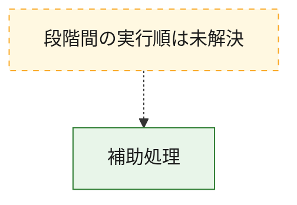
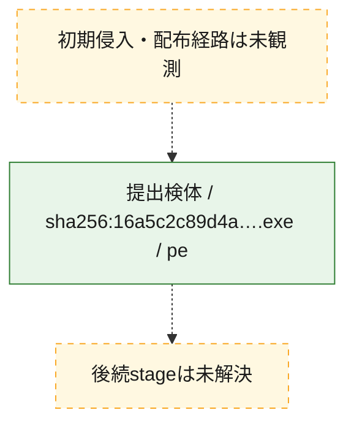
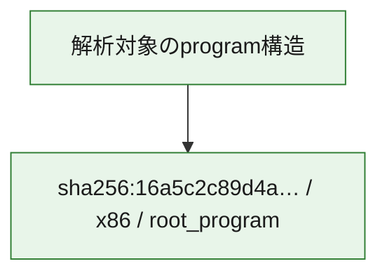

# 全体ロジック：16a5c2c89d4adca402b6ea15a6412a811140962dfdfbd737eda65019c87fe451

代表関数から主要なmalware処理段階を自動分類できませんでした。

## 読み方

- phaseの掲載順は解析上の整理順です。observed_call_edgesがない段階間の実行順を断定しません。
- 図の実線は静的に観測した関係、点線と黄色のノードは未観測・未解決の関係を示します。
- 図は静的な要約であり、動的実行を再現するものではありません。
- 詳細な関数解説とfingerprintは[STATIC-LOGIC.md](STATIC-LOGIC.md)を参照してください。

## 静的可視化

### 実行フロー

### 感染チェーン

### モジュール関係

## 処理段階

### 1. 補助処理

主要処理を支える一般内部関数またはlibrary処理を確認します。
確度: `confirmed_static_function_evidence_with_limits`

- `16a5c2c89d4adca402b6ea15a6412a811140962dfdfbd737eda65019c87fe451:ghidra:140001b90` — 検体内部の一般処理を実装する関数です。 状態: `limited_bad_instruction_or_flow`、選定理由: `context_representative`, `reviewed_call_centrality:1`
- `16a5c2c89d4adca402b6ea15a6412a811140962dfdfbd737eda65019c87fe451:ghidra:140001cb4` — 検体内部の一般処理を実装する関数です。 状態: `limited_bad_instruction_or_flow`、選定理由: `context_representative`, `reviewed_call_centrality:1`
- `16a5c2c89d4adca402b6ea15a6412a811140962dfdfbd737eda65019c87fe451:ghidra:140001cd8` — 検体内部の一般処理を実装する関数です。 状態: `limited_bad_instruction_or_flow`、選定理由: `context_representative`, `reviewed_call_centrality:1`
- `16a5c2c89d4adca402b6ea15a6412a811140962dfdfbd737eda65019c87fe451:ghidra:140001d5c` — 検体内部の一般処理を実装する関数です。 状態: `limited_bad_instruction_or_flow`、選定理由: `context_representative`, `reviewed_call_centrality:1`
- `16a5c2c89d4adca402b6ea15a6412a811140962dfdfbd737eda65019c87fe451:ghidra:140001db0` — 検体内部の一般処理を実装する関数です。 状態: `limited_bad_instruction_or_flow`、選定理由: `context_representative`, `reviewed_call_centrality:1`
- `16a5c2c89d4adca402b6ea15a6412a811140962dfdfbd737eda65019c87fe451:ghidra:140001ee8` — 検体内部の一般処理を実装する関数です。 状態: `limited_bad_instruction_or_flow`、選定理由: `context_representative`, `reviewed_call_centrality:1`
- `16a5c2c89d4adca402b6ea15a6412a811140962dfdfbd737eda65019c87fe451:ghidra:140001f1c` — 検体内部の一般処理を実装する関数です。 状態: `limited_bad_instruction_or_flow`、選定理由: `context_representative`, `reviewed_call_centrality:1`
- `16a5c2c89d4adca402b6ea15a6412a811140962dfdfbd737eda65019c87fe451:ghidra:140001f98` — 検体内部の一般処理を実装する関数です。 状態: `limited_bad_instruction_or_flow`、選定理由: `context_representative`, `reviewed_call_centrality:1`
- `16a5c2c89d4adca402b6ea15a6412a811140962dfdfbd737eda65019c87fe451:ghidra:140002070` — 検体内部の一般処理を実装する関数です。 状態: `limited_bad_instruction_or_flow`、選定理由: `context_representative`, `reviewed_call_centrality:1`
- `16a5c2c89d4adca402b6ea15a6412a811140962dfdfbd737eda65019c87fe451:ghidra:140002178` — 検体内部の一般処理を実装する関数です。 状態: `limited_bad_instruction_or_flow`、選定理由: `context_representative`, `reviewed_call_centrality:1`
- `16a5c2c89d4adca402b6ea15a6412a811140962dfdfbd737eda65019c87fe451:ghidra:140002288` — 検体内部の一般処理を実装する関数です。 状態: `limited_bad_instruction_or_flow`、選定理由: `context_representative`, `reviewed_call_centrality:1`
- `16a5c2c89d4adca402b6ea15a6412a811140962dfdfbd737eda65019c87fe451:ghidra:1400023bc` — 検体内部の一般処理を実装する関数です。 状態: `limited_bad_instruction_or_flow`、選定理由: `context_representative`, `reviewed_call_centrality:1`
- `16a5c2c89d4adca402b6ea15a6412a811140962dfdfbd737eda65019c87fe451:ghidra:140002468` — 検体内部の一般処理を実装する関数です。 状態: `limited_bad_instruction_or_flow`、選定理由: `context_representative`, `reviewed_call_centrality:1`
- `16a5c2c89d4adca402b6ea15a6412a811140962dfdfbd737eda65019c87fe451:ghidra:140002504` — 検体内部の一般処理を実装する関数です。 状態: `limited_bad_instruction_or_flow`、選定理由: `context_representative`, `reviewed_call_centrality:1`
- `16a5c2c89d4adca402b6ea15a6412a811140962dfdfbd737eda65019c87fe451:ghidra:140002688` — 検体内部の一般処理を実装する関数です。 状態: `limited_bad_instruction_or_flow`、選定理由: `context_representative`, `reviewed_call_centrality:1`
- `16a5c2c89d4adca402b6ea15a6412a811140962dfdfbd737eda65019c87fe451:ghidra:140002854` — 検体内部の一般処理を実装する関数です。 状態: `limited_bad_instruction_or_flow`、選定理由: `context_representative`, `reviewed_call_centrality:1`
- `16a5c2c89d4adca402b6ea15a6412a811140962dfdfbd737eda65019c87fe451:ghidra:140002a6c` — 検体内部の一般処理を実装する関数です。 状態: `limited_bad_instruction_or_flow`、選定理由: `context_representative`, `reviewed_call_centrality:1`
- `16a5c2c89d4adca402b6ea15a6412a811140962dfdfbd737eda65019c87fe451:ghidra:140002ab0` — 検体内部の一般処理を実装する関数です。 状態: `limited_bad_instruction_or_flow`、選定理由: `context_representative`, `reviewed_call_centrality:1`
- `16a5c2c89d4adca402b6ea15a6412a811140962dfdfbd737eda65019c87fe451:ghidra:140002b00` — 検体内部の一般処理を実装する関数です。 状態: `limited_bad_instruction_or_flow`、選定理由: `context_representative`, `reviewed_call_centrality:1`
- `16a5c2c89d4adca402b6ea15a6412a811140962dfdfbd737eda65019c87fe451:ghidra:140002bc4` — 検体内部の一般処理を実装する関数です。 状態: `limited_bad_instruction_or_flow`、選定理由: `context_representative`, `reviewed_call_centrality:1`
- `16a5c2c89d4adca402b6ea15a6412a811140962dfdfbd737eda65019c87fe451:ghidra:140002c9c` — 検体内部の一般処理を実装する関数です。 状態: `limited_bad_instruction_or_flow`、選定理由: `context_representative`, `reviewed_call_centrality:1`
- `16a5c2c89d4adca402b6ea15a6412a811140962dfdfbd737eda65019c87fe451:ghidra:140002d88` — 検体内部の一般処理を実装する関数です。 状態: `limited_bad_instruction_or_flow`、選定理由: `context_representative`, `reviewed_call_centrality:1`
- `16a5c2c89d4adca402b6ea15a6412a811140962dfdfbd737eda65019c87fe451:ghidra:140002e40` — 検体内部の一般処理を実装する関数です。 状態: `limited_bad_instruction_or_flow`、選定理由: `context_representative`, `reviewed_call_centrality:1`
- `16a5c2c89d4adca402b6ea15a6412a811140962dfdfbd737eda65019c87fe451:ghidra:140003274` — 検体内部の一般処理を実装する関数です。 状態: `limited_bad_instruction_or_flow`、選定理由: `context_representative`, `reviewed_call_centrality:1`
- `16a5c2c89d4adca402b6ea15a6412a811140962dfdfbd737eda65019c87fe451:ghidra:14000337c` — 検体内部の一般処理を実装する関数です。 状態: `limited_bad_instruction_or_flow`、選定理由: `context_representative`, `reviewed_call_centrality:1`
- `16a5c2c89d4adca402b6ea15a6412a811140962dfdfbd737eda65019c87fe451:ghidra:14000348c` — 検体内部の一般処理を実装する関数です。 状態: `limited_bad_instruction_or_flow`、選定理由: `context_representative`, `reviewed_call_centrality:1`
- `16a5c2c89d4adca402b6ea15a6412a811140962dfdfbd737eda65019c87fe451:ghidra:1400035a4` — 検体内部の一般処理を実装する関数です。 状態: `limited_bad_instruction_or_flow`、選定理由: `context_representative`, `reviewed_call_centrality:1`
- `16a5c2c89d4adca402b6ea15a6412a811140962dfdfbd737eda65019c87fe451:ghidra:140003620` — 検体内部の一般処理を実装する関数です。 状態: `limited_bad_instruction_or_flow`、選定理由: `context_representative`, `reviewed_call_centrality:1`
- `16a5c2c89d4adca402b6ea15a6412a811140962dfdfbd737eda65019c87fe451:ghidra:1400036ac` — 検体内部の一般処理を実装する関数です。 状態: `limited_bad_instruction_or_flow`、選定理由: `context_representative`, `reviewed_call_centrality:1`
- `16a5c2c89d4adca402b6ea15a6412a811140962dfdfbd737eda65019c87fe451:ghidra:14000378c` — 検体内部の一般処理を実装する関数です。 状態: `limited_bad_instruction_or_flow`、選定理由: `context_representative`, `reviewed_call_centrality:1`
- `16a5c2c89d4adca402b6ea15a6412a811140962dfdfbd737eda65019c87fe451:ghidra:140003848` — 検体内部の一般処理を実装する関数です。 状態: `limited_bad_instruction_or_flow`、選定理由: `context_representative`, `reviewed_call_centrality:1`
- `16a5c2c89d4adca402b6ea15a6412a811140962dfdfbd737eda65019c87fe451:ghidra:1400038fc` — 検体内部の一般処理を実装する関数です。 状態: `limited_bad_instruction_or_flow`、選定理由: `context_representative`, `reviewed_call_centrality:1`

## 観測したcall関係

- `ghidra-function:05c0e34565ae29e31c9d3262` → `ghidra-external:81024966beb4ccab4497b9cd` （`unclassified` → `unclassified`）
- `ghidra-function:19841f0ec07b4e42f8086370` → `ghidra-external:81024966beb4ccab4497b9cd` （`unclassified` → `unclassified`）
- `ghidra-function:1c26f428446bd89e3ec61b75` → `ghidra-external:81024966beb4ccab4497b9cd` （`unclassified` → `unclassified`）
- `ghidra-function:1c6466ff2eefc57869fc073f` → `ghidra-external:81024966beb4ccab4497b9cd` （`unclassified` → `unclassified`）
- `ghidra-function:203a244f979a09775bc9a05f` → `ghidra-external:81024966beb4ccab4497b9cd` （`unclassified` → `unclassified`）
- `ghidra-function:2243a2351f02b183781437e8` → `ghidra-external:81024966beb4ccab4497b9cd` （`unclassified` → `unclassified`）
- `ghidra-function:252b4aa1c38f7bc923aa6137` → `ghidra-external:81024966beb4ccab4497b9cd` （`unclassified` → `unclassified`）
- `ghidra-function:4832067f4417f5ec531df36c` → `ghidra-external:81024966beb4ccab4497b9cd` （`unclassified` → `unclassified`）
- `ghidra-function:4a5308e66f142fb7087680c3` → `ghidra-external:81024966beb4ccab4497b9cd` （`unclassified` → `unclassified`）
- `ghidra-function:4ffe977ed839fc48eb271568` → `ghidra-external:81024966beb4ccab4497b9cd` （`unclassified` → `unclassified`）
- `ghidra-function:53cc0626c2a2cda5c697004c` → `ghidra-external:81024966beb4ccab4497b9cd` （`unclassified` → `unclassified`）
- `ghidra-function:543ba461af170e61ede242f3` → `ghidra-external:81024966beb4ccab4497b9cd` （`unclassified` → `unclassified`）
- `ghidra-function:59a92a0ccfc5159162e935a5` → `ghidra-external:81024966beb4ccab4497b9cd` （`unclassified` → `unclassified`）
- `ghidra-function:5a0a710f03e790c9da574a74` → `ghidra-external:81024966beb4ccab4497b9cd` （`unclassified` → `unclassified`）
- `ghidra-function:5ba26e918221130dd0399109` → `ghidra-external:81024966beb4ccab4497b9cd` （`unclassified` → `unclassified`）
- `ghidra-function:62f36a356ea1f5bc844e5519` → `ghidra-external:81024966beb4ccab4497b9cd` （`unclassified` → `unclassified`）
- `ghidra-function:630c8b300d5d229dc9ebf308` → `ghidra-external:81024966beb4ccab4497b9cd` （`unclassified` → `unclassified`）
- `ghidra-function:6b50d043d9ca6409e4be94f0` → `ghidra-external:81024966beb4ccab4497b9cd` （`unclassified` → `unclassified`）
- `ghidra-function:6f43eba966f18f2f9695076e` → `ghidra-external:81024966beb4ccab4497b9cd` （`unclassified` → `unclassified`）
- `ghidra-function:8e74dd4011e90e6918149675` → `ghidra-external:81024966beb4ccab4497b9cd` （`unclassified` → `unclassified`）
- `ghidra-function:b04d9545f40172b14b1ff392` → `ghidra-external:81024966beb4ccab4497b9cd` （`unclassified` → `unclassified`）
- `ghidra-function:b51f871f88551d255eb0a912` → `ghidra-external:81024966beb4ccab4497b9cd` （`unclassified` → `unclassified`）
- `ghidra-function:b864f48b20f900b1763605bc` → `ghidra-external:81024966beb4ccab4497b9cd` （`unclassified` → `unclassified`）
- `ghidra-function:c4797a912b1cdd96b260ee06` → `ghidra-external:81024966beb4ccab4497b9cd` （`unclassified` → `unclassified`）
- `ghidra-function:db41f76abb5a9081cdaec1df` → `ghidra-external:81024966beb4ccab4497b9cd` （`unclassified` → `unclassified`）
- `ghidra-function:dc513e7bb3686d95a1c316fb` → `ghidra-external:81024966beb4ccab4497b9cd` （`unclassified` → `unclassified`）
- `ghidra-function:e59c684103b2c085e0aee60e` → `ghidra-external:81024966beb4ccab4497b9cd` （`unclassified` → `unclassified`）
- `ghidra-function:ec64df7048f9f7e807bd19da` → `ghidra-external:81024966beb4ccab4497b9cd` （`unclassified` → `unclassified`）
- `ghidra-function:f0334c657fa4d94ad571a201` → `ghidra-external:81024966beb4ccab4497b9cd` （`unclassified` → `unclassified`）
- `ghidra-function:f2ff4812499ee1eabba027d4` → `ghidra-external:81024966beb4ccab4497b9cd` （`unclassified` → `unclassified`）
- `ghidra-function:f7a96673c29c8eb5c662a2dd` → `ghidra-external:81024966beb4ccab4497b9cd` （`unclassified` → `unclassified`）
- `ghidra-function:fb3a716697859efd9aa73cf1` → `ghidra-external:81024966beb4ccab4497b9cd` （`unclassified` → `unclassified`）

## 解析範囲と制約

- 選定外関数は全体inventoryへ残しますが、関数本体の個別解説対象にはしていません。
- indirect call、難読化、packer、VM、壊れたcontrol flowによりcall関係が欠落する場合があります。
- 文書は静的解析に基づき、検体実行や外部通信による動的確認は行っていません。
