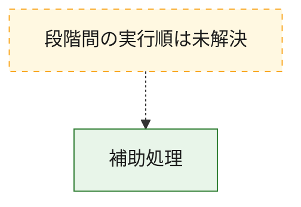
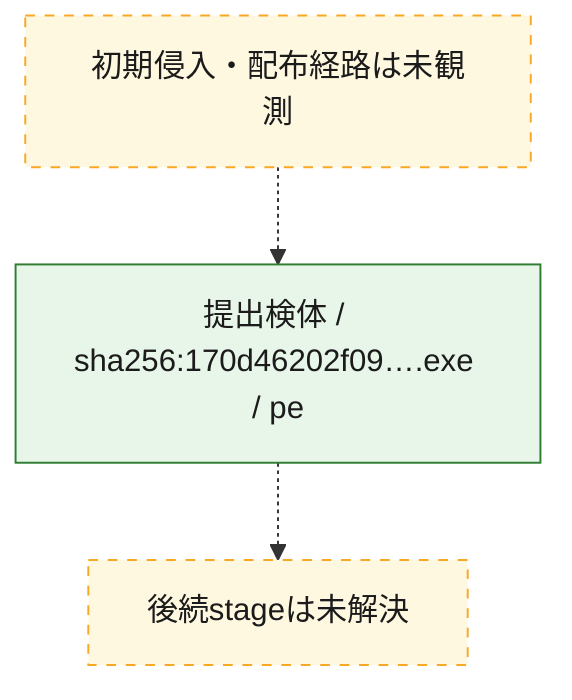
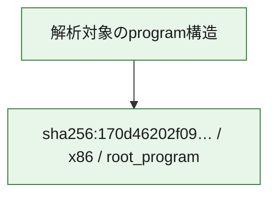

# 全体ロジック：170d46202f09e9b3a5cbb5e2056123838e7370e5f4e5edf7f4c4497d47842d01

代表関数から主要なmalware処理段階を自動分類できませんでした。

## 読み方

- phaseの掲載順は解析上の整理順です。observed_call_edgesがない段階間の実行順を断定しません。
- 図の実線は静的に観測した関係、点線と黄色のノードは未観測・未解決の関係を示します。
- 図は静的な要約であり、動的実行を再現するものではありません。
- 詳細な関数解説とfingerprintは[STATIC-LOGIC.md](STATIC-LOGIC.md)を参照してください。

## 静的可視化

### 実行フロー

### 感染チェーン

### モジュール関係

## 処理段階

### 1. 補助処理

主要処理を支える一般内部関数またはlibrary処理を確認します。
確度: `confirmed_static_function_evidence`

- `170d46202f09e9b3a5cbb5e2056123838e7370e5f4e5edf7f4c4497d47842d01:ghidra:00401080` — compiler生成処理または汎用library処理とみられる関数です。 状態: `succeeded`、選定理由: `meaningful_symbol_name`, `reviewed_call_centrality:3`
- `170d46202f09e9b3a5cbb5e2056123838e7370e5f4e5edf7f4c4497d47842d01:ghidra:004011a0` — compiler生成処理または汎用library処理とみられる関数です。 状態: `succeeded`、選定理由: `meaningful_symbol_name`, `reviewed_call_centrality:3`
- `170d46202f09e9b3a5cbb5e2056123838e7370e5f4e5edf7f4c4497d47842d01:ghidra:00401200` — compiler生成処理または汎用library処理とみられる関数です。 状態: `succeeded`、選定理由: `meaningful_symbol_name`, `reviewed_call_centrality:4`
- `170d46202f09e9b3a5cbb5e2056123838e7370e5f4e5edf7f4c4497d47842d01:ghidra:00401280` — compiler生成処理または汎用library処理とみられる関数です。 状態: `succeeded`、選定理由: `meaningful_symbol_name`, `reviewed_call_centrality:6`
- `170d46202f09e9b3a5cbb5e2056123838e7370e5f4e5edf7f4c4497d47842d01:ghidra:00401340` — compiler生成処理または汎用library処理とみられる関数です。 状態: `succeeded`、選定理由: `meaningful_symbol_name`, `reviewed_call_centrality:6`
- `170d46202f09e9b3a5cbb5e2056123838e7370e5f4e5edf7f4c4497d47842d01:ghidra:00401460` — compiler生成処理または汎用library処理とみられる関数です。 状態: `succeeded`、選定理由: `meaningful_symbol_name`, `reviewed_call_centrality:9`
- `170d46202f09e9b3a5cbb5e2056123838e7370e5f4e5edf7f4c4497d47842d01:ghidra:004018e0` — compiler生成処理または汎用library処理とみられる関数です。 状態: `succeeded`、選定理由: `meaningful_symbol_name`, `reviewed_call_centrality:3`
- `170d46202f09e9b3a5cbb5e2056123838e7370e5f4e5edf7f4c4497d47842d01:ghidra:00401a20` — compiler生成処理または汎用library処理とみられる関数です。 状態: `succeeded`、選定理由: `meaningful_symbol_name`, `reviewed_call_centrality:3`
- `170d46202f09e9b3a5cbb5e2056123838e7370e5f4e5edf7f4c4497d47842d01:ghidra:00401aa0` — compiler生成処理または汎用library処理とみられる関数です。 状態: `succeeded`、選定理由: `meaningful_symbol_name`, `reviewed_call_centrality:4`
- `170d46202f09e9b3a5cbb5e2056123838e7370e5f4e5edf7f4c4497d47842d01:ghidra:00401b00` — compiler生成処理または汎用library処理とみられる関数です。 状態: `succeeded`、選定理由: `meaningful_symbol_name`, `reviewed_call_centrality:11`
- `170d46202f09e9b3a5cbb5e2056123838e7370e5f4e5edf7f4c4497d47842d01:ghidra:00402040` — compiler生成処理または汎用library処理とみられる関数です。 状態: `succeeded`、選定理由: `meaningful_symbol_name`, `reviewed_call_centrality:11`
- `170d46202f09e9b3a5cbb5e2056123838e7370e5f4e5edf7f4c4497d47842d01:ghidra:00402940` — compiler生成処理または汎用library処理とみられる関数です。 状態: `succeeded`、選定理由: `meaningful_symbol_name`, `reviewed_call_centrality:3`
- `170d46202f09e9b3a5cbb5e2056123838e7370e5f4e5edf7f4c4497d47842d01:ghidra:004029c0` — compiler生成処理または汎用library処理とみられる関数です。 状態: `succeeded`、選定理由: `meaningful_symbol_name`, `reviewed_call_centrality:3`
- `170d46202f09e9b3a5cbb5e2056123838e7370e5f4e5edf7f4c4497d47842d01:ghidra:00403820` — compiler生成処理または汎用library処理とみられる関数です。 状態: `succeeded`、選定理由: `meaningful_symbol_name`, `reviewed_call_centrality:2`
- `170d46202f09e9b3a5cbb5e2056123838e7370e5f4e5edf7f4c4497d47842d01:ghidra:00403860` — compiler生成処理または汎用library処理とみられる関数です。 状態: `succeeded`、選定理由: `meaningful_symbol_name`, `reviewed_call_centrality:3`
- `170d46202f09e9b3a5cbb5e2056123838e7370e5f4e5edf7f4c4497d47842d01:ghidra:00403900` — compiler生成処理または汎用library処理とみられる関数です。 状態: `succeeded`、選定理由: `meaningful_symbol_name`, `reviewed_call_centrality:3`
- `170d46202f09e9b3a5cbb5e2056123838e7370e5f4e5edf7f4c4497d47842d01:ghidra:004039e0` — compiler生成処理または汎用library処理とみられる関数です。 状態: `succeeded`、選定理由: `meaningful_symbol_name`, `reviewed_call_centrality:4`
- `170d46202f09e9b3a5cbb5e2056123838e7370e5f4e5edf7f4c4497d47842d01:ghidra:00403ae0` — compiler生成処理または汎用library処理とみられる関数です。 状態: `succeeded`、選定理由: `meaningful_symbol_name`, `reviewed_call_centrality:1`
- `170d46202f09e9b3a5cbb5e2056123838e7370e5f4e5edf7f4c4497d47842d01:ghidra:004040a0` — compiler生成処理または汎用library処理とみられる関数です。 状態: `succeeded`、選定理由: `meaningful_symbol_name`, `reviewed_call_centrality:3`
- `170d46202f09e9b3a5cbb5e2056123838e7370e5f4e5edf7f4c4497d47842d01:ghidra:004040e0` — compiler生成処理または汎用library処理とみられる関数です。 状態: `succeeded`、選定理由: `meaningful_symbol_name`, `reviewed_call_centrality:3`
- `170d46202f09e9b3a5cbb5e2056123838e7370e5f4e5edf7f4c4497d47842d01:ghidra:00404240` — compiler生成処理または汎用library処理とみられる関数です。 状態: `succeeded`、選定理由: `meaningful_symbol_name`, `reviewed_call_centrality:3`
- `170d46202f09e9b3a5cbb5e2056123838e7370e5f4e5edf7f4c4497d47842d01:ghidra:00404280` — compiler生成処理または汎用library処理とみられる関数です。 状態: `succeeded`、選定理由: `meaningful_symbol_name`, `reviewed_call_centrality:3`
- `170d46202f09e9b3a5cbb5e2056123838e7370e5f4e5edf7f4c4497d47842d01:ghidra:004042c0` — compiler生成処理または汎用library処理とみられる関数です。 状態: `succeeded`、選定理由: `meaningful_symbol_name`, `reviewed_call_centrality:3`
- `170d46202f09e9b3a5cbb5e2056123838e7370e5f4e5edf7f4c4497d47842d01:ghidra:00404300` — compiler生成処理または汎用library処理とみられる関数です。 状態: `succeeded`、選定理由: `meaningful_symbol_name`, `reviewed_call_centrality:5`
- `170d46202f09e9b3a5cbb5e2056123838e7370e5f4e5edf7f4c4497d47842d01:ghidra:004043c0` — compiler生成処理または汎用library処理とみられる関数です。 状態: `succeeded`、選定理由: `meaningful_symbol_name`, `reviewed_call_centrality:5`
- `170d46202f09e9b3a5cbb5e2056123838e7370e5f4e5edf7f4c4497d47842d01:ghidra:00404480` — compiler生成処理または汎用library処理とみられる関数です。 状態: `succeeded`、選定理由: `meaningful_symbol_name`, `reviewed_call_centrality:3`
- `170d46202f09e9b3a5cbb5e2056123838e7370e5f4e5edf7f4c4497d47842d01:ghidra:004044e0` — compiler生成処理または汎用library処理とみられる関数です。 状態: `succeeded`、選定理由: `meaningful_symbol_name`, `reviewed_call_centrality:3`
- `170d46202f09e9b3a5cbb5e2056123838e7370e5f4e5edf7f4c4497d47842d01:ghidra:00404540` — compiler生成処理または汎用library処理とみられる関数です。 状態: `succeeded`、選定理由: `meaningful_symbol_name`, `reviewed_call_centrality:8`
- `170d46202f09e9b3a5cbb5e2056123838e7370e5f4e5edf7f4c4497d47842d01:ghidra:00404640` — compiler生成処理または汎用library処理とみられる関数です。 状態: `succeeded`、選定理由: `meaningful_symbol_name`, `reviewed_call_centrality:6`
- `170d46202f09e9b3a5cbb5e2056123838e7370e5f4e5edf7f4c4497d47842d01:ghidra:00404a00` — compiler生成処理または汎用library処理とみられる関数です。 状態: `succeeded`、選定理由: `meaningful_symbol_name`, `reviewed_call_centrality:3`
- `170d46202f09e9b3a5cbb5e2056123838e7370e5f4e5edf7f4c4497d47842d01:ghidra:00404a60` — compiler生成処理または汎用library処理とみられる関数です。 状態: `succeeded`、選定理由: `meaningful_symbol_name`, `reviewed_call_centrality:3`
- `170d46202f09e9b3a5cbb5e2056123838e7370e5f4e5edf7f4c4497d47842d01:ghidra:00404ac0` — compiler生成処理または汎用library処理とみられる関数です。 状態: `succeeded`、選定理由: `meaningful_symbol_name`, `reviewed_call_centrality:3`

## 観測したcall関係

- 代表関数間で直接解決できた呼出関係はありません。

## 解析範囲と制約

- 選定外関数は全体inventoryへ残しますが、関数本体の個別解説対象にはしていません。
- indirect call、難読化、packer、VM、壊れたcontrol flowによりcall関係が欠落する場合があります。
- 文書は静的解析に基づき、検体実行や外部通信による動的確認は行っていません。
