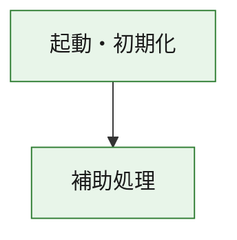
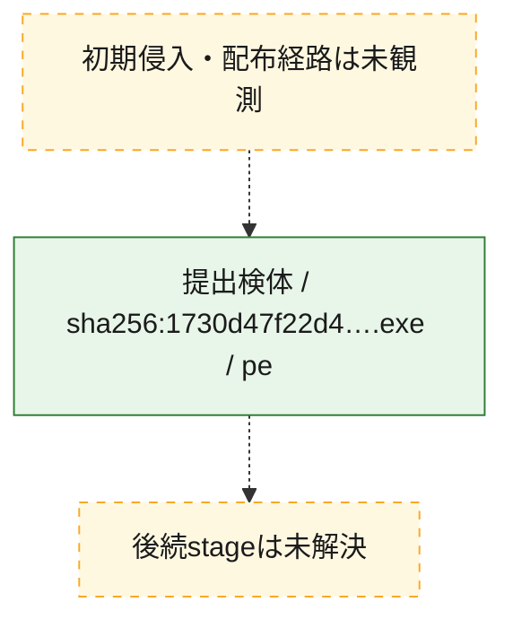
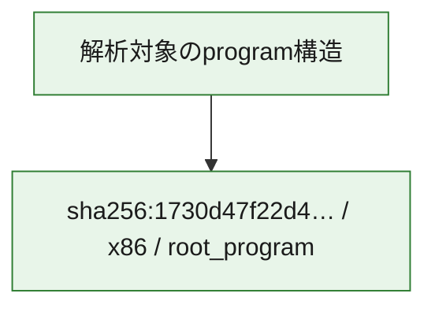

# 全体ロジック：1730d47f22d4f74dcb5fb9bbc9e532fbba0d276b2a0cda6c931bf3c091af7a4d

代表関数の静的証跡から、起動・初期化の処理群を確認しました。

## 読み方

- phaseの掲載順は解析上の整理順です。observed_call_edgesがない段階間の実行順を断定しません。
- 図の実線は静的に観測した関係、点線と黄色のノードは未観測・未解決の関係を示します。
- 図は静的な要約であり、動的実行を再現するものではありません。
- 詳細な関数解説とfingerprintは[STATIC-LOGIC.md](STATIC-LOGIC.md)を参照してください。

## 静的可視化

### 実行フロー

### 感染チェーン

### モジュール関係

## 処理段階

### 1. 起動・初期化

entry pointから初期化と後続処理への移行を確認します。
確度: `confirmed_static_function_evidence`

- `1730d47f22d4f74dcb5fb9bbc9e532fbba0d276b2a0cda6c931bf3c091af7a4d:ghidra:180001010` — 初期化と主要処理への分岐を行う入口関数です。 状態: `succeeded`、選定理由: `entry_point`, `meaningful_symbol_name`, `reviewed_call_centrality:22`, `role:entrypoint`, `small_program_complete_context`

### 2. 補助処理

主要処理を支える一般内部関数またはlibrary処理を確認します。
確度: `confirmed_static_function_evidence`

- `1730d47f22d4f74dcb5fb9bbc9e532fbba0d276b2a0cda6c931bf3c091af7a4d:ghidra:180001240` — 検体内部の一般処理を実装する関数です。 状態: `succeeded`、選定理由: `context_representative`, `reviewed_call_centrality:2`, `small_program_complete_context`
- `1730d47f22d4f74dcb5fb9bbc9e532fbba0d276b2a0cda6c931bf3c091af7a4d:ghidra:180001350` — 検体内部の一般処理を実装する関数です。 状態: `succeeded`、選定理由: `context_representative`, `reviewed_call_centrality:25`, `small_program_complete_context`
- `1730d47f22d4f74dcb5fb9bbc9e532fbba0d276b2a0cda6c931bf3c091af7a4d:ghidra:180003780` — 検体内部の一般処理を実装する関数です。 状態: `succeeded`、選定理由: `context_representative`, `reviewed_call_centrality:2`, `small_program_complete_context`
- `1730d47f22d4f74dcb5fb9bbc9e532fbba0d276b2a0cda6c931bf3c091af7a4d:ghidra:1800038e0` — 検体内部の一般処理を実装する関数です。 状態: `succeeded`、選定理由: `context_representative`, `reviewed_call_centrality:2`, `small_program_complete_context`

## 観測したcall関係

- `1730d47f22d4f74dcb5fb9bbc9e532fbba0d276b2a0cda6c931bf3c091af7a4d:ghidra:180001010` → `1730d47f22d4f74dcb5fb9bbc9e532fbba0d276b2a0cda6c931bf3c091af7a4d:ghidra:180001240` （`startup` → `support`）
- `1730d47f22d4f74dcb5fb9bbc9e532fbba0d276b2a0cda6c931bf3c091af7a4d:ghidra:180001010` → `1730d47f22d4f74dcb5fb9bbc9e532fbba0d276b2a0cda6c931bf3c091af7a4d:ghidra:180001350` （`startup` → `support`）
- `1730d47f22d4f74dcb5fb9bbc9e532fbba0d276b2a0cda6c931bf3c091af7a4d:ghidra:180001350` → `1730d47f22d4f74dcb5fb9bbc9e532fbba0d276b2a0cda6c931bf3c091af7a4d:ghidra:180001240` （`support` → `support`）
- `1730d47f22d4f74dcb5fb9bbc9e532fbba0d276b2a0cda6c931bf3c091af7a4d:ghidra:180001350` → `1730d47f22d4f74dcb5fb9bbc9e532fbba0d276b2a0cda6c931bf3c091af7a4d:ghidra:180003780` （`support` → `support`）
- `1730d47f22d4f74dcb5fb9bbc9e532fbba0d276b2a0cda6c931bf3c091af7a4d:ghidra:180001350` → `1730d47f22d4f74dcb5fb9bbc9e532fbba0d276b2a0cda6c931bf3c091af7a4d:ghidra:1800038e0` （`support` → `support`）
- `1730d47f22d4f74dcb5fb9bbc9e532fbba0d276b2a0cda6c931bf3c091af7a4d:ghidra:180003780` → `1730d47f22d4f74dcb5fb9bbc9e532fbba0d276b2a0cda6c931bf3c091af7a4d:ghidra:1800038e0` （`support` → `support`）
- `ghidra-function:09ed6da93a2300c49ad9bd7a` → `ghidra-function:ab18dccbf4b6f3ecc5c2dc9c` （`unclassified` → `unclassified`）
- `ghidra-function:21d958f3b16c9ede9094b4fc` → `ghidra-external:07e929254607bdee41021d33` （`unclassified` → `unclassified`）
- `ghidra-function:21d958f3b16c9ede9094b4fc` → `ghidra-external:11a0826bf77586a396827ad8` （`unclassified` → `unclassified`）
- `ghidra-function:21d958f3b16c9ede9094b4fc` → `ghidra-external:162ebabcedf14c00a8d1df10` （`unclassified` → `unclassified`）
- `ghidra-function:21d958f3b16c9ede9094b4fc` → `ghidra-external:18cde80f40c2612f6410b1d5` （`unclassified` → `unclassified`）
- `ghidra-function:21d958f3b16c9ede9094b4fc` → `ghidra-external:3afef1225606622a8ec79572` （`unclassified` → `unclassified`）
- `ghidra-function:21d958f3b16c9ede9094b4fc` → `ghidra-external:4e4c0293c1516555eb8df2a8` （`unclassified` → `unclassified`）
- `ghidra-function:21d958f3b16c9ede9094b4fc` → `ghidra-external:58e89626d721bd25dc4482eb` （`unclassified` → `unclassified`）
- `ghidra-function:21d958f3b16c9ede9094b4fc` → `ghidra-external:5c550d087c7840a67897d94e` （`unclassified` → `unclassified`）
- `ghidra-function:21d958f3b16c9ede9094b4fc` → `ghidra-external:656feb387c8b9ccc8c59371a` （`unclassified` → `unclassified`）
- `ghidra-function:21d958f3b16c9ede9094b4fc` → `ghidra-external:68efbf04c4bd6c21fc4cc906` （`unclassified` → `unclassified`）
- `ghidra-function:21d958f3b16c9ede9094b4fc` → `ghidra-external:9e99cece6bc7969108ae496a` （`unclassified` → `unclassified`）
- `ghidra-function:21d958f3b16c9ede9094b4fc` → `ghidra-external:a609c25dfab418155dddd0bb` （`unclassified` → `unclassified`）
- `ghidra-function:21d958f3b16c9ede9094b4fc` → `ghidra-external:a68b59150ca346e9626106bf` （`unclassified` → `unclassified`）
- `ghidra-function:21d958f3b16c9ede9094b4fc` → `ghidra-external:a8eaafa72fc41e67be5f988d` （`unclassified` → `unclassified`）
- `ghidra-function:21d958f3b16c9ede9094b4fc` → `ghidra-external:b0b4e6891f5b75715d7f51a2` （`unclassified` → `unclassified`）
- `ghidra-function:21d958f3b16c9ede9094b4fc` → `ghidra-external:b2800e9383d8e6c5cce2b1d5` （`unclassified` → `unclassified`）
- `ghidra-function:21d958f3b16c9ede9094b4fc` → `ghidra-external:c0c478c6d4176c9d46ba544d` （`unclassified` → `unclassified`）
- `ghidra-function:21d958f3b16c9ede9094b4fc` → `ghidra-external:d746aa8ff69487feafc99bd0` （`unclassified` → `unclassified`）
- `ghidra-function:21d958f3b16c9ede9094b4fc` → `ghidra-external:d887bc22d694f265c9ba54bf` （`unclassified` → `unclassified`）
- `ghidra-function:21d958f3b16c9ede9094b4fc` → `ghidra-external:e4279803103b5f2df1b55435` （`unclassified` → `unclassified`）
- `ghidra-function:21d958f3b16c9ede9094b4fc` → `ghidra-external:f44b9c374a531db67af67bc5` （`unclassified` → `unclassified`）
- `ghidra-function:21d958f3b16c9ede9094b4fc` → `ghidra-function:09ed6da93a2300c49ad9bd7a` （`unclassified` → `unclassified`）
- `ghidra-function:21d958f3b16c9ede9094b4fc` → `ghidra-function:ab18dccbf4b6f3ecc5c2dc9c` （`unclassified` → `unclassified`）
- `ghidra-function:21d958f3b16c9ede9094b4fc` → `ghidra-function:cd8873d8a423a6cf2264c224` （`unclassified` → `unclassified`）
- `ghidra-function:d22e977f9d2165bc3a8743c8` → `ghidra-function:05c525361395bdaf4abf7c5c` （`unclassified` → `unclassified`）
- `ghidra-function:d22e977f9d2165bc3a8743c8` → `ghidra-function:1555940b25cb5204312a2aad` （`unclassified` → `unclassified`）
- `ghidra-function:d22e977f9d2165bc3a8743c8` → `ghidra-function:19265c6f7f14214213f2cef7` （`unclassified` → `unclassified`）
- `ghidra-function:d22e977f9d2165bc3a8743c8` → `ghidra-function:21d958f3b16c9ede9094b4fc` （`unclassified` → `unclassified`）
- `ghidra-function:d22e977f9d2165bc3a8743c8` → `ghidra-function:2ceaf39f89206476cd84d2e4` （`unclassified` → `unclassified`）
- `ghidra-function:d22e977f9d2165bc3a8743c8` → `ghidra-function:39d90b222010980c21648789` （`unclassified` → `unclassified`）
- `ghidra-function:d22e977f9d2165bc3a8743c8` → `ghidra-function:8212166433e7db4e91962dbd` （`unclassified` → `unclassified`）
- `ghidra-function:d22e977f9d2165bc3a8743c8` → `ghidra-function:c0b080733a6f64ba1fa873da` （`unclassified` → `unclassified`）
- `ghidra-function:d22e977f9d2165bc3a8743c8` → `ghidra-function:cd8873d8a423a6cf2264c224` （`unclassified` → `unclassified`）
- `ghidra-function:d22e977f9d2165bc3a8743c8` → `ghidra-function:da6bb39ef4fc2b1698b59a1e` （`unclassified` → `unclassified`）
- `ghidra-function:d22e977f9d2165bc3a8743c8` → `ghidra-function:e97e9d9a59d4494daf3bb393` （`unclassified` → `unclassified`）
- `ghidra-function:d22e977f9d2165bc3a8743c8` → `ghidra-function:f2be7016eef1e2c7f5a9e631` （`unclassified` → `unclassified`）

## 解析範囲と制約

- 選定外関数は全体inventoryへ残しますが、関数本体の個別解説対象にはしていません。
- indirect call、難読化、packer、VM、壊れたcontrol flowによりcall関係が欠落する場合があります。
- 文書は静的解析に基づき、検体実行や外部通信による動的確認は行っていません。
