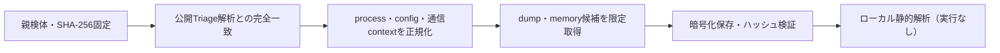

# Triage公開解析・後段取得証跡

## 完全ハッシュ一致

- [260924-qfls9svyaz](https://tria.ge/260924-qfls9svyaz): ファミリー候補 `未確定`、評価score `7`

## プロセス・通信

- 観測process: `attrib.exe, choice.exe, chrome.exe, cmd.exe, elevation_service.exe, findstr.exe, powershell.exe, svchost.exe, wscript.exe`
- raw commandは保存せず、command SHA-256と処理patternだけをJSONへ保持します。
- sandbox background trafficは`context_only`であり、C2へ自動昇格しません。

- 取得できませんでした。

## 後段取得物

- `4c022e27c56a8ddff040679496f38b43232811d59bdd33c33c6c6539f9517004` / `memory_image` / 65536 bytes / 親と同一: `false` / 静的解析: `未実施`
- `dcf141451b8ad95098b4dc90254875e13eb8b2d8eaf52f43d2be9e5634dc59c3` / `memory_image` / 65536 bytes / 親と同一: `false` / 静的解析: `未実施`
- `24aed6526459586ad2a840db900e22a28afc0e382ac72e498e87c98b9011c714` / `memory_image` / 139264 bytes / 親と同一: `false` / 静的解析: `未実施`
- `0da689b5e8ad8bf223aa7892967972ffc9c081a3d5803fedc4608f55b1f1b73f` / `memory_image` / 327680 bytes / 親と同一: `false` / 静的解析: `未実施`
- `13236d7063316aab26de325d297f69e7244c0b7031c53ea41d8b2dc453af2fec` / `memory_image` / 327680 bytes / 親と同一: `false` / 静的解析: `未実施`
- `1b2053be96e64bc320c1e99b1c2b8a4590aa9908af01387aab9d5b156418b91c` / `memory_image` / 53248 bytes / 親と同一: `false` / 静的解析: `未実施`
- `d0fd112b9a3ea93ea9c9ab8ed7975a2692ff091dfa862f9cca2faf35ac877444` / `memory_image` / 4096 bytes / 親と同一: `false` / 静的解析: `未実施`
- `bab60ec2ef368dc2350f8cde97af21e6a4be6160253b7d821615db35a860d0c1` / `memory_image` / 139264 bytes / 親と同一: `false` / 静的解析: `未実施`
- `d004c9beceeb71360946a98bd6d435a1a1d6025c0213ab5a328ec2ca37ac6d19` / `memory_image` / 10108928 bytes / 親と同一: `false` / 静的解析: `未実施`
- `49d010cea5b08c9e28860549877bc58092c06d9359c9f6d64a5db6e791443403` / `memory_image` / 10108928 bytes / 親と同一: `false` / 静的解析: `未実施`
- `11485c309ca9fe414ae24ce76143dda251f9c94041961532881f2dd5ff66bd26` / `memory_image` / 10108928 bytes / 親と同一: `false` / 静的解析: `未実施`
- `3222504d63aeb6cabe7a2cd91f8ddf3558a0595c425a4706b9df88eb12bd0d56` / `memory_image` / 10108928 bytes / 親と同一: `false` / 静的解析: `未実施`
- `6165dd391fa966f60e5414ff6e7d1ffd901418725839845b3b195568bf313a80` / `memory_image` / 10108928 bytes / 親と同一: `false` / 静的解析: `未実施`
- `a8367d1e89fea5dafc34af395f0ad8c06e0bb5e0c7ba2974345142501c7e9266` / `memory_image` / 10108928 bytes / 親と同一: `false` / 静的解析: `未実施`
- `8529cb7252b1ee5baaaca856b8a34b6f48b442f4ca8ea20ba1b51d343799db01` / `memory_image` / 10108928 bytes / 親と同一: `false` / 静的解析: `未実施`
- `5691e8a05a2098678d17920590608016b3f045c95bb4f6d53d81649d136a9beb` / `memory_image` / 122880 bytes / 親と同一: `false` / 静的解析: `未実施`
- `cf5b0e7bd0ed29e2df40d2885d689ff361740ae8035a57df6c34d9b83e28d416` / `memory_image` / 729088 bytes / 親と同一: `false` / 静的解析: `未実施`
- `a07a2824fb2d28b8c7c8365614a6cab95fa8aaf1ca01ee30f25dffc243b08f0f` / `memory_image` / 40960 bytes / 親と同一: `false` / 静的解析: `未実施`
- `0a92847061e65915c53eab22228415a0c5c40d20a9ed3a25d4568f67ddf24582` / `memory_image` / 122880 bytes / 親と同一: `false` / 静的解析: `未実施`
- `c072bcb7196172420a22b88ee42e730f3bb3b2e7ce716403a796b453b3344f97` / `memory_image` / 40960 bytes / 親と同一: `false` / 静的解析: `未実施`

## 判定境界

Triage由来のfamily、process、config、通信は外部sandbox証跡です。Config extractorが返したendpointはC2候補として扱いますが、静的設定復元またはprocess帰属とprotocol応答が揃うまでは確認済みC2とはしません。取得成果物と検体は実行していません。
