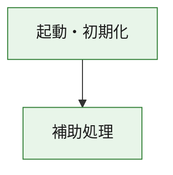
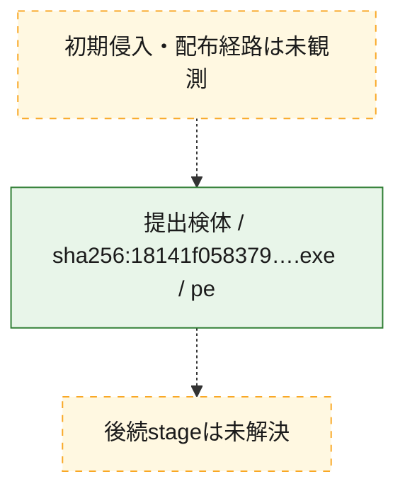
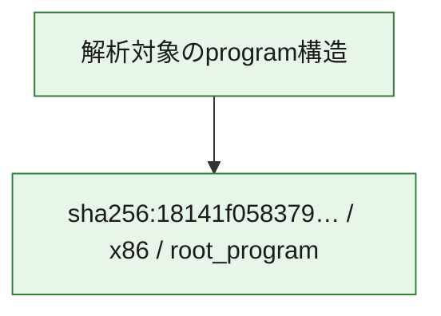

# 全体ロジック：18141f0583797aa26f75fc5a1605f6f3a1cca46b81f525284eafa9999e056ea2

代表関数の静的証跡から、起動・初期化の処理群を確認しました。

## 読み方

- phaseの掲載順は解析上の整理順です。observed_call_edgesがない段階間の実行順を断定しません。
- 図の実線は静的に観測した関係、点線と黄色のノードは未観測・未解決の関係を示します。
- 図は静的な要約であり、動的実行を再現するものではありません。
- 詳細な関数解説とfingerprintは[STATIC-LOGIC.md](STATIC-LOGIC.md)を参照してください。

## 静的可視化

### 実行フロー

### 感染チェーン

### モジュール関係

## 処理段階

### 1. 起動・初期化

entry pointから初期化と後続処理への移行を確認します。
確度: `confirmed_static_function_evidence`

- `18141f0583797aa26f75fc5a1605f6f3a1cca46b81f525284eafa9999e056ea2:ghidra:180001010` — 初期化と主要処理への分岐を行う入口関数です。 状態: `succeeded`、選定理由: `entry_point`, `meaningful_symbol_name`, `reviewed_call_centrality:22`, `role:entrypoint`, `small_program_complete_context`

### 2. 補助処理

主要処理を支える一般内部関数またはlibrary処理を確認します。
確度: `confirmed_static_function_evidence`

- `18141f0583797aa26f75fc5a1605f6f3a1cca46b81f525284eafa9999e056ea2:ghidra:180001240` — 検体内部の一般処理を実装する関数です。 状態: `succeeded`、選定理由: `context_representative`, `reviewed_call_centrality:2`, `small_program_complete_context`
- `18141f0583797aa26f75fc5a1605f6f3a1cca46b81f525284eafa9999e056ea2:ghidra:180001350` — 検体内部の一般処理を実装する関数です。 状態: `succeeded`、選定理由: `context_representative`, `reviewed_call_centrality:25`, `small_program_complete_context`
- `18141f0583797aa26f75fc5a1605f6f3a1cca46b81f525284eafa9999e056ea2:ghidra:180003780` — 検体内部の一般処理を実装する関数です。 状態: `succeeded`、選定理由: `context_representative`, `reviewed_call_centrality:2`, `small_program_complete_context`
- `18141f0583797aa26f75fc5a1605f6f3a1cca46b81f525284eafa9999e056ea2:ghidra:1800038e0` — 検体内部の一般処理を実装する関数です。 状態: `succeeded`、選定理由: `context_representative`, `reviewed_call_centrality:2`, `small_program_complete_context`

## 観測したcall関係

- `18141f0583797aa26f75fc5a1605f6f3a1cca46b81f525284eafa9999e056ea2:ghidra:180001010` → `18141f0583797aa26f75fc5a1605f6f3a1cca46b81f525284eafa9999e056ea2:ghidra:180001240` （`startup` → `support`）
- `18141f0583797aa26f75fc5a1605f6f3a1cca46b81f525284eafa9999e056ea2:ghidra:180001010` → `18141f0583797aa26f75fc5a1605f6f3a1cca46b81f525284eafa9999e056ea2:ghidra:180001350` （`startup` → `support`）
- `18141f0583797aa26f75fc5a1605f6f3a1cca46b81f525284eafa9999e056ea2:ghidra:180001350` → `18141f0583797aa26f75fc5a1605f6f3a1cca46b81f525284eafa9999e056ea2:ghidra:180001240` （`support` → `support`）
- `18141f0583797aa26f75fc5a1605f6f3a1cca46b81f525284eafa9999e056ea2:ghidra:180001350` → `18141f0583797aa26f75fc5a1605f6f3a1cca46b81f525284eafa9999e056ea2:ghidra:180003780` （`support` → `support`）
- `18141f0583797aa26f75fc5a1605f6f3a1cca46b81f525284eafa9999e056ea2:ghidra:180001350` → `18141f0583797aa26f75fc5a1605f6f3a1cca46b81f525284eafa9999e056ea2:ghidra:1800038e0` （`support` → `support`）
- `18141f0583797aa26f75fc5a1605f6f3a1cca46b81f525284eafa9999e056ea2:ghidra:180003780` → `18141f0583797aa26f75fc5a1605f6f3a1cca46b81f525284eafa9999e056ea2:ghidra:1800038e0` （`support` → `support`）
- `ghidra-function:8ea4515cd9b951b2709382f3` → `ghidra-function:54aa1fc3a90a7760b5d11467` （`unclassified` → `unclassified`）
- `ghidra-function:c1c8a89256a0773b32abbf8c` → `ghidra-external:02fbf96b9163c6073659e346` （`unclassified` → `unclassified`）
- `ghidra-function:c1c8a89256a0773b32abbf8c` → `ghidra-external:0c3d8e54b26d6c1cfa703903` （`unclassified` → `unclassified`）
- `ghidra-function:c1c8a89256a0773b32abbf8c` → `ghidra-external:2602706ff8f6985e9b36f16b` （`unclassified` → `unclassified`）
- `ghidra-function:c1c8a89256a0773b32abbf8c` → `ghidra-external:3a6eecbb26fb9ec1dae1813f` （`unclassified` → `unclassified`）
- `ghidra-function:c1c8a89256a0773b32abbf8c` → `ghidra-external:488fbde39c20948ca1e82d11` （`unclassified` → `unclassified`）
- `ghidra-function:c1c8a89256a0773b32abbf8c` → `ghidra-external:4a993a505f1c0da92c66511a` （`unclassified` → `unclassified`）
- `ghidra-function:c1c8a89256a0773b32abbf8c` → `ghidra-external:51f46394202113f2f1ac24b9` （`unclassified` → `unclassified`）
- `ghidra-function:c1c8a89256a0773b32abbf8c` → `ghidra-external:58862e95e1c78c94a8fe8d84` （`unclassified` → `unclassified`）
- `ghidra-function:c1c8a89256a0773b32abbf8c` → `ghidra-external:59e91535d84f4e70cc94774f` （`unclassified` → `unclassified`）
- `ghidra-function:c1c8a89256a0773b32abbf8c` → `ghidra-external:6b203e6a1e1bd0d5022f88ac` （`unclassified` → `unclassified`）
- `ghidra-function:c1c8a89256a0773b32abbf8c` → `ghidra-external:74fb1670d9225dab495e30b0` （`unclassified` → `unclassified`）
- `ghidra-function:c1c8a89256a0773b32abbf8c` → `ghidra-external:763f22cebc9dc34ad4aa8fea` （`unclassified` → `unclassified`）
- `ghidra-function:c1c8a89256a0773b32abbf8c` → `ghidra-external:8e7834b8e220dfb3126891f0` （`unclassified` → `unclassified`）
- `ghidra-function:c1c8a89256a0773b32abbf8c` → `ghidra-external:9a95f1197bd46efbe29e2220` （`unclassified` → `unclassified`）
- `ghidra-function:c1c8a89256a0773b32abbf8c` → `ghidra-external:a27ef58e159ce6a1b735eda7` （`unclassified` → `unclassified`）
- `ghidra-function:c1c8a89256a0773b32abbf8c` → `ghidra-external:b51412635eac1b236f40aa3b` （`unclassified` → `unclassified`）
- `ghidra-function:c1c8a89256a0773b32abbf8c` → `ghidra-external:db3fcff7527324b114b31f7a` （`unclassified` → `unclassified`）
- `ghidra-function:c1c8a89256a0773b32abbf8c` → `ghidra-external:e635599a286332eb02a9b778` （`unclassified` → `unclassified`）
- `ghidra-function:c1c8a89256a0773b32abbf8c` → `ghidra-external:e9eb22990a0e82d420060746` （`unclassified` → `unclassified`）
- `ghidra-function:c1c8a89256a0773b32abbf8c` → `ghidra-external:f1b5b2c6527f6ba69ad1e4cf` （`unclassified` → `unclassified`）
- `ghidra-function:c1c8a89256a0773b32abbf8c` → `ghidra-external:fe60a376f2d0950f85004be8` （`unclassified` → `unclassified`）
- `ghidra-function:c1c8a89256a0773b32abbf8c` → `ghidra-function:54aa1fc3a90a7760b5d11467` （`unclassified` → `unclassified`）
- `ghidra-function:c1c8a89256a0773b32abbf8c` → `ghidra-function:8ea4515cd9b951b2709382f3` （`unclassified` → `unclassified`）
- `ghidra-function:c1c8a89256a0773b32abbf8c` → `ghidra-function:b64baeffe0133566a8ff9a77` （`unclassified` → `unclassified`）
- `ghidra-function:dee7e9adf8e1dda138b6b0d7` → `ghidra-function:02ba719df216d089f164afbf` （`unclassified` → `unclassified`）
- `ghidra-function:dee7e9adf8e1dda138b6b0d7` → `ghidra-function:0db1bccee8fe6c2faf587326` （`unclassified` → `unclassified`）
- `ghidra-function:dee7e9adf8e1dda138b6b0d7` → `ghidra-function:33b3b3ecfb7b805aa2959465` （`unclassified` → `unclassified`）
- `ghidra-function:dee7e9adf8e1dda138b6b0d7` → `ghidra-function:8545b34513a6903a3cd9eba0` （`unclassified` → `unclassified`）
- `ghidra-function:dee7e9adf8e1dda138b6b0d7` → `ghidra-function:aabda39a9070f78a417dc5b4` （`unclassified` → `unclassified`）
- `ghidra-function:dee7e9adf8e1dda138b6b0d7` → `ghidra-function:b5015c4f6fe6270d4b5bc845` （`unclassified` → `unclassified`）
- `ghidra-function:dee7e9adf8e1dda138b6b0d7` → `ghidra-function:b64baeffe0133566a8ff9a77` （`unclassified` → `unclassified`）
- `ghidra-function:dee7e9adf8e1dda138b6b0d7` → `ghidra-function:b762342149b93af157eda3bf` （`unclassified` → `unclassified`）
- `ghidra-function:dee7e9adf8e1dda138b6b0d7` → `ghidra-function:c1c8a89256a0773b32abbf8c` （`unclassified` → `unclassified`）
- `ghidra-function:dee7e9adf8e1dda138b6b0d7` → `ghidra-function:d53ba30304e63e15db122ff3` （`unclassified` → `unclassified`）
- `ghidra-function:dee7e9adf8e1dda138b6b0d7` → `ghidra-function:dee345b7116740c797bf0180` （`unclassified` → `unclassified`）
- `ghidra-function:dee7e9adf8e1dda138b6b0d7` → `ghidra-function:df06fc5be427f201cd9e58b5` （`unclassified` → `unclassified`）

## 解析範囲と制約

- 選定外関数は全体inventoryへ残しますが、関数本体の個別解説対象にはしていません。
- indirect call、難読化、packer、VM、壊れたcontrol flowによりcall関係が欠落する場合があります。
- 文書は静的解析に基づき、検体実行や外部通信による動的確認は行っていません。
