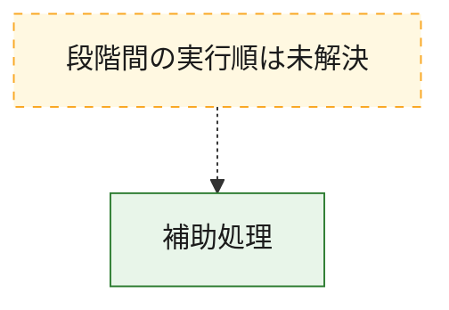
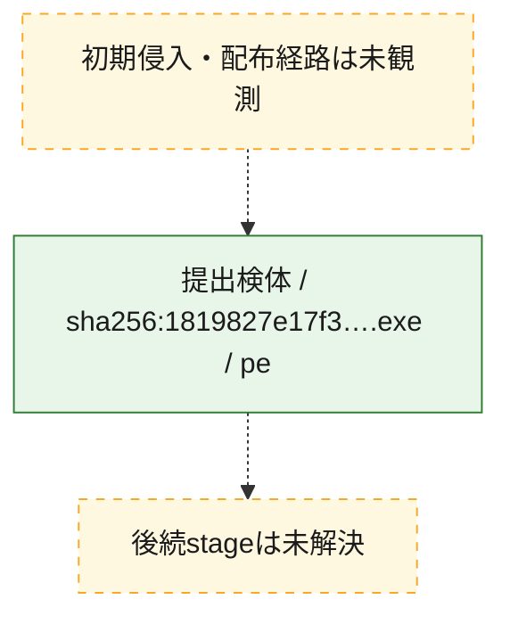
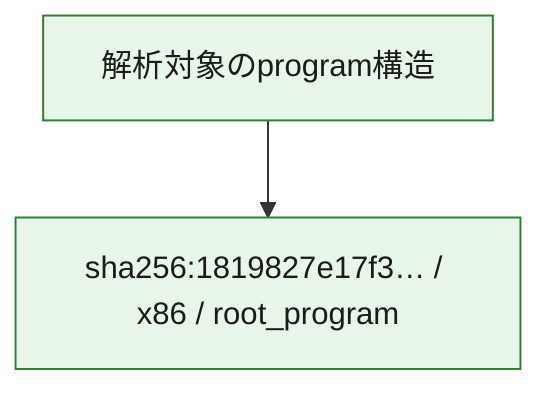

# 全体ロジック：1819827e17f31e72d456158b6b9c90af25a65945f6f05d04a060da9f24179b25

代表関数から主要なmalware処理段階を自動分類できませんでした。

## 読み方

- phaseの掲載順は解析上の整理順です。observed_call_edgesがない段階間の実行順を断定しません。
- 図の実線は静的に観測した関係、点線と黄色のノードは未観測・未解決の関係を示します。
- 図は静的な要約であり、動的実行を再現するものではありません。
- 詳細な関数解説とfingerprintは[STATIC-LOGIC.md](STATIC-LOGIC.md)を参照してください。

## 静的可視化

### 実行フロー

### 感染チェーン

### モジュール関係

## 処理段階

### 1. 補助処理

主要処理を支える一般内部関数またはlibrary処理を確認します。
確度: `confirmed_static_function_evidence_with_limits`

- `1819827e17f31e72d456158b6b9c90af25a65945f6f05d04a060da9f24179b25:ghidra:00403280` — 検体内部の一般処理を実装する関数です。 状態: `succeeded`、選定理由: `call_graph_centrality:in=126,out=0`, `large_function:instructions=74`, `reviewed_call_centrality:126`, `reviewed_call_centrality:127`
- `1819827e17f31e72d456158b6b9c90af25a65945f6f05d04a060da9f24179b25:ghidra:00412ff0` — 検体内部の一般処理を実装する関数です。 状態: `succeeded`、選定理由: `call_graph_centrality:in=158,out=13`, `large_function:instructions=315`, `reviewed_call_centrality:171`, `reviewed_call_centrality:174`
- `1819827e17f31e72d456158b6b9c90af25a65945f6f05d04a060da9f24179b25:ghidra:004134c0` — 検体内部の一般処理を実装する関数です。 状態: `succeeded`、選定理由: `call_graph_centrality:in=152,out=9`, `large_function:instructions=136`, `reviewed_call_centrality:161`, `reviewed_call_centrality:163`
- `1819827e17f31e72d456158b6b9c90af25a65945f6f05d04a060da9f24179b25:ghidra:0041f870` — 検体内部の一般処理を実装する関数です。 状態: `succeeded`、選定理由: `call_graph_centrality:in=1,out=47`, `large_function:instructions=1176`, `reviewed_call_centrality:48`, `reviewed_call_centrality:54`
- `1819827e17f31e72d456158b6b9c90af25a65945f6f05d04a060da9f24179b25:ghidra:0042d810` — 検体内部の一般処理を実装する関数です。 状態: `succeeded`、選定理由: `call_graph_centrality:in=5,out=30`, `large_function:instructions=870`, `reviewed_call_centrality:35`, `reviewed_call_centrality:37`
- `1819827e17f31e72d456158b6b9c90af25a65945f6f05d04a060da9f24179b25:ghidra:00442a20` — 検体内部の一般処理を実装する関数です。 状態: `succeeded`、選定理由: `call_graph_centrality:in=74,out=4`, `large_function:instructions=93`, `reviewed_call_centrality:78`, `reviewed_call_centrality:80`
- `1819827e17f31e72d456158b6b9c90af25a65945f6f05d04a060da9f24179b25:ghidra:00442bc0` — 検体内部の一般処理を実装する関数です。 状態: `succeeded`、選定理由: `call_graph_centrality:in=47,out=4`, `large_function:instructions=76`, `reviewed_call_centrality:51`
- `1819827e17f31e72d456158b6b9c90af25a65945f6f05d04a060da9f24179b25:ghidra:004489b0` — 検体内部の一般処理を実装する関数です。 状態: `succeeded`、選定理由: `call_graph_centrality:in=1,out=52`, `large_function:instructions=1200`, `reviewed_call_centrality:53`, `reviewed_call_centrality:60`
- `1819827e17f31e72d456158b6b9c90af25a65945f6f05d04a060da9f24179b25:ghidra:00454bd0` — 検体内部の一般処理を実装する関数です。 状態: `succeeded`、選定理由: `call_graph_centrality:in=12,out=30`, `large_function:instructions=1279`, `reviewed_call_centrality:42`
- `1819827e17f31e72d456158b6b9c90af25a65945f6f05d04a060da9f24179b25:ghidra:0045bd70` — 検体内部の一般処理を実装する関数です。 状態: `succeeded`、選定理由: `call_graph_centrality:in=58,out=5`, `large_function:instructions=66`, `reviewed_call_centrality:63`
- `1819827e17f31e72d456158b6b9c90af25a65945f6f05d04a060da9f24179b25:ghidra:00474fd0` — 検体内部の一般処理を実装する関数です。 状態: `succeeded`、選定理由: `call_graph_centrality:in=421,out=16`, `large_function:instructions=183`, `reviewed_call_centrality:437`, `reviewed_call_centrality:438`
- `1819827e17f31e72d456158b6b9c90af25a65945f6f05d04a060da9f24179b25:ghidra:004769a0` — 検体内部の一般処理を実装する関数です。 状態: `failed_empty`、選定理由: `call_graph_centrality:in=217,out=8`, `large_function:instructions=434`, `reviewed_call_centrality:225`
- `1819827e17f31e72d456158b6b9c90af25a65945f6f05d04a060da9f24179b25:ghidra:0047bbc0` — 検体内部の一般処理を実装する関数です。 状態: `succeeded`、選定理由: `call_graph_centrality:in=64,out=0`, `large_function:instructions=95`, `reviewed_call_centrality:64`, `reviewed_call_centrality:65`
- `1819827e17f31e72d456158b6b9c90af25a65945f6f05d04a060da9f24179b25:ghidra:0047bd90` — 検体内部の一般処理を実装する関数です。 状態: `succeeded`、選定理由: `call_graph_centrality:in=233,out=0`, `large_function:instructions=114`, `reviewed_call_centrality:233`
- `1819827e17f31e72d456158b6b9c90af25a65945f6f05d04a060da9f24179b25:ghidra:0048af60` — 検体内部の一般処理を実装する関数です。 状態: `succeeded`、選定理由: `call_graph_centrality:in=59,out=7`, `large_function:instructions=90`, `reviewed_call_centrality:66`
- `1819827e17f31e72d456158b6b9c90af25a65945f6f05d04a060da9f24179b25:ghidra:004970e0` — 検体内部の一般処理を実装する関数です。 状態: `succeeded`、選定理由: `call_graph_centrality:in=1,out=17`, `large_function:instructions=1895`, `reviewed_call_centrality:18`, `reviewed_call_centrality:22`
- `1819827e17f31e72d456158b6b9c90af25a65945f6f05d04a060da9f24179b25:ghidra:00499cb0` — 検体内部の一般処理を実装する関数です。 状態: `succeeded`、選定理由: `call_graph_centrality:in=1,out=29`, `large_function:instructions=2483`, `reviewed_call_centrality:30`
- `1819827e17f31e72d456158b6b9c90af25a65945f6f05d04a060da9f24179b25:ghidra:004d3b90` — 検体内部の一般処理を実装する関数です。 状態: `succeeded`、選定理由: `call_graph_centrality:in=48,out=12`, `large_function:instructions=286`, `reviewed_call_centrality:60`
- `1819827e17f31e72d456158b6b9c90af25a65945f6f05d04a060da9f24179b25:ghidra:004d99f0` — 検体内部の一般処理を実装する関数です。 状態: `succeeded`、選定理由: `call_graph_centrality:in=4,out=34`, `large_function:instructions=1952`, `reviewed_call_centrality:38`, `reviewed_call_centrality:41`
- `1819827e17f31e72d456158b6b9c90af25a65945f6f05d04a060da9f24179b25:ghidra:004fd090` — 検体内部の一般処理を実装する関数です。 状態: `succeeded`、選定理由: `call_graph_centrality:in=1,out=33`, `large_function:instructions=1104`, `reviewed_call_centrality:34`, `reviewed_call_centrality:37`
- `1819827e17f31e72d456158b6b9c90af25a65945f6f05d04a060da9f24179b25:ghidra:005b2bc0` — 検体内部の一般処理を実装する関数です。 状態: `succeeded`、選定理由: `call_graph_centrality:in=3,out=58`, `large_function:instructions=2255`, `reviewed_call_centrality:61`
- `1819827e17f31e72d456158b6b9c90af25a65945f6f05d04a060da9f24179b25:ghidra:005ebc70` — 検体内部の一般処理を実装する関数です。 状態: `succeeded`、選定理由: `call_graph_centrality:in=1,out=25`, `large_function:instructions=1407`, `reviewed_call_centrality:26`, `reviewed_call_centrality:27`
- `1819827e17f31e72d456158b6b9c90af25a65945f6f05d04a060da9f24179b25:ghidra:005edd70` — 検体内部の一般処理を実装する関数です。 状態: `succeeded`、選定理由: `call_graph_centrality:in=1,out=40`, `large_function:instructions=1123`, `reviewed_call_centrality:41`, `reviewed_call_centrality:42`
- `1819827e17f31e72d456158b6b9c90af25a65945f6f05d04a060da9f24179b25:ghidra:005f6fb0` — 検体内部の一般処理を実装する関数です。 状態: `succeeded`、選定理由: `call_graph_centrality:in=1,out=32`, `large_function:instructions=2066`, `reviewed_call_centrality:33`
- `1819827e17f31e72d456158b6b9c90af25a65945f6f05d04a060da9f24179b25:ghidra:0060eab0` — 検体内部の一般処理を実装する関数です。 状態: `succeeded`、選定理由: `call_graph_centrality:in=3,out=24`, `large_function:instructions=2292`, `reviewed_call_centrality:27`, `reviewed_call_centrality:30`
- `1819827e17f31e72d456158b6b9c90af25a65945f6f05d04a060da9f24179b25:ghidra:00618140` — 検体内部の一般処理を実装する関数です。 状態: `succeeded`、選定理由: `call_graph_centrality:in=1,out=29`, `large_function:instructions=1472`, `reviewed_call_centrality:30`, `reviewed_call_centrality:34`
- `1819827e17f31e72d456158b6b9c90af25a65945f6f05d04a060da9f24179b25:ghidra:0061c810` — 検体内部の一般処理を実装する関数です。 状態: `succeeded`、選定理由: `call_graph_centrality:in=1,out=28`, `large_function:instructions=969`, `reviewed_call_centrality:29`, `reviewed_call_centrality:32`
- `1819827e17f31e72d456158b6b9c90af25a65945f6f05d04a060da9f24179b25:ghidra:00620f80` — 検体内部の一般処理を実装する関数です。 状態: `failed_empty`、選定理由: `call_graph_centrality:in=1,out=30`, `large_function:instructions=1194`, `reviewed_call_centrality:31`
- `1819827e17f31e72d456158b6b9c90af25a65945f6f05d04a060da9f24179b25:ghidra:00661860` — 検体内部の一般処理を実装する関数です。 状態: `succeeded`、選定理由: `call_graph_centrality:in=1,out=51`, `large_function:instructions=1641`, `reviewed_call_centrality:52`, `reviewed_call_centrality:53`
- `1819827e17f31e72d456158b6b9c90af25a65945f6f05d04a060da9f24179b25:ghidra:00663750` — 検体内部の一般処理を実装する関数です。 状態: `succeeded`、選定理由: `call_graph_centrality:in=2,out=35`, `large_function:instructions=2246`, `reviewed_call_centrality:37`, `reviewed_call_centrality:39`
- `1819827e17f31e72d456158b6b9c90af25a65945f6f05d04a060da9f24179b25:ghidra:00670d60` — 検体内部の一般処理を実装する関数です。 状態: `succeeded`、選定理由: `call_graph_centrality:in=1,out=38`, `large_function:instructions=1280`, `reviewed_call_centrality:39`, `reviewed_call_centrality:40`
- `1819827e17f31e72d456158b6b9c90af25a65945f6f05d04a060da9f24179b25:ghidra:006a7e40` — 検体内部の一般処理を実装する関数です。 状態: `succeeded`、選定理由: `call_graph_centrality:in=1,out=42`, `large_function:instructions=1307`, `reviewed_call_centrality:43`, `reviewed_call_centrality:44`

## 観測したcall関係

- `1819827e17f31e72d456158b6b9c90af25a65945f6f05d04a060da9f24179b25:ghidra:0041f870` → `1819827e17f31e72d456158b6b9c90af25a65945f6f05d04a060da9f24179b25:ghidra:00412ff0` （`support` → `support`）
- `1819827e17f31e72d456158b6b9c90af25a65945f6f05d04a060da9f24179b25:ghidra:0041f870` → `1819827e17f31e72d456158b6b9c90af25a65945f6f05d04a060da9f24179b25:ghidra:004134c0` （`support` → `support`）
- `1819827e17f31e72d456158b6b9c90af25a65945f6f05d04a060da9f24179b25:ghidra:0041f870` → `1819827e17f31e72d456158b6b9c90af25a65945f6f05d04a060da9f24179b25:ghidra:00442a20` （`support` → `support`）
- `1819827e17f31e72d456158b6b9c90af25a65945f6f05d04a060da9f24179b25:ghidra:0041f870` → `1819827e17f31e72d456158b6b9c90af25a65945f6f05d04a060da9f24179b25:ghidra:0045bd70` （`support` → `support`）
- `1819827e17f31e72d456158b6b9c90af25a65945f6f05d04a060da9f24179b25:ghidra:0041f870` → `1819827e17f31e72d456158b6b9c90af25a65945f6f05d04a060da9f24179b25:ghidra:0047bbc0` （`support` → `support`）
- `1819827e17f31e72d456158b6b9c90af25a65945f6f05d04a060da9f24179b25:ghidra:0042d810` → `1819827e17f31e72d456158b6b9c90af25a65945f6f05d04a060da9f24179b25:ghidra:00442a20` （`support` → `support`）
- `1819827e17f31e72d456158b6b9c90af25a65945f6f05d04a060da9f24179b25:ghidra:004489b0` → `1819827e17f31e72d456158b6b9c90af25a65945f6f05d04a060da9f24179b25:ghidra:00412ff0` （`support` → `support`）
- `1819827e17f31e72d456158b6b9c90af25a65945f6f05d04a060da9f24179b25:ghidra:004489b0` → `1819827e17f31e72d456158b6b9c90af25a65945f6f05d04a060da9f24179b25:ghidra:004134c0` （`support` → `support`）
- `1819827e17f31e72d456158b6b9c90af25a65945f6f05d04a060da9f24179b25:ghidra:00454bd0` → `1819827e17f31e72d456158b6b9c90af25a65945f6f05d04a060da9f24179b25:ghidra:00474fd0` （`support` → `support`）
- `1819827e17f31e72d456158b6b9c90af25a65945f6f05d04a060da9f24179b25:ghidra:0045bd70` → `1819827e17f31e72d456158b6b9c90af25a65945f6f05d04a060da9f24179b25:ghidra:0047bd90` （`support` → `support`）
- `1819827e17f31e72d456158b6b9c90af25a65945f6f05d04a060da9f24179b25:ghidra:004769a0` → `1819827e17f31e72d456158b6b9c90af25a65945f6f05d04a060da9f24179b25:ghidra:00474fd0` （`support` → `support`）
- `1819827e17f31e72d456158b6b9c90af25a65945f6f05d04a060da9f24179b25:ghidra:004769a0` → `1819827e17f31e72d456158b6b9c90af25a65945f6f05d04a060da9f24179b25:ghidra:0047bbc0` （`support` → `support`）
- `1819827e17f31e72d456158b6b9c90af25a65945f6f05d04a060da9f24179b25:ghidra:004769a0` → `1819827e17f31e72d456158b6b9c90af25a65945f6f05d04a060da9f24179b25:ghidra:0047bd90` （`support` → `support`）
- `1819827e17f31e72d456158b6b9c90af25a65945f6f05d04a060da9f24179b25:ghidra:004970e0` → `1819827e17f31e72d456158b6b9c90af25a65945f6f05d04a060da9f24179b25:ghidra:004769a0` （`support` → `support`）
- `1819827e17f31e72d456158b6b9c90af25a65945f6f05d04a060da9f24179b25:ghidra:004970e0` → `1819827e17f31e72d456158b6b9c90af25a65945f6f05d04a060da9f24179b25:ghidra:0047bd90` （`support` → `support`）
- `1819827e17f31e72d456158b6b9c90af25a65945f6f05d04a060da9f24179b25:ghidra:00499cb0` → `1819827e17f31e72d456158b6b9c90af25a65945f6f05d04a060da9f24179b25:ghidra:00403280` （`support` → `support`）
- `1819827e17f31e72d456158b6b9c90af25a65945f6f05d04a060da9f24179b25:ghidra:00499cb0` → `1819827e17f31e72d456158b6b9c90af25a65945f6f05d04a060da9f24179b25:ghidra:0047bd90` （`support` → `support`）
- `1819827e17f31e72d456158b6b9c90af25a65945f6f05d04a060da9f24179b25:ghidra:004d3b90` → `1819827e17f31e72d456158b6b9c90af25a65945f6f05d04a060da9f24179b25:ghidra:0045bd70` （`support` → `support`）
- `1819827e17f31e72d456158b6b9c90af25a65945f6f05d04a060da9f24179b25:ghidra:004d3b90` → `1819827e17f31e72d456158b6b9c90af25a65945f6f05d04a060da9f24179b25:ghidra:004769a0` （`support` → `support`）
- `1819827e17f31e72d456158b6b9c90af25a65945f6f05d04a060da9f24179b25:ghidra:004d99f0` → `1819827e17f31e72d456158b6b9c90af25a65945f6f05d04a060da9f24179b25:ghidra:00474fd0` （`support` → `support`）
- `1819827e17f31e72d456158b6b9c90af25a65945f6f05d04a060da9f24179b25:ghidra:004d99f0` → `1819827e17f31e72d456158b6b9c90af25a65945f6f05d04a060da9f24179b25:ghidra:004769a0` （`support` → `support`）
- `1819827e17f31e72d456158b6b9c90af25a65945f6f05d04a060da9f24179b25:ghidra:004d99f0` → `1819827e17f31e72d456158b6b9c90af25a65945f6f05d04a060da9f24179b25:ghidra:0047bd90` （`support` → `support`）
- `1819827e17f31e72d456158b6b9c90af25a65945f6f05d04a060da9f24179b25:ghidra:004fd090` → `1819827e17f31e72d456158b6b9c90af25a65945f6f05d04a060da9f24179b25:ghidra:00403280` （`support` → `support`）
- `1819827e17f31e72d456158b6b9c90af25a65945f6f05d04a060da9f24179b25:ghidra:004fd090` → `1819827e17f31e72d456158b6b9c90af25a65945f6f05d04a060da9f24179b25:ghidra:004769a0` （`support` → `support`）
- `1819827e17f31e72d456158b6b9c90af25a65945f6f05d04a060da9f24179b25:ghidra:004fd090` → `1819827e17f31e72d456158b6b9c90af25a65945f6f05d04a060da9f24179b25:ghidra:0047bd90` （`support` → `support`）
- `1819827e17f31e72d456158b6b9c90af25a65945f6f05d04a060da9f24179b25:ghidra:005b2bc0` → `1819827e17f31e72d456158b6b9c90af25a65945f6f05d04a060da9f24179b25:ghidra:0045bd70` （`support` → `support`）
- `1819827e17f31e72d456158b6b9c90af25a65945f6f05d04a060da9f24179b25:ghidra:005ebc70` → `1819827e17f31e72d456158b6b9c90af25a65945f6f05d04a060da9f24179b25:ghidra:0045bd70` （`support` → `support`）
- `1819827e17f31e72d456158b6b9c90af25a65945f6f05d04a060da9f24179b25:ghidra:005ebc70` → `1819827e17f31e72d456158b6b9c90af25a65945f6f05d04a060da9f24179b25:ghidra:004769a0` （`support` → `support`）
- `1819827e17f31e72d456158b6b9c90af25a65945f6f05d04a060da9f24179b25:ghidra:005edd70` → `1819827e17f31e72d456158b6b9c90af25a65945f6f05d04a060da9f24179b25:ghidra:00403280` （`support` → `support`）
- `1819827e17f31e72d456158b6b9c90af25a65945f6f05d04a060da9f24179b25:ghidra:005edd70` → `1819827e17f31e72d456158b6b9c90af25a65945f6f05d04a060da9f24179b25:ghidra:004769a0` （`support` → `support`）
- `1819827e17f31e72d456158b6b9c90af25a65945f6f05d04a060da9f24179b25:ghidra:005edd70` → `1819827e17f31e72d456158b6b9c90af25a65945f6f05d04a060da9f24179b25:ghidra:004d3b90` （`support` → `support`）
- `1819827e17f31e72d456158b6b9c90af25a65945f6f05d04a060da9f24179b25:ghidra:005edd70` → `1819827e17f31e72d456158b6b9c90af25a65945f6f05d04a060da9f24179b25:ghidra:005ebc70` （`support` → `support`）
- `1819827e17f31e72d456158b6b9c90af25a65945f6f05d04a060da9f24179b25:ghidra:005f6fb0` → `1819827e17f31e72d456158b6b9c90af25a65945f6f05d04a060da9f24179b25:ghidra:00403280` （`support` → `support`）
- `1819827e17f31e72d456158b6b9c90af25a65945f6f05d04a060da9f24179b25:ghidra:005f6fb0` → `1819827e17f31e72d456158b6b9c90af25a65945f6f05d04a060da9f24179b25:ghidra:0045bd70` （`support` → `support`）
- `1819827e17f31e72d456158b6b9c90af25a65945f6f05d04a060da9f24179b25:ghidra:005f6fb0` → `1819827e17f31e72d456158b6b9c90af25a65945f6f05d04a060da9f24179b25:ghidra:004769a0` （`support` → `support`）
- `1819827e17f31e72d456158b6b9c90af25a65945f6f05d04a060da9f24179b25:ghidra:0060eab0` → `1819827e17f31e72d456158b6b9c90af25a65945f6f05d04a060da9f24179b25:ghidra:0047bbc0` （`support` → `support`）
- `1819827e17f31e72d456158b6b9c90af25a65945f6f05d04a060da9f24179b25:ghidra:0060eab0` → `1819827e17f31e72d456158b6b9c90af25a65945f6f05d04a060da9f24179b25:ghidra:0047bd90` （`support` → `support`）
- `1819827e17f31e72d456158b6b9c90af25a65945f6f05d04a060da9f24179b25:ghidra:00618140` → `1819827e17f31e72d456158b6b9c90af25a65945f6f05d04a060da9f24179b25:ghidra:004769a0` （`support` → `support`）
- `1819827e17f31e72d456158b6b9c90af25a65945f6f05d04a060da9f24179b25:ghidra:00618140` → `1819827e17f31e72d456158b6b9c90af25a65945f6f05d04a060da9f24179b25:ghidra:0047bd90` （`support` → `support`）
- `1819827e17f31e72d456158b6b9c90af25a65945f6f05d04a060da9f24179b25:ghidra:0061c810` → `1819827e17f31e72d456158b6b9c90af25a65945f6f05d04a060da9f24179b25:ghidra:00403280` （`support` → `support`）
- `1819827e17f31e72d456158b6b9c90af25a65945f6f05d04a060da9f24179b25:ghidra:0061c810` → `1819827e17f31e72d456158b6b9c90af25a65945f6f05d04a060da9f24179b25:ghidra:004d3b90` （`support` → `support`）
- `1819827e17f31e72d456158b6b9c90af25a65945f6f05d04a060da9f24179b25:ghidra:00620f80` → `1819827e17f31e72d456158b6b9c90af25a65945f6f05d04a060da9f24179b25:ghidra:004769a0` （`support` → `support`）
- `1819827e17f31e72d456158b6b9c90af25a65945f6f05d04a060da9f24179b25:ghidra:00620f80` → `1819827e17f31e72d456158b6b9c90af25a65945f6f05d04a060da9f24179b25:ghidra:0047bd90` （`support` → `support`）
- `1819827e17f31e72d456158b6b9c90af25a65945f6f05d04a060da9f24179b25:ghidra:00620f80` → `1819827e17f31e72d456158b6b9c90af25a65945f6f05d04a060da9f24179b25:ghidra:004d3b90` （`support` → `support`）
- `1819827e17f31e72d456158b6b9c90af25a65945f6f05d04a060da9f24179b25:ghidra:00661860` → `1819827e17f31e72d456158b6b9c90af25a65945f6f05d04a060da9f24179b25:ghidra:0045bd70` （`support` → `support`）
- `1819827e17f31e72d456158b6b9c90af25a65945f6f05d04a060da9f24179b25:ghidra:00661860` → `1819827e17f31e72d456158b6b9c90af25a65945f6f05d04a060da9f24179b25:ghidra:00474fd0` （`support` → `support`）
- `1819827e17f31e72d456158b6b9c90af25a65945f6f05d04a060da9f24179b25:ghidra:00661860` → `1819827e17f31e72d456158b6b9c90af25a65945f6f05d04a060da9f24179b25:ghidra:004769a0` （`support` → `support`）
- `1819827e17f31e72d456158b6b9c90af25a65945f6f05d04a060da9f24179b25:ghidra:00661860` → `1819827e17f31e72d456158b6b9c90af25a65945f6f05d04a060da9f24179b25:ghidra:004d3b90` （`support` → `support`）
- `1819827e17f31e72d456158b6b9c90af25a65945f6f05d04a060da9f24179b25:ghidra:00661860` → `1819827e17f31e72d456158b6b9c90af25a65945f6f05d04a060da9f24179b25:ghidra:00663750` （`support` → `support`）
- `1819827e17f31e72d456158b6b9c90af25a65945f6f05d04a060da9f24179b25:ghidra:00663750` → `1819827e17f31e72d456158b6b9c90af25a65945f6f05d04a060da9f24179b25:ghidra:0045bd70` （`support` → `support`）
- `1819827e17f31e72d456158b6b9c90af25a65945f6f05d04a060da9f24179b25:ghidra:00663750` → `1819827e17f31e72d456158b6b9c90af25a65945f6f05d04a060da9f24179b25:ghidra:00474fd0` （`support` → `support`）
- `1819827e17f31e72d456158b6b9c90af25a65945f6f05d04a060da9f24179b25:ghidra:00663750` → `1819827e17f31e72d456158b6b9c90af25a65945f6f05d04a060da9f24179b25:ghidra:004d3b90` （`support` → `support`）
- `1819827e17f31e72d456158b6b9c90af25a65945f6f05d04a060da9f24179b25:ghidra:00670d60` → `1819827e17f31e72d456158b6b9c90af25a65945f6f05d04a060da9f24179b25:ghidra:00403280` （`support` → `support`）
- `1819827e17f31e72d456158b6b9c90af25a65945f6f05d04a060da9f24179b25:ghidra:00670d60` → `1819827e17f31e72d456158b6b9c90af25a65945f6f05d04a060da9f24179b25:ghidra:0045bd70` （`support` → `support`）
- `1819827e17f31e72d456158b6b9c90af25a65945f6f05d04a060da9f24179b25:ghidra:00670d60` → `1819827e17f31e72d456158b6b9c90af25a65945f6f05d04a060da9f24179b25:ghidra:004769a0` （`support` → `support`）
- `1819827e17f31e72d456158b6b9c90af25a65945f6f05d04a060da9f24179b25:ghidra:00670d60` → `1819827e17f31e72d456158b6b9c90af25a65945f6f05d04a060da9f24179b25:ghidra:0047bd90` （`support` → `support`）
- `1819827e17f31e72d456158b6b9c90af25a65945f6f05d04a060da9f24179b25:ghidra:006a7e40` → `1819827e17f31e72d456158b6b9c90af25a65945f6f05d04a060da9f24179b25:ghidra:00403280` （`support` → `support`）
- `1819827e17f31e72d456158b6b9c90af25a65945f6f05d04a060da9f24179b25:ghidra:006a7e40` → `1819827e17f31e72d456158b6b9c90af25a65945f6f05d04a060da9f24179b25:ghidra:004d3b90` （`support` → `support`）
- `ghidra-function:000a0e86085b82d1cadd7fed` → `ghidra-function:7f18bc10d65a500f686b75e1` （`unclassified` → `unclassified`）
- `ghidra-function:000a0e86085b82d1cadd7fed` → `ghidra-function:8b08f20143970b6516b06455` （`unclassified` → `unclassified`）
- `ghidra-function:000a0e86085b82d1cadd7fed` → `ghidra-function:a48f1621733b5a625bf0684a` （`unclassified` → `unclassified`）
- `ghidra-function:000a0e86085b82d1cadd7fed` → `ghidra-function:dd45b6ce940a4823a7d165bb` （`unclassified` → `unclassified`）
- `ghidra-function:002c0570f57a3ddb0f70d3e8` → `ghidra-function:12ad2a8c539777d0611989f1` （`unclassified` → `unclassified`）
- `ghidra-function:002c0570f57a3ddb0f70d3e8` → `ghidra-function:8a374c6fd27f0e98ed33ece6` （`unclassified` → `unclassified`）
- `ghidra-function:002c0570f57a3ddb0f70d3e8` → `ghidra-function:a48f1621733b5a625bf0684a` （`unclassified` → `unclassified`）
- `ghidra-function:0036413cc8f47c7414d4d029` → `ghidra-function:264a4630f52d02b4d0753dcc` （`unclassified` → `unclassified`）
- `ghidra-function:0036413cc8f47c7414d4d029` → `ghidra-function:91cf102df51ca7625eb07b8d` （`unclassified` → `unclassified`）
- `ghidra-function:0036413cc8f47c7414d4d029` → `ghidra-function:a48f1621733b5a625bf0684a` （`unclassified` → `unclassified`）
- `ghidra-function:0036c0c712dac403470a25d2` → `ghidra-function:a48f1621733b5a625bf0684a` （`unclassified` → `unclassified`）
- `ghidra-function:00658060201b1610d1d4c142` → `ghidra-function:a48f1621733b5a625bf0684a` （`unclassified` → `unclassified`）
- `ghidra-function:00658060201b1610d1d4c142` → `ghidra-function:d44b65771543ef833f2fff0c` （`unclassified` → `unclassified`）
- `ghidra-function:00658060201b1610d1d4c142` → `ghidra-function:dbcdd2bb99709cd4d004378e` （`unclassified` → `unclassified`）
- `ghidra-function:00658060201b1610d1d4c142` → `ghidra-function:e1cd728de92647b12d08dca8` （`unclassified` → `unclassified`）
- `ghidra-function:0076385497f515233c887180` → `ghidra-function:0c2cd8218f4a313f5bce2dfc` （`unclassified` → `unclassified`）
- `ghidra-function:0076385497f515233c887180` → `ghidra-function:262af64b74e34f2fcb6dbfe5` （`unclassified` → `unclassified`）
- `ghidra-function:0076385497f515233c887180` → `ghidra-function:28451446c8c368eb9afe8ecb` （`unclassified` → `unclassified`）
- `ghidra-function:0076385497f515233c887180` → `ghidra-function:3805fdc9e51afd5817894f3b` （`unclassified` → `unclassified`）
- `ghidra-function:0076385497f515233c887180` → `ghidra-function:568ede26d676e8d1c0bbd9b4` （`unclassified` → `unclassified`）
- `ghidra-function:0076385497f515233c887180` → `ghidra-function:7ee805ae18bd0c1a3d6ecdf8` （`unclassified` → `unclassified`）
- `ghidra-function:0076385497f515233c887180` → `ghidra-function:8ad0be82983066f812a3ea47` （`unclassified` → `unclassified`）
- `ghidra-function:0076385497f515233c887180` → `ghidra-function:a48f1621733b5a625bf0684a` （`unclassified` → `unclassified`）
- `ghidra-function:0076385497f515233c887180` → `ghidra-function:b4ce7e2bf6384dad33630e1e` （`unclassified` → `unclassified`）
- `ghidra-function:0076385497f515233c887180` → `ghidra-function:c965600140d0b51f42fbe6bd` （`unclassified` → `unclassified`）
- `ghidra-function:0076385497f515233c887180` → `ghidra-function:f5fb462bcf23b9b02e0380d9` （`unclassified` → `unclassified`）
- `ghidra-function:0076385497f515233c887180` → `ghidra-function:fc7502fb781695f352ebd386` （`unclassified` → `unclassified`）
- `ghidra-function:0078f2fc15221f553e116555` → `ghidra-function:5fa2e16c2611b3f27969f93a` （`unclassified` → `unclassified`）
- `ghidra-function:0078f2fc15221f553e116555` → `ghidra-function:a48f1621733b5a625bf0684a` （`unclassified` → `unclassified`）
- `ghidra-function:008adfb29ced122efc92c71d` → `ghidra-function:28eba154eb56c2da2020bb0e` （`unclassified` → `unclassified`）
- `ghidra-function:008adfb29ced122efc92c71d` → `ghidra-function:339b248cb982023d6c8b6acc` （`unclassified` → `unclassified`）
- `ghidra-function:008adfb29ced122efc92c71d` → `ghidra-function:59f23ed06e0d4aa44ea2b9da` （`unclassified` → `unclassified`）
- `ghidra-function:008adfb29ced122efc92c71d` → `ghidra-function:a48f1621733b5a625bf0684a` （`unclassified` → `unclassified`）
- `ghidra-function:009e0af82325c4a9f6b35e48` → `ghidra-function:184d1a18d25849dfa0627902` （`unclassified` → `unclassified`）
- `ghidra-function:009e0af82325c4a9f6b35e48` → `ghidra-function:79a87ab35dd0391eb626e7bb` （`unclassified` → `unclassified`）
- `ghidra-function:009e0af82325c4a9f6b35e48` → `ghidra-function:826b06dba90224b7d3572c28` （`unclassified` → `unclassified`）
- `ghidra-function:009e0af82325c4a9f6b35e48` → `ghidra-function:a48f1621733b5a625bf0684a` （`unclassified` → `unclassified`）
- `ghidra-function:00ca2af3985453c46ffe7aab` → `ghidra-function:47474077318457189ceb5dd9` （`unclassified` → `unclassified`）
- `ghidra-function:00ca2af3985453c46ffe7aab` → `ghidra-function:a48f1621733b5a625bf0684a` （`unclassified` → `unclassified`）
- `ghidra-function:00cfc63fb0da4d6298c7edb7` → `ghidra-function:085b806d1e1adf5ec770a0cf` （`unclassified` → `unclassified`）
- `ghidra-function:00cfc63fb0da4d6298c7edb7` → `ghidra-function:8a4ac2e792a1f2a0a684dcfb` （`unclassified` → `unclassified`）
- `ghidra-function:00cfc63fb0da4d6298c7edb7` → `ghidra-function:a48f1621733b5a625bf0684a` （`unclassified` → `unclassified`）
- `ghidra-function:00cfc63fb0da4d6298c7edb7` → `ghidra-function:c965600140d0b51f42fbe6bd` （`unclassified` → `unclassified`）
- `ghidra-function:00d847ab2e49a0bf417b3c62` → `ghidra-function:1c79316ae9c134885e7d0676` （`unclassified` → `unclassified`）
- `ghidra-function:00d847ab2e49a0bf417b3c62` → `ghidra-function:264a4630f52d02b4d0753dcc` （`unclassified` → `unclassified`）
- `ghidra-function:00d847ab2e49a0bf417b3c62` → `ghidra-function:40d5933d3a9173adb64f5b40` （`unclassified` → `unclassified`）
- `ghidra-function:00d847ab2e49a0bf417b3c62` → `ghidra-function:a48f1621733b5a625bf0684a` （`unclassified` → `unclassified`）
- `ghidra-function:00d847ab2e49a0bf417b3c62` → `ghidra-function:b8e7adfe4880247a4e96e560` （`unclassified` → `unclassified`）
- `ghidra-function:00e4066a03d1a9ddd5cdd386` → `ghidra-function:0425df37976705702cc26472` （`unclassified` → `unclassified`）
- `ghidra-function:00e4066a03d1a9ddd5cdd386` → `ghidra-function:058e59054d425a3407e0cf49` （`unclassified` → `unclassified`）
- `ghidra-function:00e4066a03d1a9ddd5cdd386` → `ghidra-function:59f23ed06e0d4aa44ea2b9da` （`unclassified` → `unclassified`）
- `ghidra-function:00e4066a03d1a9ddd5cdd386` → `ghidra-function:a03d56c4a7539dbebf956000` （`unclassified` → `unclassified`）
- `ghidra-function:00e4066a03d1a9ddd5cdd386` → `ghidra-function:a48f1621733b5a625bf0684a` （`unclassified` → `unclassified`）
- `ghidra-function:00e4066a03d1a9ddd5cdd386` → `ghidra-function:bd0d916e96d1ae9554e74238` （`unclassified` → `unclassified`）
- `ghidra-function:00e4066a03d1a9ddd5cdd386` → `ghidra-function:e1cd728de92647b12d08dca8` （`unclassified` → `unclassified`）
- `ghidra-function:00f3f5c0356e09c2b955f8c1` → `ghidra-function:0edd6d2d4ec1ba56b6872f85` （`unclassified` → `unclassified`）
- `ghidra-function:00f3f5c0356e09c2b955f8c1` → `ghidra-function:0ef6196223f4385144dec5a4` （`unclassified` → `unclassified`）
- `ghidra-function:00f3f5c0356e09c2b955f8c1` → `ghidra-function:14d3159acb5b75225df8eb5f` （`unclassified` → `unclassified`）
- `ghidra-function:00f3f5c0356e09c2b955f8c1` → `ghidra-function:1c79316ae9c134885e7d0676` （`unclassified` → `unclassified`）
- `ghidra-function:00f3f5c0356e09c2b955f8c1` → `ghidra-function:264a4630f52d02b4d0753dcc` （`unclassified` → `unclassified`）
- `ghidra-function:00f3f5c0356e09c2b955f8c1` → `ghidra-function:3cd094d935cac8428f4ec65c` （`unclassified` → `unclassified`）
- `ghidra-function:00f3f5c0356e09c2b955f8c1` → `ghidra-function:47474077318457189ceb5dd9` （`unclassified` → `unclassified`）
- `ghidra-function:00f3f5c0356e09c2b955f8c1` → `ghidra-function:710959048e549c9e9063e49d` （`unclassified` → `unclassified`）
- `ghidra-function:00f3f5c0356e09c2b955f8c1` → `ghidra-function:8b08f20143970b6516b06455` （`unclassified` → `unclassified`）
- `ghidra-function:00f3f5c0356e09c2b955f8c1` → `ghidra-function:95c49d056e2e2af999c56601` （`unclassified` → `unclassified`）
- `ghidra-function:00f3f5c0356e09c2b955f8c1` → `ghidra-function:95ca4ac8f85f3ef44feddfc4` （`unclassified` → `unclassified`）
- `ghidra-function:00f3f5c0356e09c2b955f8c1` → `ghidra-function:a48f1621733b5a625bf0684a` （`unclassified` → `unclassified`）
- `ghidra-function:00f3f5c0356e09c2b955f8c1` → `ghidra-function:c862bf573202e5473a694955` （`unclassified` → `unclassified`）
- `ghidra-function:00f3f5c0356e09c2b955f8c1` → `ghidra-function:d99ba9c2ffff116aec8333b4` （`unclassified` → `unclassified`）
- `ghidra-function:00f3f5c0356e09c2b955f8c1` → `ghidra-function:ede80c379dbcb091cc2783f1` （`unclassified` → `unclassified`）
- `ghidra-function:011f52bfb53da456e6273382` → `ghidra-function:79a87ab35dd0391eb626e7bb` （`unclassified` → `unclassified`）
- `ghidra-function:011f52bfb53da456e6273382` → `ghidra-function:826b06dba90224b7d3572c28` （`unclassified` → `unclassified`）
- `ghidra-function:011f52bfb53da456e6273382` → `ghidra-function:a48f1621733b5a625bf0684a` （`unclassified` → `unclassified`）
- `ghidra-function:011f52bfb53da456e6273382` → `ghidra-function:ba6f977040327d879943b863` （`unclassified` → `unclassified`）
- `ghidra-function:0145c3aaeb767d5fb3cca60a` → `ghidra-function:46f923f4af2d73a5c04117bb` （`unclassified` → `unclassified`）
- `ghidra-function:0145c3aaeb767d5fb3cca60a` → `ghidra-function:a48f1621733b5a625bf0684a` （`unclassified` → `unclassified`）
- `ghidra-function:0145c3aaeb767d5fb3cca60a` → `ghidra-function:bb0f9a75ecf2c62ada96c972` （`unclassified` → `unclassified`）
- `ghidra-function:016f11cfb805009a462c93fb` → `ghidra-function:124edd542a030de9a33a873b` （`unclassified` → `unclassified`）
- `ghidra-function:016f11cfb805009a462c93fb` → `ghidra-function:3805fdc9e51afd5817894f3b` （`unclassified` → `unclassified`）
- `ghidra-function:016f11cfb805009a462c93fb` → `ghidra-function:a48f1621733b5a625bf0684a` （`unclassified` → `unclassified`）
- `ghidra-function:016f11cfb805009a462c93fb` → `ghidra-function:fc7502fb781695f352ebd386` （`unclassified` → `unclassified`）
- `ghidra-function:01ae5def85e8f2847117f093` → `ghidra-function:1f709a9fb2e4783171a3611e` （`unclassified` → `unclassified`）
- `ghidra-function:01ae5def85e8f2847117f093` → `ghidra-function:a48f1621733b5a625bf0684a` （`unclassified` → `unclassified`）
- `ghidra-function:01bf16e540cae0d1076e6aee` → `ghidra-function:8ad0be82983066f812a3ea47` （`unclassified` → `unclassified`）
- `ghidra-function:01bf16e540cae0d1076e6aee` → `ghidra-function:a48f1621733b5a625bf0684a` （`unclassified` → `unclassified`）
- `ghidra-function:01bf16e540cae0d1076e6aee` → `ghidra-function:ac305672da314fadaa03d53f` （`unclassified` → `unclassified`）
- `ghidra-function:01bf16e540cae0d1076e6aee` → `ghidra-function:b4ce7e2bf6384dad33630e1e` （`unclassified` → `unclassified`）
- `ghidra-function:01bf16e540cae0d1076e6aee` → `ghidra-function:b8e7adfe4880247a4e96e560` （`unclassified` → `unclassified`）
- `ghidra-function:01bf16e540cae0d1076e6aee` → `ghidra-function:b9d58d3f463381d2e1d8fb9c` （`unclassified` → `unclassified`）
- `ghidra-function:01e57b233d3dc5cca8d55426` → `ghidra-function:031ed63221dba4fd84bb57ff` （`unclassified` → `unclassified`）
- `ghidra-function:01e57b233d3dc5cca8d55426` → `ghidra-function:23c95bd63d37fb5f40c7ef1e` （`unclassified` → `unclassified`）
- `ghidra-function:01e57b233d3dc5cca8d55426` → `ghidra-function:264a4630f52d02b4d0753dcc` （`unclassified` → `unclassified`）
- `ghidra-function:01e57b233d3dc5cca8d55426` → `ghidra-function:2c240e630f210e006d78d814` （`unclassified` → `unclassified`）
- `ghidra-function:01e57b233d3dc5cca8d55426` → `ghidra-function:3805fdc9e51afd5817894f3b` （`unclassified` → `unclassified`）
- `ghidra-function:01e57b233d3dc5cca8d55426` → `ghidra-function:4c0ff22488ce12675fc38c9b` （`unclassified` → `unclassified`）
- `ghidra-function:01e57b233d3dc5cca8d55426` → `ghidra-function:4eaf7220444695d5039b9fbe` （`unclassified` → `unclassified`）
- `ghidra-function:01e57b233d3dc5cca8d55426` → `ghidra-function:5b2f35e4eb729af02e781d7f` （`unclassified` → `unclassified`）
- `ghidra-function:01e57b233d3dc5cca8d55426` → `ghidra-function:688448539944e42440c5fdb4` （`unclassified` → `unclassified`）
- `ghidra-function:01e57b233d3dc5cca8d55426` → `ghidra-function:7d113caaec82f4aefa6195ff` （`unclassified` → `unclassified`）
- `ghidra-function:01e57b233d3dc5cca8d55426` → `ghidra-function:7f18bc10d65a500f686b75e1` （`unclassified` → `unclassified`）
- `ghidra-function:01e57b233d3dc5cca8d55426` → `ghidra-function:8ad0be82983066f812a3ea47` （`unclassified` → `unclassified`）
- `ghidra-function:01e57b233d3dc5cca8d55426` → `ghidra-function:94c59cb219c91161402e0b9f` （`unclassified` → `unclassified`）
- `ghidra-function:01e57b233d3dc5cca8d55426` → `ghidra-function:9fb00b1ae96798989e564da0` （`unclassified` → `unclassified`）
- `ghidra-function:01e57b233d3dc5cca8d55426` → `ghidra-function:a48f1621733b5a625bf0684a` （`unclassified` → `unclassified`）
- `ghidra-function:01e57b233d3dc5cca8d55426` → `ghidra-function:c2fed54df07b44a2d7e831f4` （`unclassified` → `unclassified`）
- `ghidra-function:01e57b233d3dc5cca8d55426` → `ghidra-function:c7efe8e2a049e477dcd16093` （`unclassified` → `unclassified`）
- `ghidra-function:01e57b233d3dc5cca8d55426` → `ghidra-function:c965600140d0b51f42fbe6bd` （`unclassified` → `unclassified`）
- `ghidra-function:01e57b233d3dc5cca8d55426` → `ghidra-function:d224d3eec6aa13d5645ce419` （`unclassified` → `unclassified`）
- `ghidra-function:01e57b233d3dc5cca8d55426` → `ghidra-function:d2ffb87deb904462ff6c909e` （`unclassified` → `unclassified`）
- `ghidra-function:01e57b233d3dc5cca8d55426` → `ghidra-function:e1cd728de92647b12d08dca8` （`unclassified` → `unclassified`）
- `ghidra-function:01e57b233d3dc5cca8d55426` → `ghidra-function:e51709fc29039e2a180057a2` （`unclassified` → `unclassified`）
- `ghidra-function:01e57b233d3dc5cca8d55426` → `ghidra-function:e9198fafb8fb954a318190ba` （`unclassified` → `unclassified`）
- `ghidra-function:01e57b233d3dc5cca8d55426` → `ghidra-function:f664afe20757c6916bd83e79` （`unclassified` → `unclassified`）
- `ghidra-function:01e57b233d3dc5cca8d55426` → `ghidra-function:febe48faf98c813a9cdbff75` （`unclassified` → `unclassified`）
- `ghidra-function:01ef728bf84d7dde6d6f5399` → `ghidra-function:a48f1621733b5a625bf0684a` （`unclassified` → `unclassified`）
- `ghidra-function:01ef728bf84d7dde6d6f5399` → `ghidra-function:b81138f6396473259a06f8d1` （`unclassified` → `unclassified`）
- `ghidra-function:01ef728bf84d7dde6d6f5399` → `ghidra-function:c85a8bcab637fb69e93a83b4` （`unclassified` → `unclassified`）
- `ghidra-function:021911ddb06320f7b4202af6` → `ghidra-function:28eba154eb56c2da2020bb0e` （`unclassified` → `unclassified`）
- `ghidra-function:021911ddb06320f7b4202af6` → `ghidra-function:325749d44bcecf8f5b59ff27` （`unclassified` → `unclassified`）
- `ghidra-function:021911ddb06320f7b4202af6` → `ghidra-function:59f23ed06e0d4aa44ea2b9da` （`unclassified` → `unclassified`）
- `ghidra-function:021911ddb06320f7b4202af6` → `ghidra-function:a48f1621733b5a625bf0684a` （`unclassified` → `unclassified`）
- `ghidra-function:021911ddb06320f7b4202af6` → `ghidra-function:b21eff8d8e50e8c58c6a71b6` （`unclassified` → `unclassified`）
- `ghidra-function:02191f25a5f62edabf7d0806` → `ghidra-function:109633dc46c44b6d8bfd9054` （`unclassified` → `unclassified`）
- `ghidra-function:02191f25a5f62edabf7d0806` → `ghidra-function:32e54b4e40936a1196131d7b` （`unclassified` → `unclassified`）
- `ghidra-function:02191f25a5f62edabf7d0806` → `ghidra-function:8b08f20143970b6516b06455` （`unclassified` → `unclassified`）
- `ghidra-function:02191f25a5f62edabf7d0806` → `ghidra-function:a48f1621733b5a625bf0684a` （`unclassified` → `unclassified`）
- `ghidra-function:027e4aebbd3b1254f8962b1e` → `ghidra-function:0a953c5bda9f049844b6b5f3` （`unclassified` → `unclassified`）
- `ghidra-function:027e4aebbd3b1254f8962b1e` → `ghidra-function:a48f1621733b5a625bf0684a` （`unclassified` → `unclassified`）
- `ghidra-function:027e4aebbd3b1254f8962b1e` → `ghidra-function:c08a244c20ca0edad3848f2b` （`unclassified` → `unclassified`）
- `ghidra-function:027e4aebbd3b1254f8962b1e` → `ghidra-function:e1cd728de92647b12d08dca8` （`unclassified` → `unclassified`）
- `ghidra-function:02b24c260e87fe9b7257e6f8` → `ghidra-function:168593a20fccc40deafd9d38` （`unclassified` → `unclassified`）
- `ghidra-function:02b24c260e87fe9b7257e6f8` → `ghidra-function:2f208587f8dde063588cd09d` （`unclassified` → `unclassified`）
- `ghidra-function:02b24c260e87fe9b7257e6f8` → `ghidra-function:5743e560df58590231ac3c8a` （`unclassified` → `unclassified`）
- `ghidra-function:02b24c260e87fe9b7257e6f8` → `ghidra-function:59f23ed06e0d4aa44ea2b9da` （`unclassified` → `unclassified`）
- `ghidra-function:02b24c260e87fe9b7257e6f8` → `ghidra-function:7488132ed3c8b81a558d039f` （`unclassified` → `unclassified`）
- `ghidra-function:02b24c260e87fe9b7257e6f8` → `ghidra-function:79976e925cfb0f457fde66bd` （`unclassified` → `unclassified`）
- `ghidra-function:02b24c260e87fe9b7257e6f8` → `ghidra-function:970a26580bad2ba0d47a0d98` （`unclassified` → `unclassified`）
- `ghidra-function:02b24c260e87fe9b7257e6f8` → `ghidra-function:a48f1621733b5a625bf0684a` （`unclassified` → `unclassified`）
- `ghidra-function:02b24c260e87fe9b7257e6f8` → `ghidra-function:aab390ede9578b57cd36c59e` （`unclassified` → `unclassified`）
- `ghidra-function:02c856446e26cfa8f1935490` → `ghidra-function:177d6bb7dd2e8c0834a2028d` （`unclassified` → `unclassified`）
- `ghidra-function:02c856446e26cfa8f1935490` → `ghidra-function:264a4630f52d02b4d0753dcc` （`unclassified` → `unclassified`）
- `ghidra-function:02c856446e26cfa8f1935490` → `ghidra-function:40d5933d3a9173adb64f5b40` （`unclassified` → `unclassified`）
- 残り16611件は`static-logic.json`に記録しています。

## 解析範囲と制約

- 選定外関数は全体inventoryへ残しますが、関数本体の個別解説対象にはしていません。
- indirect call、難読化、packer、VM、壊れたcontrol flowによりcall関係が欠落する場合があります。
- 文書は静的解析に基づき、検体実行や外部通信による動的確認は行っていません。
