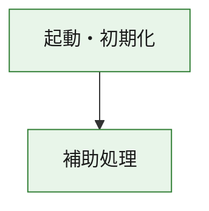
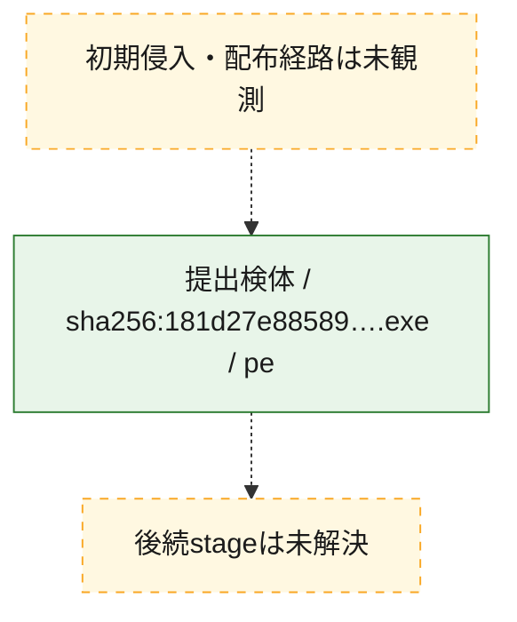
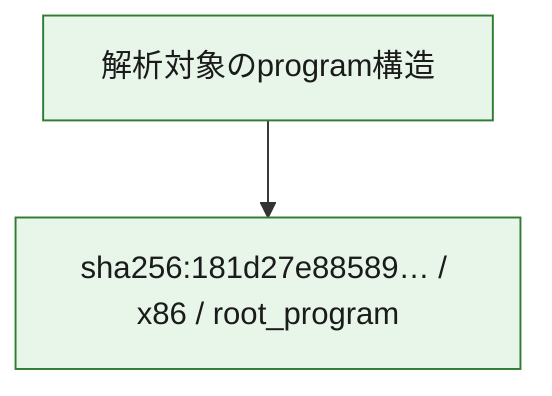

# 全体ロジック：181d27e885890a020271d1b84e990de3ce9daa6ffc1a98cc2652aaaa754d0669

代表関数の静的証跡から、起動・初期化の処理群を確認しました。

## 読み方

- phaseの掲載順は解析上の整理順です。observed_call_edgesがない段階間の実行順を断定しません。
- 図の実線は静的に観測した関係、点線と黄色のノードは未観測・未解決の関係を示します。
- 図は静的な要約であり、動的実行を再現するものではありません。
- 詳細な関数解説とfingerprintは[STATIC-LOGIC.md](STATIC-LOGIC.md)を参照してください。

## 静的可視化

### 実行フロー

### 感染チェーン

### モジュール関係

## 処理段階

### 1. 起動・初期化

entry pointから初期化と後続処理への移行を確認します。
確度: `confirmed_static_function_evidence`

- `181d27e885890a020271d1b84e990de3ce9daa6ffc1a98cc2652aaaa754d0669:ghidra:180001010` — 初期化と主要処理への分岐を行う入口関数です。 状態: `succeeded`、選定理由: `entry_point`, `meaningful_symbol_name`, `reviewed_call_centrality:22`, `role:entrypoint`, `small_program_complete_context`

### 2. 補助処理

主要処理を支える一般内部関数またはlibrary処理を確認します。
確度: `confirmed_static_function_evidence`

- `181d27e885890a020271d1b84e990de3ce9daa6ffc1a98cc2652aaaa754d0669:ghidra:180001240` — 検体内部の一般処理を実装する関数です。 状態: `succeeded`、選定理由: `context_representative`, `reviewed_call_centrality:2`, `small_program_complete_context`
- `181d27e885890a020271d1b84e990de3ce9daa6ffc1a98cc2652aaaa754d0669:ghidra:180001350` — 検体内部の一般処理を実装する関数です。 状態: `succeeded`、選定理由: `context_representative`, `reviewed_call_centrality:25`, `small_program_complete_context`
- `181d27e885890a020271d1b84e990de3ce9daa6ffc1a98cc2652aaaa754d0669:ghidra:180003780` — 検体内部の一般処理を実装する関数です。 状態: `succeeded`、選定理由: `context_representative`, `reviewed_call_centrality:2`, `small_program_complete_context`
- `181d27e885890a020271d1b84e990de3ce9daa6ffc1a98cc2652aaaa754d0669:ghidra:1800038e0` — 検体内部の一般処理を実装する関数です。 状態: `succeeded`、選定理由: `context_representative`, `reviewed_call_centrality:2`, `small_program_complete_context`

## 観測したcall関係

- `181d27e885890a020271d1b84e990de3ce9daa6ffc1a98cc2652aaaa754d0669:ghidra:180001010` → `181d27e885890a020271d1b84e990de3ce9daa6ffc1a98cc2652aaaa754d0669:ghidra:180001240` （`startup` → `support`）
- `181d27e885890a020271d1b84e990de3ce9daa6ffc1a98cc2652aaaa754d0669:ghidra:180001010` → `181d27e885890a020271d1b84e990de3ce9daa6ffc1a98cc2652aaaa754d0669:ghidra:180001350` （`startup` → `support`）
- `181d27e885890a020271d1b84e990de3ce9daa6ffc1a98cc2652aaaa754d0669:ghidra:180001350` → `181d27e885890a020271d1b84e990de3ce9daa6ffc1a98cc2652aaaa754d0669:ghidra:180001240` （`support` → `support`）
- `181d27e885890a020271d1b84e990de3ce9daa6ffc1a98cc2652aaaa754d0669:ghidra:180001350` → `181d27e885890a020271d1b84e990de3ce9daa6ffc1a98cc2652aaaa754d0669:ghidra:180003780` （`support` → `support`）
- `181d27e885890a020271d1b84e990de3ce9daa6ffc1a98cc2652aaaa754d0669:ghidra:180001350` → `181d27e885890a020271d1b84e990de3ce9daa6ffc1a98cc2652aaaa754d0669:ghidra:1800038e0` （`support` → `support`）
- `181d27e885890a020271d1b84e990de3ce9daa6ffc1a98cc2652aaaa754d0669:ghidra:180003780` → `181d27e885890a020271d1b84e990de3ce9daa6ffc1a98cc2652aaaa754d0669:ghidra:1800038e0` （`support` → `support`）
- `ghidra-function:5fcbc7ee3153181c0852a6fd` → `ghidra-function:3ad77e364c56bfdd61456154` （`unclassified` → `unclassified`）
- `ghidra-function:5fcbc7ee3153181c0852a6fd` → `ghidra-function:486cd6aba796df33751a91d8` （`unclassified` → `unclassified`）
- `ghidra-function:5fcbc7ee3153181c0852a6fd` → `ghidra-function:64f062ab6de008df625649f9` （`unclassified` → `unclassified`）
- `ghidra-function:5fcbc7ee3153181c0852a6fd` → `ghidra-function:657c5cee057421d7f7c350a4` （`unclassified` → `unclassified`）
- `ghidra-function:5fcbc7ee3153181c0852a6fd` → `ghidra-function:7a17a7c8520954b63fb9769f` （`unclassified` → `unclassified`）
- `ghidra-function:5fcbc7ee3153181c0852a6fd` → `ghidra-function:7c8c7f208769c5074195f280` （`unclassified` → `unclassified`）
- `ghidra-function:5fcbc7ee3153181c0852a6fd` → `ghidra-function:7e8e3ea2f334aba85614f515` （`unclassified` → `unclassified`）
- `ghidra-function:5fcbc7ee3153181c0852a6fd` → `ghidra-function:d17df58e6b6e90c2036e664c` （`unclassified` → `unclassified`）
- `ghidra-function:5fcbc7ee3153181c0852a6fd` → `ghidra-function:d430d3a9fc5db905924cad68` （`unclassified` → `unclassified`）
- `ghidra-function:5fcbc7ee3153181c0852a6fd` → `ghidra-function:d695bf2ce34242c017e064d0` （`unclassified` → `unclassified`）
- `ghidra-function:5fcbc7ee3153181c0852a6fd` → `ghidra-function:dee0f50ee3fc11e4ef990295` （`unclassified` → `unclassified`）
- `ghidra-function:5fcbc7ee3153181c0852a6fd` → `ghidra-function:fa4b6f1251d1c9670c6b6573` （`unclassified` → `unclassified`）
- `ghidra-function:7a17a7c8520954b63fb9769f` → `ghidra-external:0695061a8d8e1240b77dfe6a` （`unclassified` → `unclassified`）
- `ghidra-function:7a17a7c8520954b63fb9769f` → `ghidra-external:082667367dfe2a5106aaba4f` （`unclassified` → `unclassified`）
- `ghidra-function:7a17a7c8520954b63fb9769f` → `ghidra-external:1967099202ad9ddb7eb57d90` （`unclassified` → `unclassified`）
- `ghidra-function:7a17a7c8520954b63fb9769f` → `ghidra-external:1fd5f6426b4424f3c227caaf` （`unclassified` → `unclassified`）
- `ghidra-function:7a17a7c8520954b63fb9769f` → `ghidra-external:294cd22bfe4c6429a9b0b499` （`unclassified` → `unclassified`）
- `ghidra-function:7a17a7c8520954b63fb9769f` → `ghidra-external:2e7f10ded518d8e11f9eeb7b` （`unclassified` → `unclassified`）
- `ghidra-function:7a17a7c8520954b63fb9769f` → `ghidra-external:483684b5457bf480644277c7` （`unclassified` → `unclassified`）
- `ghidra-function:7a17a7c8520954b63fb9769f` → `ghidra-external:4b505b823b9de8142a91d63b` （`unclassified` → `unclassified`）
- `ghidra-function:7a17a7c8520954b63fb9769f` → `ghidra-external:52c4511299e277d737740f4c` （`unclassified` → `unclassified`）
- `ghidra-function:7a17a7c8520954b63fb9769f` → `ghidra-external:561610613512d4bcb6639053` （`unclassified` → `unclassified`）
- `ghidra-function:7a17a7c8520954b63fb9769f` → `ghidra-external:64be887031d93893d92381c4` （`unclassified` → `unclassified`）
- `ghidra-function:7a17a7c8520954b63fb9769f` → `ghidra-external:8f6935fea0850a06632afb96` （`unclassified` → `unclassified`）
- `ghidra-function:7a17a7c8520954b63fb9769f` → `ghidra-external:9c2bec1f407b174eb8f381a8` （`unclassified` → `unclassified`）
- `ghidra-function:7a17a7c8520954b63fb9769f` → `ghidra-external:b74e1df9221d44dbba553117` （`unclassified` → `unclassified`）
- `ghidra-function:7a17a7c8520954b63fb9769f` → `ghidra-external:bec85e64cdbc4ce305527bd7` （`unclassified` → `unclassified`）
- `ghidra-function:7a17a7c8520954b63fb9769f` → `ghidra-external:c2703c13a699618880166988` （`unclassified` → `unclassified`）
- `ghidra-function:7a17a7c8520954b63fb9769f` → `ghidra-external:c9a41a134b4f27f54f270aad` （`unclassified` → `unclassified`）
- `ghidra-function:7a17a7c8520954b63fb9769f` → `ghidra-external:ca3fe72eb1f6df390d081144` （`unclassified` → `unclassified`）
- `ghidra-function:7a17a7c8520954b63fb9769f` → `ghidra-external:de2b4ccdfcaa3c7bc97b24cf` （`unclassified` → `unclassified`）
- `ghidra-function:7a17a7c8520954b63fb9769f` → `ghidra-external:f34b42de598ca886e5b3c4b2` （`unclassified` → `unclassified`）
- `ghidra-function:7a17a7c8520954b63fb9769f` → `ghidra-external:fff9a17f217d68acecc6167c` （`unclassified` → `unclassified`）
- `ghidra-function:7a17a7c8520954b63fb9769f` → `ghidra-function:486cd6aba796df33751a91d8` （`unclassified` → `unclassified`）
- `ghidra-function:7a17a7c8520954b63fb9769f` → `ghidra-function:9c937b2648f0c03ec94be09b` （`unclassified` → `unclassified`）
- `ghidra-function:7a17a7c8520954b63fb9769f` → `ghidra-function:acd59a828ce1a9f41f8a23c0` （`unclassified` → `unclassified`）
- `ghidra-function:acd59a828ce1a9f41f8a23c0` → `ghidra-function:9c937b2648f0c03ec94be09b` （`unclassified` → `unclassified`）

## 解析範囲と制約

- 選定外関数は全体inventoryへ残しますが、関数本体の個別解説対象にはしていません。
- indirect call、難読化、packer、VM、壊れたcontrol flowによりcall関係が欠落する場合があります。
- 文書は静的解析に基づき、検体実行や外部通信による動的確認は行っていません。
