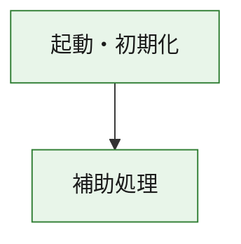
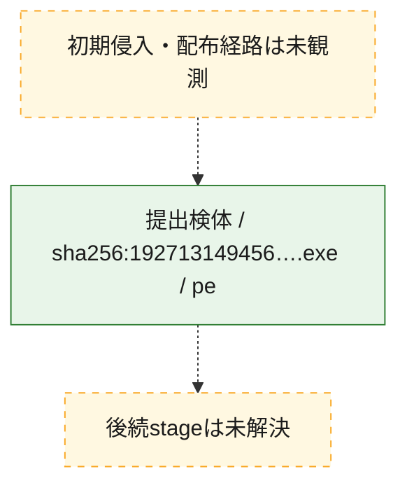
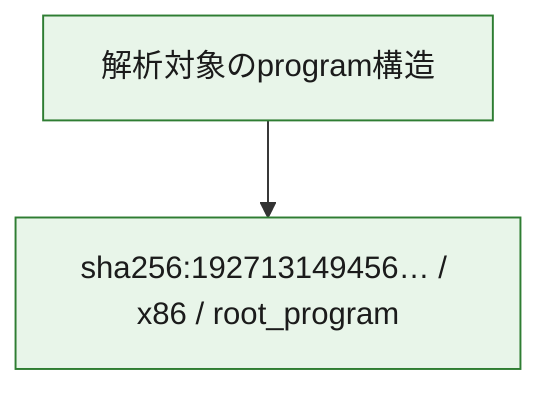

# 全体ロジック：192713149456b04685fd2e497549031c440aa3ad8d74d0c61ebcde926384cc9e

代表関数の静的証跡から、起動・初期化の処理群を確認しました。

## 読み方

- phaseの掲載順は解析上の整理順です。observed_call_edgesがない段階間の実行順を断定しません。
- 図の実線は静的に観測した関係、点線と黄色のノードは未観測・未解決の関係を示します。
- 図は静的な要約であり、動的実行を再現するものではありません。
- 詳細な関数解説とfingerprintは[STATIC-LOGIC.md](STATIC-LOGIC.md)を参照してください。

## 静的可視化

### 実行フロー

### 感染チェーン

### モジュール関係

## 処理段階

### 1. 起動・初期化

entry pointから初期化と後続処理への移行を確認します。
確度: `confirmed_static_function_evidence`

- `192713149456b04685fd2e497549031c440aa3ad8d74d0c61ebcde926384cc9e:ghidra:180001010` — 初期化と主要処理への分岐を行う入口関数です。 状態: `succeeded`、選定理由: `entry_point`, `meaningful_symbol_name`, `reviewed_call_centrality:22`, `role:entrypoint`, `small_program_complete_context`

### 2. 補助処理

主要処理を支える一般内部関数またはlibrary処理を確認します。
確度: `confirmed_static_function_evidence`

- `192713149456b04685fd2e497549031c440aa3ad8d74d0c61ebcde926384cc9e:ghidra:180001240` — 検体内部の一般処理を実装する関数です。 状態: `succeeded`、選定理由: `context_representative`, `reviewed_call_centrality:2`, `small_program_complete_context`
- `192713149456b04685fd2e497549031c440aa3ad8d74d0c61ebcde926384cc9e:ghidra:180001350` — 検体内部の一般処理を実装する関数です。 状態: `succeeded`、選定理由: `context_representative`, `reviewed_call_centrality:25`, `small_program_complete_context`
- `192713149456b04685fd2e497549031c440aa3ad8d74d0c61ebcde926384cc9e:ghidra:180003780` — 検体内部の一般処理を実装する関数です。 状態: `succeeded`、選定理由: `context_representative`, `reviewed_call_centrality:2`, `small_program_complete_context`
- `192713149456b04685fd2e497549031c440aa3ad8d74d0c61ebcde926384cc9e:ghidra:1800038e0` — 検体内部の一般処理を実装する関数です。 状態: `succeeded`、選定理由: `context_representative`, `reviewed_call_centrality:2`, `small_program_complete_context`

## 観測したcall関係

- `192713149456b04685fd2e497549031c440aa3ad8d74d0c61ebcde926384cc9e:ghidra:180001010` → `192713149456b04685fd2e497549031c440aa3ad8d74d0c61ebcde926384cc9e:ghidra:180001240` （`startup` → `support`）
- `192713149456b04685fd2e497549031c440aa3ad8d74d0c61ebcde926384cc9e:ghidra:180001010` → `192713149456b04685fd2e497549031c440aa3ad8d74d0c61ebcde926384cc9e:ghidra:180001350` （`startup` → `support`）
- `192713149456b04685fd2e497549031c440aa3ad8d74d0c61ebcde926384cc9e:ghidra:180001350` → `192713149456b04685fd2e497549031c440aa3ad8d74d0c61ebcde926384cc9e:ghidra:180001240` （`support` → `support`）
- `192713149456b04685fd2e497549031c440aa3ad8d74d0c61ebcde926384cc9e:ghidra:180001350` → `192713149456b04685fd2e497549031c440aa3ad8d74d0c61ebcde926384cc9e:ghidra:180003780` （`support` → `support`）
- `192713149456b04685fd2e497549031c440aa3ad8d74d0c61ebcde926384cc9e:ghidra:180001350` → `192713149456b04685fd2e497549031c440aa3ad8d74d0c61ebcde926384cc9e:ghidra:1800038e0` （`support` → `support`）
- `192713149456b04685fd2e497549031c440aa3ad8d74d0c61ebcde926384cc9e:ghidra:180003780` → `192713149456b04685fd2e497549031c440aa3ad8d74d0c61ebcde926384cc9e:ghidra:1800038e0` （`support` → `support`）
- `ghidra-function:6cfdd0f2232079a0d41a7bb8` → `ghidra-function:bcdca36f93d0e27d5c99303b` （`unclassified` → `unclassified`）
- `ghidra-function:71c1fa8cbfa7e06e250d3507` → `ghidra-external:0ca51db58de5023170d72077` （`unclassified` → `unclassified`）
- `ghidra-function:71c1fa8cbfa7e06e250d3507` → `ghidra-external:101f1ac6509664d74d0d3fed` （`unclassified` → `unclassified`）
- `ghidra-function:71c1fa8cbfa7e06e250d3507` → `ghidra-external:1744fd2eac984335c0756098` （`unclassified` → `unclassified`）
- `ghidra-function:71c1fa8cbfa7e06e250d3507` → `ghidra-external:354524412c219124fb74c03b` （`unclassified` → `unclassified`）
- `ghidra-function:71c1fa8cbfa7e06e250d3507` → `ghidra-external:4ef32522395044d48508c066` （`unclassified` → `unclassified`）
- `ghidra-function:71c1fa8cbfa7e06e250d3507` → `ghidra-external:51a2359d68760a9f512f8723` （`unclassified` → `unclassified`）
- `ghidra-function:71c1fa8cbfa7e06e250d3507` → `ghidra-external:621c6f7401ce22fc278155ac` （`unclassified` → `unclassified`）
- `ghidra-function:71c1fa8cbfa7e06e250d3507` → `ghidra-external:67807c20d3bbe2be040602c9` （`unclassified` → `unclassified`）
- `ghidra-function:71c1fa8cbfa7e06e250d3507` → `ghidra-external:7a88b7298be09a9ea0acb1b2` （`unclassified` → `unclassified`）
- `ghidra-function:71c1fa8cbfa7e06e250d3507` → `ghidra-external:95edc35309ed115dad639aee` （`unclassified` → `unclassified`）
- `ghidra-function:71c1fa8cbfa7e06e250d3507` → `ghidra-external:964987ed7b680563ed33cce5` （`unclassified` → `unclassified`）
- `ghidra-function:71c1fa8cbfa7e06e250d3507` → `ghidra-external:b689e4f70458ef8c082ea2ae` （`unclassified` → `unclassified`）
- `ghidra-function:71c1fa8cbfa7e06e250d3507` → `ghidra-external:bb9f7fd562eac1c987b777a8` （`unclassified` → `unclassified`）
- `ghidra-function:71c1fa8cbfa7e06e250d3507` → `ghidra-external:be9e430ac033d6b11f5ec9a8` （`unclassified` → `unclassified`）
- `ghidra-function:71c1fa8cbfa7e06e250d3507` → `ghidra-external:caed63a67847bb00e9e5cc9e` （`unclassified` → `unclassified`）
- `ghidra-function:71c1fa8cbfa7e06e250d3507` → `ghidra-external:d08dc12553e242b5f9f221d5` （`unclassified` → `unclassified`）
- `ghidra-function:71c1fa8cbfa7e06e250d3507` → `ghidra-external:ee463511ce49c72fa05f7a10` （`unclassified` → `unclassified`）
- `ghidra-function:71c1fa8cbfa7e06e250d3507` → `ghidra-external:efb81826b83b171592b0eb0c` （`unclassified` → `unclassified`）
- `ghidra-function:71c1fa8cbfa7e06e250d3507` → `ghidra-external:f11390900bccc0ed382fd169` （`unclassified` → `unclassified`）
- `ghidra-function:71c1fa8cbfa7e06e250d3507` → `ghidra-external:f7c0949de4f3b64fbbddca00` （`unclassified` → `unclassified`）
- `ghidra-function:71c1fa8cbfa7e06e250d3507` → `ghidra-external:fa49fdd1700c407be81d4a0f` （`unclassified` → `unclassified`）
- `ghidra-function:71c1fa8cbfa7e06e250d3507` → `ghidra-function:6cfdd0f2232079a0d41a7bb8` （`unclassified` → `unclassified`）
- `ghidra-function:71c1fa8cbfa7e06e250d3507` → `ghidra-function:bcdca36f93d0e27d5c99303b` （`unclassified` → `unclassified`）
- `ghidra-function:71c1fa8cbfa7e06e250d3507` → `ghidra-function:ede7af786e28f95390893b7b` （`unclassified` → `unclassified`）
- `ghidra-function:c9482694f17510901ad5d0d2` → `ghidra-function:07c5327c9ae1db18be1a9d79` （`unclassified` → `unclassified`）
- `ghidra-function:c9482694f17510901ad5d0d2` → `ghidra-function:1b60b26b444badbf3dc71150` （`unclassified` → `unclassified`）
- `ghidra-function:c9482694f17510901ad5d0d2` → `ghidra-function:24c1f9d386a63a0521c3647e` （`unclassified` → `unclassified`）
- `ghidra-function:c9482694f17510901ad5d0d2` → `ghidra-function:71c1fa8cbfa7e06e250d3507` （`unclassified` → `unclassified`）
- `ghidra-function:c9482694f17510901ad5d0d2` → `ghidra-function:9fb6c0f2f6dc8b7db3ef67cf` （`unclassified` → `unclassified`）
- `ghidra-function:c9482694f17510901ad5d0d2` → `ghidra-function:a0b75c912756805aa55ac92c` （`unclassified` → `unclassified`）
- `ghidra-function:c9482694f17510901ad5d0d2` → `ghidra-function:ba389fe001df54d909836420` （`unclassified` → `unclassified`）
- `ghidra-function:c9482694f17510901ad5d0d2` → `ghidra-function:c797a391c63432e62c4d3984` （`unclassified` → `unclassified`）
- `ghidra-function:c9482694f17510901ad5d0d2` → `ghidra-function:cbd0f9135fd049a2daa2af49` （`unclassified` → `unclassified`）
- `ghidra-function:c9482694f17510901ad5d0d2` → `ghidra-function:ce84a58381babdc734488790` （`unclassified` → `unclassified`）
- `ghidra-function:c9482694f17510901ad5d0d2` → `ghidra-function:d3d8f0c4abe49bd3daa21556` （`unclassified` → `unclassified`）
- `ghidra-function:c9482694f17510901ad5d0d2` → `ghidra-function:ede7af786e28f95390893b7b` （`unclassified` → `unclassified`）

## 解析範囲と制約

- 選定外関数は全体inventoryへ残しますが、関数本体の個別解説対象にはしていません。
- indirect call、難読化、packer、VM、壊れたcontrol flowによりcall関係が欠落する場合があります。
- 文書は静的解析に基づき、検体実行や外部通信による動的確認は行っていません。
