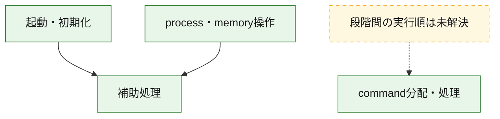
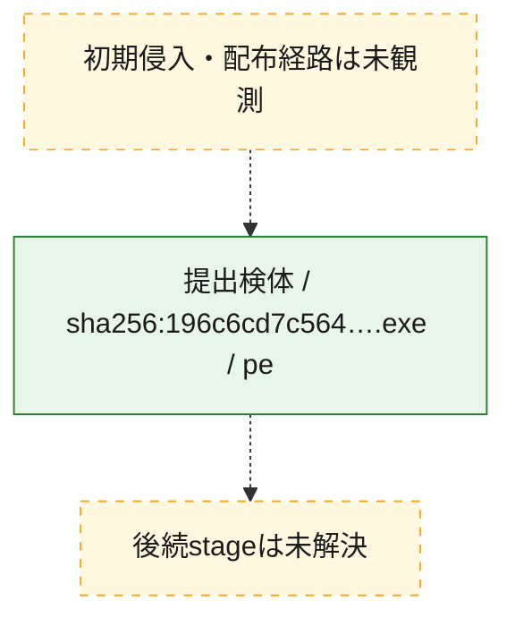
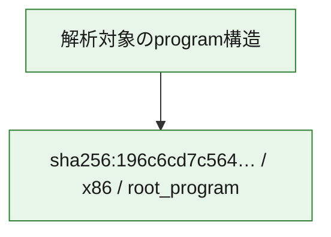

# 全体ロジック：196c6cd7c56411383a8da41d36c0194db42564a488d415c397e21d8102c99168

代表関数の静的証跡から、起動・初期化、process・memory操作、command分配・処理の処理群を確認しました。

## 読み方

- phaseの掲載順は解析上の整理順です。observed_call_edgesがない段階間の実行順を断定しません。
- 図の実線は静的に観測した関係、点線と黄色のノードは未観測・未解決の関係を示します。
- 図は静的な要約であり、動的実行を再現するものではありません。
- 詳細な関数解説とfingerprintは[STATIC-LOGIC.md](STATIC-LOGIC.md)を参照してください。

## 静的可視化

### 実行フロー

### 感染チェーン

### モジュール関係

## 処理段階

### 1. 起動・初期化

entry pointから初期化と後続処理への移行を確認します。
確度: `confirmed_static_function_evidence`

- `196c6cd7c56411383a8da41d36c0194db42564a488d415c397e21d8102c99168:ghidra:140007bb0` — 初期化と主要処理への分岐を行う入口関数です。 状態: `succeeded`、選定理由: `entry_point`, `meaningful_symbol_name`, `probable_go_main_user_code`, `reviewed_call_centrality:41`, `role:entrypoint`

### 2. process・memory操作

process、thread、module、memory操作と実行移行を確認します。
確度: `confirmed_static_function_evidence`

- `196c6cd7c56411383a8da41d36c0194db42564a488d415c397e21d8102c99168:ghidra:140001860` — process、thread、module、またはmemory操作に関係する関数です。 状態: `succeeded`、選定理由: `meaningful_symbol_name`, `reviewed_call_centrality:16`, `role:process_or_memory_operation`
- `196c6cd7c56411383a8da41d36c0194db42564a488d415c397e21d8102c99168:ghidra:1400018d0` — process、thread、module、またはmemory操作に関係する関数です。 状態: `succeeded`、選定理由: `meaningful_symbol_name`, `reviewed_call_centrality:12`, `role:process_or_memory_operation`

### 3. command分配・処理

受信commandやtaskの解釈、分配、個別handlerへの移行を確認します。
確度: `confirmed_static_function_evidence`

- `196c6cd7c56411383a8da41d36c0194db42564a488d415c397e21d8102c99168:ghidra:1400074c0` — commandの解釈、分配、または個別処理を担当する関数です。 状態: `succeeded`、選定理由: `meaningful_symbol_name`, `role:command_dispatch_or_handler`
- `196c6cd7c56411383a8da41d36c0194db42564a488d415c397e21d8102c99168:ghidra:1400074d0` — commandの解釈、分配、または個別処理を担当する関数です。 状態: `succeeded`、選定理由: `meaningful_symbol_name`, `reviewed_call_centrality:2`, `role:command_dispatch_or_handler`

### 4. 補助処理

主要処理を支える一般内部関数またはlibrary処理を確認します。
確度: `confirmed_static_function_evidence_with_limits`

- `196c6cd7c56411383a8da41d36c0194db42564a488d415c397e21d8102c99168:ghidra:140001010` — 検体内部の一般処理を実装する関数です。 状態: `succeeded`、選定理由: `meaningful_symbol_name`, `reviewed_call_centrality:6`
- `196c6cd7c56411383a8da41d36c0194db42564a488d415c397e21d8102c99168:ghidra:140001140` — 検体内部の一般処理を実装する関数です。 状態: `succeeded`、選定理由: `meaningful_symbol_name`, `reviewed_call_centrality:1`
- `196c6cd7c56411383a8da41d36c0194db42564a488d415c397e21d8102c99168:ghidra:1400013e0` — 検体内部の一般処理を実装する関数です。 状態: `succeeded`、選定理由: `meaningful_symbol_name`, `reviewed_call_centrality:1`
- `196c6cd7c56411383a8da41d36c0194db42564a488d415c397e21d8102c99168:ghidra:140001410` — 検体内部の一般処理を実装する関数です。 状態: `succeeded`、選定理由: `entry_point`, `meaningful_symbol_name`, `reviewed_call_centrality:1`
- `196c6cd7c56411383a8da41d36c0194db42564a488d415c397e21d8102c99168:ghidra:140001440` — 検体内部の一般処理を実装する関数です。 状態: `succeeded`、選定理由: `meaningful_symbol_name`, `reviewed_call_centrality:2`
- `196c6cd7c56411383a8da41d36c0194db42564a488d415c397e21d8102c99168:ghidra:140001480` — 検体内部の一般処理を実装する関数です。 状態: `succeeded`、選定理由: `meaningful_symbol_name`, `reviewed_call_centrality:2`
- `196c6cd7c56411383a8da41d36c0194db42564a488d415c397e21d8102c99168:ghidra:140001580` — 検体内部の一般処理を実装する関数です。 状態: `succeeded`、選定理由: `meaningful_symbol_name`, `reviewed_call_centrality:1`
- `196c6cd7c56411383a8da41d36c0194db42564a488d415c397e21d8102c99168:ghidra:140001670` — 検体内部の一般処理を実装する関数です。 状態: `succeeded`、選定理由: `meaningful_symbol_name`, `reviewed_call_centrality:1`
- `196c6cd7c56411383a8da41d36c0194db42564a488d415c397e21d8102c99168:ghidra:140001680` — compiler生成処理または汎用library処理とみられる関数です。 状態: `succeeded`、選定理由: `entry_point`, `meaningful_symbol_name`, `reviewed_call_centrality:1`
- `196c6cd7c56411383a8da41d36c0194db42564a488d415c397e21d8102c99168:ghidra:1400016b0` — compiler生成処理または汎用library処理とみられる関数です。 状態: `succeeded`、選定理由: `entry_point`, `meaningful_symbol_name`, `reviewed_call_centrality:2`
- `196c6cd7c56411383a8da41d36c0194db42564a488d415c397e21d8102c99168:ghidra:140001750` — 検体内部の一般処理を実装する関数です。 状態: `succeeded`、選定理由: `meaningful_symbol_name`, `reviewed_call_centrality:3`
- `196c6cd7c56411383a8da41d36c0194db42564a488d415c397e21d8102c99168:ghidra:140001850` — 検体内部の一般処理を実装する関数です。 状態: `succeeded`、選定理由: `meaningful_symbol_name`, `reviewed_call_centrality:1`
- `196c6cd7c56411383a8da41d36c0194db42564a488d415c397e21d8102c99168:ghidra:140001a40` — 検体内部の一般処理を実装する関数です。 状態: `succeeded`、選定理由: `meaningful_symbol_name`, `reviewed_call_centrality:3`
- `196c6cd7c56411383a8da41d36c0194db42564a488d415c397e21d8102c99168:ghidra:140001df0` — 検体内部の一般処理を実装する関数です。 状態: `limited_bad_instruction_or_flow`、選定理由: `meaningful_symbol_name`, `reviewed_call_centrality:3`
- `196c6cd7c56411383a8da41d36c0194db42564a488d415c397e21d8102c99168:ghidra:140002250` — 検体内部の一般処理を実装する関数です。 状態: `succeeded`、選定理由: `meaningful_symbol_name`, `reviewed_call_centrality:1`
- `196c6cd7c56411383a8da41d36c0194db42564a488d415c397e21d8102c99168:ghidra:140002280` — 検体内部の一般処理を実装する関数です。 状態: `succeeded`、選定理由: `meaningful_symbol_name`
- `196c6cd7c56411383a8da41d36c0194db42564a488d415c397e21d8102c99168:ghidra:1400022d0` — 検体内部の一般処理を実装する関数です。 状態: `succeeded`、選定理由: `meaningful_symbol_name`, `reviewed_call_centrality:2`
- `196c6cd7c56411383a8da41d36c0194db42564a488d415c397e21d8102c99168:ghidra:140002440` — 検体内部の一般処理を実装する関数です。 状態: `succeeded`、選定理由: `meaningful_symbol_name`
- `196c6cd7c56411383a8da41d36c0194db42564a488d415c397e21d8102c99168:ghidra:1400024c0` — 検体内部の一般処理を実装する関数です。 状態: `succeeded`、選定理由: `meaningful_symbol_name`, `reviewed_call_centrality:3`
- `196c6cd7c56411383a8da41d36c0194db42564a488d415c397e21d8102c99168:ghidra:140002500` — 検体内部の一般処理を実装する関数です。 状態: `succeeded`、選定理由: `meaningful_symbol_name`, `reviewed_call_centrality:1`
- `196c6cd7c56411383a8da41d36c0194db42564a488d415c397e21d8102c99168:ghidra:140002690` — 検体内部の一般処理を実装する関数です。 状態: `succeeded`、選定理由: `meaningful_symbol_name`, `reviewed_call_centrality:4`
- `196c6cd7c56411383a8da41d36c0194db42564a488d415c397e21d8102c99168:ghidra:140006680` — 検体内部の一般処理を実装する関数です。 状態: `limited_bad_instruction_or_flow`、選定理由: `meaningful_symbol_name`, `reviewed_call_centrality:10`
- `196c6cd7c56411383a8da41d36c0194db42564a488d415c397e21d8102c99168:ghidra:140006770` — 検体内部の一般処理を実装する関数です。 状態: `limited_bad_instruction_or_flow`、選定理由: `meaningful_symbol_name`, `reviewed_call_centrality:4`
- `196c6cd7c56411383a8da41d36c0194db42564a488d415c397e21d8102c99168:ghidra:140007360` — 検体内部の一般処理を実装する関数です。 状態: `succeeded`、選定理由: `meaningful_symbol_name`
- `196c6cd7c56411383a8da41d36c0194db42564a488d415c397e21d8102c99168:ghidra:1400073e0` — 検体内部の一般処理を実装する関数です。 状態: `limited_bad_instruction_or_flow`、選定理由: `meaningful_symbol_name`, `reviewed_call_centrality:5`
- `196c6cd7c56411383a8da41d36c0194db42564a488d415c397e21d8102c99168:ghidra:140007450` — 検体内部の一般処理を実装する関数です。 状態: `limited_bad_instruction_or_flow`、選定理由: `meaningful_symbol_name`, `reviewed_call_centrality:6`
- `196c6cd7c56411383a8da41d36c0194db42564a488d415c397e21d8102c99168:ghidra:1400075a0` — 検体内部の一般処理を実装する関数です。 状態: `succeeded`、選定理由: `meaningful_symbol_name`, `reviewed_call_centrality:3`

## 観測したcall関係

- `196c6cd7c56411383a8da41d36c0194db42564a488d415c397e21d8102c99168:ghidra:140001860` → `196c6cd7c56411383a8da41d36c0194db42564a488d415c397e21d8102c99168:ghidra:1400024c0` （`execution` → `support`）
- `196c6cd7c56411383a8da41d36c0194db42564a488d415c397e21d8102c99168:ghidra:1400018d0` → `196c6cd7c56411383a8da41d36c0194db42564a488d415c397e21d8102c99168:ghidra:1400024c0` （`execution` → `support`）
- `196c6cd7c56411383a8da41d36c0194db42564a488d415c397e21d8102c99168:ghidra:140001df0` → `196c6cd7c56411383a8da41d36c0194db42564a488d415c397e21d8102c99168:ghidra:140001850` （`support` → `support`）
- `196c6cd7c56411383a8da41d36c0194db42564a488d415c397e21d8102c99168:ghidra:140002690` → `196c6cd7c56411383a8da41d36c0194db42564a488d415c397e21d8102c99168:ghidra:1400073e0` （`support` → `support`）
- `196c6cd7c56411383a8da41d36c0194db42564a488d415c397e21d8102c99168:ghidra:140002690` → `196c6cd7c56411383a8da41d36c0194db42564a488d415c397e21d8102c99168:ghidra:140007450` （`support` → `support`）
- `196c6cd7c56411383a8da41d36c0194db42564a488d415c397e21d8102c99168:ghidra:140006680` → `196c6cd7c56411383a8da41d36c0194db42564a488d415c397e21d8102c99168:ghidra:140001440` （`support` → `support`）
- `196c6cd7c56411383a8da41d36c0194db42564a488d415c397e21d8102c99168:ghidra:140007bb0` → `196c6cd7c56411383a8da41d36c0194db42564a488d415c397e21d8102c99168:ghidra:140001480` （`startup` → `support`）
- `ghidra-function:04ce63b67ac1c5be8cb0096d` → `ghidra-external:03bd6fff08996127383f8176` （`unclassified` → `unclassified`）
- `ghidra-function:04ce63b67ac1c5be8cb0096d` → `ghidra-external:7a878482edf53029594353d6` （`unclassified` → `unclassified`）
- `ghidra-function:04ce63b67ac1c5be8cb0096d` → `ghidra-external:d7ae92fffee21df86b561db6` （`unclassified` → `unclassified`）
- `ghidra-function:04ce63b67ac1c5be8cb0096d` → `ghidra-external:db10c80dd69ebc99377418aa` （`unclassified` → `unclassified`）
- `ghidra-function:04ce63b67ac1c5be8cb0096d` → `ghidra-external:e25771734b28abb09ccf0045` （`unclassified` → `unclassified`）
- `ghidra-function:04ce63b67ac1c5be8cb0096d` → `ghidra-external:e822199bc0a3b369ef098588` （`unclassified` → `unclassified`）
- `ghidra-function:04ce63b67ac1c5be8cb0096d` → `ghidra-function:42ef1c8c7dbbff8424aabcb5` （`unclassified` → `unclassified`）
- `ghidra-function:04ce63b67ac1c5be8cb0096d` → `ghidra-function:5fe2cd94a0952957353a8968` （`unclassified` → `unclassified`）
- `ghidra-function:04ce63b67ac1c5be8cb0096d` → `ghidra-function:7e7aa21c30109b661d6ead27` （`unclassified` → `unclassified`）
- `ghidra-function:04ce63b67ac1c5be8cb0096d` → `ghidra-function:9b4d2df7fed75e3a427e6e90` （`unclassified` → `unclassified`）
- `ghidra-function:04ce63b67ac1c5be8cb0096d` → `ghidra-function:aa7d96991397636d1ab99571` （`unclassified` → `unclassified`）
- `ghidra-function:04ce63b67ac1c5be8cb0096d` → `ghidra-function:c5ccb5e50ce96da200b4564c` （`unclassified` → `unclassified`）
- `ghidra-function:04ce63b67ac1c5be8cb0096d` → `ghidra-function:e862934cb5f029fcada64295` （`unclassified` → `unclassified`）
- `ghidra-function:0510dc1ba93818b89167b8d2` → `ghidra-external:8460872dc213a6df90131fb1` （`unclassified` → `unclassified`）
- `ghidra-function:0510dc1ba93818b89167b8d2` → `ghidra-external:d7ae92fffee21df86b561db6` （`unclassified` → `unclassified`）
- `ghidra-function:0510dc1ba93818b89167b8d2` → `ghidra-function:7288ddb999fa8b14aabfd055` （`unclassified` → `unclassified`）
- `ghidra-function:1c4297ac1c77609ace15d534` → `ghidra-external:4babf7f19b1fba3382e18a52` （`unclassified` → `unclassified`）
- `ghidra-function:1c6e2af0f1d865446a74a49f` → `ghidra-external:890de78f810d7b52373250eb` （`unclassified` → `unclassified`）
- `ghidra-function:1c6e2af0f1d865446a74a49f` → `ghidra-external:d9eddbad0efa4ab20d4e2cb1` （`unclassified` → `unclassified`）
- `ghidra-function:2b8a45d2fa0933525c91ac13` → `ghidra-external:d7ae92fffee21df86b561db6` （`unclassified` → `unclassified`）
- `ghidra-function:3a906033647c122667c2d110` → `ghidra-external:d2f20b99eb299c67804ccf3d` （`unclassified` → `unclassified`）
- `ghidra-function:3a906033647c122667c2d110` → `ghidra-function:7e7aa21c30109b661d6ead27` （`unclassified` → `unclassified`）
- `ghidra-function:3a906033647c122667c2d110` → `ghidra-function:9511396ab26164936b19b2ca` （`unclassified` → `unclassified`）
- `ghidra-function:42ef1c8c7dbbff8424aabcb5` → `ghidra-external:7a878482edf53029594353d6` （`unclassified` → `unclassified`）
- `ghidra-function:4bbe9b73aed5c86c263e41a8` → `ghidra-function:dea26b6922dbdcd9c1874444` （`unclassified` → `unclassified`）
- `ghidra-function:4e9fdf6ea941a71a0bae583b` → `ghidra-external:7a878482edf53029594353d6` （`unclassified` → `unclassified`）
- `ghidra-function:6b3425a05a07d72001977a4c` → `ghidra-external:7a878482edf53029594353d6` （`unclassified` → `unclassified`）
- `ghidra-function:6b3425a05a07d72001977a4c` → `ghidra-external:d7ae92fffee21df86b561db6` （`unclassified` → `unclassified`）
- `ghidra-function:6b3425a05a07d72001977a4c` → `ghidra-external:e25771734b28abb09ccf0045` （`unclassified` → `unclassified`）
- `ghidra-function:6b3425a05a07d72001977a4c` → `ghidra-function:42ef1c8c7dbbff8424aabcb5` （`unclassified` → `unclassified`）
- `ghidra-function:6b3425a05a07d72001977a4c` → `ghidra-function:5fe2cd94a0952957353a8968` （`unclassified` → `unclassified`）
- `ghidra-function:6b3425a05a07d72001977a4c` → `ghidra-function:9b4d2df7fed75e3a427e6e90` （`unclassified` → `unclassified`）
- `ghidra-function:6b3425a05a07d72001977a4c` → `ghidra-function:aa7d96991397636d1ab99571` （`unclassified` → `unclassified`）
- `ghidra-function:6b3425a05a07d72001977a4c` → `ghidra-function:c5ccb5e50ce96da200b4564c` （`unclassified` → `unclassified`）
- `ghidra-function:6b3425a05a07d72001977a4c` → `ghidra-function:e862934cb5f029fcada64295` （`unclassified` → `unclassified`）
- `ghidra-function:70b2e218210989d4b31704c5` → `ghidra-external:235200d7baca9a0d525c3561` （`unclassified` → `unclassified`）
- `ghidra-function:7503eecf3710fb4f8025b104` → `ghidra-external:322d3e227517f3f963768b4d` （`unclassified` → `unclassified`）
- `ghidra-function:7503eecf3710fb4f8025b104` → `ghidra-external:5ec4a8605e7f5bb1131f1fe6` （`unclassified` → `unclassified`）
- `ghidra-function:7503eecf3710fb4f8025b104` → `ghidra-function:481ede038681390cfb932af9` （`unclassified` → `unclassified`）
- `ghidra-function:8a4956e618c66008b2b6f598` → `ghidra-external:051d774d0dfc0ac615538bf3` （`unclassified` → `unclassified`）
- `ghidra-function:8a4956e618c66008b2b6f598` → `ghidra-external:1d6ce48d8f6f694d121fee97` （`unclassified` → `unclassified`）
- `ghidra-function:8a4956e618c66008b2b6f598` → `ghidra-external:39c80af6fe9e245f69ae9d68` （`unclassified` → `unclassified`）
- `ghidra-function:8a4956e618c66008b2b6f598` → `ghidra-external:7755fe47b2502abbd7ad4b7c` （`unclassified` → `unclassified`）
- `ghidra-function:8a4956e618c66008b2b6f598` → `ghidra-external:890de78f810d7b52373250eb` （`unclassified` → `unclassified`）
- `ghidra-function:8a4956e618c66008b2b6f598` → `ghidra-external:aa67e256b8e1abb02c45530f` （`unclassified` → `unclassified`）
- `ghidra-function:8a4956e618c66008b2b6f598` → `ghidra-external:c30041c738cc55940ffc04a9` （`unclassified` → `unclassified`）
- `ghidra-function:8a4956e618c66008b2b6f598` → `ghidra-external:e968fbe6677b942092792f12` （`unclassified` → `unclassified`）
- `ghidra-function:8a4956e618c66008b2b6f598` → `ghidra-external:f08b177fb71c732c02ab5920` （`unclassified` → `unclassified`）
- `ghidra-function:8a4956e618c66008b2b6f598` → `ghidra-function:0a70a06d60a15f55a014ea93` （`unclassified` → `unclassified`）
- `ghidra-function:8a4956e618c66008b2b6f598` → `ghidra-function:1ba3baba3f1e9cfb0d7dfc48` （`unclassified` → `unclassified`）
- `ghidra-function:8a4956e618c66008b2b6f598` → `ghidra-function:1ca0d70a168a635bea014c13` （`unclassified` → `unclassified`）
- `ghidra-function:8a4956e618c66008b2b6f598` → `ghidra-function:62df4f22cb9cf487bcf74e88` （`unclassified` → `unclassified`）
- `ghidra-function:8a4956e618c66008b2b6f598` → `ghidra-function:65927f3c2eded89af9575f2f` （`unclassified` → `unclassified`）
- `ghidra-function:8a4956e618c66008b2b6f598` → `ghidra-function:6914588b14ba24b6654990f1` （`unclassified` → `unclassified`）
- `ghidra-function:8a4956e618c66008b2b6f598` → `ghidra-function:7c74185017acb1f5ac398cc9` （`unclassified` → `unclassified`）
- `ghidra-function:8a4956e618c66008b2b6f598` → `ghidra-function:8671e307827789ddec0f94ea` （`unclassified` → `unclassified`）
- `ghidra-function:8a4956e618c66008b2b6f598` → `ghidra-function:9b4d2df7fed75e3a427e6e90` （`unclassified` → `unclassified`）
- `ghidra-function:8a4956e618c66008b2b6f598` → `ghidra-function:9d90658baf98c20430a32ba1` （`unclassified` → `unclassified`）
- `ghidra-function:8a4956e618c66008b2b6f598` → `ghidra-function:a71d7c5c9c4da60946201b3d` （`unclassified` → `unclassified`）
- `ghidra-function:8a4956e618c66008b2b6f598` → `ghidra-function:b0cc4543a4a1a889480e45ea` （`unclassified` → `unclassified`）
- `ghidra-function:8a4956e618c66008b2b6f598` → `ghidra-function:d216367f6eab9c571f113fc3` （`unclassified` → `unclassified`）
- `ghidra-function:8a4956e618c66008b2b6f598` → `ghidra-function:d8c689582ff7c573efb8cb6a` （`unclassified` → `unclassified`）
- `ghidra-function:8a4956e618c66008b2b6f598` → `ghidra-function:ead40127656e30fc3ac816f4` （`unclassified` → `unclassified`）
- `ghidra-function:8a4956e618c66008b2b6f598` → `ghidra-function:eddf61980cd2c852a9bd2d0b` （`unclassified` → `unclassified`）
- `ghidra-function:8a4956e618c66008b2b6f598` → `ghidra-function:f128ff856c15a4577b9dca41` （`unclassified` → `unclassified`）
- `ghidra-function:8c4b978e73c267cc94c6becb` → `ghidra-function:f305e2202990c8b324ff5f88` （`unclassified` → `unclassified`）
- `ghidra-function:9d2ad4f9497ca034c3b3ed89` → `ghidra-external:7a878482edf53029594353d6` （`unclassified` → `unclassified`）
- `ghidra-function:9d2ad4f9497ca034c3b3ed89` → `ghidra-external:a52046869c8593cde468353f` （`unclassified` → `unclassified`）
- `ghidra-function:9d2ad4f9497ca034c3b3ed89` → `ghidra-external:c994572b68f50be2fff60d90` （`unclassified` → `unclassified`）
- `ghidra-function:9d2ad4f9497ca034c3b3ed89` → `ghidra-function:081555ff6a0e51ac80daa229` （`unclassified` → `unclassified`）
- `ghidra-function:9d2ad4f9497ca034c3b3ed89` → `ghidra-function:70b2e218210989d4b31704c5` （`unclassified` → `unclassified`）
- `ghidra-function:9d2ad4f9497ca034c3b3ed89` → `ghidra-function:876223424f367ecf1dc28174` （`unclassified` → `unclassified`）
- `ghidra-function:9d2ad4f9497ca034c3b3ed89` → `ghidra-function:9511396ab26164936b19b2ca` （`unclassified` → `unclassified`）
- `ghidra-function:a3390647689fe68927990868` → `ghidra-external:a52046869c8593cde468353f` （`unclassified` → `unclassified`）
- `ghidra-function:a3390647689fe68927990868` → `ghidra-external:c994572b68f50be2fff60d90` （`unclassified` → `unclassified`）
- `ghidra-function:a3390647689fe68927990868` → `ghidra-function:a7dfa82324142b7959889e4c` （`unclassified` → `unclassified`）
- `ghidra-function:abd6cbe1f9fbb7a03b8079bd` → `ghidra-function:7e7aa21c30109b661d6ead27` （`unclassified` → `unclassified`）
- `ghidra-function:abd6cbe1f9fbb7a03b8079bd` → `ghidra-function:c5fd7f5dbb061fcd83460ebd` （`unclassified` → `unclassified`）
- `ghidra-function:abd6cbe1f9fbb7a03b8079bd` → `ghidra-function:d61e9e29bd52d40416f0dcfd` （`unclassified` → `unclassified`）
- `ghidra-function:ad3e600a1ad511dbf082c49b` → `ghidra-external:7a878482edf53029594353d6` （`unclassified` → `unclassified`）
- `ghidra-function:ad3e600a1ad511dbf082c49b` → `ghidra-function:dea26b6922dbdcd9c1874444` （`unclassified` → `unclassified`）
- `ghidra-function:b0cc4543a4a1a889480e45ea` → `ghidra-external:d7ae92fffee21df86b561db6` （`unclassified` → `unclassified`）
- `ghidra-function:b25d8c5111ef51863e098d78` → `ghidra-external:949b0e07f715b3ccd104a7d7` （`unclassified` → `unclassified`）
- `ghidra-function:b25d8c5111ef51863e098d78` → `ghidra-external:d7ae92fffee21df86b561db6` （`unclassified` → `unclassified`）
- `ghidra-function:b25d8c5111ef51863e098d78` → `ghidra-function:7e7aa21c30109b661d6ead27` （`unclassified` → `unclassified`）
- `ghidra-function:b2a70bbc77b0a31fd6cee377` → `ghidra-external:a52046869c8593cde468353f` （`unclassified` → `unclassified`）
- `ghidra-function:b2a70bbc77b0a31fd6cee377` → `ghidra-external:c994572b68f50be2fff60d90` （`unclassified` → `unclassified`）
- `ghidra-function:b88a96fe98abeaf06b0eadad` → `ghidra-external:d7ae92fffee21df86b561db6` （`unclassified` → `unclassified`）
- `ghidra-function:c75194e932dd4494fff086e0` → `ghidra-external:d7ae92fffee21df86b561db6` （`unclassified` → `unclassified`）
- `ghidra-function:cb805a01d5f5b97081d4c4de` → `ghidra-external:7a878482edf53029594353d6` （`unclassified` → `unclassified`）
- `ghidra-function:cb805a01d5f5b97081d4c4de` → `ghidra-external:e25771734b28abb09ccf0045` （`unclassified` → `unclassified`）
- `ghidra-function:cb805a01d5f5b97081d4c4de` → `ghidra-function:c5ccb5e50ce96da200b4564c` （`unclassified` → `unclassified`）
- `ghidra-function:e5da2b9e34ddb9a89af6be00` → `ghidra-function:f305e2202990c8b324ff5f88` （`unclassified` → `unclassified`）
- `ghidra-function:e79444596d83f19f1d31008e` → `ghidra-external:d7ae92fffee21df86b561db6` （`unclassified` → `unclassified`）
- `ghidra-function:e79444596d83f19f1d31008e` → `ghidra-function:336e7cc6d361cb879471f800` （`unclassified` → `unclassified`）
- `ghidra-function:e79444596d83f19f1d31008e` → `ghidra-function:3a906033647c122667c2d110` （`unclassified` → `unclassified`）
- `ghidra-function:e79444596d83f19f1d31008e` → `ghidra-function:abd6cbe1f9fbb7a03b8079bd` （`unclassified` → `unclassified`）
- `ghidra-function:f7311e476feeaf8bcf3e546d` → `ghidra-external:7a878482edf53029594353d6` （`unclassified` → `unclassified`）
- `ghidra-function:f7311e476feeaf8bcf3e546d` → `ghidra-external:8a986ae7fe16c2366d59889d` （`unclassified` → `unclassified`）
- `ghidra-function:f7311e476feeaf8bcf3e546d` → `ghidra-external:d7ae92fffee21df86b561db6` （`unclassified` → `unclassified`）
- `ghidra-function:f7311e476feeaf8bcf3e546d` → `ghidra-function:1d24015838d00ff8a1e633aa` （`unclassified` → `unclassified`）
- `ghidra-function:f7311e476feeaf8bcf3e546d` → `ghidra-function:25f9ff697325afd9b27f239a` （`unclassified` → `unclassified`）
- `ghidra-function:f7311e476feeaf8bcf3e546d` → `ghidra-function:7db18e5c0aa7a8f8d9dd11f5` （`unclassified` → `unclassified`）

## 解析範囲と制約

- 選定外関数は全体inventoryへ残しますが、関数本体の個別解説対象にはしていません。
- indirect call、難読化、packer、VM、壊れたcontrol flowによりcall関係が欠落する場合があります。
- 文書は静的解析に基づき、検体実行や外部通信による動的確認は行っていません。
