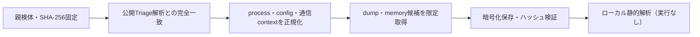

# Triage公開解析・後段取得証跡

## 完全ハッシュ一致

- [260814-sxvtlsxsdx](https://tria.ge/260814-sxvtlsxsdx): ファミリー候補 `未確定`、評価score `None`

## プロセス・通信

- 観測process: `取得できず`
- raw commandは保存せず、command SHA-256と処理patternだけをJSONへ保持します。
- sandbox background trafficは`context_only`であり、C2へ自動昇格しません。

- 取得できませんでした。

## 後段取得物

- `02c3da8145e4ae7cfd6f1485754e9a12a433aa3bc99ed60d35341b4a00bc52fa` / `memory_image` / 1769472 bytes / 親と同一: `false` / 静的解析: `partial`
- `2a4eb253128bfab43180f204d5007237ecdf3bd9448f4b0481861ba9dc32d8c2` / `memory_image` / 4763648 bytes / 親と同一: `false` / 静的解析: `partial`
- `163be83034ec6009208741acc9c2f5490843b843dbbf70422c61ae4e05551d22` / `memory_image` / 8192 bytes / 親と同一: `false` / 静的解析: `partial`
- `b24b2b8382a810efc7ce1e201d83dec20caaf3957fd0f2faf752b6b70961431a` / `memory_image` / 4763648 bytes / 親と同一: `false` / 静的解析: `partial`
- `89782c6e2c1f5226c42555e8f87a7afa7cc54e0695d065f42fb0c3041bb76ea8` / `memory_image` / 1769472 bytes / 親と同一: `false` / 静的解析: `partial`
- `0a3b4ebed345ff9011188199699df30add2b8b17b14574312de2d1dac6bcdc4f` / `memory_image` / 4763648 bytes / 親と同一: `false` / 静的解析: `partial`
- `0248b5689764f8ba99bd02f89e3b6fe09167c158470095629ccae5b56b8ba3e4` / `memory_image` / 4763648 bytes / 親と同一: `false` / 静的解析: `partial`
- `da70d02a1fc3567ebfcb3ed378a0c7bc5212bd2ce607bfca9a9524f6348ff6fe` / `memory_image` / 4763648 bytes / 親と同一: `false` / 静的解析: `partial`

## 判定境界

Triage由来のfamily、process、config、通信は外部sandbox証跡です。Config extractorが返したendpointはC2候補として扱いますが、静的設定復元またはprocess帰属とprotocol応答が揃うまでは確認済みC2とはしません。取得成果物と検体は実行していません。
