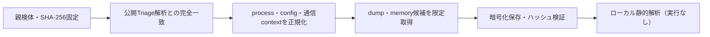

# Triage公開解析・後段取得証跡

## 完全ハッシュ一致

- [260826-zmpceaweja](https://tria.ge/260826-zmpceaweja): ファミリー候補 `未確定`、評価score `None`
- [260826-zk964afc73](https://tria.ge/260826-zk964afc73): ファミリー候補 `未確定`、評価score `None`

## プロセス・通信

- 観測process: `取得できず`
- raw commandは保存せず、command SHA-256と処理patternだけをJSONへ保持します。
- sandbox background trafficは`context_only`であり、C2へ自動昇格しません。

- 取得できませんでした。

## 後段取得物

- `084719088c8a291aa6a0ba5a2fb3e6f12d64a2ae43739c08cf8389acaa27054e` / `memory_image` / 380928 bytes / 親と同一: `false` / 静的解析: `partial`
- `3b943aae6ae7f3d1f91e5bfcf298a188d6c307e32ae90f8f0c1af7be7f65b78b` / `memory_image` / 380928 bytes / 親と同一: `false` / 静的解析: `partial`
- `3eb7522f94a503eec495bf2c74d7e37ae6a3cabc8404de231f26dac765b69800` / `memory_image` / 4251648 bytes / 親と同一: `false` / 静的解析: `partial`
- `13c52190d5790e7b924c6e1d2c4cf39592fba6bc046d2235492834129b94d492` / `memory_image` / 380928 bytes / 親と同一: `false` / 静的解析: `partial`
- `c547481ac5abe91d419d3abb4bde0ada2fa02c44766c560207e1fb5967a3cd44` / `memory_image` / 380928 bytes / 親と同一: `false` / 静的解析: `partial`
- `4ef23b867efda8594419fee374e21baa205b567b651e63b44a9733d079a243bb` / `memory_image` / 380928 bytes / 親と同一: `false` / 静的解析: `partial`
- `c71d653893f3adc7ffccd63957ebc65e9f564dd8057f66621749afac9a04098a` / `memory_image` / 380928 bytes / 親と同一: `false` / 静的解析: `partial`
- `b50e8e72672b6ff772b108a0f98da91981a63e160d5977e6f133e70f5bf6f767` / `memory_image` / 380928 bytes / 親と同一: `false` / 静的解析: `partial`
- `f5dea5dfbc861d82de6c1b891f8bcef036bfe5991f5053238eff69b93f73e342` / `memory_image` / 380928 bytes / 親と同一: `false` / 静的解析: `partial`

## 判定境界

Triage由来のfamily、process、config、通信は外部sandbox証跡です。Config extractorが返したendpointはC2候補として扱いますが、静的設定復元またはprocess帰属とprotocol応答が揃うまでは確認済みC2とはしません。取得成果物と検体は実行していません。
