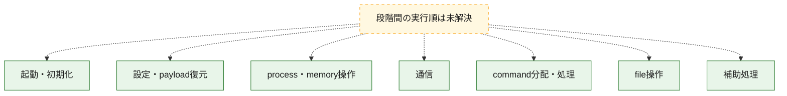
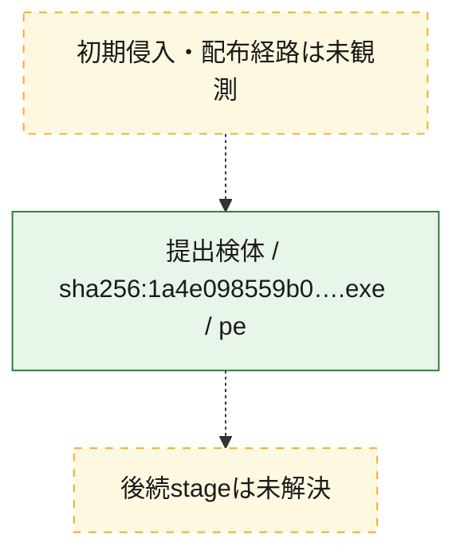
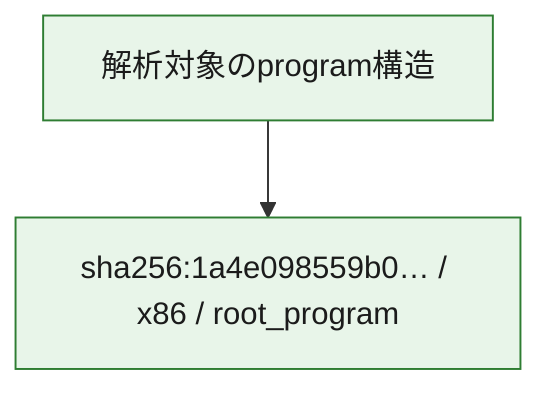

# 全体ロジック：1a4e098559b0b1b74e4974425dcfeb08b40d1563ec94293f0a365958b6af1340

代表関数の静的証跡から、起動・初期化、設定・payload復元、process・memory操作、通信、command分配・処理、file操作の処理群を確認しました。

## 読み方

- phaseの掲載順は解析上の整理順です。observed_call_edgesがない段階間の実行順を断定しません。
- 図の実線は静的に観測した関係、点線と黄色のノードは未観測・未解決の関係を示します。
- 図は静的な要約であり、動的実行を再現するものではありません。
- 詳細な関数解説とfingerprintは[STATIC-LOGIC.md](STATIC-LOGIC.md)を参照してください。

## 静的可視化

### 実行フロー

### 感染チェーン

### モジュール関係

## 処理段階

### 1. 起動・初期化

entry pointから初期化と後続処理への移行を確認します。
確度: `confirmed_static_function_evidence`

- `1a4e098559b0b1b74e4974425dcfeb08b40d1563ec94293f0a365958b6af1340:ghidra:004918c0` — 初期化と主要処理への分岐を行う入口関数です。 状態: `succeeded`、選定理由: `entry_point`, `meaningful_symbol_name`, `probable_go_main_user_code`, `reviewed_call_centrality:20`, `role:entrypoint`
- `1a4e098559b0b1b74e4974425dcfeb08b40d1563ec94293f0a365958b6af1340:ghidra:004a5640` — 初期化と主要処理への分岐を行う入口関数です。 状態: `succeeded`、選定理由: `entry_point`, `meaningful_symbol_name`, `probable_go_main_user_code`, `reviewed_call_centrality:27`, `role:entrypoint`
- `1a4e098559b0b1b74e4974425dcfeb08b40d1563ec94293f0a365958b6af1340:ghidra:004b2760` — 初期化と主要処理への分岐を行う入口関数です。 状態: `succeeded`、選定理由: `entry_point`, `meaningful_symbol_name`, `probable_go_main_user_code`, `reviewed_call_centrality:15`, `role:entrypoint`
- `1a4e098559b0b1b74e4974425dcfeb08b40d1563ec94293f0a365958b6af1340:ghidra:004b53e0` — 初期化と主要処理への分岐を行う入口関数です。 状態: `succeeded`、選定理由: `entry_point`, `meaningful_symbol_name`, `probable_go_main_user_code`, `reviewed_call_centrality:15`, `role:entrypoint`
- `1a4e098559b0b1b74e4974425dcfeb08b40d1563ec94293f0a365958b6af1340:ghidra:004b8000` — 初期化と主要処理への分岐を行う入口関数です。 状態: `succeeded`、選定理由: `entry_point`, `meaningful_symbol_name`, `probable_go_main_user_code`, `reviewed_call_centrality:20`, `role:entrypoint`
- `1a4e098559b0b1b74e4974425dcfeb08b40d1563ec94293f0a365958b6af1340:ghidra:004bb860` — 初期化と主要処理への分岐を行う入口関数です。 状態: `succeeded`、選定理由: `entry_point`, `meaningful_symbol_name`, `probable_go_main_user_code`, `reviewed_call_centrality:16`, `role:entrypoint`
- `1a4e098559b0b1b74e4974425dcfeb08b40d1563ec94293f0a365958b6af1340:ghidra:004bce40` — 初期化と主要処理への分岐を行う入口関数です。 状態: `succeeded`、選定理由: `entry_point`, `meaningful_symbol_name`, `probable_go_main_user_code`, `reviewed_call_centrality:16`, `role:entrypoint`
- `1a4e098559b0b1b74e4974425dcfeb08b40d1563ec94293f0a365958b6af1340:ghidra:004bd980` — 初期化と主要処理への分岐を行う入口関数です。 状態: `succeeded`、選定理由: `entry_point`, `meaningful_symbol_name`, `probable_go_main_user_code`, `reviewed_call_centrality:16`, `role:entrypoint`
- `1a4e098559b0b1b74e4974425dcfeb08b40d1563ec94293f0a365958b6af1340:ghidra:004c05e0` — 初期化と主要処理への分岐を行う入口関数です。 状態: `succeeded`、選定理由: `entry_point`, `meaningful_symbol_name`, `probable_go_main_user_code`, `reviewed_call_centrality:15`, `role:entrypoint`
- `1a4e098559b0b1b74e4974425dcfeb08b40d1563ec94293f0a365958b6af1340:ghidra:004c10c0` — 初期化と主要処理への分岐を行う入口関数です。 状態: `succeeded`、選定理由: `entry_point`, `meaningful_symbol_name`, `probable_go_main_user_code`, `reviewed_call_centrality:15`, `role:entrypoint`
- `1a4e098559b0b1b74e4974425dcfeb08b40d1563ec94293f0a365958b6af1340:ghidra:004c1ba0` — 初期化と主要処理への分岐を行う入口関数です。 状態: `succeeded`、選定理由: `entry_point`, `meaningful_symbol_name`, `probable_go_main_user_code`, `reviewed_call_centrality:17`, `role:entrypoint`
- `1a4e098559b0b1b74e4974425dcfeb08b40d1563ec94293f0a365958b6af1340:ghidra:004c32e0` — 初期化と主要処理への分岐を行う入口関数です。 状態: `succeeded`、選定理由: `entry_point`, `meaningful_symbol_name`, `probable_go_main_user_code`, `reviewed_call_centrality:18`, `role:entrypoint`
- `1a4e098559b0b1b74e4974425dcfeb08b40d1563ec94293f0a365958b6af1340:ghidra:004c3e40` — 初期化と主要処理への分岐を行う入口関数です。 状態: `succeeded`、選定理由: `entry_point`, `meaningful_symbol_name`, `probable_go_main_user_code`, `reviewed_call_centrality:18`, `role:entrypoint`
- `1a4e098559b0b1b74e4974425dcfeb08b40d1563ec94293f0a365958b6af1340:ghidra:004c82a0` — 初期化と主要処理への分岐を行う入口関数です。 状態: `succeeded`、選定理由: `entry_point`, `meaningful_symbol_name`, `probable_go_main_user_code`, `reviewed_call_centrality:17`, `role:entrypoint`
- `1a4e098559b0b1b74e4974425dcfeb08b40d1563ec94293f0a365958b6af1340:ghidra:004cc680` — 初期化と主要処理への分岐を行う入口関数です。 状態: `succeeded`、選定理由: `entry_point`, `meaningful_symbol_name`, `probable_go_main_user_code`, `reviewed_call_centrality:15`, `role:entrypoint`
- `1a4e098559b0b1b74e4974425dcfeb08b40d1563ec94293f0a365958b6af1340:ghidra:004ce7e0` — 初期化と主要処理への分岐を行う入口関数です。 状態: `succeeded`、選定理由: `entry_point`, `meaningful_symbol_name`, `probable_go_main_user_code`, `reviewed_call_centrality:16`, `role:entrypoint`
- `1a4e098559b0b1b74e4974425dcfeb08b40d1563ec94293f0a365958b6af1340:ghidra:004cf380` — 初期化と主要処理への分岐を行う入口関数です。 状態: `succeeded`、選定理由: `entry_point`, `meaningful_symbol_name`, `probable_go_main_user_code`, `reviewed_call_centrality:17`, `role:entrypoint`
- `1a4e098559b0b1b74e4974425dcfeb08b40d1563ec94293f0a365958b6af1340:ghidra:004cff20` — 初期化と主要処理への分岐を行う入口関数です。 状態: `succeeded`、選定理由: `entry_point`, `meaningful_symbol_name`, `probable_go_main_user_code`, `reviewed_call_centrality:19`, `role:entrypoint`
- `1a4e098559b0b1b74e4974425dcfeb08b40d1563ec94293f0a365958b6af1340:ghidra:004d7020` — 初期化と主要処理への分岐を行う入口関数です。 状態: `succeeded`、選定理由: `entry_point`, `meaningful_symbol_name`, `probable_go_main_user_code`, `reviewed_call_centrality:25`, `role:entrypoint`
- `1a4e098559b0b1b74e4974425dcfeb08b40d1563ec94293f0a365958b6af1340:ghidra:004dd5a0` — 初期化と主要処理への分岐を行う入口関数です。 状態: `succeeded`、選定理由: `entry_point`, `meaningful_symbol_name`, `probable_go_main_user_code`, `reviewed_call_centrality:21`, `role:entrypoint`
- `1a4e098559b0b1b74e4974425dcfeb08b40d1563ec94293f0a365958b6af1340:ghidra:004dee20` — 初期化と主要処理への分岐を行う入口関数です。 状態: `succeeded`、選定理由: `entry_point`, `meaningful_symbol_name`, `probable_go_main_user_code`, `reviewed_call_centrality:18`, `role:entrypoint`
- `1a4e098559b0b1b74e4974425dcfeb08b40d1563ec94293f0a365958b6af1340:ghidra:004e3100` — 初期化と主要処理への分岐を行う入口関数です。 状態: `succeeded`、選定理由: `entry_point`, `meaningful_symbol_name`, `probable_go_main_user_code`, `reviewed_call_centrality:19`, `role:entrypoint`
- `1a4e098559b0b1b74e4974425dcfeb08b40d1563ec94293f0a365958b6af1340:ghidra:004e7480` — 初期化と主要処理への分岐を行う入口関数です。 状態: `succeeded`、選定理由: `entry_point`, `meaningful_symbol_name`, `probable_go_main_user_code`, `reviewed_call_centrality:16`, `role:entrypoint`
- `1a4e098559b0b1b74e4974425dcfeb08b40d1563ec94293f0a365958b6af1340:ghidra:004e8a60` — 初期化と主要処理への分岐を行う入口関数です。 状態: `succeeded`、選定理由: `entry_point`, `meaningful_symbol_name`, `probable_go_main_user_code`, `reviewed_call_centrality:17`, `role:entrypoint`

### 2. 設定・payload復元

設定、resource、payload、暗号化データの復元・変換を確認します。
確度: `confirmed_static_function_evidence`

- `1a4e098559b0b1b74e4974425dcfeb08b40d1563ec94293f0a365958b6af1340:ghidra:00465220` — 設定、resource、payloadなどの解析・変換を行う関数です。 状態: `succeeded`、選定理由: `meaningful_symbol_name`, `reviewed_call_centrality:4`, `role:config_or_data_transform`
- `1a4e098559b0b1b74e4974425dcfeb08b40d1563ec94293f0a365958b6af1340:ghidra:00471f00` — 暗号、hash、encoding、または復号処理に関係する関数です。 状態: `succeeded`、選定理由: `meaningful_symbol_name`, `reviewed_call_centrality:6`, `role:cryptographic_transform`

### 3. process・memory操作

process、thread、module、memory操作と実行移行を確認します。
確度: `confirmed_static_function_evidence`

- `1a4e098559b0b1b74e4974425dcfeb08b40d1563ec94293f0a365958b6af1340:ghidra:00461fa0` — process、thread、module、またはmemory操作に関係する関数です。 状態: `succeeded`、選定理由: `meaningful_symbol_name`, `reviewed_call_centrality:2`, `role:process_or_memory_operation`

### 4. 通信

通信初期化、endpoint処理、送受信の役割を確認します。
確度: `confirmed_static_function_evidence`

- `1a4e098559b0b1b74e4974425dcfeb08b40d1563ec94293f0a365958b6af1340:ghidra:0047cca0` — 通信初期化、送受信、またはendpoint処理に関係する関数です。 状態: `succeeded`、選定理由: `meaningful_symbol_name`, `reviewed_call_centrality:6`, `role:network_communication`

### 5. command分配・処理

受信commandやtaskの解釈、分配、個別handlerへの移行を確認します。
確度: `confirmed_static_function_evidence`

- `1a4e098559b0b1b74e4974425dcfeb08b40d1563ec94293f0a365958b6af1340:ghidra:0047ba20` — commandの解釈、分配、または個別処理を担当する関数です。 状態: `succeeded`、選定理由: `meaningful_symbol_name`, `reviewed_call_centrality:5`, `role:command_dispatch_or_handler`

### 6. file操作

fileやdirectoryの作成、読書き、削除を確認します。
確度: `confirmed_static_function_evidence`

- `1a4e098559b0b1b74e4974425dcfeb08b40d1563ec94293f0a365958b6af1340:ghidra:0047c180` — fileまたはdirectoryの読書き・管理に関係する関数です。 状態: `succeeded`、選定理由: `meaningful_symbol_name`, `reviewed_call_centrality:6`, `role:file_operation`

### 7. 補助処理

主要処理を支える一般内部関数またはlibrary処理を確認します。
確度: `confirmed_static_function_evidence`

- `1a4e098559b0b1b74e4974425dcfeb08b40d1563ec94293f0a365958b6af1340:ghidra:00401080` — compiler生成処理または汎用library処理とみられる関数です。 状態: `succeeded`、選定理由: `meaningful_symbol_name`, `reviewed_call_centrality:4`
- `1a4e098559b0b1b74e4974425dcfeb08b40d1563ec94293f0a365958b6af1340:ghidra:00458160` — 検体内部の一般処理を実装する関数です。 状態: `succeeded`、選定理由: `meaningful_symbol_name`, `reviewed_call_centrality:4`

## 観測したcall関係

- `ghidra-function:0637a774103160999ce6135c` → `ghidra-external:06f5d1f3ef36d2ed78543716` （`unclassified` → `unclassified`）
- `ghidra-function:0637a774103160999ce6135c` → `ghidra-external:21c5be1eb0c73e1daab4d394` （`unclassified` → `unclassified`）
- `ghidra-function:0637a774103160999ce6135c` → `ghidra-external:53be50a7ff71c83b1cfa5873` （`unclassified` → `unclassified`）
- `ghidra-function:0637a774103160999ce6135c` → `ghidra-external:ecdd2b919456e979238ce73d` （`unclassified` → `unclassified`）
- `ghidra-function:0637a774103160999ce6135c` → `ghidra-external:ef01c07bef8bae567e29a863` （`unclassified` → `unclassified`）
- `ghidra-function:0637a774103160999ce6135c` → `ghidra-external:fefeb18312a187b4be5350b5` （`unclassified` → `unclassified`）
- `ghidra-function:152c3ac2e5f82b0870bba75b` → `ghidra-external:93acbb539b29652986ef2241` （`unclassified` → `unclassified`）
- `ghidra-function:152c3ac2e5f82b0870bba75b` → `ghidra-external:998efc1bd0ee69999d0a5c97` （`unclassified` → `unclassified`）
- `ghidra-function:152c3ac2e5f82b0870bba75b` → `ghidra-external:e2a14b2ae25626ccb7dceb6a` （`unclassified` → `unclassified`）
- `ghidra-function:152c3ac2e5f82b0870bba75b` → `ghidra-external:e46ebbc58002c13eb2d37431` （`unclassified` → `unclassified`）
- `ghidra-function:1e90d866efc5b0cefbfcfb35` → `ghidra-external:0025ea1e431f956a44e3a95e` （`unclassified` → `unclassified`）
- `ghidra-function:1e90d866efc5b0cefbfcfb35` → `ghidra-external:0cf2bd8e7339f7697c771edb` （`unclassified` → `unclassified`）
- `ghidra-function:1e90d866efc5b0cefbfcfb35` → `ghidra-external:105417f88f741f3163ede368` （`unclassified` → `unclassified`）
- `ghidra-function:1e90d866efc5b0cefbfcfb35` → `ghidra-external:19f568a016f9cfd567ff6ecb` （`unclassified` → `unclassified`）
- `ghidra-function:1e90d866efc5b0cefbfcfb35` → `ghidra-external:21c5be1eb0c73e1daab4d394` （`unclassified` → `unclassified`）
- `ghidra-function:1e90d866efc5b0cefbfcfb35` → `ghidra-external:38db4c685a48ad2c7f3212c5` （`unclassified` → `unclassified`）
- `ghidra-function:1e90d866efc5b0cefbfcfb35` → `ghidra-external:43b015580565f7f6a160c76b` （`unclassified` → `unclassified`）
- `ghidra-function:1e90d866efc5b0cefbfcfb35` → `ghidra-external:46f90b2dee5caf9336410172` （`unclassified` → `unclassified`）
- `ghidra-function:1e90d866efc5b0cefbfcfb35` → `ghidra-external:47936ff2029a01a0cb3aea67` （`unclassified` → `unclassified`）
- `ghidra-function:1e90d866efc5b0cefbfcfb35` → `ghidra-external:984405490a2f50684a2551ef` （`unclassified` → `unclassified`）
- `ghidra-function:1e90d866efc5b0cefbfcfb35` → `ghidra-external:99d7f8552697ed61d865dca5` （`unclassified` → `unclassified`）
- `ghidra-function:1e90d866efc5b0cefbfcfb35` → `ghidra-external:a8b7c9314492358cf9352705` （`unclassified` → `unclassified`）
- `ghidra-function:1e90d866efc5b0cefbfcfb35` → `ghidra-external:c7eafa238af4a273fa45b5ce` （`unclassified` → `unclassified`）
- `ghidra-function:1e90d866efc5b0cefbfcfb35` → `ghidra-external:d0b776fd4ee7c8f355cf42a1` （`unclassified` → `unclassified`）
- `ghidra-function:1e90d866efc5b0cefbfcfb35` → `ghidra-external:e2a14b2ae25626ccb7dceb6a` （`unclassified` → `unclassified`）
- `ghidra-function:1e90d866efc5b0cefbfcfb35` → `ghidra-external:eb12c0df08f869b3a807f8a5` （`unclassified` → `unclassified`）
- `ghidra-function:1e90d866efc5b0cefbfcfb35` → `ghidra-external:edfa7c32a4dab73eed33f269` （`unclassified` → `unclassified`）
- `ghidra-function:1e90d866efc5b0cefbfcfb35` → `ghidra-external:f792fc645538959469bfb898` （`unclassified` → `unclassified`）
- `ghidra-function:20515177ccd2e2bf1699b12d` → `ghidra-external:0025ea1e431f956a44e3a95e` （`unclassified` → `unclassified`）
- `ghidra-function:20515177ccd2e2bf1699b12d` → `ghidra-external:0cf2bd8e7339f7697c771edb` （`unclassified` → `unclassified`）
- `ghidra-function:20515177ccd2e2bf1699b12d` → `ghidra-external:105417f88f741f3163ede368` （`unclassified` → `unclassified`）
- `ghidra-function:20515177ccd2e2bf1699b12d` → `ghidra-external:182f874ba12c37e65a6be163` （`unclassified` → `unclassified`）
- `ghidra-function:20515177ccd2e2bf1699b12d` → `ghidra-external:19f568a016f9cfd567ff6ecb` （`unclassified` → `unclassified`）
- `ghidra-function:20515177ccd2e2bf1699b12d` → `ghidra-external:21c5be1eb0c73e1daab4d394` （`unclassified` → `unclassified`）
- `ghidra-function:20515177ccd2e2bf1699b12d` → `ghidra-external:38db4c685a48ad2c7f3212c5` （`unclassified` → `unclassified`）
- `ghidra-function:20515177ccd2e2bf1699b12d` → `ghidra-external:46f90b2dee5caf9336410172` （`unclassified` → `unclassified`）
- `ghidra-function:20515177ccd2e2bf1699b12d` → `ghidra-external:47936ff2029a01a0cb3aea67` （`unclassified` → `unclassified`）
- `ghidra-function:20515177ccd2e2bf1699b12d` → `ghidra-external:984405490a2f50684a2551ef` （`unclassified` → `unclassified`）
- `ghidra-function:20515177ccd2e2bf1699b12d` → `ghidra-external:99d7f8552697ed61d865dca5` （`unclassified` → `unclassified`）
- `ghidra-function:20515177ccd2e2bf1699b12d` → `ghidra-external:aa103b2a4f71ae3a5dd8918d` （`unclassified` → `unclassified`）
- `ghidra-function:20515177ccd2e2bf1699b12d` → `ghidra-external:c7eafa238af4a273fa45b5ce` （`unclassified` → `unclassified`）
- `ghidra-function:20515177ccd2e2bf1699b12d` → `ghidra-external:d0b776fd4ee7c8f355cf42a1` （`unclassified` → `unclassified`）
- `ghidra-function:20515177ccd2e2bf1699b12d` → `ghidra-external:e2a14b2ae25626ccb7dceb6a` （`unclassified` → `unclassified`）
- `ghidra-function:20515177ccd2e2bf1699b12d` → `ghidra-external:eb12c0df08f869b3a807f8a5` （`unclassified` → `unclassified`）
- `ghidra-function:20515177ccd2e2bf1699b12d` → `ghidra-external:edfa7c32a4dab73eed33f269` （`unclassified` → `unclassified`）
- `ghidra-function:20515177ccd2e2bf1699b12d` → `ghidra-external:f792fc645538959469bfb898` （`unclassified` → `unclassified`）
- `ghidra-function:23f7da3e245c0a4d0295bbcf` → `ghidra-external:0025ea1e431f956a44e3a95e` （`unclassified` → `unclassified`）
- `ghidra-function:23f7da3e245c0a4d0295bbcf` → `ghidra-external:0138d008827019c0bd1f317b` （`unclassified` → `unclassified`）
- `ghidra-function:23f7da3e245c0a4d0295bbcf` → `ghidra-external:0cf2bd8e7339f7697c771edb` （`unclassified` → `unclassified`）
- `ghidra-function:23f7da3e245c0a4d0295bbcf` → `ghidra-external:105417f88f741f3163ede368` （`unclassified` → `unclassified`）
- `ghidra-function:23f7da3e245c0a4d0295bbcf` → `ghidra-external:165a9088c16c4ed6908cb3cf` （`unclassified` → `unclassified`）
- `ghidra-function:23f7da3e245c0a4d0295bbcf` → `ghidra-external:19f568a016f9cfd567ff6ecb` （`unclassified` → `unclassified`）
- `ghidra-function:23f7da3e245c0a4d0295bbcf` → `ghidra-external:1c05dce6f7a9f3372cec7130` （`unclassified` → `unclassified`）
- `ghidra-function:23f7da3e245c0a4d0295bbcf` → `ghidra-external:21c5be1eb0c73e1daab4d394` （`unclassified` → `unclassified`）
- `ghidra-function:23f7da3e245c0a4d0295bbcf` → `ghidra-external:38db4c685a48ad2c7f3212c5` （`unclassified` → `unclassified`）
- `ghidra-function:23f7da3e245c0a4d0295bbcf` → `ghidra-external:46f90b2dee5caf9336410172` （`unclassified` → `unclassified`）
- `ghidra-function:23f7da3e245c0a4d0295bbcf` → `ghidra-external:47936ff2029a01a0cb3aea67` （`unclassified` → `unclassified`）
- `ghidra-function:23f7da3e245c0a4d0295bbcf` → `ghidra-external:83d329accb1f8683cfac3389` （`unclassified` → `unclassified`）
- `ghidra-function:23f7da3e245c0a4d0295bbcf` → `ghidra-external:984405490a2f50684a2551ef` （`unclassified` → `unclassified`）
- `ghidra-function:23f7da3e245c0a4d0295bbcf` → `ghidra-external:99d7f8552697ed61d865dca5` （`unclassified` → `unclassified`）
- `ghidra-function:23f7da3e245c0a4d0295bbcf` → `ghidra-external:c7eafa238af4a273fa45b5ce` （`unclassified` → `unclassified`）
- `ghidra-function:23f7da3e245c0a4d0295bbcf` → `ghidra-external:d0b776fd4ee7c8f355cf42a1` （`unclassified` → `unclassified`）
- `ghidra-function:23f7da3e245c0a4d0295bbcf` → `ghidra-external:e2a14b2ae25626ccb7dceb6a` （`unclassified` → `unclassified`）
- `ghidra-function:23f7da3e245c0a4d0295bbcf` → `ghidra-external:eb12c0df08f869b3a807f8a5` （`unclassified` → `unclassified`）
- `ghidra-function:23f7da3e245c0a4d0295bbcf` → `ghidra-external:edfa7c32a4dab73eed33f269` （`unclassified` → `unclassified`）
- `ghidra-function:23f7da3e245c0a4d0295bbcf` → `ghidra-external:f792fc645538959469bfb898` （`unclassified` → `unclassified`）
- `ghidra-function:2ed75d5974d1b376940c8629` → `ghidra-external:0025ea1e431f956a44e3a95e` （`unclassified` → `unclassified`）
- `ghidra-function:2ed75d5974d1b376940c8629` → `ghidra-external:0cf2bd8e7339f7697c771edb` （`unclassified` → `unclassified`）
- `ghidra-function:2ed75d5974d1b376940c8629` → `ghidra-external:105417f88f741f3163ede368` （`unclassified` → `unclassified`）
- `ghidra-function:2ed75d5974d1b376940c8629` → `ghidra-external:19f568a016f9cfd567ff6ecb` （`unclassified` → `unclassified`）
- `ghidra-function:2ed75d5974d1b376940c8629` → `ghidra-external:1ebab1229bc36c6698c00f84` （`unclassified` → `unclassified`）
- `ghidra-function:2ed75d5974d1b376940c8629` → `ghidra-external:21c5be1eb0c73e1daab4d394` （`unclassified` → `unclassified`）
- `ghidra-function:2ed75d5974d1b376940c8629` → `ghidra-external:2e6a6077048236bb53a75814` （`unclassified` → `unclassified`）
- `ghidra-function:2ed75d5974d1b376940c8629` → `ghidra-external:30d7446251f458667af3e493` （`unclassified` → `unclassified`）
- `ghidra-function:2ed75d5974d1b376940c8629` → `ghidra-external:38db4c685a48ad2c7f3212c5` （`unclassified` → `unclassified`）
- `ghidra-function:2ed75d5974d1b376940c8629` → `ghidra-external:46f90b2dee5caf9336410172` （`unclassified` → `unclassified`）
- `ghidra-function:2ed75d5974d1b376940c8629` → `ghidra-external:47936ff2029a01a0cb3aea67` （`unclassified` → `unclassified`）
- `ghidra-function:2ed75d5974d1b376940c8629` → `ghidra-external:4f62cf505ae71ae4d9591706` （`unclassified` → `unclassified`）
- `ghidra-function:2ed75d5974d1b376940c8629` → `ghidra-external:55ea17397f919fcb2bb070bd` （`unclassified` → `unclassified`）
- `ghidra-function:2ed75d5974d1b376940c8629` → `ghidra-external:62abf03ab564c6c47bd27a0d` （`unclassified` → `unclassified`）
- `ghidra-function:2ed75d5974d1b376940c8629` → `ghidra-external:7ce34675dee55128cd41bed8` （`unclassified` → `unclassified`）
- `ghidra-function:2ed75d5974d1b376940c8629` → `ghidra-external:930318573d8e6bc9dbbd8490` （`unclassified` → `unclassified`）
- `ghidra-function:2ed75d5974d1b376940c8629` → `ghidra-external:984405490a2f50684a2551ef` （`unclassified` → `unclassified`）
- `ghidra-function:2ed75d5974d1b376940c8629` → `ghidra-external:99d7f8552697ed61d865dca5` （`unclassified` → `unclassified`）
- `ghidra-function:2ed75d5974d1b376940c8629` → `ghidra-external:c2d1050f348c46ab7f002eef` （`unclassified` → `unclassified`）
- `ghidra-function:2ed75d5974d1b376940c8629` → `ghidra-external:c7eafa238af4a273fa45b5ce` （`unclassified` → `unclassified`）
- `ghidra-function:2ed75d5974d1b376940c8629` → `ghidra-external:d0b776fd4ee7c8f355cf42a1` （`unclassified` → `unclassified`）
- `ghidra-function:2ed75d5974d1b376940c8629` → `ghidra-external:d1eb7a496f81da78de873eb5` （`unclassified` → `unclassified`）
- `ghidra-function:2ed75d5974d1b376940c8629` → `ghidra-external:dddb419785a75b06076ab7ba` （`unclassified` → `unclassified`）
- `ghidra-function:2ed75d5974d1b376940c8629` → `ghidra-external:e2a14b2ae25626ccb7dceb6a` （`unclassified` → `unclassified`）
- `ghidra-function:2ed75d5974d1b376940c8629` → `ghidra-external:e8c72571a333088241b33f2c` （`unclassified` → `unclassified`）
- `ghidra-function:2ed75d5974d1b376940c8629` → `ghidra-external:eb12c0df08f869b3a807f8a5` （`unclassified` → `unclassified`）
- `ghidra-function:2ed75d5974d1b376940c8629` → `ghidra-external:edfa7c32a4dab73eed33f269` （`unclassified` → `unclassified`）
- `ghidra-function:3111f8eb8eeff3b89b7eb040` → `ghidra-external:0025ea1e431f956a44e3a95e` （`unclassified` → `unclassified`）
- `ghidra-function:3111f8eb8eeff3b89b7eb040` → `ghidra-external:0cf2bd8e7339f7697c771edb` （`unclassified` → `unclassified`）
- `ghidra-function:3111f8eb8eeff3b89b7eb040` → `ghidra-external:105417f88f741f3163ede368` （`unclassified` → `unclassified`）
- `ghidra-function:3111f8eb8eeff3b89b7eb040` → `ghidra-external:19f568a016f9cfd567ff6ecb` （`unclassified` → `unclassified`）
- `ghidra-function:3111f8eb8eeff3b89b7eb040` → `ghidra-external:1ebab1229bc36c6698c00f84` （`unclassified` → `unclassified`）
- `ghidra-function:3111f8eb8eeff3b89b7eb040` → `ghidra-external:21c5be1eb0c73e1daab4d394` （`unclassified` → `unclassified`）
- `ghidra-function:3111f8eb8eeff3b89b7eb040` → `ghidra-external:38db4c685a48ad2c7f3212c5` （`unclassified` → `unclassified`）
- `ghidra-function:3111f8eb8eeff3b89b7eb040` → `ghidra-external:46f90b2dee5caf9336410172` （`unclassified` → `unclassified`）
- `ghidra-function:3111f8eb8eeff3b89b7eb040` → `ghidra-external:47936ff2029a01a0cb3aea67` （`unclassified` → `unclassified`）
- `ghidra-function:3111f8eb8eeff3b89b7eb040` → `ghidra-external:984405490a2f50684a2551ef` （`unclassified` → `unclassified`）
- `ghidra-function:3111f8eb8eeff3b89b7eb040` → `ghidra-external:99d7f8552697ed61d865dca5` （`unclassified` → `unclassified`）
- `ghidra-function:3111f8eb8eeff3b89b7eb040` → `ghidra-external:c7eafa238af4a273fa45b5ce` （`unclassified` → `unclassified`）
- `ghidra-function:3111f8eb8eeff3b89b7eb040` → `ghidra-external:e2a14b2ae25626ccb7dceb6a` （`unclassified` → `unclassified`）
- `ghidra-function:3111f8eb8eeff3b89b7eb040` → `ghidra-external:eb12c0df08f869b3a807f8a5` （`unclassified` → `unclassified`）
- `ghidra-function:3111f8eb8eeff3b89b7eb040` → `ghidra-external:edfa7c32a4dab73eed33f269` （`unclassified` → `unclassified`）
- `ghidra-function:3f185bf0a8c9803a3b6cf085` → `ghidra-external:0025ea1e431f956a44e3a95e` （`unclassified` → `unclassified`）
- `ghidra-function:3f185bf0a8c9803a3b6cf085` → `ghidra-external:0cf2bd8e7339f7697c771edb` （`unclassified` → `unclassified`）
- `ghidra-function:3f185bf0a8c9803a3b6cf085` → `ghidra-external:105417f88f741f3163ede368` （`unclassified` → `unclassified`）
- `ghidra-function:3f185bf0a8c9803a3b6cf085` → `ghidra-external:19f568a016f9cfd567ff6ecb` （`unclassified` → `unclassified`）
- `ghidra-function:3f185bf0a8c9803a3b6cf085` → `ghidra-external:21c5be1eb0c73e1daab4d394` （`unclassified` → `unclassified`）
- `ghidra-function:3f185bf0a8c9803a3b6cf085` → `ghidra-external:38db4c685a48ad2c7f3212c5` （`unclassified` → `unclassified`）
- `ghidra-function:3f185bf0a8c9803a3b6cf085` → `ghidra-external:46f90b2dee5caf9336410172` （`unclassified` → `unclassified`）
- `ghidra-function:3f185bf0a8c9803a3b6cf085` → `ghidra-external:47936ff2029a01a0cb3aea67` （`unclassified` → `unclassified`）
- `ghidra-function:3f185bf0a8c9803a3b6cf085` → `ghidra-external:4f62cf505ae71ae4d9591706` （`unclassified` → `unclassified`）
- `ghidra-function:3f185bf0a8c9803a3b6cf085` → `ghidra-external:984405490a2f50684a2551ef` （`unclassified` → `unclassified`）
- `ghidra-function:3f185bf0a8c9803a3b6cf085` → `ghidra-external:99d7f8552697ed61d865dca5` （`unclassified` → `unclassified`）
- `ghidra-function:3f185bf0a8c9803a3b6cf085` → `ghidra-external:a2196d5669e38e9c17ac4f21` （`unclassified` → `unclassified`）
- `ghidra-function:3f185bf0a8c9803a3b6cf085` → `ghidra-external:c7eafa238af4a273fa45b5ce` （`unclassified` → `unclassified`）
- `ghidra-function:3f185bf0a8c9803a3b6cf085` → `ghidra-external:e2a14b2ae25626ccb7dceb6a` （`unclassified` → `unclassified`）
- `ghidra-function:3f185bf0a8c9803a3b6cf085` → `ghidra-external:eb12c0df08f869b3a807f8a5` （`unclassified` → `unclassified`）
- `ghidra-function:3f185bf0a8c9803a3b6cf085` → `ghidra-external:edfa7c32a4dab73eed33f269` （`unclassified` → `unclassified`）
- `ghidra-function:417d0041d19ce7be535ca155` → `ghidra-external:0025ea1e431f956a44e3a95e` （`unclassified` → `unclassified`）
- `ghidra-function:417d0041d19ce7be535ca155` → `ghidra-external:0cf2bd8e7339f7697c771edb` （`unclassified` → `unclassified`）
- `ghidra-function:417d0041d19ce7be535ca155` → `ghidra-external:105417f88f741f3163ede368` （`unclassified` → `unclassified`）
- `ghidra-function:417d0041d19ce7be535ca155` → `ghidra-external:19f568a016f9cfd567ff6ecb` （`unclassified` → `unclassified`）
- `ghidra-function:417d0041d19ce7be535ca155` → `ghidra-external:21c5be1eb0c73e1daab4d394` （`unclassified` → `unclassified`）
- `ghidra-function:417d0041d19ce7be535ca155` → `ghidra-external:38db4c685a48ad2c7f3212c5` （`unclassified` → `unclassified`）
- `ghidra-function:417d0041d19ce7be535ca155` → `ghidra-external:46f90b2dee5caf9336410172` （`unclassified` → `unclassified`）
- `ghidra-function:417d0041d19ce7be535ca155` → `ghidra-external:47936ff2029a01a0cb3aea67` （`unclassified` → `unclassified`）
- `ghidra-function:417d0041d19ce7be535ca155` → `ghidra-external:5a273f1170180fdfc1b4ec89` （`unclassified` → `unclassified`）
- `ghidra-function:417d0041d19ce7be535ca155` → `ghidra-external:90080c63bf2bf158f69911cf` （`unclassified` → `unclassified`）
- `ghidra-function:417d0041d19ce7be535ca155` → `ghidra-external:984405490a2f50684a2551ef` （`unclassified` → `unclassified`）
- `ghidra-function:417d0041d19ce7be535ca155` → `ghidra-external:99d7f8552697ed61d865dca5` （`unclassified` → `unclassified`）
- `ghidra-function:417d0041d19ce7be535ca155` → `ghidra-external:c7eafa238af4a273fa45b5ce` （`unclassified` → `unclassified`）
- `ghidra-function:417d0041d19ce7be535ca155` → `ghidra-external:e2a14b2ae25626ccb7dceb6a` （`unclassified` → `unclassified`）
- `ghidra-function:417d0041d19ce7be535ca155` → `ghidra-external:eb12c0df08f869b3a807f8a5` （`unclassified` → `unclassified`）
- `ghidra-function:417d0041d19ce7be535ca155` → `ghidra-external:edfa7c32a4dab73eed33f269` （`unclassified` → `unclassified`）
- `ghidra-function:417d0041d19ce7be535ca155` → `ghidra-external:ef52b976b9d81d28ce8df8e1` （`unclassified` → `unclassified`）
- `ghidra-function:453d3ba731c52b70ec768bff` → `ghidra-external:21c5be1eb0c73e1daab4d394` （`unclassified` → `unclassified`）
- `ghidra-function:453d3ba731c52b70ec768bff` → `ghidra-external:5cfedcdfe437d6b5eb87e662` （`unclassified` → `unclassified`）
- `ghidra-function:453d3ba731c52b70ec768bff` → `ghidra-external:7929c9aa3dc365902c215015` （`unclassified` → `unclassified`）
- `ghidra-function:453d3ba731c52b70ec768bff` → `ghidra-external:e38cdac4731b07a44b43036d` （`unclassified` → `unclassified`）
- `ghidra-function:453d3ba731c52b70ec768bff` → `ghidra-external:fbf4f981767763ec79bd3454` （`unclassified` → `unclassified`）
- `ghidra-function:48067b8b896e7bb690f92b57` → `ghidra-external:0025ea1e431f956a44e3a95e` （`unclassified` → `unclassified`）
- `ghidra-function:48067b8b896e7bb690f92b57` → `ghidra-external:0cf2bd8e7339f7697c771edb` （`unclassified` → `unclassified`）
- `ghidra-function:48067b8b896e7bb690f92b57` → `ghidra-external:105417f88f741f3163ede368` （`unclassified` → `unclassified`）
- `ghidra-function:48067b8b896e7bb690f92b57` → `ghidra-external:165a9088c16c4ed6908cb3cf` （`unclassified` → `unclassified`）
- `ghidra-function:48067b8b896e7bb690f92b57` → `ghidra-external:19f568a016f9cfd567ff6ecb` （`unclassified` → `unclassified`）
- `ghidra-function:48067b8b896e7bb690f92b57` → `ghidra-external:21c5be1eb0c73e1daab4d394` （`unclassified` → `unclassified`）
- `ghidra-function:48067b8b896e7bb690f92b57` → `ghidra-external:2d7b9f2ca631b0711198adef` （`unclassified` → `unclassified`）
- `ghidra-function:48067b8b896e7bb690f92b57` → `ghidra-external:38db4c685a48ad2c7f3212c5` （`unclassified` → `unclassified`）
- `ghidra-function:48067b8b896e7bb690f92b57` → `ghidra-external:46f90b2dee5caf9336410172` （`unclassified` → `unclassified`）
- `ghidra-function:48067b8b896e7bb690f92b57` → `ghidra-external:47936ff2029a01a0cb3aea67` （`unclassified` → `unclassified`）
- `ghidra-function:48067b8b896e7bb690f92b57` → `ghidra-external:8ffcb6a7ba5de3a378fe4aec` （`unclassified` → `unclassified`）
- `ghidra-function:48067b8b896e7bb690f92b57` → `ghidra-external:984405490a2f50684a2551ef` （`unclassified` → `unclassified`）
- `ghidra-function:48067b8b896e7bb690f92b57` → `ghidra-external:99d7f8552697ed61d865dca5` （`unclassified` → `unclassified`）
- `ghidra-function:48067b8b896e7bb690f92b57` → `ghidra-external:c7eafa238af4a273fa45b5ce` （`unclassified` → `unclassified`）
- `ghidra-function:48067b8b896e7bb690f92b57` → `ghidra-external:d0b776fd4ee7c8f355cf42a1` （`unclassified` → `unclassified`）
- `ghidra-function:48067b8b896e7bb690f92b57` → `ghidra-external:e2a14b2ae25626ccb7dceb6a` （`unclassified` → `unclassified`）
- `ghidra-function:48067b8b896e7bb690f92b57` → `ghidra-external:eb12c0df08f869b3a807f8a5` （`unclassified` → `unclassified`）
- `ghidra-function:48067b8b896e7bb690f92b57` → `ghidra-external:edfa7c32a4dab73eed33f269` （`unclassified` → `unclassified`）
- `ghidra-function:48067b8b896e7bb690f92b57` → `ghidra-external:f792fc645538959469bfb898` （`unclassified` → `unclassified`）
- `ghidra-function:48ec91fb4adca5abfc89123f` → `ghidra-external:0025ea1e431f956a44e3a95e` （`unclassified` → `unclassified`）
- `ghidra-function:48ec91fb4adca5abfc89123f` → `ghidra-external:0cf2bd8e7339f7697c771edb` （`unclassified` → `unclassified`）
- `ghidra-function:48ec91fb4adca5abfc89123f` → `ghidra-external:105417f88f741f3163ede368` （`unclassified` → `unclassified`）
- `ghidra-function:48ec91fb4adca5abfc89123f` → `ghidra-external:19f568a016f9cfd567ff6ecb` （`unclassified` → `unclassified`）
- `ghidra-function:48ec91fb4adca5abfc89123f` → `ghidra-external:21c5be1eb0c73e1daab4d394` （`unclassified` → `unclassified`）
- `ghidra-function:48ec91fb4adca5abfc89123f` → `ghidra-external:33373e91265e89928857a889` （`unclassified` → `unclassified`）
- `ghidra-function:48ec91fb4adca5abfc89123f` → `ghidra-external:38db4c685a48ad2c7f3212c5` （`unclassified` → `unclassified`）
- `ghidra-function:48ec91fb4adca5abfc89123f` → `ghidra-external:46f90b2dee5caf9336410172` （`unclassified` → `unclassified`）
- `ghidra-function:48ec91fb4adca5abfc89123f` → `ghidra-external:47936ff2029a01a0cb3aea67` （`unclassified` → `unclassified`）
- `ghidra-function:48ec91fb4adca5abfc89123f` → `ghidra-external:7f336fbe1684ed6ee718a6bd` （`unclassified` → `unclassified`）
- `ghidra-function:48ec91fb4adca5abfc89123f` → `ghidra-external:90080c63bf2bf158f69911cf` （`unclassified` → `unclassified`）
- `ghidra-function:48ec91fb4adca5abfc89123f` → `ghidra-external:984405490a2f50684a2551ef` （`unclassified` → `unclassified`）
- `ghidra-function:48ec91fb4adca5abfc89123f` → `ghidra-external:99d7f8552697ed61d865dca5` （`unclassified` → `unclassified`）
- `ghidra-function:48ec91fb4adca5abfc89123f` → `ghidra-external:c7eafa238af4a273fa45b5ce` （`unclassified` → `unclassified`）
- `ghidra-function:48ec91fb4adca5abfc89123f` → `ghidra-external:e2a14b2ae25626ccb7dceb6a` （`unclassified` → `unclassified`）
- `ghidra-function:48ec91fb4adca5abfc89123f` → `ghidra-external:eb12c0df08f869b3a807f8a5` （`unclassified` → `unclassified`）
- `ghidra-function:48ec91fb4adca5abfc89123f` → `ghidra-external:edfa7c32a4dab73eed33f269` （`unclassified` → `unclassified`）
- `ghidra-function:4aea10ebd15dea6c3a7fe7f8` → `ghidra-external:ab04de3b450086becefc6445` （`unclassified` → `unclassified`）
- `ghidra-function:4aea10ebd15dea6c3a7fe7f8` → `ghidra-external:c85b0b987b8ed62e5e5549b7` （`unclassified` → `unclassified`）
- `ghidra-function:5eeee0f57918bb2ac1d5c380` → `ghidra-external:0025ea1e431f956a44e3a95e` （`unclassified` → `unclassified`）
- `ghidra-function:5eeee0f57918bb2ac1d5c380` → `ghidra-external:0cf2bd8e7339f7697c771edb` （`unclassified` → `unclassified`）
- `ghidra-function:5eeee0f57918bb2ac1d5c380` → `ghidra-external:105417f88f741f3163ede368` （`unclassified` → `unclassified`）
- `ghidra-function:5eeee0f57918bb2ac1d5c380` → `ghidra-external:19f568a016f9cfd567ff6ecb` （`unclassified` → `unclassified`）
- `ghidra-function:5eeee0f57918bb2ac1d5c380` → `ghidra-external:21c5be1eb0c73e1daab4d394` （`unclassified` → `unclassified`）
- `ghidra-function:5eeee0f57918bb2ac1d5c380` → `ghidra-external:38db4c685a48ad2c7f3212c5` （`unclassified` → `unclassified`）
- `ghidra-function:5eeee0f57918bb2ac1d5c380` → `ghidra-external:46f90b2dee5caf9336410172` （`unclassified` → `unclassified`）
- `ghidra-function:5eeee0f57918bb2ac1d5c380` → `ghidra-external:47936ff2029a01a0cb3aea67` （`unclassified` → `unclassified`）
- `ghidra-function:5eeee0f57918bb2ac1d5c380` → `ghidra-external:984405490a2f50684a2551ef` （`unclassified` → `unclassified`）
- `ghidra-function:5eeee0f57918bb2ac1d5c380` → `ghidra-external:99d7f8552697ed61d865dca5` （`unclassified` → `unclassified`）
- `ghidra-function:5eeee0f57918bb2ac1d5c380` → `ghidra-external:c2d1050f348c46ab7f002eef` （`unclassified` → `unclassified`）
- `ghidra-function:5eeee0f57918bb2ac1d5c380` → `ghidra-external:c7eafa238af4a273fa45b5ce` （`unclassified` → `unclassified`）
- `ghidra-function:5eeee0f57918bb2ac1d5c380` → `ghidra-external:e2a14b2ae25626ccb7dceb6a` （`unclassified` → `unclassified`）
- `ghidra-function:5eeee0f57918bb2ac1d5c380` → `ghidra-external:eb12c0df08f869b3a807f8a5` （`unclassified` → `unclassified`）
- `ghidra-function:5eeee0f57918bb2ac1d5c380` → `ghidra-external:edfa7c32a4dab73eed33f269` （`unclassified` → `unclassified`）
- `ghidra-function:5f4aa8aa49f19517dffb5af2` → `ghidra-external:0025ea1e431f956a44e3a95e` （`unclassified` → `unclassified`）
- 残り265件は`static-logic.json`に記録しています。

## 解析範囲と制約

- 選定外関数は全体inventoryへ残しますが、関数本体の個別解説対象にはしていません。
- indirect call、難読化、packer、VM、壊れたcontrol flowによりcall関係が欠落する場合があります。
- 文書は静的解析に基づき、検体実行や外部通信による動的確認は行っていません。
