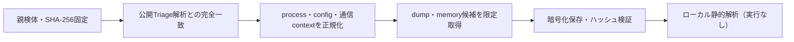

# Triage公開解析・後段取得証跡

## 完全ハッシュ一致

- [260923-x2tjkaag73](https://tria.ge/260923-x2tjkaag73): ファミリー候補 `vidar`、評価score `10`

## プロセス・通信

- 観測process: `1a4e098559b0b1b74e4974425dcfeb08b40d1563ec94293f0a365958b6af1340.bin.exe`
- raw commandは保存せず、command SHA-256と処理patternだけをJSONへ保持します。
- sandbox background trafficは`context_only`であり、C2へ自動昇格しません。

- `https://community.fandom.com/wikia.php`（sandbox config候補）
- `https://steamcommunity.com/profiles/76561198639924729`（sandbox config候補）
- `https://telegram.me/<redacted>`（sandbox config候補）

## 後段取得物

- `9609794366f3276b12d561bb4ee790c591358b678d1c2affd66af3c2284563a3` / `memory_image` / 2723840 bytes / 親と同一: `false` / 静的解析: `partial`

## 判定境界

Triage由来のfamily、process、config、通信は外部sandbox証跡です。Config extractorが返したendpointはC2候補として扱いますが、静的設定復元またはprocess帰属とprotocol応答が揃うまでは確認済みC2とはしません。取得成果物と検体は実行していません。
