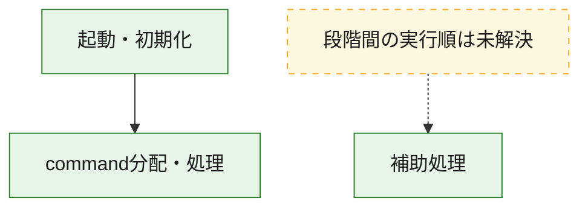
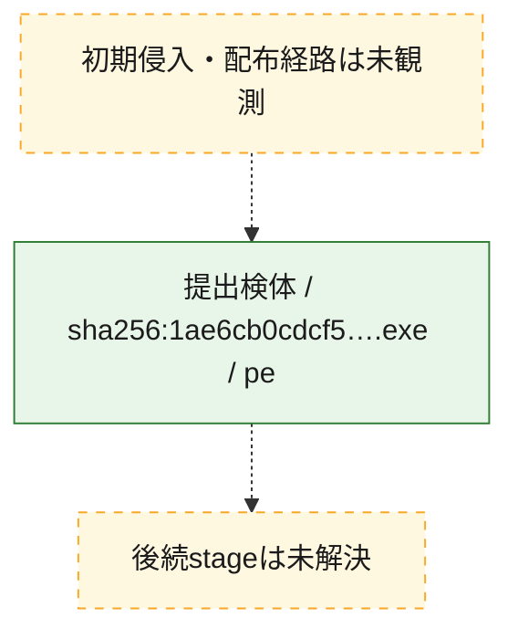
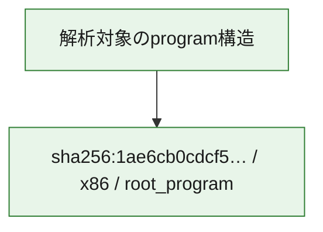

# 全体ロジック：1ae6cb0cdcf57b0ea68a04c7b83892c00ed6f73594d8f0b5c5742a5fcbf9b009

代表関数の静的証跡から、起動・初期化、command分配・処理の処理群を確認しました。

## 読み方

- phaseの掲載順は解析上の整理順です。observed_call_edgesがない段階間の実行順を断定しません。
- 図の実線は静的に観測した関係、点線と黄色のノードは未観測・未解決の関係を示します。
- 図は静的な要約であり、動的実行を再現するものではありません。
- 詳細な関数解説とfingerprintは[STATIC-LOGIC.md](STATIC-LOGIC.md)を参照してください。

## 静的可視化

### 実行フロー

### 感染チェーン

### モジュール関係

## 処理段階

### 1. 起動・初期化

entry pointから初期化と後続処理への移行を確認します。
確度: `confirmed_static_function_evidence`

- `1ae6cb0cdcf57b0ea68a04c7b83892c00ed6f73594d8f0b5c5742a5fcbf9b009:ghidra:14019deb8` — 初期化と主要処理への分岐を行う入口関数です。 状態: `succeeded`、選定理由: `entry_point`, `meaningful_symbol_name`, `reviewed_call_centrality:22`, `role:entrypoint`

### 2. command分配・処理

受信commandやtaskの解釈、分配、個別handlerへの移行を確認します。
確度: `confirmed_static_function_evidence_with_limits`

- `1ae6cb0cdcf57b0ea68a04c7b83892c00ed6f73594d8f0b5c5742a5fcbf9b009:ghidra:1401cd1d0` — commandの解釈、分配、または個別処理を担当する関数です。 状態: `limited_bad_instruction_or_flow`、選定理由: `meaningful_symbol_name`, `reviewed_call_centrality:1`, `role:command_dispatch_or_handler`

### 3. 補助処理

主要処理を支える一般内部関数またはlibrary処理を確認します。
確度: `confirmed_static_function_evidence_with_limits`

- `1ae6cb0cdcf57b0ea68a04c7b83892c00ed6f73594d8f0b5c5742a5fcbf9b009:ghidra:140001000` — 検体内部の一般処理を実装する関数です。 状態: `succeeded`、選定理由: `context_representative`, `reviewed_call_centrality:2`
- `1ae6cb0cdcf57b0ea68a04c7b83892c00ed6f73594d8f0b5c5742a5fcbf9b009:ghidra:140001060` — 検体内部の一般処理を実装する関数です。 状態: `succeeded`、選定理由: `context_representative`, `reviewed_call_centrality:2`
- `1ae6cb0cdcf57b0ea68a04c7b83892c00ed6f73594d8f0b5c5742a5fcbf9b009:ghidra:1400010c0` — 検体内部の一般処理を実装する関数です。 状態: `succeeded`、選定理由: `context_representative`, `reviewed_call_centrality:2`
- `1ae6cb0cdcf57b0ea68a04c7b83892c00ed6f73594d8f0b5c5742a5fcbf9b009:ghidra:140001100` — 検体内部の一般処理を実装する関数です。 状態: `succeeded`、選定理由: `context_representative`, `reviewed_call_centrality:2`
- `1ae6cb0cdcf57b0ea68a04c7b83892c00ed6f73594d8f0b5c5742a5fcbf9b009:ghidra:140001140` — 検体内部の一般処理を実装する関数です。 状態: `succeeded`、選定理由: `context_representative`, `reviewed_call_centrality:2`
- `1ae6cb0cdcf57b0ea68a04c7b83892c00ed6f73594d8f0b5c5742a5fcbf9b009:ghidra:140001180` — 検体内部の一般処理を実装する関数です。 状態: `succeeded`、選定理由: `context_representative`, `reviewed_call_centrality:2`
- `1ae6cb0cdcf57b0ea68a04c7b83892c00ed6f73594d8f0b5c5742a5fcbf9b009:ghidra:1400011c0` — 検体内部の一般処理を実装する関数です。 状態: `succeeded`、選定理由: `context_representative`, `reviewed_call_centrality:2`
- `1ae6cb0cdcf57b0ea68a04c7b83892c00ed6f73594d8f0b5c5742a5fcbf9b009:ghidra:140001200` — 検体内部の一般処理を実装する関数です。 状態: `succeeded`、選定理由: `context_representative`, `reviewed_call_centrality:2`
- `1ae6cb0cdcf57b0ea68a04c7b83892c00ed6f73594d8f0b5c5742a5fcbf9b009:ghidra:140001240` — 検体内部の一般処理を実装する関数です。 状態: `succeeded`、選定理由: `context_representative`, `reviewed_call_centrality:2`
- `1ae6cb0cdcf57b0ea68a04c7b83892c00ed6f73594d8f0b5c5742a5fcbf9b009:ghidra:140001280` — 検体内部の一般処理を実装する関数です。 状態: `succeeded`、選定理由: `context_representative`, `reviewed_call_centrality:2`
- `1ae6cb0cdcf57b0ea68a04c7b83892c00ed6f73594d8f0b5c5742a5fcbf9b009:ghidra:1400012c0` — 検体内部の一般処理を実装する関数です。 状態: `succeeded`、選定理由: `context_representative`, `reviewed_call_centrality:2`
- `1ae6cb0cdcf57b0ea68a04c7b83892c00ed6f73594d8f0b5c5742a5fcbf9b009:ghidra:140001300` — 検体内部の一般処理を実装する関数です。 状態: `succeeded`、選定理由: `context_representative`, `reviewed_call_centrality:2`
- `1ae6cb0cdcf57b0ea68a04c7b83892c00ed6f73594d8f0b5c5742a5fcbf9b009:ghidra:140001350` — 検体内部の一般処理を実装する関数です。 状態: `succeeded`、選定理由: `context_representative`, `reviewed_call_centrality:2`
- `1ae6cb0cdcf57b0ea68a04c7b83892c00ed6f73594d8f0b5c5742a5fcbf9b009:ghidra:1400013e0` — 検体内部の一般処理を実装する関数です。 状態: `succeeded`、選定理由: `context_representative`, `reviewed_call_centrality:3`
- `1ae6cb0cdcf57b0ea68a04c7b83892c00ed6f73594d8f0b5c5742a5fcbf9b009:ghidra:140001480` — 検体内部の一般処理を実装する関数です。 状態: `succeeded`、選定理由: `context_representative`, `reviewed_call_centrality:2`
- `1ae6cb0cdcf57b0ea68a04c7b83892c00ed6f73594d8f0b5c5742a5fcbf9b009:ghidra:1400014dc` — 検体内部の一般処理を実装する関数です。 状態: `succeeded`、選定理由: `context_representative`, `reviewed_call_centrality:2`
- `1ae6cb0cdcf57b0ea68a04c7b83892c00ed6f73594d8f0b5c5742a5fcbf9b009:ghidra:140001514` — 検体内部の一般処理を実装する関数です。 状態: `succeeded`、選定理由: `context_representative`, `reviewed_call_centrality:2`
- `1ae6cb0cdcf57b0ea68a04c7b83892c00ed6f73594d8f0b5c5742a5fcbf9b009:ghidra:140001544` — 検体内部の一般処理を実装する関数です。 状態: `succeeded`、選定理由: `context_representative`, `reviewed_call_centrality:4`
- `1ae6cb0cdcf57b0ea68a04c7b83892c00ed6f73594d8f0b5c5742a5fcbf9b009:ghidra:1400015dc` — 検体内部の一般処理を実装する関数です。 状態: `succeeded`、選定理由: `context_representative`, `reviewed_call_centrality:2`
- `1ae6cb0cdcf57b0ea68a04c7b83892c00ed6f73594d8f0b5c5742a5fcbf9b009:ghidra:1400015fc` — 検体内部の一般処理を実装する関数です。 状態: `succeeded`、選定理由: `context_representative`, `reviewed_call_centrality:2`
- `1ae6cb0cdcf57b0ea68a04c7b83892c00ed6f73594d8f0b5c5742a5fcbf9b009:ghidra:14000164c` — 検体内部の一般処理を実装する関数です。 状態: `succeeded`、選定理由: `context_representative`, `reviewed_call_centrality:2`
- `1ae6cb0cdcf57b0ea68a04c7b83892c00ed6f73594d8f0b5c5742a5fcbf9b009:ghidra:1400016a8` — 検体内部の一般処理を実装する関数です。 状態: `succeeded`、選定理由: `context_representative`, `reviewed_call_centrality:2`
- `1ae6cb0cdcf57b0ea68a04c7b83892c00ed6f73594d8f0b5c5742a5fcbf9b009:ghidra:1400016d4` — 検体内部の一般処理を実装する関数です。 状態: `succeeded`、選定理由: `context_representative`, `reviewed_call_centrality:2`
- `1ae6cb0cdcf57b0ea68a04c7b83892c00ed6f73594d8f0b5c5742a5fcbf9b009:ghidra:140001750` — 検体内部の一般処理を実装する関数です。 状態: `limited_bad_instruction_or_flow`、選定理由: `context_representative`, `reviewed_call_centrality:3`
- `1ae6cb0cdcf57b0ea68a04c7b83892c00ed6f73594d8f0b5c5742a5fcbf9b009:ghidra:1400018d0` — 検体内部の一般処理を実装する関数です。 状態: `succeeded`、選定理由: `context_representative`, `reviewed_call_centrality:4`
- `1ae6cb0cdcf57b0ea68a04c7b83892c00ed6f73594d8f0b5c5742a5fcbf9b009:ghidra:1400019e0` — 検体内部の一般処理を実装する関数です。 状態: `succeeded`、選定理由: `context_representative`, `reviewed_call_centrality:1`
- `1ae6cb0cdcf57b0ea68a04c7b83892c00ed6f73594d8f0b5c5742a5fcbf9b009:ghidra:140001b60` — 検体内部の一般処理を実装する関数です。 状態: `succeeded`、選定理由: `context_representative`
- `1ae6cb0cdcf57b0ea68a04c7b83892c00ed6f73594d8f0b5c5742a5fcbf9b009:ghidra:140001bc0` — 検体内部の一般処理を実装する関数です。 状態: `succeeded`、選定理由: `context_representative`
- `1ae6cb0cdcf57b0ea68a04c7b83892c00ed6f73594d8f0b5c5742a5fcbf9b009:ghidra:140001c40` — 検体内部の一般処理を実装する関数です。 状態: `succeeded`、選定理由: `context_representative`, `reviewed_call_centrality:1`
- `1ae6cb0cdcf57b0ea68a04c7b83892c00ed6f73594d8f0b5c5742a5fcbf9b009:ghidra:140007810` — 検体内部の一般処理を実装する関数です。 状態: `succeeded`、選定理由: `meaningful_symbol_name`

## 観測したcall関係

- `1ae6cb0cdcf57b0ea68a04c7b83892c00ed6f73594d8f0b5c5742a5fcbf9b009:ghidra:1400018d0` → `1ae6cb0cdcf57b0ea68a04c7b83892c00ed6f73594d8f0b5c5742a5fcbf9b009:ghidra:140001750` （`support` → `support`）
- `1ae6cb0cdcf57b0ea68a04c7b83892c00ed6f73594d8f0b5c5742a5fcbf9b009:ghidra:14019deb8` → `1ae6cb0cdcf57b0ea68a04c7b83892c00ed6f73594d8f0b5c5742a5fcbf9b009:ghidra:1401cd1d0` （`startup` → `dispatch`）
- `ghidra-function:01d5553b4dc78a6cf9a0aecd` → `ghidra-function:5e8c037edffe386d6f2b76af` （`unclassified` → `unclassified`）
- `ghidra-function:01d5553b4dc78a6cf9a0aecd` → `ghidra-function:fea6bb079cc743aa4d159ddb` （`unclassified` → `unclassified`）
- `ghidra-function:0ee2170fb9485b7a5a1b4756` → `ghidra-function:5e8c037edffe386d6f2b76af` （`unclassified` → `unclassified`）
- `ghidra-function:0ee2170fb9485b7a5a1b4756` → `ghidra-function:c9f0a079264c6e0816c014bf` （`unclassified` → `unclassified`）
- `ghidra-function:24e1c092bd747c9e7eba8e42` → `ghidra-function:9628feaebb024f0067fac539` （`unclassified` → `unclassified`）
- `ghidra-function:24e1c092bd747c9e7eba8e42` → `ghidra-function:fc02915d04ae247b3375df62` （`unclassified` → `unclassified`）
- `ghidra-function:2717c08843602e6fd86eb391` → `ghidra-function:5e8c037edffe386d6f2b76af` （`unclassified` → `unclassified`）
- `ghidra-function:2717c08843602e6fd86eb391` → `ghidra-function:c9f0a079264c6e0816c014bf` （`unclassified` → `unclassified`）
- `ghidra-function:3bf28d1171ccdcaa83522790` → `ghidra-function:096a28cc9649f7958f3bd81c` （`unclassified` → `unclassified`）
- `ghidra-function:3bf28d1171ccdcaa83522790` → `ghidra-function:5e8c037edffe386d6f2b76af` （`unclassified` → `unclassified`）
- `ghidra-function:3de1f231aebdbd502d5ebada` → `ghidra-function:6dae3e9d8ac814dbb43d17d2` （`unclassified` → `unclassified`）
- `ghidra-function:4d93c804d37669c9ce5c24f3` → `ghidra-function:869b8aec02a40a1cc035a214` （`unclassified` → `unclassified`）
- `ghidra-function:4d93c804d37669c9ce5c24f3` → `ghidra-function:9f3a13e0d8d608c48260ecd5` （`unclassified` → `unclassified`）
- `ghidra-function:4d93c804d37669c9ce5c24f3` → `ghidra-function:a94b7eb45069674482c495f6` （`unclassified` → `unclassified`）
- `ghidra-function:4f9280e26e7a4b98df6bcbf4` → `ghidra-function:096a28cc9649f7958f3bd81c` （`unclassified` → `unclassified`）
- `ghidra-function:4f9280e26e7a4b98df6bcbf4` → `ghidra-function:5e8c037edffe386d6f2b76af` （`unclassified` → `unclassified`）
- `ghidra-function:50cd8ab94972c3e5d841416a` → `ghidra-function:5e8c037edffe386d6f2b76af` （`unclassified` → `unclassified`）
- `ghidra-function:50cd8ab94972c3e5d841416a` → `ghidra-function:c9f0a079264c6e0816c014bf` （`unclassified` → `unclassified`）
- `ghidra-function:541e49fb4430869502c0d24a` → `ghidra-external:2411f69db089ab2b75d3d20e` （`unclassified` → `unclassified`）
- `ghidra-function:541e49fb4430869502c0d24a` → `ghidra-function:27b3803bcf6d76d5c72ef552` （`unclassified` → `unclassified`）
- `ghidra-function:541e49fb4430869502c0d24a` → `ghidra-function:5e8c037edffe386d6f2b76af` （`unclassified` → `unclassified`）
- `ghidra-function:541e49fb4430869502c0d24a` → `ghidra-function:a570ded0ce04d9cea13c944b` （`unclassified` → `unclassified`）
- `ghidra-function:68d80f25724d7051436d861e` → `ghidra-function:28d8a9de45764bc8e1486571` （`unclassified` → `unclassified`）
- `ghidra-function:68d80f25724d7051436d861e` → `ghidra-function:5e8c037edffe386d6f2b76af` （`unclassified` → `unclassified`）
- `ghidra-function:6be696b065c8b3f2c2be34c3` → `ghidra-function:5e8c037edffe386d6f2b76af` （`unclassified` → `unclassified`）
- `ghidra-function:6be696b065c8b3f2c2be34c3` → `ghidra-function:c9f0a079264c6e0816c014bf` （`unclassified` → `unclassified`）
- `ghidra-function:76bcd038fba80d4feac3c372` → `ghidra-function:5e8c037edffe386d6f2b76af` （`unclassified` → `unclassified`）
- `ghidra-function:76bcd038fba80d4feac3c372` → `ghidra-function:c9f0a079264c6e0816c014bf` （`unclassified` → `unclassified`）
- `ghidra-function:8acb91f3073bf203d15bde84` → `ghidra-function:5e8c037edffe386d6f2b76af` （`unclassified` → `unclassified`）
- `ghidra-function:8acb91f3073bf203d15bde84` → `ghidra-function:bff0febf2e7b3921df9b9110` （`unclassified` → `unclassified`）
- `ghidra-function:8ad25223ab9e183ff24125d9` → `ghidra-function:5e8c037edffe386d6f2b76af` （`unclassified` → `unclassified`）
- `ghidra-function:8ad25223ab9e183ff24125d9` → `ghidra-function:cebd6ce90993ec5fe03ff4d5` （`unclassified` → `unclassified`）
- `ghidra-function:8b3cd26451b149b0e7676dd2` → `ghidra-function:0780ee167dfd91b0640fbaa4` （`unclassified` → `unclassified`）
- `ghidra-function:8b3cd26451b149b0e7676dd2` → `ghidra-function:24e1c092bd747c9e7eba8e42` （`unclassified` → `unclassified`）
- `ghidra-function:8b3cd26451b149b0e7676dd2` → `ghidra-function:a9dff21a885d4f938e1a3b3c` （`unclassified` → `unclassified`）
- `ghidra-function:8b3cd26451b149b0e7676dd2` → `ghidra-function:ec6aa64b49e453f5e29e199a` （`unclassified` → `unclassified`）
- `ghidra-function:8ceeaa8734d3d93fb0041c35` → `ghidra-function:5e8c037edffe386d6f2b76af` （`unclassified` → `unclassified`）
- `ghidra-function:8ceeaa8734d3d93fb0041c35` → `ghidra-function:bff0febf2e7b3921df9b9110` （`unclassified` → `unclassified`）
- `ghidra-function:8d2f2fe63f41907d58a2fb81` → `ghidra-function:5e8c037edffe386d6f2b76af` （`unclassified` → `unclassified`）
- `ghidra-function:8d2f2fe63f41907d58a2fb81` → `ghidra-function:c9f0a079264c6e0816c014bf` （`unclassified` → `unclassified`）
- `ghidra-function:8e22b1f055580db83c340185` → `ghidra-function:5e8c037edffe386d6f2b76af` （`unclassified` → `unclassified`）
- `ghidra-function:8e22b1f055580db83c340185` → `ghidra-function:bff0febf2e7b3921df9b9110` （`unclassified` → `unclassified`）
- `ghidra-function:ab82e70950af7717543738fb` → `ghidra-function:5e8c037edffe386d6f2b76af` （`unclassified` → `unclassified`）
- `ghidra-function:ab82e70950af7717543738fb` → `ghidra-function:fea6bb079cc743aa4d159ddb` （`unclassified` → `unclassified`）
- `ghidra-function:b4a27e50d710c22e19331244` → `ghidra-external:026b776f6ea1eb2b8d14bf6a` （`unclassified` → `unclassified`）
- `ghidra-function:b4a27e50d710c22e19331244` → `ghidra-external:45715e9d918c4427419696a5` （`unclassified` → `unclassified`）
- `ghidra-function:b4a27e50d710c22e19331244` → `ghidra-external:48c80a682f3afea35d155db2` （`unclassified` → `unclassified`）
- `ghidra-function:b4a27e50d710c22e19331244` → `ghidra-external:4f8820e844141cd707978479` （`unclassified` → `unclassified`）
- `ghidra-function:b4a27e50d710c22e19331244` → `ghidra-external:5a0e1c47981640ea10ad78e5` （`unclassified` → `unclassified`）
- `ghidra-function:b4a27e50d710c22e19331244` → `ghidra-external:790aa4a538d489c13c96a5e6` （`unclassified` → `unclassified`）
- `ghidra-function:b4a27e50d710c22e19331244` → `ghidra-external:7b23072d9c7d751df0972802` （`unclassified` → `unclassified`）
- `ghidra-function:b4a27e50d710c22e19331244` → `ghidra-external:90dfbf59608b4a75cdff2aab` （`unclassified` → `unclassified`）
- `ghidra-function:b4a27e50d710c22e19331244` → `ghidra-function:02158ee11e0231fa591819b9` （`unclassified` → `unclassified`）
- `ghidra-function:b4a27e50d710c22e19331244` → `ghidra-function:0c2d5024b6566364a6d98ac8` （`unclassified` → `unclassified`）
- `ghidra-function:b4a27e50d710c22e19331244` → `ghidra-function:3808e602079bd88948b855f6` （`unclassified` → `unclassified`）
- `ghidra-function:b4a27e50d710c22e19331244` → `ghidra-function:41cb368123a23c13232e57d1` （`unclassified` → `unclassified`）
- `ghidra-function:b4a27e50d710c22e19331244` → `ghidra-function:9ab7462c41f7fdfa944f802a` （`unclassified` → `unclassified`）
- `ghidra-function:b4a27e50d710c22e19331244` → `ghidra-function:aa5a2e0c804d56e48c214716` （`unclassified` → `unclassified`）
- `ghidra-function:b4a27e50d710c22e19331244` → `ghidra-function:b3283c1a0df460b71bab387d` （`unclassified` → `unclassified`）
- `ghidra-function:b4a27e50d710c22e19331244` → `ghidra-function:d42d0061e6285a476dc0ebdc` （`unclassified` → `unclassified`）
- `ghidra-function:b4a27e50d710c22e19331244` → `ghidra-function:dbfda2bd10344212ceb6d03f` （`unclassified` → `unclassified`）
- `ghidra-function:b4a27e50d710c22e19331244` → `ghidra-function:df0e0624b6c00b4ff378ebdc` （`unclassified` → `unclassified`）
- `ghidra-function:b4a27e50d710c22e19331244` → `ghidra-function:e464c0d238e83268e63e2865` （`unclassified` → `unclassified`）
- `ghidra-function:b4a27e50d710c22e19331244` → `ghidra-function:ecc7d255bbf8e6f3a56c4404` （`unclassified` → `unclassified`）
- `ghidra-function:b4a27e50d710c22e19331244` → `ghidra-function:ee81f4d136e8234b3be3131c` （`unclassified` → `unclassified`）
- `ghidra-function:b4a27e50d710c22e19331244` → `ghidra-function:fb877be4eb1eab2287388a1f` （`unclassified` → `unclassified`）
- `ghidra-function:bc6db7ed60ec7b5dbd93596f` → `ghidra-function:5e8c037edffe386d6f2b76af` （`unclassified` → `unclassified`）
- `ghidra-function:bc6db7ed60ec7b5dbd93596f` → `ghidra-function:cebd6ce90993ec5fe03ff4d5` （`unclassified` → `unclassified`）
- `ghidra-function:c0d92849ce2d618282ab70ba` → `ghidra-function:9628feaebb024f0067fac539` （`unclassified` → `unclassified`）
- `ghidra-function:cadf9baa8c766395b197cde1` → `ghidra-function:096a28cc9649f7958f3bd81c` （`unclassified` → `unclassified`）
- `ghidra-function:cadf9baa8c766395b197cde1` → `ghidra-function:5e8c037edffe386d6f2b76af` （`unclassified` → `unclassified`）
- `ghidra-function:d2614bdf6420ed826b97016c` → `ghidra-function:5e8c037edffe386d6f2b76af` （`unclassified` → `unclassified`）
- `ghidra-function:d2614bdf6420ed826b97016c` → `ghidra-function:c9f0a079264c6e0816c014bf` （`unclassified` → `unclassified`）
- `ghidra-function:ecf77640bf46641c3ea462f6` → `ghidra-function:5e8c037edffe386d6f2b76af` （`unclassified` → `unclassified`）
- `ghidra-function:ecf77640bf46641c3ea462f6` → `ghidra-function:c9f0a079264c6e0816c014bf` （`unclassified` → `unclassified`）
- `ghidra-function:edc036bfe94cce0b2f4ecdbb` → `ghidra-function:096a28cc9649f7958f3bd81c` （`unclassified` → `unclassified`）
- `ghidra-function:edc036bfe94cce0b2f4ecdbb` → `ghidra-function:5e8c037edffe386d6f2b76af` （`unclassified` → `unclassified`）
- `ghidra-function:fc56f9bfd070bd9edfee9555` → `ghidra-function:5e8c037edffe386d6f2b76af` （`unclassified` → `unclassified`）
- `ghidra-function:fc56f9bfd070bd9edfee9555` → `ghidra-function:c9f0a079264c6e0816c014bf` （`unclassified` → `unclassified`）

## 解析範囲と制約

- 選定外関数は全体inventoryへ残しますが、関数本体の個別解説対象にはしていません。
- indirect call、難読化、packer、VM、壊れたcontrol flowによりcall関係が欠落する場合があります。
- 文書は静的解析に基づき、検体実行や外部通信による動的確認は行っていません。
