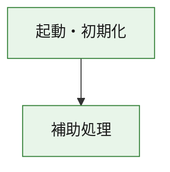
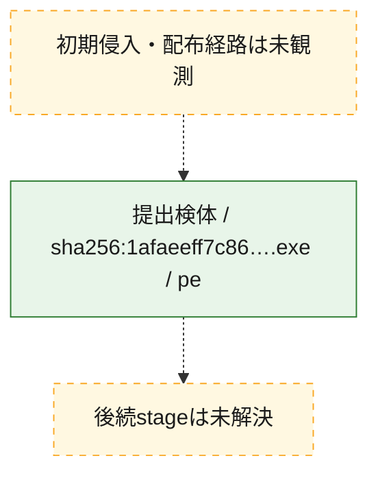
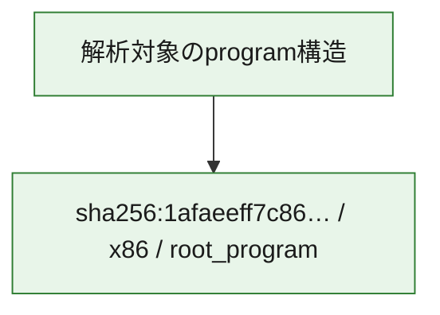

# 全体ロジック：1afaeeff7c866f1b7041362eb27e2edad56b43c21b626ca4117a0afe6290b3f6

代表関数の静的証跡から、起動・初期化の処理群を確認しました。

## 読み方

- phaseの掲載順は解析上の整理順です。observed_call_edgesがない段階間の実行順を断定しません。
- 図の実線は静的に観測した関係、点線と黄色のノードは未観測・未解決の関係を示します。
- 図は静的な要約であり、動的実行を再現するものではありません。
- 詳細な関数解説とfingerprintは[STATIC-LOGIC.md](STATIC-LOGIC.md)を参照してください。

## 静的可視化

### 実行フロー

### 感染チェーン

### モジュール関係

## 処理段階

### 1. 起動・初期化

entry pointから初期化と後続処理への移行を確認します。
確度: `confirmed_static_function_evidence`

- `1afaeeff7c866f1b7041362eb27e2edad56b43c21b626ca4117a0afe6290b3f6:ghidra:180001010` — 初期化と主要処理への分岐を行う入口関数です。 状態: `succeeded`、選定理由: `entry_point`, `meaningful_symbol_name`, `reviewed_call_centrality:22`, `role:entrypoint`, `small_program_complete_context`

### 2. 補助処理

主要処理を支える一般内部関数またはlibrary処理を確認します。
確度: `confirmed_static_function_evidence`

- `1afaeeff7c866f1b7041362eb27e2edad56b43c21b626ca4117a0afe6290b3f6:ghidra:180001240` — 検体内部の一般処理を実装する関数です。 状態: `succeeded`、選定理由: `context_representative`, `reviewed_call_centrality:2`, `small_program_complete_context`
- `1afaeeff7c866f1b7041362eb27e2edad56b43c21b626ca4117a0afe6290b3f6:ghidra:180001350` — 検体内部の一般処理を実装する関数です。 状態: `succeeded`、選定理由: `context_representative`, `reviewed_call_centrality:25`, `small_program_complete_context`
- `1afaeeff7c866f1b7041362eb27e2edad56b43c21b626ca4117a0afe6290b3f6:ghidra:180003780` — 検体内部の一般処理を実装する関数です。 状態: `succeeded`、選定理由: `context_representative`, `reviewed_call_centrality:2`, `small_program_complete_context`
- `1afaeeff7c866f1b7041362eb27e2edad56b43c21b626ca4117a0afe6290b3f6:ghidra:1800038e0` — 検体内部の一般処理を実装する関数です。 状態: `succeeded`、選定理由: `context_representative`, `reviewed_call_centrality:2`, `small_program_complete_context`

## 観測したcall関係

- `1afaeeff7c866f1b7041362eb27e2edad56b43c21b626ca4117a0afe6290b3f6:ghidra:180001010` → `1afaeeff7c866f1b7041362eb27e2edad56b43c21b626ca4117a0afe6290b3f6:ghidra:180001240` （`startup` → `support`）
- `1afaeeff7c866f1b7041362eb27e2edad56b43c21b626ca4117a0afe6290b3f6:ghidra:180001010` → `1afaeeff7c866f1b7041362eb27e2edad56b43c21b626ca4117a0afe6290b3f6:ghidra:180001350` （`startup` → `support`）
- `1afaeeff7c866f1b7041362eb27e2edad56b43c21b626ca4117a0afe6290b3f6:ghidra:180001350` → `1afaeeff7c866f1b7041362eb27e2edad56b43c21b626ca4117a0afe6290b3f6:ghidra:180001240` （`support` → `support`）
- `1afaeeff7c866f1b7041362eb27e2edad56b43c21b626ca4117a0afe6290b3f6:ghidra:180001350` → `1afaeeff7c866f1b7041362eb27e2edad56b43c21b626ca4117a0afe6290b3f6:ghidra:180003780` （`support` → `support`）
- `1afaeeff7c866f1b7041362eb27e2edad56b43c21b626ca4117a0afe6290b3f6:ghidra:180001350` → `1afaeeff7c866f1b7041362eb27e2edad56b43c21b626ca4117a0afe6290b3f6:ghidra:1800038e0` （`support` → `support`）
- `1afaeeff7c866f1b7041362eb27e2edad56b43c21b626ca4117a0afe6290b3f6:ghidra:180003780` → `1afaeeff7c866f1b7041362eb27e2edad56b43c21b626ca4117a0afe6290b3f6:ghidra:1800038e0` （`support` → `support`）
- `ghidra-function:676d0bffc8677639bd06a7a7` → `ghidra-function:f9b932d275fe58e6fe323454` （`unclassified` → `unclassified`）
- `ghidra-function:a0dc6fabb28c0c1ef424cf84` → `ghidra-function:17549667d2d8221454ea8e57` （`unclassified` → `unclassified`）
- `ghidra-function:a0dc6fabb28c0c1ef424cf84` → `ghidra-function:2fd6dde60645a09f54bb147f` （`unclassified` → `unclassified`）
- `ghidra-function:a0dc6fabb28c0c1ef424cf84` → `ghidra-function:3cddc6c41147558f1669c47a` （`unclassified` → `unclassified`）
- `ghidra-function:a0dc6fabb28c0c1ef424cf84` → `ghidra-function:4c751884f1508df183fd78d6` （`unclassified` → `unclassified`）
- `ghidra-function:a0dc6fabb28c0c1ef424cf84` → `ghidra-function:5a37772fd8c1cd1d7fa1640d` （`unclassified` → `unclassified`）
- `ghidra-function:a0dc6fabb28c0c1ef424cf84` → `ghidra-function:6a3c88f3f5e093df9a71ad41` （`unclassified` → `unclassified`）
- `ghidra-function:a0dc6fabb28c0c1ef424cf84` → `ghidra-function:79e9475505acac8b806ef0f5` （`unclassified` → `unclassified`）
- `ghidra-function:a0dc6fabb28c0c1ef424cf84` → `ghidra-function:7a6fbaeef46d8733daec62ae` （`unclassified` → `unclassified`）
- `ghidra-function:a0dc6fabb28c0c1ef424cf84` → `ghidra-function:92ee4b4e3d1ac04cb9dbb0cc` （`unclassified` → `unclassified`）
- `ghidra-function:a0dc6fabb28c0c1ef424cf84` → `ghidra-function:bc24c6247a9d2c65700a8975` （`unclassified` → `unclassified`）
- `ghidra-function:a0dc6fabb28c0c1ef424cf84` → `ghidra-function:c68c50b851ec57e8c3f68f61` （`unclassified` → `unclassified`）
- `ghidra-function:a0dc6fabb28c0c1ef424cf84` → `ghidra-function:eff792af982e05bdb683a435` （`unclassified` → `unclassified`）
- `ghidra-function:eff792af982e05bdb683a435` → `ghidra-external:00e132baa1d673e9e8f7ea46` （`unclassified` → `unclassified`）
- `ghidra-function:eff792af982e05bdb683a435` → `ghidra-external:132ddaf328d99e2a504ee6d0` （`unclassified` → `unclassified`）
- `ghidra-function:eff792af982e05bdb683a435` → `ghidra-external:2ac3c48e6d46f8a3e2306490` （`unclassified` → `unclassified`）
- `ghidra-function:eff792af982e05bdb683a435` → `ghidra-external:2b17abdfd65fc383a463da02` （`unclassified` → `unclassified`）
- `ghidra-function:eff792af982e05bdb683a435` → `ghidra-external:346789730cf7543e66926d8c` （`unclassified` → `unclassified`）
- `ghidra-function:eff792af982e05bdb683a435` → `ghidra-external:43fc209ee197829d7264f703` （`unclassified` → `unclassified`）
- `ghidra-function:eff792af982e05bdb683a435` → `ghidra-external:4a9aa6db7b3169cdc61d5cb7` （`unclassified` → `unclassified`）
- `ghidra-function:eff792af982e05bdb683a435` → `ghidra-external:5c1cfb28a96f3ef05becff5a` （`unclassified` → `unclassified`）
- `ghidra-function:eff792af982e05bdb683a435` → `ghidra-external:6d573c378aac78621634480d` （`unclassified` → `unclassified`）
- `ghidra-function:eff792af982e05bdb683a435` → `ghidra-external:713faf2675c10c982b1906e7` （`unclassified` → `unclassified`）
- `ghidra-function:eff792af982e05bdb683a435` → `ghidra-external:778e8e8f465abfc1678acfed` （`unclassified` → `unclassified`）
- `ghidra-function:eff792af982e05bdb683a435` → `ghidra-external:8caa90226de74a4e88319113` （`unclassified` → `unclassified`）
- `ghidra-function:eff792af982e05bdb683a435` → `ghidra-external:9197d55e93c6a04a9122595b` （`unclassified` → `unclassified`）
- `ghidra-function:eff792af982e05bdb683a435` → `ghidra-external:9afdd41673d7d5c341ff07d2` （`unclassified` → `unclassified`）
- `ghidra-function:eff792af982e05bdb683a435` → `ghidra-external:a5ff8a51827ed29829a4e7c9` （`unclassified` → `unclassified`）
- `ghidra-function:eff792af982e05bdb683a435` → `ghidra-external:aa1ecbc62dd111bccd26cea3` （`unclassified` → `unclassified`）
- `ghidra-function:eff792af982e05bdb683a435` → `ghidra-external:ab4c58201f55b6d51b155059` （`unclassified` → `unclassified`）
- `ghidra-function:eff792af982e05bdb683a435` → `ghidra-external:bf9dd9915ac2c65bb93af761` （`unclassified` → `unclassified`）
- `ghidra-function:eff792af982e05bdb683a435` → `ghidra-external:c130e8717a9f8cb6e9488490` （`unclassified` → `unclassified`）
- `ghidra-function:eff792af982e05bdb683a435` → `ghidra-external:c2b91fcde714e4ca8a442247` （`unclassified` → `unclassified`）
- `ghidra-function:eff792af982e05bdb683a435` → `ghidra-external:f90c6def15aaeb5f24f9c176` （`unclassified` → `unclassified`）
- `ghidra-function:eff792af982e05bdb683a435` → `ghidra-function:17549667d2d8221454ea8e57` （`unclassified` → `unclassified`）
- `ghidra-function:eff792af982e05bdb683a435` → `ghidra-function:676d0bffc8677639bd06a7a7` （`unclassified` → `unclassified`）
- `ghidra-function:eff792af982e05bdb683a435` → `ghidra-function:f9b932d275fe58e6fe323454` （`unclassified` → `unclassified`）

## 解析範囲と制約

- 選定外関数は全体inventoryへ残しますが、関数本体の個別解説対象にはしていません。
- indirect call、難読化、packer、VM、壊れたcontrol flowによりcall関係が欠落する場合があります。
- 文書は静的解析に基づき、検体実行や外部通信による動的確認は行っていません。
