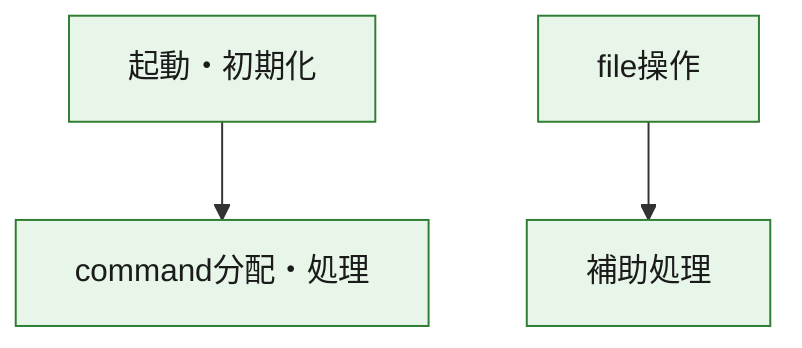
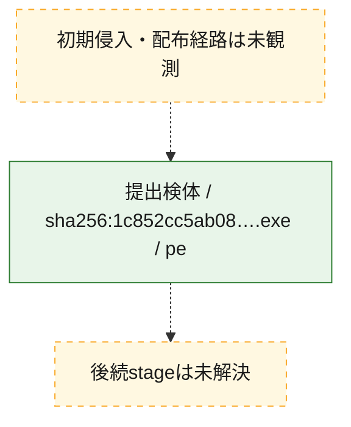
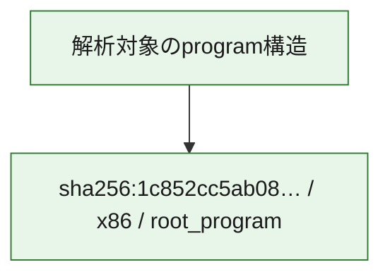

# 全体ロジック：1c852cc5ab0847f57908869ad14b2c1385bec46a8377f67b779aada5a5d59dc0

代表関数の静的証跡から、起動・初期化、command分配・処理、file操作の処理群を確認しました。

## 読み方

- phaseの掲載順は解析上の整理順です。observed_call_edgesがない段階間の実行順を断定しません。
- 図の実線は静的に観測した関係、点線と黄色のノードは未観測・未解決の関係を示します。
- 図は静的な要約であり、動的実行を再現するものではありません。
- 詳細な関数解説とfingerprintは[STATIC-LOGIC.md](STATIC-LOGIC.md)を参照してください。

## 静的可視化

### 実行フロー

### 感染チェーン

### モジュール関係

## 処理段階

### 1. 起動・初期化

entry pointから初期化と後続処理への移行を確認します。
確度: `confirmed_static_function_evidence`

- `1c852cc5ab0847f57908869ad14b2c1385bec46a8377f67b779aada5a5d59dc0:ghidra:14000bfb0` — 初期化と主要処理への分岐を行う入口関数です。 状態: `succeeded`、選定理由: `entry_point`, `meaningful_symbol_name`, `reviewed_call_centrality:22`, `role:entrypoint`

### 2. command分配・処理

受信commandやtaskの解釈、分配、個別handlerへの移行を確認します。
確度: `confirmed_static_function_evidence_with_limits`

- `1c852cc5ab0847f57908869ad14b2c1385bec46a8377f67b779aada5a5d59dc0:ghidra:140018cd0` — commandの解釈、分配、または個別処理を担当する関数です。 状態: `limited_bad_instruction_or_flow`、選定理由: `meaningful_symbol_name`, `reviewed_call_centrality:1`, `role:command_dispatch_or_handler`

### 3. file操作

fileやdirectoryの作成、読書き、削除を確認します。
確度: `confirmed_static_function_evidence`

- `1c852cc5ab0847f57908869ad14b2c1385bec46a8377f67b779aada5a5d59dc0:ghidra:140001fe0` — fileまたはdirectoryの読書き・管理に関係する関数です。 状態: `succeeded`、選定理由: `context_representative`, `reviewed_call_centrality:21`, `role:file_operation`

### 4. 補助処理

主要処理を支える一般内部関数またはlibrary処理を確認します。
確度: `confirmed_static_function_evidence_with_limits`

- `1c852cc5ab0847f57908869ad14b2c1385bec46a8377f67b779aada5a5d59dc0:ghidra:140001000` — 検体内部の一般処理を実装する関数です。 状態: `succeeded`、選定理由: `context_representative`, `reviewed_call_centrality:8`
- `1c852cc5ab0847f57908869ad14b2c1385bec46a8377f67b779aada5a5d59dc0:ghidra:1400010a0` — 検体内部の一般処理を実装する関数です。 状態: `succeeded`、選定理由: `context_representative`
- `1c852cc5ab0847f57908869ad14b2c1385bec46a8377f67b779aada5a5d59dc0:ghidra:1400010c0` — 検体内部の一般処理を実装する関数です。 状態: `succeeded`、選定理由: `context_representative`, `reviewed_call_centrality:3`
- `1c852cc5ab0847f57908869ad14b2c1385bec46a8377f67b779aada5a5d59dc0:ghidra:140001100` — 検体内部の一般処理を実装する関数です。 状態: `succeeded`、選定理由: `context_representative`
- `1c852cc5ab0847f57908869ad14b2c1385bec46a8377f67b779aada5a5d59dc0:ghidra:1400012f0` — 検体内部の一般処理を実装する関数です。 状態: `limited_bad_instruction_or_flow`、選定理由: `context_representative`, `reviewed_call_centrality:2`
- `1c852cc5ab0847f57908869ad14b2c1385bec46a8377f67b779aada5a5d59dc0:ghidra:140001640` — 検体内部の一般処理を実装する関数です。 状態: `succeeded`、選定理由: `context_representative`, `reviewed_call_centrality:1`
- `1c852cc5ab0847f57908869ad14b2c1385bec46a8377f67b779aada5a5d59dc0:ghidra:140001680` — 検体内部の一般処理を実装する関数です。 状態: `succeeded`、選定理由: `context_representative`, `reviewed_call_centrality:7`
- `1c852cc5ab0847f57908869ad14b2c1385bec46a8377f67b779aada5a5d59dc0:ghidra:140001840` — 検体内部の一般処理を実装する関数です。 状態: `limited_bad_instruction_or_flow`、選定理由: `context_representative`, `reviewed_call_centrality:8`
- `1c852cc5ab0847f57908869ad14b2c1385bec46a8377f67b779aada5a5d59dc0:ghidra:1400018c0` — 検体内部の一般処理を実装する関数です。 状態: `succeeded`、選定理由: `context_representative`, `reviewed_call_centrality:1`
- `1c852cc5ab0847f57908869ad14b2c1385bec46a8377f67b779aada5a5d59dc0:ghidra:140001940` — 検体内部の一般処理を実装する関数です。 状態: `succeeded`、選定理由: `context_representative`, `reviewed_call_centrality:3`
- `1c852cc5ab0847f57908869ad14b2c1385bec46a8377f67b779aada5a5d59dc0:ghidra:140001980` — 検体内部の一般処理を実装する関数です。 状態: `limited_bad_instruction_or_flow`、選定理由: `context_representative`, `reviewed_call_centrality:7`
- `1c852cc5ab0847f57908869ad14b2c1385bec46a8377f67b779aada5a5d59dc0:ghidra:140001ac0` — 検体内部の一般処理を実装する関数です。 状態: `limited_bad_instruction_or_flow`、選定理由: `context_representative`, `reviewed_call_centrality:4`
- `1c852cc5ab0847f57908869ad14b2c1385bec46a8377f67b779aada5a5d59dc0:ghidra:140001b40` — 検体内部の一般処理を実装する関数です。 状態: `succeeded`、選定理由: `context_representative`, `reviewed_call_centrality:4`
- `1c852cc5ab0847f57908869ad14b2c1385bec46a8377f67b779aada5a5d59dc0:ghidra:140001f00` — 検体内部の一般処理を実装する関数です。 状態: `succeeded`、選定理由: `context_representative`, `reviewed_call_centrality:4`
- `1c852cc5ab0847f57908869ad14b2c1385bec46a8377f67b779aada5a5d59dc0:ghidra:140002b10` — 検体内部の一般処理を実装する関数です。 状態: `limited_bad_instruction_or_flow`、選定理由: `context_representative`, `reviewed_call_centrality:7`
- `1c852cc5ab0847f57908869ad14b2c1385bec46a8377f67b779aada5a5d59dc0:ghidra:140002ce0` — 検体内部の一般処理を実装する関数です。 状態: `limited_bad_instruction_or_flow`、選定理由: `context_representative`, `reviewed_call_centrality:6`
- `1c852cc5ab0847f57908869ad14b2c1385bec46a8377f67b779aada5a5d59dc0:ghidra:140003060` — 検体内部の一般処理を実装する関数です。 状態: `limited_bad_instruction_or_flow`、選定理由: `context_representative`, `reviewed_call_centrality:8`
- `1c852cc5ab0847f57908869ad14b2c1385bec46a8377f67b779aada5a5d59dc0:ghidra:1400031a0` — 検体内部の一般処理を実装する関数です。 状態: `succeeded`、選定理由: `context_representative`, `reviewed_call_centrality:1`
- `1c852cc5ab0847f57908869ad14b2c1385bec46a8377f67b779aada5a5d59dc0:ghidra:140003240` — 検体内部の一般処理を実装する関数です。 状態: `limited_bad_instruction_or_flow`、選定理由: `context_representative`, `reviewed_call_centrality:2`
- `1c852cc5ab0847f57908869ad14b2c1385bec46a8377f67b779aada5a5d59dc0:ghidra:140003640` — 検体内部の一般処理を実装する関数です。 状態: `succeeded`、選定理由: `context_representative`, `reviewed_call_centrality:2`
- `1c852cc5ab0847f57908869ad14b2c1385bec46a8377f67b779aada5a5d59dc0:ghidra:140003760` — 検体内部の一般処理を実装する関数です。 状態: `limited_bad_instruction_or_flow`、選定理由: `context_representative`, `reviewed_call_centrality:1`
- `1c852cc5ab0847f57908869ad14b2c1385bec46a8377f67b779aada5a5d59dc0:ghidra:140003900` — 検体内部の一般処理を実装する関数です。 状態: `succeeded`、選定理由: `context_representative`, `reviewed_call_centrality:2`
- `1c852cc5ab0847f57908869ad14b2c1385bec46a8377f67b779aada5a5d59dc0:ghidra:140003940` — compiler生成処理または汎用library処理とみられる関数です。 状態: `succeeded`、選定理由: `entry_point`, `meaningful_symbol_name`, `reviewed_call_centrality:2`
- `1c852cc5ab0847f57908869ad14b2c1385bec46a8377f67b779aada5a5d59dc0:ghidra:140003a80` — 検体内部の一般処理を実装する関数です。 状態: `succeeded`、選定理由: `context_representative`
- `1c852cc5ab0847f57908869ad14b2c1385bec46a8377f67b779aada5a5d59dc0:ghidra:140003aa0` — 検体内部の一般処理を実装する関数です。 状態: `limited_bad_instruction_or_flow`、選定理由: `context_representative`, `reviewed_call_centrality:2`
- `1c852cc5ab0847f57908869ad14b2c1385bec46a8377f67b779aada5a5d59dc0:ghidra:140004580` — 検体内部の一般処理を実装する関数です。 状態: `succeeded`、選定理由: `context_representative`, `reviewed_call_centrality:1`
- `1c852cc5ab0847f57908869ad14b2c1385bec46a8377f67b779aada5a5d59dc0:ghidra:1400045b0` — 検体内部の一般処理を実装する関数です。 状態: `succeeded`、選定理由: `context_representative`, `reviewed_call_centrality:2`
- `1c852cc5ab0847f57908869ad14b2c1385bec46a8377f67b779aada5a5d59dc0:ghidra:140004660` — 検体内部の一般処理を実装する関数です。 状態: `succeeded`、選定理由: `context_representative`, `reviewed_call_centrality:2`
- `1c852cc5ab0847f57908869ad14b2c1385bec46a8377f67b779aada5a5d59dc0:ghidra:14000c5e0` — 検体内部の一般処理を実装する関数です。 状態: `succeeded`、選定理由: `meaningful_symbol_name`

## 観測したcall関係

- `1c852cc5ab0847f57908869ad14b2c1385bec46a8377f67b779aada5a5d59dc0:ghidra:140001640` → `1c852cc5ab0847f57908869ad14b2c1385bec46a8377f67b779aada5a5d59dc0:ghidra:1400010c0` （`support` → `support`）
- `1c852cc5ab0847f57908869ad14b2c1385bec46a8377f67b779aada5a5d59dc0:ghidra:140001680` → `1c852cc5ab0847f57908869ad14b2c1385bec46a8377f67b779aada5a5d59dc0:ghidra:140003060` （`support` → `support`）
- `1c852cc5ab0847f57908869ad14b2c1385bec46a8377f67b779aada5a5d59dc0:ghidra:140001840` → `1c852cc5ab0847f57908869ad14b2c1385bec46a8377f67b779aada5a5d59dc0:ghidra:140001980` （`support` → `support`）
- `1c852cc5ab0847f57908869ad14b2c1385bec46a8377f67b779aada5a5d59dc0:ghidra:140001fe0` → `1c852cc5ab0847f57908869ad14b2c1385bec46a8377f67b779aada5a5d59dc0:ghidra:140003900` （`file_activity` → `support`）
- `1c852cc5ab0847f57908869ad14b2c1385bec46a8377f67b779aada5a5d59dc0:ghidra:140003060` → `1c852cc5ab0847f57908869ad14b2c1385bec46a8377f67b779aada5a5d59dc0:ghidra:140001980` （`support` → `support`）
- `1c852cc5ab0847f57908869ad14b2c1385bec46a8377f67b779aada5a5d59dc0:ghidra:1400031a0` → `1c852cc5ab0847f57908869ad14b2c1385bec46a8377f67b779aada5a5d59dc0:ghidra:140001940` （`support` → `support`）
- `1c852cc5ab0847f57908869ad14b2c1385bec46a8377f67b779aada5a5d59dc0:ghidra:140003240` → `1c852cc5ab0847f57908869ad14b2c1385bec46a8377f67b779aada5a5d59dc0:ghidra:1400012f0` （`support` → `support`）
- `1c852cc5ab0847f57908869ad14b2c1385bec46a8377f67b779aada5a5d59dc0:ghidra:140003940` → `1c852cc5ab0847f57908869ad14b2c1385bec46a8377f67b779aada5a5d59dc0:ghidra:140001980` （`support` → `support`）
- `1c852cc5ab0847f57908869ad14b2c1385bec46a8377f67b779aada5a5d59dc0:ghidra:14000bfb0` → `1c852cc5ab0847f57908869ad14b2c1385bec46a8377f67b779aada5a5d59dc0:ghidra:140018cd0` （`startup` → `dispatch`）
- `ghidra-function:092999d83e41d3bc9f492629` → `ghidra-function:37c36fceb6daed3995d9d9be` （`unclassified` → `unclassified`）
- `ghidra-function:092999d83e41d3bc9f492629` → `ghidra-function:3d31eb197a0dc26a85a57f6e` （`unclassified` → `unclassified`）
- `ghidra-function:092999d83e41d3bc9f492629` → `ghidra-function:5dc1e3d030c2a5edaebf41cd` （`unclassified` → `unclassified`）
- `ghidra-function:092999d83e41d3bc9f492629` → `ghidra-function:b046971472c8edb0a063ccfb` （`unclassified` → `unclassified`）
- `ghidra-function:092999d83e41d3bc9f492629` → `ghidra-function:d728e6c6b779dea8252b2a79` （`unclassified` → `unclassified`）
- `ghidra-function:153f4215be7af7a4272c395a` → `ghidra-external:1860eec7604fdc9e00b751aa` （`unclassified` → `unclassified`）
- `ghidra-function:153f4215be7af7a4272c395a` → `ghidra-external:2caf0faf502b254c5d14490d` （`unclassified` → `unclassified`）
- `ghidra-function:153f4215be7af7a4272c395a` → `ghidra-external:f44b59fc1a9b50c9ef3f6eb1` （`unclassified` → `unclassified`）
- `ghidra-function:153f4215be7af7a4272c395a` → `ghidra-function:323e1a669afa75cb58469584` （`unclassified` → `unclassified`）
- `ghidra-function:153f4215be7af7a4272c395a` → `ghidra-function:5dc1e3d030c2a5edaebf41cd` （`unclassified` → `unclassified`）
- `ghidra-function:153f4215be7af7a4272c395a` → `ghidra-function:b046971472c8edb0a063ccfb` （`unclassified` → `unclassified`）
- `ghidra-function:19e152a876737549853761d8` → `ghidra-external:70360067b36b433610b3dcc6` （`unclassified` → `unclassified`）
- `ghidra-function:19e152a876737549853761d8` → `ghidra-external:a2ba13aa351fcbd45ef08f88` （`unclassified` → `unclassified`）
- `ghidra-function:19e152a876737549853761d8` → `ghidra-external:acf70dfc4edb878d9adaf52a` （`unclassified` → `unclassified`）
- `ghidra-function:19e152a876737549853761d8` → `ghidra-external:aeb4a6678babb59b52428595` （`unclassified` → `unclassified`）
- `ghidra-function:19e152a876737549853761d8` → `ghidra-external:e541111e7ad760b5312e3653` （`unclassified` → `unclassified`）
- `ghidra-function:19e152a876737549853761d8` → `ghidra-function:092999d83e41d3bc9f492629` （`unclassified` → `unclassified`）
- `ghidra-function:19e152a876737549853761d8` → `ghidra-function:d728e6c6b779dea8252b2a79` （`unclassified` → `unclassified`）
- `ghidra-function:33f87736f18582afb51cd568` → `ghidra-external:2caf0faf502b254c5d14490d` （`unclassified` → `unclassified`）
- `ghidra-function:33f87736f18582afb51cd568` → `ghidra-external:3a41f5b7a746f1bb1e5dc0d9` （`unclassified` → `unclassified`）
- `ghidra-function:33f87736f18582afb51cd568` → `ghidra-external:3bcd81fafdf4c0667ee63b4c` （`unclassified` → `unclassified`）
- `ghidra-function:33f87736f18582afb51cd568` → `ghidra-external:643faf16925149319a92e264` （`unclassified` → `unclassified`）
- `ghidra-function:33f87736f18582afb51cd568` → `ghidra-external:6b9fd75f775f55e161be0bce` （`unclassified` → `unclassified`）
- `ghidra-function:33f87736f18582afb51cd568` → `ghidra-external:8b6b281de1a97285057e9e41` （`unclassified` → `unclassified`）
- `ghidra-function:33f87736f18582afb51cd568` → `ghidra-external:aeb4a6678babb59b52428595` （`unclassified` → `unclassified`）
- `ghidra-function:3580a166addeab9d6358c603` → `ghidra-external:1e8ba2f3425195e7cba4a222` （`unclassified` → `unclassified`）
- `ghidra-function:3580a166addeab9d6358c603` → `ghidra-external:a2ba13aa351fcbd45ef08f88` （`unclassified` → `unclassified`）
- `ghidra-function:3953901118b10f200170163f` → `ghidra-external:01e311ab9cebea1d9d8ea02b` （`unclassified` → `unclassified`）
- `ghidra-function:3953901118b10f200170163f` → `ghidra-external:07f3530e398d47e4e8aadb4c` （`unclassified` → `unclassified`）
- `ghidra-function:3953901118b10f200170163f` → `ghidra-external:0aaddf3b4ecd2cce508d7260` （`unclassified` → `unclassified`）
- `ghidra-function:3953901118b10f200170163f` → `ghidra-external:1226a1bd9883c6d21c29312d` （`unclassified` → `unclassified`）
- `ghidra-function:3953901118b10f200170163f` → `ghidra-external:643faf16925149319a92e264` （`unclassified` → `unclassified`）
- `ghidra-function:3953901118b10f200170163f` → `ghidra-external:890f0ca0ca4c6d4b752bbcae` （`unclassified` → `unclassified`）
- `ghidra-function:3953901118b10f200170163f` → `ghidra-external:bf4b01dd329cadd3475b332d` （`unclassified` → `unclassified`）
- `ghidra-function:3953901118b10f200170163f` → `ghidra-external:c3905c405f8e288faa879b7c` （`unclassified` → `unclassified`）
- `ghidra-function:3953901118b10f200170163f` → `ghidra-external:c45b4ae047a0e13b2c0e4c6d` （`unclassified` → `unclassified`）
- `ghidra-function:3953901118b10f200170163f` → `ghidra-function:0ff573fd852c914146dd7bc4` （`unclassified` → `unclassified`）
- `ghidra-function:3953901118b10f200170163f` → `ghidra-function:1b5fc42a694a3004a8da742a` （`unclassified` → `unclassified`）
- `ghidra-function:3953901118b10f200170163f` → `ghidra-function:28f7e9e9f6f7192a138c3d75` （`unclassified` → `unclassified`）
- `ghidra-function:3953901118b10f200170163f` → `ghidra-function:3f633a003a8cb8823dbd0349` （`unclassified` → `unclassified`）
- `ghidra-function:3953901118b10f200170163f` → `ghidra-function:4982aed1fd0bc6b13c5ac13f` （`unclassified` → `unclassified`）
- `ghidra-function:3953901118b10f200170163f` → `ghidra-function:5191ec63642c558600f0dc1b` （`unclassified` → `unclassified`）
- `ghidra-function:3953901118b10f200170163f` → `ghidra-function:61ac24166e73aaff606dc99e` （`unclassified` → `unclassified`）
- `ghidra-function:3953901118b10f200170163f` → `ghidra-function:644be8227bfd62c45afa7e77` （`unclassified` → `unclassified`）
- `ghidra-function:3953901118b10f200170163f` → `ghidra-function:8e5890bd777951d1b063453f` （`unclassified` → `unclassified`）
- `ghidra-function:3953901118b10f200170163f` → `ghidra-function:a5651d3661265e7439c8c958` （`unclassified` → `unclassified`）
- `ghidra-function:3953901118b10f200170163f` → `ghidra-function:b2fdd543de85131c846e0916` （`unclassified` → `unclassified`）
- `ghidra-function:3953901118b10f200170163f` → `ghidra-function:df93bd0b6ae03dcdfd4615fe` （`unclassified` → `unclassified`）
- `ghidra-function:3953901118b10f200170163f` → `ghidra-function:f61553aa9cb6e797f37fc9b6` （`unclassified` → `unclassified`）
- `ghidra-function:3edd85ce2be54ca69f7ed25b` → `ghidra-external:afc27f7e3355a42f1f1b399d` （`unclassified` → `unclassified`）
- `ghidra-function:3edd85ce2be54ca69f7ed25b` → `ghidra-function:e1493ddb9e33b2026e3bee73` （`unclassified` → `unclassified`）
- `ghidra-function:44e35a867a73af5e87642708` → `ghidra-function:f5ec7f0d0e08ff5f674aa77a` （`unclassified` → `unclassified`）
- `ghidra-function:4e4e73731728a640062ab635` → `ghidra-external:2caf0faf502b254c5d14490d` （`unclassified` → `unclassified`）
- `ghidra-function:4e4e73731728a640062ab635` → `ghidra-external:397bda985c4ac6920ff98eb0` （`unclassified` → `unclassified`）
- `ghidra-function:5a42050c03116e06432b4ea2` → `ghidra-external:72a155cb1d45ebd0555513f7` （`unclassified` → `unclassified`）
- `ghidra-function:5a42050c03116e06432b4ea2` → `ghidra-external:9e05980bb49fc1fd704d504c` （`unclassified` → `unclassified`）
- `ghidra-function:5a42050c03116e06432b4ea2` → `ghidra-external:a2ba13aa351fcbd45ef08f88` （`unclassified` → `unclassified`）
- `ghidra-function:5a42050c03116e06432b4ea2` → `ghidra-external:aeb4a6678babb59b52428595` （`unclassified` → `unclassified`）
- `ghidra-function:5a42050c03116e06432b4ea2` → `ghidra-external:c064c8c137c9a5083a44f109` （`unclassified` → `unclassified`）
- `ghidra-function:5a42050c03116e06432b4ea2` → `ghidra-external:e541111e7ad760b5312e3653` （`unclassified` → `unclassified`）
- `ghidra-function:5a42050c03116e06432b4ea2` → `ghidra-external:e6d0b5c3d69aab8069ee5d3d` （`unclassified` → `unclassified`）
- `ghidra-function:5a42050c03116e06432b4ea2` → `ghidra-external:ed1446c0eed695f5850fcfa8` （`unclassified` → `unclassified`）
- `ghidra-function:5a42050c03116e06432b4ea2` → `ghidra-function:32075ab36b3c17f1fc9aea2f` （`unclassified` → `unclassified`）
- `ghidra-function:5a42050c03116e06432b4ea2` → `ghidra-function:4f3e97d62560e0904bd393ec` （`unclassified` → `unclassified`）
- `ghidra-function:5a42050c03116e06432b4ea2` → `ghidra-function:73939800f2aa66201eb58dc1` （`unclassified` → `unclassified`）
- `ghidra-function:5a42050c03116e06432b4ea2` → `ghidra-function:80c294d44a8d4e8c5d43c028` （`unclassified` → `unclassified`）
- `ghidra-function:5a42050c03116e06432b4ea2` → `ghidra-function:9bbcc8b8afd0af23029cfc1b` （`unclassified` → `unclassified`）
- `ghidra-function:5a42050c03116e06432b4ea2` → `ghidra-function:a47d12b20ba04012c6d296bc` （`unclassified` → `unclassified`）
- `ghidra-function:5a42050c03116e06432b4ea2` → `ghidra-function:dd9e985cb6fc9af942a74010` （`unclassified` → `unclassified`）
- `ghidra-function:60a2825afa3c2593d6837fc2` → `ghidra-function:d69980881c14a1f6c94fab02` （`unclassified` → `unclassified`）
- `ghidra-function:68ef602c1b55c62bf60e13a8` → `ghidra-function:32075ab36b3c17f1fc9aea2f` （`unclassified` → `unclassified`）
- `ghidra-function:68ef602c1b55c62bf60e13a8` → `ghidra-function:4dddb9cd53a802669e6df0ab` （`unclassified` → `unclassified`）
- `ghidra-function:69ba7d4bcee99b2725d3037b` → `ghidra-external:a2ba13aa351fcbd45ef08f88` （`unclassified` → `unclassified`）
- `ghidra-function:69ba7d4bcee99b2725d3037b` → `ghidra-function:b046971472c8edb0a063ccfb` （`unclassified` → `unclassified`）
- `ghidra-function:8808b68d729aa04d21580045` → `ghidra-function:dd9e985cb6fc9af942a74010` （`unclassified` → `unclassified`）
- `ghidra-function:926711b1c58c80567dcb7918` → `ghidra-external:3615af3b6f77cfc9092e8955` （`unclassified` → `unclassified`）
- `ghidra-function:936dc0c27aca77288c41fc0e` → `ghidra-external:a2ba13aa351fcbd45ef08f88` （`unclassified` → `unclassified`）
- `ghidra-function:a47d12b20ba04012c6d296bc` → `ghidra-external:a2ba13aa351fcbd45ef08f88` （`unclassified` → `unclassified`）
- `ghidra-function:aae66f67ccd708c5d214a319` → `ghidra-external:e6f03048deaa5dffaca44b91` （`unclassified` → `unclassified`）
- `ghidra-function:aae66f67ccd708c5d214a319` → `ghidra-function:f635b7837d61906d35535630` （`unclassified` → `unclassified`）
- `ghidra-function:b046971472c8edb0a063ccfb` → `ghidra-function:323e1a669afa75cb58469584` （`unclassified` → `unclassified`）
- `ghidra-function:b046971472c8edb0a063ccfb` → `ghidra-function:5dc1e3d030c2a5edaebf41cd` （`unclassified` → `unclassified`）
- `ghidra-function:c168ff5805007a4091bd4013` → `ghidra-function:1a6ac7061cb9a85ad9815f04` （`unclassified` → `unclassified`）
- `ghidra-function:c168ff5805007a4091bd4013` → `ghidra-function:9526303cc687a8788c3c4f57` （`unclassified` → `unclassified`）
- `ghidra-function:c195cffa9b4ab79edb635285` → `ghidra-external:8b6b281de1a97285057e9e41` （`unclassified` → `unclassified`）
- `ghidra-function:c195cffa9b4ab79edb635285` → `ghidra-external:a2ba13aa351fcbd45ef08f88` （`unclassified` → `unclassified`）
- `ghidra-function:c195cffa9b4ab79edb635285` → `ghidra-function:bad8b05a2bd99418a1c8d596` （`unclassified` → `unclassified`）
- `ghidra-function:c195cffa9b4ab79edb635285` → `ghidra-function:e0a50c505d03a2dbf1800481` （`unclassified` → `unclassified`）
- `ghidra-function:c195cffa9b4ab79edb635285` → `ghidra-function:e0f54b640ccc09f1970518e3` （`unclassified` → `unclassified`）
- `ghidra-function:d69980881c14a1f6c94fab02` → `ghidra-external:a2ba13aa351fcbd45ef08f88` （`unclassified` → `unclassified`）
- `ghidra-function:d69980881c14a1f6c94fab02` → `ghidra-function:23b3c482f7c02201ffb9cd97` （`unclassified` → `unclassified`）
- `ghidra-function:d7ffe08da115b88f6b0d87f3` → `ghidra-external:1e8ba2f3425195e7cba4a222` （`unclassified` → `unclassified`）
- `ghidra-function:d7ffe08da115b88f6b0d87f3` → `ghidra-external:3a41f5b7a746f1bb1e5dc0d9` （`unclassified` → `unclassified`）
- `ghidra-function:d7ffe08da115b88f6b0d87f3` → `ghidra-external:3bcd81fafdf4c0667ee63b4c` （`unclassified` → `unclassified`）
- `ghidra-function:d7ffe08da115b88f6b0d87f3` → `ghidra-external:6b9fd75f775f55e161be0bce` （`unclassified` → `unclassified`）
- `ghidra-function:d7ffe08da115b88f6b0d87f3` → `ghidra-external:a2ba13aa351fcbd45ef08f88` （`unclassified` → `unclassified`）
- `ghidra-function:d7ffe08da115b88f6b0d87f3` → `ghidra-external:b81aebd4b47d5fc1774fd932` （`unclassified` → `unclassified`）
- `ghidra-function:e1493ddb9e33b2026e3bee73` → `ghidra-external:a006d1bd4772321fd75a5456` （`unclassified` → `unclassified`）
- `ghidra-function:f5ec7f0d0e08ff5f674aa77a` → `ghidra-external:a2ba13aa351fcbd45ef08f88` （`unclassified` → `unclassified`）
- `ghidra-function:f5ec7f0d0e08ff5f674aa77a` → `ghidra-function:23b3c482f7c02201ffb9cd97` （`unclassified` → `unclassified`）
- `ghidra-function:fc62345d9edced2d97acd01f` → `ghidra-function:1475df3126adfcd9c72e1a6c` （`unclassified` → `unclassified`）
- `ghidra-function:fe8df682aba1344100cd68d6` → `ghidra-external:a2ba13aa351fcbd45ef08f88` （`unclassified` → `unclassified`）
- `ghidra-function:fe8df682aba1344100cd68d6` → `ghidra-function:afea05863d7dac7721db1444` （`unclassified` → `unclassified`）
- `ghidra-function:fe8df682aba1344100cd68d6` → `ghidra-function:efcc5f81f583652392c57911` （`unclassified` → `unclassified`）

## 解析範囲と制約

- 選定外関数は全体inventoryへ残しますが、関数本体の個別解説対象にはしていません。
- indirect call、難読化、packer、VM、壊れたcontrol flowによりcall関係が欠落する場合があります。
- 文書は静的解析に基づき、検体実行や外部通信による動的確認は行っていません。
