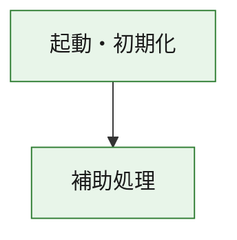
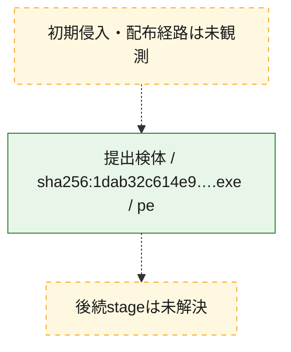
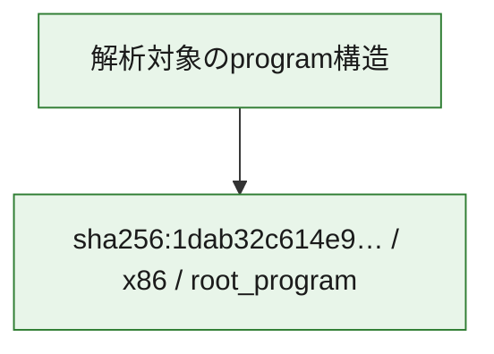

# 全体ロジック：1dab32c614e9a97a25f8f04841b4ba9fe780369da1b043871b936e8f3c834891

代表関数の静的証跡から、起動・初期化の処理群を確認しました。

## 読み方

- phaseの掲載順は解析上の整理順です。observed_call_edgesがない段階間の実行順を断定しません。
- 図の実線は静的に観測した関係、点線と黄色のノードは未観測・未解決の関係を示します。
- 図は静的な要約であり、動的実行を再現するものではありません。
- 詳細な関数解説とfingerprintは[STATIC-LOGIC.md](STATIC-LOGIC.md)を参照してください。

## 静的可視化

### 実行フロー

### 感染チェーン

### モジュール関係

## 処理段階

### 1. 起動・初期化

entry pointから初期化と後続処理への移行を確認します。
確度: `confirmed_static_function_evidence`

- `1dab32c614e9a97a25f8f04841b4ba9fe780369da1b043871b936e8f3c834891:ghidra:180001010` — 初期化と主要処理への分岐を行う入口関数です。 状態: `succeeded`、選定理由: `entry_point`, `meaningful_symbol_name`, `reviewed_call_centrality:22`, `role:entrypoint`, `small_program_complete_context`

### 2. 補助処理

主要処理を支える一般内部関数またはlibrary処理を確認します。
確度: `confirmed_static_function_evidence`

- `1dab32c614e9a97a25f8f04841b4ba9fe780369da1b043871b936e8f3c834891:ghidra:180001240` — 検体内部の一般処理を実装する関数です。 状態: `succeeded`、選定理由: `context_representative`, `reviewed_call_centrality:2`, `small_program_complete_context`
- `1dab32c614e9a97a25f8f04841b4ba9fe780369da1b043871b936e8f3c834891:ghidra:180001350` — 検体内部の一般処理を実装する関数です。 状態: `succeeded`、選定理由: `context_representative`, `reviewed_call_centrality:25`, `small_program_complete_context`
- `1dab32c614e9a97a25f8f04841b4ba9fe780369da1b043871b936e8f3c834891:ghidra:180003780` — 検体内部の一般処理を実装する関数です。 状態: `succeeded`、選定理由: `context_representative`, `reviewed_call_centrality:2`, `small_program_complete_context`
- `1dab32c614e9a97a25f8f04841b4ba9fe780369da1b043871b936e8f3c834891:ghidra:1800038e0` — 検体内部の一般処理を実装する関数です。 状態: `succeeded`、選定理由: `context_representative`, `reviewed_call_centrality:2`, `small_program_complete_context`

## 観測したcall関係

- `1dab32c614e9a97a25f8f04841b4ba9fe780369da1b043871b936e8f3c834891:ghidra:180001010` → `1dab32c614e9a97a25f8f04841b4ba9fe780369da1b043871b936e8f3c834891:ghidra:180001240` （`startup` → `support`）
- `1dab32c614e9a97a25f8f04841b4ba9fe780369da1b043871b936e8f3c834891:ghidra:180001010` → `1dab32c614e9a97a25f8f04841b4ba9fe780369da1b043871b936e8f3c834891:ghidra:180001350` （`startup` → `support`）
- `1dab32c614e9a97a25f8f04841b4ba9fe780369da1b043871b936e8f3c834891:ghidra:180001350` → `1dab32c614e9a97a25f8f04841b4ba9fe780369da1b043871b936e8f3c834891:ghidra:180001240` （`support` → `support`）
- `1dab32c614e9a97a25f8f04841b4ba9fe780369da1b043871b936e8f3c834891:ghidra:180001350` → `1dab32c614e9a97a25f8f04841b4ba9fe780369da1b043871b936e8f3c834891:ghidra:180003780` （`support` → `support`）
- `1dab32c614e9a97a25f8f04841b4ba9fe780369da1b043871b936e8f3c834891:ghidra:180001350` → `1dab32c614e9a97a25f8f04841b4ba9fe780369da1b043871b936e8f3c834891:ghidra:1800038e0` （`support` → `support`）
- `1dab32c614e9a97a25f8f04841b4ba9fe780369da1b043871b936e8f3c834891:ghidra:180003780` → `1dab32c614e9a97a25f8f04841b4ba9fe780369da1b043871b936e8f3c834891:ghidra:1800038e0` （`support` → `support`）
- `ghidra-function:381a7b7f9aa2b45d2d947f19` → `ghidra-function:fcb17b49bd28a20a45259e96` （`unclassified` → `unclassified`）
- `ghidra-function:bc090c98869d47859debe6ca` → `ghidra-external:21a7b955115352a0e24da9ce` （`unclassified` → `unclassified`）
- `ghidra-function:bc090c98869d47859debe6ca` → `ghidra-external:473ab84d29f3c71a356619b0` （`unclassified` → `unclassified`）
- `ghidra-function:bc090c98869d47859debe6ca` → `ghidra-external:47b88b0d5c0f1c1202d0ac6a` （`unclassified` → `unclassified`）
- `ghidra-function:bc090c98869d47859debe6ca` → `ghidra-external:4fd2857412b3ef4f01b8bb07` （`unclassified` → `unclassified`）
- `ghidra-function:bc090c98869d47859debe6ca` → `ghidra-external:56b16e56b0c0b1bf501e32ef` （`unclassified` → `unclassified`）
- `ghidra-function:bc090c98869d47859debe6ca` → `ghidra-external:5c08777020af4b11a964677e` （`unclassified` → `unclassified`）
- `ghidra-function:bc090c98869d47859debe6ca` → `ghidra-external:6b88e7044ce24d5dc03ac6c5` （`unclassified` → `unclassified`）
- `ghidra-function:bc090c98869d47859debe6ca` → `ghidra-external:788647801cb1b66acf2a7947` （`unclassified` → `unclassified`）
- `ghidra-function:bc090c98869d47859debe6ca` → `ghidra-external:91e169f60482a35c103cb1e8` （`unclassified` → `unclassified`）
- `ghidra-function:bc090c98869d47859debe6ca` → `ghidra-external:927867cbf7c271ed4fda8eeb` （`unclassified` → `unclassified`）
- `ghidra-function:bc090c98869d47859debe6ca` → `ghidra-external:9d4fc04694534c315fc26ef6` （`unclassified` → `unclassified`）
- `ghidra-function:bc090c98869d47859debe6ca` → `ghidra-external:9d5349cad0b2a3b597db338f` （`unclassified` → `unclassified`）
- `ghidra-function:bc090c98869d47859debe6ca` → `ghidra-external:b1b5a81a915307abe1747da5` （`unclassified` → `unclassified`）
- `ghidra-function:bc090c98869d47859debe6ca` → `ghidra-external:bd504ee25a22de64c76b3728` （`unclassified` → `unclassified`）
- `ghidra-function:bc090c98869d47859debe6ca` → `ghidra-external:c21355cad85e3733231e2a40` （`unclassified` → `unclassified`）
- `ghidra-function:bc090c98869d47859debe6ca` → `ghidra-external:d8a07b1f31c5400a71ab83ca` （`unclassified` → `unclassified`）
- `ghidra-function:bc090c98869d47859debe6ca` → `ghidra-external:e2c1c807e83827d38daf3c95` （`unclassified` → `unclassified`）
- `ghidra-function:bc090c98869d47859debe6ca` → `ghidra-external:e4989d1f2c128d539a154a43` （`unclassified` → `unclassified`）
- `ghidra-function:bc090c98869d47859debe6ca` → `ghidra-external:ec194dada9dc58fc7b722108` （`unclassified` → `unclassified`）
- `ghidra-function:bc090c98869d47859debe6ca` → `ghidra-external:ee67f59561fc88bb5540b1ac` （`unclassified` → `unclassified`）
- `ghidra-function:bc090c98869d47859debe6ca` → `ghidra-external:f06ae400625e5426511c1c5b` （`unclassified` → `unclassified`）
- `ghidra-function:bc090c98869d47859debe6ca` → `ghidra-function:1186d77ed1fc40222a78ca41` （`unclassified` → `unclassified`）
- `ghidra-function:bc090c98869d47859debe6ca` → `ghidra-function:381a7b7f9aa2b45d2d947f19` （`unclassified` → `unclassified`）
- `ghidra-function:bc090c98869d47859debe6ca` → `ghidra-function:fcb17b49bd28a20a45259e96` （`unclassified` → `unclassified`）
- `ghidra-function:f7be5441b7e36f74c436be5a` → `ghidra-function:1186d77ed1fc40222a78ca41` （`unclassified` → `unclassified`）
- `ghidra-function:f7be5441b7e36f74c436be5a` → `ghidra-function:4329d40668d8351bf06e4306` （`unclassified` → `unclassified`）
- `ghidra-function:f7be5441b7e36f74c436be5a` → `ghidra-function:47defc5a0b636d3c65fb0c14` （`unclassified` → `unclassified`）
- `ghidra-function:f7be5441b7e36f74c436be5a` → `ghidra-function:91608c652865cf2f97090362` （`unclassified` → `unclassified`）
- `ghidra-function:f7be5441b7e36f74c436be5a` → `ghidra-function:a2dcef26de77466408d3bfa4` （`unclassified` → `unclassified`）
- `ghidra-function:f7be5441b7e36f74c436be5a` → `ghidra-function:bc090c98869d47859debe6ca` （`unclassified` → `unclassified`）
- `ghidra-function:f7be5441b7e36f74c436be5a` → `ghidra-function:c8036a68f30368618321ecd6` （`unclassified` → `unclassified`）
- `ghidra-function:f7be5441b7e36f74c436be5a` → `ghidra-function:d3fceb6e729b617a7e45f51a` （`unclassified` → `unclassified`）
- `ghidra-function:f7be5441b7e36f74c436be5a` → `ghidra-function:daf41603077fe0340fc44982` （`unclassified` → `unclassified`）
- `ghidra-function:f7be5441b7e36f74c436be5a` → `ghidra-function:e28c3e07633be5603b1af973` （`unclassified` → `unclassified`）
- `ghidra-function:f7be5441b7e36f74c436be5a` → `ghidra-function:e439b1adcccbdd9551172473` （`unclassified` → `unclassified`）
- `ghidra-function:f7be5441b7e36f74c436be5a` → `ghidra-function:f0d20f65c3d954cd9446fe2d` （`unclassified` → `unclassified`）

## 解析範囲と制約

- 選定外関数は全体inventoryへ残しますが、関数本体の個別解説対象にはしていません。
- indirect call、難読化、packer、VM、壊れたcontrol flowによりcall関係が欠落する場合があります。
- 文書は静的解析に基づき、検体実行や外部通信による動的確認は行っていません。
