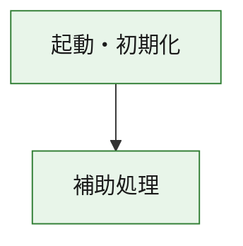
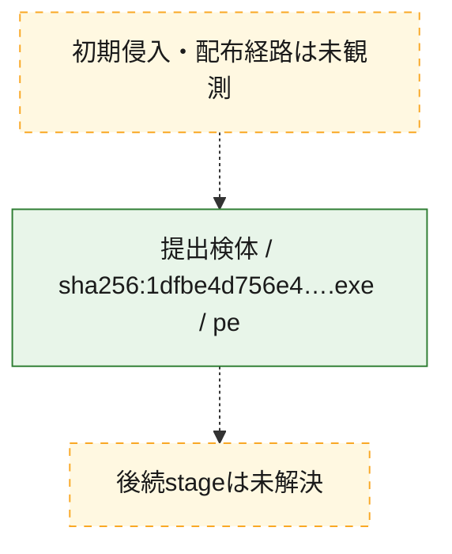
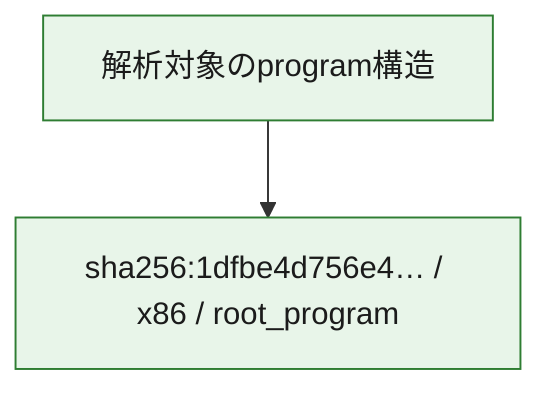

# 全体ロジック：1dfbe4d756e4a424f51a012250ddbdd7da05070146676302275118ebc2c24f1e

代表関数の静的証跡から、起動・初期化の処理群を確認しました。

## 読み方

- phaseの掲載順は解析上の整理順です。observed_call_edgesがない段階間の実行順を断定しません。
- 図の実線は静的に観測した関係、点線と黄色のノードは未観測・未解決の関係を示します。
- 図は静的な要約であり、動的実行を再現するものではありません。
- 詳細な関数解説とfingerprintは[STATIC-LOGIC.md](STATIC-LOGIC.md)を参照してください。

## 静的可視化

### 実行フロー

### 感染チェーン

### モジュール関係

## 処理段階

### 1. 起動・初期化

entry pointから初期化と後続処理への移行を確認します。
確度: `confirmed_static_function_evidence`

- `1dfbe4d756e4a424f51a012250ddbdd7da05070146676302275118ebc2c24f1e:ghidra:180001010` — 初期化と主要処理への分岐を行う入口関数です。 状態: `succeeded`、選定理由: `entry_point`, `meaningful_symbol_name`, `reviewed_call_centrality:22`, `role:entrypoint`, `small_program_complete_context`

### 2. 補助処理

主要処理を支える一般内部関数またはlibrary処理を確認します。
確度: `confirmed_static_function_evidence`

- `1dfbe4d756e4a424f51a012250ddbdd7da05070146676302275118ebc2c24f1e:ghidra:180001240` — 検体内部の一般処理を実装する関数です。 状態: `succeeded`、選定理由: `context_representative`, `reviewed_call_centrality:2`, `small_program_complete_context`
- `1dfbe4d756e4a424f51a012250ddbdd7da05070146676302275118ebc2c24f1e:ghidra:180001350` — 検体内部の一般処理を実装する関数です。 状態: `succeeded`、選定理由: `context_representative`, `reviewed_call_centrality:25`, `small_program_complete_context`
- `1dfbe4d756e4a424f51a012250ddbdd7da05070146676302275118ebc2c24f1e:ghidra:180003780` — 検体内部の一般処理を実装する関数です。 状態: `succeeded`、選定理由: `context_representative`, `reviewed_call_centrality:2`, `small_program_complete_context`
- `1dfbe4d756e4a424f51a012250ddbdd7da05070146676302275118ebc2c24f1e:ghidra:1800038e0` — 検体内部の一般処理を実装する関数です。 状態: `succeeded`、選定理由: `context_representative`, `reviewed_call_centrality:2`, `small_program_complete_context`

## 観測したcall関係

- `1dfbe4d756e4a424f51a012250ddbdd7da05070146676302275118ebc2c24f1e:ghidra:180001010` → `1dfbe4d756e4a424f51a012250ddbdd7da05070146676302275118ebc2c24f1e:ghidra:180001240` （`startup` → `support`）
- `1dfbe4d756e4a424f51a012250ddbdd7da05070146676302275118ebc2c24f1e:ghidra:180001010` → `1dfbe4d756e4a424f51a012250ddbdd7da05070146676302275118ebc2c24f1e:ghidra:180001350` （`startup` → `support`）
- `1dfbe4d756e4a424f51a012250ddbdd7da05070146676302275118ebc2c24f1e:ghidra:180001350` → `1dfbe4d756e4a424f51a012250ddbdd7da05070146676302275118ebc2c24f1e:ghidra:180001240` （`support` → `support`）
- `1dfbe4d756e4a424f51a012250ddbdd7da05070146676302275118ebc2c24f1e:ghidra:180001350` → `1dfbe4d756e4a424f51a012250ddbdd7da05070146676302275118ebc2c24f1e:ghidra:180003780` （`support` → `support`）
- `1dfbe4d756e4a424f51a012250ddbdd7da05070146676302275118ebc2c24f1e:ghidra:180001350` → `1dfbe4d756e4a424f51a012250ddbdd7da05070146676302275118ebc2c24f1e:ghidra:1800038e0` （`support` → `support`）
- `1dfbe4d756e4a424f51a012250ddbdd7da05070146676302275118ebc2c24f1e:ghidra:180003780` → `1dfbe4d756e4a424f51a012250ddbdd7da05070146676302275118ebc2c24f1e:ghidra:1800038e0` （`support` → `support`）
- `ghidra-function:1e1eaadcca7d4a85e2e16e94` → `ghidra-external:0124aa6e9f40bc776f9da3e2` （`unclassified` → `unclassified`）
- `ghidra-function:1e1eaadcca7d4a85e2e16e94` → `ghidra-external:0142facdbab258b80893d3e5` （`unclassified` → `unclassified`）
- `ghidra-function:1e1eaadcca7d4a85e2e16e94` → `ghidra-external:01b16ea6f6e409c86d0fe446` （`unclassified` → `unclassified`）
- `ghidra-function:1e1eaadcca7d4a85e2e16e94` → `ghidra-external:1b091b6c6dc566b3086c6c80` （`unclassified` → `unclassified`）
- `ghidra-function:1e1eaadcca7d4a85e2e16e94` → `ghidra-external:269da7488555adc5281de3b7` （`unclassified` → `unclassified`）
- `ghidra-function:1e1eaadcca7d4a85e2e16e94` → `ghidra-external:2ea8ee01d620ce85f2a97dce` （`unclassified` → `unclassified`）
- `ghidra-function:1e1eaadcca7d4a85e2e16e94` → `ghidra-external:2ff590ad73ebd9ddff482a9d` （`unclassified` → `unclassified`）
- `ghidra-function:1e1eaadcca7d4a85e2e16e94` → `ghidra-external:4352255623f33c3aa7b741a9` （`unclassified` → `unclassified`）
- `ghidra-function:1e1eaadcca7d4a85e2e16e94` → `ghidra-external:48eb3079894c50215eb67877` （`unclassified` → `unclassified`）
- `ghidra-function:1e1eaadcca7d4a85e2e16e94` → `ghidra-external:4cc615121a7fb3b2a7268a82` （`unclassified` → `unclassified`）
- `ghidra-function:1e1eaadcca7d4a85e2e16e94` → `ghidra-external:619da2641bcce8052d12516a` （`unclassified` → `unclassified`）
- `ghidra-function:1e1eaadcca7d4a85e2e16e94` → `ghidra-external:64952480a13d792253a0010f` （`unclassified` → `unclassified`）
- `ghidra-function:1e1eaadcca7d4a85e2e16e94` → `ghidra-external:8327cfe623e8df6cb04cd739` （`unclassified` → `unclassified`）
- `ghidra-function:1e1eaadcca7d4a85e2e16e94` → `ghidra-external:9ccb433398d57500810b2f1f` （`unclassified` → `unclassified`）
- `ghidra-function:1e1eaadcca7d4a85e2e16e94` → `ghidra-external:d53c93444ad6540e619a0fb0` （`unclassified` → `unclassified`）
- `ghidra-function:1e1eaadcca7d4a85e2e16e94` → `ghidra-external:dba473a57e900852b14a6f6d` （`unclassified` → `unclassified`）
- `ghidra-function:1e1eaadcca7d4a85e2e16e94` → `ghidra-external:e3278f3ebb56ca88c3934e5d` （`unclassified` → `unclassified`）
- `ghidra-function:1e1eaadcca7d4a85e2e16e94` → `ghidra-external:e374b8bd855581804d32506c` （`unclassified` → `unclassified`）
- `ghidra-function:1e1eaadcca7d4a85e2e16e94` → `ghidra-external:f1d593f3e1470ace21a4d472` （`unclassified` → `unclassified`）
- `ghidra-function:1e1eaadcca7d4a85e2e16e94` → `ghidra-external:f5f1a3d4105202f4c861270d` （`unclassified` → `unclassified`）
- `ghidra-function:1e1eaadcca7d4a85e2e16e94` → `ghidra-external:ffea0374865c8571a5f7d21a` （`unclassified` → `unclassified`）
- `ghidra-function:1e1eaadcca7d4a85e2e16e94` → `ghidra-function:2f4634bbb8f8ac1496234d34` （`unclassified` → `unclassified`）
- `ghidra-function:1e1eaadcca7d4a85e2e16e94` → `ghidra-function:4acde6b05bf83db1110e3b46` （`unclassified` → `unclassified`）
- `ghidra-function:1e1eaadcca7d4a85e2e16e94` → `ghidra-function:57a67d87e62c708a00cd96b7` （`unclassified` → `unclassified`）
- `ghidra-function:4acde6b05bf83db1110e3b46` → `ghidra-function:2f4634bbb8f8ac1496234d34` （`unclassified` → `unclassified`）
- `ghidra-function:77fcbccb96b9c6e12b823420` → `ghidra-function:1e1eaadcca7d4a85e2e16e94` （`unclassified` → `unclassified`）
- `ghidra-function:77fcbccb96b9c6e12b823420` → `ghidra-function:3103466a772861493434636e` （`unclassified` → `unclassified`）
- `ghidra-function:77fcbccb96b9c6e12b823420` → `ghidra-function:3b6f5e0c2aaf115f3573bebc` （`unclassified` → `unclassified`）
- `ghidra-function:77fcbccb96b9c6e12b823420` → `ghidra-function:4420b1790e66220c5d190ed8` （`unclassified` → `unclassified`）
- `ghidra-function:77fcbccb96b9c6e12b823420` → `ghidra-function:4e2df9a6cded353ff850798c` （`unclassified` → `unclassified`）
- `ghidra-function:77fcbccb96b9c6e12b823420` → `ghidra-function:5623b41a678ec42542e9324c` （`unclassified` → `unclassified`）
- `ghidra-function:77fcbccb96b9c6e12b823420` → `ghidra-function:57a67d87e62c708a00cd96b7` （`unclassified` → `unclassified`）
- `ghidra-function:77fcbccb96b9c6e12b823420` → `ghidra-function:5ea591419a145cd3799a2ded` （`unclassified` → `unclassified`）
- `ghidra-function:77fcbccb96b9c6e12b823420` → `ghidra-function:858a4f956158d9bf8ffa5f83` （`unclassified` → `unclassified`）
- `ghidra-function:77fcbccb96b9c6e12b823420` → `ghidra-function:88034977d0a22a29059e87cb` （`unclassified` → `unclassified`）
- `ghidra-function:77fcbccb96b9c6e12b823420` → `ghidra-function:a4d0bcb560f7644b7d085cfc` （`unclassified` → `unclassified`）
- `ghidra-function:77fcbccb96b9c6e12b823420` → `ghidra-function:f461faf491c4d34254a75028` （`unclassified` → `unclassified`）

## 解析範囲と制約

- 選定外関数は全体inventoryへ残しますが、関数本体の個別解説対象にはしていません。
- indirect call、難読化、packer、VM、壊れたcontrol flowによりcall関係が欠落する場合があります。
- 文書は静的解析に基づき、検体実行や外部通信による動的確認は行っていません。
