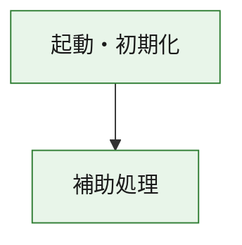
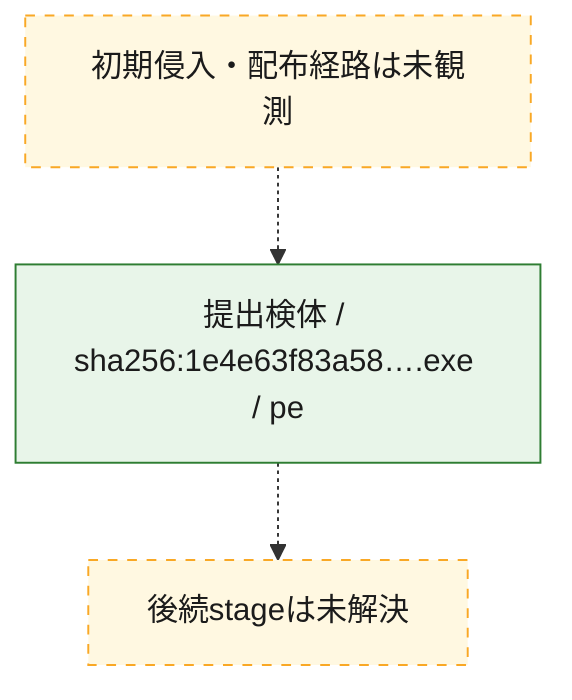
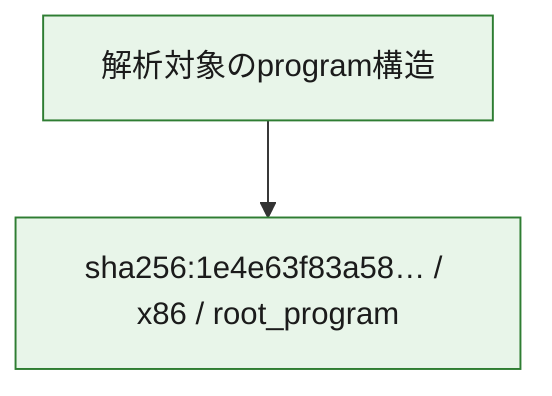

# 全体ロジック：1e4e63f83a5871c8c94d804572f7455a5472fe73f102208e8a3029582769aa81

代表関数の静的証跡から、起動・初期化の処理群を確認しました。

## 読み方

- phaseの掲載順は解析上の整理順です。observed_call_edgesがない段階間の実行順を断定しません。
- 図の実線は静的に観測した関係、点線と黄色のノードは未観測・未解決の関係を示します。
- 図は静的な要約であり、動的実行を再現するものではありません。
- 詳細な関数解説とfingerprintは[STATIC-LOGIC.md](STATIC-LOGIC.md)を参照してください。

## 静的可視化

### 実行フロー

### 感染チェーン

### モジュール関係

## 処理段階

### 1. 起動・初期化

entry pointから初期化と後続処理への移行を確認します。
確度: `confirmed_static_function_evidence`

- `1e4e63f83a5871c8c94d804572f7455a5472fe73f102208e8a3029582769aa81:ghidra:180001010` — 初期化と主要処理への分岐を行う入口関数です。 状態: `succeeded`、選定理由: `entry_point`, `meaningful_symbol_name`, `reviewed_call_centrality:22`, `role:entrypoint`, `small_program_complete_context`

### 2. 補助処理

主要処理を支える一般内部関数またはlibrary処理を確認します。
確度: `confirmed_static_function_evidence`

- `1e4e63f83a5871c8c94d804572f7455a5472fe73f102208e8a3029582769aa81:ghidra:180001240` — 検体内部の一般処理を実装する関数です。 状態: `succeeded`、選定理由: `context_representative`, `reviewed_call_centrality:2`, `small_program_complete_context`
- `1e4e63f83a5871c8c94d804572f7455a5472fe73f102208e8a3029582769aa81:ghidra:180001350` — 検体内部の一般処理を実装する関数です。 状態: `succeeded`、選定理由: `context_representative`, `reviewed_call_centrality:25`, `small_program_complete_context`
- `1e4e63f83a5871c8c94d804572f7455a5472fe73f102208e8a3029582769aa81:ghidra:180003780` — 検体内部の一般処理を実装する関数です。 状態: `succeeded`、選定理由: `context_representative`, `reviewed_call_centrality:2`, `small_program_complete_context`
- `1e4e63f83a5871c8c94d804572f7455a5472fe73f102208e8a3029582769aa81:ghidra:1800038e0` — 検体内部の一般処理を実装する関数です。 状態: `succeeded`、選定理由: `context_representative`, `reviewed_call_centrality:2`, `small_program_complete_context`

## 観測したcall関係

- `1e4e63f83a5871c8c94d804572f7455a5472fe73f102208e8a3029582769aa81:ghidra:180001010` → `1e4e63f83a5871c8c94d804572f7455a5472fe73f102208e8a3029582769aa81:ghidra:180001240` （`startup` → `support`）
- `1e4e63f83a5871c8c94d804572f7455a5472fe73f102208e8a3029582769aa81:ghidra:180001010` → `1e4e63f83a5871c8c94d804572f7455a5472fe73f102208e8a3029582769aa81:ghidra:180001350` （`startup` → `support`）
- `1e4e63f83a5871c8c94d804572f7455a5472fe73f102208e8a3029582769aa81:ghidra:180001350` → `1e4e63f83a5871c8c94d804572f7455a5472fe73f102208e8a3029582769aa81:ghidra:180001240` （`support` → `support`）
- `1e4e63f83a5871c8c94d804572f7455a5472fe73f102208e8a3029582769aa81:ghidra:180001350` → `1e4e63f83a5871c8c94d804572f7455a5472fe73f102208e8a3029582769aa81:ghidra:180003780` （`support` → `support`）
- `1e4e63f83a5871c8c94d804572f7455a5472fe73f102208e8a3029582769aa81:ghidra:180001350` → `1e4e63f83a5871c8c94d804572f7455a5472fe73f102208e8a3029582769aa81:ghidra:1800038e0` （`support` → `support`）
- `1e4e63f83a5871c8c94d804572f7455a5472fe73f102208e8a3029582769aa81:ghidra:180003780` → `1e4e63f83a5871c8c94d804572f7455a5472fe73f102208e8a3029582769aa81:ghidra:1800038e0` （`support` → `support`）
- `ghidra-function:60922f7e179adc9a67f596db` → `ghidra-external:06ca14c5bf8dc3c0f4743d03` （`unclassified` → `unclassified`）
- `ghidra-function:60922f7e179adc9a67f596db` → `ghidra-external:16d866fadb827ca9110e8d49` （`unclassified` → `unclassified`）
- `ghidra-function:60922f7e179adc9a67f596db` → `ghidra-external:39d530889ad2d26147d886bd` （`unclassified` → `unclassified`）
- `ghidra-function:60922f7e179adc9a67f596db` → `ghidra-external:3abbe27085c45166c22c3707` （`unclassified` → `unclassified`）
- `ghidra-function:60922f7e179adc9a67f596db` → `ghidra-external:4be47916b4c94319d3a6c044` （`unclassified` → `unclassified`）
- `ghidra-function:60922f7e179adc9a67f596db` → `ghidra-external:4cac4e4919bf90549c5a74c5` （`unclassified` → `unclassified`）
- `ghidra-function:60922f7e179adc9a67f596db` → `ghidra-external:5dbcc2b7074dff1cb9c188b4` （`unclassified` → `unclassified`）
- `ghidra-function:60922f7e179adc9a67f596db` → `ghidra-external:66a54c4482b1d7fc8ae08ed6` （`unclassified` → `unclassified`）
- `ghidra-function:60922f7e179adc9a67f596db` → `ghidra-external:703bf66cf3c0a260c7a7a8cd` （`unclassified` → `unclassified`）
- `ghidra-function:60922f7e179adc9a67f596db` → `ghidra-external:7d1f0652f8710b1d5d40f420` （`unclassified` → `unclassified`）
- `ghidra-function:60922f7e179adc9a67f596db` → `ghidra-external:84a7648e15c80eed0ea24ef8` （`unclassified` → `unclassified`）
- `ghidra-function:60922f7e179adc9a67f596db` → `ghidra-external:9619c37b58da27a06033d924` （`unclassified` → `unclassified`）
- `ghidra-function:60922f7e179adc9a67f596db` → `ghidra-external:a0c0c2ec2dcb9ea79022d4dd` （`unclassified` → `unclassified`）
- `ghidra-function:60922f7e179adc9a67f596db` → `ghidra-external:a4f10101d94df723aeafa488` （`unclassified` → `unclassified`）
- `ghidra-function:60922f7e179adc9a67f596db` → `ghidra-external:a68b876cc18e4a3c4fc763c5` （`unclassified` → `unclassified`）
- `ghidra-function:60922f7e179adc9a67f596db` → `ghidra-external:af55272a0100734a22540d07` （`unclassified` → `unclassified`）
- `ghidra-function:60922f7e179adc9a67f596db` → `ghidra-external:b2c904e157f951e43f700ce8` （`unclassified` → `unclassified`）
- `ghidra-function:60922f7e179adc9a67f596db` → `ghidra-external:b30299749690f742ff295961` （`unclassified` → `unclassified`）
- `ghidra-function:60922f7e179adc9a67f596db` → `ghidra-external:c26a200b32c28894a4dbc565` （`unclassified` → `unclassified`）
- `ghidra-function:60922f7e179adc9a67f596db` → `ghidra-external:e07af86a98a7e693d2815b01` （`unclassified` → `unclassified`）
- `ghidra-function:60922f7e179adc9a67f596db` → `ghidra-external:e7313073cb9def73f9c44829` （`unclassified` → `unclassified`）
- `ghidra-function:60922f7e179adc9a67f596db` → `ghidra-function:526d0a289d4268eaabf3fe76` （`unclassified` → `unclassified`）
- `ghidra-function:60922f7e179adc9a67f596db` → `ghidra-function:dbceefbfea72a2769ed5f38e` （`unclassified` → `unclassified`）
- `ghidra-function:60922f7e179adc9a67f596db` → `ghidra-function:edc18e54cd3e21a61b967658` （`unclassified` → `unclassified`）
- `ghidra-function:9d50ff3038c40430f23c5e82` → `ghidra-function:1a9990bb27dd3fd8e8974729` （`unclassified` → `unclassified`）
- `ghidra-function:9d50ff3038c40430f23c5e82` → `ghidra-function:35101e8dc38e899004a01080` （`unclassified` → `unclassified`）
- `ghidra-function:9d50ff3038c40430f23c5e82` → `ghidra-function:43d095a4011a7e5b96c8679e` （`unclassified` → `unclassified`）
- `ghidra-function:9d50ff3038c40430f23c5e82` → `ghidra-function:4920992cffb2bf483ddf6ea2` （`unclassified` → `unclassified`）
- `ghidra-function:9d50ff3038c40430f23c5e82` → `ghidra-function:526d0a289d4268eaabf3fe76` （`unclassified` → `unclassified`）
- `ghidra-function:9d50ff3038c40430f23c5e82` → `ghidra-function:60922f7e179adc9a67f596db` （`unclassified` → `unclassified`）
- `ghidra-function:9d50ff3038c40430f23c5e82` → `ghidra-function:7f93a55cf5a08bd27509327c` （`unclassified` → `unclassified`）
- `ghidra-function:9d50ff3038c40430f23c5e82` → `ghidra-function:b87e63e47f36d465b1e41081` （`unclassified` → `unclassified`）
- `ghidra-function:9d50ff3038c40430f23c5e82` → `ghidra-function:d250f3344472df36210bf523` （`unclassified` → `unclassified`）
- `ghidra-function:9d50ff3038c40430f23c5e82` → `ghidra-function:d551a6cbaa9197daa31ca39a` （`unclassified` → `unclassified`）
- `ghidra-function:9d50ff3038c40430f23c5e82` → `ghidra-function:d793e8b20043a5556392c75c` （`unclassified` → `unclassified`）
- `ghidra-function:9d50ff3038c40430f23c5e82` → `ghidra-function:de21740cf724dd0fdfe24a21` （`unclassified` → `unclassified`）
- `ghidra-function:dbceefbfea72a2769ed5f38e` → `ghidra-function:edc18e54cd3e21a61b967658` （`unclassified` → `unclassified`）

## 解析範囲と制約

- 選定外関数は全体inventoryへ残しますが、関数本体の個別解説対象にはしていません。
- indirect call、難読化、packer、VM、壊れたcontrol flowによりcall関係が欠落する場合があります。
- 文書は静的解析に基づき、検体実行や外部通信による動的確認は行っていません。
