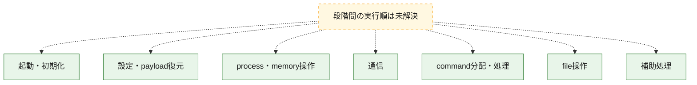
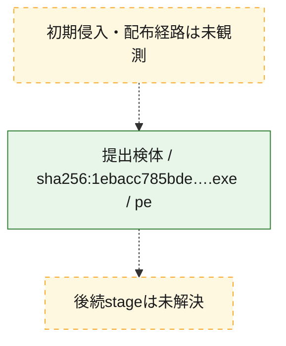
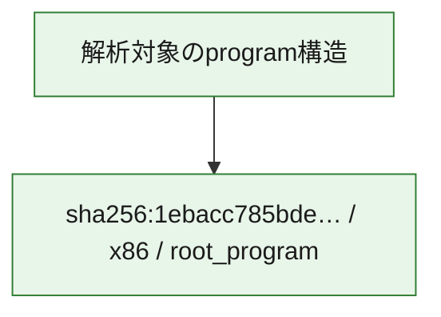

# 全体ロジック：1ebacc785bde14b8dbed50ed85d7dd64edbbb3c5ace23fc4a5008ad2d8529ba5

代表関数の静的証跡から、起動・初期化、設定・payload復元、process・memory操作、通信、command分配・処理、file操作の処理群を確認しました。

## 読み方

- phaseの掲載順は解析上の整理順です。observed_call_edgesがない段階間の実行順を断定しません。
- 図の実線は静的に観測した関係、点線と黄色のノードは未観測・未解決の関係を示します。
- 図は静的な要約であり、動的実行を再現するものではありません。
- 詳細な関数解説とfingerprintは[STATIC-LOGIC.md](STATIC-LOGIC.md)を参照してください。

## 静的可視化

### 実行フロー

### 感染チェーン

### モジュール関係

## 処理段階

### 1. 起動・初期化

entry pointから初期化と後続処理への移行を確認します。
確度: `confirmed_static_function_evidence`

- `1ebacc785bde14b8dbed50ed85d7dd64edbbb3c5ace23fc4a5008ad2d8529ba5:ghidra:14012daa0` — 初期化と主要処理への分岐を行う入口関数です。 状態: `succeeded`、選定理由: `entry_point`, `meaningful_symbol_name`, `probable_go_main_user_code`, `reviewed_call_centrality:5`, `role:entrypoint`
- `1ebacc785bde14b8dbed50ed85d7dd64edbbb3c5ace23fc4a5008ad2d8529ba5:ghidra:14012dc60` — 初期化と主要処理への分岐を行う入口関数です。 状態: `succeeded`、選定理由: `entry_point`, `meaningful_symbol_name`, `probable_go_main_user_code`, `reviewed_call_centrality:13`, `role:entrypoint`
- `1ebacc785bde14b8dbed50ed85d7dd64edbbb3c5ace23fc4a5008ad2d8529ba5:ghidra:1401309a0` — 初期化と主要処理への分岐を行う入口関数です。 状態: `succeeded`、選定理由: `entry_point`, `meaningful_symbol_name`, `probable_go_main_user_code`, `reviewed_call_centrality:13`, `role:entrypoint`
- `1ebacc785bde14b8dbed50ed85d7dd64edbbb3c5ace23fc4a5008ad2d8529ba5:ghidra:140134cc0` — 初期化と主要処理への分岐を行う入口関数です。 状態: `succeeded`、選定理由: `entry_point`, `meaningful_symbol_name`, `probable_go_main_user_code`, `reviewed_call_centrality:16`, `role:entrypoint`
- `1ebacc785bde14b8dbed50ed85d7dd64edbbb3c5ace23fc4a5008ad2d8529ba5:ghidra:14013cb00` — 初期化と主要処理への分岐を行う入口関数です。 状態: `succeeded`、選定理由: `entry_point`, `meaningful_symbol_name`, `probable_go_main_user_code`, `reviewed_call_centrality:59`, `role:entrypoint`
- `1ebacc785bde14b8dbed50ed85d7dd64edbbb3c5ace23fc4a5008ad2d8529ba5:ghidra:14015a220` — 初期化と主要処理への分岐を行う入口関数です。 状態: `succeeded`、選定理由: `entry_point`, `meaningful_symbol_name`, `probable_go_main_user_code`, `reviewed_call_centrality:13`, `role:entrypoint`
- `1ebacc785bde14b8dbed50ed85d7dd64edbbb3c5ace23fc4a5008ad2d8529ba5:ghidra:14015cec0` — 初期化と主要処理への分岐を行う入口関数です。 状態: `succeeded`、選定理由: `entry_point`, `meaningful_symbol_name`, `probable_go_main_user_code`, `reviewed_call_centrality:15`, `role:entrypoint`
- `1ebacc785bde14b8dbed50ed85d7dd64edbbb3c5ace23fc4a5008ad2d8529ba5:ghidra:14015eca0` — 初期化と主要処理への分岐を行う入口関数です。 状態: `succeeded`、選定理由: `entry_point`, `meaningful_symbol_name`, `probable_go_main_user_code`, `reviewed_call_centrality:16`, `role:entrypoint`
- `1ebacc785bde14b8dbed50ed85d7dd64edbbb3c5ace23fc4a5008ad2d8529ba5:ghidra:140161240` — 初期化と主要処理への分岐を行う入口関数です。 状態: `succeeded`、選定理由: `entry_point`, `meaningful_symbol_name`, `probable_go_main_user_code`, `reviewed_call_centrality:13`, `role:entrypoint`
- `1ebacc785bde14b8dbed50ed85d7dd64edbbb3c5ace23fc4a5008ad2d8529ba5:ghidra:140163740` — 初期化と主要処理への分岐を行う入口関数です。 状態: `succeeded`、選定理由: `entry_point`, `meaningful_symbol_name`, `probable_go_main_user_code`, `reviewed_call_centrality:13`, `role:entrypoint`
- `1ebacc785bde14b8dbed50ed85d7dd64edbbb3c5ace23fc4a5008ad2d8529ba5:ghidra:140164d80` — 初期化と主要処理への分岐を行う入口関数です。 状態: `succeeded`、選定理由: `entry_point`, `meaningful_symbol_name`, `probable_go_main_user_code`, `reviewed_call_centrality:15`, `role:entrypoint`
- `1ebacc785bde14b8dbed50ed85d7dd64edbbb3c5ace23fc4a5008ad2d8529ba5:ghidra:1401688c0` — 初期化と主要処理への分岐を行う入口関数です。 状態: `succeeded`、選定理由: `entry_point`, `meaningful_symbol_name`, `probable_go_main_user_code`, `reviewed_call_centrality:20`, `role:entrypoint`
- `1ebacc785bde14b8dbed50ed85d7dd64edbbb3c5ace23fc4a5008ad2d8529ba5:ghidra:14016ae80` — 初期化と主要処理への分岐を行う入口関数です。 状態: `succeeded`、選定理由: `entry_point`, `meaningful_symbol_name`, `probable_go_main_user_code`, `reviewed_call_centrality:15`, `role:entrypoint`
- `1ebacc785bde14b8dbed50ed85d7dd64edbbb3c5ace23fc4a5008ad2d8529ba5:ghidra:14016dae0` — 初期化と主要処理への分岐を行う入口関数です。 状態: `succeeded`、選定理由: `entry_point`, `meaningful_symbol_name`, `probable_go_main_user_code`, `reviewed_call_centrality:15`, `role:entrypoint`
- `1ebacc785bde14b8dbed50ed85d7dd64edbbb3c5ace23fc4a5008ad2d8529ba5:ghidra:140170720` — 初期化と主要処理への分岐を行う入口関数です。 状態: `succeeded`、選定理由: `entry_point`, `meaningful_symbol_name`, `probable_go_main_user_code`, `reviewed_call_centrality:17`, `role:entrypoint`
- `1ebacc785bde14b8dbed50ed85d7dd64edbbb3c5ace23fc4a5008ad2d8529ba5:ghidra:14017b180` — 初期化と主要処理への分岐を行う入口関数です。 状態: `succeeded`、選定理由: `entry_point`, `meaningful_symbol_name`, `probable_go_main_user_code`, `reviewed_call_centrality:15`, `role:entrypoint`
- `1ebacc785bde14b8dbed50ed85d7dd64edbbb3c5ace23fc4a5008ad2d8529ba5:ghidra:1401809e0` — 初期化と主要処理への分岐を行う入口関数です。 状態: `succeeded`、選定理由: `entry_point`, `meaningful_symbol_name`, `probable_go_main_user_code`, `reviewed_call_centrality:13`, `role:entrypoint`
- `1ebacc785bde14b8dbed50ed85d7dd64edbbb3c5ace23fc4a5008ad2d8529ba5:ghidra:1401845a0` — 初期化と主要処理への分岐を行う入口関数です。 状態: `succeeded`、選定理由: `entry_point`, `meaningful_symbol_name`, `probable_go_main_user_code`, `reviewed_call_centrality:14`, `role:entrypoint`
- `1ebacc785bde14b8dbed50ed85d7dd64edbbb3c5ace23fc4a5008ad2d8529ba5:ghidra:140188220` — 初期化と主要処理への分岐を行う入口関数です。 状態: `succeeded`、選定理由: `entry_point`, `meaningful_symbol_name`, `probable_go_main_user_code`, `reviewed_call_centrality:17`, `role:entrypoint`
- `1ebacc785bde14b8dbed50ed85d7dd64edbbb3c5ace23fc4a5008ad2d8529ba5:ghidra:14018c520` — 初期化と主要処理への分岐を行う入口関数です。 状態: `succeeded`、選定理由: `entry_point`, `meaningful_symbol_name`, `probable_go_main_user_code`, `reviewed_call_centrality:14`, `role:entrypoint`
- `1ebacc785bde14b8dbed50ed85d7dd64edbbb3c5ace23fc4a5008ad2d8529ba5:ghidra:140193420` — 初期化と主要処理への分岐を行う入口関数です。 状態: `succeeded`、選定理由: `entry_point`, `meaningful_symbol_name`, `probable_go_main_user_code`, `reviewed_call_centrality:14`, `role:entrypoint`
- `1ebacc785bde14b8dbed50ed85d7dd64edbbb3c5ace23fc4a5008ad2d8529ba5:ghidra:140196ee0` — 初期化と主要処理への分岐を行う入口関数です。 状態: `succeeded`、選定理由: `entry_point`, `meaningful_symbol_name`, `probable_go_main_user_code`, `reviewed_call_centrality:13`, `role:entrypoint`
- `1ebacc785bde14b8dbed50ed85d7dd64edbbb3c5ace23fc4a5008ad2d8529ba5:ghidra:14019a980` — 初期化と主要処理への分岐を行う入口関数です。 状態: `succeeded`、選定理由: `entry_point`, `meaningful_symbol_name`, `probable_go_main_user_code`, `reviewed_call_centrality:17`, `role:entrypoint`
- `1ebacc785bde14b8dbed50ed85d7dd64edbbb3c5ace23fc4a5008ad2d8529ba5:ghidra:1401acae0` — 初期化と主要処理への分岐を行う入口関数です。 状態: `succeeded`、選定理由: `entry_point`, `meaningful_symbol_name`, `probable_go_main_user_code`, `reviewed_call_centrality:14`, `role:entrypoint`

### 2. 設定・payload復元

設定、resource、payload、暗号化データの復元・変換を確認します。
確度: `confirmed_static_function_evidence`

- `1ebacc785bde14b8dbed50ed85d7dd64edbbb3c5ace23fc4a5008ad2d8529ba5:ghidra:14008ba20` — 設定、resource、payloadなどの解析・変換を行う関数です。 状態: `succeeded`、選定理由: `meaningful_symbol_name`, `reviewed_call_centrality:4`, `role:config_or_data_transform`
- `1ebacc785bde14b8dbed50ed85d7dd64edbbb3c5ace23fc4a5008ad2d8529ba5:ghidra:1400b6660` — 暗号、hash、encoding、または復号処理に関係する関数です。 状態: `succeeded`、選定理由: `meaningful_symbol_name`, `reviewed_call_centrality:4`, `role:cryptographic_transform`

### 3. process・memory操作

process、thread、module、memory操作と実行移行を確認します。
確度: `confirmed_static_function_evidence`

- `1ebacc785bde14b8dbed50ed85d7dd64edbbb3c5ace23fc4a5008ad2d8529ba5:ghidra:14009cb00` — process、thread、module、またはmemory操作に関係する関数です。 状態: `succeeded`、選定理由: `meaningful_symbol_name`, `reviewed_call_centrality:6`, `role:process_or_memory_operation`

### 4. 通信

通信初期化、endpoint処理、送受信の役割を確認します。
確度: `confirmed_static_function_evidence`

- `1ebacc785bde14b8dbed50ed85d7dd64edbbb3c5ace23fc4a5008ad2d8529ba5:ghidra:14009d840` — 通信初期化、送受信、またはendpoint処理に関係する関数です。 状態: `succeeded`、選定理由: `meaningful_symbol_name`, `reviewed_call_centrality:6`, `role:network_communication`

### 5. command分配・処理

受信commandやtaskの解釈、分配、個別handlerへの移行を確認します。
確度: `confirmed_static_function_evidence`

- `1ebacc785bde14b8dbed50ed85d7dd64edbbb3c5ace23fc4a5008ad2d8529ba5:ghidra:14009c560` — commandの解釈、分配、または個別処理を担当する関数です。 状態: `succeeded`、選定理由: `meaningful_symbol_name`, `reviewed_call_centrality:5`, `role:command_dispatch_or_handler`

### 6. file操作

fileやdirectoryの作成、読書き、削除を確認します。
確度: `confirmed_static_function_evidence`

- `1ebacc785bde14b8dbed50ed85d7dd64edbbb3c5ace23fc4a5008ad2d8529ba5:ghidra:14009cdc0` — fileまたはdirectoryの読書き・管理に関係する関数です。 状態: `succeeded`、選定理由: `meaningful_symbol_name`, `reviewed_call_centrality:6`, `role:file_operation`

### 7. 補助処理

主要処理を支える一般内部関数またはlibrary処理を確認します。
確度: `confirmed_static_function_evidence`

- `1ebacc785bde14b8dbed50ed85d7dd64edbbb3c5ace23fc4a5008ad2d8529ba5:ghidra:140001080` — compiler生成処理または汎用library処理とみられる関数です。 状態: `succeeded`、選定理由: `meaningful_symbol_name`, `reviewed_call_centrality:5`
- `1ebacc785bde14b8dbed50ed85d7dd64edbbb3c5ace23fc4a5008ad2d8529ba5:ghidra:140073fa0` — 検体内部の一般処理を実装する関数です。 状態: `succeeded`、選定理由: `meaningful_symbol_name`, `reviewed_call_centrality:3`

## 観測したcall関係

- `ghidra-function:044684a1e7ebbfaa267dd69e` → `ghidra-external:20a62d44c690a45ce3b0556d` （`unclassified` → `unclassified`）
- `ghidra-function:044684a1e7ebbfaa267dd69e` → `ghidra-external:212c17690a76237104157b55` （`unclassified` → `unclassified`）
- `ghidra-function:044684a1e7ebbfaa267dd69e` → `ghidra-external:2574bebed2477820fc0a53d2` （`unclassified` → `unclassified`）
- `ghidra-function:044684a1e7ebbfaa267dd69e` → `ghidra-external:43976505f7293970c617bd2f` （`unclassified` → `unclassified`）
- `ghidra-function:044684a1e7ebbfaa267dd69e` → `ghidra-external:594103d17b3928800e871eec` （`unclassified` → `unclassified`）
- `ghidra-function:044684a1e7ebbfaa267dd69e` → `ghidra-external:5a342b445f9f50cf021af29e` （`unclassified` → `unclassified`）
- `ghidra-function:044684a1e7ebbfaa267dd69e` → `ghidra-external:5eeeba663a6b2b4d65a31d6a` （`unclassified` → `unclassified`）
- `ghidra-function:044684a1e7ebbfaa267dd69e` → `ghidra-external:62cd9b511c76a38a4c320df6` （`unclassified` → `unclassified`）
- `ghidra-function:044684a1e7ebbfaa267dd69e` → `ghidra-external:858a9c5880cc752907c94a0c` （`unclassified` → `unclassified`）
- `ghidra-function:044684a1e7ebbfaa267dd69e` → `ghidra-external:86e2fd2707a2654ed25e9d05` （`unclassified` → `unclassified`）
- `ghidra-function:044684a1e7ebbfaa267dd69e` → `ghidra-external:8e5c5b7baf9de6294842a2f5` （`unclassified` → `unclassified`）
- `ghidra-function:044684a1e7ebbfaa267dd69e` → `ghidra-external:b82aef7847145cb89e6ba10a` （`unclassified` → `unclassified`）
- `ghidra-function:044684a1e7ebbfaa267dd69e` → `ghidra-external:bb5fcd98626dd52e03bee8b8` （`unclassified` → `unclassified`）
- `ghidra-function:044684a1e7ebbfaa267dd69e` → `ghidra-external:cdf76c84d350619ca1ccb633` （`unclassified` → `unclassified`）
- `ghidra-function:044684a1e7ebbfaa267dd69e` → `ghidra-external:f22420e95e467eb7873cd3c8` （`unclassified` → `unclassified`）
- `ghidra-function:095c72284c39be8ea2d6a7aa` → `ghidra-external:3d4e3ee5d988c5774c0614a0` （`unclassified` → `unclassified`）
- `ghidra-function:095c72284c39be8ea2d6a7aa` → `ghidra-external:55ad617eb1046bdd5c1ae73c` （`unclassified` → `unclassified`）
- `ghidra-function:095c72284c39be8ea2d6a7aa` → `ghidra-external:d9f8b23997d11a64dd74d1fd` （`unclassified` → `unclassified`）
- `ghidra-function:100f09f53b665239a72f6b3e` → `ghidra-external:07cd644c2b76e383c3496d50` （`unclassified` → `unclassified`）
- `ghidra-function:100f09f53b665239a72f6b3e` → `ghidra-external:20a62d44c690a45ce3b0556d` （`unclassified` → `unclassified`）
- `ghidra-function:100f09f53b665239a72f6b3e` → `ghidra-external:212c17690a76237104157b55` （`unclassified` → `unclassified`）
- `ghidra-function:100f09f53b665239a72f6b3e` → `ghidra-external:2574bebed2477820fc0a53d2` （`unclassified` → `unclassified`）
- `ghidra-function:100f09f53b665239a72f6b3e` → `ghidra-external:41abec4b0448339ef73dbf90` （`unclassified` → `unclassified`）
- `ghidra-function:100f09f53b665239a72f6b3e` → `ghidra-external:43976505f7293970c617bd2f` （`unclassified` → `unclassified`）
- `ghidra-function:100f09f53b665239a72f6b3e` → `ghidra-external:594103d17b3928800e871eec` （`unclassified` → `unclassified`）
- `ghidra-function:100f09f53b665239a72f6b3e` → `ghidra-external:5eeeba663a6b2b4d65a31d6a` （`unclassified` → `unclassified`）
- `ghidra-function:100f09f53b665239a72f6b3e` → `ghidra-external:62cd9b511c76a38a4c320df6` （`unclassified` → `unclassified`）
- `ghidra-function:100f09f53b665239a72f6b3e` → `ghidra-external:86e2fd2707a2654ed25e9d05` （`unclassified` → `unclassified`）
- `ghidra-function:100f09f53b665239a72f6b3e` → `ghidra-external:8e5c5b7baf9de6294842a2f5` （`unclassified` → `unclassified`）
- `ghidra-function:100f09f53b665239a72f6b3e` → `ghidra-external:b82aef7847145cb89e6ba10a` （`unclassified` → `unclassified`）
- `ghidra-function:100f09f53b665239a72f6b3e` → `ghidra-external:bb5fcd98626dd52e03bee8b8` （`unclassified` → `unclassified`）
- `ghidra-function:100f09f53b665239a72f6b3e` → `ghidra-external:cdf76c84d350619ca1ccb633` （`unclassified` → `unclassified`）
- `ghidra-function:100f09f53b665239a72f6b3e` → `ghidra-external:e3706dafd05f812b3d0d725a` （`unclassified` → `unclassified`）
- `ghidra-function:100f09f53b665239a72f6b3e` → `ghidra-external:e4dbc2eea141c385889e4eaa` （`unclassified` → `unclassified`）
- `ghidra-function:1d3354bcb3106f26b5e2c5d4` → `ghidra-external:20a62d44c690a45ce3b0556d` （`unclassified` → `unclassified`）
- `ghidra-function:1d3354bcb3106f26b5e2c5d4` → `ghidra-external:212c17690a76237104157b55` （`unclassified` → `unclassified`）
- `ghidra-function:1d3354bcb3106f26b5e2c5d4` → `ghidra-external:2574bebed2477820fc0a53d2` （`unclassified` → `unclassified`）
- `ghidra-function:1d3354bcb3106f26b5e2c5d4` → `ghidra-external:2ac236789d14543453effcb7` （`unclassified` → `unclassified`）
- `ghidra-function:1d3354bcb3106f26b5e2c5d4` → `ghidra-external:3d45e37812cbc1785b51ce7a` （`unclassified` → `unclassified`）
- `ghidra-function:1d3354bcb3106f26b5e2c5d4` → `ghidra-external:43976505f7293970c617bd2f` （`unclassified` → `unclassified`）
- `ghidra-function:1d3354bcb3106f26b5e2c5d4` → `ghidra-external:594103d17b3928800e871eec` （`unclassified` → `unclassified`）
- `ghidra-function:1d3354bcb3106f26b5e2c5d4` → `ghidra-external:5eeeba663a6b2b4d65a31d6a` （`unclassified` → `unclassified`）
- `ghidra-function:1d3354bcb3106f26b5e2c5d4` → `ghidra-external:62cd9b511c76a38a4c320df6` （`unclassified` → `unclassified`）
- `ghidra-function:1d3354bcb3106f26b5e2c5d4` → `ghidra-external:86e2fd2707a2654ed25e9d05` （`unclassified` → `unclassified`）
- `ghidra-function:1d3354bcb3106f26b5e2c5d4` → `ghidra-external:8e5c5b7baf9de6294842a2f5` （`unclassified` → `unclassified`）
- `ghidra-function:1d3354bcb3106f26b5e2c5d4` → `ghidra-external:b82aef7847145cb89e6ba10a` （`unclassified` → `unclassified`）
- `ghidra-function:1d3354bcb3106f26b5e2c5d4` → `ghidra-external:b8858f647a1e5ae353d99813` （`unclassified` → `unclassified`）
- `ghidra-function:1d3354bcb3106f26b5e2c5d4` → `ghidra-external:bb5fcd98626dd52e03bee8b8` （`unclassified` → `unclassified`）
- `ghidra-function:1d3354bcb3106f26b5e2c5d4` → `ghidra-external:c675f1b9bb24bce7524a75e2` （`unclassified` → `unclassified`）
- `ghidra-function:1d3354bcb3106f26b5e2c5d4` → `ghidra-external:cdf76c84d350619ca1ccb633` （`unclassified` → `unclassified`）
- `ghidra-function:1d3354bcb3106f26b5e2c5d4` → `ghidra-external:d3de3070a0ec7e952f679b4b` （`unclassified` → `unclassified`）
- `ghidra-function:1ef90fc8660ebadc2ddc87e0` → `ghidra-external:20a62d44c690a45ce3b0556d` （`unclassified` → `unclassified`）
- `ghidra-function:1ef90fc8660ebadc2ddc87e0` → `ghidra-external:212c17690a76237104157b55` （`unclassified` → `unclassified`）
- `ghidra-function:1ef90fc8660ebadc2ddc87e0` → `ghidra-external:2574bebed2477820fc0a53d2` （`unclassified` → `unclassified`）
- `ghidra-function:1ef90fc8660ebadc2ddc87e0` → `ghidra-external:43976505f7293970c617bd2f` （`unclassified` → `unclassified`）
- `ghidra-function:1ef90fc8660ebadc2ddc87e0` → `ghidra-external:594103d17b3928800e871eec` （`unclassified` → `unclassified`）
- `ghidra-function:1ef90fc8660ebadc2ddc87e0` → `ghidra-external:5eeeba663a6b2b4d65a31d6a` （`unclassified` → `unclassified`）
- `ghidra-function:1ef90fc8660ebadc2ddc87e0` → `ghidra-external:62cd9b511c76a38a4c320df6` （`unclassified` → `unclassified`）
- `ghidra-function:1ef90fc8660ebadc2ddc87e0` → `ghidra-external:772625965f74d1b5e5909dd8` （`unclassified` → `unclassified`）
- `ghidra-function:1ef90fc8660ebadc2ddc87e0` → `ghidra-external:86e2fd2707a2654ed25e9d05` （`unclassified` → `unclassified`）
- `ghidra-function:1ef90fc8660ebadc2ddc87e0` → `ghidra-external:8e5c5b7baf9de6294842a2f5` （`unclassified` → `unclassified`）
- `ghidra-function:1ef90fc8660ebadc2ddc87e0` → `ghidra-external:b82aef7847145cb89e6ba10a` （`unclassified` → `unclassified`）
- `ghidra-function:1ef90fc8660ebadc2ddc87e0` → `ghidra-external:bb5fcd98626dd52e03bee8b8` （`unclassified` → `unclassified`）
- `ghidra-function:1ef90fc8660ebadc2ddc87e0` → `ghidra-external:cdf76c84d350619ca1ccb633` （`unclassified` → `unclassified`）
- `ghidra-function:25360e43f653788909204de2` → `ghidra-external:20a62d44c690a45ce3b0556d` （`unclassified` → `unclassified`）
- `ghidra-function:25360e43f653788909204de2` → `ghidra-external:212c17690a76237104157b55` （`unclassified` → `unclassified`）
- `ghidra-function:25360e43f653788909204de2` → `ghidra-external:2574bebed2477820fc0a53d2` （`unclassified` → `unclassified`）
- `ghidra-function:25360e43f653788909204de2` → `ghidra-external:43976505f7293970c617bd2f` （`unclassified` → `unclassified`）
- `ghidra-function:25360e43f653788909204de2` → `ghidra-external:58850d27198aae0957ea300d` （`unclassified` → `unclassified`）
- `ghidra-function:25360e43f653788909204de2` → `ghidra-external:594103d17b3928800e871eec` （`unclassified` → `unclassified`）
- `ghidra-function:25360e43f653788909204de2` → `ghidra-external:5eeeba663a6b2b4d65a31d6a` （`unclassified` → `unclassified`）
- `ghidra-function:25360e43f653788909204de2` → `ghidra-external:62cd9b511c76a38a4c320df6` （`unclassified` → `unclassified`）
- `ghidra-function:25360e43f653788909204de2` → `ghidra-external:6ad45f40d9c8e9fa16c0d639` （`unclassified` → `unclassified`）
- `ghidra-function:25360e43f653788909204de2` → `ghidra-external:86e2fd2707a2654ed25e9d05` （`unclassified` → `unclassified`）
- `ghidra-function:25360e43f653788909204de2` → `ghidra-external:8e5c5b7baf9de6294842a2f5` （`unclassified` → `unclassified`）
- `ghidra-function:25360e43f653788909204de2` → `ghidra-external:b82aef7847145cb89e6ba10a` （`unclassified` → `unclassified`）
- `ghidra-function:25360e43f653788909204de2` → `ghidra-external:bb5fcd98626dd52e03bee8b8` （`unclassified` → `unclassified`）
- `ghidra-function:25360e43f653788909204de2` → `ghidra-external:cdf76c84d350619ca1ccb633` （`unclassified` → `unclassified`）
- `ghidra-function:25360e43f653788909204de2` → `ghidra-external:e4dbc2eea141c385889e4eaa` （`unclassified` → `unclassified`）
- `ghidra-function:323a421e76df48171b9db2bc` → `ghidra-external:8e5c5b7baf9de6294842a2f5` （`unclassified` → `unclassified`）
- `ghidra-function:323a421e76df48171b9db2bc` → `ghidra-external:a28ccd7dbaaef03cc761a2c1` （`unclassified` → `unclassified`）
- `ghidra-function:323a421e76df48171b9db2bc` → `ghidra-external:ae90d78379f275a3b93019dc` （`unclassified` → `unclassified`）
- `ghidra-function:323a421e76df48171b9db2bc` → `ghidra-external:d3782597076c8ecbbe54996d` （`unclassified` → `unclassified`）
- `ghidra-function:39e620573992abc652be67eb` → `ghidra-external:20a62d44c690a45ce3b0556d` （`unclassified` → `unclassified`）
- `ghidra-function:39e620573992abc652be67eb` → `ghidra-external:212c17690a76237104157b55` （`unclassified` → `unclassified`）
- `ghidra-function:39e620573992abc652be67eb` → `ghidra-external:2574bebed2477820fc0a53d2` （`unclassified` → `unclassified`）
- `ghidra-function:39e620573992abc652be67eb` → `ghidra-external:3d45e37812cbc1785b51ce7a` （`unclassified` → `unclassified`）
- `ghidra-function:39e620573992abc652be67eb` → `ghidra-external:43976505f7293970c617bd2f` （`unclassified` → `unclassified`）
- `ghidra-function:39e620573992abc652be67eb` → `ghidra-external:594103d17b3928800e871eec` （`unclassified` → `unclassified`）
- `ghidra-function:39e620573992abc652be67eb` → `ghidra-external:5eeeba663a6b2b4d65a31d6a` （`unclassified` → `unclassified`）
- `ghidra-function:39e620573992abc652be67eb` → `ghidra-external:62cd9b511c76a38a4c320df6` （`unclassified` → `unclassified`）
- `ghidra-function:39e620573992abc652be67eb` → `ghidra-external:705df8761e95ce31d63c6158` （`unclassified` → `unclassified`）
- `ghidra-function:39e620573992abc652be67eb` → `ghidra-external:86e2fd2707a2654ed25e9d05` （`unclassified` → `unclassified`）
- `ghidra-function:39e620573992abc652be67eb` → `ghidra-external:8e5c5b7baf9de6294842a2f5` （`unclassified` → `unclassified`）
- `ghidra-function:39e620573992abc652be67eb` → `ghidra-external:ae90d78379f275a3b93019dc` （`unclassified` → `unclassified`）
- `ghidra-function:39e620573992abc652be67eb` → `ghidra-external:b82aef7847145cb89e6ba10a` （`unclassified` → `unclassified`）
- `ghidra-function:39e620573992abc652be67eb` → `ghidra-external:bb5fcd98626dd52e03bee8b8` （`unclassified` → `unclassified`）
- `ghidra-function:39e620573992abc652be67eb` → `ghidra-external:cdf76c84d350619ca1ccb633` （`unclassified` → `unclassified`）
- `ghidra-function:3ef0b0e30f6bcc4d5308fa54` → `ghidra-external:20a62d44c690a45ce3b0556d` （`unclassified` → `unclassified`）
- `ghidra-function:3ef0b0e30f6bcc4d5308fa54` → `ghidra-external:212c17690a76237104157b55` （`unclassified` → `unclassified`）
- `ghidra-function:3ef0b0e30f6bcc4d5308fa54` → `ghidra-external:2574bebed2477820fc0a53d2` （`unclassified` → `unclassified`）
- `ghidra-function:3ef0b0e30f6bcc4d5308fa54` → `ghidra-external:43976505f7293970c617bd2f` （`unclassified` → `unclassified`）
- `ghidra-function:3ef0b0e30f6bcc4d5308fa54` → `ghidra-external:594103d17b3928800e871eec` （`unclassified` → `unclassified`）
- `ghidra-function:3ef0b0e30f6bcc4d5308fa54` → `ghidra-external:5eeeba663a6b2b4d65a31d6a` （`unclassified` → `unclassified`）
- `ghidra-function:3ef0b0e30f6bcc4d5308fa54` → `ghidra-external:62cd9b511c76a38a4c320df6` （`unclassified` → `unclassified`）
- `ghidra-function:3ef0b0e30f6bcc4d5308fa54` → `ghidra-external:86e2fd2707a2654ed25e9d05` （`unclassified` → `unclassified`）
- `ghidra-function:3ef0b0e30f6bcc4d5308fa54` → `ghidra-external:8e5c5b7baf9de6294842a2f5` （`unclassified` → `unclassified`）
- `ghidra-function:3ef0b0e30f6bcc4d5308fa54` → `ghidra-external:b82aef7847145cb89e6ba10a` （`unclassified` → `unclassified`）
- `ghidra-function:3ef0b0e30f6bcc4d5308fa54` → `ghidra-external:bb5fcd98626dd52e03bee8b8` （`unclassified` → `unclassified`）
- `ghidra-function:3ef0b0e30f6bcc4d5308fa54` → `ghidra-external:cd638f2a18f89ecd9c2597f6` （`unclassified` → `unclassified`）
- `ghidra-function:3ef0b0e30f6bcc4d5308fa54` → `ghidra-external:cdf76c84d350619ca1ccb633` （`unclassified` → `unclassified`）
- `ghidra-function:4d168e2e139f03804a838968` → `ghidra-external:2f6616706cdd3f3ab2b69f89` （`unclassified` → `unclassified`）
- `ghidra-function:4d168e2e139f03804a838968` → `ghidra-external:594103d17b3928800e871eec` （`unclassified` → `unclassified`）
- `ghidra-function:4d168e2e139f03804a838968` → `ghidra-external:78445d8e647aeaa544c72893` （`unclassified` → `unclassified`）
- `ghidra-function:4d168e2e139f03804a838968` → `ghidra-external:7ec6696ea86bfd61ff55d05e` （`unclassified` → `unclassified`）
- `ghidra-function:4d168e2e139f03804a838968` → `ghidra-external:a664fc39bcd26494ed1ab407` （`unclassified` → `unclassified`）
- `ghidra-function:5d9a103571cf9cce70d6f764` → `ghidra-external:20a62d44c690a45ce3b0556d` （`unclassified` → `unclassified`）
- `ghidra-function:5d9a103571cf9cce70d6f764` → `ghidra-external:212c17690a76237104157b55` （`unclassified` → `unclassified`）
- `ghidra-function:5d9a103571cf9cce70d6f764` → `ghidra-external:2574bebed2477820fc0a53d2` （`unclassified` → `unclassified`）
- `ghidra-function:5d9a103571cf9cce70d6f764` → `ghidra-external:43976505f7293970c617bd2f` （`unclassified` → `unclassified`）
- `ghidra-function:5d9a103571cf9cce70d6f764` → `ghidra-external:594103d17b3928800e871eec` （`unclassified` → `unclassified`）
- `ghidra-function:5d9a103571cf9cce70d6f764` → `ghidra-external:5eeeba663a6b2b4d65a31d6a` （`unclassified` → `unclassified`）
- `ghidra-function:5d9a103571cf9cce70d6f764` → `ghidra-external:62cd9b511c76a38a4c320df6` （`unclassified` → `unclassified`）
- `ghidra-function:5d9a103571cf9cce70d6f764` → `ghidra-external:86e2fd2707a2654ed25e9d05` （`unclassified` → `unclassified`）
- `ghidra-function:5d9a103571cf9cce70d6f764` → `ghidra-external:8e5c5b7baf9de6294842a2f5` （`unclassified` → `unclassified`）
- `ghidra-function:5d9a103571cf9cce70d6f764` → `ghidra-external:b82aef7847145cb89e6ba10a` （`unclassified` → `unclassified`）
- `ghidra-function:5d9a103571cf9cce70d6f764` → `ghidra-external:bb5fcd98626dd52e03bee8b8` （`unclassified` → `unclassified`）
- `ghidra-function:5d9a103571cf9cce70d6f764` → `ghidra-external:cdf76c84d350619ca1ccb633` （`unclassified` → `unclassified`）
- `ghidra-function:5d9a103571cf9cce70d6f764` → `ghidra-external:d3de3070a0ec7e952f679b4b` （`unclassified` → `unclassified`）
- `ghidra-function:6360a776a7c61c53a4427e62` → `ghidra-external:20a62d44c690a45ce3b0556d` （`unclassified` → `unclassified`）
- `ghidra-function:6360a776a7c61c53a4427e62` → `ghidra-external:212c17690a76237104157b55` （`unclassified` → `unclassified`）
- `ghidra-function:6360a776a7c61c53a4427e62` → `ghidra-external:2574bebed2477820fc0a53d2` （`unclassified` → `unclassified`）
- `ghidra-function:6360a776a7c61c53a4427e62` → `ghidra-external:43976505f7293970c617bd2f` （`unclassified` → `unclassified`）
- `ghidra-function:6360a776a7c61c53a4427e62` → `ghidra-external:594103d17b3928800e871eec` （`unclassified` → `unclassified`）
- `ghidra-function:6360a776a7c61c53a4427e62` → `ghidra-external:5eeeba663a6b2b4d65a31d6a` （`unclassified` → `unclassified`）
- `ghidra-function:6360a776a7c61c53a4427e62` → `ghidra-external:62cd9b511c76a38a4c320df6` （`unclassified` → `unclassified`）
- `ghidra-function:6360a776a7c61c53a4427e62` → `ghidra-external:86e2fd2707a2654ed25e9d05` （`unclassified` → `unclassified`）
- `ghidra-function:6360a776a7c61c53a4427e62` → `ghidra-external:8e5c5b7baf9de6294842a2f5` （`unclassified` → `unclassified`）
- `ghidra-function:6360a776a7c61c53a4427e62` → `ghidra-external:a607678b0e2e9b971f0160f5` （`unclassified` → `unclassified`）
- `ghidra-function:6360a776a7c61c53a4427e62` → `ghidra-external:b82aef7847145cb89e6ba10a` （`unclassified` → `unclassified`）
- `ghidra-function:6360a776a7c61c53a4427e62` → `ghidra-external:bb5fcd98626dd52e03bee8b8` （`unclassified` → `unclassified`）
- `ghidra-function:6360a776a7c61c53a4427e62` → `ghidra-external:cdf76c84d350619ca1ccb633` （`unclassified` → `unclassified`）
- `ghidra-function:6360a776a7c61c53a4427e62` → `ghidra-external:d6dc6c9032994919d38133a1` （`unclassified` → `unclassified`）
- `ghidra-function:6360a776a7c61c53a4427e62` → `ghidra-external:e3706dafd05f812b3d0d725a` （`unclassified` → `unclassified`）
- `ghidra-function:6360a776a7c61c53a4427e62` → `ghidra-external:e3a15d42fca56410ce9f4b38` （`unclassified` → `unclassified`）
- `ghidra-function:6360a776a7c61c53a4427e62` → `ghidra-external:f22420e95e467eb7873cd3c8` （`unclassified` → `unclassified`）
- `ghidra-function:6857fdf3b737a15efba99d20` → `ghidra-external:20a62d44c690a45ce3b0556d` （`unclassified` → `unclassified`）
- `ghidra-function:6857fdf3b737a15efba99d20` → `ghidra-external:212c17690a76237104157b55` （`unclassified` → `unclassified`）
- `ghidra-function:6857fdf3b737a15efba99d20` → `ghidra-external:2574bebed2477820fc0a53d2` （`unclassified` → `unclassified`）
- `ghidra-function:6857fdf3b737a15efba99d20` → `ghidra-external:2b364b80fd5426e30307fec4` （`unclassified` → `unclassified`）
- `ghidra-function:6857fdf3b737a15efba99d20` → `ghidra-external:43976505f7293970c617bd2f` （`unclassified` → `unclassified`）
- `ghidra-function:6857fdf3b737a15efba99d20` → `ghidra-external:594103d17b3928800e871eec` （`unclassified` → `unclassified`）
- `ghidra-function:6857fdf3b737a15efba99d20` → `ghidra-external:5eeeba663a6b2b4d65a31d6a` （`unclassified` → `unclassified`）
- `ghidra-function:6857fdf3b737a15efba99d20` → `ghidra-external:62cd9b511c76a38a4c320df6` （`unclassified` → `unclassified`）
- `ghidra-function:6857fdf3b737a15efba99d20` → `ghidra-external:86e2fd2707a2654ed25e9d05` （`unclassified` → `unclassified`）
- `ghidra-function:6857fdf3b737a15efba99d20` → `ghidra-external:8e5c5b7baf9de6294842a2f5` （`unclassified` → `unclassified`）
- `ghidra-function:6857fdf3b737a15efba99d20` → `ghidra-external:b82aef7847145cb89e6ba10a` （`unclassified` → `unclassified`）
- `ghidra-function:6857fdf3b737a15efba99d20` → `ghidra-external:bb5fcd98626dd52e03bee8b8` （`unclassified` → `unclassified`）
- `ghidra-function:6857fdf3b737a15efba99d20` → `ghidra-external:cdf76c84d350619ca1ccb633` （`unclassified` → `unclassified`）
- `ghidra-function:68f96819a3927085aa20e0ff` → `ghidra-external:20a62d44c690a45ce3b0556d` （`unclassified` → `unclassified`）
- `ghidra-function:68f96819a3927085aa20e0ff` → `ghidra-external:212c17690a76237104157b55` （`unclassified` → `unclassified`）
- `ghidra-function:68f96819a3927085aa20e0ff` → `ghidra-external:2574bebed2477820fc0a53d2` （`unclassified` → `unclassified`）
- `ghidra-function:68f96819a3927085aa20e0ff` → `ghidra-external:397458fd12095098fcd6be97` （`unclassified` → `unclassified`）
- `ghidra-function:68f96819a3927085aa20e0ff` → `ghidra-external:43976505f7293970c617bd2f` （`unclassified` → `unclassified`）
- `ghidra-function:68f96819a3927085aa20e0ff` → `ghidra-external:594103d17b3928800e871eec` （`unclassified` → `unclassified`）
- `ghidra-function:68f96819a3927085aa20e0ff` → `ghidra-external:5eeeba663a6b2b4d65a31d6a` （`unclassified` → `unclassified`）
- `ghidra-function:68f96819a3927085aa20e0ff` → `ghidra-external:62cd9b511c76a38a4c320df6` （`unclassified` → `unclassified`）
- `ghidra-function:68f96819a3927085aa20e0ff` → `ghidra-external:86e2fd2707a2654ed25e9d05` （`unclassified` → `unclassified`）
- `ghidra-function:68f96819a3927085aa20e0ff` → `ghidra-external:8e5c5b7baf9de6294842a2f5` （`unclassified` → `unclassified`）
- `ghidra-function:68f96819a3927085aa20e0ff` → `ghidra-external:b82aef7847145cb89e6ba10a` （`unclassified` → `unclassified`）
- `ghidra-function:68f96819a3927085aa20e0ff` → `ghidra-external:bb5fcd98626dd52e03bee8b8` （`unclassified` → `unclassified`）
- `ghidra-function:68f96819a3927085aa20e0ff` → `ghidra-external:cdf76c84d350619ca1ccb633` （`unclassified` → `unclassified`）
- `ghidra-function:68f96819a3927085aa20e0ff` → `ghidra-external:e4dbc2eea141c385889e4eaa` （`unclassified` → `unclassified`）
- `ghidra-function:68f96819a3927085aa20e0ff` → `ghidra-external:f22420e95e467eb7873cd3c8` （`unclassified` → `unclassified`）
- `ghidra-function:799f7e3cc572a01d27fd596c` → `ghidra-external:089e78ec03db0b737ac63a88` （`unclassified` → `unclassified`）
- `ghidra-function:799f7e3cc572a01d27fd596c` → `ghidra-external:47c520483086915d66d22d85` （`unclassified` → `unclassified`）
- `ghidra-function:799f7e3cc572a01d27fd596c` → `ghidra-external:594103d17b3928800e871eec` （`unclassified` → `unclassified`）
- `ghidra-function:799f7e3cc572a01d27fd596c` → `ghidra-external:90a2f4e6bb3ec5499fd15655` （`unclassified` → `unclassified`）
- `ghidra-function:799f7e3cc572a01d27fd596c` → `ghidra-external:bad56b16f945be9753f63be5` （`unclassified` → `unclassified`）
- `ghidra-function:86aad54dc185da798dd5cfee` → `ghidra-external:07cd644c2b76e383c3496d50` （`unclassified` → `unclassified`）
- `ghidra-function:86aad54dc185da798dd5cfee` → `ghidra-external:089e78ec03db0b737ac63a88` （`unclassified` → `unclassified`）
- `ghidra-function:86aad54dc185da798dd5cfee` → `ghidra-external:15e100675a9cbd7d7baa0a73` （`unclassified` → `unclassified`）
- `ghidra-function:86aad54dc185da798dd5cfee` → `ghidra-external:20a62d44c690a45ce3b0556d` （`unclassified` → `unclassified`）
- `ghidra-function:86aad54dc185da798dd5cfee` → `ghidra-external:212c17690a76237104157b55` （`unclassified` → `unclassified`）
- `ghidra-function:86aad54dc185da798dd5cfee` → `ghidra-external:2574bebed2477820fc0a53d2` （`unclassified` → `unclassified`）
- `ghidra-function:86aad54dc185da798dd5cfee` → `ghidra-external:3bf2803b1caec3221aaf2434` （`unclassified` → `unclassified`）
- `ghidra-function:86aad54dc185da798dd5cfee` → `ghidra-external:43976505f7293970c617bd2f` （`unclassified` → `unclassified`）
- `ghidra-function:86aad54dc185da798dd5cfee` → `ghidra-external:594103d17b3928800e871eec` （`unclassified` → `unclassified`）
- `ghidra-function:86aad54dc185da798dd5cfee` → `ghidra-external:5a342b445f9f50cf021af29e` （`unclassified` → `unclassified`）
- `ghidra-function:86aad54dc185da798dd5cfee` → `ghidra-external:5eeeba663a6b2b4d65a31d6a` （`unclassified` → `unclassified`）
- `ghidra-function:86aad54dc185da798dd5cfee` → `ghidra-external:62cd9b511c76a38a4c320df6` （`unclassified` → `unclassified`）
- `ghidra-function:86aad54dc185da798dd5cfee` → `ghidra-external:86e2fd2707a2654ed25e9d05` （`unclassified` → `unclassified`）
- `ghidra-function:86aad54dc185da798dd5cfee` → `ghidra-external:8e5c5b7baf9de6294842a2f5` （`unclassified` → `unclassified`）
- `ghidra-function:86aad54dc185da798dd5cfee` → `ghidra-external:8fa367789154a06aeceff943` （`unclassified` → `unclassified`）
- `ghidra-function:86aad54dc185da798dd5cfee` → `ghidra-external:ae90d78379f275a3b93019dc` （`unclassified` → `unclassified`）
- `ghidra-function:86aad54dc185da798dd5cfee` → `ghidra-external:b82aef7847145cb89e6ba10a` （`unclassified` → `unclassified`）
- `ghidra-function:86aad54dc185da798dd5cfee` → `ghidra-external:b8858f647a1e5ae353d99813` （`unclassified` → `unclassified`）
- `ghidra-function:86aad54dc185da798dd5cfee` → `ghidra-external:bb5fcd98626dd52e03bee8b8` （`unclassified` → `unclassified`）
- `ghidra-function:86aad54dc185da798dd5cfee` → `ghidra-external:cdf76c84d350619ca1ccb633` （`unclassified` → `unclassified`）
- `ghidra-function:8f24629b1391c13e27c95039` → `ghidra-external:20a62d44c690a45ce3b0556d` （`unclassified` → `unclassified`）
- 残り228件は`static-logic.json`に記録しています。

## 解析範囲と制約

- 選定外関数は全体inventoryへ残しますが、関数本体の個別解説対象にはしていません。
- indirect call、難読化、packer、VM、壊れたcontrol flowによりcall関係が欠落する場合があります。
- 文書は静的解析に基づき、検体実行や外部通信による動的確認は行っていません。
