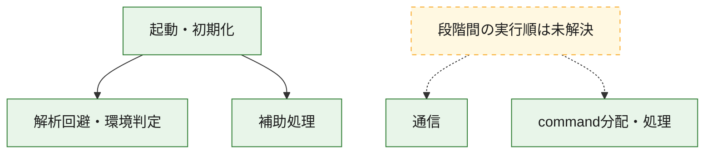
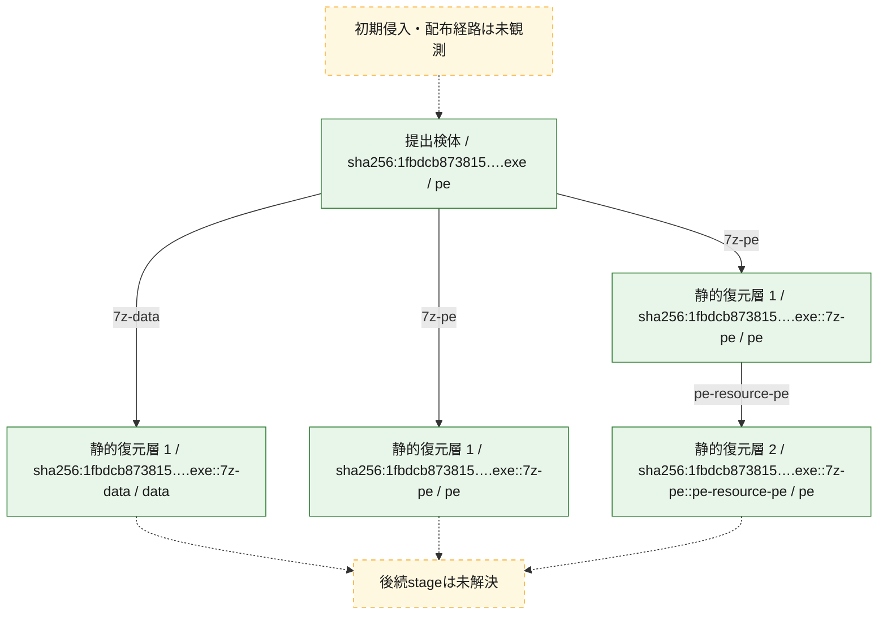
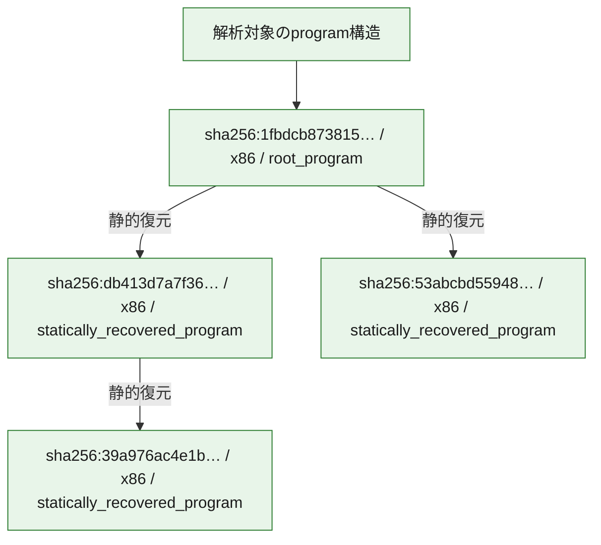

# 全体ロジック：1fbdcb873815e0bbb99531777ab9c5cb853078708ead0b0436191a66f59bb02b

代表関数の静的証跡から、起動・初期化、解析回避・環境判定、通信、command分配・処理の処理群を確認しました。

## 読み方

- phaseの掲載順は解析上の整理順です。observed_call_edgesがない段階間の実行順を断定しません。
- 図の実線は静的に観測した関係、点線と黄色のノードは未観測・未解決の関係を示します。
- 図は静的な要約であり、動的実行を再現するものではありません。
- 詳細な関数解説とfingerprintは[STATIC-LOGIC.md](STATIC-LOGIC.md)を参照してください。

## 静的可視化

### 実行フロー

### 感染チェーン

### モジュール関係

## 処理段階

### 1. 起動・初期化

entry pointから初期化と後続処理への移行を確認します。
確度: `confirmed_static_function_evidence`

- `39a976ac4e1b76c2058815c5017bd3acceb69950286cfdf8c5704b7e31b8cca0:ghidra:0001611c` — 初期化と主要処理への分岐を行う入口関数です。 状態: `succeeded`、選定理由: `entry_point`, `meaningful_symbol_name`, `reviewed_call_centrality:11`, `role:entrypoint`, `small_program_complete_context`
- `db413d7a7f36a922d30489d4df22d8fecd4da3a6e08f0a227ca770d6afa24bc3:ghidra:1400013a0` — 初期化と主要処理への分岐を行う入口関数です。 状態: `succeeded`、選定理由: `entry_point`, `meaningful_symbol_name`, `reviewed_call_centrality:14`, `role:entrypoint`
- `53abcbd55948172502618a66218a7d68ea986106e084cd07bd4c9321d58689f7:ghidra:1800295f4` — 初期化と主要処理への分岐を行う入口関数です。 状態: `succeeded`、選定理由: `entry_point`, `meaningful_symbol_name`, `reviewed_call_centrality:5`, `role:entrypoint`
- `1fbdcb873815e0bbb99531777ab9c5cb853078708ead0b0436191a66f59bb02b:ghidra:0040358d` — 初期化と主要処理への分岐を行う入口関数です。 状態: `succeeded`、選定理由: `entry_point`, `large_function:instructions=478`, `meaningful_symbol_name`, `reviewed_call_centrality:57`, `role:entrypoint`, `small_program_complete_context`

### 2. 解析回避・環境判定

debugger、sandbox、仮想環境、時間差などの判定を確認します。
確度: `confirmed_static_function_evidence`

- `db413d7a7f36a922d30489d4df22d8fecd4da3a6e08f0a227ca770d6afa24bc3:ghidra:1400019d4` — debugger、仮想環境、sandbox、または時間差の確認に関係する関数です。 状態: `succeeded`、選定理由: `context_representative`, `reviewed_call_centrality:11`, `role:anti_analysis`
- `53abcbd55948172502618a66218a7d68ea986106e084cd07bd4c9321d58689f7:ghidra:180005130` — debugger、仮想環境、sandbox、または時間差の確認に関係する関数です。 状態: `succeeded`、選定理由: `entry_point`, `meaningful_symbol_name`, `reviewed_call_centrality:22`, `role:anti_analysis`

### 3. 通信

通信初期化、endpoint処理、送受信の役割を確認します。
確度: `confirmed_static_function_evidence_with_limits`

- `53abcbd55948172502618a66218a7d68ea986106e084cd07bd4c9321d58689f7:ghidra:180004fd0` — 通信初期化、送受信、またはendpoint処理に関係する関数です。 状態: `limited_bad_instruction_or_flow`、選定理由: `entry_point`, `meaningful_symbol_name`, `reviewed_call_centrality:4`, `role:network_communication`
- `53abcbd55948172502618a66218a7d68ea986106e084cd07bd4c9321d58689f7:ghidra:180005080` — 通信初期化、送受信、またはendpoint処理に関係する関数です。 状態: `limited_bad_instruction_or_flow`、選定理由: `entry_point`, `meaningful_symbol_name`, `reviewed_call_centrality:4`, `role:network_communication`

### 4. command分配・処理

受信commandやtaskの解釈、分配、個別handlerへの移行を確認します。
確度: `confirmed_static_function_evidence_with_limits`

- `db413d7a7f36a922d30489d4df22d8fecd4da3a6e08f0a227ca770d6afa24bc3:ghidra:14000d4a0` — commandの解釈、分配、または個別処理を担当する関数です。 状態: `limited_bad_instruction_or_flow`、選定理由: `meaningful_symbol_name`, `role:command_dispatch_or_handler`
- `53abcbd55948172502618a66218a7d68ea986106e084cd07bd4c9321d58689f7:ghidra:18004e1f0` — commandの解釈、分配、または個別処理を担当する関数です。 状態: `limited_bad_instruction_or_flow`、選定理由: `meaningful_symbol_name`, `role:command_dispatch_or_handler`

### 5. 補助処理

主要処理を支える一般内部関数またはlibrary処理を確認します。
確度: `confirmed_static_function_evidence_with_limits`

- `39a976ac4e1b76c2058815c5017bd3acceb69950286cfdf8c5704b7e31b8cca0:ghidra:00011034` — 検体内部の一般処理を実装する関数です。 状態: `succeeded`、選定理由: `context_representative`, `reviewed_call_centrality:3`, `small_program_complete_context`
- `39a976ac4e1b76c2058815c5017bd3acceb69950286cfdf8c5704b7e31b8cca0:ghidra:00011070` — 検体内部の一般処理を実装する関数です。 状態: `succeeded`、選定理由: `meaningful_symbol_name`, `small_program_complete_context`
- `39a976ac4e1b76c2058815c5017bd3acceb69950286cfdf8c5704b7e31b8cca0:ghidra:00015008` — 検体内部の一般処理を実装する関数です。 状態: `succeeded`、選定理由: `context_representative`, `reviewed_call_centrality:6`, `small_program_complete_context`
- `39a976ac4e1b76c2058815c5017bd3acceb69950286cfdf8c5704b7e31b8cca0:ghidra:00015044` — 検体内部の一般処理を実装する関数です。 状態: `succeeded`、選定理由: `context_representative`, `reviewed_call_centrality:2`, `small_program_complete_context`
- `39a976ac4e1b76c2058815c5017bd3acceb69950286cfdf8c5704b7e31b8cca0:ghidra:0001506c` — 検体内部の一般処理を実装する関数です。 状態: `succeeded`、選定理由: `context_representative`, `reviewed_call_centrality:10`, `small_program_complete_context`
- `39a976ac4e1b76c2058815c5017bd3acceb69950286cfdf8c5704b7e31b8cca0:ghidra:00016008` — 検体内部の一般処理を実装する関数です。 状態: `succeeded`、選定理由: `context_representative`, `reviewed_call_centrality:10`, `small_program_complete_context`
- `db413d7a7f36a922d30489d4df22d8fecd4da3a6e08f0a227ca770d6afa24bc3:ghidra:140001010` — 検体内部の一般処理を実装する関数です。 状態: `succeeded`、選定理由: `context_representative`, `reviewed_call_centrality:1`
- `db413d7a7f36a922d30489d4df22d8fecd4da3a6e08f0a227ca770d6afa24bc3:ghidra:140001030` — 検体内部の一般処理を実装する関数です。 状態: `succeeded`、選定理由: `context_representative`, `reviewed_call_centrality:1`
- `db413d7a7f36a922d30489d4df22d8fecd4da3a6e08f0a227ca770d6afa24bc3:ghidra:140001050` — 検体内部の一般処理を実装する関数です。 状態: `succeeded`、選定理由: `context_representative`, `reviewed_call_centrality:1`
- `db413d7a7f36a922d30489d4df22d8fecd4da3a6e08f0a227ca770d6afa24bc3:ghidra:140001070` — 検体内部の一般処理を実装する関数です。 状態: `succeeded`、選定理由: `context_representative`, `reviewed_call_centrality:2`
- `db413d7a7f36a922d30489d4df22d8fecd4da3a6e08f0a227ca770d6afa24bc3:ghidra:140001090` — 検体内部の一般処理を実装する関数です。 状態: `succeeded`、選定理由: `context_representative`, `reviewed_call_centrality:1`
- `db413d7a7f36a922d30489d4df22d8fecd4da3a6e08f0a227ca770d6afa24bc3:ghidra:1400010b0` — 検体内部の一般処理を実装する関数です。 状態: `succeeded`、選定理由: `context_representative`, `reviewed_call_centrality:7`
- `db413d7a7f36a922d30489d4df22d8fecd4da3a6e08f0a227ca770d6afa24bc3:ghidra:140001190` — 検体内部の一般処理を実装する関数です。 状態: `succeeded`、選定理由: `context_representative`, `reviewed_call_centrality:2`
- `db413d7a7f36a922d30489d4df22d8fecd4da3a6e08f0a227ca770d6afa24bc3:ghidra:1400011e0` — 検体内部の一般処理を実装する関数です。 状態: `succeeded`、選定理由: `context_representative`, `reviewed_call_centrality:13`
- `db413d7a7f36a922d30489d4df22d8fecd4da3a6e08f0a227ca770d6afa24bc3:ghidra:1400013c8` — 検体内部の一般処理を実装する関数です。 状態: `succeeded`、選定理由: `context_representative`, `reviewed_call_centrality:10`
- `db413d7a7f36a922d30489d4df22d8fecd4da3a6e08f0a227ca770d6afa24bc3:ghidra:140001464` — 検体内部の一般処理を実装する関数です。 状態: `succeeded`、選定理由: `context_representative`, `reviewed_call_centrality:1`
- `db413d7a7f36a922d30489d4df22d8fecd4da3a6e08f0a227ca770d6afa24bc3:ghidra:140001490` — 検体内部の一般処理を実装する関数です。 状態: `limited_bad_instruction_or_flow`、選定理由: `context_representative`, `reviewed_call_centrality:2`
- `db413d7a7f36a922d30489d4df22d8fecd4da3a6e08f0a227ca770d6afa24bc3:ghidra:14000149c` — 検体内部の一般処理を実装する関数です。 状態: `limited_bad_instruction_or_flow`、選定理由: `context_representative`, `reviewed_call_centrality:10`
- `db413d7a7f36a922d30489d4df22d8fecd4da3a6e08f0a227ca770d6afa24bc3:ghidra:1400014e0` — 検体内部の一般処理を実装する関数です。 状態: `succeeded`、選定理由: `context_representative`, `reviewed_call_centrality:7`
- `db413d7a7f36a922d30489d4df22d8fecd4da3a6e08f0a227ca770d6afa24bc3:ghidra:140001688` — 検体内部の一般処理を実装する関数です。 状態: `succeeded`、選定理由: `context_representative`, `reviewed_call_centrality:7`
- `db413d7a7f36a922d30489d4df22d8fecd4da3a6e08f0a227ca770d6afa24bc3:ghidra:1400017c0` — 検体内部の一般処理を実装する関数です。 状態: `succeeded`、選定理由: `context_representative`, `reviewed_call_centrality:2`
- `db413d7a7f36a922d30489d4df22d8fecd4da3a6e08f0a227ca770d6afa24bc3:ghidra:140001810` — 検体内部の一般処理を実装する関数です。 状態: `succeeded`、選定理由: `context_representative`, `reviewed_call_centrality:2`
- `db413d7a7f36a922d30489d4df22d8fecd4da3a6e08f0a227ca770d6afa24bc3:ghidra:14000183c` — 検体内部の一般処理を実装する関数です。 状態: `succeeded`、選定理由: `context_representative`, `reviewed_call_centrality:1`
- `db413d7a7f36a922d30489d4df22d8fecd4da3a6e08f0a227ca770d6afa24bc3:ghidra:140001898` — 検体内部の一般処理を実装する関数です。 状態: `succeeded`、選定理由: `context_representative`, `reviewed_call_centrality:4`
- `db413d7a7f36a922d30489d4df22d8fecd4da3a6e08f0a227ca770d6afa24bc3:ghidra:1400018f0` — 検体内部の一般処理を実装する関数です。 状態: `succeeded`、選定理由: `context_representative`, `reviewed_call_centrality:1`
- `db413d7a7f36a922d30489d4df22d8fecd4da3a6e08f0a227ca770d6afa24bc3:ghidra:140001950` — 検体内部の一般処理を実装する関数です。 状態: `succeeded`、選定理由: `context_representative`, `reviewed_call_centrality:4`
- `db413d7a7f36a922d30489d4df22d8fecd4da3a6e08f0a227ca770d6afa24bc3:ghidra:140001b00` — 検体内部の一般処理を実装する関数です。 状態: `succeeded`、選定理由: `meaningful_symbol_name`
- `db413d7a7f36a922d30489d4df22d8fecd4da3a6e08f0a227ca770d6afa24bc3:ghidra:140001b18` — 検体内部の一般処理を実装する関数です。 状態: `succeeded`、選定理由: `context_representative`, `reviewed_call_centrality:1`
- `db413d7a7f36a922d30489d4df22d8fecd4da3a6e08f0a227ca770d6afa24bc3:ghidra:140001b48` — 検体内部の一般処理を実装する関数です。 状態: `succeeded`、選定理由: `context_representative`, `reviewed_call_centrality:5`
- `db413d7a7f36a922d30489d4df22d8fecd4da3a6e08f0a227ca770d6afa24bc3:ghidra:140001b80` — 検体内部の一般処理を実装する関数です。 状態: `succeeded`、選定理由: `context_representative`, `reviewed_call_centrality:1`
- `db413d7a7f36a922d30489d4df22d8fecd4da3a6e08f0a227ca770d6afa24bc3:ghidra:140001ba8` — 検体内部の一般処理を実装する関数です。 状態: `succeeded`、選定理由: `context_representative`, `reviewed_call_centrality:1`
- `db413d7a7f36a922d30489d4df22d8fecd4da3a6e08f0a227ca770d6afa24bc3:ghidra:140001bf0` — 検体内部の一般処理を実装する関数です。 状態: `succeeded`、選定理由: `context_representative`, `reviewed_call_centrality:1`
- `db413d7a7f36a922d30489d4df22d8fecd4da3a6e08f0a227ca770d6afa24bc3:ghidra:140001c18` — 検体内部の一般処理を実装する関数です。 状態: `succeeded`、選定理由: `context_representative`, `reviewed_call_centrality:1`
- `db413d7a7f36a922d30489d4df22d8fecd4da3a6e08f0a227ca770d6afa24bc3:ghidra:140001c80` — 検体内部の一般処理を実装する関数です。 状態: `succeeded`、選定理由: `context_representative`, `reviewed_call_centrality:1`
- `db413d7a7f36a922d30489d4df22d8fecd4da3a6e08f0a227ca770d6afa24bc3:ghidra:14000261f` — 検体内部の一般処理を実装する関数です。 状態: `limited_bad_instruction_or_flow`、選定理由: `meaningful_symbol_name`, `reviewed_call_centrality:1`
- `53abcbd55948172502618a66218a7d68ea986106e084cd07bd4c9321d58689f7:ghidra:180001000` — 検体内部の一般処理を実装する関数です。 状態: `succeeded`、選定理由: `context_representative`, `reviewed_call_centrality:2`
- `53abcbd55948172502618a66218a7d68ea986106e084cd07bd4c9321d58689f7:ghidra:180001080` — 検体内部の一般処理を実装する関数です。 状態: `succeeded`、選定理由: `context_representative`, `reviewed_call_centrality:2`
- `53abcbd55948172502618a66218a7d68ea986106e084cd07bd4c9321d58689f7:ghidra:1800010a0` — 検体内部の一般処理を実装する関数です。 状態: `succeeded`、選定理由: `context_representative`, `reviewed_call_centrality:2`
- `53abcbd55948172502618a66218a7d68ea986106e084cd07bd4c9321d58689f7:ghidra:1800010d0` — 検体内部の一般処理を実装する関数です。 状態: `succeeded`、選定理由: `context_representative`, `reviewed_call_centrality:3`
- `53abcbd55948172502618a66218a7d68ea986106e084cd07bd4c9321d58689f7:ghidra:180001138` — 検体内部の一般処理を実装する関数です。 状態: `succeeded`、選定理由: `context_representative`, `reviewed_call_centrality:2`
- `53abcbd55948172502618a66218a7d68ea986106e084cd07bd4c9321d58689f7:ghidra:180001158` — 検体内部の一般処理を実装する関数です。 状態: `succeeded`、選定理由: `context_representative`, `reviewed_call_centrality:2`
- `53abcbd55948172502618a66218a7d68ea986106e084cd07bd4c9321d58689f7:ghidra:180001188` — 検体内部の一般処理を実装する関数です。 状態: `succeeded`、選定理由: `context_representative`, `reviewed_call_centrality:3`
- `53abcbd55948172502618a66218a7d68ea986106e084cd07bd4c9321d58689f7:ghidra:1800011c4` — 検体内部の一般処理を実装する関数です。 状態: `succeeded`、選定理由: `context_representative`, `reviewed_call_centrality:2`
- `53abcbd55948172502618a66218a7d68ea986106e084cd07bd4c9321d58689f7:ghidra:1800011f0` — 検体内部の一般処理を実装する関数です。 状態: `succeeded`、選定理由: `context_representative`, `reviewed_call_centrality:2`
- `53abcbd55948172502618a66218a7d68ea986106e084cd07bd4c9321d58689f7:ghidra:1800012f0` — 検体内部の一般処理を実装する関数です。 状態: `succeeded`、選定理由: `context_representative`, `reviewed_call_centrality:3`
- `53abcbd55948172502618a66218a7d68ea986106e084cd07bd4c9321d58689f7:ghidra:180001540` — 検体内部の一般処理を実装する関数です。 状態: `succeeded`、選定理由: `context_representative`, `reviewed_call_centrality:4`
- `53abcbd55948172502618a66218a7d68ea986106e084cd07bd4c9321d58689f7:ghidra:1800016a0` — 検体内部の一般処理を実装する関数です。 状態: `succeeded`、選定理由: `context_representative`, `reviewed_call_centrality:2`
- `53abcbd55948172502618a66218a7d68ea986106e084cd07bd4c9321d58689f7:ghidra:180001780` — 検体内部の一般処理を実装する関数です。 状態: `succeeded`、選定理由: `context_representative`, `reviewed_call_centrality:12`
- `53abcbd55948172502618a66218a7d68ea986106e084cd07bd4c9321d58689f7:ghidra:180001d60` — 検体内部の一般処理を実装する関数です。 状態: `succeeded`、選定理由: `context_representative`, `reviewed_call_centrality:3`
- `53abcbd55948172502618a66218a7d68ea986106e084cd07bd4c9321d58689f7:ghidra:180001f40` — 検体内部の一般処理を実装する関数です。 状態: `succeeded`、選定理由: `context_representative`, `reviewed_call_centrality:4`
- `53abcbd55948172502618a66218a7d68ea986106e084cd07bd4c9321d58689f7:ghidra:180002100` — 検体内部の一般処理を実装する関数です。 状態: `succeeded`、選定理由: `context_representative`, `reviewed_call_centrality:3`
- `53abcbd55948172502618a66218a7d68ea986106e084cd07bd4c9321d58689f7:ghidra:1800022a0` — 検体内部の一般処理を実装する関数です。 状態: `succeeded`、選定理由: `context_representative`, `reviewed_call_centrality:9`
- `53abcbd55948172502618a66218a7d68ea986106e084cd07bd4c9321d58689f7:ghidra:180002400` — 検体内部の一般処理を実装する関数です。 状態: `succeeded`、選定理由: `context_representative`, `reviewed_call_centrality:1`
- `53abcbd55948172502618a66218a7d68ea986106e084cd07bd4c9321d58689f7:ghidra:1800024f0` — 検体内部の一般処理を実装する関数です。 状態: `succeeded`、選定理由: `context_representative`, `reviewed_call_centrality:2`
- `53abcbd55948172502618a66218a7d68ea986106e084cd07bd4c9321d58689f7:ghidra:1800025d0` — 検体内部の一般処理を実装する関数です。 状態: `succeeded`、選定理由: `context_representative`, `reviewed_call_centrality:1`
- `53abcbd55948172502618a66218a7d68ea986106e084cd07bd4c9321d58689f7:ghidra:180002700` — 検体内部の一般処理を実装する関数です。 状態: `succeeded`、選定理由: `context_representative`, `reviewed_call_centrality:1`
- `53abcbd55948172502618a66218a7d68ea986106e084cd07bd4c9321d58689f7:ghidra:1800028b0` — 検体内部の一般処理を実装する関数です。 状態: `succeeded`、選定理由: `context_representative`, `reviewed_call_centrality:1`
- `53abcbd55948172502618a66218a7d68ea986106e084cd07bd4c9321d58689f7:ghidra:180002b80` — 検体内部の一般処理を実装する関数です。 状態: `succeeded`、選定理由: `context_representative`, `reviewed_call_centrality:5`
- `53abcbd55948172502618a66218a7d68ea986106e084cd07bd4c9321d58689f7:ghidra:180002e80` — 検体内部の一般処理を実装する関数です。 状態: `succeeded`、選定理由: `context_representative`, `reviewed_call_centrality:3`
- `53abcbd55948172502618a66218a7d68ea986106e084cd07bd4c9321d58689f7:ghidra:1800051e0` — 検体内部の一般処理を実装する関数です。 状態: `limited_bad_instruction_or_flow`、選定理由: `entry_point`, `meaningful_symbol_name`, `reviewed_call_centrality:4`
- `53abcbd55948172502618a66218a7d68ea986106e084cd07bd4c9321d58689f7:ghidra:180005350` — 検体内部の一般処理を実装する関数です。 状態: `limited_bad_instruction_or_flow`、選定理由: `entry_point`, `meaningful_symbol_name`, `reviewed_call_centrality:4`
- `53abcbd55948172502618a66218a7d68ea986106e084cd07bd4c9321d58689f7:ghidra:180029f58` — 検体内部の一般処理を実装する関数です。 状態: `succeeded`、選定理由: `meaningful_symbol_name`

## 観測したcall関係

- `53abcbd55948172502618a66218a7d68ea986106e084cd07bd4c9321d58689f7:ghidra:1800012f0` → `53abcbd55948172502618a66218a7d68ea986106e084cd07bd4c9321d58689f7:ghidra:1800011f0` （`support` → `support`）
- `53abcbd55948172502618a66218a7d68ea986106e084cd07bd4c9321d58689f7:ghidra:1800012f0` → `53abcbd55948172502618a66218a7d68ea986106e084cd07bd4c9321d58689f7:ghidra:180001540` （`support` → `support`）
- `53abcbd55948172502618a66218a7d68ea986106e084cd07bd4c9321d58689f7:ghidra:180001540` → `53abcbd55948172502618a66218a7d68ea986106e084cd07bd4c9321d58689f7:ghidra:180001d60` （`support` → `support`）
- `53abcbd55948172502618a66218a7d68ea986106e084cd07bd4c9321d58689f7:ghidra:180001540` → `53abcbd55948172502618a66218a7d68ea986106e084cd07bd4c9321d58689f7:ghidra:180001f40` （`support` → `support`）
- `53abcbd55948172502618a66218a7d68ea986106e084cd07bd4c9321d58689f7:ghidra:180001780` → `53abcbd55948172502618a66218a7d68ea986106e084cd07bd4c9321d58689f7:ghidra:1800028b0` （`support` → `support`）
- `53abcbd55948172502618a66218a7d68ea986106e084cd07bd4c9321d58689f7:ghidra:180001780` → `53abcbd55948172502618a66218a7d68ea986106e084cd07bd4c9321d58689f7:ghidra:180002b80` （`support` → `support`）
- `53abcbd55948172502618a66218a7d68ea986106e084cd07bd4c9321d58689f7:ghidra:180002100` → `53abcbd55948172502618a66218a7d68ea986106e084cd07bd4c9321d58689f7:ghidra:180001f40` （`support` → `support`）
- `53abcbd55948172502618a66218a7d68ea986106e084cd07bd4c9321d58689f7:ghidra:180002400` → `53abcbd55948172502618a66218a7d68ea986106e084cd07bd4c9321d58689f7:ghidra:1800022a0` （`support` → `support`）
- `53abcbd55948172502618a66218a7d68ea986106e084cd07bd4c9321d58689f7:ghidra:1800024f0` → `53abcbd55948172502618a66218a7d68ea986106e084cd07bd4c9321d58689f7:ghidra:1800022a0` （`support` → `support`）
- `53abcbd55948172502618a66218a7d68ea986106e084cd07bd4c9321d58689f7:ghidra:1800025d0` → `53abcbd55948172502618a66218a7d68ea986106e084cd07bd4c9321d58689f7:ghidra:1800022a0` （`support` → `support`）
- `53abcbd55948172502618a66218a7d68ea986106e084cd07bd4c9321d58689f7:ghidra:180002700` → `53abcbd55948172502618a66218a7d68ea986106e084cd07bd4c9321d58689f7:ghidra:1800022a0` （`support` → `support`）
- `53abcbd55948172502618a66218a7d68ea986106e084cd07bd4c9321d58689f7:ghidra:180002e80` → `53abcbd55948172502618a66218a7d68ea986106e084cd07bd4c9321d58689f7:ghidra:180001f40` （`support` → `support`）
- `db413d7a7f36a922d30489d4df22d8fecd4da3a6e08f0a227ca770d6afa24bc3:ghidra:140001010` → `db413d7a7f36a922d30489d4df22d8fecd4da3a6e08f0a227ca770d6afa24bc3:ghidra:1400013c8` （`support` → `support`）
- `db413d7a7f36a922d30489d4df22d8fecd4da3a6e08f0a227ca770d6afa24bc3:ghidra:140001030` → `db413d7a7f36a922d30489d4df22d8fecd4da3a6e08f0a227ca770d6afa24bc3:ghidra:1400013c8` （`support` → `support`）
- `db413d7a7f36a922d30489d4df22d8fecd4da3a6e08f0a227ca770d6afa24bc3:ghidra:140001050` → `db413d7a7f36a922d30489d4df22d8fecd4da3a6e08f0a227ca770d6afa24bc3:ghidra:1400013c8` （`support` → `support`）
- `db413d7a7f36a922d30489d4df22d8fecd4da3a6e08f0a227ca770d6afa24bc3:ghidra:140001070` → `db413d7a7f36a922d30489d4df22d8fecd4da3a6e08f0a227ca770d6afa24bc3:ghidra:1400013c8` （`support` → `support`）
- `db413d7a7f36a922d30489d4df22d8fecd4da3a6e08f0a227ca770d6afa24bc3:ghidra:140001090` → `db413d7a7f36a922d30489d4df22d8fecd4da3a6e08f0a227ca770d6afa24bc3:ghidra:1400013c8` （`support` → `support`）
- `db413d7a7f36a922d30489d4df22d8fecd4da3a6e08f0a227ca770d6afa24bc3:ghidra:1400010b0` → `db413d7a7f36a922d30489d4df22d8fecd4da3a6e08f0a227ca770d6afa24bc3:ghidra:140001898` （`support` → `support`）
- `db413d7a7f36a922d30489d4df22d8fecd4da3a6e08f0a227ca770d6afa24bc3:ghidra:1400010b0` → `db413d7a7f36a922d30489d4df22d8fecd4da3a6e08f0a227ca770d6afa24bc3:ghidra:1400018f0` （`support` → `support`）
- `db413d7a7f36a922d30489d4df22d8fecd4da3a6e08f0a227ca770d6afa24bc3:ghidra:1400011e0` → `db413d7a7f36a922d30489d4df22d8fecd4da3a6e08f0a227ca770d6afa24bc3:ghidra:140001950` （`support` → `support`）
- `db413d7a7f36a922d30489d4df22d8fecd4da3a6e08f0a227ca770d6afa24bc3:ghidra:1400013a0` → `db413d7a7f36a922d30489d4df22d8fecd4da3a6e08f0a227ca770d6afa24bc3:ghidra:140001950` （`startup` → `support`）
- `db413d7a7f36a922d30489d4df22d8fecd4da3a6e08f0a227ca770d6afa24bc3:ghidra:1400013a0` → `db413d7a7f36a922d30489d4df22d8fecd4da3a6e08f0a227ca770d6afa24bc3:ghidra:1400019d4` （`startup` → `evasion`）
- `db413d7a7f36a922d30489d4df22d8fecd4da3a6e08f0a227ca770d6afa24bc3:ghidra:140001464` → `db413d7a7f36a922d30489d4df22d8fecd4da3a6e08f0a227ca770d6afa24bc3:ghidra:1400013c8` （`support` → `support`）
- `db413d7a7f36a922d30489d4df22d8fecd4da3a6e08f0a227ca770d6afa24bc3:ghidra:1400014e0` → `db413d7a7f36a922d30489d4df22d8fecd4da3a6e08f0a227ca770d6afa24bc3:ghidra:14000149c` （`support` → `support`）
- `db413d7a7f36a922d30489d4df22d8fecd4da3a6e08f0a227ca770d6afa24bc3:ghidra:140001688` → `db413d7a7f36a922d30489d4df22d8fecd4da3a6e08f0a227ca770d6afa24bc3:ghidra:14000149c` （`support` → `support`）
- `db413d7a7f36a922d30489d4df22d8fecd4da3a6e08f0a227ca770d6afa24bc3:ghidra:140001898` → `db413d7a7f36a922d30489d4df22d8fecd4da3a6e08f0a227ca770d6afa24bc3:ghidra:14000183c` （`support` → `support`）
- `ghidra-function:02808cdde4426f145c1bbf31` → `ghidra-external:1c690e28e0f43b263a5d1ada` （`unclassified` → `unclassified`）
- `ghidra-function:02808cdde4426f145c1bbf31` → `ghidra-external:5802fed65944d4bd50127587` （`unclassified` → `unclassified`）
- `ghidra-function:02808cdde4426f145c1bbf31` → `ghidra-external:7c1ed405b5a68a8b52edc28c` （`unclassified` → `unclassified`）
- `ghidra-function:02808cdde4426f145c1bbf31` → `ghidra-external:f122102df897db9640371815` （`unclassified` → `unclassified`）
- `ghidra-function:033ab8a33545bde25356c8a5` → `ghidra-external:8eef6620355b9e471b087641` （`unclassified` → `unclassified`）
- `ghidra-function:0841c335d2a274782fbe5194` → `ghidra-function:18ebd6fdeb01da486036f7d7` （`unclassified` → `unclassified`）
- `ghidra-function:0841c335d2a274782fbe5194` → `ghidra-function:57d7895feddabda842489085` （`unclassified` → `unclassified`）
- `ghidra-function:0841c335d2a274782fbe5194` → `ghidra-function:f6dba687d8224d21ad725f85` （`unclassified` → `unclassified`）
- `ghidra-function:09195cc4e175e1ede80f13d8` → `ghidra-function:5d9fabb566efbe6728ed8ec8` （`unclassified` → `unclassified`）
- `ghidra-function:09195cc4e175e1ede80f13d8` → `ghidra-function:7c003b0a8e349605c3aaacc6` （`unclassified` → `unclassified`）
- `ghidra-function:09195cc4e175e1ede80f13d8` → `ghidra-function:a4c66f5c4a69b3a1505e522f` （`unclassified` → `unclassified`）
- `ghidra-function:09195cc4e175e1ede80f13d8` → `ghidra-function:ab4458741faa4fd4284e55f9` （`unclassified` → `unclassified`）
- `ghidra-function:09195cc4e175e1ede80f13d8` → `ghidra-function:b52c768a60cd374b90ddde70` （`unclassified` → `unclassified`）
- `ghidra-function:0f3e90e13c22ac0c47cf3349` → `ghidra-external:0146d31c8f9d2a840510deca` （`unclassified` → `unclassified`）
- `ghidra-function:0f3e90e13c22ac0c47cf3349` → `ghidra-external:0ff32cb1067e97a610a1b58b` （`unclassified` → `unclassified`）
- `ghidra-function:0f3e90e13c22ac0c47cf3349` → `ghidra-external:2ea97185f00952f8d74f0355` （`unclassified` → `unclassified`）
- `ghidra-function:0f3e90e13c22ac0c47cf3349` → `ghidra-external:42f33916f057ac095e2aeb5a` （`unclassified` → `unclassified`）
- `ghidra-function:0f3e90e13c22ac0c47cf3349` → `ghidra-external:5d67da562d566d783b33f276` （`unclassified` → `unclassified`）
- `ghidra-function:0f3e90e13c22ac0c47cf3349` → `ghidra-external:66912376fd14b37cb9c5bf8b` （`unclassified` → `unclassified`）
- `ghidra-function:0f3e90e13c22ac0c47cf3349` → `ghidra-external:8bd4cea7273597da481b7995` （`unclassified` → `unclassified`）
- `ghidra-function:0f3e90e13c22ac0c47cf3349` → `ghidra-external:92486cc0760a31379f06ddd4` （`unclassified` → `unclassified`）
- `ghidra-function:0f3e90e13c22ac0c47cf3349` → `ghidra-external:ccc2b8164e3e9e2ff1ec1950` （`unclassified` → `unclassified`）
- `ghidra-function:0f3e90e13c22ac0c47cf3349` → `ghidra-external:cdc260f82a23fc969bed2194` （`unclassified` → `unclassified`）
- `ghidra-function:0f3e90e13c22ac0c47cf3349` → `ghidra-external:f0d3681814520dc9cec926a8` （`unclassified` → `unclassified`）
- `ghidra-function:0f3e90e13c22ac0c47cf3349` → `ghidra-function:109b130943f290bf7f1fcafb` （`unclassified` → `unclassified`）
- `ghidra-function:0f3e90e13c22ac0c47cf3349` → `ghidra-function:5c8f14f0dfe083a801d15dae` （`unclassified` → `unclassified`）
- `ghidra-function:0f3e90e13c22ac0c47cf3349` → `ghidra-function:715264b7d9cf22c33b06f95e` （`unclassified` → `unclassified`）
- `ghidra-function:0f3e90e13c22ac0c47cf3349` → `ghidra-function:754f59e6d6cbb121b85686b4` （`unclassified` → `unclassified`）
- `ghidra-function:0f3e90e13c22ac0c47cf3349` → `ghidra-function:a2be3a9a9bd789abdae9c11e` （`unclassified` → `unclassified`）
- `ghidra-function:0f3e90e13c22ac0c47cf3349` → `ghidra-function:ab6c333399c351ad4e694832` （`unclassified` → `unclassified`）
- `ghidra-function:0f3e90e13c22ac0c47cf3349` → `ghidra-function:bea1d7461649561a05b0dee1` （`unclassified` → `unclassified`）
- `ghidra-function:0f3e90e13c22ac0c47cf3349` → `ghidra-function:cd5e2b31340a9be76f451fde` （`unclassified` → `unclassified`）
- `ghidra-function:0f88b5e12492d4a160d75f04` → `ghidra-external:31e6b93ab22f277fc78f07f8` （`unclassified` → `unclassified`）
- `ghidra-function:0f88b5e12492d4a160d75f04` → `ghidra-external:43fb46f833cdb91d5320a52d` （`unclassified` → `unclassified`）
- `ghidra-function:12456c95461dfed479511d16` → `ghidra-external:855451d95a302dd888479604` （`unclassified` → `unclassified`）
- `ghidra-function:12456c95461dfed479511d16` → `ghidra-function:b26b52bd900a73f52b327d5b` （`unclassified` → `unclassified`）
- `ghidra-function:12456c95461dfed479511d16` → `ghidra-function:eab0821d3e57739d5b08a989` （`unclassified` → `unclassified`）
- `ghidra-function:1b612c18d13e66a0900ba7c9` → `ghidra-function:ab6c333399c351ad4e694832` （`unclassified` → `unclassified`）
- `ghidra-function:1b612c18d13e66a0900ba7c9` → `ghidra-function:eab0821d3e57739d5b08a989` （`unclassified` → `unclassified`）
- `ghidra-function:1b9a127515f904229a774804` → `ghidra-function:eab0821d3e57739d5b08a989` （`unclassified` → `unclassified`）
- `ghidra-function:1b9a127515f904229a774804` → `ghidra-function:f65dcb839d835393ff95c385` （`unclassified` → `unclassified`）
- `ghidra-function:1bf1702581ad7f08384b722e` → `ghidra-external:78800f80eb3dd2068bb2dfc9` （`unclassified` → `unclassified`）
- `ghidra-function:1bf1702581ad7f08384b722e` → `ghidra-function:02808cdde4426f145c1bbf31` （`unclassified` → `unclassified`）
- `ghidra-function:252aca02cea9b7ee703b919e` → `ghidra-function:643630065fd906e91552e5e9` （`unclassified` → `unclassified`）
- `ghidra-function:252aca02cea9b7ee703b919e` → `ghidra-function:715264b7d9cf22c33b06f95e` （`unclassified` → `unclassified`）
- `ghidra-function:252aca02cea9b7ee703b919e` → `ghidra-function:ab6c333399c351ad4e694832` （`unclassified` → `unclassified`）
- `ghidra-function:271187352165df5322a31412` → `ghidra-function:ad4f2d1b437df4005e3fedf6` （`unclassified` → `unclassified`）
- `ghidra-function:271187352165df5322a31412` → `ghidra-function:adc29a70fecda533636371dc` （`unclassified` → `unclassified`）
- `ghidra-function:271187352165df5322a31412` → `ghidra-function:c086bef00c77f8d370ea0a41` （`unclassified` → `unclassified`）
- `ghidra-function:271187352165df5322a31412` → `ghidra-function:f4668fc6050e46fe42f728a1` （`unclassified` → `unclassified`）
- `ghidra-function:271187352165df5322a31412` → `ghidra-function:fe41adc7ad2285c12b77869d` （`unclassified` → `unclassified`）
- `ghidra-function:2840e7846b258a5254d02f17` → `ghidra-external:e05d77f1f0a064c3d6bda60b` （`unclassified` → `unclassified`）
- `ghidra-function:38b54a750a82761a36923170` → `ghidra-external:0fb184e94db7c528e2b60ff7` （`unclassified` → `unclassified`）
- `ghidra-function:38b54a750a82761a36923170` → `ghidra-function:5040dc53029334cb0a9c5be3` （`unclassified` → `unclassified`）
- `ghidra-function:38b54a750a82761a36923170` → `ghidra-function:b26b52bd900a73f52b327d5b` （`unclassified` → `unclassified`）
- `ghidra-function:3b729af68eaa83f89195b568` → `ghidra-function:02808cdde4426f145c1bbf31` （`unclassified` → `unclassified`）
- `ghidra-function:3cb5797ae81585e9c0c2d790` → `ghidra-function:8c43f2ab1726679750dc3d0a` （`unclassified` → `unclassified`）
- `ghidra-function:3cb5797ae81585e9c0c2d790` → `ghidra-function:c49d165f27e4ca48eac46ca7` （`unclassified` → `unclassified`）
- `ghidra-function:4809a05edfa776fae538ac84` → `ghidra-external:142cbe16495fa62fd6529c6c` （`unclassified` → `unclassified`）
- `ghidra-function:4809a05edfa776fae538ac84` → `ghidra-external:213a41fa8cdd2667f2926470` （`unclassified` → `unclassified`）
- `ghidra-function:4809a05edfa776fae538ac84` → `ghidra-function:7a1deb2c36d4e3adf1b8b061` （`unclassified` → `unclassified`）
- `ghidra-function:4809a05edfa776fae538ac84` → `ghidra-function:a16d5443a19dde5f828d1763` （`unclassified` → `unclassified`）
- `ghidra-function:48792d5d5f9cb4c34370b845` → `ghidra-function:06c4cd3b1c9ea8b1f4575644` （`unclassified` → `unclassified`）
- `ghidra-function:48792d5d5f9cb4c34370b845` → `ghidra-function:91e3396734d17b17b83ee245` （`unclassified` → `unclassified`）
- `ghidra-function:48f39e0803a24b3f6977e11b` → `ghidra-external:85a05d262d3514a1ae6fa8cc` （`unclassified` → `unclassified`）
- `ghidra-function:49a217b9798dc3d190bcfaeb` → `ghidra-function:02808cdde4426f145c1bbf31` （`unclassified` → `unclassified`）
- `ghidra-function:4a294d1f9121b56c13aba939` → `ghidra-function:0aeba26425813f7b76578b03` （`unclassified` → `unclassified`）
- `ghidra-function:4a294d1f9121b56c13aba939` → `ghidra-function:35bd6c09f3484ce36d7ff8ce` （`unclassified` → `unclassified`）
- `ghidra-function:4a294d1f9121b56c13aba939` → `ghidra-function:45c6872dfcc7feb423c197b8` （`unclassified` → `unclassified`）
- `ghidra-function:4a294d1f9121b56c13aba939` → `ghidra-function:7c22b8350289b6980610902e` （`unclassified` → `unclassified`）
- `ghidra-function:5040dc53029334cb0a9c5be3` → `ghidra-external:0fb184e94db7c528e2b60ff7` （`unclassified` → `unclassified`）
- `ghidra-function:5040dc53029334cb0a9c5be3` → `ghidra-external:570aad465d10994d03c8c1ae` （`unclassified` → `unclassified`）
- `ghidra-function:580d9a7cf7407e28161f13fd` → `ghidra-function:38b54a750a82761a36923170` （`unclassified` → `unclassified`）
- `ghidra-function:580d9a7cf7407e28161f13fd` → `ghidra-function:b26a8989d6e0866a207b6c4f` （`unclassified` → `unclassified`）
- `ghidra-function:580d9a7cf7407e28161f13fd` → `ghidra-function:eab0821d3e57739d5b08a989` （`unclassified` → `unclassified`）
- `ghidra-function:5e07eb6ea9886e239674a0e7` → `ghidra-function:643630065fd906e91552e5e9` （`unclassified` → `unclassified`）
- `ghidra-function:5e07eb6ea9886e239674a0e7` → `ghidra-function:715264b7d9cf22c33b06f95e` （`unclassified` → `unclassified`）
- `ghidra-function:5e07eb6ea9886e239674a0e7` → `ghidra-function:ab6c333399c351ad4e694832` （`unclassified` → `unclassified`）
- `ghidra-function:6217f5cc6c3f203bb40e786e` → `ghidra-function:77a4f8b5fb4b77c9d175bbe6` （`unclassified` → `unclassified`）
- `ghidra-function:6217f5cc6c3f203bb40e786e` → `ghidra-function:c49d165f27e4ca48eac46ca7` （`unclassified` → `unclassified`）
- `ghidra-function:695be552ea3108687e1c1a55` → `ghidra-function:e8af8be3f134347da640890d` （`unclassified` → `unclassified`）
- `ghidra-function:73e82e56eb416ed5120ff374` → `ghidra-function:02808cdde4426f145c1bbf31` （`unclassified` → `unclassified`）
- `ghidra-function:743735ecce6a065dc9c251c6` → `ghidra-external:27acbe4faf4280de349b537c` （`unclassified` → `unclassified`）
- `ghidra-function:743735ecce6a065dc9c251c6` → `ghidra-external:33c0f5ad87f69533a684151c` （`unclassified` → `unclassified`）
- `ghidra-function:743735ecce6a065dc9c251c6` → `ghidra-external:4488976b5acf4b5f938e2f4e` （`unclassified` → `unclassified`）
- `ghidra-function:743735ecce6a065dc9c251c6` → `ghidra-external:468a86e6b32dd01538fc8c5f` （`unclassified` → `unclassified`）
- `ghidra-function:743735ecce6a065dc9c251c6` → `ghidra-external:538b2be6699f024af296d144` （`unclassified` → `unclassified`）
- `ghidra-function:743735ecce6a065dc9c251c6` → `ghidra-external:57d85e80be59e30597aef4c5` （`unclassified` → `unclassified`）
- `ghidra-function:743735ecce6a065dc9c251c6` → `ghidra-external:68440f9513c59046967fb97e` （`unclassified` → `unclassified`）
- `ghidra-function:743735ecce6a065dc9c251c6` → `ghidra-external:6b8d82973faf59d58ad204bd` （`unclassified` → `unclassified`）
- `ghidra-function:743735ecce6a065dc9c251c6` → `ghidra-external:6ce1524e0820236d35cd3a6c` （`unclassified` → `unclassified`）
- `ghidra-function:743735ecce6a065dc9c251c6` → `ghidra-external:7edd3750dc3f31c5c306640f` （`unclassified` → `unclassified`）
- `ghidra-function:743735ecce6a065dc9c251c6` → `ghidra-external:82bdcb2b48b1c70254fd2d6e` （`unclassified` → `unclassified`）
- `ghidra-function:743735ecce6a065dc9c251c6` → `ghidra-external:8f9803afe62ae00d29f6682e` （`unclassified` → `unclassified`）
- `ghidra-function:743735ecce6a065dc9c251c6` → `ghidra-external:94bef8612c1775f5539a69d8` （`unclassified` → `unclassified`）
- `ghidra-function:743735ecce6a065dc9c251c6` → `ghidra-external:9f19104d96a79b2e0d4df83c` （`unclassified` → `unclassified`）
- `ghidra-function:743735ecce6a065dc9c251c6` → `ghidra-external:9f58cee7ff4e52d1ca38c2e6` （`unclassified` → `unclassified`）
- `ghidra-function:743735ecce6a065dc9c251c6` → `ghidra-external:a24efb86c5315dc1d896beab` （`unclassified` → `unclassified`）
- `ghidra-function:743735ecce6a065dc9c251c6` → `ghidra-external:a9da06013d9e2b8d7b79d2c6` （`unclassified` → `unclassified`）
- `ghidra-function:743735ecce6a065dc9c251c6` → `ghidra-external:aa78d0ce0ba41c51c7efe54a` （`unclassified` → `unclassified`）
- `ghidra-function:743735ecce6a065dc9c251c6` → `ghidra-external:b36b98a16584bfd8aba7df46` （`unclassified` → `unclassified`）
- `ghidra-function:743735ecce6a065dc9c251c6` → `ghidra-external:bec9c777d7a35c3344304b1d` （`unclassified` → `unclassified`）
- `ghidra-function:743735ecce6a065dc9c251c6` → `ghidra-external:c7a01fa28d2000ea4b73a2de` （`unclassified` → `unclassified`）
- `ghidra-function:743735ecce6a065dc9c251c6` → `ghidra-external:d5cea0227414885feaed87b1` （`unclassified` → `unclassified`）
- `ghidra-function:743735ecce6a065dc9c251c6` → `ghidra-external:e263e3d373d040a3df957448` （`unclassified` → `unclassified`）
- `ghidra-function:743735ecce6a065dc9c251c6` → `ghidra-function:00f3fa1ade7a492a5ef33da9` （`unclassified` → `unclassified`）
- `ghidra-function:743735ecce6a065dc9c251c6` → `ghidra-function:18199cd40d9d21dd0c40f97f` （`unclassified` → `unclassified`）
- `ghidra-function:743735ecce6a065dc9c251c6` → `ghidra-function:30cf2e4b27456ba4a4572be1` （`unclassified` → `unclassified`）
- `ghidra-function:743735ecce6a065dc9c251c6` → `ghidra-function:3ed8831d401e03b99a5476d7` （`unclassified` → `unclassified`）
- `ghidra-function:743735ecce6a065dc9c251c6` → `ghidra-function:605a0383a31b937e8f8eae80` （`unclassified` → `unclassified`）
- `ghidra-function:743735ecce6a065dc9c251c6` → `ghidra-function:8fb44b8be76e7f5c25e68593` （`unclassified` → `unclassified`）
- `ghidra-function:743735ecce6a065dc9c251c6` → `ghidra-function:a05b34e2160adf12fe2e632d` （`unclassified` → `unclassified`）
- `ghidra-function:743735ecce6a065dc9c251c6` → `ghidra-function:a1fb9999bdc7564d65f32740` （`unclassified` → `unclassified`）
- `ghidra-function:743735ecce6a065dc9c251c6` → `ghidra-function:a9f3ab92c65c0f2a5994e56a` （`unclassified` → `unclassified`）
- `ghidra-function:743735ecce6a065dc9c251c6` → `ghidra-function:b75eea4bfeb403391d284244` （`unclassified` → `unclassified`）
- `ghidra-function:743735ecce6a065dc9c251c6` → `ghidra-function:bcf4c8a0e3113790b794027e` （`unclassified` → `unclassified`）
- `ghidra-function:743735ecce6a065dc9c251c6` → `ghidra-function:dc4adba3da9e843b6ea9783e` （`unclassified` → `unclassified`）
- `ghidra-function:743735ecce6a065dc9c251c6` → `ghidra-function:df0666ef0c59736541d106cb` （`unclassified` → `unclassified`）
- `ghidra-function:743735ecce6a065dc9c251c6` → `ghidra-function:ead4578dfb9d8d71d3cc69e8` （`unclassified` → `unclassified`）
- `ghidra-function:743735ecce6a065dc9c251c6` → `ghidra-function:ec1b6ce386f9a85bbb092d66` （`unclassified` → `unclassified`）
- `ghidra-function:743735ecce6a065dc9c251c6` → `ghidra-function:ef38739c7afe55a0dfacc160` （`unclassified` → `unclassified`）
- `ghidra-function:743735ecce6a065dc9c251c6` → `ghidra-function:fd4947de5e89c75cfce9c712` （`unclassified` → `unclassified`）
- `ghidra-function:750f882195cd1c381b47e68b` → `ghidra-external:ccc2b8164e3e9e2ff1ec1950` （`unclassified` → `unclassified`）
- `ghidra-function:750f882195cd1c381b47e68b` → `ghidra-function:b26b52bd900a73f52b327d5b` （`unclassified` → `unclassified`）
- `ghidra-function:750f882195cd1c381b47e68b` → `ghidra-function:eab0821d3e57739d5b08a989` （`unclassified` → `unclassified`）
- `ghidra-function:760009bee3aa2a6f13766987` → `ghidra-external:50ae670abe1e75c8f1dcbeff` （`unclassified` → `unclassified`）
- `ghidra-function:760009bee3aa2a6f13766987` → `ghidra-external:9d4b40870d551dbb21da1da5` （`unclassified` → `unclassified`）
- `ghidra-function:760009bee3aa2a6f13766987` → `ghidra-external:c45c6a9f68163ff83b439229` （`unclassified` → `unclassified`）
- `ghidra-function:760009bee3aa2a6f13766987` → `ghidra-external:f122102df897db9640371815` （`unclassified` → `unclassified`）
- `ghidra-function:760009bee3aa2a6f13766987` → `ghidra-external:fed404d775f64abe4e9240d6` （`unclassified` → `unclassified`）
- `ghidra-function:760009bee3aa2a6f13766987` → `ghidra-function:0f88b5e12492d4a160d75f04` （`unclassified` → `unclassified`）
- `ghidra-function:760009bee3aa2a6f13766987` → `ghidra-function:271187352165df5322a31412` （`unclassified` → `unclassified`）
- `ghidra-function:760009bee3aa2a6f13766987` → `ghidra-function:4b8610dc6982cfbef6a169bc` （`unclassified` → `unclassified`）
- `ghidra-function:760009bee3aa2a6f13766987` → `ghidra-function:62fe7342fe3189ae47038b87` （`unclassified` → `unclassified`）
- `ghidra-function:760009bee3aa2a6f13766987` → `ghidra-function:884dff0fd11eb584c29db853` （`unclassified` → `unclassified`）
- `ghidra-function:760009bee3aa2a6f13766987` → `ghidra-function:fafe8e2d531c76acaab7c760` （`unclassified` → `unclassified`）
- `ghidra-function:7665e218d80835634ffd7b5d` → `ghidra-function:a4c66f5c4a69b3a1505e522f` （`unclassified` → `unclassified`）
- `ghidra-function:769abee19b695aebdb3876fd` → `ghidra-function:f65dcb839d835393ff95c385` （`unclassified` → `unclassified`）
- `ghidra-function:7c2fcabba1493c52a238cbf6` → `ghidra-function:643630065fd906e91552e5e9` （`unclassified` → `unclassified`）
- `ghidra-function:7c2fcabba1493c52a238cbf6` → `ghidra-function:715264b7d9cf22c33b06f95e` （`unclassified` → `unclassified`）
- `ghidra-function:7c2fcabba1493c52a238cbf6` → `ghidra-function:ab6c333399c351ad4e694832` （`unclassified` → `unclassified`）
- `ghidra-function:7c327ea46ad428d8596d28de` → `ghidra-function:77a4f8b5fb4b77c9d175bbe6` （`unclassified` → `unclassified`）
- `ghidra-function:7c327ea46ad428d8596d28de` → `ghidra-function:c49d165f27e4ca48eac46ca7` （`unclassified` → `unclassified`）
- `ghidra-function:7d0b9508791fa7412187c6e4` → `ghidra-function:4e66a724a85a2845299681f0` （`unclassified` → `unclassified`）
- `ghidra-function:801082f1f4749082ca066512` → `ghidra-external:189c8d39c0185f812ab7bdbc` （`unclassified` → `unclassified`）
- `ghidra-function:801082f1f4749082ca066512` → `ghidra-external:1df182f9975b7eb3a71d5b7e` （`unclassified` → `unclassified`）
- `ghidra-function:801082f1f4749082ca066512` → `ghidra-external:1fba0f75abde4ee1b92d8b4d` （`unclassified` → `unclassified`）
- `ghidra-function:801082f1f4749082ca066512` → `ghidra-external:55dd655bc2a5bb8452412324` （`unclassified` → `unclassified`）
- `ghidra-function:801082f1f4749082ca066512` → `ghidra-external:60f5386d5234ff6297424cbb` （`unclassified` → `unclassified`）
- `ghidra-function:801082f1f4749082ca066512` → `ghidra-external:a8a9d1dd133abf128acac427` （`unclassified` → `unclassified`）
- `ghidra-function:801082f1f4749082ca066512` → `ghidra-external:c1e172513b6568a2a8beb897` （`unclassified` → `unclassified`）
- `ghidra-function:801082f1f4749082ca066512` → `ghidra-external:d646573a3683e977d713930b` （`unclassified` → `unclassified`）
- `ghidra-function:801082f1f4749082ca066512` → `ghidra-function:a3c00dffdae6682d2c8d750c` （`unclassified` → `unclassified`）
- `ghidra-function:801082f1f4749082ca066512` → `ghidra-function:c4da884d6e937d35e942e4ff` （`unclassified` → `unclassified`）
- `ghidra-function:801082f1f4749082ca066512` → `ghidra-function:eab0821d3e57739d5b08a989` （`unclassified` → `unclassified`）
- `ghidra-function:801082f1f4749082ca066512` → `ghidra-function:f298046dd40b31bdf38d5da8` （`unclassified` → `unclassified`）
- `ghidra-function:87444be0b661a742afead0aa` → `ghidra-external:51851983887a2589a0207651` （`unclassified` → `unclassified`）
- `ghidra-function:87444be0b661a742afead0aa` → `ghidra-function:121acd17d75af6d07f0f3abb` （`unclassified` → `unclassified`）
- `ghidra-function:87444be0b661a742afead0aa` → `ghidra-function:c49d165f27e4ca48eac46ca7` （`unclassified` → `unclassified`）
- `ghidra-function:951bce8e737aa1c1d03fbf46` → `ghidra-function:02808cdde4426f145c1bbf31` （`unclassified` → `unclassified`）
- `ghidra-function:987fa4aa22a34bd34873b2a6` → `ghidra-external:cf7778c07e661df677b21516` （`unclassified` → `unclassified`）
- `ghidra-function:9a079cf8cac6073d3467571a` → `ghidra-function:35bd6c09f3484ce36d7ff8ce` （`unclassified` → `unclassified`）
- `ghidra-function:a48e41cd056c5db363440938` → `ghidra-external:cbb95901a7c993f6ad6abc16` （`unclassified` → `unclassified`）
- `ghidra-function:a5757b76c25133c0f5cf49d7` → `ghidra-function:f65dcb839d835393ff95c385` （`unclassified` → `unclassified`）
- `ghidra-function:a7c3ed0b8fdc0c5578620a10` → `ghidra-function:99c8ea685b9d4177004b9b29` （`unclassified` → `unclassified`）
- `ghidra-function:aeb12b23ec63ef2989981d57` → `ghidra-external:e05d77f1f0a064c3d6bda60b` （`unclassified` → `unclassified`）
- `ghidra-function:b26a8989d6e0866a207b6c4f` → `ghidra-function:eab0821d3e57739d5b08a989` （`unclassified` → `unclassified`）
- `ghidra-function:b26b52bd900a73f52b327d5b` → `ghidra-external:bc3b1f44bb2e34ff57539df3` （`unclassified` → `unclassified`）
- `ghidra-function:b86172ba68b518781da136a1` → `ghidra-function:77a4f8b5fb4b77c9d175bbe6` （`unclassified` → `unclassified`）
- `ghidra-function:b86172ba68b518781da136a1` → `ghidra-function:c49d165f27e4ca48eac46ca7` （`unclassified` → `unclassified`）
- `ghidra-function:bb260ef1f924da98a33b8473` → `ghidra-function:77a4f8b5fb4b77c9d175bbe6` （`unclassified` → `unclassified`）
- `ghidra-function:bb260ef1f924da98a33b8473` → `ghidra-function:c49d165f27e4ca48eac46ca7` （`unclassified` → `unclassified`）
- `ghidra-function:beb2c490a7fc6828e1ec680a` → `ghidra-external:4c857e4884990ce5a4f88d2f` （`unclassified` → `unclassified`）
- `ghidra-function:beb2c490a7fc6828e1ec680a` → `ghidra-function:57d7895feddabda842489085` （`unclassified` → `unclassified`）
- 残り60件は`static-logic.json`に記録しています。

## 解析範囲と制約

- 選定外関数は全体inventoryへ残しますが、関数本体の個別解説対象にはしていません。
- indirect call、難読化、packer、VM、壊れたcontrol flowによりcall関係が欠落する場合があります。
- 文書は静的解析に基づき、検体実行や外部通信による動的確認は行っていません。
