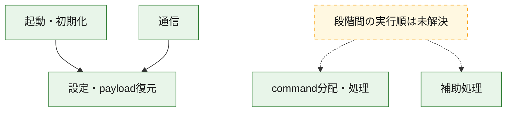
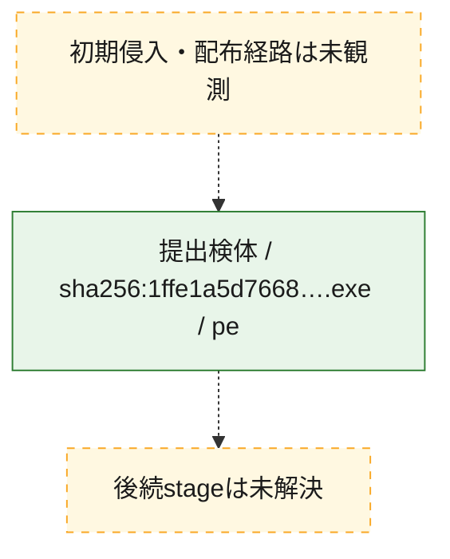
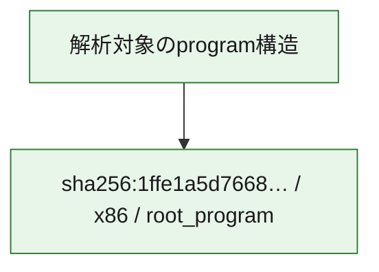

# 全体ロジック：1ffe1a5d7668b6b34c81e0ecd20d672f8d297f3ebe9645fdd19aea834a3de2e7

代表関数の静的証跡から、起動・初期化、設定・payload復元、通信、command分配・処理の処理群を確認しました。

## 読み方

- phaseの掲載順は解析上の整理順です。observed_call_edgesがない段階間の実行順を断定しません。
- 図の実線は静的に観測した関係、点線と黄色のノードは未観測・未解決の関係を示します。
- 図は静的な要約であり、動的実行を再現するものではありません。
- 詳細な関数解説とfingerprintは[STATIC-LOGIC.md](STATIC-LOGIC.md)を参照してください。

## 静的可視化

### 実行フロー

### 感染チェーン

### モジュール関係

## 処理段階

### 1. 起動・初期化

entry pointから初期化と後続処理への移行を確認します。
確度: `confirmed_static_function_evidence`

- `1ffe1a5d7668b6b34c81e0ecd20d672f8d297f3ebe9645fdd19aea834a3de2e7:ghidra:14000e57d` — 初期化と主要処理への分岐を行う入口関数です。 状態: `succeeded`、選定理由: `entry_point`, `meaningful_symbol_name`, `probable_go_main_user_code`, `reviewed_call_centrality:23`, `role:entrypoint`

### 2. 設定・payload復元

設定、resource、payload、暗号化データの復元・変換を確認します。
確度: `confirmed_static_function_evidence`

- `1ffe1a5d7668b6b34c81e0ecd20d672f8d297f3ebe9645fdd19aea834a3de2e7:ghidra:1400016e1` — 設定、resource、payloadなどの解析・変換を行う関数です。 状態: `succeeded`、選定理由: `meaningful_symbol_name`, `reviewed_call_centrality:1`, `role:config_or_data_transform`
- `1ffe1a5d7668b6b34c81e0ecd20d672f8d297f3ebe9645fdd19aea834a3de2e7:ghidra:140001c94` — 設定、resource、payloadなどの解析・変換を行う関数です。 状態: `succeeded`、選定理由: `meaningful_symbol_name`, `reviewed_call_centrality:1`, `role:config_or_data_transform`
- `1ffe1a5d7668b6b34c81e0ecd20d672f8d297f3ebe9645fdd19aea834a3de2e7:ghidra:1400022ae` — 暗号、hash、encoding、または復号処理に関係する関数です。 状態: `succeeded`、選定理由: `meaningful_symbol_name`, `reviewed_call_centrality:4`, `role:cryptographic_transform`
- `1ffe1a5d7668b6b34c81e0ecd20d672f8d297f3ebe9645fdd19aea834a3de2e7:ghidra:140002ecc` — 暗号、hash、encoding、または復号処理に関係する関数です。 状態: `succeeded`、選定理由: `meaningful_symbol_name`, `reviewed_call_centrality:4`, `role:cryptographic_transform`
- `1ffe1a5d7668b6b34c81e0ecd20d672f8d297f3ebe9645fdd19aea834a3de2e7:ghidra:140002fb6` — 暗号、hash、encoding、または復号処理に関係する関数です。 状態: `succeeded`、選定理由: `meaningful_symbol_name`, `reviewed_call_centrality:13`, `role:cryptographic_transform`
- `1ffe1a5d7668b6b34c81e0ecd20d672f8d297f3ebe9645fdd19aea834a3de2e7:ghidra:1400031e9` — 設定、resource、payloadなどの解析・変換を行う関数です。 状態: `succeeded`、選定理由: `meaningful_symbol_name`, `reviewed_call_centrality:13`, `role:config_or_data_transform`
- `1ffe1a5d7668b6b34c81e0ecd20d672f8d297f3ebe9645fdd19aea834a3de2e7:ghidra:140003caf` — 設定、resource、payloadなどの解析・変換を行う関数です。 状態: `succeeded`、選定理由: `meaningful_symbol_name`, `reviewed_call_centrality:1`, `role:config_or_data_transform`
- `1ffe1a5d7668b6b34c81e0ecd20d672f8d297f3ebe9645fdd19aea834a3de2e7:ghidra:140005281` — 設定、resource、payloadなどの解析・変換を行う関数です。 状態: `succeeded`、選定理由: `meaningful_symbol_name`, `reviewed_call_centrality:2`, `role:config_or_data_transform`
- `1ffe1a5d7668b6b34c81e0ecd20d672f8d297f3ebe9645fdd19aea834a3de2e7:ghidra:140005e1b` — 暗号、hash、encoding、または復号処理に関係する関数です。 状態: `succeeded`、選定理由: `meaningful_symbol_name`, `reviewed_call_centrality:2`, `role:cryptographic_transform`
- `1ffe1a5d7668b6b34c81e0ecd20d672f8d297f3ebe9645fdd19aea834a3de2e7:ghidra:140005f9d` — 設定、resource、payloadなどの解析・変換を行う関数です。 状態: `succeeded`、選定理由: `meaningful_symbol_name`, `reviewed_call_centrality:12`, `role:config_or_data_transform`
- `1ffe1a5d7668b6b34c81e0ecd20d672f8d297f3ebe9645fdd19aea834a3de2e7:ghidra:1400064e3` — 設定、resource、payloadなどの解析・変換を行う関数です。 状態: `succeeded`、選定理由: `meaningful_symbol_name`, `reviewed_call_centrality:9`, `role:config_or_data_transform`
- `1ffe1a5d7668b6b34c81e0ecd20d672f8d297f3ebe9645fdd19aea834a3de2e7:ghidra:140007e77` — 設定、resource、payloadなどの解析・変換を行う関数です。 状態: `succeeded`、選定理由: `meaningful_symbol_name`, `reviewed_call_centrality:1`, `role:config_or_data_transform`
- `1ffe1a5d7668b6b34c81e0ecd20d672f8d297f3ebe9645fdd19aea834a3de2e7:ghidra:1400096aa` — 設定、resource、payloadなどの解析・変換を行う関数です。 状態: `succeeded`、選定理由: `meaningful_symbol_name`, `reviewed_call_centrality:7`, `role:config_or_data_transform`

### 3. 通信

通信初期化、endpoint処理、送受信の役割を確認します。
確度: `confirmed_static_function_evidence`

- `1ffe1a5d7668b6b34c81e0ecd20d672f8d297f3ebe9645fdd19aea834a3de2e7:ghidra:140005bb3` — 通信初期化、送受信、またはendpoint処理に関係する関数です。 状態: `succeeded`、選定理由: `meaningful_symbol_name`, `reviewed_call_centrality:3`, `role:network_communication`
- `1ffe1a5d7668b6b34c81e0ecd20d672f8d297f3ebe9645fdd19aea834a3de2e7:ghidra:140006aa2` — 通信初期化、送受信、またはendpoint処理に関係する関数です。 状態: `succeeded`、選定理由: `meaningful_symbol_name`, `reviewed_call_centrality:3`, `role:network_communication`
- `1ffe1a5d7668b6b34c81e0ecd20d672f8d297f3ebe9645fdd19aea834a3de2e7:ghidra:140007559` — 通信初期化、送受信、またはendpoint処理に関係する関数です。 状態: `succeeded`、選定理由: `meaningful_symbol_name`, `reviewed_call_centrality:3`, `role:network_communication`
- `1ffe1a5d7668b6b34c81e0ecd20d672f8d297f3ebe9645fdd19aea834a3de2e7:ghidra:140008c69` — 通信初期化、送受信、またはendpoint処理に関係する関数です。 状態: `succeeded`、選定理由: `meaningful_symbol_name`, `reviewed_call_centrality:20`, `role:network_communication`
- `1ffe1a5d7668b6b34c81e0ecd20d672f8d297f3ebe9645fdd19aea834a3de2e7:ghidra:140008ea9` — 通信初期化、送受信、またはendpoint処理に関係する関数です。 状態: `succeeded`、選定理由: `meaningful_symbol_name`, `reviewed_call_centrality:6`, `role:network_communication`
- `1ffe1a5d7668b6b34c81e0ecd20d672f8d297f3ebe9645fdd19aea834a3de2e7:ghidra:140009206` — 通信初期化、送受信、またはendpoint処理に関係する関数です。 状態: `succeeded`、選定理由: `meaningful_symbol_name`, `reviewed_call_centrality:4`, `role:network_communication`
- `1ffe1a5d7668b6b34c81e0ecd20d672f8d297f3ebe9645fdd19aea834a3de2e7:ghidra:140009265` — 通信初期化、送受信、またはendpoint処理に関係する関数です。 状態: `succeeded`、選定理由: `meaningful_symbol_name`, `reviewed_call_centrality:4`, `role:network_communication`
- `1ffe1a5d7668b6b34c81e0ecd20d672f8d297f3ebe9645fdd19aea834a3de2e7:ghidra:14000ca20` — 通信初期化、送受信、またはendpoint処理に関係する関数です。 状態: `succeeded`、選定理由: `meaningful_symbol_name`, `reviewed_call_centrality:10`, `role:network_communication`
- `1ffe1a5d7668b6b34c81e0ecd20d672f8d297f3ebe9645fdd19aea834a3de2e7:ghidra:14000cb2e` — 通信初期化、送受信、またはendpoint処理に関係する関数です。 状態: `succeeded`、選定理由: `meaningful_symbol_name`, `reviewed_call_centrality:13`, `role:network_communication`
- `1ffe1a5d7668b6b34c81e0ecd20d672f8d297f3ebe9645fdd19aea834a3de2e7:ghidra:14000cd16` — 通信初期化、送受信、またはendpoint処理に関係する関数です。 状態: `succeeded`、選定理由: `meaningful_symbol_name`, `reviewed_call_centrality:26`, `role:network_communication`

### 4. command分配・処理

受信commandやtaskの解釈、分配、個別handlerへの移行を確認します。
確度: `confirmed_static_function_evidence`

- `1ffe1a5d7668b6b34c81e0ecd20d672f8d297f3ebe9645fdd19aea834a3de2e7:ghidra:140009e89` — commandの解釈、分配、または個別処理を担当する関数です。 状態: `succeeded`、選定理由: `meaningful_symbol_name`, `reviewed_call_centrality:5`, `role:command_dispatch_or_handler`
- `1ffe1a5d7668b6b34c81e0ecd20d672f8d297f3ebe9645fdd19aea834a3de2e7:ghidra:14000a200` — commandの解釈、分配、または個別処理を担当する関数です。 状態: `succeeded`、選定理由: `meaningful_symbol_name`, `reviewed_call_centrality:6`, `role:command_dispatch_or_handler`
- `1ffe1a5d7668b6b34c81e0ecd20d672f8d297f3ebe9645fdd19aea834a3de2e7:ghidra:14000a607` — commandの解釈、分配、または個別処理を担当する関数です。 状態: `succeeded`、選定理由: `meaningful_symbol_name`, `reviewed_call_centrality:8`, `role:command_dispatch_or_handler`
- `1ffe1a5d7668b6b34c81e0ecd20d672f8d297f3ebe9645fdd19aea834a3de2e7:ghidra:14000b17b` — commandの解釈、分配、または個別処理を担当する関数です。 状態: `succeeded`、選定理由: `meaningful_symbol_name`, `reviewed_call_centrality:6`, `role:command_dispatch_or_handler`
- `1ffe1a5d7668b6b34c81e0ecd20d672f8d297f3ebe9645fdd19aea834a3de2e7:ghidra:140014bc0` — commandの解釈、分配、または個別処理を担当する関数です。 状態: `succeeded`、選定理由: `meaningful_symbol_name`, `role:command_dispatch_or_handler`

### 5. 補助処理

主要処理を支える一般内部関数またはlibrary処理を確認します。
確度: `confirmed_static_function_evidence`

- `1ffe1a5d7668b6b34c81e0ecd20d672f8d297f3ebe9645fdd19aea834a3de2e7:ghidra:140001410` — 検体内部の一般処理を実装する関数です。 状態: `succeeded`、選定理由: `entry_point`, `meaningful_symbol_name`, `reviewed_call_centrality:1`
- `1ffe1a5d7668b6b34c81e0ecd20d672f8d297f3ebe9645fdd19aea834a3de2e7:ghidra:14000ed10` — compiler生成処理または汎用library処理とみられる関数です。 状態: `succeeded`、選定理由: `entry_point`, `meaningful_symbol_name`, `reviewed_call_centrality:1`
- `1ffe1a5d7668b6b34c81e0ecd20d672f8d297f3ebe9645fdd19aea834a3de2e7:ghidra:14000ed40` — compiler生成処理または汎用library処理とみられる関数です。 状態: `succeeded`、選定理由: `entry_point`, `meaningful_symbol_name`, `reviewed_call_centrality:2`

## 観測したcall関係

- `1ffe1a5d7668b6b34c81e0ecd20d672f8d297f3ebe9645fdd19aea834a3de2e7:ghidra:140002fb6` → `1ffe1a5d7668b6b34c81e0ecd20d672f8d297f3ebe9645fdd19aea834a3de2e7:ghidra:140002ecc` （`configuration` → `configuration`）
- `1ffe1a5d7668b6b34c81e0ecd20d672f8d297f3ebe9645fdd19aea834a3de2e7:ghidra:1400031e9` → `1ffe1a5d7668b6b34c81e0ecd20d672f8d297f3ebe9645fdd19aea834a3de2e7:ghidra:140002ecc` （`configuration` → `configuration`）
- `1ffe1a5d7668b6b34c81e0ecd20d672f8d297f3ebe9645fdd19aea834a3de2e7:ghidra:140005e1b` → `1ffe1a5d7668b6b34c81e0ecd20d672f8d297f3ebe9645fdd19aea834a3de2e7:ghidra:1400022ae` （`configuration` → `configuration`）
- `1ffe1a5d7668b6b34c81e0ecd20d672f8d297f3ebe9645fdd19aea834a3de2e7:ghidra:1400064e3` → `1ffe1a5d7668b6b34c81e0ecd20d672f8d297f3ebe9645fdd19aea834a3de2e7:ghidra:1400031e9` （`configuration` → `configuration`）
- `1ffe1a5d7668b6b34c81e0ecd20d672f8d297f3ebe9645fdd19aea834a3de2e7:ghidra:1400064e3` → `1ffe1a5d7668b6b34c81e0ecd20d672f8d297f3ebe9645fdd19aea834a3de2e7:ghidra:140005f9d` （`configuration` → `configuration`）
- `1ffe1a5d7668b6b34c81e0ecd20d672f8d297f3ebe9645fdd19aea834a3de2e7:ghidra:140006aa2` → `1ffe1a5d7668b6b34c81e0ecd20d672f8d297f3ebe9645fdd19aea834a3de2e7:ghidra:140005bb3` （`communication` → `communication`）
- `1ffe1a5d7668b6b34c81e0ecd20d672f8d297f3ebe9645fdd19aea834a3de2e7:ghidra:140008ea9` → `1ffe1a5d7668b6b34c81e0ecd20d672f8d297f3ebe9645fdd19aea834a3de2e7:ghidra:140008c69` （`communication` → `communication`）
- `1ffe1a5d7668b6b34c81e0ecd20d672f8d297f3ebe9645fdd19aea834a3de2e7:ghidra:14000b17b` → `1ffe1a5d7668b6b34c81e0ecd20d672f8d297f3ebe9645fdd19aea834a3de2e7:ghidra:14000a200` （`dispatch` → `dispatch`）
- `1ffe1a5d7668b6b34c81e0ecd20d672f8d297f3ebe9645fdd19aea834a3de2e7:ghidra:14000b17b` → `1ffe1a5d7668b6b34c81e0ecd20d672f8d297f3ebe9645fdd19aea834a3de2e7:ghidra:14000a607` （`dispatch` → `dispatch`）
- `1ffe1a5d7668b6b34c81e0ecd20d672f8d297f3ebe9645fdd19aea834a3de2e7:ghidra:14000ca20` → `1ffe1a5d7668b6b34c81e0ecd20d672f8d297f3ebe9645fdd19aea834a3de2e7:ghidra:140002fb6` （`communication` → `configuration`）
- `1ffe1a5d7668b6b34c81e0ecd20d672f8d297f3ebe9645fdd19aea834a3de2e7:ghidra:14000ca20` → `1ffe1a5d7668b6b34c81e0ecd20d672f8d297f3ebe9645fdd19aea834a3de2e7:ghidra:140009206` （`communication` → `communication`）
- `1ffe1a5d7668b6b34c81e0ecd20d672f8d297f3ebe9645fdd19aea834a3de2e7:ghidra:14000cb2e` → `1ffe1a5d7668b6b34c81e0ecd20d672f8d297f3ebe9645fdd19aea834a3de2e7:ghidra:140002fb6` （`communication` → `configuration`）
- `1ffe1a5d7668b6b34c81e0ecd20d672f8d297f3ebe9645fdd19aea834a3de2e7:ghidra:14000cb2e` → `1ffe1a5d7668b6b34c81e0ecd20d672f8d297f3ebe9645fdd19aea834a3de2e7:ghidra:140009206` （`communication` → `communication`）
- `1ffe1a5d7668b6b34c81e0ecd20d672f8d297f3ebe9645fdd19aea834a3de2e7:ghidra:14000cd16` → `1ffe1a5d7668b6b34c81e0ecd20d672f8d297f3ebe9645fdd19aea834a3de2e7:ghidra:140008ea9` （`communication` → `communication`）
- `1ffe1a5d7668b6b34c81e0ecd20d672f8d297f3ebe9645fdd19aea834a3de2e7:ghidra:14000cd16` → `1ffe1a5d7668b6b34c81e0ecd20d672f8d297f3ebe9645fdd19aea834a3de2e7:ghidra:14000ca20` （`communication` → `communication`）
- `1ffe1a5d7668b6b34c81e0ecd20d672f8d297f3ebe9645fdd19aea834a3de2e7:ghidra:14000cd16` → `1ffe1a5d7668b6b34c81e0ecd20d672f8d297f3ebe9645fdd19aea834a3de2e7:ghidra:14000cb2e` （`communication` → `communication`）
- `1ffe1a5d7668b6b34c81e0ecd20d672f8d297f3ebe9645fdd19aea834a3de2e7:ghidra:14000e57d` → `1ffe1a5d7668b6b34c81e0ecd20d672f8d297f3ebe9645fdd19aea834a3de2e7:ghidra:1400064e3` （`startup` → `configuration`）
- `ghidra-function:0d114cf71b87f329f4da5d29` → `ghidra-external:3ec2b7ac9be2f4d0d6d5bfec` （`unclassified` → `unclassified`）
- `ghidra-function:0d114cf71b87f329f4da5d29` → `ghidra-external:99f51e9a4d65c57e0b3f310c` （`unclassified` → `unclassified`）
- `ghidra-function:0d114cf71b87f329f4da5d29` → `ghidra-function:2a37ee57030ac594d307845c` （`unclassified` → `unclassified`）
- `ghidra-function:0d114cf71b87f329f4da5d29` → `ghidra-function:2e9cb0360df8d770467cbe27` （`unclassified` → `unclassified`）
- `ghidra-function:0d114cf71b87f329f4da5d29` → `ghidra-function:abbd5c4835ef70a83902b428` （`unclassified` → `unclassified`）
- `ghidra-function:0d114cf71b87f329f4da5d29` → `ghidra-function:d218c9de99abf20d53ca2673` （`unclassified` → `unclassified`）
- `ghidra-function:0f9ba7c400172a0d2901e0d5` → `ghidra-function:2f6e7ea7ca347dcec3e9a78e` （`unclassified` → `unclassified`）
- `ghidra-function:10286dd03dc90ceb1876dffa` → `ghidra-external:7a396ef91fe75cec1902a0d9` （`unclassified` → `unclassified`）
- `ghidra-function:10286dd03dc90ceb1876dffa` → `ghidra-external:d1fecbe98da8362ca64aa15f` （`unclassified` → `unclassified`）
- `ghidra-function:10286dd03dc90ceb1876dffa` → `ghidra-function:0c9b00a7ebe1f5dbc493869f` （`unclassified` → `unclassified`）
- `ghidra-function:10286dd03dc90ceb1876dffa` → `ghidra-function:25a8e98f67968bcae47aecd2` （`unclassified` → `unclassified`）
- `ghidra-function:10286dd03dc90ceb1876dffa` → `ghidra-function:f2024f98798885f40da8c83d` （`unclassified` → `unclassified`）
- `ghidra-function:13b8c597071e7bcf4881455a` → `ghidra-function:683a5d83da0b3e15384a2d4c` （`unclassified` → `unclassified`）
- `ghidra-function:174c7f4224ff1246f7365707` → `ghidra-external:0a1ed1359f798e22fed6e6b9` （`unclassified` → `unclassified`）
- `ghidra-function:174c7f4224ff1246f7365707` → `ghidra-external:24ea4089792727c530b17c69` （`unclassified` → `unclassified`）
- `ghidra-function:174c7f4224ff1246f7365707` → `ghidra-external:3ec2b7ac9be2f4d0d6d5bfec` （`unclassified` → `unclassified`）
- `ghidra-function:174c7f4224ff1246f7365707` → `ghidra-external:43c01ccb4893f6467c2275eb` （`unclassified` → `unclassified`）
- `ghidra-function:174c7f4224ff1246f7365707` → `ghidra-external:66fada6af5dc949d94ae92ec` （`unclassified` → `unclassified`）
- `ghidra-function:174c7f4224ff1246f7365707` → `ghidra-external:99f51e9a4d65c57e0b3f310c` （`unclassified` → `unclassified`）
- `ghidra-function:174c7f4224ff1246f7365707` → `ghidra-external:c7864e8a4dd1f3c8fb57a9b3` （`unclassified` → `unclassified`）
- `ghidra-function:174c7f4224ff1246f7365707` → `ghidra-function:00e633c92146cb49aea04703` （`unclassified` → `unclassified`）
- `ghidra-function:174c7f4224ff1246f7365707` → `ghidra-function:0e323a1adacc7bc6216f4fee` （`unclassified` → `unclassified`）
- `ghidra-function:174c7f4224ff1246f7365707` → `ghidra-function:11976e5e41fa67daa8e0349c` （`unclassified` → `unclassified`）
- `ghidra-function:174c7f4224ff1246f7365707` → `ghidra-function:1abebb91be2a1e7f98c1a665` （`unclassified` → `unclassified`）
- `ghidra-function:174c7f4224ff1246f7365707` → `ghidra-function:57a0f3a817c0ce52ddf7cd5b` （`unclassified` → `unclassified`）
- `ghidra-function:174c7f4224ff1246f7365707` → `ghidra-function:7f91b90b3cf139fd4b0797b9` （`unclassified` → `unclassified`）
- `ghidra-function:174c7f4224ff1246f7365707` → `ghidra-function:824335fd01803e5d5490c775` （`unclassified` → `unclassified`）
- `ghidra-function:174c7f4224ff1246f7365707` → `ghidra-function:96ac361bf64b97b20cd5fcc5` （`unclassified` → `unclassified`）
- `ghidra-function:174c7f4224ff1246f7365707` → `ghidra-function:abbd5c4835ef70a83902b428` （`unclassified` → `unclassified`）
- `ghidra-function:174c7f4224ff1246f7365707` → `ghidra-function:b06dde6f6e2a60b7bc771a18` （`unclassified` → `unclassified`）
- `ghidra-function:174c7f4224ff1246f7365707` → `ghidra-function:b5254bebde2c89dc35e26bc8` （`unclassified` → `unclassified`）
- `ghidra-function:174c7f4224ff1246f7365707` → `ghidra-function:b8242c6fe4a3aa0165fcfce2` （`unclassified` → `unclassified`）
- `ghidra-function:174c7f4224ff1246f7365707` → `ghidra-function:cb34ceddb4136441a1180738` （`unclassified` → `unclassified`）
- `ghidra-function:174c7f4224ff1246f7365707` → `ghidra-function:d1ce82f56a7640d4e35edad7` （`unclassified` → `unclassified`）
- `ghidra-function:174c7f4224ff1246f7365707` → `ghidra-function:d9ae60c36a5d599783f9bab0` （`unclassified` → `unclassified`）
- `ghidra-function:174c7f4224ff1246f7365707` → `ghidra-function:f40213a27224ad152a71c8e4` （`unclassified` → `unclassified`）
- `ghidra-function:174c7f4224ff1246f7365707` → `ghidra-function:f68d9fc68a4f025a1deb4170` （`unclassified` → `unclassified`）
- `ghidra-function:1d40bb280a19587e4d363b55` → `ghidra-external:0a1ed1359f798e22fed6e6b9` （`unclassified` → `unclassified`）
- `ghidra-function:1d40bb280a19587e4d363b55` → `ghidra-external:99f51e9a4d65c57e0b3f310c` （`unclassified` → `unclassified`）
- `ghidra-function:1d40bb280a19587e4d363b55` → `ghidra-external:e38065843047bd0f29b2412d` （`unclassified` → `unclassified`）
- `ghidra-function:1d40bb280a19587e4d363b55` → `ghidra-function:7531de4f92f2a96346e3d060` （`unclassified` → `unclassified`）
- `ghidra-function:2a37ee57030ac594d307845c` → `ghidra-external:7a396ef91fe75cec1902a0d9` （`unclassified` → `unclassified`）
- `ghidra-function:2a37ee57030ac594d307845c` → `ghidra-external:d1fecbe98da8362ca64aa15f` （`unclassified` → `unclassified`）
- `ghidra-function:2a37ee57030ac594d307845c` → `ghidra-function:0c9b00a7ebe1f5dbc493869f` （`unclassified` → `unclassified`）
- `ghidra-function:2a37ee57030ac594d307845c` → `ghidra-function:111dbc716f4a3dc56d854f2f` （`unclassified` → `unclassified`）
- `ghidra-function:2a37ee57030ac594d307845c` → `ghidra-function:25a8e98f67968bcae47aecd2` （`unclassified` → `unclassified`）
- `ghidra-function:2e9cb0360df8d770467cbe27` → `ghidra-function:0e323a1adacc7bc6216f4fee` （`unclassified` → `unclassified`）
- `ghidra-function:2e9cb0360df8d770467cbe27` → `ghidra-function:1abebb91be2a1e7f98c1a665` （`unclassified` → `unclassified`）
- `ghidra-function:2e9cb0360df8d770467cbe27` → `ghidra-function:29d4012cf3ba7f20470b6d11` （`unclassified` → `unclassified`）
- `ghidra-function:2e9cb0360df8d770467cbe27` → `ghidra-function:96ac361bf64b97b20cd5fcc5` （`unclassified` → `unclassified`）
- `ghidra-function:2e9cb0360df8d770467cbe27` → `ghidra-function:b5254bebde2c89dc35e26bc8` （`unclassified` → `unclassified`）
- `ghidra-function:2e9cb0360df8d770467cbe27` → `ghidra-function:d1ce82f56a7640d4e35edad7` （`unclassified` → `unclassified`）
- `ghidra-function:2e9cb0360df8d770467cbe27` → `ghidra-function:d9ae60c36a5d599783f9bab0` （`unclassified` → `unclassified`）
- `ghidra-function:3307c6974bc51c8325bc8b56` → `ghidra-function:a7e4410e7b0f44df873a4d61` （`unclassified` → `unclassified`）
- `ghidra-function:338091868a7dd74283934381` → `ghidra-function:1f04032797eafb0b91270816` （`unclassified` → `unclassified`）
- `ghidra-function:338091868a7dd74283934381` → `ghidra-function:6432e125e3cbdf0ba583f41f` （`unclassified` → `unclassified`）
- `ghidra-function:338091868a7dd74283934381` → `ghidra-function:8a1cf26a1410c3dd0c935673` （`unclassified` → `unclassified`）
- `ghidra-function:44c7a21af778432e11df1f11` → `ghidra-external:0a1ed1359f798e22fed6e6b9` （`unclassified` → `unclassified`）
- `ghidra-function:44c7a21af778432e11df1f11` → `ghidra-external:d1fecbe98da8362ca64aa15f` （`unclassified` → `unclassified`）
- `ghidra-function:44c7a21af778432e11df1f11` → `ghidra-function:d025103795b94b560aa9908a` （`unclassified` → `unclassified`）
- `ghidra-function:454f27ee7f7bfc571f7518c6` → `ghidra-external:57977e49ae88ea2cc5b396b2` （`unclassified` → `unclassified`）
- `ghidra-function:454f27ee7f7bfc571f7518c6` → `ghidra-external:99f51e9a4d65c57e0b3f310c` （`unclassified` → `unclassified`）
- `ghidra-function:454f27ee7f7bfc571f7518c6` → `ghidra-external:ae2f1763925f31faec148827` （`unclassified` → `unclassified`）
- `ghidra-function:454f27ee7f7bfc571f7518c6` → `ghidra-function:135406364f2559a62dd9e2dd` （`unclassified` → `unclassified`）
- `ghidra-function:454f27ee7f7bfc571f7518c6` → `ghidra-function:353aa8d268f8b202f80f3310` （`unclassified` → `unclassified`）
- `ghidra-function:454f27ee7f7bfc571f7518c6` → `ghidra-function:541684f7e4e46cc25b188a28` （`unclassified` → `unclassified`）
- `ghidra-function:454f27ee7f7bfc571f7518c6` → `ghidra-function:565c2835c7ff5fbd630f6620` （`unclassified` → `unclassified`）
- `ghidra-function:5069d5afb2ebadad5ca8ef73` → `ghidra-external:9f7fbb1f163c57f99c09385a` （`unclassified` → `unclassified`）
- `ghidra-function:5069d5afb2ebadad5ca8ef73` → `ghidra-function:8bbf450e66a343650e3be25b` （`unclassified` → `unclassified`）
- `ghidra-function:541684f7e4e46cc25b188a28` → `ghidra-external:0a1ed1359f798e22fed6e6b9` （`unclassified` → `unclassified`）
- `ghidra-function:541684f7e4e46cc25b188a28` → `ghidra-external:3b83c2e9b07c896d6211d599` （`unclassified` → `unclassified`）
- `ghidra-function:541684f7e4e46cc25b188a28` → `ghidra-external:ba88f17d92be6a50927482f2` （`unclassified` → `unclassified`）
- `ghidra-function:541684f7e4e46cc25b188a28` → `ghidra-external:c622ff8beaf38972c5074b5d` （`unclassified` → `unclassified`）
- `ghidra-function:541684f7e4e46cc25b188a28` → `ghidra-external:c8ec4c4e38c7f9cfd83e31c5` （`unclassified` → `unclassified`）
- `ghidra-function:541684f7e4e46cc25b188a28` → `ghidra-external:d1fecbe98da8362ca64aa15f` （`unclassified` → `unclassified`）
- `ghidra-function:541684f7e4e46cc25b188a28` → `ghidra-external:edb4593cdfebfecc4fcd8212` （`unclassified` → `unclassified`）
- `ghidra-function:541684f7e4e46cc25b188a28` → `ghidra-function:2fa36f6001ea1d51075824df` （`unclassified` → `unclassified`）
- `ghidra-function:541684f7e4e46cc25b188a28` → `ghidra-function:b6c980ec3d21b9a0229f8439` （`unclassified` → `unclassified`）
- `ghidra-function:541684f7e4e46cc25b188a28` → `ghidra-function:ba7565cf5ca144443b44db98` （`unclassified` → `unclassified`）
- `ghidra-function:541684f7e4e46cc25b188a28` → `ghidra-function:bc7d0eb69f00190763626c57` （`unclassified` → `unclassified`）
- `ghidra-function:541684f7e4e46cc25b188a28` → `ghidra-function:f4aa5000b2f2536e91649b94` （`unclassified` → `unclassified`）
- `ghidra-function:56078bf31ffc7e6339671cb4` → `ghidra-external:d1fecbe98da8362ca64aa15f` （`unclassified` → `unclassified`）
- `ghidra-function:56078bf31ffc7e6339671cb4` → `ghidra-external:facba229ae3f0ad4ab01c210` （`unclassified` → `unclassified`）
- `ghidra-function:565c2835c7ff5fbd630f6620` → `ghidra-external:3ec2b7ac9be2f4d0d6d5bfec` （`unclassified` → `unclassified`）
- `ghidra-function:565c2835c7ff5fbd630f6620` → `ghidra-external:66fada6af5dc949d94ae92ec` （`unclassified` → `unclassified`）
- `ghidra-function:565c2835c7ff5fbd630f6620` → `ghidra-external:7a396ef91fe75cec1902a0d9` （`unclassified` → `unclassified`）
- `ghidra-function:565c2835c7ff5fbd630f6620` → `ghidra-external:ae2f1763925f31faec148827` （`unclassified` → `unclassified`）
- `ghidra-function:565c2835c7ff5fbd630f6620` → `ghidra-external:d1fecbe98da8362ca64aa15f` （`unclassified` → `unclassified`）
- `ghidra-function:565c2835c7ff5fbd630f6620` → `ghidra-function:0c9b00a7ebe1f5dbc493869f` （`unclassified` → `unclassified`）
- `ghidra-function:565c2835c7ff5fbd630f6620` → `ghidra-function:111dbc716f4a3dc56d854f2f` （`unclassified` → `unclassified`）
- `ghidra-function:565c2835c7ff5fbd630f6620` → `ghidra-function:25a8e98f67968bcae47aecd2` （`unclassified` → `unclassified`）
- `ghidra-function:565c2835c7ff5fbd630f6620` → `ghidra-function:e214ead247b7bccbbbd6e34d` （`unclassified` → `unclassified`）
- `ghidra-function:565c2835c7ff5fbd630f6620` → `ghidra-function:f2024f98798885f40da8c83d` （`unclassified` → `unclassified`）
- `ghidra-function:565c2835c7ff5fbd630f6620` → `ghidra-function:f601585e7d5db40f87f3c4f6` （`unclassified` → `unclassified`）
- `ghidra-function:643909d9a2e2cae4b22f15cc` → `ghidra-external:3fb02f17e62aa3e0234ee7ac` （`unclassified` → `unclassified`）
- `ghidra-function:643909d9a2e2cae4b22f15cc` → `ghidra-external:84b9fc8bd7c851610ca37e9a` （`unclassified` → `unclassified`）
- `ghidra-function:643909d9a2e2cae4b22f15cc` → `ghidra-external:8ecb7ccad88853c7fee5e529` （`unclassified` → `unclassified`）
- `ghidra-function:643909d9a2e2cae4b22f15cc` → `ghidra-external:ad357f9dc1275508ee1e05de` （`unclassified` → `unclassified`）
- `ghidra-function:643909d9a2e2cae4b22f15cc` → `ghidra-external:ae2f1763925f31faec148827` （`unclassified` → `unclassified`）
- `ghidra-function:643909d9a2e2cae4b22f15cc` → `ghidra-external:baa001dba0b5400b46df06f7` （`unclassified` → `unclassified`）
- `ghidra-function:643909d9a2e2cae4b22f15cc` → `ghidra-external:d1fecbe98da8362ca64aa15f` （`unclassified` → `unclassified`）
- `ghidra-function:986c030bf05120166ba553e6` → `ghidra-function:87e16ee0def2b2c10f966927` （`unclassified` → `unclassified`）
- `ghidra-function:a68f60b50fb59980530b1c16` → `ghidra-external:3ec2b7ac9be2f4d0d6d5bfec` （`unclassified` → `unclassified`）
- `ghidra-function:a68f60b50fb59980530b1c16` → `ghidra-external:66fada6af5dc949d94ae92ec` （`unclassified` → `unclassified`）
- `ghidra-function:a68f60b50fb59980530b1c16` → `ghidra-external:ae2f1763925f31faec148827` （`unclassified` → `unclassified`）
- `ghidra-function:a68f60b50fb59980530b1c16` → `ghidra-external:ccd91ad1c4b67d59c1fe4fa7` （`unclassified` → `unclassified`）
- `ghidra-function:a68f60b50fb59980530b1c16` → `ghidra-function:1d55eba47f4201b2ce6cd537` （`unclassified` → `unclassified`）
- `ghidra-function:a68f60b50fb59980530b1c16` → `ghidra-function:3558deecae9973b9c905d874` （`unclassified` → `unclassified`）
- `ghidra-function:a68f60b50fb59980530b1c16` → `ghidra-function:3e739b4110ccb0461b5063c0` （`unclassified` → `unclassified`）
- `ghidra-function:a68f60b50fb59980530b1c16` → `ghidra-function:454f27ee7f7bfc571f7518c6` （`unclassified` → `unclassified`）
- `ghidra-function:a68f60b50fb59980530b1c16` → `ghidra-function:749d37afd6f6387035ed5ff8` （`unclassified` → `unclassified`）
- `ghidra-function:a68f60b50fb59980530b1c16` → `ghidra-function:8ac4e30719d55c271266f0ad` （`unclassified` → `unclassified`）
- `ghidra-function:a68f60b50fb59980530b1c16` → `ghidra-function:9387a152ea3f018e7411c47b` （`unclassified` → `unclassified`）
- `ghidra-function:a68f60b50fb59980530b1c16` → `ghidra-function:991673081ef333e3001daf70` （`unclassified` → `unclassified`）
- `ghidra-function:a68f60b50fb59980530b1c16` → `ghidra-function:9ae80774e900dd84371b8fec` （`unclassified` → `unclassified`）
- `ghidra-function:a68f60b50fb59980530b1c16` → `ghidra-function:b617583dfb1e5372267400da` （`unclassified` → `unclassified`）
- `ghidra-function:a68f60b50fb59980530b1c16` → `ghidra-function:c3ae4f99e1a3cc530b0f3b09` （`unclassified` → `unclassified`）
- `ghidra-function:a68f60b50fb59980530b1c16` → `ghidra-function:cba879d0c558ab25cf9213c1` （`unclassified` → `unclassified`）
- `ghidra-function:a68f60b50fb59980530b1c16` → `ghidra-function:d1b2b0b03981363341ff1585` （`unclassified` → `unclassified`）
- `ghidra-function:a68f60b50fb59980530b1c16` → `ghidra-function:d1ce82f56a7640d4e35edad7` （`unclassified` → `unclassified`）
- `ghidra-function:a68f60b50fb59980530b1c16` → `ghidra-function:d9eda7cd0cd30933b833bddc` （`unclassified` → `unclassified`）
- `ghidra-function:a68f60b50fb59980530b1c16` → `ghidra-function:df0c76d727a4265d35bbc7fa` （`unclassified` → `unclassified`）
- `ghidra-function:ab0a017b8e6f40400fefd923` → `ghidra-function:64e67e7cc9b41b3bf2fae505` （`unclassified` → `unclassified`）
- `ghidra-function:ab0a017b8e6f40400fefd923` → `ghidra-function:6de66f6f84b9736e9750bbe9` （`unclassified` → `unclassified`）
- `ghidra-function:b06dde6f6e2a60b7bc771a18` → `ghidra-external:99f51e9a4d65c57e0b3f310c` （`unclassified` → `unclassified`）
- `ghidra-function:b06dde6f6e2a60b7bc771a18` → `ghidra-function:0e323a1adacc7bc6216f4fee` （`unclassified` → `unclassified`）
- `ghidra-function:b06dde6f6e2a60b7bc771a18` → `ghidra-function:11976e5e41fa67daa8e0349c` （`unclassified` → `unclassified`）
- `ghidra-function:b06dde6f6e2a60b7bc771a18` → `ghidra-function:1abebb91be2a1e7f98c1a665` （`unclassified` → `unclassified`）
- `ghidra-function:b06dde6f6e2a60b7bc771a18` → `ghidra-function:5069d5afb2ebadad5ca8ef73` （`unclassified` → `unclassified`）
- `ghidra-function:b06dde6f6e2a60b7bc771a18` → `ghidra-function:543179da24fe437179b56da9` （`unclassified` → `unclassified`）
- `ghidra-function:b06dde6f6e2a60b7bc771a18` → `ghidra-function:824335fd01803e5d5490c775` （`unclassified` → `unclassified`）
- `ghidra-function:b06dde6f6e2a60b7bc771a18` → `ghidra-function:b5254bebde2c89dc35e26bc8` （`unclassified` → `unclassified`）
- `ghidra-function:b06dde6f6e2a60b7bc771a18` → `ghidra-function:b82642d8ab0f3360a7377ef8` （`unclassified` → `unclassified`）
- `ghidra-function:b06dde6f6e2a60b7bc771a18` → `ghidra-function:d1ce82f56a7640d4e35edad7` （`unclassified` → `unclassified`）
- `ghidra-function:b06dde6f6e2a60b7bc771a18` → `ghidra-function:d9ae60c36a5d599783f9bab0` （`unclassified` → `unclassified`）
- `ghidra-function:b06dde6f6e2a60b7bc771a18` → `ghidra-function:ea8d01236bd7e31a27d6f230` （`unclassified` → `unclassified`）
- `ghidra-function:ba7565cf5ca144443b44db98` → `ghidra-function:bc7d0eb69f00190763626c57` （`unclassified` → `unclassified`）
- `ghidra-function:ba7565cf5ca144443b44db98` → `ghidra-function:f4aa5000b2f2536e91649b94` （`unclassified` → `unclassified`）
- `ghidra-function:c01e6d2a48879eac06564a3c` → `ghidra-external:3ec2b7ac9be2f4d0d6d5bfec` （`unclassified` → `unclassified`）
- `ghidra-function:c01e6d2a48879eac06564a3c` → `ghidra-function:5eaa08d0a14de219eb8a826b` （`unclassified` → `unclassified`）
- `ghidra-function:c01e6d2a48879eac06564a3c` → `ghidra-function:ab0a017b8e6f40400fefd923` （`unclassified` → `unclassified`）
- `ghidra-function:c115d017f289b242d3f3f684` → `ghidra-external:57977e49ae88ea2cc5b396b2` （`unclassified` → `unclassified`）
- `ghidra-function:c115d017f289b242d3f3f684` → `ghidra-external:84b9fc8bd7c851610ca37e9a` （`unclassified` → `unclassified`）
- `ghidra-function:c115d017f289b242d3f3f684` → `ghidra-external:a0b0d1c584cc44db0c5d9144` （`unclassified` → `unclassified`）
- `ghidra-function:c115d017f289b242d3f3f684` → `ghidra-external:ad357f9dc1275508ee1e05de` （`unclassified` → `unclassified`）
- `ghidra-function:c115d017f289b242d3f3f684` → `ghidra-external:ae2f1763925f31faec148827` （`unclassified` → `unclassified`）
- `ghidra-function:c115d017f289b242d3f3f684` → `ghidra-function:687b0a59cab20b2e55c06933` （`unclassified` → `unclassified`）
- `ghidra-function:c115d017f289b242d3f3f684` → `ghidra-function:b8242c6fe4a3aa0165fcfce2` （`unclassified` → `unclassified`）
- `ghidra-function:c115d017f289b242d3f3f684` → `ghidra-function:ca53e60f85c06ab8e3d1b2bc` （`unclassified` → `unclassified`）
- `ghidra-function:c115d017f289b242d3f3f684` → `ghidra-function:d93650f1dfe4a714c924af4b` （`unclassified` → `unclassified`）
- `ghidra-function:c115d017f289b242d3f3f684` → `ghidra-function:e30848d5860b7a653f59305c` （`unclassified` → `unclassified`）
- `ghidra-function:c115d017f289b242d3f3f684` → `ghidra-function:ee7bd665de382b9f4fb0b7f2` （`unclassified` → `unclassified`）
- `ghidra-function:c115d017f289b242d3f3f684` → `ghidra-function:f17aee041c8a590e074e601e` （`unclassified` → `unclassified`）
- `ghidra-function:cb34ceddb4136441a1180738` → `ghidra-external:ae2f1763925f31faec148827` （`unclassified` → `unclassified`）
- `ghidra-function:cb34ceddb4136441a1180738` → `ghidra-function:135406364f2559a62dd9e2dd` （`unclassified` → `unclassified`）
- `ghidra-function:cb34ceddb4136441a1180738` → `ghidra-function:353aa8d268f8b202f80f3310` （`unclassified` → `unclassified`）
- `ghidra-function:cb34ceddb4136441a1180738` → `ghidra-function:c115d017f289b242d3f3f684` （`unclassified` → `unclassified`）
- `ghidra-function:ea8d01236bd7e31a27d6f230` → `ghidra-external:0a1ed1359f798e22fed6e6b9` （`unclassified` → `unclassified`）
- `ghidra-function:ea8d01236bd7e31a27d6f230` → `ghidra-external:3b83c2e9b07c896d6211d599` （`unclassified` → `unclassified`）
- `ghidra-function:ea8d01236bd7e31a27d6f230` → `ghidra-external:ba88f17d92be6a50927482f2` （`unclassified` → `unclassified`）
- `ghidra-function:ea8d01236bd7e31a27d6f230` → `ghidra-external:c8ec4c4e38c7f9cfd83e31c5` （`unclassified` → `unclassified`）
- `ghidra-function:ea8d01236bd7e31a27d6f230` → `ghidra-external:edb4593cdfebfecc4fcd8212` （`unclassified` → `unclassified`）
- `ghidra-function:ea8d01236bd7e31a27d6f230` → `ghidra-function:2fa36f6001ea1d51075824df` （`unclassified` → `unclassified`）
- `ghidra-function:ea8d01236bd7e31a27d6f230` → `ghidra-function:3558deecae9973b9c905d874` （`unclassified` → `unclassified`）
- `ghidra-function:ea8d01236bd7e31a27d6f230` → `ghidra-function:b6c980ec3d21b9a0229f8439` （`unclassified` → `unclassified`）
- `ghidra-function:ea8d01236bd7e31a27d6f230` → `ghidra-function:ba7565cf5ca144443b44db98` （`unclassified` → `unclassified`）
- `ghidra-function:ea8d01236bd7e31a27d6f230` → `ghidra-function:bc7d0eb69f00190763626c57` （`unclassified` → `unclassified`）
- `ghidra-function:ea8d01236bd7e31a27d6f230` → `ghidra-function:f4aa5000b2f2536e91649b94` （`unclassified` → `unclassified`）
- `ghidra-function:edc31557f5e0b763a57a2235` → `ghidra-external:baa001dba0b5400b46df06f7` （`unclassified` → `unclassified`）
- `ghidra-function:f4e6df152978597e56a270a4` → `ghidra-function:138f6fa51c589b9e798c5839` （`unclassified` → `unclassified`）
- `ghidra-function:f4e6df152978597e56a270a4` → `ghidra-function:338091868a7dd74283934381` （`unclassified` → `unclassified`）
- `ghidra-function:f68d9fc68a4f025a1deb4170` → `ghidra-external:99f51e9a4d65c57e0b3f310c` （`unclassified` → `unclassified`）
- `ghidra-function:f68d9fc68a4f025a1deb4170` → `ghidra-function:0e323a1adacc7bc6216f4fee` （`unclassified` → `unclassified`）
- `ghidra-function:f68d9fc68a4f025a1deb4170` → `ghidra-function:11976e5e41fa67daa8e0349c` （`unclassified` → `unclassified`）
- `ghidra-function:f68d9fc68a4f025a1deb4170` → `ghidra-function:1abebb91be2a1e7f98c1a665` （`unclassified` → `unclassified`）
- `ghidra-function:f68d9fc68a4f025a1deb4170` → `ghidra-function:5069d5afb2ebadad5ca8ef73` （`unclassified` → `unclassified`）
- `ghidra-function:f68d9fc68a4f025a1deb4170` → `ghidra-function:824335fd01803e5d5490c775` （`unclassified` → `unclassified`）
- `ghidra-function:f68d9fc68a4f025a1deb4170` → `ghidra-function:b5254bebde2c89dc35e26bc8` （`unclassified` → `unclassified`）
- `ghidra-function:f68d9fc68a4f025a1deb4170` → `ghidra-function:d1ce82f56a7640d4e35edad7` （`unclassified` → `unclassified`）
- `ghidra-function:f68d9fc68a4f025a1deb4170` → `ghidra-function:ea8d01236bd7e31a27d6f230` （`unclassified` → `unclassified`）
- `ghidra-function:f88755f3cc59116cd39d242b` → `ghidra-external:d3524c5f845a80849b2e58d4` （`unclassified` → `unclassified`）
- `ghidra-function:f88755f3cc59116cd39d242b` → `ghidra-function:a7e4410e7b0f44df873a4d61` （`unclassified` → `unclassified`）
- `ghidra-function:fc48f9359f85b5e4e7571f9c` → `ghidra-function:a8006788cb15f2291cc1c3ed` （`unclassified` → `unclassified`）

## 解析範囲と制約

- 選定外関数は全体inventoryへ残しますが、関数本体の個別解説対象にはしていません。
- indirect call、難読化、packer、VM、壊れたcontrol flowによりcall関係が欠落する場合があります。
- 文書は静的解析に基づき、検体実行や外部通信による動的確認は行っていません。
