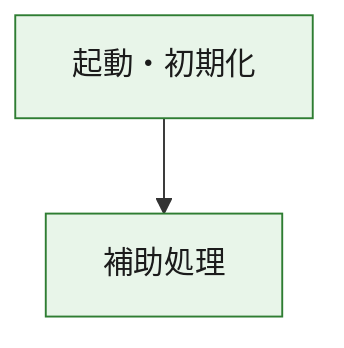
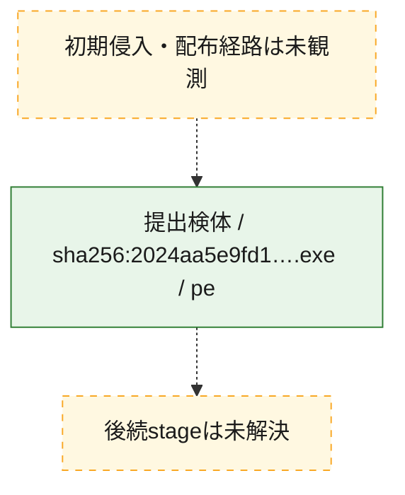
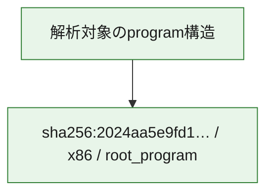

# 全体ロジック：2024aa5e9fd1da58f451547bbcb4989245b85b164e46beeface5bd0167033a21

代表関数の静的証跡から、起動・初期化の処理群を確認しました。

## 読み方

- phaseの掲載順は解析上の整理順です。observed_call_edgesがない段階間の実行順を断定しません。
- 図の実線は静的に観測した関係、点線と黄色のノードは未観測・未解決の関係を示します。
- 図は静的な要約であり、動的実行を再現するものではありません。
- 詳細な関数解説とfingerprintは[STATIC-LOGIC.md](STATIC-LOGIC.md)を参照してください。

## 静的可視化

### 実行フロー

### 感染チェーン

### モジュール関係

## 処理段階

### 1. 起動・初期化

entry pointから初期化と後続処理への移行を確認します。
確度: `confirmed_static_function_evidence`

- `2024aa5e9fd1da58f451547bbcb4989245b85b164e46beeface5bd0167033a21:ghidra:180001010` — 初期化と主要処理への分岐を行う入口関数です。 状態: `succeeded`、選定理由: `entry_point`, `meaningful_symbol_name`, `reviewed_call_centrality:22`, `role:entrypoint`, `small_program_complete_context`

### 2. 補助処理

主要処理を支える一般内部関数またはlibrary処理を確認します。
確度: `confirmed_static_function_evidence`

- `2024aa5e9fd1da58f451547bbcb4989245b85b164e46beeface5bd0167033a21:ghidra:180001240` — 検体内部の一般処理を実装する関数です。 状態: `succeeded`、選定理由: `context_representative`, `reviewed_call_centrality:2`, `small_program_complete_context`
- `2024aa5e9fd1da58f451547bbcb4989245b85b164e46beeface5bd0167033a21:ghidra:180001350` — 検体内部の一般処理を実装する関数です。 状態: `succeeded`、選定理由: `context_representative`, `reviewed_call_centrality:25`, `small_program_complete_context`
- `2024aa5e9fd1da58f451547bbcb4989245b85b164e46beeface5bd0167033a21:ghidra:180003780` — 検体内部の一般処理を実装する関数です。 状態: `succeeded`、選定理由: `context_representative`, `reviewed_call_centrality:2`, `small_program_complete_context`
- `2024aa5e9fd1da58f451547bbcb4989245b85b164e46beeface5bd0167033a21:ghidra:1800038e0` — 検体内部の一般処理を実装する関数です。 状態: `succeeded`、選定理由: `context_representative`, `reviewed_call_centrality:2`, `small_program_complete_context`

## 観測したcall関係

- `2024aa5e9fd1da58f451547bbcb4989245b85b164e46beeface5bd0167033a21:ghidra:180001010` → `2024aa5e9fd1da58f451547bbcb4989245b85b164e46beeface5bd0167033a21:ghidra:180001240` （`startup` → `support`）
- `2024aa5e9fd1da58f451547bbcb4989245b85b164e46beeface5bd0167033a21:ghidra:180001010` → `2024aa5e9fd1da58f451547bbcb4989245b85b164e46beeface5bd0167033a21:ghidra:180001350` （`startup` → `support`）
- `2024aa5e9fd1da58f451547bbcb4989245b85b164e46beeface5bd0167033a21:ghidra:180001350` → `2024aa5e9fd1da58f451547bbcb4989245b85b164e46beeface5bd0167033a21:ghidra:180001240` （`support` → `support`）
- `2024aa5e9fd1da58f451547bbcb4989245b85b164e46beeface5bd0167033a21:ghidra:180001350` → `2024aa5e9fd1da58f451547bbcb4989245b85b164e46beeface5bd0167033a21:ghidra:180003780` （`support` → `support`）
- `2024aa5e9fd1da58f451547bbcb4989245b85b164e46beeface5bd0167033a21:ghidra:180001350` → `2024aa5e9fd1da58f451547bbcb4989245b85b164e46beeface5bd0167033a21:ghidra:1800038e0` （`support` → `support`）
- `2024aa5e9fd1da58f451547bbcb4989245b85b164e46beeface5bd0167033a21:ghidra:180003780` → `2024aa5e9fd1da58f451547bbcb4989245b85b164e46beeface5bd0167033a21:ghidra:1800038e0` （`support` → `support`）
- `ghidra-function:1b3fa428862220ef8c956a71` → `ghidra-function:6ae7087d2b2a8e6324966cb1` （`unclassified` → `unclassified`）
- `ghidra-function:821810253978b16065074b22` → `ghidra-function:128ae6f35d9bcc29d314b46f` （`unclassified` → `unclassified`）
- `ghidra-function:821810253978b16065074b22` → `ghidra-function:325957eeab6b035cc5967e5b` （`unclassified` → `unclassified`）
- `ghidra-function:821810253978b16065074b22` → `ghidra-function:4e444c23d4158d1865e72cc9` （`unclassified` → `unclassified`）
- `ghidra-function:821810253978b16065074b22` → `ghidra-function:4f31f5d5793dbf7a3a437d79` （`unclassified` → `unclassified`）
- `ghidra-function:821810253978b16065074b22` → `ghidra-function:8e3f677ae19cdee9efa421bb` （`unclassified` → `unclassified`）
- `ghidra-function:821810253978b16065074b22` → `ghidra-function:a585d85ce7bb862c3bf72b14` （`unclassified` → `unclassified`）
- `ghidra-function:821810253978b16065074b22` → `ghidra-function:c1825cde9d03d78c64f4c21a` （`unclassified` → `unclassified`）
- `ghidra-function:821810253978b16065074b22` → `ghidra-function:c6d1b01db68a72b409cfe494` （`unclassified` → `unclassified`）
- `ghidra-function:821810253978b16065074b22` → `ghidra-function:c73755d04ad12bfa41a92432` （`unclassified` → `unclassified`）
- `ghidra-function:821810253978b16065074b22` → `ghidra-function:c7e4f47c79608ca3e6f01454` （`unclassified` → `unclassified`）
- `ghidra-function:821810253978b16065074b22` → `ghidra-function:d078f879f3ffa054dbdc1bac` （`unclassified` → `unclassified`）
- `ghidra-function:821810253978b16065074b22` → `ghidra-function:f87ea8cefb23943339451a4e` （`unclassified` → `unclassified`）
- `ghidra-function:c73755d04ad12bfa41a92432` → `ghidra-external:0c52bc16f613fec8e8034c20` （`unclassified` → `unclassified`）
- `ghidra-function:c73755d04ad12bfa41a92432` → `ghidra-external:1ba06e9b1aec02108e0a01bc` （`unclassified` → `unclassified`）
- `ghidra-function:c73755d04ad12bfa41a92432` → `ghidra-external:218d8b3ce07d2e0d1d9cc48d` （`unclassified` → `unclassified`）
- `ghidra-function:c73755d04ad12bfa41a92432` → `ghidra-external:251da73889c202896642bae4` （`unclassified` → `unclassified`）
- `ghidra-function:c73755d04ad12bfa41a92432` → `ghidra-external:25364c5d5bb4353a8e25a829` （`unclassified` → `unclassified`）
- `ghidra-function:c73755d04ad12bfa41a92432` → `ghidra-external:2c2f4f95ff61c1b249fdce83` （`unclassified` → `unclassified`）
- `ghidra-function:c73755d04ad12bfa41a92432` → `ghidra-external:4a7a958311e4f6983a202e5f` （`unclassified` → `unclassified`）
- `ghidra-function:c73755d04ad12bfa41a92432` → `ghidra-external:4c1fecb099e23afc13c0d264` （`unclassified` → `unclassified`）
- `ghidra-function:c73755d04ad12bfa41a92432` → `ghidra-external:50b87bcc86abf7e6e9ea8207` （`unclassified` → `unclassified`）
- `ghidra-function:c73755d04ad12bfa41a92432` → `ghidra-external:51d49fe5fdaa2cf95d2b8e68` （`unclassified` → `unclassified`）
- `ghidra-function:c73755d04ad12bfa41a92432` → `ghidra-external:90584fb594c576dc381ec653` （`unclassified` → `unclassified`）
- `ghidra-function:c73755d04ad12bfa41a92432` → `ghidra-external:97bd84d2e4c40e95eda14c23` （`unclassified` → `unclassified`）
- `ghidra-function:c73755d04ad12bfa41a92432` → `ghidra-external:a6077583244ecfda3797c32b` （`unclassified` → `unclassified`）
- `ghidra-function:c73755d04ad12bfa41a92432` → `ghidra-external:aad3dcb1d2b67ebda4185a7c` （`unclassified` → `unclassified`）
- `ghidra-function:c73755d04ad12bfa41a92432` → `ghidra-external:c6fbb8bdf36ef084bafbe176` （`unclassified` → `unclassified`）
- `ghidra-function:c73755d04ad12bfa41a92432` → `ghidra-external:c7163043acd9a38ffa60965a` （`unclassified` → `unclassified`）
- `ghidra-function:c73755d04ad12bfa41a92432` → `ghidra-external:d310ae7eb630f72c639a9cf7` （`unclassified` → `unclassified`）
- `ghidra-function:c73755d04ad12bfa41a92432` → `ghidra-external:d5a939b56b49d181943e7b0c` （`unclassified` → `unclassified`）
- `ghidra-function:c73755d04ad12bfa41a92432` → `ghidra-external:e3979db8e5a8d6e26e27712e` （`unclassified` → `unclassified`）
- `ghidra-function:c73755d04ad12bfa41a92432` → `ghidra-external:e5802ad1992c39df09c355a4` （`unclassified` → `unclassified`）
- `ghidra-function:c73755d04ad12bfa41a92432` → `ghidra-external:e6a2ff37dc94043fa4b6efc3` （`unclassified` → `unclassified`）
- `ghidra-function:c73755d04ad12bfa41a92432` → `ghidra-function:1b3fa428862220ef8c956a71` （`unclassified` → `unclassified`）
- `ghidra-function:c73755d04ad12bfa41a92432` → `ghidra-function:6ae7087d2b2a8e6324966cb1` （`unclassified` → `unclassified`）
- `ghidra-function:c73755d04ad12bfa41a92432` → `ghidra-function:c7e4f47c79608ca3e6f01454` （`unclassified` → `unclassified`）

## 解析範囲と制約

- 選定外関数は全体inventoryへ残しますが、関数本体の個別解説対象にはしていません。
- indirect call、難読化、packer、VM、壊れたcontrol flowによりcall関係が欠落する場合があります。
- 文書は静的解析に基づき、検体実行や外部通信による動的確認は行っていません。
