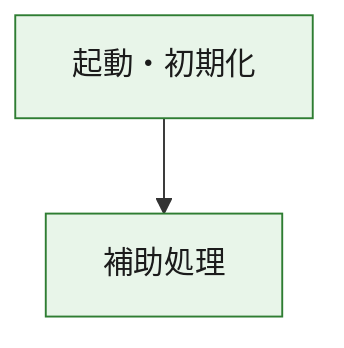
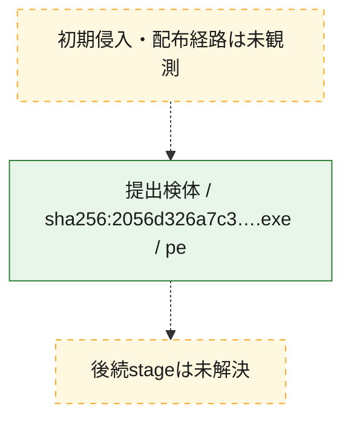
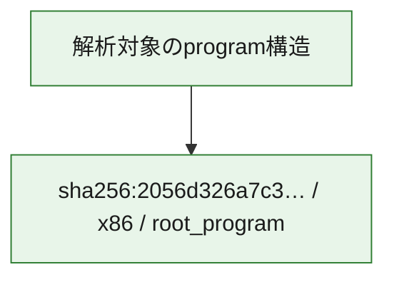

# 全体ロジック：2056d326a7c3dc17baeee3a024aa2f42a26cb321bce87c988a17f0ea73c2d70b

代表関数の静的証跡から、起動・初期化の処理群を確認しました。

## 読み方

- phaseの掲載順は解析上の整理順です。observed_call_edgesがない段階間の実行順を断定しません。
- 図の実線は静的に観測した関係、点線と黄色のノードは未観測・未解決の関係を示します。
- 図は静的な要約であり、動的実行を再現するものではありません。
- 詳細な関数解説とfingerprintは[STATIC-LOGIC.md](STATIC-LOGIC.md)を参照してください。

## 静的可視化

### 実行フロー

### 感染チェーン

### モジュール関係

## 処理段階

### 1. 起動・初期化

entry pointから初期化と後続処理への移行を確認します。
確度: `confirmed_static_function_evidence`

- `2056d326a7c3dc17baeee3a024aa2f42a26cb321bce87c988a17f0ea73c2d70b:ghidra:180001010` — 初期化と主要処理への分岐を行う入口関数です。 状態: `succeeded`、選定理由: `entry_point`, `meaningful_symbol_name`, `reviewed_call_centrality:22`, `role:entrypoint`, `small_program_complete_context`

### 2. 補助処理

主要処理を支える一般内部関数またはlibrary処理を確認します。
確度: `confirmed_static_function_evidence`

- `2056d326a7c3dc17baeee3a024aa2f42a26cb321bce87c988a17f0ea73c2d70b:ghidra:180001240` — 検体内部の一般処理を実装する関数です。 状態: `succeeded`、選定理由: `context_representative`, `reviewed_call_centrality:2`, `small_program_complete_context`
- `2056d326a7c3dc17baeee3a024aa2f42a26cb321bce87c988a17f0ea73c2d70b:ghidra:180001350` — 検体内部の一般処理を実装する関数です。 状態: `succeeded`、選定理由: `context_representative`, `reviewed_call_centrality:25`, `small_program_complete_context`
- `2056d326a7c3dc17baeee3a024aa2f42a26cb321bce87c988a17f0ea73c2d70b:ghidra:180003780` — 検体内部の一般処理を実装する関数です。 状態: `succeeded`、選定理由: `context_representative`, `reviewed_call_centrality:2`, `small_program_complete_context`
- `2056d326a7c3dc17baeee3a024aa2f42a26cb321bce87c988a17f0ea73c2d70b:ghidra:1800038e0` — 検体内部の一般処理を実装する関数です。 状態: `succeeded`、選定理由: `context_representative`, `reviewed_call_centrality:2`, `small_program_complete_context`

## 観測したcall関係

- `2056d326a7c3dc17baeee3a024aa2f42a26cb321bce87c988a17f0ea73c2d70b:ghidra:180001010` → `2056d326a7c3dc17baeee3a024aa2f42a26cb321bce87c988a17f0ea73c2d70b:ghidra:180001240` （`startup` → `support`）
- `2056d326a7c3dc17baeee3a024aa2f42a26cb321bce87c988a17f0ea73c2d70b:ghidra:180001010` → `2056d326a7c3dc17baeee3a024aa2f42a26cb321bce87c988a17f0ea73c2d70b:ghidra:180001350` （`startup` → `support`）
- `2056d326a7c3dc17baeee3a024aa2f42a26cb321bce87c988a17f0ea73c2d70b:ghidra:180001350` → `2056d326a7c3dc17baeee3a024aa2f42a26cb321bce87c988a17f0ea73c2d70b:ghidra:180001240` （`support` → `support`）
- `2056d326a7c3dc17baeee3a024aa2f42a26cb321bce87c988a17f0ea73c2d70b:ghidra:180001350` → `2056d326a7c3dc17baeee3a024aa2f42a26cb321bce87c988a17f0ea73c2d70b:ghidra:180003780` （`support` → `support`）
- `2056d326a7c3dc17baeee3a024aa2f42a26cb321bce87c988a17f0ea73c2d70b:ghidra:180001350` → `2056d326a7c3dc17baeee3a024aa2f42a26cb321bce87c988a17f0ea73c2d70b:ghidra:1800038e0` （`support` → `support`）
- `2056d326a7c3dc17baeee3a024aa2f42a26cb321bce87c988a17f0ea73c2d70b:ghidra:180003780` → `2056d326a7c3dc17baeee3a024aa2f42a26cb321bce87c988a17f0ea73c2d70b:ghidra:1800038e0` （`support` → `support`）
- `ghidra-function:68e524106ec44c9ec1fdb3de` → `ghidra-external:005c6e2513dab3f7369ba2e7` （`unclassified` → `unclassified`）
- `ghidra-function:68e524106ec44c9ec1fdb3de` → `ghidra-external:1ed9c1535a200beff0731e02` （`unclassified` → `unclassified`）
- `ghidra-function:68e524106ec44c9ec1fdb3de` → `ghidra-external:2e543abf8cfeffb9775a4927` （`unclassified` → `unclassified`）
- `ghidra-function:68e524106ec44c9ec1fdb3de` → `ghidra-external:2f4b87ea2c2c7a9505fdf1ee` （`unclassified` → `unclassified`）
- `ghidra-function:68e524106ec44c9ec1fdb3de` → `ghidra-external:3ddc4dc80edede259e9801fe` （`unclassified` → `unclassified`）
- `ghidra-function:68e524106ec44c9ec1fdb3de` → `ghidra-external:592fbfc655746d1e986cff35` （`unclassified` → `unclassified`）
- `ghidra-function:68e524106ec44c9ec1fdb3de` → `ghidra-external:5aa45447b6b9ddb5724429d3` （`unclassified` → `unclassified`）
- `ghidra-function:68e524106ec44c9ec1fdb3de` → `ghidra-external:680502047ecc78c546af1860` （`unclassified` → `unclassified`）
- `ghidra-function:68e524106ec44c9ec1fdb3de` → `ghidra-external:7c6fb6137c043df6ab50c695` （`unclassified` → `unclassified`）
- `ghidra-function:68e524106ec44c9ec1fdb3de` → `ghidra-external:7dcf94d164cf1bc298650769` （`unclassified` → `unclassified`）
- `ghidra-function:68e524106ec44c9ec1fdb3de` → `ghidra-external:81b3cdc5a8a02b69fb549874` （`unclassified` → `unclassified`）
- `ghidra-function:68e524106ec44c9ec1fdb3de` → `ghidra-external:88451af55dc45e4eb0ec3286` （`unclassified` → `unclassified`）
- `ghidra-function:68e524106ec44c9ec1fdb3de` → `ghidra-external:8e7a6145f1a5b0c774966403` （`unclassified` → `unclassified`）
- `ghidra-function:68e524106ec44c9ec1fdb3de` → `ghidra-external:a19917b4764c1e34f9891892` （`unclassified` → `unclassified`）
- `ghidra-function:68e524106ec44c9ec1fdb3de` → `ghidra-external:a39515976445a0f5e7bd8300` （`unclassified` → `unclassified`）
- `ghidra-function:68e524106ec44c9ec1fdb3de` → `ghidra-external:a7e0fd53e99d500698d0ca10` （`unclassified` → `unclassified`）
- `ghidra-function:68e524106ec44c9ec1fdb3de` → `ghidra-external:c9c49a4ca803f8932156e666` （`unclassified` → `unclassified`）
- `ghidra-function:68e524106ec44c9ec1fdb3de` → `ghidra-external:d0533d47089005189fd3bb09` （`unclassified` → `unclassified`）
- `ghidra-function:68e524106ec44c9ec1fdb3de` → `ghidra-external:e93b45867bcad6acd30e85e3` （`unclassified` → `unclassified`）
- `ghidra-function:68e524106ec44c9ec1fdb3de` → `ghidra-external:ec57bc431120231d7feac463` （`unclassified` → `unclassified`）
- `ghidra-function:68e524106ec44c9ec1fdb3de` → `ghidra-external:f1299d552761a909811df5b6` （`unclassified` → `unclassified`）
- `ghidra-function:68e524106ec44c9ec1fdb3de` → `ghidra-function:19d8db46522f8d515a73e30d` （`unclassified` → `unclassified`）
- `ghidra-function:68e524106ec44c9ec1fdb3de` → `ghidra-function:8e0781f2469d8dc4ddb98f36` （`unclassified` → `unclassified`）
- `ghidra-function:68e524106ec44c9ec1fdb3de` → `ghidra-function:a3308325f535a59146db561b` （`unclassified` → `unclassified`）
- `ghidra-function:8e0781f2469d8dc4ddb98f36` → `ghidra-function:19d8db46522f8d515a73e30d` （`unclassified` → `unclassified`）
- `ghidra-function:9317fa9245153a277dfd6c5c` → `ghidra-function:0891fef38c201ede59d027c1` （`unclassified` → `unclassified`）
- `ghidra-function:9317fa9245153a277dfd6c5c` → `ghidra-function:1be9b78c3e8fa68a794685ad` （`unclassified` → `unclassified`）
- `ghidra-function:9317fa9245153a277dfd6c5c` → `ghidra-function:305f39d976d9f8412c28b23c` （`unclassified` → `unclassified`）
- `ghidra-function:9317fa9245153a277dfd6c5c` → `ghidra-function:39341911f78e3e69d69de354` （`unclassified` → `unclassified`）
- `ghidra-function:9317fa9245153a277dfd6c5c` → `ghidra-function:3a52cfd516e887c4ba3bdfc1` （`unclassified` → `unclassified`）
- `ghidra-function:9317fa9245153a277dfd6c5c` → `ghidra-function:68e524106ec44c9ec1fdb3de` （`unclassified` → `unclassified`）
- `ghidra-function:9317fa9245153a277dfd6c5c` → `ghidra-function:6f0f608ae1575821076271c3` （`unclassified` → `unclassified`）
- `ghidra-function:9317fa9245153a277dfd6c5c` → `ghidra-function:8c0e9a6b450e9410d0c5e95a` （`unclassified` → `unclassified`）
- `ghidra-function:9317fa9245153a277dfd6c5c` → `ghidra-function:a2ff8be59a62830c380a6c7d` （`unclassified` → `unclassified`）
- `ghidra-function:9317fa9245153a277dfd6c5c` → `ghidra-function:a3308325f535a59146db561b` （`unclassified` → `unclassified`）
- `ghidra-function:9317fa9245153a277dfd6c5c` → `ghidra-function:af503928fc1859c2de5f8963` （`unclassified` → `unclassified`）
- `ghidra-function:9317fa9245153a277dfd6c5c` → `ghidra-function:cb69d494bb4544bdf6282f27` （`unclassified` → `unclassified`）

## 解析範囲と制約

- 選定外関数は全体inventoryへ残しますが、関数本体の個別解説対象にはしていません。
- indirect call、難読化、packer、VM、壊れたcontrol flowによりcall関係が欠落する場合があります。
- 文書は静的解析に基づき、検体実行や外部通信による動的確認は行っていません。
