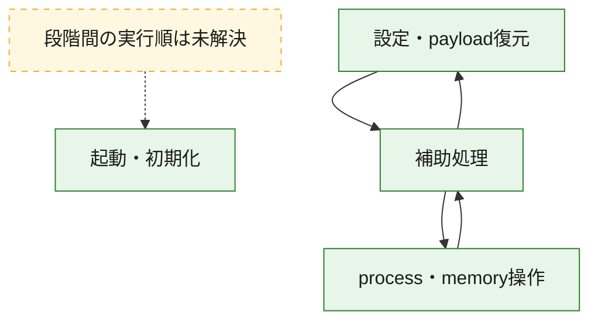
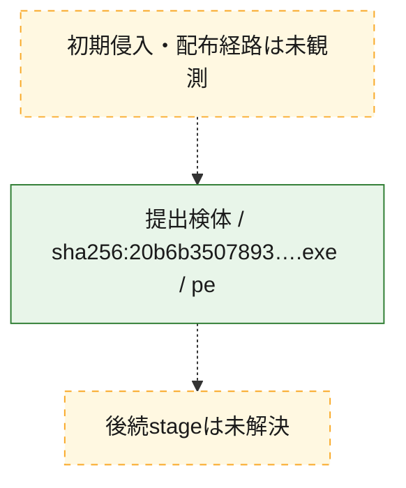
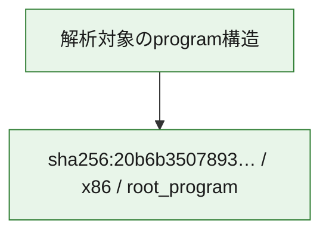

# 全体ロジック：20b6b35078935b2e905de50bbe0c8daeedad2e9d7683174407df1cc0d5185023

代表関数の静的証跡から、起動・初期化、設定・payload復元、process・memory操作の処理群を確認しました。

## 読み方

- phaseの掲載順は解析上の整理順です。observed_call_edgesがない段階間の実行順を断定しません。
- 図の実線は静的に観測した関係、点線と黄色のノードは未観測・未解決の関係を示します。
- 図は静的な要約であり、動的実行を再現するものではありません。
- 詳細な関数解説とfingerprintは[STATIC-LOGIC.md](STATIC-LOGIC.md)を参照してください。

## 静的可視化

### 実行フロー

### 感染チェーン

### モジュール関係

## 処理段階

### 1. 起動・初期化

entry pointから初期化と後続処理への移行を確認します。
確度: `confirmed_static_function_evidence`

- `20b6b35078935b2e905de50bbe0c8daeedad2e9d7683174407df1cc0d5185023:ghidra:180002ce8` — 初期化と主要処理への分岐を行う入口関数です。 状態: `succeeded`、選定理由: `entry_point`, `meaningful_symbol_name`, `reviewed_call_centrality:5`, `role:entrypoint`

### 2. 設定・payload復元

設定、resource、payload、暗号化データの復元・変換を確認します。
確度: `confirmed_static_function_evidence`

- `20b6b35078935b2e905de50bbe0c8daeedad2e9d7683174407df1cc0d5185023:ghidra:1800012b0` — 暗号、hash、encoding、または復号処理に関係する関数です。 状態: `succeeded`、選定理由: `context_representative`, `reviewed_call_centrality:16`, `role:cryptographic_transform`

### 3. process・memory操作

process、thread、module、memory操作と実行移行を確認します。
確度: `confirmed_static_function_evidence`

- `20b6b35078935b2e905de50bbe0c8daeedad2e9d7683174407df1cc0d5185023:ghidra:180001988` — process、thread、module、またはmemory操作に関係する関数です。 状態: `succeeded`、選定理由: `context_representative`, `reviewed_call_centrality:16`, `role:process_or_memory_operation`
- `20b6b35078935b2e905de50bbe0c8daeedad2e9d7683174407df1cc0d5185023:ghidra:180001ca0` — process、thread、module、またはmemory操作に関係する関数です。 状態: `succeeded`、選定理由: `context_representative`, `reviewed_call_centrality:12`, `role:process_or_memory_operation`

### 4. 補助処理

主要処理を支える一般内部関数またはlibrary処理を確認します。
確度: `confirmed_static_function_evidence`

- `20b6b35078935b2e905de50bbe0c8daeedad2e9d7683174407df1cc0d5185023:ghidra:180001000` — 検体内部の一般処理を実装する関数です。 状態: `succeeded`、選定理由: `context_representative`, `reviewed_call_centrality:1`
- `20b6b35078935b2e905de50bbe0c8daeedad2e9d7683174407df1cc0d5185023:ghidra:180001048` — 検体内部の一般処理を実装する関数です。 状態: `succeeded`、選定理由: `context_representative`, `reviewed_call_centrality:2`
- `20b6b35078935b2e905de50bbe0c8daeedad2e9d7683174407df1cc0d5185023:ghidra:1800010c4` — 検体内部の一般処理を実装する関数です。 状態: `succeeded`、選定理由: `context_representative`, `reviewed_call_centrality:9`
- `20b6b35078935b2e905de50bbe0c8daeedad2e9d7683174407df1cc0d5185023:ghidra:1800010e4` — 検体内部の一般処理を実装する関数です。 状態: `succeeded`、選定理由: `context_representative`, `reviewed_call_centrality:1`
- `20b6b35078935b2e905de50bbe0c8daeedad2e9d7683174407df1cc0d5185023:ghidra:180001120` — 検体内部の一般処理を実装する関数です。 状態: `succeeded`、選定理由: `context_representative`, `reviewed_call_centrality:1`
- `20b6b35078935b2e905de50bbe0c8daeedad2e9d7683174407df1cc0d5185023:ghidra:18000115c` — 検体内部の一般処理を実装する関数です。 状態: `succeeded`、選定理由: `context_representative`, `reviewed_call_centrality:6`
- `20b6b35078935b2e905de50bbe0c8daeedad2e9d7683174407df1cc0d5185023:ghidra:180001170` — 検体内部の一般処理を実装する関数です。 状態: `succeeded`、選定理由: `context_representative`, `reviewed_call_centrality:6`
- `20b6b35078935b2e905de50bbe0c8daeedad2e9d7683174407df1cc0d5185023:ghidra:1800014ec` — 検体内部の一般処理を実装する関数です。 状態: `succeeded`、選定理由: `context_representative`, `reviewed_call_centrality:21`
- `20b6b35078935b2e905de50bbe0c8daeedad2e9d7683174407df1cc0d5185023:ghidra:18000190c` — 検体内部の一般処理を実装する関数です。 状態: `succeeded`、選定理由: `context_representative`, `reviewed_call_centrality:5`
- `20b6b35078935b2e905de50bbe0c8daeedad2e9d7683174407df1cc0d5185023:ghidra:180001dd0` — 検体内部の一般処理を実装する関数です。 状態: `succeeded`、選定理由: `context_representative`, `reviewed_call_centrality:5`
- `20b6b35078935b2e905de50bbe0c8daeedad2e9d7683174407df1cc0d5185023:ghidra:180001ee4` — 検体内部の一般処理を実装する関数です。 状態: `succeeded`、選定理由: `context_representative`, `reviewed_call_centrality:14`
- `20b6b35078935b2e905de50bbe0c8daeedad2e9d7683174407df1cc0d5185023:ghidra:180002044` — 検体内部の一般処理を実装する関数です。 状態: `succeeded`、選定理由: `context_representative`, `reviewed_call_centrality:7`
- `20b6b35078935b2e905de50bbe0c8daeedad2e9d7683174407df1cc0d5185023:ghidra:1800020cc` — 検体内部の一般処理を実装する関数です。 状態: `succeeded`、選定理由: `entry_point`, `meaningful_symbol_name`, `reviewed_call_centrality:17`
- `20b6b35078935b2e905de50bbe0c8daeedad2e9d7683174407df1cc0d5185023:ghidra:180002114` — 検体内部の一般処理を実装する関数です。 状態: `succeeded`、選定理由: `context_representative`, `reviewed_call_centrality:4`
- `20b6b35078935b2e905de50bbe0c8daeedad2e9d7683174407df1cc0d5185023:ghidra:1800021e0` — 検体内部の一般処理を実装する関数です。 状態: `succeeded`、選定理由: `context_representative`, `reviewed_call_centrality:6`
- `20b6b35078935b2e905de50bbe0c8daeedad2e9d7683174407df1cc0d5185023:ghidra:180002254` — 検体内部の一般処理を実装する関数です。 状態: `succeeded`、選定理由: `context_representative`, `reviewed_call_centrality:6`
- `20b6b35078935b2e905de50bbe0c8daeedad2e9d7683174407df1cc0d5185023:ghidra:180002368` — 検体内部の一般処理を実装する関数です。 状態: `succeeded`、選定理由: `context_representative`, `reviewed_call_centrality:10`
- `20b6b35078935b2e905de50bbe0c8daeedad2e9d7683174407df1cc0d5185023:ghidra:180002488` — 検体内部の一般処理を実装する関数です。 状態: `succeeded`、選定理由: `context_representative`, `reviewed_call_centrality:9`
- `20b6b35078935b2e905de50bbe0c8daeedad2e9d7683174407df1cc0d5185023:ghidra:180002600` — 検体内部の一般処理を実装する関数です。 状態: `succeeded`、選定理由: `context_representative`, `reviewed_call_centrality:4`
- `20b6b35078935b2e905de50bbe0c8daeedad2e9d7683174407df1cc0d5185023:ghidra:180002620` — 検体内部の一般処理を実装する関数です。 状態: `succeeded`、選定理由: `context_representative`, `reviewed_call_centrality:10`
- `20b6b35078935b2e905de50bbe0c8daeedad2e9d7683174407df1cc0d5185023:ghidra:1800027b8` — 検体内部の一般処理を実装する関数です。 状態: `succeeded`、選定理由: `context_representative`, `reviewed_call_centrality:3`
- `20b6b35078935b2e905de50bbe0c8daeedad2e9d7683174407df1cc0d5185023:ghidra:1800027e0` — 検体内部の一般処理を実装する関数です。 状態: `succeeded`、選定理由: `context_representative`, `reviewed_call_centrality:1`
- `20b6b35078935b2e905de50bbe0c8daeedad2e9d7683174407df1cc0d5185023:ghidra:18000280c` — 検体内部の一般処理を実装する関数です。 状態: `succeeded`、選定理由: `context_representative`, `reviewed_call_centrality:9`
- `20b6b35078935b2e905de50bbe0c8daeedad2e9d7683174407df1cc0d5185023:ghidra:180002880` — 検体内部の一般処理を実装する関数です。 状態: `succeeded`、選定理由: `context_representative`, `reviewed_call_centrality:1`
- `20b6b35078935b2e905de50bbe0c8daeedad2e9d7683174407df1cc0d5185023:ghidra:1800028bc` — 検体内部の一般処理を実装する関数です。 状態: `succeeded`、選定理由: `context_representative`, `reviewed_call_centrality:2`
- `20b6b35078935b2e905de50bbe0c8daeedad2e9d7683174407df1cc0d5185023:ghidra:180002904` — 検体内部の一般処理を実装する関数です。 状態: `succeeded`、選定理由: `context_representative`, `reviewed_call_centrality:1`
- `20b6b35078935b2e905de50bbe0c8daeedad2e9d7683174407df1cc0d5185023:ghidra:180002940` — 検体内部の一般処理を実装する関数です。 状態: `succeeded`、選定理由: `context_representative`, `reviewed_call_centrality:5`
- `20b6b35078935b2e905de50bbe0c8daeedad2e9d7683174407df1cc0d5185023:ghidra:180002964` — 検体内部の一般処理を実装する関数です。 状態: `succeeded`、選定理由: `context_representative`, `reviewed_call_centrality:11`

## 観測したcall関係

- `20b6b35078935b2e905de50bbe0c8daeedad2e9d7683174407df1cc0d5185023:ghidra:18000115c` → `20b6b35078935b2e905de50bbe0c8daeedad2e9d7683174407df1cc0d5185023:ghidra:180002940` （`support` → `support`）
- `20b6b35078935b2e905de50bbe0c8daeedad2e9d7683174407df1cc0d5185023:ghidra:180001170` → `20b6b35078935b2e905de50bbe0c8daeedad2e9d7683174407df1cc0d5185023:ghidra:180002368` （`support` → `support`）
- `20b6b35078935b2e905de50bbe0c8daeedad2e9d7683174407df1cc0d5185023:ghidra:180001170` → `20b6b35078935b2e905de50bbe0c8daeedad2e9d7683174407df1cc0d5185023:ghidra:180002600` （`support` → `support`）
- `20b6b35078935b2e905de50bbe0c8daeedad2e9d7683174407df1cc0d5185023:ghidra:1800012b0` → `20b6b35078935b2e905de50bbe0c8daeedad2e9d7683174407df1cc0d5185023:ghidra:180002368` （`configuration` → `support`）
- `20b6b35078935b2e905de50bbe0c8daeedad2e9d7683174407df1cc0d5185023:ghidra:1800012b0` → `20b6b35078935b2e905de50bbe0c8daeedad2e9d7683174407df1cc0d5185023:ghidra:180002600` （`configuration` → `support`）
- `20b6b35078935b2e905de50bbe0c8daeedad2e9d7683174407df1cc0d5185023:ghidra:1800014ec` → `20b6b35078935b2e905de50bbe0c8daeedad2e9d7683174407df1cc0d5185023:ghidra:1800010c4` （`support` → `support`）
- `20b6b35078935b2e905de50bbe0c8daeedad2e9d7683174407df1cc0d5185023:ghidra:1800014ec` → `20b6b35078935b2e905de50bbe0c8daeedad2e9d7683174407df1cc0d5185023:ghidra:18000115c` （`support` → `support`）
- `20b6b35078935b2e905de50bbe0c8daeedad2e9d7683174407df1cc0d5185023:ghidra:1800014ec` → `20b6b35078935b2e905de50bbe0c8daeedad2e9d7683174407df1cc0d5185023:ghidra:180002114` （`support` → `support`）
- `20b6b35078935b2e905de50bbe0c8daeedad2e9d7683174407df1cc0d5185023:ghidra:1800014ec` → `20b6b35078935b2e905de50bbe0c8daeedad2e9d7683174407df1cc0d5185023:ghidra:180002488` （`support` → `support`）
- `20b6b35078935b2e905de50bbe0c8daeedad2e9d7683174407df1cc0d5185023:ghidra:1800014ec` → `20b6b35078935b2e905de50bbe0c8daeedad2e9d7683174407df1cc0d5185023:ghidra:180002620` （`support` → `support`）
- `20b6b35078935b2e905de50bbe0c8daeedad2e9d7683174407df1cc0d5185023:ghidra:1800014ec` → `20b6b35078935b2e905de50bbe0c8daeedad2e9d7683174407df1cc0d5185023:ghidra:18000280c` （`support` → `support`）
- `20b6b35078935b2e905de50bbe0c8daeedad2e9d7683174407df1cc0d5185023:ghidra:1800014ec` → `20b6b35078935b2e905de50bbe0c8daeedad2e9d7683174407df1cc0d5185023:ghidra:180002964` （`support` → `support`）
- `20b6b35078935b2e905de50bbe0c8daeedad2e9d7683174407df1cc0d5185023:ghidra:180001988` → `20b6b35078935b2e905de50bbe0c8daeedad2e9d7683174407df1cc0d5185023:ghidra:18000115c` （`execution` → `support`）
- `20b6b35078935b2e905de50bbe0c8daeedad2e9d7683174407df1cc0d5185023:ghidra:180001988` → `20b6b35078935b2e905de50bbe0c8daeedad2e9d7683174407df1cc0d5185023:ghidra:180002114` （`execution` → `support`）
- `20b6b35078935b2e905de50bbe0c8daeedad2e9d7683174407df1cc0d5185023:ghidra:180001988` → `20b6b35078935b2e905de50bbe0c8daeedad2e9d7683174407df1cc0d5185023:ghidra:1800021e0` （`execution` → `support`）
- `20b6b35078935b2e905de50bbe0c8daeedad2e9d7683174407df1cc0d5185023:ghidra:180001988` → `20b6b35078935b2e905de50bbe0c8daeedad2e9d7683174407df1cc0d5185023:ghidra:180002254` （`execution` → `support`）
- `20b6b35078935b2e905de50bbe0c8daeedad2e9d7683174407df1cc0d5185023:ghidra:180001dd0` → `20b6b35078935b2e905de50bbe0c8daeedad2e9d7683174407df1cc0d5185023:ghidra:180001ca0` （`support` → `execution`）
- `20b6b35078935b2e905de50bbe0c8daeedad2e9d7683174407df1cc0d5185023:ghidra:180001ee4` → `20b6b35078935b2e905de50bbe0c8daeedad2e9d7683174407df1cc0d5185023:ghidra:180001170` （`support` → `support`）
- `20b6b35078935b2e905de50bbe0c8daeedad2e9d7683174407df1cc0d5185023:ghidra:180001ee4` → `20b6b35078935b2e905de50bbe0c8daeedad2e9d7683174407df1cc0d5185023:ghidra:1800012b0` （`support` → `configuration`）
- `20b6b35078935b2e905de50bbe0c8daeedad2e9d7683174407df1cc0d5185023:ghidra:180001ee4` → `20b6b35078935b2e905de50bbe0c8daeedad2e9d7683174407df1cc0d5185023:ghidra:1800014ec` （`support` → `support`）
- `20b6b35078935b2e905de50bbe0c8daeedad2e9d7683174407df1cc0d5185023:ghidra:180001ee4` → `20b6b35078935b2e905de50bbe0c8daeedad2e9d7683174407df1cc0d5185023:ghidra:18000190c` （`support` → `support`）
- `20b6b35078935b2e905de50bbe0c8daeedad2e9d7683174407df1cc0d5185023:ghidra:180001ee4` → `20b6b35078935b2e905de50bbe0c8daeedad2e9d7683174407df1cc0d5185023:ghidra:180001988` （`support` → `execution`）
- `20b6b35078935b2e905de50bbe0c8daeedad2e9d7683174407df1cc0d5185023:ghidra:180001ee4` → `20b6b35078935b2e905de50bbe0c8daeedad2e9d7683174407df1cc0d5185023:ghidra:180001dd0` （`support` → `support`）
- `20b6b35078935b2e905de50bbe0c8daeedad2e9d7683174407df1cc0d5185023:ghidra:180001ee4` → `20b6b35078935b2e905de50bbe0c8daeedad2e9d7683174407df1cc0d5185023:ghidra:1800021e0` （`support` → `support`）
- `20b6b35078935b2e905de50bbe0c8daeedad2e9d7683174407df1cc0d5185023:ghidra:1800020cc` → `20b6b35078935b2e905de50bbe0c8daeedad2e9d7683174407df1cc0d5185023:ghidra:180001170` （`support` → `support`）
- `20b6b35078935b2e905de50bbe0c8daeedad2e9d7683174407df1cc0d5185023:ghidra:1800020cc` → `20b6b35078935b2e905de50bbe0c8daeedad2e9d7683174407df1cc0d5185023:ghidra:1800012b0` （`support` → `configuration`）
- `20b6b35078935b2e905de50bbe0c8daeedad2e9d7683174407df1cc0d5185023:ghidra:1800020cc` → `20b6b35078935b2e905de50bbe0c8daeedad2e9d7683174407df1cc0d5185023:ghidra:1800014ec` （`support` → `support`）
- `20b6b35078935b2e905de50bbe0c8daeedad2e9d7683174407df1cc0d5185023:ghidra:1800020cc` → `20b6b35078935b2e905de50bbe0c8daeedad2e9d7683174407df1cc0d5185023:ghidra:18000190c` （`support` → `support`）
- `20b6b35078935b2e905de50bbe0c8daeedad2e9d7683174407df1cc0d5185023:ghidra:1800020cc` → `20b6b35078935b2e905de50bbe0c8daeedad2e9d7683174407df1cc0d5185023:ghidra:180001988` （`support` → `execution`）
- `20b6b35078935b2e905de50bbe0c8daeedad2e9d7683174407df1cc0d5185023:ghidra:1800020cc` → `20b6b35078935b2e905de50bbe0c8daeedad2e9d7683174407df1cc0d5185023:ghidra:180001dd0` （`support` → `support`）
- `20b6b35078935b2e905de50bbe0c8daeedad2e9d7683174407df1cc0d5185023:ghidra:1800020cc` → `20b6b35078935b2e905de50bbe0c8daeedad2e9d7683174407df1cc0d5185023:ghidra:180002044` （`support` → `support`）
- `20b6b35078935b2e905de50bbe0c8daeedad2e9d7683174407df1cc0d5185023:ghidra:1800020cc` → `20b6b35078935b2e905de50bbe0c8daeedad2e9d7683174407df1cc0d5185023:ghidra:1800021e0` （`support` → `support`）
- `20b6b35078935b2e905de50bbe0c8daeedad2e9d7683174407df1cc0d5185023:ghidra:180002114` → `20b6b35078935b2e905de50bbe0c8daeedad2e9d7683174407df1cc0d5185023:ghidra:180002620` （`support` → `support`）
- `20b6b35078935b2e905de50bbe0c8daeedad2e9d7683174407df1cc0d5185023:ghidra:180002254` → `20b6b35078935b2e905de50bbe0c8daeedad2e9d7683174407df1cc0d5185023:ghidra:1800010c4` （`support` → `support`）
- `20b6b35078935b2e905de50bbe0c8daeedad2e9d7683174407df1cc0d5185023:ghidra:180002254` → `20b6b35078935b2e905de50bbe0c8daeedad2e9d7683174407df1cc0d5185023:ghidra:18000280c` （`support` → `support`）
- `20b6b35078935b2e905de50bbe0c8daeedad2e9d7683174407df1cc0d5185023:ghidra:180002254` → `20b6b35078935b2e905de50bbe0c8daeedad2e9d7683174407df1cc0d5185023:ghidra:180002964` （`support` → `support`）
- `20b6b35078935b2e905de50bbe0c8daeedad2e9d7683174407df1cc0d5185023:ghidra:180002368` → `20b6b35078935b2e905de50bbe0c8daeedad2e9d7683174407df1cc0d5185023:ghidra:180002600` （`support` → `support`）
- `20b6b35078935b2e905de50bbe0c8daeedad2e9d7683174407df1cc0d5185023:ghidra:180002368` → `20b6b35078935b2e905de50bbe0c8daeedad2e9d7683174407df1cc0d5185023:ghidra:1800027b8` （`support` → `support`）
- `20b6b35078935b2e905de50bbe0c8daeedad2e9d7683174407df1cc0d5185023:ghidra:180002368` → `20b6b35078935b2e905de50bbe0c8daeedad2e9d7683174407df1cc0d5185023:ghidra:18000280c` （`support` → `support`）
- `20b6b35078935b2e905de50bbe0c8daeedad2e9d7683174407df1cc0d5185023:ghidra:180002368` → `20b6b35078935b2e905de50bbe0c8daeedad2e9d7683174407df1cc0d5185023:ghidra:180002964` （`support` → `support`）
- `20b6b35078935b2e905de50bbe0c8daeedad2e9d7683174407df1cc0d5185023:ghidra:180002488` → `20b6b35078935b2e905de50bbe0c8daeedad2e9d7683174407df1cc0d5185023:ghidra:1800010c4` （`support` → `support`）
- `20b6b35078935b2e905de50bbe0c8daeedad2e9d7683174407df1cc0d5185023:ghidra:180002488` → `20b6b35078935b2e905de50bbe0c8daeedad2e9d7683174407df1cc0d5185023:ghidra:18000115c` （`support` → `support`）
- `20b6b35078935b2e905de50bbe0c8daeedad2e9d7683174407df1cc0d5185023:ghidra:180002488` → `20b6b35078935b2e905de50bbe0c8daeedad2e9d7683174407df1cc0d5185023:ghidra:18000280c` （`support` → `support`）
- `20b6b35078935b2e905de50bbe0c8daeedad2e9d7683174407df1cc0d5185023:ghidra:180002488` → `20b6b35078935b2e905de50bbe0c8daeedad2e9d7683174407df1cc0d5185023:ghidra:180002964` （`support` → `support`）
- `20b6b35078935b2e905de50bbe0c8daeedad2e9d7683174407df1cc0d5185023:ghidra:180002620` → `20b6b35078935b2e905de50bbe0c8daeedad2e9d7683174407df1cc0d5185023:ghidra:1800010c4` （`support` → `support`）
- `20b6b35078935b2e905de50bbe0c8daeedad2e9d7683174407df1cc0d5185023:ghidra:180002620` → `20b6b35078935b2e905de50bbe0c8daeedad2e9d7683174407df1cc0d5185023:ghidra:18000115c` （`support` → `support`）
- `20b6b35078935b2e905de50bbe0c8daeedad2e9d7683174407df1cc0d5185023:ghidra:180002620` → `20b6b35078935b2e905de50bbe0c8daeedad2e9d7683174407df1cc0d5185023:ghidra:18000280c` （`support` → `support`）
- `20b6b35078935b2e905de50bbe0c8daeedad2e9d7683174407df1cc0d5185023:ghidra:180002620` → `20b6b35078935b2e905de50bbe0c8daeedad2e9d7683174407df1cc0d5185023:ghidra:180002964` （`support` → `support`）
- `20b6b35078935b2e905de50bbe0c8daeedad2e9d7683174407df1cc0d5185023:ghidra:1800027b8` → `20b6b35078935b2e905de50bbe0c8daeedad2e9d7683174407df1cc0d5185023:ghidra:180002940` （`support` → `support`）
- `20b6b35078935b2e905de50bbe0c8daeedad2e9d7683174407df1cc0d5185023:ghidra:18000280c` → `20b6b35078935b2e905de50bbe0c8daeedad2e9d7683174407df1cc0d5185023:ghidra:1800010c4` （`support` → `support`）
- `20b6b35078935b2e905de50bbe0c8daeedad2e9d7683174407df1cc0d5185023:ghidra:18000280c` → `20b6b35078935b2e905de50bbe0c8daeedad2e9d7683174407df1cc0d5185023:ghidra:180002964` （`support` → `support`）
- `20b6b35078935b2e905de50bbe0c8daeedad2e9d7683174407df1cc0d5185023:ghidra:180002940` → `20b6b35078935b2e905de50bbe0c8daeedad2e9d7683174407df1cc0d5185023:ghidra:1800028bc` （`support` → `support`）
- `20b6b35078935b2e905de50bbe0c8daeedad2e9d7683174407df1cc0d5185023:ghidra:180002964` → `20b6b35078935b2e905de50bbe0c8daeedad2e9d7683174407df1cc0d5185023:ghidra:1800010c4` （`support` → `support`）
- `ghidra-function:055f270547af477a42037a1f` → `ghidra-function:4db3d85cd403da80671102eb` （`unclassified` → `unclassified`）
- `ghidra-function:055f270547af477a42037a1f` → `ghidra-function:91b2e053000b3eb36056d8f6` （`unclassified` → `unclassified`）
- `ghidra-function:055f270547af477a42037a1f` → `ghidra-function:96685f0fe95aa677b7a69aa1` （`unclassified` → `unclassified`）
- `ghidra-function:0c367b7183c4f54ec32d0898` → `ghidra-external:0f68779cdb21529e80ad3363` （`unclassified` → `unclassified`）
- `ghidra-function:0c367b7183c4f54ec32d0898` → `ghidra-external:14b73f125330ef690d524459` （`unclassified` → `unclassified`）
- `ghidra-function:0c367b7183c4f54ec32d0898` → `ghidra-function:8529b44fd1c72938635c1f7a` （`unclassified` → `unclassified`）
- `ghidra-function:0c81d5b1da24c522e84bc83b` → `ghidra-external:0f68779cdb21529e80ad3363` （`unclassified` → `unclassified`）
- `ghidra-function:0c81d5b1da24c522e84bc83b` → `ghidra-function:00f32af86d2973b0204ae391` （`unclassified` → `unclassified`）
- `ghidra-function:1125e22e7c149ff42e640e45` → `ghidra-function:50da24637eb417bb057de52f` （`unclassified` → `unclassified`）
- `ghidra-function:117e3a859e1c77dfee6bf3d9` → `ghidra-external:14b73f125330ef690d524459` （`unclassified` → `unclassified`）
- `ghidra-function:117e3a859e1c77dfee6bf3d9` → `ghidra-external:c5b7ec69d28b36398eb887bc` （`unclassified` → `unclassified`）
- `ghidra-function:117e3a859e1c77dfee6bf3d9` → `ghidra-function:2e796bbe43171ce2e8107ea1` （`unclassified` → `unclassified`）
- `ghidra-function:117e3a859e1c77dfee6bf3d9` → `ghidra-function:7a2d9a75a255339983215062` （`unclassified` → `unclassified`）
- `ghidra-function:117e3a859e1c77dfee6bf3d9` → `ghidra-function:844336ccea1ba87dfb8e07b7` （`unclassified` → `unclassified`）
- `ghidra-function:17868d750bcdade6cb202d16` → `ghidra-function:1e48ae49aaa2c276edf84773` （`unclassified` → `unclassified`）
- `ghidra-function:17868d750bcdade6cb202d16` → `ghidra-function:a3e45bc894ec34b289e4ef27` （`unclassified` → `unclassified`）
- `ghidra-function:17868d750bcdade6cb202d16` → `ghidra-function:b87259036741cf60ad6de24a` （`unclassified` → `unclassified`）
- `ghidra-function:1cff5c5da22858aed09cbd3b` → `ghidra-external:14b73f125330ef690d524459` （`unclassified` → `unclassified`）
- `ghidra-function:1cff5c5da22858aed09cbd3b` → `ghidra-function:10145d38eddd4e8f26cdf69a` （`unclassified` → `unclassified`）
- `ghidra-function:1cff5c5da22858aed09cbd3b` → `ghidra-function:117e3a859e1c77dfee6bf3d9` （`unclassified` → `unclassified`）
- `ghidra-function:1cff5c5da22858aed09cbd3b` → `ghidra-function:844336ccea1ba87dfb8e07b7` （`unclassified` → `unclassified`）
- `ghidra-function:1cff5c5da22858aed09cbd3b` → `ghidra-function:acf8fd98566f2a33111b5e0e` （`unclassified` → `unclassified`）
- `ghidra-function:1d0da824a213cc8e39999b79` → `ghidra-external:14b73f125330ef690d524459` （`unclassified` → `unclassified`）
- `ghidra-function:1d0da824a213cc8e39999b79` → `ghidra-function:47e0bcbbbf814a5d73d61c7b` （`unclassified` → `unclassified`）
- `ghidra-function:2c8aab2370e5674751803745` → `ghidra-external:0f68779cdb21529e80ad3363` （`unclassified` → `unclassified`）
- `ghidra-function:2c8aab2370e5674751803745` → `ghidra-external:14b73f125330ef690d524459` （`unclassified` → `unclassified`）
- `ghidra-function:2c8aab2370e5674751803745` → `ghidra-function:10145d38eddd4e8f26cdf69a` （`unclassified` → `unclassified`）
- `ghidra-function:2c8aab2370e5674751803745` → `ghidra-function:117e3a859e1c77dfee6bf3d9` （`unclassified` → `unclassified`）
- `ghidra-function:2c8aab2370e5674751803745` → `ghidra-function:844336ccea1ba87dfb8e07b7` （`unclassified` → `unclassified`）
- `ghidra-function:2c8aab2370e5674751803745` → `ghidra-function:8529b44fd1c72938635c1f7a` （`unclassified` → `unclassified`）
- `ghidra-function:2c8aab2370e5674751803745` → `ghidra-function:a2e61cb0e4d6e079e78a2477` （`unclassified` → `unclassified`）
- `ghidra-function:2c8aab2370e5674751803745` → `ghidra-function:acf8fd98566f2a33111b5e0e` （`unclassified` → `unclassified`）
- `ghidra-function:2ecbc23d36c3cc169496112e` → `ghidra-external:0f68779cdb21529e80ad3363` （`unclassified` → `unclassified`）
- `ghidra-function:2ecbc23d36c3cc169496112e` → `ghidra-external:14b73f125330ef690d524459` （`unclassified` → `unclassified`）
- `ghidra-function:2ecbc23d36c3cc169496112e` → `ghidra-function:055f270547af477a42037a1f` （`unclassified` → `unclassified`）
- `ghidra-function:2ecbc23d36c3cc169496112e` → `ghidra-function:0c367b7183c4f54ec32d0898` （`unclassified` → `unclassified`）
- `ghidra-function:2ecbc23d36c3cc169496112e` → `ghidra-function:17868d750bcdade6cb202d16` （`unclassified` → `unclassified`）
- `ghidra-function:2ecbc23d36c3cc169496112e` → `ghidra-function:323e14b3a0a045257ae8663e` （`unclassified` → `unclassified`）
- `ghidra-function:2ecbc23d36c3cc169496112e` → `ghidra-function:3b86554b2a956616bbd41f52` （`unclassified` → `unclassified`）
- `ghidra-function:2ecbc23d36c3cc169496112e` → `ghidra-function:7acbcf560c0279a3d402cf56` （`unclassified` → `unclassified`）
- `ghidra-function:2ecbc23d36c3cc169496112e` → `ghidra-function:7e8c06b3b42d3fc09ac76737` （`unclassified` → `unclassified`）
- `ghidra-function:2ecbc23d36c3cc169496112e` → `ghidra-function:81dfa624ec50d7b55a76a9ae` （`unclassified` → `unclassified`）
- `ghidra-function:2ecbc23d36c3cc169496112e` → `ghidra-function:8529b44fd1c72938635c1f7a` （`unclassified` → `unclassified`）
- `ghidra-function:2ecbc23d36c3cc169496112e` → `ghidra-function:90c4fc765a9c78e940011766` （`unclassified` → `unclassified`）
- `ghidra-function:2ecbc23d36c3cc169496112e` → `ghidra-function:9b334d162e75d3a90953955e` （`unclassified` → `unclassified`）
- `ghidra-function:2ecbc23d36c3cc169496112e` → `ghidra-function:de49f1af25d0abc7a4f21895` （`unclassified` → `unclassified`）
- `ghidra-function:323e14b3a0a045257ae8663e` → `ghidra-external:0f68779cdb21529e80ad3363` （`unclassified` → `unclassified`）
- `ghidra-function:323e14b3a0a045257ae8663e` → `ghidra-external:14b73f125330ef690d524459` （`unclassified` → `unclassified`）
- `ghidra-function:323e14b3a0a045257ae8663e` → `ghidra-external:14e90c31d684c20f5f660aae` （`unclassified` → `unclassified`）
- `ghidra-function:323e14b3a0a045257ae8663e` → `ghidra-external:5ff72ee9f2c90707d07d0df3` （`unclassified` → `unclassified`）
- `ghidra-function:323e14b3a0a045257ae8663e` → `ghidra-function:0817c07348f5f00fdeae989b` （`unclassified` → `unclassified`）
- `ghidra-function:323e14b3a0a045257ae8663e` → `ghidra-function:0c367b7183c4f54ec32d0898` （`unclassified` → `unclassified`）
- `ghidra-function:323e14b3a0a045257ae8663e` → `ghidra-function:1cff5c5da22858aed09cbd3b` （`unclassified` → `unclassified`）
- `ghidra-function:323e14b3a0a045257ae8663e` → `ghidra-function:360a79725750d77523ec221a` （`unclassified` → `unclassified`）
- `ghidra-function:323e14b3a0a045257ae8663e` → `ghidra-function:4d36aaf93694886792e13507` （`unclassified` → `unclassified`）
- `ghidra-function:323e14b3a0a045257ae8663e` → `ghidra-function:5e9dd460e132da97fb70c2cf` （`unclassified` → `unclassified`）
- `ghidra-function:323e14b3a0a045257ae8663e` → `ghidra-function:8529b44fd1c72938635c1f7a` （`unclassified` → `unclassified`）
- `ghidra-function:323e14b3a0a045257ae8663e` → `ghidra-function:a2e61cb0e4d6e079e78a2477` （`unclassified` → `unclassified`）
- `ghidra-function:3b86554b2a956616bbd41f52` → `ghidra-function:2352b3c7f2dddde0c96b0a3f` （`unclassified` → `unclassified`）
- `ghidra-function:3b86554b2a956616bbd41f52` → `ghidra-function:4ccd014918e4c2764cde12c5` （`unclassified` → `unclassified`）
- `ghidra-function:3b86554b2a956616bbd41f52` → `ghidra-function:4f9580190801d1fb9475d31d` （`unclassified` → `unclassified`）
- `ghidra-function:3b86554b2a956616bbd41f52` → `ghidra-function:6206a8c7b489db220be951f6` （`unclassified` → `unclassified`）
- `ghidra-function:3b86554b2a956616bbd41f52` → `ghidra-function:7501d6150a8a4fab7f465224` （`unclassified` → `unclassified`）
- `ghidra-function:3b86554b2a956616bbd41f52` → `ghidra-function:91b2e053000b3eb36056d8f6` （`unclassified` → `unclassified`）
- `ghidra-function:3b86554b2a956616bbd41f52` → `ghidra-function:96685f0fe95aa677b7a69aa1` （`unclassified` → `unclassified`）
- `ghidra-function:3b86554b2a956616bbd41f52` → `ghidra-function:f493b0de741aa3314102c474` （`unclassified` → `unclassified`）
- `ghidra-function:47e0bcbbbf814a5d73d61c7b` → `ghidra-external:14b73f125330ef690d524459` （`unclassified` → `unclassified`）
- `ghidra-function:47e0bcbbbf814a5d73d61c7b` → `ghidra-function:163785a3565540630cf4bb41` （`unclassified` → `unclassified`）
- `ghidra-function:47e0bcbbbf814a5d73d61c7b` → `ghidra-function:666fb3afd8536b5d8c21d8ae` （`unclassified` → `unclassified`）
- `ghidra-function:4b7fc770bc7f9b2f0a706b0b` → `ghidra-external:0f68779cdb21529e80ad3363` （`unclassified` → `unclassified`）
- `ghidra-function:4b7fc770bc7f9b2f0a706b0b` → `ghidra-external:14b73f125330ef690d524459` （`unclassified` → `unclassified`）
- `ghidra-function:4b7fc770bc7f9b2f0a706b0b` → `ghidra-function:10145d38eddd4e8f26cdf69a` （`unclassified` → `unclassified`）
- `ghidra-function:4b7fc770bc7f9b2f0a706b0b` → `ghidra-function:117e3a859e1c77dfee6bf3d9` （`unclassified` → `unclassified`）
- `ghidra-function:4b7fc770bc7f9b2f0a706b0b` → `ghidra-function:844336ccea1ba87dfb8e07b7` （`unclassified` → `unclassified`）
- `ghidra-function:4b7fc770bc7f9b2f0a706b0b` → `ghidra-function:8529b44fd1c72938635c1f7a` （`unclassified` → `unclassified`）
- `ghidra-function:4b7fc770bc7f9b2f0a706b0b` → `ghidra-function:a2e61cb0e4d6e079e78a2477` （`unclassified` → `unclassified`）
- `ghidra-function:4b7fc770bc7f9b2f0a706b0b` → `ghidra-function:acf8fd98566f2a33111b5e0e` （`unclassified` → `unclassified`）
- `ghidra-function:5e9dd460e132da97fb70c2cf` → `ghidra-function:10145d38eddd4e8f26cdf69a` （`unclassified` → `unclassified`）
- `ghidra-function:5e9dd460e132da97fb70c2cf` → `ghidra-function:2c8aab2370e5674751803745` （`unclassified` → `unclassified`）
- `ghidra-function:666fb3afd8536b5d8c21d8ae` → `ghidra-function:50da24637eb417bb057de52f` （`unclassified` → `unclassified`）
- `ghidra-function:7653fb4c2f67885323c7525a` → `ghidra-function:50da24637eb417bb057de52f` （`unclassified` → `unclassified`）
- `ghidra-function:7acbcf560c0279a3d402cf56` → `ghidra-function:a2d05fdd87d058508cf27a64` （`unclassified` → `unclassified`）
- `ghidra-function:7acbcf560c0279a3d402cf56` → `ghidra-function:ebd3b315687538799ee497ac` （`unclassified` → `unclassified`）
- `ghidra-function:844336ccea1ba87dfb8e07b7` → `ghidra-external:14b73f125330ef690d524459` （`unclassified` → `unclassified`）
- `ghidra-function:844336ccea1ba87dfb8e07b7` → `ghidra-external:4b8c9c678c8d881bc1ad31e2` （`unclassified` → `unclassified`）
- `ghidra-function:844336ccea1ba87dfb8e07b7` → `ghidra-function:163785a3565540630cf4bb41` （`unclassified` → `unclassified`）
- `ghidra-function:8e1b9e28b71f970cfac99094` → `ghidra-function:50da24637eb417bb057de52f` （`unclassified` → `unclassified`）
- `ghidra-function:91b2e053000b3eb36056d8f6` → `ghidra-function:360a79725750d77523ec221a` （`unclassified` → `unclassified`）
- `ghidra-function:96685f0fe95aa677b7a69aa1` → `ghidra-external:0f68779cdb21529e80ad3363` （`unclassified` → `unclassified`）
- `ghidra-function:96685f0fe95aa677b7a69aa1` → `ghidra-external:14b73f125330ef690d524459` （`unclassified` → `unclassified`）
- `ghidra-function:96685f0fe95aa677b7a69aa1` → `ghidra-external:345923cb6a4291a371bee60a` （`unclassified` → `unclassified`）
- `ghidra-function:96685f0fe95aa677b7a69aa1` → `ghidra-function:117e3a859e1c77dfee6bf3d9` （`unclassified` → `unclassified`）
- `ghidra-function:96685f0fe95aa677b7a69aa1` → `ghidra-function:1d0da824a213cc8e39999b79` （`unclassified` → `unclassified`）
- `ghidra-function:96685f0fe95aa677b7a69aa1` → `ghidra-function:8529b44fd1c72938635c1f7a` （`unclassified` → `unclassified`）
- `ghidra-function:96685f0fe95aa677b7a69aa1` → `ghidra-function:91b2e053000b3eb36056d8f6` （`unclassified` → `unclassified`）
- `ghidra-function:96685f0fe95aa677b7a69aa1` → `ghidra-function:acf8fd98566f2a33111b5e0e` （`unclassified` → `unclassified`）
- `ghidra-function:9b334d162e75d3a90953955e` → `ghidra-function:537dee3db35cf6469ed61d04` （`unclassified` → `unclassified`）
- `ghidra-function:9b334d162e75d3a90953955e` → `ghidra-function:af6f555cc0d317bf0f6488d6` （`unclassified` → `unclassified`）
- `ghidra-function:9b334d162e75d3a90953955e` → `ghidra-function:cb754a651abd432dc03393db` （`unclassified` → `unclassified`）
- `ghidra-function:a2d05fdd87d058508cf27a64` → `ghidra-function:360a79725750d77523ec221a` （`unclassified` → `unclassified`）
- `ghidra-function:a2d05fdd87d058508cf27a64` → `ghidra-function:4d36aaf93694886792e13507` （`unclassified` → `unclassified`）
- `ghidra-function:a2d05fdd87d058508cf27a64` → `ghidra-function:5b5afbf5ebea483685c6d945` （`unclassified` → `unclassified`）
- `ghidra-function:a2d05fdd87d058508cf27a64` → `ghidra-function:ebd3b315687538799ee497ac` （`unclassified` → `unclassified`）
- `ghidra-function:a2d05fdd87d058508cf27a64` → `ghidra-function:f9993572c70a4f27d7189f57` （`unclassified` → `unclassified`）
- `ghidra-function:a2d05fdd87d058508cf27a64` → `ghidra-function:ffc30eff1187112d5dbb3c71` （`unclassified` → `unclassified`）
- `ghidra-function:a2e61cb0e4d6e079e78a2477` → `ghidra-external:14b73f125330ef690d524459` （`unclassified` → `unclassified`）
- `ghidra-function:a2e61cb0e4d6e079e78a2477` → `ghidra-function:47e0bcbbbf814a5d73d61c7b` （`unclassified` → `unclassified`）
- `ghidra-function:a4a84cd10741faf4a2dd772f` → `ghidra-function:50da24637eb417bb057de52f` （`unclassified` → `unclassified`）
- `ghidra-function:acf8fd98566f2a33111b5e0e` → `ghidra-external:14b73f125330ef690d524459` （`unclassified` → `unclassified`）
- `ghidra-function:acf8fd98566f2a33111b5e0e` → `ghidra-function:117e3a859e1c77dfee6bf3d9` （`unclassified` → `unclassified`）
- `ghidra-function:acf8fd98566f2a33111b5e0e` → `ghidra-function:844336ccea1ba87dfb8e07b7` （`unclassified` → `unclassified`）
- `ghidra-function:acf8fd98566f2a33111b5e0e` → `ghidra-function:8529b44fd1c72938635c1f7a` （`unclassified` → `unclassified`）
- `ghidra-function:b7770bdfead96b7cff924518` → `ghidra-function:50da24637eb417bb057de52f` （`unclassified` → `unclassified`）
- `ghidra-function:b90def92b1bfde7bf5e82845` → `ghidra-external:0f68779cdb21529e80ad3363` （`unclassified` → `unclassified`）
- `ghidra-function:b90def92b1bfde7bf5e82845` → `ghidra-external:14b73f125330ef690d524459` （`unclassified` → `unclassified`）
- `ghidra-function:b90def92b1bfde7bf5e82845` → `ghidra-function:055f270547af477a42037a1f` （`unclassified` → `unclassified`）
- `ghidra-function:b90def92b1bfde7bf5e82845` → `ghidra-function:0c367b7183c4f54ec32d0898` （`unclassified` → `unclassified`）
- `ghidra-function:b90def92b1bfde7bf5e82845` → `ghidra-function:323e14b3a0a045257ae8663e` （`unclassified` → `unclassified`）
- `ghidra-function:b90def92b1bfde7bf5e82845` → `ghidra-function:3b86554b2a956616bbd41f52` （`unclassified` → `unclassified`）
- `ghidra-function:b90def92b1bfde7bf5e82845` → `ghidra-function:7acbcf560c0279a3d402cf56` （`unclassified` → `unclassified`）
- `ghidra-function:b90def92b1bfde7bf5e82845` → `ghidra-function:7e8c06b3b42d3fc09ac76737` （`unclassified` → `unclassified`）
- `ghidra-function:b90def92b1bfde7bf5e82845` → `ghidra-function:8529b44fd1c72938635c1f7a` （`unclassified` → `unclassified`）
- `ghidra-function:b90def92b1bfde7bf5e82845` → `ghidra-function:90c4fc765a9c78e940011766` （`unclassified` → `unclassified`）
- `ghidra-function:b90def92b1bfde7bf5e82845` → `ghidra-function:9b334d162e75d3a90953955e` （`unclassified` → `unclassified`）
- `ghidra-function:b90def92b1bfde7bf5e82845` → `ghidra-function:de49f1af25d0abc7a4f21895` （`unclassified` → `unclassified`）
- `ghidra-function:cabe930abeee877f9d86c902` → `ghidra-external:8d75da6e90ab1648144bc0b5` （`unclassified` → `unclassified`）
- `ghidra-function:cabe930abeee877f9d86c902` → `ghidra-external:91309d983a0b48732195b537` （`unclassified` → `unclassified`）
- `ghidra-function:cabe930abeee877f9d86c902` → `ghidra-function:00cc551187ae22ddf957f5ed` （`unclassified` → `unclassified`）
- `ghidra-function:cabe930abeee877f9d86c902` → `ghidra-function:20064f6d40cb065c0fba64c1` （`unclassified` → `unclassified`）
- `ghidra-function:cabe930abeee877f9d86c902` → `ghidra-function:9af0e58d0ae73b4150ea64ee` （`unclassified` → `unclassified`）
- `ghidra-function:de49f1af25d0abc7a4f21895` → `ghidra-external:0f68779cdb21529e80ad3363` （`unclassified` → `unclassified`）
- `ghidra-function:de49f1af25d0abc7a4f21895` → `ghidra-external:14b73f125330ef690d524459` （`unclassified` → `unclassified`）
- `ghidra-function:de49f1af25d0abc7a4f21895` → `ghidra-external:34c0f29365fda3aff70baa44` （`unclassified` → `unclassified`）
- `ghidra-function:de49f1af25d0abc7a4f21895` → `ghidra-external:f252f8682fc901e6e020a0ff` （`unclassified` → `unclassified`）
- `ghidra-function:de49f1af25d0abc7a4f21895` → `ghidra-function:0b92c554e4aaac5fd3c42ade` （`unclassified` → `unclassified`）
- `ghidra-function:de49f1af25d0abc7a4f21895` → `ghidra-function:10145d38eddd4e8f26cdf69a` （`unclassified` → `unclassified`）
- `ghidra-function:de49f1af25d0abc7a4f21895` → `ghidra-function:117e3a859e1c77dfee6bf3d9` （`unclassified` → `unclassified`）
- `ghidra-function:de49f1af25d0abc7a4f21895` → `ghidra-function:2c8aab2370e5674751803745` （`unclassified` → `unclassified`）
- `ghidra-function:de49f1af25d0abc7a4f21895` → `ghidra-function:364ea1039f87692ecb41a8b3` （`unclassified` → `unclassified`）
- `ghidra-function:de49f1af25d0abc7a4f21895` → `ghidra-function:4b7fc770bc7f9b2f0a706b0b` （`unclassified` → `unclassified`）
- `ghidra-function:de49f1af25d0abc7a4f21895` → `ghidra-function:5e9dd460e132da97fb70c2cf` （`unclassified` → `unclassified`）
- `ghidra-function:de49f1af25d0abc7a4f21895` → `ghidra-function:844336ccea1ba87dfb8e07b7` （`unclassified` → `unclassified`）
- `ghidra-function:de49f1af25d0abc7a4f21895` → `ghidra-function:8529b44fd1c72938635c1f7a` （`unclassified` → `unclassified`）
- `ghidra-function:de49f1af25d0abc7a4f21895` → `ghidra-function:86f71bcb30af16689e40fc01` （`unclassified` → `unclassified`）
- `ghidra-function:de49f1af25d0abc7a4f21895` → `ghidra-function:a2e61cb0e4d6e079e78a2477` （`unclassified` → `unclassified`）
- `ghidra-function:de49f1af25d0abc7a4f21895` → `ghidra-function:acf8fd98566f2a33111b5e0e` （`unclassified` → `unclassified`）
- `ghidra-function:de49f1af25d0abc7a4f21895` → `ghidra-function:be606dc90248c4a16f099938` （`unclassified` → `unclassified`）
- 残り1件は`static-logic.json`に記録しています。

## 解析範囲と制約

- 選定外関数は全体inventoryへ残しますが、関数本体の個別解説対象にはしていません。
- indirect call、難読化、packer、VM、壊れたcontrol flowによりcall関係が欠落する場合があります。
- 文書は静的解析に基づき、検体実行や外部通信による動的確認は行っていません。
