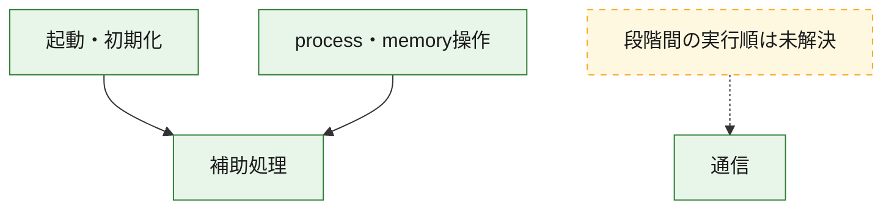
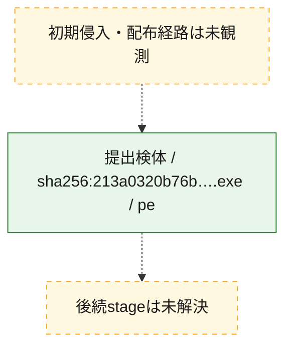
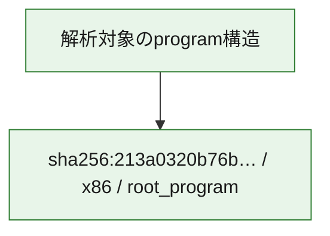

# 全体ロジック：213a0320b76bf702583ffd25754609124847c67527b3855b2321b1f8fd3b12e2

代表関数の静的証跡から、起動・初期化、process・memory操作、通信の処理群を確認しました。

## 読み方

- phaseの掲載順は解析上の整理順です。observed_call_edgesがない段階間の実行順を断定しません。
- 図の実線は静的に観測した関係、点線と黄色のノードは未観測・未解決の関係を示します。
- 図は静的な要約であり、動的実行を再現するものではありません。
- 詳細な関数解説とfingerprintは[STATIC-LOGIC.md](STATIC-LOGIC.md)を参照してください。

## 静的可視化

### 実行フロー

### 感染チェーン

### モジュール関係

## 処理段階

### 1. 起動・初期化

entry pointから初期化と後続処理への移行を確認します。
確度: `confirmed_static_function_evidence`

- `213a0320b76bf702583ffd25754609124847c67527b3855b2321b1f8fd3b12e2:ghidra:140001460` — 初期化と主要処理への分岐を行う入口関数です。 状態: `succeeded`、選定理由: `entry_point`, `meaningful_symbol_name`, `reviewed_call_centrality:31`, `role:entrypoint`

### 2. process・memory操作

process、thread、module、memory操作と実行移行を確認します。
確度: `confirmed_static_function_evidence`

- `213a0320b76bf702583ffd25754609124847c67527b3855b2321b1f8fd3b12e2:ghidra:140001a40` — process、thread、module、またはmemory操作に関係する関数です。 状態: `succeeded`、選定理由: `context_representative`, `reviewed_call_centrality:16`, `role:process_or_memory_operation`
- `213a0320b76bf702583ffd25754609124847c67527b3855b2321b1f8fd3b12e2:ghidra:140001aa0` — process、thread、module、またはmemory操作に関係する関数です。 状態: `succeeded`、選定理由: `context_representative`, `reviewed_call_centrality:12`, `role:process_or_memory_operation`

### 3. 通信

通信初期化、endpoint処理、送受信の役割を確認します。
確度: `confirmed_static_function_evidence`

- `213a0320b76bf702583ffd25754609124847c67527b3855b2321b1f8fd3b12e2:ghidra:1400014d0` — 通信初期化、送受信、またはendpoint処理に関係する関数です。 状態: `succeeded`、選定理由: `context_representative`, `reviewed_call_centrality:22`, `role:network_communication`
- `213a0320b76bf702583ffd25754609124847c67527b3855b2321b1f8fd3b12e2:ghidra:140001730` — 通信初期化、送受信、またはendpoint処理に関係する関数です。 状態: `succeeded`、選定理由: `context_representative`, `reviewed_call_centrality:3`, `role:network_communication`

### 4. 補助処理

主要処理を支える一般内部関数またはlibrary処理を確認します。
確度: `confirmed_static_function_evidence_with_limits`

- `213a0320b76bf702583ffd25754609124847c67527b3855b2321b1f8fd3b12e2:ghidra:140001000` — 検体内部の一般処理を実装する関数です。 状態: `succeeded`、選定理由: `context_representative`
- `213a0320b76bf702583ffd25754609124847c67527b3855b2321b1f8fd3b12e2:ghidra:140001010` — 検体内部の一般処理を実装する関数です。 状態: `succeeded`、選定理由: `context_representative`
- `213a0320b76bf702583ffd25754609124847c67527b3855b2321b1f8fd3b12e2:ghidra:140001030` — 検体内部の一般処理を実装する関数です。 状態: `limited_bad_instruction_or_flow`、選定理由: `context_representative`, `reviewed_call_centrality:2`
- `213a0320b76bf702583ffd25754609124847c67527b3855b2321b1f8fd3b12e2:ghidra:140001040` — 検体内部の一般処理を実装する関数です。 状態: `succeeded`、選定理由: `context_representative`, `reviewed_call_centrality:33`
- `213a0320b76bf702583ffd25754609124847c67527b3855b2321b1f8fd3b12e2:ghidra:1400010a0` — 検体内部の一般処理を実装する関数です。 状態: `succeeded`、選定理由: `context_representative`, `reviewed_call_centrality:31`
- `213a0320b76bf702583ffd25754609124847c67527b3855b2321b1f8fd3b12e2:ghidra:140001480` — 検体内部の一般処理を実装する関数です。 状態: `succeeded`、選定理由: `context_representative`, `reviewed_call_centrality:31`
- `213a0320b76bf702583ffd25754609124847c67527b3855b2321b1f8fd3b12e2:ghidra:1400014a0` — 検体内部の一般処理を実装する関数です。 状態: `limited_bad_instruction_or_flow`、選定理由: `context_representative`, `reviewed_call_centrality:2`
- `213a0320b76bf702583ffd25754609124847c67527b3855b2321b1f8fd3b12e2:ghidra:1400014b0` — 検体内部の一般処理を実装する関数です。 状態: `limited_bad_instruction_or_flow`、選定理由: `context_representative`, `reviewed_call_centrality:2`
- `213a0320b76bf702583ffd25754609124847c67527b3855b2321b1f8fd3b12e2:ghidra:1400014c0` — 検体内部の一般処理を実装する関数です。 状態: `succeeded`、選定理由: `context_representative`
- `213a0320b76bf702583ffd25754609124847c67527b3855b2321b1f8fd3b12e2:ghidra:1400016d0` — 検体内部の一般処理を実装する関数です。 状態: `succeeded`、選定理由: `context_representative`, `reviewed_call_centrality:2`
- `213a0320b76bf702583ffd25754609124847c67527b3855b2321b1f8fd3b12e2:ghidra:140001840` — 検体内部の一般処理を実装する関数です。 状態: `succeeded`、選定理由: `context_representative`
- `213a0320b76bf702583ffd25754609124847c67527b3855b2321b1f8fd3b12e2:ghidra:140001890` — 検体内部の一般処理を実装する関数です。 状態: `limited_bad_instruction_or_flow`、選定理由: `context_representative`, `reviewed_call_centrality:2`
- `213a0320b76bf702583ffd25754609124847c67527b3855b2321b1f8fd3b12e2:ghidra:140001910` — 検体内部の一般処理を実装する関数です。 状態: `limited_bad_instruction_or_flow`、選定理由: `context_representative`, `reviewed_call_centrality:6`
- `213a0320b76bf702583ffd25754609124847c67527b3855b2321b1f8fd3b12e2:ghidra:140001930` — 検体内部の一般処理を実装する関数です。 状態: `succeeded`、選定理由: `context_representative`, `reviewed_call_centrality:4`
- `213a0320b76bf702583ffd25754609124847c67527b3855b2321b1f8fd3b12e2:ghidra:140001940` — 検体内部の一般処理を実装する関数です。 状態: `succeeded`、選定理由: `context_representative`, `reviewed_call_centrality:2`
- `213a0320b76bf702583ffd25754609124847c67527b3855b2321b1f8fd3b12e2:ghidra:140001c10` — 検体内部の一般処理を実装する関数です。 状態: `succeeded`、選定理由: `context_representative`, `reviewed_call_centrality:7`
- `213a0320b76bf702583ffd25754609124847c67527b3855b2321b1f8fd3b12e2:ghidra:140001fb0` — 検体内部の一般処理を実装する関数です。 状態: `succeeded`、選定理由: `context_representative`
- `213a0320b76bf702583ffd25754609124847c67527b3855b2321b1f8fd3b12e2:ghidra:140001ff0` — 検体内部の一般処理を実装する関数です。 状態: `limited_bad_instruction_or_flow`、選定理由: `context_representative`, `reviewed_call_centrality:6`
- `213a0320b76bf702583ffd25754609124847c67527b3855b2321b1f8fd3b12e2:ghidra:140002000` — 検体内部の一般処理を実装する関数です。 状態: `succeeded`、選定理由: `context_representative`, `reviewed_call_centrality:4`
- `213a0320b76bf702583ffd25754609124847c67527b3855b2321b1f8fd3b12e2:ghidra:140002010` — 検体内部の一般処理を実装する関数です。 状態: `succeeded`、選定理由: `context_representative`, `reviewed_call_centrality:3`
- `213a0320b76bf702583ffd25754609124847c67527b3855b2321b1f8fd3b12e2:ghidra:140002090` — 検体内部の一般処理を実装する関数です。 状態: `succeeded`、選定理由: `context_representative`, `reviewed_call_centrality:4`
- `213a0320b76bf702583ffd25754609124847c67527b3855b2321b1f8fd3b12e2:ghidra:1400020c0` — 検体内部の一般処理を実装する関数です。 状態: `succeeded`、選定理由: `context_representative`, `reviewed_call_centrality:3`
- `213a0320b76bf702583ffd25754609124847c67527b3855b2321b1f8fd3b12e2:ghidra:140002130` — 検体内部の一般処理を実装する関数です。 状態: `succeeded`、選定理由: `context_representative`, `reviewed_call_centrality:3`
- `213a0320b76bf702583ffd25754609124847c67527b3855b2321b1f8fd3b12e2:ghidra:140002170` — 検体内部の一般処理を実装する関数です。 状態: `succeeded`、選定理由: `context_representative`, `reviewed_call_centrality:5`
- `213a0320b76bf702583ffd25754609124847c67527b3855b2321b1f8fd3b12e2:ghidra:1400021c0` — 検体内部の一般処理を実装する関数です。 状態: `succeeded`、選定理由: `context_representative`, `reviewed_call_centrality:3`
- `213a0320b76bf702583ffd25754609124847c67527b3855b2321b1f8fd3b12e2:ghidra:1400021d0` — 検体内部の一般処理を実装する関数です。 状態: `succeeded`、選定理由: `context_representative`, `reviewed_call_centrality:4`
- `213a0320b76bf702583ffd25754609124847c67527b3855b2321b1f8fd3b12e2:ghidra:1400021e0` — 検体内部の一般処理を実装する関数です。 状態: `succeeded`、選定理由: `context_representative`, `reviewed_call_centrality:13`

## 観測したcall関係

- `213a0320b76bf702583ffd25754609124847c67527b3855b2321b1f8fd3b12e2:ghidra:140001040` → `213a0320b76bf702583ffd25754609124847c67527b3855b2321b1f8fd3b12e2:ghidra:140001910` （`support` → `support`）
- `213a0320b76bf702583ffd25754609124847c67527b3855b2321b1f8fd3b12e2:ghidra:140001040` → `213a0320b76bf702583ffd25754609124847c67527b3855b2321b1f8fd3b12e2:ghidra:140001930` （`support` → `support`）
- `213a0320b76bf702583ffd25754609124847c67527b3855b2321b1f8fd3b12e2:ghidra:140001040` → `213a0320b76bf702583ffd25754609124847c67527b3855b2321b1f8fd3b12e2:ghidra:140001c10` （`support` → `support`）
- `213a0320b76bf702583ffd25754609124847c67527b3855b2321b1f8fd3b12e2:ghidra:140001040` → `213a0320b76bf702583ffd25754609124847c67527b3855b2321b1f8fd3b12e2:ghidra:140001ff0` （`support` → `support`）
- `213a0320b76bf702583ffd25754609124847c67527b3855b2321b1f8fd3b12e2:ghidra:140001040` → `213a0320b76bf702583ffd25754609124847c67527b3855b2321b1f8fd3b12e2:ghidra:140002000` （`support` → `support`）
- `213a0320b76bf702583ffd25754609124847c67527b3855b2321b1f8fd3b12e2:ghidra:140001040` → `213a0320b76bf702583ffd25754609124847c67527b3855b2321b1f8fd3b12e2:ghidra:1400021d0` （`support` → `support`）
- `213a0320b76bf702583ffd25754609124847c67527b3855b2321b1f8fd3b12e2:ghidra:140001040` → `213a0320b76bf702583ffd25754609124847c67527b3855b2321b1f8fd3b12e2:ghidra:1400021e0` （`support` → `support`）
- `213a0320b76bf702583ffd25754609124847c67527b3855b2321b1f8fd3b12e2:ghidra:1400010a0` → `213a0320b76bf702583ffd25754609124847c67527b3855b2321b1f8fd3b12e2:ghidra:140001910` （`support` → `support`）
- `213a0320b76bf702583ffd25754609124847c67527b3855b2321b1f8fd3b12e2:ghidra:1400010a0` → `213a0320b76bf702583ffd25754609124847c67527b3855b2321b1f8fd3b12e2:ghidra:140001930` （`support` → `support`）
- `213a0320b76bf702583ffd25754609124847c67527b3855b2321b1f8fd3b12e2:ghidra:1400010a0` → `213a0320b76bf702583ffd25754609124847c67527b3855b2321b1f8fd3b12e2:ghidra:140001c10` （`support` → `support`）
- `213a0320b76bf702583ffd25754609124847c67527b3855b2321b1f8fd3b12e2:ghidra:1400010a0` → `213a0320b76bf702583ffd25754609124847c67527b3855b2321b1f8fd3b12e2:ghidra:140001ff0` （`support` → `support`）
- `213a0320b76bf702583ffd25754609124847c67527b3855b2321b1f8fd3b12e2:ghidra:1400010a0` → `213a0320b76bf702583ffd25754609124847c67527b3855b2321b1f8fd3b12e2:ghidra:140002000` （`support` → `support`）
- `213a0320b76bf702583ffd25754609124847c67527b3855b2321b1f8fd3b12e2:ghidra:1400010a0` → `213a0320b76bf702583ffd25754609124847c67527b3855b2321b1f8fd3b12e2:ghidra:1400021d0` （`support` → `support`）
- `213a0320b76bf702583ffd25754609124847c67527b3855b2321b1f8fd3b12e2:ghidra:1400010a0` → `213a0320b76bf702583ffd25754609124847c67527b3855b2321b1f8fd3b12e2:ghidra:1400021e0` （`support` → `support`）
- `213a0320b76bf702583ffd25754609124847c67527b3855b2321b1f8fd3b12e2:ghidra:140001460` → `213a0320b76bf702583ffd25754609124847c67527b3855b2321b1f8fd3b12e2:ghidra:140001910` （`startup` → `support`）
- `213a0320b76bf702583ffd25754609124847c67527b3855b2321b1f8fd3b12e2:ghidra:140001460` → `213a0320b76bf702583ffd25754609124847c67527b3855b2321b1f8fd3b12e2:ghidra:140001930` （`startup` → `support`）
- `213a0320b76bf702583ffd25754609124847c67527b3855b2321b1f8fd3b12e2:ghidra:140001460` → `213a0320b76bf702583ffd25754609124847c67527b3855b2321b1f8fd3b12e2:ghidra:140001c10` （`startup` → `support`）
- `213a0320b76bf702583ffd25754609124847c67527b3855b2321b1f8fd3b12e2:ghidra:140001460` → `213a0320b76bf702583ffd25754609124847c67527b3855b2321b1f8fd3b12e2:ghidra:140001ff0` （`startup` → `support`）
- `213a0320b76bf702583ffd25754609124847c67527b3855b2321b1f8fd3b12e2:ghidra:140001460` → `213a0320b76bf702583ffd25754609124847c67527b3855b2321b1f8fd3b12e2:ghidra:140002000` （`startup` → `support`）
- `213a0320b76bf702583ffd25754609124847c67527b3855b2321b1f8fd3b12e2:ghidra:140001460` → `213a0320b76bf702583ffd25754609124847c67527b3855b2321b1f8fd3b12e2:ghidra:1400021d0` （`startup` → `support`）
- `213a0320b76bf702583ffd25754609124847c67527b3855b2321b1f8fd3b12e2:ghidra:140001460` → `213a0320b76bf702583ffd25754609124847c67527b3855b2321b1f8fd3b12e2:ghidra:1400021e0` （`startup` → `support`）
- `213a0320b76bf702583ffd25754609124847c67527b3855b2321b1f8fd3b12e2:ghidra:140001480` → `213a0320b76bf702583ffd25754609124847c67527b3855b2321b1f8fd3b12e2:ghidra:140001910` （`support` → `support`）
- `213a0320b76bf702583ffd25754609124847c67527b3855b2321b1f8fd3b12e2:ghidra:140001480` → `213a0320b76bf702583ffd25754609124847c67527b3855b2321b1f8fd3b12e2:ghidra:140001930` （`support` → `support`）
- `213a0320b76bf702583ffd25754609124847c67527b3855b2321b1f8fd3b12e2:ghidra:140001480` → `213a0320b76bf702583ffd25754609124847c67527b3855b2321b1f8fd3b12e2:ghidra:140001c10` （`support` → `support`）
- `213a0320b76bf702583ffd25754609124847c67527b3855b2321b1f8fd3b12e2:ghidra:140001480` → `213a0320b76bf702583ffd25754609124847c67527b3855b2321b1f8fd3b12e2:ghidra:140001ff0` （`support` → `support`）
- `213a0320b76bf702583ffd25754609124847c67527b3855b2321b1f8fd3b12e2:ghidra:140001480` → `213a0320b76bf702583ffd25754609124847c67527b3855b2321b1f8fd3b12e2:ghidra:140002000` （`support` → `support`）
- `213a0320b76bf702583ffd25754609124847c67527b3855b2321b1f8fd3b12e2:ghidra:140001480` → `213a0320b76bf702583ffd25754609124847c67527b3855b2321b1f8fd3b12e2:ghidra:1400021d0` （`support` → `support`）
- `213a0320b76bf702583ffd25754609124847c67527b3855b2321b1f8fd3b12e2:ghidra:140001480` → `213a0320b76bf702583ffd25754609124847c67527b3855b2321b1f8fd3b12e2:ghidra:1400021e0` （`support` → `support`）
- `213a0320b76bf702583ffd25754609124847c67527b3855b2321b1f8fd3b12e2:ghidra:1400016d0` → `213a0320b76bf702583ffd25754609124847c67527b3855b2321b1f8fd3b12e2:ghidra:1400021c0` （`support` → `support`）
- `213a0320b76bf702583ffd25754609124847c67527b3855b2321b1f8fd3b12e2:ghidra:140001940` → `213a0320b76bf702583ffd25754609124847c67527b3855b2321b1f8fd3b12e2:ghidra:140002170` （`support` → `support`）
- `213a0320b76bf702583ffd25754609124847c67527b3855b2321b1f8fd3b12e2:ghidra:140001a40` → `213a0320b76bf702583ffd25754609124847c67527b3855b2321b1f8fd3b12e2:ghidra:140002010` （`execution` → `support`）
- `213a0320b76bf702583ffd25754609124847c67527b3855b2321b1f8fd3b12e2:ghidra:140001a40` → `213a0320b76bf702583ffd25754609124847c67527b3855b2321b1f8fd3b12e2:ghidra:140002090` （`execution` → `support`）
- `213a0320b76bf702583ffd25754609124847c67527b3855b2321b1f8fd3b12e2:ghidra:140001a40` → `213a0320b76bf702583ffd25754609124847c67527b3855b2321b1f8fd3b12e2:ghidra:1400020c0` （`execution` → `support`）
- `213a0320b76bf702583ffd25754609124847c67527b3855b2321b1f8fd3b12e2:ghidra:140001a40` → `213a0320b76bf702583ffd25754609124847c67527b3855b2321b1f8fd3b12e2:ghidra:140002130` （`execution` → `support`）
- `213a0320b76bf702583ffd25754609124847c67527b3855b2321b1f8fd3b12e2:ghidra:140001a40` → `213a0320b76bf702583ffd25754609124847c67527b3855b2321b1f8fd3b12e2:ghidra:140002170` （`execution` → `support`）
- `213a0320b76bf702583ffd25754609124847c67527b3855b2321b1f8fd3b12e2:ghidra:140001aa0` → `213a0320b76bf702583ffd25754609124847c67527b3855b2321b1f8fd3b12e2:ghidra:140001a40` （`execution` → `execution`）
- `213a0320b76bf702583ffd25754609124847c67527b3855b2321b1f8fd3b12e2:ghidra:140001aa0` → `213a0320b76bf702583ffd25754609124847c67527b3855b2321b1f8fd3b12e2:ghidra:140002010` （`execution` → `support`）
- `213a0320b76bf702583ffd25754609124847c67527b3855b2321b1f8fd3b12e2:ghidra:140001aa0` → `213a0320b76bf702583ffd25754609124847c67527b3855b2321b1f8fd3b12e2:ghidra:140002090` （`execution` → `support`）
- `213a0320b76bf702583ffd25754609124847c67527b3855b2321b1f8fd3b12e2:ghidra:140001aa0` → `213a0320b76bf702583ffd25754609124847c67527b3855b2321b1f8fd3b12e2:ghidra:1400020c0` （`execution` → `support`）
- `213a0320b76bf702583ffd25754609124847c67527b3855b2321b1f8fd3b12e2:ghidra:140001c10` → `213a0320b76bf702583ffd25754609124847c67527b3855b2321b1f8fd3b12e2:ghidra:140002090` （`support` → `support`）
- `213a0320b76bf702583ffd25754609124847c67527b3855b2321b1f8fd3b12e2:ghidra:140002130` → `213a0320b76bf702583ffd25754609124847c67527b3855b2321b1f8fd3b12e2:ghidra:1400021c0` （`support` → `support`）
- `213a0320b76bf702583ffd25754609124847c67527b3855b2321b1f8fd3b12e2:ghidra:140002170` → `213a0320b76bf702583ffd25754609124847c67527b3855b2321b1f8fd3b12e2:ghidra:1400021c0` （`support` → `support`）
- `213a0320b76bf702583ffd25754609124847c67527b3855b2321b1f8fd3b12e2:ghidra:1400021e0` → `213a0320b76bf702583ffd25754609124847c67527b3855b2321b1f8fd3b12e2:ghidra:140002170` （`support` → `support`）
- `ghidra-function:0a9f2478d5cb00081ebc5e68` → `ghidra-external:27417ae727950ff389812e69` （`unclassified` → `unclassified`）
- `ghidra-function:0a9f2478d5cb00081ebc5e68` → `ghidra-external:4a136b5ddd0e9b98b7b830fc` （`unclassified` → `unclassified`）
- `ghidra-function:0a9f2478d5cb00081ebc5e68` → `ghidra-external:605c88e8643b73406893f4f3` （`unclassified` → `unclassified`）
- `ghidra-function:0a9f2478d5cb00081ebc5e68` → `ghidra-external:7b7666a9692e0919c2d997e6` （`unclassified` → `unclassified`）
- `ghidra-function:0a9f2478d5cb00081ebc5e68` → `ghidra-external:803240b00d5b11e74a03c5e9` （`unclassified` → `unclassified`）
- `ghidra-function:0a9f2478d5cb00081ebc5e68` → `ghidra-external:c07bfbe78596a4fef70a0794` （`unclassified` → `unclassified`）
- `ghidra-function:0a9f2478d5cb00081ebc5e68` → `ghidra-external:ebfb555450eda6dfc83f23de` （`unclassified` → `unclassified`）
- `ghidra-function:0a9f2478d5cb00081ebc5e68` → `ghidra-external:fe7283cb9ed6fad4e6c52672` （`unclassified` → `unclassified`）
- `ghidra-function:0a9f2478d5cb00081ebc5e68` → `ghidra-function:f8314618ed6c1027749129f6` （`unclassified` → `unclassified`）
- `ghidra-function:24796b2b8400fe36678fdfa4` → `ghidra-external:88ac156972f061e783c74fbf` （`unclassified` → `unclassified`）
- `ghidra-function:24796b2b8400fe36678fdfa4` → `ghidra-external:a707a870a5f4360b5bffb0b8` （`unclassified` → `unclassified`）
- `ghidra-function:24796b2b8400fe36678fdfa4` → `ghidra-function:54fa966c32b1b3898aa9dba9` （`unclassified` → `unclassified`）
- `ghidra-function:24796b2b8400fe36678fdfa4` → `ghidra-function:71fc6fa01908333ef74f85df` （`unclassified` → `unclassified`）
- `ghidra-function:24796b2b8400fe36678fdfa4` → `ghidra-function:73bd189186c15cc2a58d5601` （`unclassified` → `unclassified`）
- `ghidra-function:24796b2b8400fe36678fdfa4` → `ghidra-function:8df5fa27c9d3e5544d2fcd26` （`unclassified` → `unclassified`）
- `ghidra-function:24796b2b8400fe36678fdfa4` → `ghidra-function:93f7bf851606c73bf32a5f35` （`unclassified` → `unclassified`）
- `ghidra-function:24796b2b8400fe36678fdfa4` → `ghidra-function:b5e6de6276e0e97dc21abd04` （`unclassified` → `unclassified`）
- `ghidra-function:24796b2b8400fe36678fdfa4` → `ghidra-function:fa43ebfdf96536a2f61d9afd` （`unclassified` → `unclassified`）
- `ghidra-function:326851ba4a381925f01299bf` → `ghidra-external:0655270722c8f51de821ec47` （`unclassified` → `unclassified`）
- `ghidra-function:326851ba4a381925f01299bf` → `ghidra-external:1b27611542f4fee1996e2909` （`unclassified` → `unclassified`）
- `ghidra-function:326851ba4a381925f01299bf` → `ghidra-external:225c59d6c269ad99f98b5152` （`unclassified` → `unclassified`）
- `ghidra-function:326851ba4a381925f01299bf` → `ghidra-external:365c0b607ef83a90dfe5fe9e` （`unclassified` → `unclassified`）
- `ghidra-function:326851ba4a381925f01299bf` → `ghidra-external:3db575d99bf6a3deac156692` （`unclassified` → `unclassified`）
- `ghidra-function:326851ba4a381925f01299bf` → `ghidra-external:7cd8aca70ef97eb68b1c1123` （`unclassified` → `unclassified`）
- `ghidra-function:326851ba4a381925f01299bf` → `ghidra-external:7db94c0ef127b7ad398f2a47` （`unclassified` → `unclassified`）
- `ghidra-function:326851ba4a381925f01299bf` → `ghidra-external:7f5251676b99ea70373ffb85` （`unclassified` → `unclassified`）
- `ghidra-function:326851ba4a381925f01299bf` → `ghidra-external:840f110fce2c01ca82f32013` （`unclassified` → `unclassified`）
- `ghidra-function:326851ba4a381925f01299bf` → `ghidra-external:886a00635a71dd76c4245f46` （`unclassified` → `unclassified`）
- `ghidra-function:326851ba4a381925f01299bf` → `ghidra-external:96d8142ac4a368e84e62e5b3` （`unclassified` → `unclassified`）
- `ghidra-function:326851ba4a381925f01299bf` → `ghidra-external:9b00fb38ca65580f763a8f6e` （`unclassified` → `unclassified`）
- `ghidra-function:326851ba4a381925f01299bf` → `ghidra-external:a707a870a5f4360b5bffb0b8` （`unclassified` → `unclassified`）
- `ghidra-function:326851ba4a381925f01299bf` → `ghidra-external:c4ee0b1e60192a3f25bb4d02` （`unclassified` → `unclassified`）
- `ghidra-function:326851ba4a381925f01299bf` → `ghidra-external:db1749f6fb27f067b76b49b0` （`unclassified` → `unclassified`）
- `ghidra-function:326851ba4a381925f01299bf` → `ghidra-external:e870759ec480a702a6f243aa` （`unclassified` → `unclassified`）
- `ghidra-function:326851ba4a381925f01299bf` → `ghidra-external:ebfb555450eda6dfc83f23de` （`unclassified` → `unclassified`）
- `ghidra-function:326851ba4a381925f01299bf` → `ghidra-external:ecebf85cf18316250ab6ddde` （`unclassified` → `unclassified`）
- `ghidra-function:326851ba4a381925f01299bf` → `ghidra-function:06af37bbb4dfa7c73ed6de67` （`unclassified` → `unclassified`）
- `ghidra-function:326851ba4a381925f01299bf` → `ghidra-function:0a3b47193b20b4cd22818a18` （`unclassified` → `unclassified`）
- `ghidra-function:326851ba4a381925f01299bf` → `ghidra-function:0a9f2478d5cb00081ebc5e68` （`unclassified` → `unclassified`）
- `ghidra-function:326851ba4a381925f01299bf` → `ghidra-function:29555dee2ba4922e98b9d2a4` （`unclassified` → `unclassified`）
- `ghidra-function:326851ba4a381925f01299bf` → `ghidra-function:3dc8d3389f67ce0f5522720e` （`unclassified` → `unclassified`）
- `ghidra-function:326851ba4a381925f01299bf` → `ghidra-function:4be5b7ff6f172147d1e43675` （`unclassified` → `unclassified`）
- `ghidra-function:326851ba4a381925f01299bf` → `ghidra-function:83ea5e890d5bac67ef083d1a` （`unclassified` → `unclassified`）
- `ghidra-function:326851ba4a381925f01299bf` → `ghidra-function:982bd244f8be70673e7e23a2` （`unclassified` → `unclassified`）
- `ghidra-function:326851ba4a381925f01299bf` → `ghidra-function:af2be8ff6e179ba8121af670` （`unclassified` → `unclassified`）
- `ghidra-function:326851ba4a381925f01299bf` → `ghidra-function:c1d391b69276127f19b587fd` （`unclassified` → `unclassified`）
- `ghidra-function:326851ba4a381925f01299bf` → `ghidra-function:cb5f636e698f3447762dfc58` （`unclassified` → `unclassified`）
- `ghidra-function:48d587fdaf4d711882cf0455` → `ghidra-external:0655270722c8f51de821ec47` （`unclassified` → `unclassified`）
- `ghidra-function:48d587fdaf4d711882cf0455` → `ghidra-external:1b27611542f4fee1996e2909` （`unclassified` → `unclassified`）
- `ghidra-function:48d587fdaf4d711882cf0455` → `ghidra-external:225c59d6c269ad99f98b5152` （`unclassified` → `unclassified`）
- `ghidra-function:48d587fdaf4d711882cf0455` → `ghidra-external:365c0b607ef83a90dfe5fe9e` （`unclassified` → `unclassified`）
- `ghidra-function:48d587fdaf4d711882cf0455` → `ghidra-external:3db575d99bf6a3deac156692` （`unclassified` → `unclassified`）
- `ghidra-function:48d587fdaf4d711882cf0455` → `ghidra-external:7cd8aca70ef97eb68b1c1123` （`unclassified` → `unclassified`）
- `ghidra-function:48d587fdaf4d711882cf0455` → `ghidra-external:7db94c0ef127b7ad398f2a47` （`unclassified` → `unclassified`）
- `ghidra-function:48d587fdaf4d711882cf0455` → `ghidra-external:7f5251676b99ea70373ffb85` （`unclassified` → `unclassified`）
- `ghidra-function:48d587fdaf4d711882cf0455` → `ghidra-external:803240b00d5b11e74a03c5e9` （`unclassified` → `unclassified`）
- `ghidra-function:48d587fdaf4d711882cf0455` → `ghidra-external:840f110fce2c01ca82f32013` （`unclassified` → `unclassified`）
- `ghidra-function:48d587fdaf4d711882cf0455` → `ghidra-external:886a00635a71dd76c4245f46` （`unclassified` → `unclassified`）
- `ghidra-function:48d587fdaf4d711882cf0455` → `ghidra-external:96d8142ac4a368e84e62e5b3` （`unclassified` → `unclassified`）
- `ghidra-function:48d587fdaf4d711882cf0455` → `ghidra-external:9b00fb38ca65580f763a8f6e` （`unclassified` → `unclassified`）
- `ghidra-function:48d587fdaf4d711882cf0455` → `ghidra-external:a707a870a5f4360b5bffb0b8` （`unclassified` → `unclassified`）
- `ghidra-function:48d587fdaf4d711882cf0455` → `ghidra-external:a892ee26d7b0ad4311c78639` （`unclassified` → `unclassified`）
- `ghidra-function:48d587fdaf4d711882cf0455` → `ghidra-external:c4ee0b1e60192a3f25bb4d02` （`unclassified` → `unclassified`）
- `ghidra-function:48d587fdaf4d711882cf0455` → `ghidra-external:db1749f6fb27f067b76b49b0` （`unclassified` → `unclassified`）
- `ghidra-function:48d587fdaf4d711882cf0455` → `ghidra-external:e870759ec480a702a6f243aa` （`unclassified` → `unclassified`）
- `ghidra-function:48d587fdaf4d711882cf0455` → `ghidra-external:ebfb555450eda6dfc83f23de` （`unclassified` → `unclassified`）
- `ghidra-function:48d587fdaf4d711882cf0455` → `ghidra-external:ecebf85cf18316250ab6ddde` （`unclassified` → `unclassified`）
- `ghidra-function:48d587fdaf4d711882cf0455` → `ghidra-function:06af37bbb4dfa7c73ed6de67` （`unclassified` → `unclassified`）
- `ghidra-function:48d587fdaf4d711882cf0455` → `ghidra-function:0a3b47193b20b4cd22818a18` （`unclassified` → `unclassified`）
- `ghidra-function:48d587fdaf4d711882cf0455` → `ghidra-function:0a9f2478d5cb00081ebc5e68` （`unclassified` → `unclassified`）
- `ghidra-function:48d587fdaf4d711882cf0455` → `ghidra-function:29555dee2ba4922e98b9d2a4` （`unclassified` → `unclassified`）
- `ghidra-function:48d587fdaf4d711882cf0455` → `ghidra-function:3dc8d3389f67ce0f5522720e` （`unclassified` → `unclassified`）
- `ghidra-function:48d587fdaf4d711882cf0455` → `ghidra-function:4be5b7ff6f172147d1e43675` （`unclassified` → `unclassified`）
- `ghidra-function:48d587fdaf4d711882cf0455` → `ghidra-function:83ea5e890d5bac67ef083d1a` （`unclassified` → `unclassified`）
- `ghidra-function:48d587fdaf4d711882cf0455` → `ghidra-function:982bd244f8be70673e7e23a2` （`unclassified` → `unclassified`）
- `ghidra-function:48d587fdaf4d711882cf0455` → `ghidra-function:af2be8ff6e179ba8121af670` （`unclassified` → `unclassified`）
- `ghidra-function:48d587fdaf4d711882cf0455` → `ghidra-function:c1d391b69276127f19b587fd` （`unclassified` → `unclassified`）
- `ghidra-function:48d587fdaf4d711882cf0455` → `ghidra-function:cb5f636e698f3447762dfc58` （`unclassified` → `unclassified`）
- `ghidra-function:4be5b7ff6f172147d1e43675` → `ghidra-function:e28607408eb6b40351c77a77` （`unclassified` → `unclassified`）
- `ghidra-function:4ce19122fcae246125858d8c` → `ghidra-external:0655270722c8f51de821ec47` （`unclassified` → `unclassified`）
- `ghidra-function:4ce19122fcae246125858d8c` → `ghidra-external:1b27611542f4fee1996e2909` （`unclassified` → `unclassified`）
- `ghidra-function:4ce19122fcae246125858d8c` → `ghidra-external:225c59d6c269ad99f98b5152` （`unclassified` → `unclassified`）
- `ghidra-function:4ce19122fcae246125858d8c` → `ghidra-external:365c0b607ef83a90dfe5fe9e` （`unclassified` → `unclassified`）
- `ghidra-function:4ce19122fcae246125858d8c` → `ghidra-external:3db575d99bf6a3deac156692` （`unclassified` → `unclassified`）
- `ghidra-function:4ce19122fcae246125858d8c` → `ghidra-external:7cd8aca70ef97eb68b1c1123` （`unclassified` → `unclassified`）
- `ghidra-function:4ce19122fcae246125858d8c` → `ghidra-external:7db94c0ef127b7ad398f2a47` （`unclassified` → `unclassified`）
- `ghidra-function:4ce19122fcae246125858d8c` → `ghidra-external:7f5251676b99ea70373ffb85` （`unclassified` → `unclassified`）
- `ghidra-function:4ce19122fcae246125858d8c` → `ghidra-external:840f110fce2c01ca82f32013` （`unclassified` → `unclassified`）
- `ghidra-function:4ce19122fcae246125858d8c` → `ghidra-external:886a00635a71dd76c4245f46` （`unclassified` → `unclassified`）
- `ghidra-function:4ce19122fcae246125858d8c` → `ghidra-external:96d8142ac4a368e84e62e5b3` （`unclassified` → `unclassified`）
- `ghidra-function:4ce19122fcae246125858d8c` → `ghidra-external:9b00fb38ca65580f763a8f6e` （`unclassified` → `unclassified`）
- `ghidra-function:4ce19122fcae246125858d8c` → `ghidra-external:a707a870a5f4360b5bffb0b8` （`unclassified` → `unclassified`）
- `ghidra-function:4ce19122fcae246125858d8c` → `ghidra-external:c4ee0b1e60192a3f25bb4d02` （`unclassified` → `unclassified`）
- `ghidra-function:4ce19122fcae246125858d8c` → `ghidra-external:db1749f6fb27f067b76b49b0` （`unclassified` → `unclassified`）
- `ghidra-function:4ce19122fcae246125858d8c` → `ghidra-external:e870759ec480a702a6f243aa` （`unclassified` → `unclassified`）
- `ghidra-function:4ce19122fcae246125858d8c` → `ghidra-external:ebfb555450eda6dfc83f23de` （`unclassified` → `unclassified`）
- `ghidra-function:4ce19122fcae246125858d8c` → `ghidra-external:ecebf85cf18316250ab6ddde` （`unclassified` → `unclassified`）
- `ghidra-function:4ce19122fcae246125858d8c` → `ghidra-function:06af37bbb4dfa7c73ed6de67` （`unclassified` → `unclassified`）
- `ghidra-function:4ce19122fcae246125858d8c` → `ghidra-function:0a3b47193b20b4cd22818a18` （`unclassified` → `unclassified`）
- `ghidra-function:4ce19122fcae246125858d8c` → `ghidra-function:0a9f2478d5cb00081ebc5e68` （`unclassified` → `unclassified`）
- `ghidra-function:4ce19122fcae246125858d8c` → `ghidra-function:29555dee2ba4922e98b9d2a4` （`unclassified` → `unclassified`）
- `ghidra-function:4ce19122fcae246125858d8c` → `ghidra-function:3dc8d3389f67ce0f5522720e` （`unclassified` → `unclassified`）
- `ghidra-function:4ce19122fcae246125858d8c` → `ghidra-function:4be5b7ff6f172147d1e43675` （`unclassified` → `unclassified`）
- `ghidra-function:4ce19122fcae246125858d8c` → `ghidra-function:83ea5e890d5bac67ef083d1a` （`unclassified` → `unclassified`）
- `ghidra-function:4ce19122fcae246125858d8c` → `ghidra-function:982bd244f8be70673e7e23a2` （`unclassified` → `unclassified`）
- `ghidra-function:4ce19122fcae246125858d8c` → `ghidra-function:af2be8ff6e179ba8121af670` （`unclassified` → `unclassified`）
- `ghidra-function:4ce19122fcae246125858d8c` → `ghidra-function:c1d391b69276127f19b587fd` （`unclassified` → `unclassified`）
- `ghidra-function:4ce19122fcae246125858d8c` → `ghidra-function:cb5f636e698f3447762dfc58` （`unclassified` → `unclassified`）
- `ghidra-function:520f21fc2b8d49b7de243e1b` → `ghidra-external:ebfb555450eda6dfc83f23de` （`unclassified` → `unclassified`）
- `ghidra-function:520f21fc2b8d49b7de243e1b` → `ghidra-function:f8314618ed6c1027749129f6` （`unclassified` → `unclassified`）
- `ghidra-function:54fa966c32b1b3898aa9dba9` → `ghidra-external:a707a870a5f4360b5bffb0b8` （`unclassified` → `unclassified`）
- `ghidra-function:58a269676e0895b3dfe813a7` → `ghidra-function:e28607408eb6b40351c77a77` （`unclassified` → `unclassified`）
- `ghidra-function:67a5631c67ce01220dd2bf5e` → `ghidra-external:7db94c0ef127b7ad398f2a47` （`unclassified` → `unclassified`）
- `ghidra-function:67a5631c67ce01220dd2bf5e` → `ghidra-function:b47862b87c5a71375dc07e40` （`unclassified` → `unclassified`）
- `ghidra-function:73bd189186c15cc2a58d5601` → `ghidra-external:a707a870a5f4360b5bffb0b8` （`unclassified` → `unclassified`）
- `ghidra-function:7f286006cc5fe4eed6669a68` → `ghidra-function:e28607408eb6b40351c77a77` （`unclassified` → `unclassified`）
- `ghidra-function:83ea5e890d5bac67ef083d1a` → `ghidra-external:88ac156972f061e783c74fbf` （`unclassified` → `unclassified`）
- `ghidra-function:83ea5e890d5bac67ef083d1a` → `ghidra-external:a707a870a5f4360b5bffb0b8` （`unclassified` → `unclassified`）
- `ghidra-function:83ea5e890d5bac67ef083d1a` → `ghidra-function:fa43ebfdf96536a2f61d9afd` （`unclassified` → `unclassified`）
- `ghidra-function:8df5fa27c9d3e5544d2fcd26` → `ghidra-external:358f1471108842f20ffed332` （`unclassified` → `unclassified`）
- `ghidra-function:8df5fa27c9d3e5544d2fcd26` → `ghidra-external:88ac156972f061e783c74fbf` （`unclassified` → `unclassified`）
- `ghidra-function:8df5fa27c9d3e5544d2fcd26` → `ghidra-external:a707a870a5f4360b5bffb0b8` （`unclassified` → `unclassified`）
- `ghidra-function:8df5fa27c9d3e5544d2fcd26` → `ghidra-external:ebfb555450eda6dfc83f23de` （`unclassified` → `unclassified`）
- `ghidra-function:8df5fa27c9d3e5544d2fcd26` → `ghidra-function:54fa966c32b1b3898aa9dba9` （`unclassified` → `unclassified`）
- `ghidra-function:8df5fa27c9d3e5544d2fcd26` → `ghidra-function:71fc6fa01908333ef74f85df` （`unclassified` → `unclassified`）
- `ghidra-function:8df5fa27c9d3e5544d2fcd26` → `ghidra-function:73bd189186c15cc2a58d5601` （`unclassified` → `unclassified`）
- `ghidra-function:8df5fa27c9d3e5544d2fcd26` → `ghidra-function:93f7bf851606c73bf32a5f35` （`unclassified` → `unclassified`）
- `ghidra-function:8df5fa27c9d3e5544d2fcd26` → `ghidra-function:b5e6de6276e0e97dc21abd04` （`unclassified` → `unclassified`）
- `ghidra-function:8df5fa27c9d3e5544d2fcd26` → `ghidra-function:db1a40da91d3efbb266d3e8d` （`unclassified` → `unclassified`）
- `ghidra-function:8df5fa27c9d3e5544d2fcd26` → `ghidra-function:f8314618ed6c1027749129f6` （`unclassified` → `unclassified`）
- `ghidra-function:8df5fa27c9d3e5544d2fcd26` → `ghidra-function:fa43ebfdf96536a2f61d9afd` （`unclassified` → `unclassified`）
- `ghidra-function:a60ef9ea5b283a9a22cfd5eb` → `ghidra-external:0655270722c8f51de821ec47` （`unclassified` → `unclassified`）
- `ghidra-function:a60ef9ea5b283a9a22cfd5eb` → `ghidra-external:1b27611542f4fee1996e2909` （`unclassified` → `unclassified`）
- `ghidra-function:a60ef9ea5b283a9a22cfd5eb` → `ghidra-external:225c59d6c269ad99f98b5152` （`unclassified` → `unclassified`）
- `ghidra-function:a60ef9ea5b283a9a22cfd5eb` → `ghidra-external:365c0b607ef83a90dfe5fe9e` （`unclassified` → `unclassified`）
- `ghidra-function:a60ef9ea5b283a9a22cfd5eb` → `ghidra-external:3db575d99bf6a3deac156692` （`unclassified` → `unclassified`）
- `ghidra-function:a60ef9ea5b283a9a22cfd5eb` → `ghidra-external:7cd8aca70ef97eb68b1c1123` （`unclassified` → `unclassified`）
- `ghidra-function:a60ef9ea5b283a9a22cfd5eb` → `ghidra-external:7db94c0ef127b7ad398f2a47` （`unclassified` → `unclassified`）
- `ghidra-function:a60ef9ea5b283a9a22cfd5eb` → `ghidra-external:7f5251676b99ea70373ffb85` （`unclassified` → `unclassified`）
- `ghidra-function:a60ef9ea5b283a9a22cfd5eb` → `ghidra-external:840f110fce2c01ca82f32013` （`unclassified` → `unclassified`）
- `ghidra-function:a60ef9ea5b283a9a22cfd5eb` → `ghidra-external:886a00635a71dd76c4245f46` （`unclassified` → `unclassified`）
- `ghidra-function:a60ef9ea5b283a9a22cfd5eb` → `ghidra-external:96d8142ac4a368e84e62e5b3` （`unclassified` → `unclassified`）
- `ghidra-function:a60ef9ea5b283a9a22cfd5eb` → `ghidra-external:9b00fb38ca65580f763a8f6e` （`unclassified` → `unclassified`）
- `ghidra-function:a60ef9ea5b283a9a22cfd5eb` → `ghidra-external:a707a870a5f4360b5bffb0b8` （`unclassified` → `unclassified`）
- `ghidra-function:a60ef9ea5b283a9a22cfd5eb` → `ghidra-external:c4ee0b1e60192a3f25bb4d02` （`unclassified` → `unclassified`）
- `ghidra-function:a60ef9ea5b283a9a22cfd5eb` → `ghidra-external:db1749f6fb27f067b76b49b0` （`unclassified` → `unclassified`）
- `ghidra-function:a60ef9ea5b283a9a22cfd5eb` → `ghidra-external:e870759ec480a702a6f243aa` （`unclassified` → `unclassified`）
- `ghidra-function:a60ef9ea5b283a9a22cfd5eb` → `ghidra-external:ebfb555450eda6dfc83f23de` （`unclassified` → `unclassified`）
- `ghidra-function:a60ef9ea5b283a9a22cfd5eb` → `ghidra-external:ecebf85cf18316250ab6ddde` （`unclassified` → `unclassified`）
- `ghidra-function:a60ef9ea5b283a9a22cfd5eb` → `ghidra-function:06af37bbb4dfa7c73ed6de67` （`unclassified` → `unclassified`）
- `ghidra-function:a60ef9ea5b283a9a22cfd5eb` → `ghidra-function:0a3b47193b20b4cd22818a18` （`unclassified` → `unclassified`）
- `ghidra-function:a60ef9ea5b283a9a22cfd5eb` → `ghidra-function:0a9f2478d5cb00081ebc5e68` （`unclassified` → `unclassified`）
- `ghidra-function:a60ef9ea5b283a9a22cfd5eb` → `ghidra-function:29555dee2ba4922e98b9d2a4` （`unclassified` → `unclassified`）
- `ghidra-function:a60ef9ea5b283a9a22cfd5eb` → `ghidra-function:3dc8d3389f67ce0f5522720e` （`unclassified` → `unclassified`）
- `ghidra-function:a60ef9ea5b283a9a22cfd5eb` → `ghidra-function:4be5b7ff6f172147d1e43675` （`unclassified` → `unclassified`）
- `ghidra-function:a60ef9ea5b283a9a22cfd5eb` → `ghidra-function:83ea5e890d5bac67ef083d1a` （`unclassified` → `unclassified`）
- `ghidra-function:a60ef9ea5b283a9a22cfd5eb` → `ghidra-function:982bd244f8be70673e7e23a2` （`unclassified` → `unclassified`）
- 残り25件は`static-logic.json`に記録しています。

## 解析範囲と制約

- 選定外関数は全体inventoryへ残しますが、関数本体の個別解説対象にはしていません。
- indirect call、難読化、packer、VM、壊れたcontrol flowによりcall関係が欠落する場合があります。
- 文書は静的解析に基づき、検体実行や外部通信による動的確認は行っていません。
