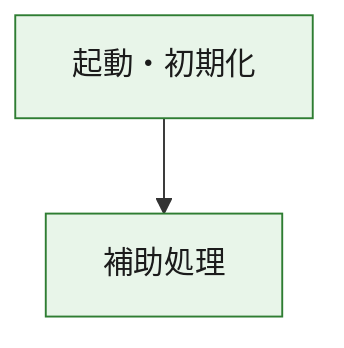
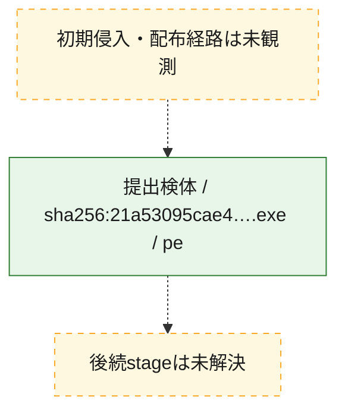
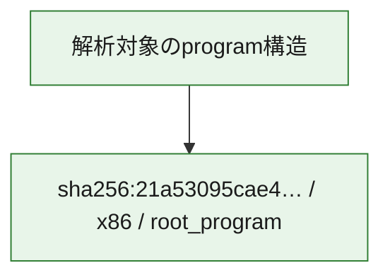

# 全体ロジック：21a53095cae457f88d9b7507ae5c757012f37d783a0729c333b4649a918de78a

代表関数の静的証跡から、起動・初期化の処理群を確認しました。

## 読み方

- phaseの掲載順は解析上の整理順です。observed_call_edgesがない段階間の実行順を断定しません。
- 図の実線は静的に観測した関係、点線と黄色のノードは未観測・未解決の関係を示します。
- 図は静的な要約であり、動的実行を再現するものではありません。
- 詳細な関数解説とfingerprintは[STATIC-LOGIC.md](STATIC-LOGIC.md)を参照してください。

## 静的可視化

### 実行フロー

### 感染チェーン

### モジュール関係

## 処理段階

### 1. 起動・初期化

entry pointから初期化と後続処理への移行を確認します。
確度: `confirmed_static_function_evidence`

- `21a53095cae457f88d9b7507ae5c757012f37d783a0729c333b4649a918de78a:ghidra:180001010` — 初期化と主要処理への分岐を行う入口関数です。 状態: `succeeded`、選定理由: `entry_point`, `meaningful_symbol_name`, `reviewed_call_centrality:22`, `role:entrypoint`, `small_program_complete_context`

### 2. 補助処理

主要処理を支える一般内部関数またはlibrary処理を確認します。
確度: `confirmed_static_function_evidence`

- `21a53095cae457f88d9b7507ae5c757012f37d783a0729c333b4649a918de78a:ghidra:180001240` — 検体内部の一般処理を実装する関数です。 状態: `succeeded`、選定理由: `context_representative`, `reviewed_call_centrality:2`, `small_program_complete_context`
- `21a53095cae457f88d9b7507ae5c757012f37d783a0729c333b4649a918de78a:ghidra:180001350` — 検体内部の一般処理を実装する関数です。 状態: `succeeded`、選定理由: `context_representative`, `reviewed_call_centrality:25`, `small_program_complete_context`
- `21a53095cae457f88d9b7507ae5c757012f37d783a0729c333b4649a918de78a:ghidra:180003780` — 検体内部の一般処理を実装する関数です。 状態: `succeeded`、選定理由: `context_representative`, `reviewed_call_centrality:2`, `small_program_complete_context`
- `21a53095cae457f88d9b7507ae5c757012f37d783a0729c333b4649a918de78a:ghidra:1800038e0` — 検体内部の一般処理を実装する関数です。 状態: `succeeded`、選定理由: `context_representative`, `reviewed_call_centrality:2`, `small_program_complete_context`

## 観測したcall関係

- `21a53095cae457f88d9b7507ae5c757012f37d783a0729c333b4649a918de78a:ghidra:180001010` → `21a53095cae457f88d9b7507ae5c757012f37d783a0729c333b4649a918de78a:ghidra:180001240` （`startup` → `support`）
- `21a53095cae457f88d9b7507ae5c757012f37d783a0729c333b4649a918de78a:ghidra:180001010` → `21a53095cae457f88d9b7507ae5c757012f37d783a0729c333b4649a918de78a:ghidra:180001350` （`startup` → `support`）
- `21a53095cae457f88d9b7507ae5c757012f37d783a0729c333b4649a918de78a:ghidra:180001350` → `21a53095cae457f88d9b7507ae5c757012f37d783a0729c333b4649a918de78a:ghidra:180001240` （`support` → `support`）
- `21a53095cae457f88d9b7507ae5c757012f37d783a0729c333b4649a918de78a:ghidra:180001350` → `21a53095cae457f88d9b7507ae5c757012f37d783a0729c333b4649a918de78a:ghidra:180003780` （`support` → `support`）
- `21a53095cae457f88d9b7507ae5c757012f37d783a0729c333b4649a918de78a:ghidra:180001350` → `21a53095cae457f88d9b7507ae5c757012f37d783a0729c333b4649a918de78a:ghidra:1800038e0` （`support` → `support`）
- `21a53095cae457f88d9b7507ae5c757012f37d783a0729c333b4649a918de78a:ghidra:180003780` → `21a53095cae457f88d9b7507ae5c757012f37d783a0729c333b4649a918de78a:ghidra:1800038e0` （`support` → `support`）
- `ghidra-function:7b6c60daa3af805740fa5b02` → `ghidra-function:2a304db132868e90ee4ae577` （`unclassified` → `unclassified`）
- `ghidra-function:7b6c60daa3af805740fa5b02` → `ghidra-function:35786defbe2a38dd679703f2` （`unclassified` → `unclassified`）
- `ghidra-function:7b6c60daa3af805740fa5b02` → `ghidra-function:4ac64e9ee577827b5218bb87` （`unclassified` → `unclassified`）
- `ghidra-function:7b6c60daa3af805740fa5b02` → `ghidra-function:4ec2277918eaab8afa919b6c` （`unclassified` → `unclassified`）
- `ghidra-function:7b6c60daa3af805740fa5b02` → `ghidra-function:54e3b19fc03b62a46504c4cd` （`unclassified` → `unclassified`）
- `ghidra-function:7b6c60daa3af805740fa5b02` → `ghidra-function:6effbbdf453bcda4d420eefe` （`unclassified` → `unclassified`）
- `ghidra-function:7b6c60daa3af805740fa5b02` → `ghidra-function:a9bcbac542c65b24f813ebd2` （`unclassified` → `unclassified`）
- `ghidra-function:7b6c60daa3af805740fa5b02` → `ghidra-function:aac41bcc75dbd7929d3da933` （`unclassified` → `unclassified`）
- `ghidra-function:7b6c60daa3af805740fa5b02` → `ghidra-function:bc0b30befb31ae9f64a032ee` （`unclassified` → `unclassified`）
- `ghidra-function:7b6c60daa3af805740fa5b02` → `ghidra-function:bdb0af4802b9b46fc1189ba4` （`unclassified` → `unclassified`）
- `ghidra-function:7b6c60daa3af805740fa5b02` → `ghidra-function:bfe6d2a38c5072e5a465d7b7` （`unclassified` → `unclassified`）
- `ghidra-function:7b6c60daa3af805740fa5b02` → `ghidra-function:eb1777a1b23d02388f04790c` （`unclassified` → `unclassified`）
- `ghidra-function:bfe6d2a38c5072e5a465d7b7` → `ghidra-external:0cc9fa443e950d5dc78bd1ad` （`unclassified` → `unclassified`）
- `ghidra-function:bfe6d2a38c5072e5a465d7b7` → `ghidra-external:1765c70cde666b236e870a4f` （`unclassified` → `unclassified`）
- `ghidra-function:bfe6d2a38c5072e5a465d7b7` → `ghidra-external:2c09e2e800e8e6d31bb9ba1f` （`unclassified` → `unclassified`）
- `ghidra-function:bfe6d2a38c5072e5a465d7b7` → `ghidra-external:30b55dcb5968104be9a2e5ed` （`unclassified` → `unclassified`）
- `ghidra-function:bfe6d2a38c5072e5a465d7b7` → `ghidra-external:311bd18547faf443829b195b` （`unclassified` → `unclassified`）
- `ghidra-function:bfe6d2a38c5072e5a465d7b7` → `ghidra-external:385cac5b72c599a4e0703e8e` （`unclassified` → `unclassified`）
- `ghidra-function:bfe6d2a38c5072e5a465d7b7` → `ghidra-external:426cca018563995ae660ee17` （`unclassified` → `unclassified`）
- `ghidra-function:bfe6d2a38c5072e5a465d7b7` → `ghidra-external:5f03307964361a22155e3686` （`unclassified` → `unclassified`）
- `ghidra-function:bfe6d2a38c5072e5a465d7b7` → `ghidra-external:7e905044bc24d6fb7c790bed` （`unclassified` → `unclassified`）
- `ghidra-function:bfe6d2a38c5072e5a465d7b7` → `ghidra-external:8672fd24e4857cacc8806a66` （`unclassified` → `unclassified`）
- `ghidra-function:bfe6d2a38c5072e5a465d7b7` → `ghidra-external:8703c802a44ee18ee7dfc254` （`unclassified` → `unclassified`）
- `ghidra-function:bfe6d2a38c5072e5a465d7b7` → `ghidra-external:8891ce074c2953f610fd5e9d` （`unclassified` → `unclassified`）
- `ghidra-function:bfe6d2a38c5072e5a465d7b7` → `ghidra-external:91722ce0e9a10fc507575dfa` （`unclassified` → `unclassified`）
- `ghidra-function:bfe6d2a38c5072e5a465d7b7` → `ghidra-external:a17e431f04cf112bf690e073` （`unclassified` → `unclassified`）
- `ghidra-function:bfe6d2a38c5072e5a465d7b7` → `ghidra-external:a1a302784fb020dfddb4e6b9` （`unclassified` → `unclassified`）
- `ghidra-function:bfe6d2a38c5072e5a465d7b7` → `ghidra-external:cab1d06207f09f4b34ddc451` （`unclassified` → `unclassified`）
- `ghidra-function:bfe6d2a38c5072e5a465d7b7` → `ghidra-external:cd078197588914e09c6b31d4` （`unclassified` → `unclassified`）
- `ghidra-function:bfe6d2a38c5072e5a465d7b7` → `ghidra-external:d968b486341a53cd1a4005af` （`unclassified` → `unclassified`）
- `ghidra-function:bfe6d2a38c5072e5a465d7b7` → `ghidra-external:e58f6a8fc2b4cafd92a04d4c` （`unclassified` → `unclassified`）
- `ghidra-function:bfe6d2a38c5072e5a465d7b7` → `ghidra-external:e8119e0405198bf9e6f3d0d9` （`unclassified` → `unclassified`）
- `ghidra-function:bfe6d2a38c5072e5a465d7b7` → `ghidra-external:f8e7cf09de43e3b4a40f6b34` （`unclassified` → `unclassified`）
- `ghidra-function:bfe6d2a38c5072e5a465d7b7` → `ghidra-function:ac38793343c40bd6303eb95f` （`unclassified` → `unclassified`）
- `ghidra-function:bfe6d2a38c5072e5a465d7b7` → `ghidra-function:bc0b30befb31ae9f64a032ee` （`unclassified` → `unclassified`）
- `ghidra-function:bfe6d2a38c5072e5a465d7b7` → `ghidra-function:c93acafeafa8cc6be53f3624` （`unclassified` → `unclassified`）
- `ghidra-function:c93acafeafa8cc6be53f3624` → `ghidra-function:ac38793343c40bd6303eb95f` （`unclassified` → `unclassified`）

## 解析範囲と制約

- 選定外関数は全体inventoryへ残しますが、関数本体の個別解説対象にはしていません。
- indirect call、難読化、packer、VM、壊れたcontrol flowによりcall関係が欠落する場合があります。
- 文書は静的解析に基づき、検体実行や外部通信による動的確認は行っていません。
