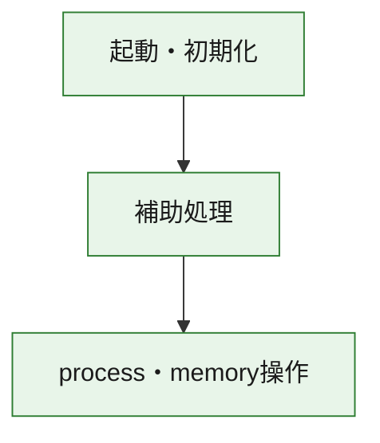
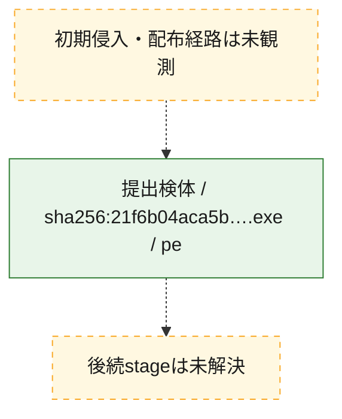
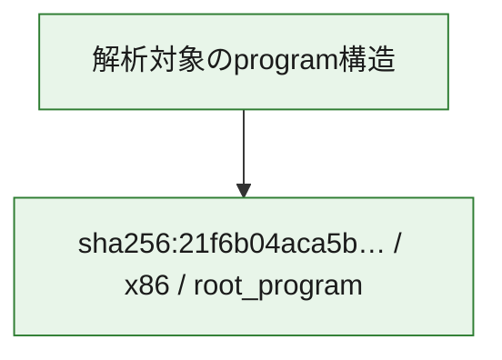

# 全体ロジック：21f6b04aca5bae521f0b9b9d7c02d30b286588144d9d74307697a57d19a7fb11

代表関数の静的証跡から、起動・初期化、process・memory操作の処理群を確認しました。

## 読み方

- phaseの掲載順は解析上の整理順です。observed_call_edgesがない段階間の実行順を断定しません。
- 図の実線は静的に観測した関係、点線と黄色のノードは未観測・未解決の関係を示します。
- 図は静的な要約であり、動的実行を再現するものではありません。
- 詳細な関数解説とfingerprintは[STATIC-LOGIC.md](STATIC-LOGIC.md)を参照してください。

## 静的可視化

### 実行フロー

### 感染チェーン

### モジュール関係

## 処理段階

### 1. 起動・初期化

entry pointから初期化と後続処理への移行を確認します。
確度: `confirmed_static_function_evidence`

- `21f6b04aca5bae521f0b9b9d7c02d30b286588144d9d74307697a57d19a7fb11:ghidra:140001410` — 初期化と主要処理への分岐を行う入口関数です。 状態: `succeeded`、選定理由: `entry_point`, `meaningful_symbol_name`, `reviewed_call_centrality:1`, `role:entrypoint`

### 2. process・memory操作

process、thread、module、memory操作と実行移行を確認します。
確度: `confirmed_static_function_evidence`

- `21f6b04aca5bae521f0b9b9d7c02d30b286588144d9d74307697a57d19a7fb11:ghidra:140001480` — process、thread、module、またはmemory操作に関係する関数です。 状態: `succeeded`、選定理由: `context_representative`, `reviewed_call_centrality:22`, `role:process_or_memory_operation`
- `21f6b04aca5bae521f0b9b9d7c02d30b286588144d9d74307697a57d19a7fb11:ghidra:140001bb0` — process、thread、module、またはmemory操作に関係する関数です。 状態: `succeeded`、選定理由: `context_representative`, `reviewed_call_centrality:16`, `role:process_or_memory_operation`
- `21f6b04aca5bae521f0b9b9d7c02d30b286588144d9d74307697a57d19a7fb11:ghidra:140001c20` — process、thread、module、またはmemory操作に関係する関数です。 状態: `succeeded`、選定理由: `context_representative`, `reviewed_call_centrality:12`, `role:process_or_memory_operation`

### 3. 補助処理

主要処理を支える一般内部関数またはlibrary処理を確認します。
確度: `confirmed_static_function_evidence_with_limits`

- `21f6b04aca5bae521f0b9b9d7c02d30b286588144d9d74307697a57d19a7fb11:ghidra:140001000` — 検体内部の一般処理を実装する関数です。 状態: `succeeded`、選定理由: `context_representative`
- `21f6b04aca5bae521f0b9b9d7c02d30b286588144d9d74307697a57d19a7fb11:ghidra:140001010` — 検体内部の一般処理を実装する関数です。 状態: `succeeded`、選定理由: `context_representative`, `reviewed_call_centrality:6`
- `21f6b04aca5bae521f0b9b9d7c02d30b286588144d9d74307697a57d19a7fb11:ghidra:140001140` — 検体内部の一般処理を実装する関数です。 状態: `succeeded`、選定理由: `context_representative`, `reviewed_call_centrality:1`
- `21f6b04aca5bae521f0b9b9d7c02d30b286588144d9d74307697a57d19a7fb11:ghidra:140001190` — 検体内部の一般処理を実装する関数です。 状態: `succeeded`、選定理由: `context_representative`, `reviewed_call_centrality:21`
- `21f6b04aca5bae521f0b9b9d7c02d30b286588144d9d74307697a57d19a7fb11:ghidra:1400013e0` — 検体内部の一般処理を実装する関数です。 状態: `succeeded`、選定理由: `context_representative`, `reviewed_call_centrality:1`
- `21f6b04aca5bae521f0b9b9d7c02d30b286588144d9d74307697a57d19a7fb11:ghidra:140001440` — 検体内部の一般処理を実装する関数です。 状態: `succeeded`、選定理由: `context_representative`, `reviewed_call_centrality:1`
- `21f6b04aca5bae521f0b9b9d7c02d30b286588144d9d74307697a57d19a7fb11:ghidra:140001460` — 検体内部の一般処理を実装する関数です。 状態: `succeeded`、選定理由: `context_representative`, `reviewed_call_centrality:1`
- `21f6b04aca5bae521f0b9b9d7c02d30b286588144d9d74307697a57d19a7fb11:ghidra:140001470` — 検体内部の一般処理を実装する関数です。 状態: `succeeded`、選定理由: `context_representative`
- `21f6b04aca5bae521f0b9b9d7c02d30b286588144d9d74307697a57d19a7fb11:ghidra:1400015d0` — 検体内部の一般処理を実装する関数です。 状態: `succeeded`、選定理由: `context_representative`, `reviewed_call_centrality:10`
- `21f6b04aca5bae521f0b9b9d7c02d30b286588144d9d74307697a57d19a7fb11:ghidra:1400016f0` — 検体内部の一般処理を実装する関数です。 状態: `succeeded`、選定理由: `context_representative`, `reviewed_call_centrality:2`
- `21f6b04aca5bae521f0b9b9d7c02d30b286588144d9d74307697a57d19a7fb11:ghidra:140001740` — 検体内部の一般処理を実装する関数です。 状態: `succeeded`、選定理由: `context_representative`, `reviewed_call_centrality:9`
- `21f6b04aca5bae521f0b9b9d7c02d30b286588144d9d74307697a57d19a7fb11:ghidra:1400018d0` — 検体内部の一般処理を実装する関数です。 状態: `succeeded`、選定理由: `context_representative`
- `21f6b04aca5bae521f0b9b9d7c02d30b286588144d9d74307697a57d19a7fb11:ghidra:140001920` — 検体内部の一般処理を実装する関数です。 状態: `succeeded`、選定理由: `context_representative`, `reviewed_call_centrality:1`
- `21f6b04aca5bae521f0b9b9d7c02d30b286588144d9d74307697a57d19a7fb11:ghidra:1400019a0` — 検体内部の一般処理を実装する関数です。 状態: `succeeded`、選定理由: `context_representative`, `reviewed_call_centrality:2`
- `21f6b04aca5bae521f0b9b9d7c02d30b286588144d9d74307697a57d19a7fb11:ghidra:1400019c0` — 検体内部の一般処理を実装する関数です。 状態: `succeeded`、選定理由: `context_representative`, `reviewed_call_centrality:1`
- `21f6b04aca5bae521f0b9b9d7c02d30b286588144d9d74307697a57d19a7fb11:ghidra:1400019d0` — compiler生成処理または汎用library処理とみられる関数です。 状態: `succeeded`、選定理由: `entry_point`, `meaningful_symbol_name`, `reviewed_call_centrality:1`
- `21f6b04aca5bae521f0b9b9d7c02d30b286588144d9d74307697a57d19a7fb11:ghidra:140001a00` — compiler生成処理または汎用library処理とみられる関数です。 状態: `succeeded`、選定理由: `entry_point`, `meaningful_symbol_name`, `reviewed_call_centrality:3`
- `21f6b04aca5bae521f0b9b9d7c02d30b286588144d9d74307697a57d19a7fb11:ghidra:140001a90` — 検体内部の一般処理を実装する関数です。 状態: `succeeded`、選定理由: `context_representative`
- `21f6b04aca5bae521f0b9b9d7c02d30b286588144d9d74307697a57d19a7fb11:ghidra:140001aa0` — 検体内部の一般処理を実装する関数です。 状態: `succeeded`、選定理由: `context_representative`, `reviewed_call_centrality:2`
- `21f6b04aca5bae521f0b9b9d7c02d30b286588144d9d74307697a57d19a7fb11:ghidra:140001ba0` — 検体内部の一般処理を実装する関数です。 状態: `succeeded`、選定理由: `context_representative`, `reviewed_call_centrality:3`
- `21f6b04aca5bae521f0b9b9d7c02d30b286588144d9d74307697a57d19a7fb11:ghidra:140001d90` — 検体内部の一般処理を実装する関数です。 状態: `succeeded`、選定理由: `context_representative`, `reviewed_call_centrality:4`
- `21f6b04aca5bae521f0b9b9d7c02d30b286588144d9d74307697a57d19a7fb11:ghidra:1400020f0` — 検体内部の一般処理を実装する関数です。 状態: `succeeded`、選定理由: `context_representative`
- `21f6b04aca5bae521f0b9b9d7c02d30b286588144d9d74307697a57d19a7fb11:ghidra:140002130` — 検体内部の一般処理を実装する関数です。 状態: `limited_bad_instruction_or_flow`、選定理由: `context_representative`, `reviewed_call_centrality:3`
- `21f6b04aca5bae521f0b9b9d7c02d30b286588144d9d74307697a57d19a7fb11:ghidra:140002140` — 検体内部の一般処理を実装する関数です。 状態: `limited_bad_instruction_or_flow`、選定理由: `context_representative`, `reviewed_call_centrality:2`
- `21f6b04aca5bae521f0b9b9d7c02d30b286588144d9d74307697a57d19a7fb11:ghidra:140002300` — 検体内部の一般処理を実装する関数です。 状態: `limited_bad_instruction_or_flow`、選定理由: `context_representative`, `reviewed_call_centrality:9`
- `21f6b04aca5bae521f0b9b9d7c02d30b286588144d9d74307697a57d19a7fb11:ghidra:140002380` — 検体内部の一般処理を実装する関数です。 状態: `succeeded`、選定理由: `context_representative`, `reviewed_call_centrality:5`
- `21f6b04aca5bae521f0b9b9d7c02d30b286588144d9d74307697a57d19a7fb11:ghidra:140002400` — 検体内部の一般処理を実装する関数です。 状態: `succeeded`、選定理由: `context_representative`, `reviewed_call_centrality:5`
- `21f6b04aca5bae521f0b9b9d7c02d30b286588144d9d74307697a57d19a7fb11:ghidra:1400024a0` — 検体内部の一般処理を実装する関数です。 状態: `succeeded`、選定理由: `context_representative`, `reviewed_call_centrality:9`

## 観測したcall関係

- `21f6b04aca5bae521f0b9b9d7c02d30b286588144d9d74307697a57d19a7fb11:ghidra:140001010` → `21f6b04aca5bae521f0b9b9d7c02d30b286588144d9d74307697a57d19a7fb11:ghidra:1400019c0` （`support` → `support`）
- `21f6b04aca5bae521f0b9b9d7c02d30b286588144d9d74307697a57d19a7fb11:ghidra:140001010` → `21f6b04aca5bae521f0b9b9d7c02d30b286588144d9d74307697a57d19a7fb11:ghidra:140002130` （`support` → `support`）
- `21f6b04aca5bae521f0b9b9d7c02d30b286588144d9d74307697a57d19a7fb11:ghidra:140001190` → `21f6b04aca5bae521f0b9b9d7c02d30b286588144d9d74307697a57d19a7fb11:ghidra:1400019a0` （`support` → `support`）
- `21f6b04aca5bae521f0b9b9d7c02d30b286588144d9d74307697a57d19a7fb11:ghidra:140001190` → `21f6b04aca5bae521f0b9b9d7c02d30b286588144d9d74307697a57d19a7fb11:ghidra:140001a00` （`support` → `support`）
- `21f6b04aca5bae521f0b9b9d7c02d30b286588144d9d74307697a57d19a7fb11:ghidra:140001190` → `21f6b04aca5bae521f0b9b9d7c02d30b286588144d9d74307697a57d19a7fb11:ghidra:140001ba0` （`support` → `support`）
- `21f6b04aca5bae521f0b9b9d7c02d30b286588144d9d74307697a57d19a7fb11:ghidra:140001190` → `21f6b04aca5bae521f0b9b9d7c02d30b286588144d9d74307697a57d19a7fb11:ghidra:140001d90` （`support` → `support`）
- `21f6b04aca5bae521f0b9b9d7c02d30b286588144d9d74307697a57d19a7fb11:ghidra:1400013e0` → `21f6b04aca5bae521f0b9b9d7c02d30b286588144d9d74307697a57d19a7fb11:ghidra:140001190` （`support` → `support`）
- `21f6b04aca5bae521f0b9b9d7c02d30b286588144d9d74307697a57d19a7fb11:ghidra:140001410` → `21f6b04aca5bae521f0b9b9d7c02d30b286588144d9d74307697a57d19a7fb11:ghidra:140001190` （`startup` → `support`）
- `21f6b04aca5bae521f0b9b9d7c02d30b286588144d9d74307697a57d19a7fb11:ghidra:1400015d0` → `21f6b04aca5bae521f0b9b9d7c02d30b286588144d9d74307697a57d19a7fb11:ghidra:140001480` （`support` → `execution`）
- `21f6b04aca5bae521f0b9b9d7c02d30b286588144d9d74307697a57d19a7fb11:ghidra:140001740` → `21f6b04aca5bae521f0b9b9d7c02d30b286588144d9d74307697a57d19a7fb11:ghidra:140001480` （`support` → `execution`）
- `21f6b04aca5bae521f0b9b9d7c02d30b286588144d9d74307697a57d19a7fb11:ghidra:140001740` → `21f6b04aca5bae521f0b9b9d7c02d30b286588144d9d74307697a57d19a7fb11:ghidra:1400016f0` （`support` → `support`）
- `21f6b04aca5bae521f0b9b9d7c02d30b286588144d9d74307697a57d19a7fb11:ghidra:1400019d0` → `21f6b04aca5bae521f0b9b9d7c02d30b286588144d9d74307697a57d19a7fb11:ghidra:1400024a0` （`support` → `support`）
- `21f6b04aca5bae521f0b9b9d7c02d30b286588144d9d74307697a57d19a7fb11:ghidra:140001a00` → `21f6b04aca5bae521f0b9b9d7c02d30b286588144d9d74307697a57d19a7fb11:ghidra:1400024a0` （`support` → `support`）
- `21f6b04aca5bae521f0b9b9d7c02d30b286588144d9d74307697a57d19a7fb11:ghidra:140001c20` → `21f6b04aca5bae521f0b9b9d7c02d30b286588144d9d74307697a57d19a7fb11:ghidra:140001bb0` （`execution` → `execution`）
- `21f6b04aca5bae521f0b9b9d7c02d30b286588144d9d74307697a57d19a7fb11:ghidra:140002140` → `21f6b04aca5bae521f0b9b9d7c02d30b286588144d9d74307697a57d19a7fb11:ghidra:140001ba0` （`support` → `support`）
- `21f6b04aca5bae521f0b9b9d7c02d30b286588144d9d74307697a57d19a7fb11:ghidra:1400024a0` → `21f6b04aca5bae521f0b9b9d7c02d30b286588144d9d74307697a57d19a7fb11:ghidra:140001ba0` （`support` → `support`）
- `21f6b04aca5bae521f0b9b9d7c02d30b286588144d9d74307697a57d19a7fb11:ghidra:1400024a0` → `21f6b04aca5bae521f0b9b9d7c02d30b286588144d9d74307697a57d19a7fb11:ghidra:140002300` （`support` → `support`）
- `ghidra-function:0c4da051353d3c43b6f0766d` → `ghidra-external:99056a13c643b3da9f523e61` （`unclassified` → `unclassified`）
- `ghidra-function:0c84b385e0abcb88154da4d9` → `ghidra-function:e39d6d7080168f6958bb8255` （`unclassified` → `unclassified`）
- `ghidra-function:0f9a46e2a4c1e02c6819efa8` → `ghidra-external:99056a13c643b3da9f523e61` （`unclassified` → `unclassified`）
- `ghidra-function:13c11358a5cb8abdb9c10454` → `ghidra-external:c749b3d712f0374a31722c2d` （`unclassified` → `unclassified`）
- `ghidra-function:13c11358a5cb8abdb9c10454` → `ghidra-function:57141d7057ab5c76db863b08` （`unclassified` → `unclassified`）
- `ghidra-function:13c11358a5cb8abdb9c10454` → `ghidra-function:d3cdb1be0216568cc09e035c` （`unclassified` → `unclassified`）
- `ghidra-function:29b3d7c69866558b87785931` → `ghidra-external:02ad551d8d6fb4a77aac7db4` （`unclassified` → `unclassified`）
- `ghidra-function:29b3d7c69866558b87785931` → `ghidra-external:61781901a52dfbd64994f817` （`unclassified` → `unclassified`）
- `ghidra-function:29b3d7c69866558b87785931` → `ghidra-external:a814c3910544d18e74b6c686` （`unclassified` → `unclassified`）
- `ghidra-function:29b3d7c69866558b87785931` → `ghidra-function:40414df0b32b0e8777cbe773` （`unclassified` → `unclassified`）
- `ghidra-function:29b3d7c69866558b87785931` → `ghidra-function:526ff85f37d722c543137ec1` （`unclassified` → `unclassified`）
- `ghidra-function:29b3d7c69866558b87785931` → `ghidra-function:5302968c3383e2e60c590ac9` （`unclassified` → `unclassified`）
- `ghidra-function:29b3d7c69866558b87785931` → `ghidra-function:5bbd5c2b1128a25e0c2981ec` （`unclassified` → `unclassified`）
- `ghidra-function:330178b75ca14f4e683f18ce` → `ghidra-function:e39d6d7080168f6958bb8255` （`unclassified` → `unclassified`）
- `ghidra-function:36cabdfe65014cb5d713adea` → `ghidra-external:0f212c0ffac612f3b83972ef` （`unclassified` → `unclassified`）
- `ghidra-function:36cabdfe65014cb5d713adea` → `ghidra-function:57141d7057ab5c76db863b08` （`unclassified` → `unclassified`）
- `ghidra-function:36cabdfe65014cb5d713adea` → `ghidra-function:d3cdb1be0216568cc09e035c` （`unclassified` → `unclassified`）
- `ghidra-function:3f66c1a989bbb822ed43407b` → `ghidra-external:86455a9951e8b37c386e63fb` （`unclassified` → `unclassified`）
- `ghidra-function:3f66c1a989bbb822ed43407b` → `ghidra-external:955671423224266957b22d60` （`unclassified` → `unclassified`）
- `ghidra-function:3f66c1a989bbb822ed43407b` → `ghidra-external:9b6a801943f82b7c85212c79` （`unclassified` → `unclassified`）
- `ghidra-function:3f66c1a989bbb822ed43407b` → `ghidra-external:b42eb4f44ee221faf8f05eb8` （`unclassified` → `unclassified`）
- `ghidra-function:3f66c1a989bbb822ed43407b` → `ghidra-external:f2a5526a4d2b714432ed03a3` （`unclassified` → `unclassified`）
- `ghidra-function:3f66c1a989bbb822ed43407b` → `ghidra-function:28d45b75d885557b60f357dd` （`unclassified` → `unclassified`）
- `ghidra-function:3f66c1a989bbb822ed43407b` → `ghidra-function:327bef73446a31bd6a1d0edb` （`unclassified` → `unclassified`）
- `ghidra-function:3f66c1a989bbb822ed43407b` → `ghidra-function:6302363aa7e1d4901d9622e8` （`unclassified` → `unclassified`）
- `ghidra-function:3f66c1a989bbb822ed43407b` → `ghidra-function:917f2df5421f62f3c787d36f` （`unclassified` → `unclassified`）
- `ghidra-function:3f66c1a989bbb822ed43407b` → `ghidra-function:a01d074f48acb68e0cddfe54` （`unclassified` → `unclassified`）
- `ghidra-function:3f66c1a989bbb822ed43407b` → `ghidra-function:f7aab9935834cbd394b39440` （`unclassified` → `unclassified`）
- `ghidra-function:3f66c1a989bbb822ed43407b` → `ghidra-function:ffa0138c0cbf971aa0c098d5` （`unclassified` → `unclassified`）
- `ghidra-function:4dd776c1354c2084953ebbca` → `ghidra-function:57141d7057ab5c76db863b08` （`unclassified` → `unclassified`）
- `ghidra-function:4dd776c1354c2084953ebbca` → `ghidra-function:8ff49fc85db555380f6d922b` （`unclassified` → `unclassified`）
- `ghidra-function:4dd776c1354c2084953ebbca` → `ghidra-function:917f2df5421f62f3c787d36f` （`unclassified` → `unclassified`）
- `ghidra-function:4dd776c1354c2084953ebbca` → `ghidra-function:d3cdb1be0216568cc09e035c` （`unclassified` → `unclassified`）
- `ghidra-function:526ff85f37d722c543137ec1` → `ghidra-external:23432cd9bc90c4281d206495` （`unclassified` → `unclassified`）
- `ghidra-function:526ff85f37d722c543137ec1` → `ghidra-external:2d004853e3b86a72d2ad0c2c` （`unclassified` → `unclassified`）
- `ghidra-function:526ff85f37d722c543137ec1` → `ghidra-function:07b9eae8d8e901b53ccaa29c` （`unclassified` → `unclassified`）
- `ghidra-function:526ff85f37d722c543137ec1` → `ghidra-function:394bd2889f6f55eb43f8e309` （`unclassified` → `unclassified`）
- `ghidra-function:526ff85f37d722c543137ec1` → `ghidra-function:40414df0b32b0e8777cbe773` （`unclassified` → `unclassified`）
- `ghidra-function:526ff85f37d722c543137ec1` → `ghidra-function:682c3bfd1bca1da48759e54d` （`unclassified` → `unclassified`）
- `ghidra-function:526ff85f37d722c543137ec1` → `ghidra-function:7918e27bb94358340495a96b` （`unclassified` → `unclassified`）
- `ghidra-function:526ff85f37d722c543137ec1` → `ghidra-function:99bad7697d590d7eb940ab52` （`unclassified` → `unclassified`）
- `ghidra-function:526ff85f37d722c543137ec1` → `ghidra-function:b406f8596bb963528108a43a` （`unclassified` → `unclassified`）
- `ghidra-function:526ff85f37d722c543137ec1` → `ghidra-function:c33270ac5aeb3332636d243a` （`unclassified` → `unclassified`）
- `ghidra-function:526ff85f37d722c543137ec1` → `ghidra-function:d89aaa121b31f465f5bd227d` （`unclassified` → `unclassified`）
- `ghidra-function:59277f607d3ebd4ddef50509` → `ghidra-function:660be208fd20e59cec1170db` （`unclassified` → `unclassified`）
- `ghidra-function:7e9132cd3c38febdbf281b8e` → `ghidra-external:86455a9951e8b37c386e63fb` （`unclassified` → `unclassified`）
- `ghidra-function:7e9132cd3c38febdbf281b8e` → `ghidra-external:f2a5526a4d2b714432ed03a3` （`unclassified` → `unclassified`）
- `ghidra-function:7e9132cd3c38febdbf281b8e` → `ghidra-function:327bef73446a31bd6a1d0edb` （`unclassified` → `unclassified`）
- `ghidra-function:7e9132cd3c38febdbf281b8e` → `ghidra-function:3f66c1a989bbb822ed43407b` （`unclassified` → `unclassified`）
- `ghidra-function:7e9132cd3c38febdbf281b8e` → `ghidra-function:6302363aa7e1d4901d9622e8` （`unclassified` → `unclassified`）
- `ghidra-function:7e9132cd3c38febdbf281b8e` → `ghidra-function:917f2df5421f62f3c787d36f` （`unclassified` → `unclassified`）
- `ghidra-function:7e9132cd3c38febdbf281b8e` → `ghidra-function:a01d074f48acb68e0cddfe54` （`unclassified` → `unclassified`）
- `ghidra-function:7e9132cd3c38febdbf281b8e` → `ghidra-function:f7aab9935834cbd394b39440` （`unclassified` → `unclassified`）
- `ghidra-function:7e9132cd3c38febdbf281b8e` → `ghidra-function:ffa0138c0cbf971aa0c098d5` （`unclassified` → `unclassified`）
- `ghidra-function:8d6a9d35c9583663c888765d` → `ghidra-function:a21e3d336523fcf44d6cdc1d` （`unclassified` → `unclassified`）
- `ghidra-function:8e945407ec936ace1043c15e` → `ghidra-external:86455a9951e8b37c386e63fb` （`unclassified` → `unclassified`）
- `ghidra-function:8e945407ec936ace1043c15e` → `ghidra-external:f2a5526a4d2b714432ed03a3` （`unclassified` → `unclassified`）
- `ghidra-function:8e945407ec936ace1043c15e` → `ghidra-function:a01d074f48acb68e0cddfe54` （`unclassified` → `unclassified`）
- `ghidra-function:ab3be5badc9824ef82964c04` → `ghidra-external:02ad551d8d6fb4a77aac7db4` （`unclassified` → `unclassified`）
- `ghidra-function:ab3be5badc9824ef82964c04` → `ghidra-external:61781901a52dfbd64994f817` （`unclassified` → `unclassified`）
- `ghidra-function:ab3be5badc9824ef82964c04` → `ghidra-external:a814c3910544d18e74b6c686` （`unclassified` → `unclassified`）
- `ghidra-function:ab3be5badc9824ef82964c04` → `ghidra-function:40414df0b32b0e8777cbe773` （`unclassified` → `unclassified`）
- `ghidra-function:ab3be5badc9824ef82964c04` → `ghidra-function:526ff85f37d722c543137ec1` （`unclassified` → `unclassified`）
- `ghidra-function:ab3be5badc9824ef82964c04` → `ghidra-function:59277f607d3ebd4ddef50509` （`unclassified` → `unclassified`）
- `ghidra-function:ab3be5badc9824ef82964c04` → `ghidra-function:5bbd5c2b1128a25e0c2981ec` （`unclassified` → `unclassified`）
- `ghidra-function:add49116f641b20f47dcd51d` → `ghidra-external:50b4060ed97df3904447dbe7` （`unclassified` → `unclassified`）
- `ghidra-function:add49116f641b20f47dcd51d` → `ghidra-function:59a11e52ec585d7aa299898c` （`unclassified` → `unclassified`）
- `ghidra-function:b1e9a35471d1f5353d1562fe` → `ghidra-external:18de000a9159525c3e04bd57` （`unclassified` → `unclassified`）
- `ghidra-function:b1e9a35471d1f5353d1562fe` → `ghidra-function:28d45b75d885557b60f357dd` （`unclassified` → `unclassified`）
- `ghidra-function:bec46e70a887ff49a697256a` → `ghidra-external:b7ffff8b79b7280681a29057` （`unclassified` → `unclassified`）
- `ghidra-function:c6f3065acf82f2ee9f5edaff` → `ghidra-external:99056a13c643b3da9f523e61` （`unclassified` → `unclassified`）
- `ghidra-function:dbe6fdfea5543e0b21b6816a` → `ghidra-external:86455a9951e8b37c386e63fb` （`unclassified` → `unclassified`）
- `ghidra-function:dbe6fdfea5543e0b21b6816a` → `ghidra-function:fc4dfdeaa977f4fd03b7d2d9` （`unclassified` → `unclassified`）
- `ghidra-function:e39d6d7080168f6958bb8255` → `ghidra-external:1d2f8adbac2b50e27924d5fe` （`unclassified` → `unclassified`）
- `ghidra-function:e39d6d7080168f6958bb8255` → `ghidra-external:2cb1896fa973c9811a9892f7` （`unclassified` → `unclassified`）
- `ghidra-function:e39d6d7080168f6958bb8255` → `ghidra-external:5daafc581b858841c9af148a` （`unclassified` → `unclassified`）
- `ghidra-function:e39d6d7080168f6958bb8255` → `ghidra-external:5db819d944709a2eb7c87b04` （`unclassified` → `unclassified`）
- `ghidra-function:e39d6d7080168f6958bb8255` → `ghidra-external:7c4574afdf5c3b5ac9c84be5` （`unclassified` → `unclassified`）
- `ghidra-function:e39d6d7080168f6958bb8255` → `ghidra-external:d08a53b04ba9bdcbd770c094` （`unclassified` → `unclassified`）
- `ghidra-function:e39d6d7080168f6958bb8255` → `ghidra-external:d16f60e5545a7e1cccd08cf3` （`unclassified` → `unclassified`）
- `ghidra-function:e39d6d7080168f6958bb8255` → `ghidra-external:ed7dce2540247d39eb2b821c` （`unclassified` → `unclassified`）
- `ghidra-function:e39d6d7080168f6958bb8255` → `ghidra-external:fd6ac70c2b5fcbbfaaf03a53` （`unclassified` → `unclassified`）
- `ghidra-function:e39d6d7080168f6958bb8255` → `ghidra-function:0f9a46e2a4c1e02c6819efa8` （`unclassified` → `unclassified`）
- `ghidra-function:e39d6d7080168f6958bb8255` → `ghidra-function:24f33e477c2ba41d2f49423c` （`unclassified` → `unclassified`）
- `ghidra-function:e39d6d7080168f6958bb8255` → `ghidra-function:59a11e52ec585d7aa299898c` （`unclassified` → `unclassified`）
- `ghidra-function:e39d6d7080168f6958bb8255` → `ghidra-function:65671c6d1dc1a6c33108071f` （`unclassified` → `unclassified`）
- `ghidra-function:e39d6d7080168f6958bb8255` → `ghidra-function:8e945407ec936ace1043c15e` （`unclassified` → `unclassified`）
- `ghidra-function:e39d6d7080168f6958bb8255` → `ghidra-function:9a30c3f9fab1e3c399fdac3c` （`unclassified` → `unclassified`）
- `ghidra-function:e39d6d7080168f6958bb8255` → `ghidra-function:d698d4631c821c00a271257e` （`unclassified` → `unclassified`）
- `ghidra-function:e39d6d7080168f6958bb8255` → `ghidra-function:dbe6fdfea5543e0b21b6816a` （`unclassified` → `unclassified`）
- `ghidra-function:f0bc4a4010d3a4f06540eed9` → `ghidra-function:fc4dfdeaa977f4fd03b7d2d9` （`unclassified` → `unclassified`）
- `ghidra-function:f20bcf20ec69708bc77f89b4` → `ghidra-external:36b46f5cef72650c07be3102` （`unclassified` → `unclassified`）
- `ghidra-function:f20bcf20ec69708bc77f89b4` → `ghidra-external:86455a9951e8b37c386e63fb` （`unclassified` → `unclassified`）
- `ghidra-function:f20bcf20ec69708bc77f89b4` → `ghidra-function:0a6f72e9a3642a75115d5d37` （`unclassified` → `unclassified`）
- `ghidra-function:f20bcf20ec69708bc77f89b4` → `ghidra-function:19e0e7829156b9e669c07459` （`unclassified` → `unclassified`）
- `ghidra-function:f20bcf20ec69708bc77f89b4` → `ghidra-function:820b16e94e334050d132fa40` （`unclassified` → `unclassified`）
- `ghidra-function:f20bcf20ec69708bc77f89b4` → `ghidra-function:8d6a9d35c9583663c888765d` （`unclassified` → `unclassified`）
- `ghidra-function:fc4dfdeaa977f4fd03b7d2d9` → `ghidra-external:c749b3d712f0374a31722c2d` （`unclassified` → `unclassified`）
- `ghidra-function:fc4dfdeaa977f4fd03b7d2d9` → `ghidra-function:3ec6a3b43b8c0254241b9488` （`unclassified` → `unclassified`）
- `ghidra-function:fc4dfdeaa977f4fd03b7d2d9` → `ghidra-function:4dd776c1354c2084953ebbca` （`unclassified` → `unclassified`）
- `ghidra-function:fc4dfdeaa977f4fd03b7d2d9` → `ghidra-function:59a11e52ec585d7aa299898c` （`unclassified` → `unclassified`）
- `ghidra-function:fc4dfdeaa977f4fd03b7d2d9` → `ghidra-function:a6c4695a7c48039a0b1f3d7b` （`unclassified` → `unclassified`）
- `ghidra-function:ff12673e24f1a048f94e3ba8` → `ghidra-external:99056a13c643b3da9f523e61` （`unclassified` → `unclassified`）

## 解析範囲と制約

- 選定外関数は全体inventoryへ残しますが、関数本体の個別解説対象にはしていません。
- indirect call、難読化、packer、VM、壊れたcontrol flowによりcall関係が欠落する場合があります。
- 文書は静的解析に基づき、検体実行や外部通信による動的確認は行っていません。
