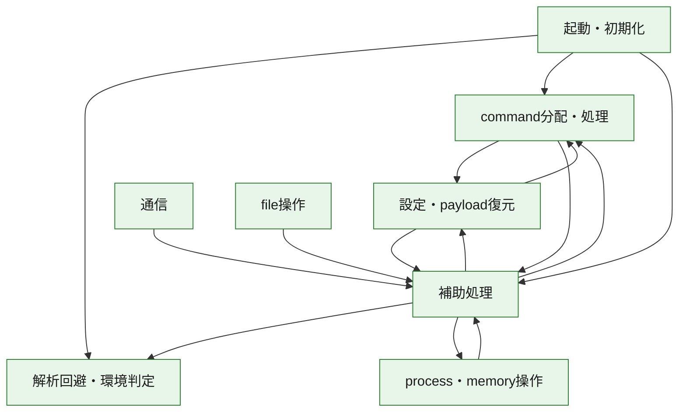

# 全体ロジック：22c1e13b167a91fb33858c78ea228f7f89d9b5b14568243ec8d75db1b4b9b57d

代表関数の静的証跡から、起動・初期化、設定・payload復元、解析回避・環境判定、process・memory操作、通信、command分配・処理、file操作の処理群を確認しました。

## 読み方

- phaseの掲載順は解析上の整理順です。observed_call_edgesがない段階間の実行順を断定しません。
- 図の実線は静的に観測した関係、点線と黄色のノードは未観測・未解決の関係を示します。
- 図は静的な要約であり、動的実行を再現するものではありません。
- 詳細な関数解説とfingerprintは[STATIC-LOGIC.md](STATIC-LOGIC.md)を参照してください。

## 静的可視化

### 実行フロー

### 感染チェーン

```mermaid
flowchart TD
  chain_initial["初期侵入・配布経路は未観測"]
  chain_01["提出検体 / sha256:22c1e13b167a….exe / pe"]
  chain_02["静的復元層 1 / sha256:22c1e13b167a….exe::pyinstaller-nested_archive-044-base_li / zip"]
  chain_03["静的復元層 1 / sha256:22c1e13b167a….exe::pyinstaller-pe_name_candidate-013-asyn / pe"]
  chain_04["静的復元層 1 / sha256:22c1e13b167a….exe::pyinstaller-pe_name_candidate-014-bz2. / pe"]
  chain_05["静的復元層 1 / sha256:22c1e13b167a….exe::pyinstaller-pe_name_candidate-015-cffi / pe"]
  chain_06["静的復元層 1 / sha256:22c1e13b167a….exe::pyinstaller-pe_name_candidate-016-ctyp / pe"]
  chain_07["静的復元層 1 / sha256:22c1e13b167a….exe::pyinstaller-pe_name_candidate-017-deci / pe"]
  chain_08["静的復元層 1 / sha256:22c1e13b167a….exe::pyinstaller-pe_name_candidate-018-hash / pe"]
  chain_09["静的復元層 1 / sha256:22c1e13b167a….exe::pyinstaller-pe_name_candidate-019-lzma / pe"]
  chain_10["静的復元層 1 / sha256:22c1e13b167a….exe::pyinstaller-pe_name_candidate-020-mult / pe"]
  chain_11["静的復元層 1 / sha256:22c1e13b167a….exe::pyinstaller-pe_name_candidate-021-over / pe"]
  chain_12["静的復元層 1 / sha256:22c1e13b167a….exe::pyinstaller-pe_name_candidate-022-queu / pe"]
  chain_13["静的復元層 1 / sha256:22c1e13b167a….exe::pyinstaller-pe_name_candidate-023-sock / pe"]
  chain_14["静的復元層 1 / sha256:22c1e13b167a….exe::pyinstaller-pe_name_candidate-024-ssl. / pe"]
  chain_15["静的復元層 1 / sha256:22c1e13b167a….exe::pyinstaller-pe_name_candidate-025-tkin / pe"]
  chain_16["静的復元層 1 / sha256:22c1e13b167a….exe::pyinstaller-pe_name_candidate-026-uuid / pe"]
  chain_01 -->|pyinstaller-nested_archive-044-b| chain_02
  chain_01 -->|pyinstaller-pe_name_candidate-01| chain_03
  chain_01 -->|pyinstaller-pe_name_candidate-01| chain_04
  chain_01 -->|pyinstaller-pe_name_candidate-01| chain_05
  chain_01 -->|pyinstaller-pe_name_candidate-01| chain_06
  chain_01 -->|pyinstaller-pe_name_candidate-01| chain_07
  chain_01 -->|pyinstaller-pe_name_candidate-01| chain_08
  chain_01 -->|pyinstaller-pe_name_candidate-01| chain_09
  chain_01 -->|pyinstaller-pe_name_candidate-02| chain_10
  chain_01 -->|pyinstaller-pe_name_candidate-02| chain_11
  chain_01 -->|pyinstaller-pe_name_candidate-02| chain_12
  chain_01 -->|pyinstaller-pe_name_candidate-02| chain_13
  chain_01 -->|pyinstaller-pe_name_candidate-02| chain_14
  chain_01 -->|pyinstaller-pe_name_candidate-02| chain_15
  chain_01 -->|pyinstaller-pe_name_candidate-02| chain_16
  chain_initial -.-> chain_01
  chain_more["その他185層はstatic-layers.jsonを参照"]
  chain_02 -.-> chain_more
  chain_03 -.-> chain_more
  chain_04 -.-> chain_more
  chain_05 -.-> chain_more
  chain_06 -.-> chain_more
  chain_07 -.-> chain_more
  chain_08 -.-> chain_more
  chain_09 -.-> chain_more
  chain_10 -.-> chain_more
  chain_11 -.-> chain_more
  chain_12 -.-> chain_more
  chain_13 -.-> chain_more
  chain_14 -.-> chain_more
  chain_15 -.-> chain_more
  chain_16 -.-> chain_more
  class chain_more unresolved
  class chain_01,chain_02,chain_03,chain_04,chain_05,chain_06,chain_07,chain_08,chain_09,chain_10,chain_11,chain_12,chain_13,chain_14,chain_15,chain_16 confirmed
  class chain_initial unresolved
  classDef confirmed fill:#e8f5e9,stroke:#2e7d32,color:#1b1b1b
  classDef unresolved fill:#fff8e1,stroke:#f9a825,color:#1b1b1b,stroke-dasharray:5 5
```

### モジュール関係

```mermaid
flowchart TD
  module_scope["解析対象のprogram構造"]
  module_01["sha256:a09308efd309… / x86 / statically_recovered_program"]
  module_02["sha256:fab1b4cee101… / x86 / statically_recovered_program"]
  module_03["sha256:bb53357b4e91… / x86 / statically_recovered_program"]
  module_04["sha256:9e87ce081fbc… / x86 / statically_recovered_program"]
  module_05["sha256:eff52743773e… / x86 / statically_recovered_program"]
  module_06["sha256:0ab1fbcf18c9… / x86 / statically_recovered_program"]
  module_07["sha256:ac877f3da413… / x86 / statically_recovered_program"]
  module_08["sha256:36ce760b9fac… / x86 / statically_recovered_program"]
  module_09["sha256:a49520e94f19… / x86 / statically_recovered_program"]
  module_10["sha256:22c6e46d8bd5… / x86 / statically_recovered_program"]
  module_11["sha256:dc6db118862a… / x86 / statically_recovered_program"]
  module_12["sha256:25ac83cac32e… / x86 / statically_recovered_program"]
  module_parent_unknown["復元元・親moduleは未特定"]
  module_parent_unknown -.-> module_01
  module_parent_unknown -.-> module_02
  module_parent_unknown -.-> module_03
  module_parent_unknown -.-> module_04
  module_parent_unknown -.-> module_05
  module_parent_unknown -.-> module_06
  module_parent_unknown -.-> module_07
  module_parent_unknown -.-> module_08
  module_parent_unknown -.-> module_09
  module_parent_unknown -.-> module_10
  module_parent_unknown -.-> module_11
  module_parent_unknown -.-> module_12
  class module_parent_unknown unresolved
  module_more["その他20moduleはstatic-logic.jsonを参照"]
  module_scope -.-> module_more
  class module_more unresolved
  class module_scope confirmed
  class module_01,module_02,module_03,module_04,module_05,module_06,module_07,module_08,module_09,module_10,module_11,module_12 confirmed
  classDef confirmed fill:#e8f5e9,stroke:#2e7d32,color:#1b1b1b
  classDef unresolved fill:#fff8e1,stroke:#f9a825,color:#1b1b1b,stroke-dasharray:5 5
```

## 処理段階

### 1. 起動・初期化

entry pointから初期化と後続処理への移行を確認します。
確度: `confirmed_static_function_evidence_with_limits`

- `a09308efd309732e3745e70b4456235579c450cac32bed616dfb3913b56f6637:ghidra:180001494` — 初期化と主要処理への分岐を行う入口関数です。 状態: `failed_empty`、選定理由: `entry_point`, `meaningful_symbol_name`, `role:entrypoint`
- `fab1b4cee101359d82d72061b83cff1855337b3677b9fe01cd69f7548f4c496e:ghidra:1800014a4` — 初期化と主要処理への分岐を行う入口関数です。 状態: `succeeded`、選定理由: `entry_point`, `meaningful_symbol_name`, `reviewed_call_centrality:5`, `role:entrypoint`
- `bb53357b4e91ac23ed4061f15ff3e5e91a5b3be1cbb0c6cf294521ae5b4efa1c:ghidra:180001bc4` — 初期化と主要処理への分岐を行う入口関数です。 状態: `succeeded`、選定理由: `entry_point`, `meaningful_symbol_name`, `reviewed_call_centrality:5`, `role:entrypoint`
- `9e87ce081fbcf0b6596fcba98e121379ad72a33d68e6b2af7a8bcc5b900229ba:ghidra:180001454` — 初期化と主要処理への分岐を行う入口関数です。 状態: `succeeded`、選定理由: `entry_point`, `meaningful_symbol_name`, `reviewed_call_centrality:5`, `role:entrypoint`
- `eff52743773eb550fcc6ce3efc37c85724502233b6b002a35496d828bd7b280a:ghidra:180004ce0` — 初期化と主要処理への分岐を行う入口関数です。 状態: `succeeded`、選定理由: `entry_point`, `meaningful_symbol_name`, `reviewed_call_centrality:5`, `role:entrypoint`
- `0ab1fbcf18c95d70343012feb1aad61e1ba95aaed5b4a08e57fc5990e8a9a452:ghidra:1800029d0` — 初期化と主要処理への分岐を行う入口関数です。 状態: `failed_empty`、選定理由: `entry_point`, `meaningful_symbol_name`, `role:entrypoint`
- `ac877f3da413c1523c07b6a0dd1f7e0d7ceb3e8590a5e9e20a78eb1bcb700793:ghidra:180001944` — 初期化と主要処理への分岐を行う入口関数です。 状態: `succeeded`、選定理由: `entry_point`, `meaningful_symbol_name`, `reviewed_call_centrality:5`, `role:entrypoint`
- `36ce760b9fac53fe51755f30a68d86f5fde89bf1b66c65c19e04aa3afa404ac2:ghidra:1800043f4` — 初期化と主要処理への分岐を行う入口関数です。 状態: `succeeded`、選定理由: `entry_point`, `meaningful_symbol_name`, `reviewed_call_centrality:5`, `role:entrypoint`
- `a49520e94f19d025a6be6ac7bbb73a7b32442838c62b68c162d44f81d92838ec:ghidra:1800018f4` — 初期化と主要処理への分岐を行う入口関数です。 状態: `succeeded`、選定理由: `entry_point`, `meaningful_symbol_name`, `reviewed_call_centrality:5`, `role:entrypoint`
- `dc6db118862ab3298e55e0f7c44c2c0dae4af9e810d2578271280202d6aa098a:ghidra:180001c54` — 初期化と主要処理への分岐を行う入口関数です。 状態: `succeeded`、選定理由: `entry_point`, `meaningful_symbol_name`, `reviewed_call_centrality:5`, `role:entrypoint`
- `25ac83cac32ed0d67b2cc9672ce64cb53f0a29a75b14c276e901023ff43da5f9:ghidra:180002ed4` — 初期化と主要処理への分岐を行う入口関数です。 状態: `succeeded`、選定理由: `entry_point`, `meaningful_symbol_name`, `reviewed_call_centrality:5`, `role:entrypoint`
- `d28c3dd1c22bfb8a6e8a6a9c2359842b797d08e878ecb7805f60e86a45589d11:ghidra:18000a7c4` — 初期化と主要処理への分岐を行う入口関数です。 状態: `succeeded`、選定理由: `entry_point`, `meaningful_symbol_name`, `reviewed_call_centrality:5`, `role:entrypoint`
- `052ad6a20d375957e82aa6a3c441ea548d89be0981516ca7eb306e063d5027f4:ghidra:18000f690` — 初期化と主要処理への分岐を行う入口関数です。 状態: `succeeded`、選定理由: `entry_point`, `meaningful_symbol_name`, `reviewed_call_centrality:5`, `role:entrypoint`
- `25d9b0be550d428fecc697ca20450343a7c3ce77c9f5283e9aecfd188d609250:ghidra:180007a94` — 初期化と主要処理への分岐を行う入口関数です。 状態: `succeeded`、選定理由: `entry_point`, `meaningful_symbol_name`, `reviewed_call_centrality:5`, `role:entrypoint`
- `6e39f7a67e52aec08b2382ab03c4e20857139a86a55d24b3deeb4d63f7d02e47:ghidra:241b91350` — 初期化と主要処理への分岐を行う入口関数です。 状態: `succeeded`、選定理由: `entry_point`, `meaningful_symbol_name`, `reviewed_call_centrality:5`, `role:entrypoint`
- `5f7003f9f0256e36351ca2810b3485db28579b08e4d1d65f6f211fcd1136f395:ghidra:1800131c4` — 初期化と主要処理への分岐を行う入口関数です。 状態: `succeeded`、選定理由: `entry_point`, `meaningful_symbol_name`, `reviewed_call_centrality:5`, `role:entrypoint`
- `58bbe1eb15f9ab8e9ea45715a8311e2366b360d910a4685448bdd728d5177a01:ghidra:18001b124` — 初期化と主要処理への分岐を行う入口関数です。 状態: `succeeded`、選定理由: `entry_point`, `meaningful_symbol_name`, `reviewed_call_centrality:5`, `role:entrypoint`
- `5c07572df2913618cfb851b608cb5f74d740fcce5c3f2e63dc0a2ba39ab35dad:ghidra:180002f54` — 初期化と主要処理への分岐を行う入口関数です。 状態: `succeeded`、選定理由: `entry_point`, `meaningful_symbol_name`, `reviewed_call_centrality:5`, `role:entrypoint`
- `133942bde91fe43289076a0b50a01b265df4ead078617cca6f6604a4166e1260:ghidra:180011284` — 初期化と主要処理への分岐を行う入口関数です。 状態: `succeeded`、選定理由: `entry_point`, `meaningful_symbol_name`, `reviewed_call_centrality:5`, `role:entrypoint`
- `8d41a84db20a9b985e98c802ad6833cf9625c744ad35478dd346f54f81488706:ghidra:180022710` — 初期化と主要処理への分岐を行う入口関数です。 状態: `failed_empty`、選定理由: `entry_point`, `meaningful_symbol_name`, `role:entrypoint`
- `898d1fe05e287d66bd379f26eb49d27a260f14666c7dc8b1719dae8c489abff0:ghidra:18002ed50` — 初期化と主要処理への分岐を行う入口関数です。 状態: `succeeded`、選定理由: `entry_point`, `meaningful_symbol_name`, `reviewed_call_centrality:5`, `role:entrypoint`
- `262aea62a994920daf152a10bdc0ca83a8b1c0874e71db23734862431de182c6:ghidra:180001e14` — 初期化と主要処理への分岐を行う入口関数です。 状態: `succeeded`、選定理由: `entry_point`, `meaningful_symbol_name`, `reviewed_call_centrality:5`, `role:entrypoint`
- `0d4f124b2d6622d276d777f7106972219f9b310edb5df8149c253da7c013d6d8:ghidra:180002ba4` — 初期化と主要処理への分岐を行う入口関数です。 状態: `succeeded`、選定理由: `entry_point`, `meaningful_symbol_name`, `reviewed_call_centrality:5`, `role:entrypoint`
- `39773640fc235b30d1b2a05f7b5eeba6fa9771e10f33f4ccc1649a9d99ff95e8:ghidra:180103fc0` — 初期化と主要処理への分岐を行う入口関数です。 状態: `succeeded`、選定理由: `entry_point`, `meaningful_symbol_name`, `reviewed_call_centrality:5`, `role:entrypoint`
- `224f7121c7d7b963f4767154dd185f62c49c442bf8916d6d4c1c567702ccc7fa:ghidra:1800dcd30` — 初期化と主要処理への分岐を行う入口関数です。 状態: `succeeded`、選定理由: `entry_point`, `meaningful_symbol_name`, `reviewed_call_centrality:49`, `role:entrypoint`
- `fde89cdb5c2d08ae65de7ef4abca1876c93ba3796002f5ac0bf7e4d4f5a94da0:ghidra:1801750b4` — 初期化と主要処理への分岐を行う入口関数です。 状態: `succeeded`、選定理由: `entry_point`, `meaningful_symbol_name`, `reviewed_call_centrality:1`, `role:entrypoint`
- `813b101f70efb79c388239ce82ac891e195a1e19eeaeb43c32d9bf425e7b51b8:ghidra:1806e5790` — 初期化と主要処理への分岐を行う入口関数です。 状態: `succeeded`、選定理由: `entry_point`, `meaningful_symbol_name`, `reviewed_call_centrality:5`, `role:entrypoint`
- `22c1e13b167a91fb33858c78ea228f7f89d9b5b14568243ec8d75db1b4b9b57d:ghidra:14000d6c0` — 初期化と主要処理への分岐を行う入口関数です。 状態: `succeeded`、選定理由: `entry_point`, `meaningful_symbol_name`, `reviewed_call_centrality:22`, `role:entrypoint`
- `6a99bc0128e0c7d6cbbf615fcc26909565e17d4ca3451b97f8987f9c6acbc6c8:ghidra:1800040a0` — 初期化と主要処理への分岐を行う入口関数です。 状態: `succeeded`、選定理由: `entry_point`, `meaningful_symbol_name`, `reviewed_call_centrality:5`, `role:entrypoint`

### 2. 設定・payload復元

設定、resource、payload、暗号化データの復元・変換を確認します。
確度: `confirmed_static_function_evidence_with_limits`

- `8d41a84db20a9b985e98c802ad6833cf9625c744ad35478dd346f54f81488706:ghidra:18001d31c` — 設定、resource、payloadなどの解析・変換を行う関数です。 状態: `failed_empty`、選定理由: `entry_point`, `meaningful_symbol_name`, `role:config_or_data_transform`
- `39773640fc235b30d1b2a05f7b5eeba6fa9771e10f33f4ccc1649a9d99ff95e8:ghidra:18002a3d0` — 設定、resource、payloadなどの解析・変換を行う関数です。 状態: `succeeded`、選定理由: `entry_point`, `meaningful_symbol_name`, `reviewed_call_centrality:10`, `role:config_or_data_transform`
- `39773640fc235b30d1b2a05f7b5eeba6fa9771e10f33f4ccc1649a9d99ff95e8:ghidra:18004a310` — 設定、resource、payloadなどの解析・変換を行う関数です。 状態: `succeeded`、選定理由: `entry_point`, `meaningful_symbol_name`, `role:config_or_data_transform`
- `39773640fc235b30d1b2a05f7b5eeba6fa9771e10f33f4ccc1649a9d99ff95e8:ghidra:18004a880` — 設定、resource、payloadなどの解析・変換を行う関数です。 状態: `succeeded`、選定理由: `entry_point`, `meaningful_symbol_name`, `reviewed_call_centrality:3`, `role:config_or_data_transform`
- `39773640fc235b30d1b2a05f7b5eeba6fa9771e10f33f4ccc1649a9d99ff95e8:ghidra:18004af00` — 設定、resource、payloadなどの解析・変換を行う関数です。 状態: `succeeded`、選定理由: `entry_point`, `meaningful_symbol_name`, `role:config_or_data_transform`
- `39773640fc235b30d1b2a05f7b5eeba6fa9771e10f33f4ccc1649a9d99ff95e8:ghidra:18005ae50` — 設定、resource、payloadなどの解析・変換を行う関数です。 状態: `succeeded`、選定理由: `entry_point`, `meaningful_symbol_name`, `reviewed_call_centrality:12`, `role:config_or_data_transform`
- `39773640fc235b30d1b2a05f7b5eeba6fa9771e10f33f4ccc1649a9d99ff95e8:ghidra:18005ba80` — 設定、resource、payloadなどの解析・変換を行う関数です。 状態: `succeeded`、選定理由: `entry_point`, `meaningful_symbol_name`, `role:config_or_data_transform`
- `39773640fc235b30d1b2a05f7b5eeba6fa9771e10f33f4ccc1649a9d99ff95e8:ghidra:1800d37f0` — 設定、resource、payloadなどの解析・変換を行う関数です。 状態: `succeeded`、選定理由: `entry_point`, `meaningful_symbol_name`, `reviewed_call_centrality:2`, `role:config_or_data_transform`
- `39773640fc235b30d1b2a05f7b5eeba6fa9771e10f33f4ccc1649a9d99ff95e8:ghidra:1800d3a50` — 設定、resource、payloadなどの解析・変換を行う関数です。 状態: `succeeded`、選定理由: `entry_point`, `meaningful_symbol_name`, `reviewed_call_centrality:2`, `role:config_or_data_transform`
- `39773640fc235b30d1b2a05f7b5eeba6fa9771e10f33f4ccc1649a9d99ff95e8:ghidra:1800d3b70` — 設定、resource、payloadなどの解析・変換を行う関数です。 状態: `succeeded`、選定理由: `entry_point`, `meaningful_symbol_name`, `reviewed_call_centrality:7`, `role:config_or_data_transform`
- `39773640fc235b30d1b2a05f7b5eeba6fa9771e10f33f4ccc1649a9d99ff95e8:ghidra:1800d4160` — 設定、resource、payloadなどの解析・変換を行う関数です。 状態: `succeeded`、選定理由: `entry_point`, `meaningful_symbol_name`, `reviewed_call_centrality:1`, `role:config_or_data_transform`
- `224f7121c7d7b963f4767154dd185f62c49c442bf8916d6d4c1c567702ccc7fa:ghidra:18006ff50` — 設定、resource、payloadなどの解析・変換を行う関数です。 状態: `succeeded`、選定理由: `entry_point`, `meaningful_symbol_name`, `reviewed_call_centrality:22`, `role:config_or_data_transform`
- `224f7121c7d7b963f4767154dd185f62c49c442bf8916d6d4c1c567702ccc7fa:ghidra:180077600` — 設定、resource、payloadなどの解析・変換を行う関数です。 状態: `succeeded`、選定理由: `entry_point`, `meaningful_symbol_name`, `reviewed_call_centrality:22`, `role:config_or_data_transform`
- `224f7121c7d7b963f4767154dd185f62c49c442bf8916d6d4c1c567702ccc7fa:ghidra:1800ac410` — 暗号、hash、encoding、または復号処理に関係する関数です。 状態: `limited_bad_instruction_or_flow`、選定理由: `entry_point`, `meaningful_symbol_name`, `reviewed_call_centrality:21`, `role:cryptographic_transform`
- `224f7121c7d7b963f4767154dd185f62c49c442bf8916d6d4c1c567702ccc7fa:ghidra:1800ac4e0` — 暗号、hash、encoding、または復号処理に関係する関数です。 状態: `succeeded`、選定理由: `entry_point`, `meaningful_symbol_name`, `reviewed_call_centrality:15`, `role:cryptographic_transform`
- `224f7121c7d7b963f4767154dd185f62c49c442bf8916d6d4c1c567702ccc7fa:ghidra:1800ac7a0` — 暗号、hash、encoding、または復号処理に関係する関数です。 状態: `succeeded`、選定理由: `entry_point`, `meaningful_symbol_name`, `reviewed_call_centrality:5`, `role:cryptographic_transform`
- `224f7121c7d7b963f4767154dd185f62c49c442bf8916d6d4c1c567702ccc7fa:ghidra:1800ae7d0` — 設定、resource、payloadなどの解析・変換を行う関数です。 状態: `succeeded`、選定理由: `entry_point`, `meaningful_symbol_name`, `reviewed_call_centrality:14`, `role:config_or_data_transform`
- `fde89cdb5c2d08ae65de7ef4abca1876c93ba3796002f5ac0bf7e4d4f5a94da0:ghidra:180014470` — 設定、resource、payloadなどの解析・変換を行う関数です。 状態: `succeeded`、選定理由: `entry_point`, `meaningful_symbol_name`, `reviewed_call_centrality:17`, `role:config_or_data_transform`
- `fde89cdb5c2d08ae65de7ef4abca1876c93ba3796002f5ac0bf7e4d4f5a94da0:ghidra:18001f810` — 設定、resource、payloadなどの解析・変換を行う関数です。 状態: `succeeded`、選定理由: `entry_point`, `meaningful_symbol_name`, `reviewed_call_centrality:2`, `role:config_or_data_transform`
- `fde89cdb5c2d08ae65de7ef4abca1876c93ba3796002f5ac0bf7e4d4f5a94da0:ghidra:18004adc0` — 暗号、hash、encoding、または復号処理に関係する関数です。 状態: `limited_bad_instruction_or_flow`、選定理由: `entry_point`, `meaningful_symbol_name`, `reviewed_call_centrality:3`, `role:cryptographic_transform`
- `fde89cdb5c2d08ae65de7ef4abca1876c93ba3796002f5ac0bf7e4d4f5a94da0:ghidra:180056ac0` — 設定、resource、payloadなどの解析・変換を行う関数です。 状態: `succeeded`、選定理由: `entry_point`, `meaningful_symbol_name`, `reviewed_call_centrality:34`, `role:config_or_data_transform`
- `fde89cdb5c2d08ae65de7ef4abca1876c93ba3796002f5ac0bf7e4d4f5a94da0:ghidra:18005a268` — 設定、resource、payloadなどの解析・変換を行う関数です。 状態: `succeeded`、選定理由: `entry_point`, `meaningful_symbol_name`, `reviewed_call_centrality:2`, `role:config_or_data_transform`
- `fde89cdb5c2d08ae65de7ef4abca1876c93ba3796002f5ac0bf7e4d4f5a94da0:ghidra:18006ea24` — 設定、resource、payloadなどの解析・変換を行う関数です。 状態: `succeeded`、選定理由: `entry_point`, `meaningful_symbol_name`, `reviewed_call_centrality:10`, `role:config_or_data_transform`
- `fde89cdb5c2d08ae65de7ef4abca1876c93ba3796002f5ac0bf7e4d4f5a94da0:ghidra:180079360` — 設定、resource、payloadなどの解析・変換を行う関数です。 状態: `succeeded`、選定理由: `entry_point`, `meaningful_symbol_name`, `reviewed_call_centrality:1`, `role:config_or_data_transform`
- `fde89cdb5c2d08ae65de7ef4abca1876c93ba3796002f5ac0bf7e4d4f5a94da0:ghidra:1800793a0` — 設定、resource、payloadなどの解析・変換を行う関数です。 状態: `succeeded`、選定理由: `entry_point`, `meaningful_symbol_name`, `reviewed_call_centrality:2`, `role:config_or_data_transform`
- `fde89cdb5c2d08ae65de7ef4abca1876c93ba3796002f5ac0bf7e4d4f5a94da0:ghidra:180079b4c` — 設定、resource、payloadなどの解析・変換を行う関数です。 状態: `succeeded`、選定理由: `entry_point`, `meaningful_symbol_name`, `reviewed_call_centrality:2`, `role:config_or_data_transform`
- `fde89cdb5c2d08ae65de7ef4abca1876c93ba3796002f5ac0bf7e4d4f5a94da0:ghidra:1800916f0` — 設定、resource、payloadなどの解析・変換を行う関数です。 状態: `succeeded`、選定理由: `entry_point`, `meaningful_symbol_name`, `reviewed_call_centrality:3`, `role:config_or_data_transform`
- `fde89cdb5c2d08ae65de7ef4abca1876c93ba3796002f5ac0bf7e4d4f5a94da0:ghidra:1800919a0` — 設定、resource、payloadなどの解析・変換を行う関数です。 状態: `succeeded`、選定理由: `entry_point`, `meaningful_symbol_name`, `reviewed_call_centrality:2`, `role:config_or_data_transform`
- `fde89cdb5c2d08ae65de7ef4abca1876c93ba3796002f5ac0bf7e4d4f5a94da0:ghidra:180091ddc` — 暗号、hash、encoding、または復号処理に関係する関数です。 状態: `succeeded`、選定理由: `entry_point`, `meaningful_symbol_name`, `reviewed_call_centrality:4`, `role:cryptographic_transform`
- `fde89cdb5c2d08ae65de7ef4abca1876c93ba3796002f5ac0bf7e4d4f5a94da0:ghidra:1800a5724` — 暗号、hash、encoding、または復号処理に関係する関数です。 状態: `succeeded`、選定理由: `entry_point`, `meaningful_symbol_name`, `reviewed_call_centrality:2`, `role:cryptographic_transform`
- `fde89cdb5c2d08ae65de7ef4abca1876c93ba3796002f5ac0bf7e4d4f5a94da0:ghidra:1800b1494` — 設定、resource、payloadなどの解析・変換を行う関数です。 状態: `succeeded`、選定理由: `entry_point`, `meaningful_symbol_name`, `reviewed_call_centrality:9`, `role:config_or_data_transform`
- `fde89cdb5c2d08ae65de7ef4abca1876c93ba3796002f5ac0bf7e4d4f5a94da0:ghidra:1800b1d48` — 設定、resource、payloadなどの解析・変換を行う関数です。 状態: `succeeded`、選定理由: `entry_point`, `meaningful_symbol_name`, `reviewed_call_centrality:12`, `role:config_or_data_transform`
- `fde89cdb5c2d08ae65de7ef4abca1876c93ba3796002f5ac0bf7e4d4f5a94da0:ghidra:1800b2424` — 設定、resource、payloadなどの解析・変換を行う関数です。 状態: `succeeded`、選定理由: `entry_point`, `meaningful_symbol_name`, `reviewed_call_centrality:10`, `role:config_or_data_transform`
- `fde89cdb5c2d08ae65de7ef4abca1876c93ba3796002f5ac0bf7e4d4f5a94da0:ghidra:1800c517c` — 設定、resource、payloadなどの解析・変換を行う関数です。 状態: `succeeded`、選定理由: `entry_point`, `meaningful_symbol_name`, `reviewed_call_centrality:11`, `role:config_or_data_transform`
- `fde89cdb5c2d08ae65de7ef4abca1876c93ba3796002f5ac0bf7e4d4f5a94da0:ghidra:1800cd760` — 設定、resource、payloadなどの解析・変換を行う関数です。 状態: `succeeded`、選定理由: `entry_point`, `meaningful_symbol_name`, `reviewed_call_centrality:10`, `role:config_or_data_transform`
- `fde89cdb5c2d08ae65de7ef4abca1876c93ba3796002f5ac0bf7e4d4f5a94da0:ghidra:1800e01d0` — 暗号、hash、encoding、または復号処理に関係する関数です。 状態: `succeeded`、選定理由: `entry_point`, `meaningful_symbol_name`, `reviewed_call_centrality:2`, `role:cryptographic_transform`
- `fde89cdb5c2d08ae65de7ef4abca1876c93ba3796002f5ac0bf7e4d4f5a94da0:ghidra:1800e081c` — 暗号、hash、encoding、または復号処理に関係する関数です。 状態: `succeeded`、選定理由: `entry_point`, `meaningful_symbol_name`, `reviewed_call_centrality:3`, `role:cryptographic_transform`
- `fde89cdb5c2d08ae65de7ef4abca1876c93ba3796002f5ac0bf7e4d4f5a94da0:ghidra:1800e0ce8` — 暗号、hash、encoding、または復号処理に関係する関数です。 状態: `succeeded`、選定理由: `entry_point`, `meaningful_symbol_name`, `reviewed_call_centrality:2`, `role:cryptographic_transform`
- `fde89cdb5c2d08ae65de7ef4abca1876c93ba3796002f5ac0bf7e4d4f5a94da0:ghidra:1800e1288` — 暗号、hash、encoding、または復号処理に関係する関数です。 状態: `succeeded`、選定理由: `entry_point`, `meaningful_symbol_name`, `reviewed_call_centrality:1`, `role:cryptographic_transform`
- `fde89cdb5c2d08ae65de7ef4abca1876c93ba3796002f5ac0bf7e4d4f5a94da0:ghidra:1800eb908` — 設定、resource、payloadなどの解析・変換を行う関数です。 状態: `succeeded`、選定理由: `entry_point`, `meaningful_symbol_name`, `reviewed_call_centrality:2`, `role:config_or_data_transform`
- `fde89cdb5c2d08ae65de7ef4abca1876c93ba3796002f5ac0bf7e4d4f5a94da0:ghidra:1800f5c4c` — 設定、resource、payloadなどの解析・変換を行う関数です。 状態: `succeeded`、選定理由: `entry_point`, `meaningful_symbol_name`, `reviewed_call_centrality:2`, `role:config_or_data_transform`
- `fde89cdb5c2d08ae65de7ef4abca1876c93ba3796002f5ac0bf7e4d4f5a94da0:ghidra:1800f6970` — 設定、resource、payloadなどの解析・変換を行う関数です。 状態: `succeeded`、選定理由: `entry_point`, `meaningful_symbol_name`, `reviewed_call_centrality:1`, `role:config_or_data_transform`
- `fde89cdb5c2d08ae65de7ef4abca1876c93ba3796002f5ac0bf7e4d4f5a94da0:ghidra:1801152ac` — 設定、resource、payloadなどの解析・変換を行う関数です。 状態: `succeeded`、選定理由: `entry_point`, `meaningful_symbol_name`, `reviewed_call_centrality:1`, `role:config_or_data_transform`
- `fde89cdb5c2d08ae65de7ef4abca1876c93ba3796002f5ac0bf7e4d4f5a94da0:ghidra:180115718` — 設定、resource、payloadなどの解析・変換を行う関数です。 状態: `succeeded`、選定理由: `entry_point`, `meaningful_symbol_name`, `reviewed_call_centrality:3`, `role:config_or_data_transform`
- `fde89cdb5c2d08ae65de7ef4abca1876c93ba3796002f5ac0bf7e4d4f5a94da0:ghidra:180115808` — 設定、resource、payloadなどの解析・変換を行う関数です。 状態: `succeeded`、選定理由: `entry_point`, `meaningful_symbol_name`, `reviewed_call_centrality:9`, `role:config_or_data_transform`
- `813b101f70efb79c388239ce82ac891e195a1e19eeaeb43c32d9bf425e7b51b8:ghidra:1800a3cc0` — 暗号、hash、encoding、または復号処理に関係する関数です。 状態: `succeeded`、選定理由: `entry_point`, `meaningful_symbol_name`, `reviewed_call_centrality:1`, `role:cryptographic_transform`

### 3. 解析回避・環境判定

debugger、sandbox、仮想環境、時間差などの判定を確認します。
確度: `confirmed_static_function_evidence`

- `a09308efd309732e3745e70b4456235579c450cac32bed616dfb3913b56f6637:ghidra:180001a9c` — debugger、仮想環境、sandbox、または時間差の確認に関係する関数です。 状態: `succeeded`、選定理由: `context_representative`, `reviewed_call_centrality:18`, `role:anti_analysis`
- `a09308efd309732e3745e70b4456235579c450cac32bed616dfb3913b56f6637:ghidra:180001c64` — debugger、仮想環境、sandbox、または時間差の確認に関係する関数です。 状態: `succeeded`、選定理由: `context_representative`, `reviewed_call_centrality:7`, `role:anti_analysis`
- `fab1b4cee101359d82d72061b83cff1855337b3677b9fe01cd69f7548f4c496e:ghidra:180001660` — debugger、仮想環境、sandbox、または時間差の確認に関係する関数です。 状態: `succeeded`、選定理由: `context_representative`, `reviewed_call_centrality:10`, `role:anti_analysis`
- `fab1b4cee101359d82d72061b83cff1855337b3677b9fe01cd69f7548f4c496e:ghidra:180001aac` — debugger、仮想環境、sandbox、または時間差の確認に関係する関数です。 状態: `succeeded`、選定理由: `context_representative`, `reviewed_call_centrality:21`, `role:anti_analysis`
- `fab1b4cee101359d82d72061b83cff1855337b3677b9fe01cd69f7548f4c496e:ghidra:180001c74` — debugger、仮想環境、sandbox、または時間差の確認に関係する関数です。 状態: `succeeded`、選定理由: `context_representative`, `reviewed_call_centrality:8`, `role:anti_analysis`
- `bb53357b4e91ac23ed4061f15ff3e5e91a5b3be1cbb0c6cf294521ae5b4efa1c:ghidra:180001d80` — debugger、仮想環境、sandbox、または時間差の確認に関係する関数です。 状態: `succeeded`、選定理由: `context_representative`, `reviewed_call_centrality:10`, `role:anti_analysis`
- `9e87ce081fbcf0b6596fcba98e121379ad72a33d68e6b2af7a8bcc5b900229ba:ghidra:180001610` — debugger、仮想環境、sandbox、または時間差の確認に関係する関数です。 状態: `succeeded`、選定理由: `context_representative`, `reviewed_call_centrality:10`, `role:anti_analysis`
- `9e87ce081fbcf0b6596fcba98e121379ad72a33d68e6b2af7a8bcc5b900229ba:ghidra:180001a5c` — debugger、仮想環境、sandbox、または時間差の確認に関係する関数です。 状態: `succeeded`、選定理由: `context_representative`, `reviewed_call_centrality:21`, `role:anti_analysis`
- `9e87ce081fbcf0b6596fcba98e121379ad72a33d68e6b2af7a8bcc5b900229ba:ghidra:180001c24` — debugger、仮想環境、sandbox、または時間差の確認に関係する関数です。 状態: `succeeded`、選定理由: `context_representative`, `reviewed_call_centrality:8`, `role:anti_analysis`
- `ac877f3da413c1523c07b6a0dd1f7e0d7ceb3e8590a5e9e20a78eb1bcb700793:ghidra:180001b00` — debugger、仮想環境、sandbox、または時間差の確認に関係する関数です。 状態: `succeeded`、選定理由: `context_representative`, `reviewed_call_centrality:10`, `role:anti_analysis`
- `ac877f3da413c1523c07b6a0dd1f7e0d7ceb3e8590a5e9e20a78eb1bcb700793:ghidra:180001f4c` — debugger、仮想環境、sandbox、または時間差の確認に関係する関数です。 状態: `succeeded`、選定理由: `context_representative`, `reviewed_call_centrality:21`, `role:anti_analysis`
- `ac877f3da413c1523c07b6a0dd1f7e0d7ceb3e8590a5e9e20a78eb1bcb700793:ghidra:180002114` — debugger、仮想環境、sandbox、または時間差の確認に関係する関数です。 状態: `succeeded`、選定理由: `context_representative`, `reviewed_call_centrality:8`, `role:anti_analysis`
- `a49520e94f19d025a6be6ac7bbb73a7b32442838c62b68c162d44f81d92838ec:ghidra:180001ab0` — debugger、仮想環境、sandbox、または時間差の確認に関係する関数です。 状態: `succeeded`、選定理由: `context_representative`, `reviewed_call_centrality:10`, `role:anti_analysis`
- `a49520e94f19d025a6be6ac7bbb73a7b32442838c62b68c162d44f81d92838ec:ghidra:180001efc` — debugger、仮想環境、sandbox、または時間差の確認に関係する関数です。 状態: `succeeded`、選定理由: `context_representative`, `reviewed_call_centrality:21`, `role:anti_analysis`
- `dc6db118862ab3298e55e0f7c44c2c0dae4af9e810d2578271280202d6aa098a:ghidra:180001e10` — debugger、仮想環境、sandbox、または時間差の確認に関係する関数です。 状態: `succeeded`、選定理由: `context_representative`, `reviewed_call_centrality:10`, `role:anti_analysis`
- `dc6db118862ab3298e55e0f7c44c2c0dae4af9e810d2578271280202d6aa098a:ghidra:18000225c` — debugger、仮想環境、sandbox、または時間差の確認に関係する関数です。 状態: `succeeded`、選定理由: `context_representative`, `reviewed_call_centrality:20`, `role:anti_analysis`
- `25ac83cac32ed0d67b2cc9672ce64cb53f0a29a75b14c276e901023ff43da5f9:ghidra:180003090` — debugger、仮想環境、sandbox、または時間差の確認に関係する関数です。 状態: `succeeded`、選定理由: `context_representative`, `reviewed_call_centrality:10`, `role:anti_analysis`
- `5c07572df2913618cfb851b608cb5f74d740fcce5c3f2e63dc0a2ba39ab35dad:ghidra:180002f94` — debugger、仮想環境、sandbox、または時間差の確認に関係する関数です。 状態: `succeeded`、選定理由: `context_representative`, `reviewed_call_centrality:10`, `role:anti_analysis`
- `262aea62a994920daf152a10bdc0ca83a8b1c0874e71db23734862431de182c6:ghidra:180001e54` — debugger、仮想環境、sandbox、または時間差の確認に関係する関数です。 状態: `succeeded`、選定理由: `context_representative`, `reviewed_call_centrality:10`, `role:anti_analysis`
- `0d4f124b2d6622d276d777f7106972219f9b310edb5df8149c253da7c013d6d8:ghidra:180002d60` — debugger、仮想環境、sandbox、または時間差の確認に関係する関数です。 状態: `succeeded`、選定理由: `context_representative`, `reviewed_call_centrality:10`, `role:anti_analysis`

### 4. process・memory操作

process、thread、module、memory操作と実行移行を確認します。
確度: `confirmed_static_function_evidence_with_limits`

- `fab1b4cee101359d82d72061b83cff1855337b3677b9fe01cd69f7548f4c496e:ghidra:1800014e4` — process、thread、module、またはmemory操作に関係する関数です。 状態: `limited_bad_instruction_or_flow`、選定理由: `context_representative`, `reviewed_call_centrality:10`, `role:process_or_memory_operation`
- `bb53357b4e91ac23ed4061f15ff3e5e91a5b3be1cbb0c6cf294521ae5b4efa1c:ghidra:180001c04` — process、thread、module、またはmemory操作に関係する関数です。 状態: `limited_bad_instruction_or_flow`、選定理由: `context_representative`, `reviewed_call_centrality:10`, `role:process_or_memory_operation`
- `9e87ce081fbcf0b6596fcba98e121379ad72a33d68e6b2af7a8bcc5b900229ba:ghidra:180001494` — process、thread、module、またはmemory操作に関係する関数です。 状態: `limited_bad_instruction_or_flow`、選定理由: `context_representative`, `reviewed_call_centrality:11`, `role:process_or_memory_operation`
- `eff52743773eb550fcc6ce3efc37c85724502233b6b002a35496d828bd7b280a:ghidra:180003670` — process、thread、module、またはmemory操作に関係する関数です。 状態: `succeeded`、選定理由: `context_representative`, `reviewed_call_centrality:10`, `role:process_or_memory_operation`
- `0ab1fbcf18c95d70343012feb1aad61e1ba95aaed5b4a08e57fc5990e8a9a452:ghidra:1800016d0` — process、thread、module、またはmemory操作に関係する関数です。 状態: `succeeded`、選定理由: `context_representative`, `reviewed_call_centrality:41`, `role:process_or_memory_operation`
- `0ab1fbcf18c95d70343012feb1aad61e1ba95aaed5b4a08e57fc5990e8a9a452:ghidra:180001e80` — process、thread、module、またはmemory操作に関係する関数です。 状態: `succeeded`、選定理由: `context_representative`, `reviewed_call_centrality:5`, `role:process_or_memory_operation`
- `ac877f3da413c1523c07b6a0dd1f7e0d7ceb3e8590a5e9e20a78eb1bcb700793:ghidra:180001984` — process、thread、module、またはmemory操作に関係する関数です。 状態: `limited_bad_instruction_or_flow`、選定理由: `context_representative`, `reviewed_call_centrality:10`, `role:process_or_memory_operation`
- `a49520e94f19d025a6be6ac7bbb73a7b32442838c62b68c162d44f81d92838ec:ghidra:180001934` — process、thread、module、またはmemory操作に関係する関数です。 状態: `limited_bad_instruction_or_flow`、選定理由: `context_representative`, `reviewed_call_centrality:10`, `role:process_or_memory_operation`
- `dc6db118862ab3298e55e0f7c44c2c0dae4af9e810d2578271280202d6aa098a:ghidra:180001c94` — process、thread、module、またはmemory操作に関係する関数です。 状態: `limited_bad_instruction_or_flow`、選定理由: `context_representative`, `reviewed_call_centrality:10`, `role:process_or_memory_operation`
- `25ac83cac32ed0d67b2cc9672ce64cb53f0a29a75b14c276e901023ff43da5f9:ghidra:180002f14` — process、thread、module、またはmemory操作に関係する関数です。 状態: `limited_bad_instruction_or_flow`、選定理由: `context_representative`, `reviewed_call_centrality:10`, `role:process_or_memory_operation`
- `58bbe1eb15f9ab8e9ea45715a8311e2366b360d910a4685448bdd728d5177a01:ghidra:180002730` — process、thread、module、またはmemory操作に関係する関数です。 状態: `succeeded`、選定理由: `context_representative`, `reviewed_call_centrality:12`, `role:process_or_memory_operation`
- `5c07572df2913618cfb851b608cb5f74d740fcce5c3f2e63dc0a2ba39ab35dad:ghidra:1800029a0` — process、thread、module、またはmemory操作に関係する関数です。 状態: `limited_bad_instruction_or_flow`、選定理由: `context_representative`, `reviewed_call_centrality:11`, `role:process_or_memory_operation`
- `262aea62a994920daf152a10bdc0ca83a8b1c0874e71db23734862431de182c6:ghidra:180001860` — process、thread、module、またはmemory操作に関係する関数です。 状態: `limited_bad_instruction_or_flow`、選定理由: `context_representative`, `reviewed_call_centrality:11`, `role:process_or_memory_operation`
- `0d4f124b2d6622d276d777f7106972219f9b310edb5df8149c253da7c013d6d8:ghidra:180002be4` — process、thread、module、またはmemory操作に関係する関数です。 状態: `limited_bad_instruction_or_flow`、選定理由: `context_representative`, `reviewed_call_centrality:10`, `role:process_or_memory_operation`

### 5. 通信

通信初期化、endpoint処理、送受信の役割を確認します。
確度: `confirmed_static_function_evidence_with_limits`

- `ac877f3da413c1523c07b6a0dd1f7e0d7ceb3e8590a5e9e20a78eb1bcb700793:ghidra:1800010e0` — 通信初期化、送受信、またはendpoint処理に関係する関数です。 状態: `succeeded`、選定理由: `context_representative`, `reviewed_call_centrality:22`, `role:network_communication`
- `25ac83cac32ed0d67b2cc9672ce64cb53f0a29a75b14c276e901023ff43da5f9:ghidra:180001230` — 通信初期化、送受信、またはendpoint処理に関係する関数です。 状態: `failed`、選定理由: `context_representative`, `reviewed_call_centrality:32`, `role:network_communication`
- `fde89cdb5c2d08ae65de7ef4abca1876c93ba3796002f5ac0bf7e4d4f5a94da0:ghidra:1801ac768` — 通信初期化、送受信、またはendpoint処理に関係する関数です。 状態: `succeeded`、選定理由: `entry_point`, `meaningful_symbol_name`, `reviewed_call_centrality:2`, `role:network_communication`

### 6. command分配・処理

受信commandやtaskの解釈、分配、個別handlerへの移行を確認します。
確度: `confirmed_static_function_evidence_with_limits`

- `052ad6a20d375957e82aa6a3c441ea548d89be0981516ca7eb306e063d5027f4:ghidra:1800059c0` — commandの解釈、分配、または個別処理を担当する関数です。 状態: `succeeded`、選定理由: `entry_point`, `meaningful_symbol_name`, `reviewed_call_centrality:1`, `role:command_dispatch_or_handler`
- `052ad6a20d375957e82aa6a3c441ea548d89be0981516ca7eb306e063d5027f4:ghidra:1800059f0` — commandの解釈、分配、または個別処理を担当する関数です。 状態: `succeeded`、選定理由: `entry_point`, `meaningful_symbol_name`, `reviewed_call_centrality:2`, `role:command_dispatch_or_handler`
- `39773640fc235b30d1b2a05f7b5eeba6fa9771e10f33f4ccc1649a9d99ff95e8:ghidra:180062480` — commandの解釈、分配、または個別処理を担当する関数です。 状態: `succeeded`、選定理由: `entry_point`, `meaningful_symbol_name`, `role:command_dispatch_or_handler`
- `39773640fc235b30d1b2a05f7b5eeba6fa9771e10f33f4ccc1649a9d99ff95e8:ghidra:180062570` — commandの解釈、分配、または個別処理を担当する関数です。 状態: `succeeded`、選定理由: `entry_point`, `meaningful_symbol_name`, `role:command_dispatch_or_handler`
- `39773640fc235b30d1b2a05f7b5eeba6fa9771e10f33f4ccc1649a9d99ff95e8:ghidra:180062640` — commandの解釈、分配、または個別処理を担当する関数です。 状態: `succeeded`、選定理由: `entry_point`, `meaningful_symbol_name`, `reviewed_call_centrality:1`, `role:command_dispatch_or_handler`
- `39773640fc235b30d1b2a05f7b5eeba6fa9771e10f33f4ccc1649a9d99ff95e8:ghidra:1800626f0` — commandの解釈、分配、または個別処理を担当する関数です。 状態: `succeeded`、選定理由: `entry_point`, `meaningful_symbol_name`, `reviewed_call_centrality:1`, `role:command_dispatch_or_handler`
- `39773640fc235b30d1b2a05f7b5eeba6fa9771e10f33f4ccc1649a9d99ff95e8:ghidra:1800627b0` — commandの解釈、分配、または個別処理を担当する関数です。 状態: `succeeded`、選定理由: `entry_point`, `meaningful_symbol_name`, `role:command_dispatch_or_handler`
- `39773640fc235b30d1b2a05f7b5eeba6fa9771e10f33f4ccc1649a9d99ff95e8:ghidra:180062830` — commandの解釈、分配、または個別処理を担当する関数です。 状態: `succeeded`、選定理由: `entry_point`, `meaningful_symbol_name`, `role:command_dispatch_or_handler`
- `39773640fc235b30d1b2a05f7b5eeba6fa9771e10f33f4ccc1649a9d99ff95e8:ghidra:180062890` — commandの解釈、分配、または個別処理を担当する関数です。 状態: `succeeded`、選定理由: `entry_point`, `meaningful_symbol_name`, `role:command_dispatch_or_handler`
- `39773640fc235b30d1b2a05f7b5eeba6fa9771e10f33f4ccc1649a9d99ff95e8:ghidra:180062910` — commandの解釈、分配、または個別処理を担当する関数です。 状態: `succeeded`、選定理由: `entry_point`, `meaningful_symbol_name`, `role:command_dispatch_or_handler`
- `39773640fc235b30d1b2a05f7b5eeba6fa9771e10f33f4ccc1649a9d99ff95e8:ghidra:1800635d0` — commandの解釈、分配、または個別処理を担当する関数です。 状態: `succeeded`、選定理由: `entry_point`, `meaningful_symbol_name`, `role:command_dispatch_or_handler`
- `39773640fc235b30d1b2a05f7b5eeba6fa9771e10f33f4ccc1649a9d99ff95e8:ghidra:180063660` — commandの解釈、分配、または個別処理を担当する関数です。 状態: `succeeded`、選定理由: `entry_point`, `meaningful_symbol_name`, `role:command_dispatch_or_handler`
- `39773640fc235b30d1b2a05f7b5eeba6fa9771e10f33f4ccc1649a9d99ff95e8:ghidra:18006ca00` — commandの解釈、分配、または個別処理を担当する関数です。 状態: `succeeded`、選定理由: `entry_point`, `meaningful_symbol_name`, `role:command_dispatch_or_handler`
- `39773640fc235b30d1b2a05f7b5eeba6fa9771e10f33f4ccc1649a9d99ff95e8:ghidra:1800a98c0` — commandの解釈、分配、または個別処理を担当する関数です。 状態: `succeeded`、選定理由: `entry_point`, `meaningful_symbol_name`, `reviewed_call_centrality:2`, `role:command_dispatch_or_handler`
- `39773640fc235b30d1b2a05f7b5eeba6fa9771e10f33f4ccc1649a9d99ff95e8:ghidra:1800a9a60` — commandの解釈、分配、または個別処理を担当する関数です。 状態: `succeeded`、選定理由: `entry_point`, `meaningful_symbol_name`, `role:command_dispatch_or_handler`
- `224f7121c7d7b963f4767154dd185f62c49c442bf8916d6d4c1c567702ccc7fa:ghidra:180017960` — commandの解釈、分配、または個別処理を担当する関数です。 状態: `succeeded`、選定理由: `entry_point`, `meaningful_symbol_name`, `reviewed_call_centrality:12`, `role:command_dispatch_or_handler`
- `224f7121c7d7b963f4767154dd185f62c49c442bf8916d6d4c1c567702ccc7fa:ghidra:180017c90` — commandの解釈、分配、または個別処理を担当する関数です。 状態: `succeeded`、選定理由: `entry_point`, `meaningful_symbol_name`, `reviewed_call_centrality:11`, `role:command_dispatch_or_handler`
- `224f7121c7d7b963f4767154dd185f62c49c442bf8916d6d4c1c567702ccc7fa:ghidra:180017f90` — commandの解釈、分配、または個別処理を担当する関数です。 状態: `succeeded`、選定理由: `entry_point`, `meaningful_symbol_name`, `reviewed_call_centrality:10`, `role:command_dispatch_or_handler`
- `224f7121c7d7b963f4767154dd185f62c49c442bf8916d6d4c1c567702ccc7fa:ghidra:1800181f0` — commandの解釈、分配、または個別処理を担当する関数です。 状態: `succeeded`、選定理由: `entry_point`, `meaningful_symbol_name`, `reviewed_call_centrality:5`, `role:command_dispatch_or_handler`
- `224f7121c7d7b963f4767154dd185f62c49c442bf8916d6d4c1c567702ccc7fa:ghidra:180018540` — commandの解釈、分配、または個別処理を担当する関数です。 状態: `succeeded`、選定理由: `entry_point`, `meaningful_symbol_name`, `reviewed_call_centrality:5`, `role:command_dispatch_or_handler`
- `224f7121c7d7b963f4767154dd185f62c49c442bf8916d6d4c1c567702ccc7fa:ghidra:1800186b0` — commandの解釈、分配、または個別処理を担当する関数です。 状態: `succeeded`、選定理由: `entry_point`, `meaningful_symbol_name`, `reviewed_call_centrality:12`, `role:command_dispatch_or_handler`
- `224f7121c7d7b963f4767154dd185f62c49c442bf8916d6d4c1c567702ccc7fa:ghidra:1800188e0` — commandの解釈、分配、または個別処理を担当する関数です。 状態: `succeeded`、選定理由: `entry_point`, `meaningful_symbol_name`, `reviewed_call_centrality:20`, `role:command_dispatch_or_handler`
- `224f7121c7d7b963f4767154dd185f62c49c442bf8916d6d4c1c567702ccc7fa:ghidra:180018d30` — commandの解釈、分配、または個別処理を担当する関数です。 状態: `succeeded`、選定理由: `entry_point`, `meaningful_symbol_name`, `reviewed_call_centrality:1`, `role:command_dispatch_or_handler`
- `224f7121c7d7b963f4767154dd185f62c49c442bf8916d6d4c1c567702ccc7fa:ghidra:180018e30` — commandの解釈、分配、または個別処理を担当する関数です。 状態: `succeeded`、選定理由: `entry_point`, `meaningful_symbol_name`, `reviewed_call_centrality:1`, `role:command_dispatch_or_handler`
- `224f7121c7d7b963f4767154dd185f62c49c442bf8916d6d4c1c567702ccc7fa:ghidra:180018f40` — commandの解釈、分配、または個別処理を担当する関数です。 状態: `succeeded`、選定理由: `entry_point`, `meaningful_symbol_name`, `reviewed_call_centrality:2`, `role:command_dispatch_or_handler`
- `224f7121c7d7b963f4767154dd185f62c49c442bf8916d6d4c1c567702ccc7fa:ghidra:180019010` — commandの解釈、分配、または個別処理を担当する関数です。 状態: `succeeded`、選定理由: `entry_point`, `meaningful_symbol_name`, `reviewed_call_centrality:5`, `role:command_dispatch_or_handler`
- `224f7121c7d7b963f4767154dd185f62c49c442bf8916d6d4c1c567702ccc7fa:ghidra:180019050` — commandの解釈、分配、または個別処理を担当する関数です。 状態: `succeeded`、選定理由: `entry_point`, `meaningful_symbol_name`, `reviewed_call_centrality:6`, `role:command_dispatch_or_handler`
- `224f7121c7d7b963f4767154dd185f62c49c442bf8916d6d4c1c567702ccc7fa:ghidra:18001f860` — commandの解釈、分配、または個別処理を担当する関数です。 状態: `succeeded`、選定理由: `entry_point`, `meaningful_symbol_name`, `reviewed_call_centrality:1`, `role:command_dispatch_or_handler`
- `224f7121c7d7b963f4767154dd185f62c49c442bf8916d6d4c1c567702ccc7fa:ghidra:18008cbc0` — commandの解釈、分配、または個別処理を担当する関数です。 状態: `succeeded`、選定理由: `entry_point`, `meaningful_symbol_name`, `reviewed_call_centrality:10`, `role:command_dispatch_or_handler`
- `224f7121c7d7b963f4767154dd185f62c49c442bf8916d6d4c1c567702ccc7fa:ghidra:18008d1c0` — commandの解釈、分配、または個別処理を担当する関数です。 状態: `succeeded`、選定理由: `entry_point`, `meaningful_symbol_name`, `reviewed_call_centrality:6`, `role:command_dispatch_or_handler`
- `224f7121c7d7b963f4767154dd185f62c49c442bf8916d6d4c1c567702ccc7fa:ghidra:1800933b0` — commandの解釈、分配、または個別処理を担当する関数です。 状態: `limited_bad_instruction_or_flow`、選定理由: `entry_point`, `meaningful_symbol_name`, `reviewed_call_centrality:7`, `role:command_dispatch_or_handler`
- `224f7121c7d7b963f4767154dd185f62c49c442bf8916d6d4c1c567702ccc7fa:ghidra:180093430` — commandの解釈、分配、または個別処理を担当する関数です。 状態: `limited_bad_instruction_or_flow`、選定理由: `entry_point`, `meaningful_symbol_name`, `reviewed_call_centrality:4`, `role:command_dispatch_or_handler`
- `224f7121c7d7b963f4767154dd185f62c49c442bf8916d6d4c1c567702ccc7fa:ghidra:1800934b0` — commandの解釈、分配、または個別処理を担当する関数です。 状態: `succeeded`、選定理由: `entry_point`, `meaningful_symbol_name`, `reviewed_call_centrality:6`, `role:command_dispatch_or_handler`
- `224f7121c7d7b963f4767154dd185f62c49c442bf8916d6d4c1c567702ccc7fa:ghidra:180093580` — commandの解釈、分配、または個別処理を担当する関数です。 状態: `succeeded`、選定理由: `entry_point`, `meaningful_symbol_name`, `reviewed_call_centrality:7`, `role:command_dispatch_or_handler`
- `224f7121c7d7b963f4767154dd185f62c49c442bf8916d6d4c1c567702ccc7fa:ghidra:1800b47d0` — commandの解釈、分配、または個別処理を担当する関数です。 状態: `succeeded`、選定理由: `entry_point`, `meaningful_symbol_name`, `reviewed_call_centrality:3`, `role:command_dispatch_or_handler`
- `224f7121c7d7b963f4767154dd185f62c49c442bf8916d6d4c1c567702ccc7fa:ghidra:1800b48a0` — commandの解釈、分配、または個別処理を担当する関数です。 状態: `succeeded`、選定理由: `entry_point`, `meaningful_symbol_name`, `reviewed_call_centrality:16`, `role:command_dispatch_or_handler`
- `224f7121c7d7b963f4767154dd185f62c49c442bf8916d6d4c1c567702ccc7fa:ghidra:1800b6800` — commandの解釈、分配、または個別処理を担当する関数です。 状態: `succeeded`、選定理由: `entry_point`, `meaningful_symbol_name`, `reviewed_call_centrality:3`, `role:command_dispatch_or_handler`
- `224f7121c7d7b963f4767154dd185f62c49c442bf8916d6d4c1c567702ccc7fa:ghidra:1800b6860` — commandの解釈、分配、または個別処理を担当する関数です。 状態: `succeeded`、選定理由: `entry_point`, `meaningful_symbol_name`, `reviewed_call_centrality:16`, `role:command_dispatch_or_handler`
- `224f7121c7d7b963f4767154dd185f62c49c442bf8916d6d4c1c567702ccc7fa:ghidra:1800be930` — commandの解釈、分配、または個別処理を担当する関数です。 状態: `succeeded`、選定理由: `entry_point`, `meaningful_symbol_name`, `reviewed_call_centrality:5`, `role:command_dispatch_or_handler`
- `fde89cdb5c2d08ae65de7ef4abca1876c93ba3796002f5ac0bf7e4d4f5a94da0:ghidra:18013321c` — commandの解釈、分配、または個別処理を担当する関数です。 状態: `succeeded`、選定理由: `entry_point`, `meaningful_symbol_name`, `reviewed_call_centrality:2`, `role:command_dispatch_or_handler`

### 7. file操作

fileやdirectoryの作成、読書き、削除を確認します。
確度: `confirmed_static_function_evidence`

- `0ab1fbcf18c95d70343012feb1aad61e1ba95aaed5b4a08e57fc5990e8a9a452:ghidra:1800010b0` — fileまたはdirectoryの読書き・管理に関係する関数です。 状態: `succeeded`、選定理由: `context_representative`, `reviewed_call_centrality:36`, `role:file_operation`

### 8. 補助処理

主要処理を支える一般内部関数またはlibrary処理を確認します。
確度: `confirmed_static_function_evidence_with_limits`

- `a09308efd309732e3745e70b4456235579c450cac32bed616dfb3913b56f6637:ghidra:180001000` — 検体内部の一般処理を実装する関数です。 状態: `failed_empty`、選定理由: `context_representative`
- `a09308efd309732e3745e70b4456235579c450cac32bed616dfb3913b56f6637:ghidra:180001090` — 検体内部の一般処理を実装する関数です。 状態: `failed_empty`、選定理由: `context_representative`
- `a09308efd309732e3745e70b4456235579c450cac32bed616dfb3913b56f6637:ghidra:180001160` — 検体内部の一般処理を実装する関数です。 状態: `failed_empty`、選定理由: `context_representative`
- `a09308efd309732e3745e70b4456235579c450cac32bed616dfb3913b56f6637:ghidra:180001180` — 検体内部の一般処理を実装する関数です。 状態: `failed_empty`、選定理由: `context_representative`
- `a09308efd309732e3745e70b4456235579c450cac32bed616dfb3913b56f6637:ghidra:1800011d0` — 検体内部の一般処理を実装する関数です。 状態: `failed_empty`、選定理由: `context_representative`
- `a09308efd309732e3745e70b4456235579c450cac32bed616dfb3913b56f6637:ghidra:1800012e8` — 検体内部の一般処理を実装する関数です。 状態: `failed_empty`、選定理由: `context_representative`
- `a09308efd309732e3745e70b4456235579c450cac32bed616dfb3913b56f6637:ghidra:18000136c` — 検体内部の一般処理を実装する関数です。 状態: `failed_empty`、選定理由: `context_representative`
- `a09308efd309732e3745e70b4456235579c450cac32bed616dfb3913b56f6637:ghidra:1800014d4` — 検体内部の一般処理を実装する関数です。 状態: `failed_empty`、選定理由: `context_representative`
- `a09308efd309732e3745e70b4456235579c450cac32bed616dfb3913b56f6637:ghidra:180001508` — 検体内部の一般処理を実装する関数です。 状態: `failed_empty`、選定理由: `context_representative`
- `a09308efd309732e3745e70b4456235579c450cac32bed616dfb3913b56f6637:ghidra:1800015dc` — 検体内部の一般処理を実装する関数です。 状態: `failed_empty`、選定理由: `context_representative`
- `a09308efd309732e3745e70b4456235579c450cac32bed616dfb3913b56f6637:ghidra:180001650` — 検体内部の一般処理を実装する関数です。 状態: `failed_empty`、選定理由: `context_representative`
- `a09308efd309732e3745e70b4456235579c450cac32bed616dfb3913b56f6637:ghidra:180001700` — 検体内部の一般処理を実装する関数です。 状態: `failed_empty`、選定理由: `context_representative`
- `a09308efd309732e3745e70b4456235579c450cac32bed616dfb3913b56f6637:ghidra:180001750` — 検体内部の一般処理を実装する関数です。 状態: `failed_empty`、選定理由: `context_representative`
- `a09308efd309732e3745e70b4456235579c450cac32bed616dfb3913b56f6637:ghidra:18000176c` — 検体内部の一般処理を実装する関数です。 状態: `failed_empty`、選定理由: `context_representative`
- `a09308efd309732e3745e70b4456235579c450cac32bed616dfb3913b56f6637:ghidra:1800017a8` — 検体内部の一般処理を実装する関数です。 状態: `failed_empty`、選定理由: `context_representative`
- `a09308efd309732e3745e70b4456235579c450cac32bed616dfb3913b56f6637:ghidra:1800017dc` — 検体内部の一般処理を実装する関数です。 状態: `failed_empty`、選定理由: `context_representative`
- `a09308efd309732e3745e70b4456235579c450cac32bed616dfb3913b56f6637:ghidra:1800017f4` — 検体内部の一般処理を実装する関数です。 状態: `failed_empty`、選定理由: `context_representative`
- `a09308efd309732e3745e70b4456235579c450cac32bed616dfb3913b56f6637:ghidra:18000181c` — 検体内部の一般処理を実装する関数です。 状態: `failed_empty`、選定理由: `context_representative`
- `a09308efd309732e3745e70b4456235579c450cac32bed616dfb3913b56f6637:ghidra:180001834` — 検体内部の一般処理を実装する関数です。 状態: `failed_empty`、選定理由: `context_representative`
- `a09308efd309732e3745e70b4456235579c450cac32bed616dfb3913b56f6637:ghidra:180001894` — 検体内部の一般処理を実装する関数です。 状態: `limited_bad_instruction_or_flow`、選定理由: `context_representative`, `reviewed_call_centrality:5`
- `a09308efd309732e3745e70b4456235579c450cac32bed616dfb3913b56f6637:ghidra:1800018c4` — 検体内部の一般処理を実装する関数です。 状態: `succeeded`、選定理由: `context_representative`, `reviewed_call_centrality:1`
- `a09308efd309732e3745e70b4456235579c450cac32bed616dfb3913b56f6637:ghidra:1800018d8` — 検体内部の一般処理を実装する関数です。 状態: `succeeded`、選定理由: `context_representative`, `reviewed_call_centrality:3`
- `a09308efd309732e3745e70b4456235579c450cac32bed616dfb3913b56f6637:ghidra:180001914` — 検体内部の一般処理を実装する関数です。 状態: `succeeded`、選定理由: `context_representative`, `reviewed_call_centrality:4`
- `a09308efd309732e3745e70b4456235579c450cac32bed616dfb3913b56f6637:ghidra:1800019a0` — 検体内部の一般処理を実装する関数です。 状態: `succeeded`、選定理由: `context_representative`, `reviewed_call_centrality:2`
- `a09308efd309732e3745e70b4456235579c450cac32bed616dfb3913b56f6637:ghidra:180001a38` — 検体内部の一般処理を実装する関数です。 状態: `succeeded`、選定理由: `context_representative`, `reviewed_call_centrality:3`
- `a09308efd309732e3745e70b4456235579c450cac32bed616dfb3913b56f6637:ghidra:180001a5c` — 検体内部の一般処理を実装する関数です。 状態: `succeeded`、選定理由: `context_representative`, `reviewed_call_centrality:1`
- `a09308efd309732e3745e70b4456235579c450cac32bed616dfb3913b56f6637:ghidra:180001be8` — 検体内部の一般処理を実装する関数です。 状態: `succeeded`、選定理由: `context_representative`, `reviewed_call_centrality:1`
- `a09308efd309732e3745e70b4456235579c450cac32bed616dfb3913b56f6637:ghidra:180001c24` — 検体内部の一般処理を実装する関数です。 状態: `succeeded`、選定理由: `context_representative`, `reviewed_call_centrality:1`
- `a09308efd309732e3745e70b4456235579c450cac32bed616dfb3913b56f6637:ghidra:180001f6c` — 検体内部の一般処理を実装する関数です。 状態: `succeeded`、選定理由: `context_representative`, `reviewed_call_centrality:1`
- `fab1b4cee101359d82d72061b83cff1855337b3677b9fe01cd69f7548f4c496e:ghidra:180001000` — 検体内部の一般処理を実装する関数です。 状態: `succeeded`、選定理由: `context_representative`, `reviewed_call_centrality:2`
- `fab1b4cee101359d82d72061b83cff1855337b3677b9fe01cd69f7548f4c496e:ghidra:180001080` — 検体内部の一般処理を実装する関数です。 状態: `succeeded`、選定理由: `context_representative`, `reviewed_call_centrality:4`
- `fab1b4cee101359d82d72061b83cff1855337b3677b9fe01cd69f7548f4c496e:ghidra:1800010e0` — 検体内部の一般処理を実装する関数です。 状態: `succeeded`、選定理由: `context_representative`, `reviewed_call_centrality:6`
- `fab1b4cee101359d82d72061b83cff1855337b3677b9fe01cd69f7548f4c496e:ghidra:180001170` — 検体内部の一般処理を実装する関数です。 状態: `succeeded`、選定理由: `context_representative`, `reviewed_call_centrality:5`
- `fab1b4cee101359d82d72061b83cff1855337b3677b9fe01cd69f7548f4c496e:ghidra:180001190` — 検体内部の一般処理を実装する関数です。 状態: `succeeded`、選定理由: `context_representative`, `reviewed_call_centrality:25`
- `fab1b4cee101359d82d72061b83cff1855337b3677b9fe01cd69f7548f4c496e:ghidra:1800011e0` — 検体内部の一般処理を実装する関数です。 状態: `succeeded`、選定理由: `context_representative`, `reviewed_call_centrality:15`
- `fab1b4cee101359d82d72061b83cff1855337b3677b9fe01cd69f7548f4c496e:ghidra:1800012f8` — 検体内部の一般処理を実装する関数です。 状態: `succeeded`、選定理由: `context_representative`, `reviewed_call_centrality:11`
- `fab1b4cee101359d82d72061b83cff1855337b3677b9fe01cd69f7548f4c496e:ghidra:18000137c` — 検体内部の一般処理を実装する関数です。 状態: `succeeded`、選定理由: `context_representative`, `reviewed_call_centrality:4`
- `fab1b4cee101359d82d72061b83cff1855337b3677b9fe01cd69f7548f4c496e:ghidra:180001518` — 検体内部の一般処理を実装する関数です。 状態: `succeeded`、選定理由: `context_representative`, `reviewed_call_centrality:5`
- `fab1b4cee101359d82d72061b83cff1855337b3677b9fe01cd69f7548f4c496e:ghidra:1800015ec` — 検体内部の一般処理を実装する関数です。 状態: `succeeded`、選定理由: `context_representative`, `reviewed_call_centrality:8`
- `fab1b4cee101359d82d72061b83cff1855337b3677b9fe01cd69f7548f4c496e:ghidra:180001710` — 検体内部の一般処理を実装する関数です。 状態: `succeeded`、選定理由: `context_representative`, `reviewed_call_centrality:4`
- `fab1b4cee101359d82d72061b83cff1855337b3677b9fe01cd69f7548f4c496e:ghidra:180001760` — 検体内部の一般処理を実装する関数です。 状態: `succeeded`、選定理由: `context_representative`, `reviewed_call_centrality:4`
- `fab1b4cee101359d82d72061b83cff1855337b3677b9fe01cd69f7548f4c496e:ghidra:18000177c` — 検体内部の一般処理を実装する関数です。 状態: `succeeded`、選定理由: `context_representative`, `reviewed_call_centrality:6`
- `fab1b4cee101359d82d72061b83cff1855337b3677b9fe01cd69f7548f4c496e:ghidra:1800017b8` — 検体内部の一般処理を実装する関数です。 状態: `succeeded`、選定理由: `context_representative`, `reviewed_call_centrality:7`
- `fab1b4cee101359d82d72061b83cff1855337b3677b9fe01cd69f7548f4c496e:ghidra:1800017ec` — 検体内部の一般処理を実装する関数です。 状態: `succeeded`、選定理由: `context_representative`, `reviewed_call_centrality:3`
- `fab1b4cee101359d82d72061b83cff1855337b3677b9fe01cd69f7548f4c496e:ghidra:180001804` — 検体内部の一般処理を実装する関数です。 状態: `succeeded`、選定理由: `context_representative`, `reviewed_call_centrality:3`
- `fab1b4cee101359d82d72061b83cff1855337b3677b9fe01cd69f7548f4c496e:ghidra:18000182c` — 検体内部の一般処理を実装する関数です。 状態: `succeeded`、選定理由: `context_representative`, `reviewed_call_centrality:2`
- `fab1b4cee101359d82d72061b83cff1855337b3677b9fe01cd69f7548f4c496e:ghidra:180001844` — 検体内部の一般処理を実装する関数です。 状態: `limited_bad_instruction_or_flow`、選定理由: `context_representative`, `reviewed_call_centrality:4`
- `fab1b4cee101359d82d72061b83cff1855337b3677b9fe01cd69f7548f4c496e:ghidra:1800018a4` — 検体内部の一般処理を実装する関数です。 状態: `limited_bad_instruction_or_flow`、選定理由: `context_representative`, `reviewed_call_centrality:7`
- `fab1b4cee101359d82d72061b83cff1855337b3677b9fe01cd69f7548f4c496e:ghidra:1800018d4` — 検体内部の一般処理を実装する関数です。 状態: `succeeded`、選定理由: `context_representative`, `reviewed_call_centrality:3`
- `fab1b4cee101359d82d72061b83cff1855337b3677b9fe01cd69f7548f4c496e:ghidra:1800018e8` — 検体内部の一般処理を実装する関数です。 状態: `succeeded`、選定理由: `context_representative`, `reviewed_call_centrality:5`
- `fab1b4cee101359d82d72061b83cff1855337b3677b9fe01cd69f7548f4c496e:ghidra:180001924` — 検体内部の一般処理を実装する関数です。 状態: `succeeded`、選定理由: `context_representative`, `reviewed_call_centrality:5`
- `fab1b4cee101359d82d72061b83cff1855337b3677b9fe01cd69f7548f4c496e:ghidra:1800019b0` — 検体内部の一般処理を実装する関数です。 状態: `succeeded`、選定理由: `context_representative`, `reviewed_call_centrality:4`
- `fab1b4cee101359d82d72061b83cff1855337b3677b9fe01cd69f7548f4c496e:ghidra:180001a48` — 検体内部の一般処理を実装する関数です。 状態: `succeeded`、選定理由: `context_representative`, `reviewed_call_centrality:6`
- `fab1b4cee101359d82d72061b83cff1855337b3677b9fe01cd69f7548f4c496e:ghidra:180001a6c` — 検体内部の一般処理を実装する関数です。 状態: `succeeded`、選定理由: `context_representative`, `reviewed_call_centrality:3`
- `fab1b4cee101359d82d72061b83cff1855337b3677b9fe01cd69f7548f4c496e:ghidra:180001bf8` — 検体内部の一般処理を実装する関数です。 状態: `succeeded`、選定理由: `context_representative`, `reviewed_call_centrality:3`
- `fab1b4cee101359d82d72061b83cff1855337b3677b9fe01cd69f7548f4c496e:ghidra:180001c34` — 検体内部の一般処理を実装する関数です。 状態: `succeeded`、選定理由: `context_representative`, `reviewed_call_centrality:3`
- `bb53357b4e91ac23ed4061f15ff3e5e91a5b3be1cbb0c6cf294521ae5b4efa1c:ghidra:180001000` — 検体内部の一般処理を実装する関数です。 状態: `succeeded`、選定理由: `context_representative`
- `bb53357b4e91ac23ed4061f15ff3e5e91a5b3be1cbb0c6cf294521ae5b4efa1c:ghidra:180001050` — 検体内部の一般処理を実装する関数です。 状態: `succeeded`、選定理由: `context_representative`, `reviewed_call_centrality:12`
- `bb53357b4e91ac23ed4061f15ff3e5e91a5b3be1cbb0c6cf294521ae5b4efa1c:ghidra:180001180` — 検体内部の一般処理を実装する関数です。 状態: `succeeded`、選定理由: `context_representative`, `reviewed_call_centrality:7`
- `bb53357b4e91ac23ed4061f15ff3e5e91a5b3be1cbb0c6cf294521ae5b4efa1c:ghidra:180001240` — 検体内部の一般処理を実装する関数です。 状態: `succeeded`、選定理由: `context_representative`, `reviewed_call_centrality:8`
- `bb53357b4e91ac23ed4061f15ff3e5e91a5b3be1cbb0c6cf294521ae5b4efa1c:ghidra:180001280` — 検体内部の一般処理を実装する関数です。 状態: `succeeded`、選定理由: `context_representative`
- `bb53357b4e91ac23ed4061f15ff3e5e91a5b3be1cbb0c6cf294521ae5b4efa1c:ghidra:180001310` — 検体内部の一般処理を実装する関数です。 状態: `succeeded`、選定理由: `context_representative`, `reviewed_call_centrality:2`
- `bb53357b4e91ac23ed4061f15ff3e5e91a5b3be1cbb0c6cf294521ae5b4efa1c:ghidra:180001370` — 検体内部の一般処理を実装する関数です。 状態: `succeeded`、選定理由: `context_representative`, `reviewed_call_centrality:8`
- `bb53357b4e91ac23ed4061f15ff3e5e91a5b3be1cbb0c6cf294521ae5b4efa1c:ghidra:180001400` — 検体内部の一般処理を実装する関数です。 状態: `succeeded`、選定理由: `context_representative`, `reviewed_call_centrality:5`
- `bb53357b4e91ac23ed4061f15ff3e5e91a5b3be1cbb0c6cf294521ae5b4efa1c:ghidra:180001500` — 検体内部の一般処理を実装する関数です。 状態: `succeeded`、選定理由: `context_representative`, `reviewed_call_centrality:19`
- `bb53357b4e91ac23ed4061f15ff3e5e91a5b3be1cbb0c6cf294521ae5b4efa1c:ghidra:1800015d0` — 検体内部の一般処理を実装する関数です。 状態: `limited_bad_instruction_or_flow`、選定理由: `context_representative`, `reviewed_call_centrality:4`
- `bb53357b4e91ac23ed4061f15ff3e5e91a5b3be1cbb0c6cf294521ae5b4efa1c:ghidra:180001670` — 検体内部の一般処理を実装する関数です。 状態: `succeeded`、選定理由: `context_representative`, `reviewed_call_centrality:2`
- `bb53357b4e91ac23ed4061f15ff3e5e91a5b3be1cbb0c6cf294521ae5b4efa1c:ghidra:1800016c0` — 検体内部の一般処理を実装する関数です。 状態: `succeeded`、選定理由: `context_representative`, `reviewed_call_centrality:9`
- `bb53357b4e91ac23ed4061f15ff3e5e91a5b3be1cbb0c6cf294521ae5b4efa1c:ghidra:180001790` — 検体内部の一般処理を実装する関数です。 状態: `succeeded`、選定理由: `context_representative`, `reviewed_call_centrality:5`
- `bb53357b4e91ac23ed4061f15ff3e5e91a5b3be1cbb0c6cf294521ae5b4efa1c:ghidra:1800017d0` — 検体内部の一般処理を実装する関数です。 状態: `failed_empty`、選定理由: `context_representative`
- `bb53357b4e91ac23ed4061f15ff3e5e91a5b3be1cbb0c6cf294521ae5b4efa1c:ghidra:180001890` — 検体内部の一般処理を実装する関数です。 状態: `succeeded`、選定理由: `context_representative`, `reviewed_call_centrality:6`
- `bb53357b4e91ac23ed4061f15ff3e5e91a5b3be1cbb0c6cf294521ae5b4efa1c:ghidra:1800018b0` — 検体内部の一般処理を実装する関数です。 状態: `succeeded`、選定理由: `context_representative`, `reviewed_call_centrality:25`
- `bb53357b4e91ac23ed4061f15ff3e5e91a5b3be1cbb0c6cf294521ae5b4efa1c:ghidra:180001900` — 検体内部の一般処理を実装する関数です。 状態: `succeeded`、選定理由: `context_representative`, `reviewed_call_centrality:15`
- `bb53357b4e91ac23ed4061f15ff3e5e91a5b3be1cbb0c6cf294521ae5b4efa1c:ghidra:180001a18` — 検体内部の一般処理を実装する関数です。 状態: `succeeded`、選定理由: `context_representative`, `reviewed_call_centrality:11`
- `bb53357b4e91ac23ed4061f15ff3e5e91a5b3be1cbb0c6cf294521ae5b4efa1c:ghidra:180001a9c` — 検体内部の一般処理を実装する関数です。 状態: `succeeded`、選定理由: `context_representative`, `reviewed_call_centrality:4`
- `bb53357b4e91ac23ed4061f15ff3e5e91a5b3be1cbb0c6cf294521ae5b4efa1c:ghidra:180001c38` — 検体内部の一般処理を実装する関数です。 状態: `succeeded`、選定理由: `context_representative`, `reviewed_call_centrality:5`
- `bb53357b4e91ac23ed4061f15ff3e5e91a5b3be1cbb0c6cf294521ae5b4efa1c:ghidra:180001d0c` — 検体内部の一般処理を実装する関数です。 状態: `succeeded`、選定理由: `context_representative`, `reviewed_call_centrality:8`
- `bb53357b4e91ac23ed4061f15ff3e5e91a5b3be1cbb0c6cf294521ae5b4efa1c:ghidra:180001e30` — 検体内部の一般処理を実装する関数です。 状態: `succeeded`、選定理由: `context_representative`, `reviewed_call_centrality:4`
- `bb53357b4e91ac23ed4061f15ff3e5e91a5b3be1cbb0c6cf294521ae5b4efa1c:ghidra:180001e80` — 検体内部の一般処理を実装する関数です。 状態: `succeeded`、選定理由: `context_representative`, `reviewed_call_centrality:4`
- `bb53357b4e91ac23ed4061f15ff3e5e91a5b3be1cbb0c6cf294521ae5b4efa1c:ghidra:180001e9c` — 検体内部の一般処理を実装する関数です。 状態: `succeeded`、選定理由: `context_representative`, `reviewed_call_centrality:6`
- `bb53357b4e91ac23ed4061f15ff3e5e91a5b3be1cbb0c6cf294521ae5b4efa1c:ghidra:180001ed8` — 検体内部の一般処理を実装する関数です。 状態: `succeeded`、選定理由: `context_representative`, `reviewed_call_centrality:7`
- `bb53357b4e91ac23ed4061f15ff3e5e91a5b3be1cbb0c6cf294521ae5b4efa1c:ghidra:180001f0c` — 検体内部の一般処理を実装する関数です。 状態: `succeeded`、選定理由: `context_representative`, `reviewed_call_centrality:3`
- `bb53357b4e91ac23ed4061f15ff3e5e91a5b3be1cbb0c6cf294521ae5b4efa1c:ghidra:180001f24` — 検体内部の一般処理を実装する関数です。 状態: `succeeded`、選定理由: `context_representative`, `reviewed_call_centrality:3`
- `bb53357b4e91ac23ed4061f15ff3e5e91a5b3be1cbb0c6cf294521ae5b4efa1c:ghidra:180001f4c` — 検体内部の一般処理を実装する関数です。 状態: `succeeded`、選定理由: `context_representative`, `reviewed_call_centrality:2`
- `bb53357b4e91ac23ed4061f15ff3e5e91a5b3be1cbb0c6cf294521ae5b4efa1c:ghidra:180001f64` — 検体内部の一般処理を実装する関数です。 状態: `limited_bad_instruction_or_flow`、選定理由: `context_representative`, `reviewed_call_centrality:4`
- `9e87ce081fbcf0b6596fcba98e121379ad72a33d68e6b2af7a8bcc5b900229ba:ghidra:180001000` — 検体内部の一般処理を実装する関数です。 状態: `succeeded`、選定理由: `context_representative`, `reviewed_call_centrality:14`
- `9e87ce081fbcf0b6596fcba98e121379ad72a33d68e6b2af7a8bcc5b900229ba:ghidra:180001120` — 検体内部の一般処理を実装する関数です。 状態: `succeeded`、選定理由: `context_representative`, `reviewed_call_centrality:5`
- `9e87ce081fbcf0b6596fcba98e121379ad72a33d68e6b2af7a8bcc5b900229ba:ghidra:180001140` — 検体内部の一般処理を実装する関数です。 状態: `succeeded`、選定理由: `context_representative`, `reviewed_call_centrality:25`
- `9e87ce081fbcf0b6596fcba98e121379ad72a33d68e6b2af7a8bcc5b900229ba:ghidra:180001190` — 検体内部の一般処理を実装する関数です。 状態: `succeeded`、選定理由: `context_representative`, `reviewed_call_centrality:15`
- `9e87ce081fbcf0b6596fcba98e121379ad72a33d68e6b2af7a8bcc5b900229ba:ghidra:1800012a8` — 検体内部の一般処理を実装する関数です。 状態: `succeeded`、選定理由: `context_representative`, `reviewed_call_centrality:11`
- `9e87ce081fbcf0b6596fcba98e121379ad72a33d68e6b2af7a8bcc5b900229ba:ghidra:18000132c` — 検体内部の一般処理を実装する関数です。 状態: `succeeded`、選定理由: `context_representative`, `reviewed_call_centrality:4`
- `9e87ce081fbcf0b6596fcba98e121379ad72a33d68e6b2af7a8bcc5b900229ba:ghidra:1800014c8` — 検体内部の一般処理を実装する関数です。 状態: `succeeded`、選定理由: `context_representative`, `reviewed_call_centrality:5`
- `9e87ce081fbcf0b6596fcba98e121379ad72a33d68e6b2af7a8bcc5b900229ba:ghidra:18000159c` — 検体内部の一般処理を実装する関数です。 状態: `succeeded`、選定理由: `context_representative`, `reviewed_call_centrality:9`
- `9e87ce081fbcf0b6596fcba98e121379ad72a33d68e6b2af7a8bcc5b900229ba:ghidra:1800016c0` — 検体内部の一般処理を実装する関数です。 状態: `succeeded`、選定理由: `context_representative`, `reviewed_call_centrality:4`
- `9e87ce081fbcf0b6596fcba98e121379ad72a33d68e6b2af7a8bcc5b900229ba:ghidra:180001710` — 検体内部の一般処理を実装する関数です。 状態: `succeeded`、選定理由: `context_representative`, `reviewed_call_centrality:4`
- `9e87ce081fbcf0b6596fcba98e121379ad72a33d68e6b2af7a8bcc5b900229ba:ghidra:18000172c` — 検体内部の一般処理を実装する関数です。 状態: `succeeded`、選定理由: `context_representative`, `reviewed_call_centrality:6`
- `9e87ce081fbcf0b6596fcba98e121379ad72a33d68e6b2af7a8bcc5b900229ba:ghidra:180001768` — 検体内部の一般処理を実装する関数です。 状態: `succeeded`、選定理由: `context_representative`, `reviewed_call_centrality:7`
- `9e87ce081fbcf0b6596fcba98e121379ad72a33d68e6b2af7a8bcc5b900229ba:ghidra:18000179c` — 検体内部の一般処理を実装する関数です。 状態: `succeeded`、選定理由: `context_representative`, `reviewed_call_centrality:3`
- `9e87ce081fbcf0b6596fcba98e121379ad72a33d68e6b2af7a8bcc5b900229ba:ghidra:1800017b4` — 検体内部の一般処理を実装する関数です。 状態: `succeeded`、選定理由: `context_representative`, `reviewed_call_centrality:3`
- `9e87ce081fbcf0b6596fcba98e121379ad72a33d68e6b2af7a8bcc5b900229ba:ghidra:1800017dc` — 検体内部の一般処理を実装する関数です。 状態: `succeeded`、選定理由: `context_representative`, `reviewed_call_centrality:2`
- `9e87ce081fbcf0b6596fcba98e121379ad72a33d68e6b2af7a8bcc5b900229ba:ghidra:1800017f4` — 検体内部の一般処理を実装する関数です。 状態: `limited_bad_instruction_or_flow`、選定理由: `context_representative`, `reviewed_call_centrality:4`
- `9e87ce081fbcf0b6596fcba98e121379ad72a33d68e6b2af7a8bcc5b900229ba:ghidra:180001854` — 検体内部の一般処理を実装する関数です。 状態: `limited_bad_instruction_or_flow`、選定理由: `context_representative`, `reviewed_call_centrality:7`
- `9e87ce081fbcf0b6596fcba98e121379ad72a33d68e6b2af7a8bcc5b900229ba:ghidra:180001884` — 検体内部の一般処理を実装する関数です。 状態: `succeeded`、選定理由: `context_representative`, `reviewed_call_centrality:3`
- `9e87ce081fbcf0b6596fcba98e121379ad72a33d68e6b2af7a8bcc5b900229ba:ghidra:180001898` — 検体内部の一般処理を実装する関数です。 状態: `succeeded`、選定理由: `context_representative`, `reviewed_call_centrality:5`
- `9e87ce081fbcf0b6596fcba98e121379ad72a33d68e6b2af7a8bcc5b900229ba:ghidra:1800018d4` — 検体内部の一般処理を実装する関数です。 状態: `succeeded`、選定理由: `context_representative`, `reviewed_call_centrality:5`
- `9e87ce081fbcf0b6596fcba98e121379ad72a33d68e6b2af7a8bcc5b900229ba:ghidra:180001960` — 検体内部の一般処理を実装する関数です。 状態: `succeeded`、選定理由: `context_representative`, `reviewed_call_centrality:4`
- `9e87ce081fbcf0b6596fcba98e121379ad72a33d68e6b2af7a8bcc5b900229ba:ghidra:1800019f8` — 検体内部の一般処理を実装する関数です。 状態: `succeeded`、選定理由: `context_representative`, `reviewed_call_centrality:6`
- `9e87ce081fbcf0b6596fcba98e121379ad72a33d68e6b2af7a8bcc5b900229ba:ghidra:180001a1c` — 検体内部の一般処理を実装する関数です。 状態: `succeeded`、選定理由: `context_representative`, `reviewed_call_centrality:3`
- `9e87ce081fbcf0b6596fcba98e121379ad72a33d68e6b2af7a8bcc5b900229ba:ghidra:180001ba8` — 検体内部の一般処理を実装する関数です。 状態: `succeeded`、選定理由: `context_representative`, `reviewed_call_centrality:3`
- `9e87ce081fbcf0b6596fcba98e121379ad72a33d68e6b2af7a8bcc5b900229ba:ghidra:180001be4` — 検体内部の一般処理を実装する関数です。 状態: `succeeded`、選定理由: `context_representative`, `reviewed_call_centrality:3`
- `9e87ce081fbcf0b6596fcba98e121379ad72a33d68e6b2af7a8bcc5b900229ba:ghidra:180001f2c` — 検体内部の一般処理を実装する関数です。 状態: `succeeded`、選定理由: `context_representative`, `reviewed_call_centrality:1`
- `9e87ce081fbcf0b6596fcba98e121379ad72a33d68e6b2af7a8bcc5b900229ba:ghidra:180001f4c` — 検体内部の一般処理を実装する関数です。 状態: `succeeded`、選定理由: `context_representative`, `reviewed_call_centrality:6`
- `eff52743773eb550fcc6ce3efc37c85724502233b6b002a35496d828bd7b280a:ghidra:180001030` — 検体内部の一般処理を実装する関数です。 状態: `succeeded`、選定理由: `entry_point`, `meaningful_symbol_name`, `reviewed_call_centrality:1`
- `eff52743773eb550fcc6ce3efc37c85724502233b6b002a35496d828bd7b280a:ghidra:180001060` — 検体内部の一般処理を実装する関数です。 状態: `succeeded`、選定理由: `context_representative`, `reviewed_call_centrality:7`
- `eff52743773eb550fcc6ce3efc37c85724502233b6b002a35496d828bd7b280a:ghidra:180001200` — 検体内部の一般処理を実装する関数です。 状態: `succeeded`、選定理由: `entry_point`, `meaningful_symbol_name`, `reviewed_call_centrality:1`
- `eff52743773eb550fcc6ce3efc37c85724502233b6b002a35496d828bd7b280a:ghidra:1800012b0` — 検体内部の一般処理を実装する関数です。 状態: `succeeded`、選定理由: `entry_point`, `meaningful_symbol_name`, `reviewed_call_centrality:1`
- `eff52743773eb550fcc6ce3efc37c85724502233b6b002a35496d828bd7b280a:ghidra:1800012d0` — 検体内部の一般処理を実装する関数です。 状態: `succeeded`、選定理由: `context_representative`, `reviewed_call_centrality:1`
- `eff52743773eb550fcc6ce3efc37c85724502233b6b002a35496d828bd7b280a:ghidra:1800013c0` — 検体内部の一般処理を実装する関数です。 状態: `succeeded`、選定理由: `entry_point`, `meaningful_symbol_name`, `reviewed_call_centrality:1`
- `eff52743773eb550fcc6ce3efc37c85724502233b6b002a35496d828bd7b280a:ghidra:180001410` — 検体内部の一般処理を実装する関数です。 状態: `succeeded`、選定理由: `entry_point`, `meaningful_symbol_name`, `reviewed_call_centrality:1`
- `eff52743773eb550fcc6ce3efc37c85724502233b6b002a35496d828bd7b280a:ghidra:180001460` — 検体内部の一般処理を実装する関数です。 状態: `succeeded`、選定理由: `entry_point`, `meaningful_symbol_name`, `reviewed_call_centrality:2`
- `eff52743773eb550fcc6ce3efc37c85724502233b6b002a35496d828bd7b280a:ghidra:1800015c0` — 検体内部の一般処理を実装する関数です。 状態: `succeeded`、選定理由: `entry_point`, `meaningful_symbol_name`, `reviewed_call_centrality:4`
- `eff52743773eb550fcc6ce3efc37c85724502233b6b002a35496d828bd7b280a:ghidra:1800016a0` — 検体内部の一般処理を実装する関数です。 状態: `succeeded`、選定理由: `entry_point`, `meaningful_symbol_name`, `reviewed_call_centrality:1`
- `eff52743773eb550fcc6ce3efc37c85724502233b6b002a35496d828bd7b280a:ghidra:180001720` — 検体内部の一般処理を実装する関数です。 状態: `succeeded`、選定理由: `context_representative`, `reviewed_call_centrality:3`
- `eff52743773eb550fcc6ce3efc37c85724502233b6b002a35496d828bd7b280a:ghidra:180001800` — 検体内部の一般処理を実装する関数です。 状態: `succeeded`、選定理由: `entry_point`, `meaningful_symbol_name`, `reviewed_call_centrality:1`
- `eff52743773eb550fcc6ce3efc37c85724502233b6b002a35496d828bd7b280a:ghidra:180001900` — 検体内部の一般処理を実装する関数です。 状態: `succeeded`、選定理由: `entry_point`, `meaningful_symbol_name`, `reviewed_call_centrality:6`
- `eff52743773eb550fcc6ce3efc37c85724502233b6b002a35496d828bd7b280a:ghidra:1800019f0` — 検体内部の一般処理を実装する関数です。 状態: `succeeded`、選定理由: `entry_point`, `meaningful_symbol_name`, `reviewed_call_centrality:4`
- `eff52743773eb550fcc6ce3efc37c85724502233b6b002a35496d828bd7b280a:ghidra:180001a50` — 検体内部の一般処理を実装する関数です。 状態: `succeeded`、選定理由: `entry_point`, `meaningful_symbol_name`, `reviewed_call_centrality:3`
- `eff52743773eb550fcc6ce3efc37c85724502233b6b002a35496d828bd7b280a:ghidra:180001ab0` — 検体内部の一般処理を実装する関数です。 状態: `succeeded`、選定理由: `context_representative`, `reviewed_call_centrality:4`
- `eff52743773eb550fcc6ce3efc37c85724502233b6b002a35496d828bd7b280a:ghidra:180001b60` — 検体内部の一般処理を実装する関数です。 状態: `succeeded`、選定理由: `entry_point`, `meaningful_symbol_name`, `reviewed_call_centrality:1`
- `eff52743773eb550fcc6ce3efc37c85724502233b6b002a35496d828bd7b280a:ghidra:180001bb0` — 検体内部の一般処理を実装する関数です。 状態: `succeeded`、選定理由: `entry_point`, `meaningful_symbol_name`, `reviewed_call_centrality:1`
- `eff52743773eb550fcc6ce3efc37c85724502233b6b002a35496d828bd7b280a:ghidra:180001c00` — 検体内部の一般処理を実装する関数です。 状態: `succeeded`、選定理由: `context_representative`, `reviewed_call_centrality:4`
- `eff52743773eb550fcc6ce3efc37c85724502233b6b002a35496d828bd7b280a:ghidra:180001f50` — 検体内部の一般処理を実装する関数です。 状態: `succeeded`、選定理由: `context_representative`, `reviewed_call_centrality:11`
- `eff52743773eb550fcc6ce3efc37c85724502233b6b002a35496d828bd7b280a:ghidra:1800027a0` — 検体内部の一般処理を実装する関数です。 状態: `succeeded`、選定理由: `context_representative`, `reviewed_call_centrality:12`
- `eff52743773eb550fcc6ce3efc37c85724502233b6b002a35496d828bd7b280a:ghidra:180002b40` — 検体内部の一般処理を実装する関数です。 状態: `succeeded`、選定理由: `entry_point`, `meaningful_symbol_name`, `reviewed_call_centrality:3`
- `eff52743773eb550fcc6ce3efc37c85724502233b6b002a35496d828bd7b280a:ghidra:180002bf0` — 検体内部の一般処理を実装する関数です。 状態: `succeeded`、選定理由: `entry_point`, `meaningful_symbol_name`, `reviewed_call_centrality:12`
- `eff52743773eb550fcc6ce3efc37c85724502233b6b002a35496d828bd7b280a:ghidra:180002e00` — 検体内部の一般処理を実装する関数です。 状態: `succeeded`、選定理由: `context_representative`, `reviewed_call_centrality:13`
- `eff52743773eb550fcc6ce3efc37c85724502233b6b002a35496d828bd7b280a:ghidra:180002ed0` — 検体内部の一般処理を実装する関数です。 状態: `succeeded`、選定理由: `context_representative`, `reviewed_call_centrality:4`
- `eff52743773eb550fcc6ce3efc37c85724502233b6b002a35496d828bd7b280a:ghidra:1800032e0` — 検体内部の一般処理を実装する関数です。 状態: `succeeded`、選定理由: `context_representative`, `reviewed_call_centrality:6`
- `eff52743773eb550fcc6ce3efc37c85724502233b6b002a35496d828bd7b280a:ghidra:1800039f0` — 検体内部の一般処理を実装する関数です。 状態: `succeeded`、選定理由: `context_representative`, `reviewed_call_centrality:4`
- `eff52743773eb550fcc6ce3efc37c85724502233b6b002a35496d828bd7b280a:ghidra:180003f50` — 検体内部の一般処理を実装する関数です。 状態: `succeeded`、選定理由: `context_representative`, `reviewed_call_centrality:4`
- `eff52743773eb550fcc6ce3efc37c85724502233b6b002a35496d828bd7b280a:ghidra:1800041f0` — 検体内部の一般処理を実装する関数です。 状態: `succeeded`、選定理由: `context_representative`, `reviewed_call_centrality:7`
- `eff52743773eb550fcc6ce3efc37c85724502233b6b002a35496d828bd7b280a:ghidra:1800042b0` — 検体内部の一般処理を実装する関数です。 状態: `succeeded`、選定理由: `entry_point`, `meaningful_symbol_name`, `reviewed_call_centrality:3`
- `0ab1fbcf18c95d70343012feb1aad61e1ba95aaed5b4a08e57fc5990e8a9a452:ghidra:180001000` — 検体内部の一般処理を実装する関数です。 状態: `succeeded`、選定理由: `context_representative`, `reviewed_call_centrality:5`
- `0ab1fbcf18c95d70343012feb1aad61e1ba95aaed5b4a08e57fc5990e8a9a452:ghidra:180001a4e` — 検体内部の一般処理を実装する関数です。 状態: `limited_bad_instruction_or_flow`、選定理由: `context_representative`, `reviewed_call_centrality:1`
- `0ab1fbcf18c95d70343012feb1aad61e1ba95aaed5b4a08e57fc5990e8a9a452:ghidra:180001ac7` — 検体内部の一般処理を実装する関数です。 状態: `limited_bad_instruction_or_flow`、選定理由: `meaningful_symbol_name`, `reviewed_call_centrality:1`
- `0ab1fbcf18c95d70343012feb1aad61e1ba95aaed5b4a08e57fc5990e8a9a452:ghidra:180001ad3` — 検体内部の一般処理を実装する関数です。 状態: `limited_bad_instruction_or_flow`、選定理由: `meaningful_symbol_name`, `reviewed_call_centrality:1`
- `0ab1fbcf18c95d70343012feb1aad61e1ba95aaed5b4a08e57fc5990e8a9a452:ghidra:180001adf` — 検体内部の一般処理を実装する関数です。 状態: `limited_bad_instruction_or_flow`、選定理由: `meaningful_symbol_name`, `reviewed_call_centrality:1`
- `0ab1fbcf18c95d70343012feb1aad61e1ba95aaed5b4a08e57fc5990e8a9a452:ghidra:180001aeb` — 検体内部の一般処理を実装する関数です。 状態: `limited_bad_instruction_or_flow`、選定理由: `meaningful_symbol_name`, `reviewed_call_centrality:1`
- `0ab1fbcf18c95d70343012feb1aad61e1ba95aaed5b4a08e57fc5990e8a9a452:ghidra:180001af7` — 検体内部の一般処理を実装する関数です。 状態: `limited_bad_instruction_or_flow`、選定理由: `meaningful_symbol_name`, `reviewed_call_centrality:1`
- `0ab1fbcf18c95d70343012feb1aad61e1ba95aaed5b4a08e57fc5990e8a9a452:ghidra:180001b04` — 検体内部の一般処理を実装する関数です。 状態: `succeeded`、選定理由: `context_representative`, `reviewed_call_centrality:2`
- `0ab1fbcf18c95d70343012feb1aad61e1ba95aaed5b4a08e57fc5990e8a9a452:ghidra:180001bf0` — 検体内部の一般処理を実装する関数です。 状態: `succeeded`、選定理由: `context_representative`, `reviewed_call_centrality:2`
- `0ab1fbcf18c95d70343012feb1aad61e1ba95aaed5b4a08e57fc5990e8a9a452:ghidra:180001cac` — 検体内部の一般処理を実装する関数です。 状態: `succeeded`、選定理由: `context_representative`, `reviewed_call_centrality:6`
- `0ab1fbcf18c95d70343012feb1aad61e1ba95aaed5b4a08e57fc5990e8a9a452:ghidra:180001d4c` — 検体内部の一般処理を実装する関数です。 状態: `succeeded`、選定理由: `context_representative`, `reviewed_call_centrality:8`
- `0ab1fbcf18c95d70343012feb1aad61e1ba95aaed5b4a08e57fc5990e8a9a452:ghidra:180001de4` — 検体内部の一般処理を実装する関数です。 状態: `succeeded`、選定理由: `context_representative`, `reviewed_call_centrality:1`
- `0ab1fbcf18c95d70343012feb1aad61e1ba95aaed5b4a08e57fc5990e8a9a452:ghidra:180001f78` — 検体内部の一般処理を実装する関数です。 状態: `succeeded`、選定理由: `context_representative`, `reviewed_call_centrality:2`
- `0ab1fbcf18c95d70343012feb1aad61e1ba95aaed5b4a08e57fc5990e8a9a452:ghidra:180002024` — 検体内部の一般処理を実装する関数です。 状態: `succeeded`、選定理由: `context_representative`, `reviewed_call_centrality:23`
- `0ab1fbcf18c95d70343012feb1aad61e1ba95aaed5b4a08e57fc5990e8a9a452:ghidra:180002330` — 検体内部の一般処理を実装する関数です。 状態: `succeeded`、選定理由: `context_representative`, `reviewed_call_centrality:14`
- `0ab1fbcf18c95d70343012feb1aad61e1ba95aaed5b4a08e57fc5990e8a9a452:ghidra:1800024c0` — 検体内部の一般処理を実装する関数です。 状態: `succeeded`、選定理由: `context_representative`, `reviewed_call_centrality:1`
- `0ab1fbcf18c95d70343012feb1aad61e1ba95aaed5b4a08e57fc5990e8a9a452:ghidra:180002510` — 検体内部の一般処理を実装する関数です。 状態: `failed_empty`、選定理由: `context_representative`, `reviewed_call_centrality:1`
- `0ab1fbcf18c95d70343012feb1aad61e1ba95aaed5b4a08e57fc5990e8a9a452:ghidra:180002560` — 検体内部の一般処理を実装する関数です。 状態: `limited_bad_instruction_or_flow`、選定理由: `context_representative`, `reviewed_call_centrality:3`
- `0ab1fbcf18c95d70343012feb1aad61e1ba95aaed5b4a08e57fc5990e8a9a452:ghidra:1800025b0` — 検体内部の一般処理を実装する関数です。 状態: `succeeded`、選定理由: `context_representative`, `reviewed_call_centrality:4`
- `0ab1fbcf18c95d70343012feb1aad61e1ba95aaed5b4a08e57fc5990e8a9a452:ghidra:180002610` — 検体内部の一般処理を実装する関数です。 状態: `succeeded`、選定理由: `context_representative`, `reviewed_call_centrality:3`
- `0ab1fbcf18c95d70343012feb1aad61e1ba95aaed5b4a08e57fc5990e8a9a452:ghidra:180002650` — 検体内部の一般処理を実装する関数です。 状態: `succeeded`、選定理由: `context_representative`, `reviewed_call_centrality:8`
- `0ab1fbcf18c95d70343012feb1aad61e1ba95aaed5b4a08e57fc5990e8a9a452:ghidra:180002678` — 検体内部の一般処理を実装する関数です。 状態: `succeeded`、選定理由: `context_representative`, `reviewed_call_centrality:6`
- `0ab1fbcf18c95d70343012feb1aad61e1ba95aaed5b4a08e57fc5990e8a9a452:ghidra:1800026bc` — 検体内部の一般処理を実装する関数です。 状態: `failed_empty`、選定理由: `context_representative`, `reviewed_call_centrality:1`
- `0ab1fbcf18c95d70343012feb1aad61e1ba95aaed5b4a08e57fc5990e8a9a452:ghidra:18000270c` — 検体内部の一般処理を実装する関数です。 状態: `succeeded`、選定理由: `context_representative`, `reviewed_call_centrality:15`
- `0ab1fbcf18c95d70343012feb1aad61e1ba95aaed5b4a08e57fc5990e8a9a452:ghidra:180002824` — 検体内部の一般処理を実装する関数です。 状態: `succeeded`、選定理由: `context_representative`, `reviewed_call_centrality:10`
- `0ab1fbcf18c95d70343012feb1aad61e1ba95aaed5b4a08e57fc5990e8a9a452:ghidra:1800028a8` — 検体内部の一般処理を実装する関数です。 状態: `succeeded`、選定理由: `context_representative`, `reviewed_call_centrality:4`
- `0ab1fbcf18c95d70343012feb1aad61e1ba95aaed5b4a08e57fc5990e8a9a452:ghidra:180002a14` — 検体内部の一般処理を実装する関数です。 状態: `succeeded`、選定理由: `context_representative`, `reviewed_call_centrality:2`
- `0ab1fbcf18c95d70343012feb1aad61e1ba95aaed5b4a08e57fc5990e8a9a452:ghidra:180002ab0` — 検体内部の一般処理を実装する関数です。 状態: `succeeded`、選定理由: `context_representative`, `reviewed_call_centrality:3`
- `ac877f3da413c1523c07b6a0dd1f7e0d7ceb3e8590a5e9e20a78eb1bcb700793:ghidra:180001000` — 検体内部の一般処理を実装する関数です。 状態: `succeeded`、選定理由: `context_representative`, `reviewed_call_centrality:23`
- `ac877f3da413c1523c07b6a0dd1f7e0d7ceb3e8590a5e9e20a78eb1bcb700793:ghidra:180001590` — 検体内部の一般処理を実装する関数です。 状態: `succeeded`、選定理由: `context_representative`, `reviewed_call_centrality:11`
- `ac877f3da413c1523c07b6a0dd1f7e0d7ceb3e8590a5e9e20a78eb1bcb700793:ghidra:180001610` — 検体内部の一般処理を実装する関数です。 状態: `succeeded`、選定理由: `context_representative`, `reviewed_call_centrality:6`
- `ac877f3da413c1523c07b6a0dd1f7e0d7ceb3e8590a5e9e20a78eb1bcb700793:ghidra:180001630` — 検体内部の一般処理を実装する関数です。 状態: `succeeded`、選定理由: `context_representative`, `reviewed_call_centrality:25`
- `ac877f3da413c1523c07b6a0dd1f7e0d7ceb3e8590a5e9e20a78eb1bcb700793:ghidra:180001680` — 検体内部の一般処理を実装する関数です。 状態: `succeeded`、選定理由: `context_representative`, `reviewed_call_centrality:15`
- `ac877f3da413c1523c07b6a0dd1f7e0d7ceb3e8590a5e9e20a78eb1bcb700793:ghidra:180001798` — 検体内部の一般処理を実装する関数です。 状態: `succeeded`、選定理由: `context_representative`, `reviewed_call_centrality:11`
- `ac877f3da413c1523c07b6a0dd1f7e0d7ceb3e8590a5e9e20a78eb1bcb700793:ghidra:18000181c` — 検体内部の一般処理を実装する関数です。 状態: `succeeded`、選定理由: `context_representative`, `reviewed_call_centrality:4`
- `ac877f3da413c1523c07b6a0dd1f7e0d7ceb3e8590a5e9e20a78eb1bcb700793:ghidra:1800019b8` — 検体内部の一般処理を実装する関数です。 状態: `succeeded`、選定理由: `context_representative`, `reviewed_call_centrality:5`
- `ac877f3da413c1523c07b6a0dd1f7e0d7ceb3e8590a5e9e20a78eb1bcb700793:ghidra:180001a8c` — 検体内部の一般処理を実装する関数です。 状態: `succeeded`、選定理由: `context_representative`, `reviewed_call_centrality:8`
- `ac877f3da413c1523c07b6a0dd1f7e0d7ceb3e8590a5e9e20a78eb1bcb700793:ghidra:180001bb0` — 検体内部の一般処理を実装する関数です。 状態: `succeeded`、選定理由: `context_representative`, `reviewed_call_centrality:4`
- `ac877f3da413c1523c07b6a0dd1f7e0d7ceb3e8590a5e9e20a78eb1bcb700793:ghidra:180001c00` — 検体内部の一般処理を実装する関数です。 状態: `succeeded`、選定理由: `context_representative`, `reviewed_call_centrality:4`
- `ac877f3da413c1523c07b6a0dd1f7e0d7ceb3e8590a5e9e20a78eb1bcb700793:ghidra:180001c1c` — 検体内部の一般処理を実装する関数です。 状態: `succeeded`、選定理由: `context_representative`, `reviewed_call_centrality:6`
- `ac877f3da413c1523c07b6a0dd1f7e0d7ceb3e8590a5e9e20a78eb1bcb700793:ghidra:180001c58` — 検体内部の一般処理を実装する関数です。 状態: `succeeded`、選定理由: `context_representative`, `reviewed_call_centrality:7`
- `ac877f3da413c1523c07b6a0dd1f7e0d7ceb3e8590a5e9e20a78eb1bcb700793:ghidra:180001c8c` — 検体内部の一般処理を実装する関数です。 状態: `succeeded`、選定理由: `context_representative`, `reviewed_call_centrality:3`
- `ac877f3da413c1523c07b6a0dd1f7e0d7ceb3e8590a5e9e20a78eb1bcb700793:ghidra:180001ca4` — 検体内部の一般処理を実装する関数です。 状態: `succeeded`、選定理由: `context_representative`, `reviewed_call_centrality:3`
- `ac877f3da413c1523c07b6a0dd1f7e0d7ceb3e8590a5e9e20a78eb1bcb700793:ghidra:180001ccc` — 検体内部の一般処理を実装する関数です。 状態: `succeeded`、選定理由: `context_representative`, `reviewed_call_centrality:2`
- `ac877f3da413c1523c07b6a0dd1f7e0d7ceb3e8590a5e9e20a78eb1bcb700793:ghidra:180001ce4` — 検体内部の一般処理を実装する関数です。 状態: `limited_bad_instruction_or_flow`、選定理由: `context_representative`, `reviewed_call_centrality:4`
- `ac877f3da413c1523c07b6a0dd1f7e0d7ceb3e8590a5e9e20a78eb1bcb700793:ghidra:180001d44` — 検体内部の一般処理を実装する関数です。 状態: `limited_bad_instruction_or_flow`、選定理由: `context_representative`, `reviewed_call_centrality:7`
- `ac877f3da413c1523c07b6a0dd1f7e0d7ceb3e8590a5e9e20a78eb1bcb700793:ghidra:180001d74` — 検体内部の一般処理を実装する関数です。 状態: `succeeded`、選定理由: `context_representative`, `reviewed_call_centrality:3`
- `ac877f3da413c1523c07b6a0dd1f7e0d7ceb3e8590a5e9e20a78eb1bcb700793:ghidra:180001d88` — 検体内部の一般処理を実装する関数です。 状態: `succeeded`、選定理由: `context_representative`, `reviewed_call_centrality:5`
- `ac877f3da413c1523c07b6a0dd1f7e0d7ceb3e8590a5e9e20a78eb1bcb700793:ghidra:180001dc4` — 検体内部の一般処理を実装する関数です。 状態: `succeeded`、選定理由: `context_representative`, `reviewed_call_centrality:5`
- `ac877f3da413c1523c07b6a0dd1f7e0d7ceb3e8590a5e9e20a78eb1bcb700793:ghidra:180001e50` — 検体内部の一般処理を実装する関数です。 状態: `succeeded`、選定理由: `context_representative`, `reviewed_call_centrality:4`
- `ac877f3da413c1523c07b6a0dd1f7e0d7ceb3e8590a5e9e20a78eb1bcb700793:ghidra:180001ee8` — 検体内部の一般処理を実装する関数です。 状態: `succeeded`、選定理由: `context_representative`, `reviewed_call_centrality:6`
- `ac877f3da413c1523c07b6a0dd1f7e0d7ceb3e8590a5e9e20a78eb1bcb700793:ghidra:180001f0c` — 検体内部の一般処理を実装する関数です。 状態: `succeeded`、選定理由: `context_representative`, `reviewed_call_centrality:3`
- `ac877f3da413c1523c07b6a0dd1f7e0d7ceb3e8590a5e9e20a78eb1bcb700793:ghidra:180002098` — 検体内部の一般処理を実装する関数です。 状態: `succeeded`、選定理由: `context_representative`, `reviewed_call_centrality:3`
- `ac877f3da413c1523c07b6a0dd1f7e0d7ceb3e8590a5e9e20a78eb1bcb700793:ghidra:1800020d4` — 検体内部の一般処理を実装する関数です。 状態: `succeeded`、選定理由: `context_representative`, `reviewed_call_centrality:3`
- `36ce760b9fac53fe51755f30a68d86f5fde89bf1b66c65c19e04aa3afa404ac2:ghidra:180001000` — 検体内部の一般処理を実装する関数です。 状態: `succeeded`、選定理由: `context_representative`, `reviewed_call_centrality:16`
- `36ce760b9fac53fe51755f30a68d86f5fde89bf1b66c65c19e04aa3afa404ac2:ghidra:180001230` — 検体内部の一般処理を実装する関数です。 状態: `succeeded`、選定理由: `context_representative`, `reviewed_call_centrality:20`
- `36ce760b9fac53fe51755f30a68d86f5fde89bf1b66c65c19e04aa3afa404ac2:ghidra:1800014c0` — 検体内部の一般処理を実装する関数です。 状態: `succeeded`、選定理由: `context_representative`, `reviewed_call_centrality:23`
- `36ce760b9fac53fe51755f30a68d86f5fde89bf1b66c65c19e04aa3afa404ac2:ghidra:180001640` — 検体内部の一般処理を実装する関数です。 状態: `succeeded`、選定理由: `context_representative`, `reviewed_call_centrality:10`
- `36ce760b9fac53fe51755f30a68d86f5fde89bf1b66c65c19e04aa3afa404ac2:ghidra:180001700` — 検体内部の一般処理を実装する関数です。 状態: `succeeded`、選定理由: `context_representative`, `reviewed_call_centrality:16`
- `36ce760b9fac53fe51755f30a68d86f5fde89bf1b66c65c19e04aa3afa404ac2:ghidra:180001910` — 検体内部の一般処理を実装する関数です。 状態: `succeeded`、選定理由: `context_representative`, `reviewed_call_centrality:16`
- `36ce760b9fac53fe51755f30a68d86f5fde89bf1b66c65c19e04aa3afa404ac2:ghidra:180001960` — 検体内部の一般処理を実装する関数です。 状態: `succeeded`、選定理由: `context_representative`, `reviewed_call_centrality:11`
- `36ce760b9fac53fe51755f30a68d86f5fde89bf1b66c65c19e04aa3afa404ac2:ghidra:1800019e0` — 検体内部の一般処理を実装する関数です。 状態: `succeeded`、選定理由: `context_representative`, `reviewed_call_centrality:46`
- `36ce760b9fac53fe51755f30a68d86f5fde89bf1b66c65c19e04aa3afa404ac2:ghidra:180001e30` — 検体内部の一般処理を実装する関数です。 状態: `succeeded`、選定理由: `context_representative`, `reviewed_call_centrality:7`
- `36ce760b9fac53fe51755f30a68d86f5fde89bf1b66c65c19e04aa3afa404ac2:ghidra:180001f70` — 検体内部の一般処理を実装する関数です。 状態: `succeeded`、選定理由: `context_representative`, `reviewed_call_centrality:7`
- `36ce760b9fac53fe51755f30a68d86f5fde89bf1b66c65c19e04aa3afa404ac2:ghidra:1800020b0` — 検体内部の一般処理を実装する関数です。 状態: `succeeded`、選定理由: `context_representative`, `reviewed_call_centrality:7`
- `36ce760b9fac53fe51755f30a68d86f5fde89bf1b66c65c19e04aa3afa404ac2:ghidra:1800021f0` — 検体内部の一般処理を実装する関数です。 状態: `succeeded`、選定理由: `context_representative`, `reviewed_call_centrality:7`
- `36ce760b9fac53fe51755f30a68d86f5fde89bf1b66c65c19e04aa3afa404ac2:ghidra:180002330` — 検体内部の一般処理を実装する関数です。 状態: `succeeded`、選定理由: `context_representative`, `reviewed_call_centrality:7`
- `36ce760b9fac53fe51755f30a68d86f5fde89bf1b66c65c19e04aa3afa404ac2:ghidra:180002470` — 検体内部の一般処理を実装する関数です。 状態: `succeeded`、選定理由: `context_representative`, `reviewed_call_centrality:7`
- `36ce760b9fac53fe51755f30a68d86f5fde89bf1b66c65c19e04aa3afa404ac2:ghidra:1800025b0` — 検体内部の一般処理を実装する関数です。 状態: `succeeded`、選定理由: `context_representative`, `reviewed_call_centrality:7`
- `36ce760b9fac53fe51755f30a68d86f5fde89bf1b66c65c19e04aa3afa404ac2:ghidra:1800026f0` — 検体内部の一般処理を実装する関数です。 状態: `succeeded`、選定理由: `context_representative`, `reviewed_call_centrality:7`
- `36ce760b9fac53fe51755f30a68d86f5fde89bf1b66c65c19e04aa3afa404ac2:ghidra:180002830` — 検体内部の一般処理を実装する関数です。 状態: `succeeded`、選定理由: `context_representative`, `reviewed_call_centrality:7`
- `36ce760b9fac53fe51755f30a68d86f5fde89bf1b66c65c19e04aa3afa404ac2:ghidra:180002970` — 検体内部の一般処理を実装する関数です。 状態: `succeeded`、選定理由: `context_representative`, `reviewed_call_centrality:7`
- `36ce760b9fac53fe51755f30a68d86f5fde89bf1b66c65c19e04aa3afa404ac2:ghidra:180002ab0` — 検体内部の一般処理を実装する関数です。 状態: `succeeded`、選定理由: `context_representative`, `reviewed_call_centrality:7`
- `36ce760b9fac53fe51755f30a68d86f5fde89bf1b66c65c19e04aa3afa404ac2:ghidra:180002bf0` — 検体内部の一般処理を実装する関数です。 状態: `succeeded`、選定理由: `context_representative`, `reviewed_call_centrality:7`
- `36ce760b9fac53fe51755f30a68d86f5fde89bf1b66c65c19e04aa3afa404ac2:ghidra:180002d30` — 検体内部の一般処理を実装する関数です。 状態: `succeeded`、選定理由: `context_representative`, `reviewed_call_centrality:14`
- `36ce760b9fac53fe51755f30a68d86f5fde89bf1b66c65c19e04aa3afa404ac2:ghidra:180002d90` — 検体内部の一般処理を実装する関数です。 状態: `succeeded`、選定理由: `context_representative`, `reviewed_call_centrality:49`
- `36ce760b9fac53fe51755f30a68d86f5fde89bf1b66c65c19e04aa3afa404ac2:ghidra:180003030` — 検体内部の一般処理を実装する関数です。 状態: `succeeded`、選定理由: `context_representative`, `reviewed_call_centrality:19`
- `36ce760b9fac53fe51755f30a68d86f5fde89bf1b66c65c19e04aa3afa404ac2:ghidra:180003160` — 検体内部の一般処理を実装する関数です。 状態: `succeeded`、選定理由: `context_representative`, `reviewed_call_centrality:6`
- `36ce760b9fac53fe51755f30a68d86f5fde89bf1b66c65c19e04aa3afa404ac2:ghidra:1800031e0` — 検体内部の一般処理を実装する関数です。 状態: `succeeded`、選定理由: `context_representative`, `reviewed_call_centrality:6`
- `36ce760b9fac53fe51755f30a68d86f5fde89bf1b66c65c19e04aa3afa404ac2:ghidra:180003220` — 検体内部の一般処理を実装する関数です。 状態: `succeeded`、選定理由: `context_representative`, `reviewed_call_centrality:2`
- `36ce760b9fac53fe51755f30a68d86f5fde89bf1b66c65c19e04aa3afa404ac2:ghidra:1800032b0` — 検体内部の一般処理を実装する関数です。 状態: `succeeded`、選定理由: `context_representative`, `reviewed_call_centrality:5`
- `36ce760b9fac53fe51755f30a68d86f5fde89bf1b66c65c19e04aa3afa404ac2:ghidra:180003310` — 検体内部の一般処理を実装する関数です。 状態: `limited_bad_instruction_or_flow`、選定理由: `context_representative`, `reviewed_call_centrality:12`
- `36ce760b9fac53fe51755f30a68d86f5fde89bf1b66c65c19e04aa3afa404ac2:ghidra:1800033c0` — 検体内部の一般処理を実装する関数です。 状態: `succeeded`、選定理由: `context_representative`, `reviewed_call_centrality:11`
- `36ce760b9fac53fe51755f30a68d86f5fde89bf1b66c65c19e04aa3afa404ac2:ghidra:180003450` — 検体内部の一般処理を実装する関数です。 状態: `succeeded`、選定理由: `context_representative`, `reviewed_call_centrality:17`
- `36ce760b9fac53fe51755f30a68d86f5fde89bf1b66c65c19e04aa3afa404ac2:ghidra:180003500` — 検体内部の一般処理を実装する関数です。 状態: `succeeded`、選定理由: `context_representative`, `reviewed_call_centrality:5`
- `a49520e94f19d025a6be6ac7bbb73a7b32442838c62b68c162d44f81d92838ec:ghidra:180001000` — 検体内部の一般処理を実装する関数です。 状態: `succeeded`、選定理由: `context_representative`
- `a49520e94f19d025a6be6ac7bbb73a7b32442838c62b68c162d44f81d92838ec:ghidra:180001070` — 検体内部の一般処理を実装する関数です。 状態: `succeeded`、選定理由: `entry_point`, `meaningful_symbol_name`, `reviewed_call_centrality:35`
- `a49520e94f19d025a6be6ac7bbb73a7b32442838c62b68c162d44f81d92838ec:ghidra:1800013d0` — 検体内部の一般処理を実装する関数です。 状態: `succeeded`、選定理由: `context_representative`, `reviewed_call_centrality:14`
- `a49520e94f19d025a6be6ac7bbb73a7b32442838c62b68c162d44f81d92838ec:ghidra:1800014e0` — 検体内部の一般処理を実装する関数です。 状態: `succeeded`、選定理由: `context_representative`, `reviewed_call_centrality:2`
- `a49520e94f19d025a6be6ac7bbb73a7b32442838c62b68c162d44f81d92838ec:ghidra:1800015c0` — 検体内部の一般処理を実装する関数です。 状態: `succeeded`、選定理由: `context_representative`, `reviewed_call_centrality:6`
- `a49520e94f19d025a6be6ac7bbb73a7b32442838c62b68c162d44f81d92838ec:ghidra:1800015e0` — 検体内部の一般処理を実装する関数です。 状態: `succeeded`、選定理由: `context_representative`, `reviewed_call_centrality:25`
- `a49520e94f19d025a6be6ac7bbb73a7b32442838c62b68c162d44f81d92838ec:ghidra:180001630` — 検体内部の一般処理を実装する関数です。 状態: `succeeded`、選定理由: `context_representative`, `reviewed_call_centrality:15`
- `a49520e94f19d025a6be6ac7bbb73a7b32442838c62b68c162d44f81d92838ec:ghidra:180001748` — 検体内部の一般処理を実装する関数です。 状態: `succeeded`、選定理由: `context_representative`, `reviewed_call_centrality:11`
- `a49520e94f19d025a6be6ac7bbb73a7b32442838c62b68c162d44f81d92838ec:ghidra:1800017cc` — 検体内部の一般処理を実装する関数です。 状態: `succeeded`、選定理由: `context_representative`, `reviewed_call_centrality:4`
- `a49520e94f19d025a6be6ac7bbb73a7b32442838c62b68c162d44f81d92838ec:ghidra:180001968` — 検体内部の一般処理を実装する関数です。 状態: `succeeded`、選定理由: `context_representative`, `reviewed_call_centrality:5`
- `a49520e94f19d025a6be6ac7bbb73a7b32442838c62b68c162d44f81d92838ec:ghidra:180001a3c` — 検体内部の一般処理を実装する関数です。 状態: `succeeded`、選定理由: `context_representative`, `reviewed_call_centrality:8`
- `a49520e94f19d025a6be6ac7bbb73a7b32442838c62b68c162d44f81d92838ec:ghidra:180001b60` — 検体内部の一般処理を実装する関数です。 状態: `succeeded`、選定理由: `context_representative`, `reviewed_call_centrality:4`
- `a49520e94f19d025a6be6ac7bbb73a7b32442838c62b68c162d44f81d92838ec:ghidra:180001bb0` — 検体内部の一般処理を実装する関数です。 状態: `succeeded`、選定理由: `context_representative`, `reviewed_call_centrality:4`
- `a49520e94f19d025a6be6ac7bbb73a7b32442838c62b68c162d44f81d92838ec:ghidra:180001bcc` — 検体内部の一般処理を実装する関数です。 状態: `succeeded`、選定理由: `context_representative`, `reviewed_call_centrality:6`
- `a49520e94f19d025a6be6ac7bbb73a7b32442838c62b68c162d44f81d92838ec:ghidra:180001c08` — 検体内部の一般処理を実装する関数です。 状態: `succeeded`、選定理由: `context_representative`, `reviewed_call_centrality:7`
- `a49520e94f19d025a6be6ac7bbb73a7b32442838c62b68c162d44f81d92838ec:ghidra:180001c3c` — 検体内部の一般処理を実装する関数です。 状態: `succeeded`、選定理由: `context_representative`, `reviewed_call_centrality:3`
- `a49520e94f19d025a6be6ac7bbb73a7b32442838c62b68c162d44f81d92838ec:ghidra:180001c54` — 検体内部の一般処理を実装する関数です。 状態: `succeeded`、選定理由: `context_representative`, `reviewed_call_centrality:3`
- `a49520e94f19d025a6be6ac7bbb73a7b32442838c62b68c162d44f81d92838ec:ghidra:180001c7c` — 検体内部の一般処理を実装する関数です。 状態: `succeeded`、選定理由: `context_representative`, `reviewed_call_centrality:2`
- `a49520e94f19d025a6be6ac7bbb73a7b32442838c62b68c162d44f81d92838ec:ghidra:180001c94` — 検体内部の一般処理を実装する関数です。 状態: `limited_bad_instruction_or_flow`、選定理由: `context_representative`, `reviewed_call_centrality:4`
- `a49520e94f19d025a6be6ac7bbb73a7b32442838c62b68c162d44f81d92838ec:ghidra:180001cf4` — 検体内部の一般処理を実装する関数です。 状態: `limited_bad_instruction_or_flow`、選定理由: `context_representative`, `reviewed_call_centrality:7`
- `a49520e94f19d025a6be6ac7bbb73a7b32442838c62b68c162d44f81d92838ec:ghidra:180001d24` — 検体内部の一般処理を実装する関数です。 状態: `succeeded`、選定理由: `context_representative`, `reviewed_call_centrality:3`
- `a49520e94f19d025a6be6ac7bbb73a7b32442838c62b68c162d44f81d92838ec:ghidra:180001d38` — 検体内部の一般処理を実装する関数です。 状態: `succeeded`、選定理由: `context_representative`, `reviewed_call_centrality:5`
- `a49520e94f19d025a6be6ac7bbb73a7b32442838c62b68c162d44f81d92838ec:ghidra:180001d74` — 検体内部の一般処理を実装する関数です。 状態: `succeeded`、選定理由: `context_representative`, `reviewed_call_centrality:5`
- `a49520e94f19d025a6be6ac7bbb73a7b32442838c62b68c162d44f81d92838ec:ghidra:180001e00` — 検体内部の一般処理を実装する関数です。 状態: `succeeded`、選定理由: `context_representative`, `reviewed_call_centrality:4`
- `a49520e94f19d025a6be6ac7bbb73a7b32442838c62b68c162d44f81d92838ec:ghidra:180001e98` — 検体内部の一般処理を実装する関数です。 状態: `succeeded`、選定理由: `context_representative`, `reviewed_call_centrality:6`
- `a49520e94f19d025a6be6ac7bbb73a7b32442838c62b68c162d44f81d92838ec:ghidra:180001ebc` — 検体内部の一般処理を実装する関数です。 状態: `succeeded`、選定理由: `context_representative`, `reviewed_call_centrality:3`
- `a49520e94f19d025a6be6ac7bbb73a7b32442838c62b68c162d44f81d92838ec:ghidra:180002048` — 検体内部の一般処理を実装する関数です。 状態: `succeeded`、選定理由: `context_representative`, `reviewed_call_centrality:3`
- `a49520e94f19d025a6be6ac7bbb73a7b32442838c62b68c162d44f81d92838ec:ghidra:180002084` — 検体内部の一般処理を実装する関数です。 状態: `succeeded`、選定理由: `context_representative`, `reviewed_call_centrality:3`
- `22c6e46d8bd563cdb072650901461ef68be2ea6cb1e80af859559d9395a27e39:ghidra:180010000` — 外部APIまたはthunkであり、検体固有の関数本体を持ちません。 状態: `excluded_external_or_thunk`、選定理由: `context_representative`, `no_internal_body_structural_fallback`
- `22c6e46d8bd563cdb072650901461ef68be2ea6cb1e80af859559d9395a27e39:ghidra:180010008` — 外部APIまたはthunkであり、検体固有の関数本体を持ちません。 状態: `excluded_external_or_thunk`、選定理由: `context_representative`, `no_internal_body_structural_fallback`
- `22c6e46d8bd563cdb072650901461ef68be2ea6cb1e80af859559d9395a27e39:ghidra:180010010` — 外部APIまたはthunkであり、検体固有の関数本体を持ちません。 状態: `excluded_external_or_thunk`、選定理由: `context_representative`, `no_internal_body_structural_fallback`
- `22c6e46d8bd563cdb072650901461ef68be2ea6cb1e80af859559d9395a27e39:ghidra:180010018` — 外部APIまたはthunkであり、検体固有の関数本体を持ちません。 状態: `excluded_external_or_thunk`、選定理由: `context_representative`, `no_internal_body_structural_fallback`
- `dc6db118862ab3298e55e0f7c44c2c0dae4af9e810d2578271280202d6aa098a:ghidra:180001000` — 検体内部の一般処理を実装する関数です。 状態: `succeeded`、選定理由: `context_representative`
- `dc6db118862ab3298e55e0f7c44c2c0dae4af9e810d2578271280202d6aa098a:ghidra:1800011b0` — 検体内部の一般処理を実装する関数です。 状態: `succeeded`、選定理由: `context_representative`, `reviewed_call_centrality:4`
- `dc6db118862ab3298e55e0f7c44c2c0dae4af9e810d2578271280202d6aa098a:ghidra:1800014f0` — 検体内部の一般処理を実装する関数です。 状態: `succeeded`、選定理由: `context_representative`, `reviewed_call_centrality:5`
- `dc6db118862ab3298e55e0f7c44c2c0dae4af9e810d2578271280202d6aa098a:ghidra:1800015d0` — 検体内部の一般処理を実装する関数です。 状態: `succeeded`、選定理由: `context_representative`, `reviewed_call_centrality:13`
- `dc6db118862ab3298e55e0f7c44c2c0dae4af9e810d2578271280202d6aa098a:ghidra:180001920` — 検体内部の一般処理を実装する関数です。 状態: `succeeded`、選定理由: `context_representative`, `reviewed_call_centrality:5`
- `dc6db118862ab3298e55e0f7c44c2c0dae4af9e810d2578271280202d6aa098a:ghidra:180001940` — 検体内部の一般処理を実装する関数です。 状態: `failed_empty`、選定理由: `context_representative`, `reviewed_call_centrality:2`
- `dc6db118862ab3298e55e0f7c44c2c0dae4af9e810d2578271280202d6aa098a:ghidra:180001990` — 検体内部の一般処理を実装する関数です。 状態: `succeeded`、選定理由: `context_representative`, `reviewed_call_centrality:15`
- `dc6db118862ab3298e55e0f7c44c2c0dae4af9e810d2578271280202d6aa098a:ghidra:180001aa8` — 検体内部の一般処理を実装する関数です。 状態: `succeeded`、選定理由: `context_representative`, `reviewed_call_centrality:11`
- `dc6db118862ab3298e55e0f7c44c2c0dae4af9e810d2578271280202d6aa098a:ghidra:180001b2c` — 検体内部の一般処理を実装する関数です。 状態: `succeeded`、選定理由: `context_representative`, `reviewed_call_centrality:4`
- `dc6db118862ab3298e55e0f7c44c2c0dae4af9e810d2578271280202d6aa098a:ghidra:180001cc8` — 検体内部の一般処理を実装する関数です。 状態: `succeeded`、選定理由: `context_representative`, `reviewed_call_centrality:5`
- `dc6db118862ab3298e55e0f7c44c2c0dae4af9e810d2578271280202d6aa098a:ghidra:180001d9c` — 検体内部の一般処理を実装する関数です。 状態: `succeeded`、選定理由: `context_representative`, `reviewed_call_centrality:8`
- `dc6db118862ab3298e55e0f7c44c2c0dae4af9e810d2578271280202d6aa098a:ghidra:180001ec0` — 検体内部の一般処理を実装する関数です。 状態: `succeeded`、選定理由: `context_representative`, `reviewed_call_centrality:4`
- `dc6db118862ab3298e55e0f7c44c2c0dae4af9e810d2578271280202d6aa098a:ghidra:180001f10` — 検体内部の一般処理を実装する関数です。 状態: `succeeded`、選定理由: `context_representative`, `reviewed_call_centrality:3`
- `dc6db118862ab3298e55e0f7c44c2c0dae4af9e810d2578271280202d6aa098a:ghidra:180001f2c` — 検体内部の一般処理を実装する関数です。 状態: `succeeded`、選定理由: `context_representative`, `reviewed_call_centrality:5`
- `dc6db118862ab3298e55e0f7c44c2c0dae4af9e810d2578271280202d6aa098a:ghidra:180001f68` — 検体内部の一般処理を実装する関数です。 状態: `succeeded`、選定理由: `context_representative`, `reviewed_call_centrality:6`
- `dc6db118862ab3298e55e0f7c44c2c0dae4af9e810d2578271280202d6aa098a:ghidra:180001f9c` — 検体内部の一般処理を実装する関数です。 状態: `succeeded`、選定理由: `context_representative`, `reviewed_call_centrality:2`
- `dc6db118862ab3298e55e0f7c44c2c0dae4af9e810d2578271280202d6aa098a:ghidra:180001fb4` — 検体内部の一般処理を実装する関数です。 状態: `succeeded`、選定理由: `context_representative`, `reviewed_call_centrality:2`
- `dc6db118862ab3298e55e0f7c44c2c0dae4af9e810d2578271280202d6aa098a:ghidra:180001fdc` — 検体内部の一般処理を実装する関数です。 状態: `succeeded`、選定理由: `context_representative`, `reviewed_call_centrality:1`
- `dc6db118862ab3298e55e0f7c44c2c0dae4af9e810d2578271280202d6aa098a:ghidra:180001ff4` — 検体内部の一般処理を実装する関数です。 状態: `limited_bad_instruction_or_flow`、選定理由: `context_representative`, `reviewed_call_centrality:4`
- `dc6db118862ab3298e55e0f7c44c2c0dae4af9e810d2578271280202d6aa098a:ghidra:180002054` — 検体内部の一般処理を実装する関数です。 状態: `limited_bad_instruction_or_flow`、選定理由: `context_representative`, `reviewed_call_centrality:6`
- `dc6db118862ab3298e55e0f7c44c2c0dae4af9e810d2578271280202d6aa098a:ghidra:180002084` — 検体内部の一般処理を実装する関数です。 状態: `succeeded`、選定理由: `context_representative`, `reviewed_call_centrality:2`
- `dc6db118862ab3298e55e0f7c44c2c0dae4af9e810d2578271280202d6aa098a:ghidra:180002098` — 検体内部の一般処理を実装する関数です。 状態: `succeeded`、選定理由: `context_representative`, `reviewed_call_centrality:4`
- `dc6db118862ab3298e55e0f7c44c2c0dae4af9e810d2578271280202d6aa098a:ghidra:1800020d4` — 検体内部の一般処理を実装する関数です。 状態: `succeeded`、選定理由: `context_representative`, `reviewed_call_centrality:5`
- `dc6db118862ab3298e55e0f7c44c2c0dae4af9e810d2578271280202d6aa098a:ghidra:180002160` — 検体内部の一般処理を実装する関数です。 状態: `succeeded`、選定理由: `context_representative`, `reviewed_call_centrality:3`
- `dc6db118862ab3298e55e0f7c44c2c0dae4af9e810d2578271280202d6aa098a:ghidra:1800021f8` — 検体内部の一般処理を実装する関数です。 状態: `succeeded`、選定理由: `context_representative`, `reviewed_call_centrality:5`
- `dc6db118862ab3298e55e0f7c44c2c0dae4af9e810d2578271280202d6aa098a:ghidra:18000221c` — 検体内部の一般処理を実装する関数です。 状態: `succeeded`、選定理由: `context_representative`, `reviewed_call_centrality:2`
- `dc6db118862ab3298e55e0f7c44c2c0dae4af9e810d2578271280202d6aa098a:ghidra:1800023a8` — 検体内部の一般処理を実装する関数です。 状態: `succeeded`、選定理由: `context_representative`, `reviewed_call_centrality:2`
- `dc6db118862ab3298e55e0f7c44c2c0dae4af9e810d2578271280202d6aa098a:ghidra:1800023e4` — 検体内部の一般処理を実装する関数です。 状態: `succeeded`、選定理由: `context_representative`, `reviewed_call_centrality:2`
- `25ac83cac32ed0d67b2cc9672ce64cb53f0a29a75b14c276e901023ff43da5f9:ghidra:180001000` — 検体内部の一般処理を実装する関数です。 状態: `succeeded`、選定理由: `context_representative`
- `25ac83cac32ed0d67b2cc9672ce64cb53f0a29a75b14c276e901023ff43da5f9:ghidra:180001060` — 検体内部の一般処理を実装する関数です。 状態: `succeeded`、選定理由: `context_representative`, `reviewed_call_centrality:11`
- `25ac83cac32ed0d67b2cc9672ce64cb53f0a29a75b14c276e901023ff43da5f9:ghidra:180001150` — 検体内部の一般処理を実装する関数です。 状態: `failed`、選定理由: `context_representative`, `reviewed_call_centrality:5`
- `25ac83cac32ed0d67b2cc9672ce64cb53f0a29a75b14c276e901023ff43da5f9:ghidra:1800011d0` — 検体内部の一般処理を実装する関数です。 状態: `limited_bad_instruction_or_flow`、選定理由: `context_representative`, `reviewed_call_centrality:6`
- `25ac83cac32ed0d67b2cc9672ce64cb53f0a29a75b14c276e901023ff43da5f9:ghidra:180002a10` — 検体内部の一般処理を実装する関数です。 状態: `succeeded`、選定理由: `context_representative`, `reviewed_call_centrality:2`
- `25ac83cac32ed0d67b2cc9672ce64cb53f0a29a75b14c276e901023ff43da5f9:ghidra:180002a60` — 検体内部の一般処理を実装する関数です。 状態: `succeeded`、選定理由: `context_representative`, `reviewed_call_centrality:2`
- `25ac83cac32ed0d67b2cc9672ce64cb53f0a29a75b14c276e901023ff43da5f9:ghidra:180002af0` — 検体内部の一般処理を実装する関数です。 状態: `succeeded`、選定理由: `context_representative`, `reviewed_call_centrality:19`
- `25ac83cac32ed0d67b2cc9672ce64cb53f0a29a75b14c276e901023ff43da5f9:ghidra:180002ba0` — 検体内部の一般処理を実装する関数です。 状態: `succeeded`、選定理由: `context_representative`, `reviewed_call_centrality:8`
- `25ac83cac32ed0d67b2cc9672ce64cb53f0a29a75b14c276e901023ff43da5f9:ghidra:180002bc0` — 検体内部の一般処理を実装する関数です。 状態: `succeeded`、選定理由: `context_representative`, `reviewed_call_centrality:25`
- `25ac83cac32ed0d67b2cc9672ce64cb53f0a29a75b14c276e901023ff43da5f9:ghidra:180002c10` — 検体内部の一般処理を実装する関数です。 状態: `succeeded`、選定理由: `context_representative`, `reviewed_call_centrality:15`
- `25ac83cac32ed0d67b2cc9672ce64cb53f0a29a75b14c276e901023ff43da5f9:ghidra:180002d28` — 検体内部の一般処理を実装する関数です。 状態: `succeeded`、選定理由: `context_representative`, `reviewed_call_centrality:11`
- `25ac83cac32ed0d67b2cc9672ce64cb53f0a29a75b14c276e901023ff43da5f9:ghidra:180002dac` — 検体内部の一般処理を実装する関数です。 状態: `succeeded`、選定理由: `context_representative`, `reviewed_call_centrality:4`
- `25ac83cac32ed0d67b2cc9672ce64cb53f0a29a75b14c276e901023ff43da5f9:ghidra:180002f48` — 検体内部の一般処理を実装する関数です。 状態: `succeeded`、選定理由: `context_representative`, `reviewed_call_centrality:5`
- `25ac83cac32ed0d67b2cc9672ce64cb53f0a29a75b14c276e901023ff43da5f9:ghidra:18000301c` — 検体内部の一般処理を実装する関数です。 状態: `succeeded`、選定理由: `context_representative`, `reviewed_call_centrality:8`
- `25ac83cac32ed0d67b2cc9672ce64cb53f0a29a75b14c276e901023ff43da5f9:ghidra:180003140` — 検体内部の一般処理を実装する関数です。 状態: `succeeded`、選定理由: `context_representative`, `reviewed_call_centrality:4`
- `25ac83cac32ed0d67b2cc9672ce64cb53f0a29a75b14c276e901023ff43da5f9:ghidra:180003188` — 検体内部の一般処理を実装する関数です。 状態: `succeeded`、選定理由: `context_representative`, `reviewed_call_centrality:4`
- `25ac83cac32ed0d67b2cc9672ce64cb53f0a29a75b14c276e901023ff43da5f9:ghidra:1800031a4` — 検体内部の一般処理を実装する関数です。 状態: `succeeded`、選定理由: `context_representative`, `reviewed_call_centrality:6`
- `25ac83cac32ed0d67b2cc9672ce64cb53f0a29a75b14c276e901023ff43da5f9:ghidra:1800031e0` — 検体内部の一般処理を実装する関数です。 状態: `succeeded`、選定理由: `context_representative`, `reviewed_call_centrality:7`
- `25ac83cac32ed0d67b2cc9672ce64cb53f0a29a75b14c276e901023ff43da5f9:ghidra:180003214` — 検体内部の一般処理を実装する関数です。 状態: `succeeded`、選定理由: `context_representative`, `reviewed_call_centrality:3`
- `25ac83cac32ed0d67b2cc9672ce64cb53f0a29a75b14c276e901023ff43da5f9:ghidra:18000322c` — 検体内部の一般処理を実装する関数です。 状態: `succeeded`、選定理由: `context_representative`, `reviewed_call_centrality:3`
- `25ac83cac32ed0d67b2cc9672ce64cb53f0a29a75b14c276e901023ff43da5f9:ghidra:180003254` — 検体内部の一般処理を実装する関数です。 状態: `succeeded`、選定理由: `context_representative`, `reviewed_call_centrality:2`
- `25ac83cac32ed0d67b2cc9672ce64cb53f0a29a75b14c276e901023ff43da5f9:ghidra:18000326c` — 検体内部の一般処理を実装する関数です。 状態: `limited_bad_instruction_or_flow`、選定理由: `context_representative`, `reviewed_call_centrality:4`
- `25ac83cac32ed0d67b2cc9672ce64cb53f0a29a75b14c276e901023ff43da5f9:ghidra:1800032cc` — 検体内部の一般処理を実装する関数です。 状態: `limited_bad_instruction_or_flow`、選定理由: `context_representative`, `reviewed_call_centrality:7`
- `25ac83cac32ed0d67b2cc9672ce64cb53f0a29a75b14c276e901023ff43da5f9:ghidra:1800032fc` — 検体内部の一般処理を実装する関数です。 状態: `succeeded`、選定理由: `context_representative`, `reviewed_call_centrality:3`
- `25ac83cac32ed0d67b2cc9672ce64cb53f0a29a75b14c276e901023ff43da5f9:ghidra:180003310` — 検体内部の一般処理を実装する関数です。 状態: `succeeded`、選定理由: `context_representative`, `reviewed_call_centrality:5`
- `25ac83cac32ed0d67b2cc9672ce64cb53f0a29a75b14c276e901023ff43da5f9:ghidra:18000334c` — 検体内部の一般処理を実装する関数です。 状態: `succeeded`、選定理由: `context_representative`, `reviewed_call_centrality:5`
- `25ac83cac32ed0d67b2cc9672ce64cb53f0a29a75b14c276e901023ff43da5f9:ghidra:1800033d8` — 検体内部の一般処理を実装する関数です。 状態: `succeeded`、選定理由: `context_representative`, `reviewed_call_centrality:4`
- `25ac83cac32ed0d67b2cc9672ce64cb53f0a29a75b14c276e901023ff43da5f9:ghidra:180003470` — 検体内部の一般処理を実装する関数です。 状態: `succeeded`、選定理由: `context_representative`, `reviewed_call_centrality:6`
- `d28c3dd1c22bfb8a6e8a6a9c2359842b797d08e878ecb7805f60e86a45589d11:ghidra:180001000` — 検体内部の一般処理を実装する関数です。 状態: `succeeded`、選定理由: `context_representative`, `reviewed_call_centrality:9`
- `d28c3dd1c22bfb8a6e8a6a9c2359842b797d08e878ecb7805f60e86a45589d11:ghidra:180001890` — 検体内部の一般処理を実装する関数です。 状態: `succeeded`、選定理由: `context_representative`, `reviewed_call_centrality:5`
- `d28c3dd1c22bfb8a6e8a6a9c2359842b797d08e878ecb7805f60e86a45589d11:ghidra:180001b90` — 検体内部の一般処理を実装する関数です。 状態: `succeeded`、選定理由: `context_representative`, `reviewed_call_centrality:1`
- `d28c3dd1c22bfb8a6e8a6a9c2359842b797d08e878ecb7805f60e86a45589d11:ghidra:180001c8c` — 検体内部の一般処理を実装する関数です。 状態: `succeeded`、選定理由: `context_representative`, `reviewed_call_centrality:11`
- `d28c3dd1c22bfb8a6e8a6a9c2359842b797d08e878ecb7805f60e86a45589d11:ghidra:180001d00` — 検体内部の一般処理を実装する関数です。 状態: `succeeded`、選定理由: `context_representative`, `reviewed_call_centrality:3`
- `d28c3dd1c22bfb8a6e8a6a9c2359842b797d08e878ecb7805f60e86a45589d11:ghidra:180001f60` — 検体内部の一般処理を実装する関数です。 状態: `succeeded`、選定理由: `context_representative`, `reviewed_call_centrality:8`
- `d28c3dd1c22bfb8a6e8a6a9c2359842b797d08e878ecb7805f60e86a45589d11:ghidra:1800020a4` — 検体内部の一般処理を実装する関数です。 状態: `succeeded`、選定理由: `context_representative`, `reviewed_call_centrality:2`
- `d28c3dd1c22bfb8a6e8a6a9c2359842b797d08e878ecb7805f60e86a45589d11:ghidra:180002260` — 検体内部の一般処理を実装する関数です。 状態: `succeeded`、選定理由: `context_representative`, `reviewed_call_centrality:13`
- `d28c3dd1c22bfb8a6e8a6a9c2359842b797d08e878ecb7805f60e86a45589d11:ghidra:180002310` — 検体内部の一般処理を実装する関数です。 状態: `succeeded`、選定理由: `context_representative`, `reviewed_call_centrality:9`
- `d28c3dd1c22bfb8a6e8a6a9c2359842b797d08e878ecb7805f60e86a45589d11:ghidra:180002398` — 検体内部の一般処理を実装する関数です。 状態: `succeeded`、選定理由: `context_representative`, `reviewed_call_centrality:9`
- `d28c3dd1c22bfb8a6e8a6a9c2359842b797d08e878ecb7805f60e86a45589d11:ghidra:180002610` — 検体内部の一般処理を実装する関数です。 状態: `succeeded`、選定理由: `context_representative`, `reviewed_call_centrality:1`
- `d28c3dd1c22bfb8a6e8a6a9c2359842b797d08e878ecb7805f60e86a45589d11:ghidra:180002658` — 検体内部の一般処理を実装する関数です。 状態: `succeeded`、選定理由: `context_representative`, `reviewed_call_centrality:12`
- `d28c3dd1c22bfb8a6e8a6a9c2359842b797d08e878ecb7805f60e86a45589d11:ghidra:1800026ec` — 検体内部の一般処理を実装する関数です。 状態: `succeeded`、選定理由: `context_representative`, `reviewed_call_centrality:6`
- `d28c3dd1c22bfb8a6e8a6a9c2359842b797d08e878ecb7805f60e86a45589d11:ghidra:180002768` — 検体内部の一般処理を実装する関数です。 状態: `succeeded`、選定理由: `context_representative`, `reviewed_call_centrality:6`
- `d28c3dd1c22bfb8a6e8a6a9c2359842b797d08e878ecb7805f60e86a45589d11:ghidra:1800028f0` — 検体内部の一般処理を実装する関数です。 状態: `succeeded`、選定理由: `context_representative`, `reviewed_call_centrality:2`
- `d28c3dd1c22bfb8a6e8a6a9c2359842b797d08e878ecb7805f60e86a45589d11:ghidra:180002b98` — 検体内部の一般処理を実装する関数です。 状態: `succeeded`、選定理由: `context_representative`, `reviewed_call_centrality:3`
- `d28c3dd1c22bfb8a6e8a6a9c2359842b797d08e878ecb7805f60e86a45589d11:ghidra:180002c78` — 検体内部の一般処理を実装する関数です。 状態: `succeeded`、選定理由: `context_representative`, `reviewed_call_centrality:16`
- `d28c3dd1c22bfb8a6e8a6a9c2359842b797d08e878ecb7805f60e86a45589d11:ghidra:180002de4` — 検体内部の一般処理を実装する関数です。 状態: `succeeded`、選定理由: `context_representative`, `reviewed_call_centrality:2`
- `d28c3dd1c22bfb8a6e8a6a9c2359842b797d08e878ecb7805f60e86a45589d11:ghidra:180002e50` — 検体内部の一般処理を実装する関数です。 状態: `succeeded`、選定理由: `context_representative`, `reviewed_call_centrality:8`
- `d28c3dd1c22bfb8a6e8a6a9c2359842b797d08e878ecb7805f60e86a45589d11:ghidra:1800032f0` — 検体内部の一般処理を実装する関数です。 状態: `succeeded`、選定理由: `context_representative`, `reviewed_call_centrality:9`
- `d28c3dd1c22bfb8a6e8a6a9c2359842b797d08e878ecb7805f60e86a45589d11:ghidra:1800033b4` — 検体内部の一般処理を実装する関数です。 状態: `succeeded`、選定理由: `context_representative`, `reviewed_call_centrality:11`
- `d28c3dd1c22bfb8a6e8a6a9c2359842b797d08e878ecb7805f60e86a45589d11:ghidra:180003448` — 検体内部の一般処理を実装する関数です。 状態: `succeeded`、選定理由: `context_representative`, `reviewed_call_centrality:16`
- `d28c3dd1c22bfb8a6e8a6a9c2359842b797d08e878ecb7805f60e86a45589d11:ghidra:180003610` — 検体内部の一般処理を実装する関数です。 状態: `succeeded`、選定理由: `context_representative`, `reviewed_call_centrality:12`
- `d28c3dd1c22bfb8a6e8a6a9c2359842b797d08e878ecb7805f60e86a45589d11:ghidra:180003748` — 検体内部の一般処理を実装する関数です。 状態: `succeeded`、選定理由: `context_representative`, `reviewed_call_centrality:10`
- `d28c3dd1c22bfb8a6e8a6a9c2359842b797d08e878ecb7805f60e86a45589d11:ghidra:1800037cc` — 検体内部の一般処理を実装する関数です。 状態: `succeeded`、選定理由: `context_representative`, `reviewed_call_centrality:7`
- `d28c3dd1c22bfb8a6e8a6a9c2359842b797d08e878ecb7805f60e86a45589d11:ghidra:1800038f0` — 検体内部の一般処理を実装する関数です。 状態: `succeeded`、選定理由: `context_representative`, `reviewed_call_centrality:16`
- `d28c3dd1c22bfb8a6e8a6a9c2359842b797d08e878ecb7805f60e86a45589d11:ghidra:180003a6c` — 検体内部の一般処理を実装する関数です。 状態: `succeeded`、選定理由: `context_representative`, `reviewed_call_centrality:12`
- `d28c3dd1c22bfb8a6e8a6a9c2359842b797d08e878ecb7805f60e86a45589d11:ghidra:180003b20` — 検体内部の一般処理を実装する関数です。 状態: `succeeded`、選定理由: `context_representative`, `reviewed_call_centrality:1`
- `d28c3dd1c22bfb8a6e8a6a9c2359842b797d08e878ecb7805f60e86a45589d11:ghidra:180003d78` — 検体内部の一般処理を実装する関数です。 状態: `succeeded`、選定理由: `context_representative`, `reviewed_call_centrality:1`
- `d28c3dd1c22bfb8a6e8a6a9c2359842b797d08e878ecb7805f60e86a45589d11:ghidra:180003e30` — 検体内部の一般処理を実装する関数です。 状態: `succeeded`、選定理由: `context_representative`, `reviewed_call_centrality:3`
- `d28c3dd1c22bfb8a6e8a6a9c2359842b797d08e878ecb7805f60e86a45589d11:ghidra:180003eb0` — 検体内部の一般処理を実装する関数です。 状態: `succeeded`、選定理由: `context_representative`, `reviewed_call_centrality:14`
- `052ad6a20d375957e82aa6a3c441ea548d89be0981516ca7eb306e063d5027f4:ghidra:180001000` — compiler生成処理または汎用library処理とみられる関数です。 状態: `succeeded`、選定理由: `entry_point`, `meaningful_symbol_name`, `reviewed_call_centrality:2`
- `052ad6a20d375957e82aa6a3c441ea548d89be0981516ca7eb306e063d5027f4:ghidra:180001080` — 検体内部の一般処理を実装する関数です。 状態: `succeeded`、選定理由: `entry_point`, `meaningful_symbol_name`, `reviewed_call_centrality:1`
- `052ad6a20d375957e82aa6a3c441ea548d89be0981516ca7eb306e063d5027f4:ghidra:1800010b0` — 検体内部の一般処理を実装する関数です。 状態: `succeeded`、選定理由: `entry_point`, `meaningful_symbol_name`
- `052ad6a20d375957e82aa6a3c441ea548d89be0981516ca7eb306e063d5027f4:ghidra:1800010c0` — compiler生成処理または汎用library処理とみられる関数です。 状態: `succeeded`、選定理由: `entry_point`, `meaningful_symbol_name`, `reviewed_call_centrality:2`
- `052ad6a20d375957e82aa6a3c441ea548d89be0981516ca7eb306e063d5027f4:ghidra:1800010f0` — compiler生成処理または汎用library処理とみられる関数です。 状態: `succeeded`、選定理由: `entry_point`, `meaningful_symbol_name`, `reviewed_call_centrality:4`
- `052ad6a20d375957e82aa6a3c441ea548d89be0981516ca7eb306e063d5027f4:ghidra:180001160` — compiler生成処理または汎用library処理とみられる関数です。 状態: `succeeded`、選定理由: `entry_point`, `meaningful_symbol_name`, `reviewed_call_centrality:2`
- `052ad6a20d375957e82aa6a3c441ea548d89be0981516ca7eb306e063d5027f4:ghidra:1800011c0` — compiler生成処理または汎用library処理とみられる関数です。 状態: `succeeded`、選定理由: `entry_point`, `meaningful_symbol_name`, `reviewed_call_centrality:1`
- `052ad6a20d375957e82aa6a3c441ea548d89be0981516ca7eb306e063d5027f4:ghidra:1800011e0` — compiler生成処理または汎用library処理とみられる関数です。 状態: `succeeded`、選定理由: `entry_point`, `meaningful_symbol_name`, `reviewed_call_centrality:1`
- `052ad6a20d375957e82aa6a3c441ea548d89be0981516ca7eb306e063d5027f4:ghidra:180001200` — compiler生成処理または汎用library処理とみられる関数です。 状態: `succeeded`、選定理由: `entry_point`, `meaningful_symbol_name`, `reviewed_call_centrality:1`
- `052ad6a20d375957e82aa6a3c441ea548d89be0981516ca7eb306e063d5027f4:ghidra:180001220` — compiler生成処理または汎用library処理とみられる関数です。 状態: `succeeded`、選定理由: `entry_point`, `meaningful_symbol_name`, `reviewed_call_centrality:3`
- `052ad6a20d375957e82aa6a3c441ea548d89be0981516ca7eb306e063d5027f4:ghidra:180001230` — 検体内部の一般処理を実装する関数です。 状態: `succeeded`、選定理由: `entry_point`, `meaningful_symbol_name`, `reviewed_call_centrality:4`
- `052ad6a20d375957e82aa6a3c441ea548d89be0981516ca7eb306e063d5027f4:ghidra:180004270` — compiler生成処理または汎用library処理とみられる関数です。 状態: `succeeded`、選定理由: `entry_point`, `meaningful_symbol_name`, `reviewed_call_centrality:5`
- `052ad6a20d375957e82aa6a3c441ea548d89be0981516ca7eb306e063d5027f4:ghidra:180004280` — compiler生成処理または汎用library処理とみられる関数です。 状態: `succeeded`、選定理由: `entry_point`, `meaningful_symbol_name`, `reviewed_call_centrality:7`
- `052ad6a20d375957e82aa6a3c441ea548d89be0981516ca7eb306e063d5027f4:ghidra:180004290` — compiler生成処理または汎用library処理とみられる関数です。 状態: `succeeded`、選定理由: `entry_point`, `meaningful_symbol_name`, `reviewed_call_centrality:2`
- `052ad6a20d375957e82aa6a3c441ea548d89be0981516ca7eb306e063d5027f4:ghidra:1800042a0` — compiler生成処理または汎用library処理とみられる関数です。 状態: `succeeded`、選定理由: `entry_point`, `meaningful_symbol_name`, `reviewed_call_centrality:1`
- `052ad6a20d375957e82aa6a3c441ea548d89be0981516ca7eb306e063d5027f4:ghidra:1800051d0` — 検体内部の一般処理を実装する関数です。 状態: `succeeded`、選定理由: `entry_point`, `meaningful_symbol_name`, `reviewed_call_centrality:5`
- `052ad6a20d375957e82aa6a3c441ea548d89be0981516ca7eb306e063d5027f4:ghidra:1800052c0` — 検体内部の一般処理を実装する関数です。 状態: `succeeded`、選定理由: `entry_point`, `meaningful_symbol_name`, `reviewed_call_centrality:1`
- `052ad6a20d375957e82aa6a3c441ea548d89be0981516ca7eb306e063d5027f4:ghidra:1800052f0` — 検体内部の一般処理を実装する関数です。 状態: `succeeded`、選定理由: `entry_point`, `meaningful_symbol_name`, `reviewed_call_centrality:1`
- `052ad6a20d375957e82aa6a3c441ea548d89be0981516ca7eb306e063d5027f4:ghidra:180005320` — 検体内部の一般処理を実装する関数です。 状態: `succeeded`、選定理由: `entry_point`, `meaningful_symbol_name`, `reviewed_call_centrality:5`
- `052ad6a20d375957e82aa6a3c441ea548d89be0981516ca7eb306e063d5027f4:ghidra:180005340` — 検体内部の一般処理を実装する関数です。 状態: `succeeded`、選定理由: `entry_point`, `meaningful_symbol_name`, `reviewed_call_centrality:1`
- `052ad6a20d375957e82aa6a3c441ea548d89be0981516ca7eb306e063d5027f4:ghidra:1800059d0` — 検体内部の一般処理を実装する関数です。 状態: `succeeded`、選定理由: `entry_point`, `meaningful_symbol_name`, `reviewed_call_centrality:5`
- `052ad6a20d375957e82aa6a3c441ea548d89be0981516ca7eb306e063d5027f4:ghidra:18000dd80` — 検体内部の一般処理を実装する関数です。 状態: `limited_bad_instruction_or_flow`、選定理由: `entry_point`, `meaningful_symbol_name`, `reviewed_call_centrality:2`
- `052ad6a20d375957e82aa6a3c441ea548d89be0981516ca7eb306e063d5027f4:ghidra:18000ddb0` — 検体内部の一般処理を実装する関数です。 状態: `succeeded`、選定理由: `entry_point`, `meaningful_symbol_name`, `reviewed_call_centrality:2`
- `052ad6a20d375957e82aa6a3c441ea548d89be0981516ca7eb306e063d5027f4:ghidra:18000dde0` — 検体内部の一般処理を実装する関数です。 状態: `succeeded`、選定理由: `entry_point`, `meaningful_symbol_name`, `reviewed_call_centrality:4`
- `052ad6a20d375957e82aa6a3c441ea548d89be0981516ca7eb306e063d5027f4:ghidra:18000de60` — 検体内部の一般処理を実装する関数です。 状態: `succeeded`、選定理由: `entry_point`, `meaningful_symbol_name`, `reviewed_call_centrality:7`
- `052ad6a20d375957e82aa6a3c441ea548d89be0981516ca7eb306e063d5027f4:ghidra:18000dfa0` — 検体内部の一般処理を実装する関数です。 状態: `succeeded`、選定理由: `entry_point`, `meaningful_symbol_name`, `reviewed_call_centrality:8`
- `052ad6a20d375957e82aa6a3c441ea548d89be0981516ca7eb306e063d5027f4:ghidra:18000f3d0` — 検体内部の一般処理を実装する関数です。 状態: `succeeded`、選定理由: `entry_point`, `meaningful_symbol_name`, `reviewed_call_centrality:1`
- `052ad6a20d375957e82aa6a3c441ea548d89be0981516ca7eb306e063d5027f4:ghidra:18000f410` — 検体内部の一般処理を実装する関数です。 状態: `succeeded`、選定理由: `entry_point`, `meaningful_symbol_name`, `reviewed_call_centrality:4`
- `052ad6a20d375957e82aa6a3c441ea548d89be0981516ca7eb306e063d5027f4:ghidra:180011250` — 検体内部の一般処理を実装する関数です。 状態: `succeeded`、選定理由: `entry_point`, `meaningful_symbol_name`, `reviewed_call_centrality:1`
- `25d9b0be550d428fecc697ca20450343a7c3ce77c9f5283e9aecfd188d609250:ghidra:180001000` — 検体内部の一般処理を実装する関数です。 状態: `succeeded`、選定理由: `context_representative`, `reviewed_call_centrality:6`
- `25d9b0be550d428fecc697ca20450343a7c3ce77c9f5283e9aecfd188d609250:ghidra:180001140` — 検体内部の一般処理を実装する関数です。 状態: `succeeded`、選定理由: `context_representative`
- `25d9b0be550d428fecc697ca20450343a7c3ce77c9f5283e9aecfd188d609250:ghidra:180001190` — 検体内部の一般処理を実装する関数です。 状態: `succeeded`、選定理由: `context_representative`
- `25d9b0be550d428fecc697ca20450343a7c3ce77c9f5283e9aecfd188d609250:ghidra:1800012a0` — 検体内部の一般処理を実装する関数です。 状態: `succeeded`、選定理由: `context_representative`
- `25d9b0be550d428fecc697ca20450343a7c3ce77c9f5283e9aecfd188d609250:ghidra:1800014f8` — 検体内部の一般処理を実装する関数です。 状態: `succeeded`、選定理由: `context_representative`, `reviewed_call_centrality:4`
- `25d9b0be550d428fecc697ca20450343a7c3ce77c9f5283e9aecfd188d609250:ghidra:180001558` — 検体内部の一般処理を実装する関数です。 状態: `succeeded`、選定理由: `context_representative`, `reviewed_call_centrality:2`
- `25d9b0be550d428fecc697ca20450343a7c3ce77c9f5283e9aecfd188d609250:ghidra:1800015ec` — 検体内部の一般処理を実装する関数です。 状態: `succeeded`、選定理由: `context_representative`, `reviewed_call_centrality:3`
- `25d9b0be550d428fecc697ca20450343a7c3ce77c9f5283e9aecfd188d609250:ghidra:180001644` — 検体内部の一般処理を実装する関数です。 状態: `succeeded`、選定理由: `context_representative`, `reviewed_call_centrality:2`
- `25d9b0be550d428fecc697ca20450343a7c3ce77c9f5283e9aecfd188d609250:ghidra:1800016e0` — 検体内部の一般処理を実装する関数です。 状態: `succeeded`、選定理由: `context_representative`, `reviewed_call_centrality:7`
- `25d9b0be550d428fecc697ca20450343a7c3ce77c9f5283e9aecfd188d609250:ghidra:180001854` — 検体内部の一般処理を実装する関数です。 状態: `succeeded`、選定理由: `context_representative`, `reviewed_call_centrality:3`
- `25d9b0be550d428fecc697ca20450343a7c3ce77c9f5283e9aecfd188d609250:ghidra:1800018bc` — 検体内部の一般処理を実装する関数です。 状態: `succeeded`、選定理由: `context_representative`, `reviewed_call_centrality:11`
- `25d9b0be550d428fecc697ca20450343a7c3ce77c9f5283e9aecfd188d609250:ghidra:180001960` — 検体内部の一般処理を実装する関数です。 状態: `succeeded`、選定理由: `context_representative`, `reviewed_call_centrality:7`
- `25d9b0be550d428fecc697ca20450343a7c3ce77c9f5283e9aecfd188d609250:ghidra:1800019c4` — 検体内部の一般処理を実装する関数です。 状態: `succeeded`、選定理由: `context_representative`, `reviewed_call_centrality:2`
- `25d9b0be550d428fecc697ca20450343a7c3ce77c9f5283e9aecfd188d609250:ghidra:180001a64` — 検体内部の一般処理を実装する関数です。 状態: `succeeded`、選定理由: `context_representative`, `reviewed_call_centrality:16`
- `25d9b0be550d428fecc697ca20450343a7c3ce77c9f5283e9aecfd188d609250:ghidra:180001bc0` — 検体内部の一般処理を実装する関数です。 状態: `succeeded`、選定理由: `context_representative`, `reviewed_call_centrality:6`
- `25d9b0be550d428fecc697ca20450343a7c3ce77c9f5283e9aecfd188d609250:ghidra:180001c64` — 検体内部の一般処理を実装する関数です。 状態: `succeeded`、選定理由: `context_representative`, `reviewed_call_centrality:3`
- `25d9b0be550d428fecc697ca20450343a7c3ce77c9f5283e9aecfd188d609250:ghidra:180001ccc` — 検体内部の一般処理を実装する関数です。 状態: `succeeded`、選定理由: `context_representative`, `reviewed_call_centrality:3`
- `25d9b0be550d428fecc697ca20450343a7c3ce77c9f5283e9aecfd188d609250:ghidra:180001d34` — 検体内部の一般処理を実装する関数です。 状態: `succeeded`、選定理由: `context_representative`, `reviewed_call_centrality:17`
- `25d9b0be550d428fecc697ca20450343a7c3ce77c9f5283e9aecfd188d609250:ghidra:180001dec` — 検体内部の一般処理を実装する関数です。 状態: `succeeded`、選定理由: `context_representative`, `reviewed_call_centrality:22`
- `25d9b0be550d428fecc697ca20450343a7c3ce77c9f5283e9aecfd188d609250:ghidra:180001ec8` — 検体内部の一般処理を実装する関数です。 状態: `succeeded`、選定理由: `context_representative`, `reviewed_call_centrality:8`
- `25d9b0be550d428fecc697ca20450343a7c3ce77c9f5283e9aecfd188d609250:ghidra:180001f08` — 検体内部の一般処理を実装する関数です。 状態: `succeeded`、選定理由: `context_representative`, `reviewed_call_centrality:6`
- `25d9b0be550d428fecc697ca20450343a7c3ce77c9f5283e9aecfd188d609250:ghidra:180001f7c` — 検体内部の一般処理を実装する関数です。 状態: `succeeded`、選定理由: `context_representative`, `reviewed_call_centrality:2`
- `25d9b0be550d428fecc697ca20450343a7c3ce77c9f5283e9aecfd188d609250:ghidra:180002014` — 検体内部の一般処理を実装する関数です。 状態: `succeeded`、選定理由: `context_representative`, `reviewed_call_centrality:14`
- `25d9b0be550d428fecc697ca20450343a7c3ce77c9f5283e9aecfd188d609250:ghidra:1800021b0` — 検体内部の一般処理を実装する関数です。 状態: `succeeded`、選定理由: `context_representative`, `reviewed_call_centrality:9`
- `25d9b0be550d428fecc697ca20450343a7c3ce77c9f5283e9aecfd188d609250:ghidra:180002274` — 検体内部の一般処理を実装する関数です。 状態: `succeeded`、選定理由: `context_representative`, `reviewed_call_centrality:12`
- `25d9b0be550d428fecc697ca20450343a7c3ce77c9f5283e9aecfd188d609250:ghidra:180002304` — 検体内部の一般処理を実装する関数です。 状態: `succeeded`、選定理由: `context_representative`, `reviewed_call_centrality:7`
- `25d9b0be550d428fecc697ca20450343a7c3ce77c9f5283e9aecfd188d609250:ghidra:18000239c` — 検体内部の一般処理を実装する関数です。 状態: `succeeded`、選定理由: `context_representative`, `reviewed_call_centrality:16`
- `25d9b0be550d428fecc697ca20450343a7c3ce77c9f5283e9aecfd188d609250:ghidra:180002540` — 検体内部の一般処理を実装する関数です。 状態: `succeeded`、選定理由: `context_representative`, `reviewed_call_centrality:18`
- `25d9b0be550d428fecc697ca20450343a7c3ce77c9f5283e9aecfd188d609250:ghidra:18000287c` — 検体内部の一般処理を実装する関数です。 状態: `succeeded`、選定理由: `context_representative`, `reviewed_call_centrality:7`
- `25d9b0be550d428fecc697ca20450343a7c3ce77c9f5283e9aecfd188d609250:ghidra:1800103d4` — 検体内部の一般処理を実装する関数です。 状態: `succeeded`、選定理由: `entry_point`, `meaningful_symbol_name`, `reviewed_call_centrality:5`
- `25d9b0be550d428fecc697ca20450343a7c3ce77c9f5283e9aecfd188d609250:ghidra:180010404` — 検体内部の一般処理を実装する関数です。 状態: `succeeded`、選定理由: `entry_point`, `meaningful_symbol_name`, `reviewed_call_centrality:9`
- `6e39f7a67e52aec08b2382ab03c4e20857139a86a55d24b3deeb4d63f7d02e47:ghidra:241b913a0` — 検体内部の一般処理を実装する関数です。 状態: `succeeded`、選定理由: `entry_point`, `meaningful_symbol_name`
- `6e39f7a67e52aec08b2382ab03c4e20857139a86a55d24b3deeb4d63f7d02e47:ghidra:241b91a30` — 検体内部の一般処理を実装する関数です。 状態: `succeeded`、選定理由: `entry_point`, `meaningful_symbol_name`, `reviewed_call_centrality:4`
- `6e39f7a67e52aec08b2382ab03c4e20857139a86a55d24b3deeb4d63f7d02e47:ghidra:241b91a40` — 検体内部の一般処理を実装する関数です。 状態: `succeeded`、選定理由: `entry_point`, `meaningful_symbol_name`
- `6e39f7a67e52aec08b2382ab03c4e20857139a86a55d24b3deeb4d63f7d02e47:ghidra:241b91af0` — 検体内部の一般処理を実装する関数です。 状態: `succeeded`、選定理由: `entry_point`, `meaningful_symbol_name`
- `6e39f7a67e52aec08b2382ab03c4e20857139a86a55d24b3deeb4d63f7d02e47:ghidra:241b91ba0` — 検体内部の一般処理を実装する関数です。 状態: `succeeded`、選定理由: `entry_point`, `meaningful_symbol_name`, `reviewed_call_centrality:4`
- `6e39f7a67e52aec08b2382ab03c4e20857139a86a55d24b3deeb4d63f7d02e47:ghidra:241b91c90` — 検体内部の一般処理を実装する関数です。 状態: `succeeded`、選定理由: `entry_point`, `meaningful_symbol_name`, `reviewed_call_centrality:1`
- `6e39f7a67e52aec08b2382ab03c4e20857139a86a55d24b3deeb4d63f7d02e47:ghidra:241b91cb0` — 検体内部の一般処理を実装する関数です。 状態: `succeeded`、選定理由: `entry_point`, `meaningful_symbol_name`
- `6e39f7a67e52aec08b2382ab03c4e20857139a86a55d24b3deeb4d63f7d02e47:ghidra:241b91cd0` — 検体内部の一般処理を実装する関数です。 状態: `succeeded`、選定理由: `entry_point`, `meaningful_symbol_name`
- `6e39f7a67e52aec08b2382ab03c4e20857139a86a55d24b3deeb4d63f7d02e47:ghidra:241b91ce0` — 検体内部の一般処理を実装する関数です。 状態: `succeeded`、選定理由: `entry_point`, `meaningful_symbol_name`
- `6e39f7a67e52aec08b2382ab03c4e20857139a86a55d24b3deeb4d63f7d02e47:ghidra:241b926e0` — 検体内部の一般処理を実装する関数です。 状態: `succeeded`、選定理由: `entry_point`, `meaningful_symbol_name`, `reviewed_call_centrality:3`
- `6e39f7a67e52aec08b2382ab03c4e20857139a86a55d24b3deeb4d63f7d02e47:ghidra:241b926f0` — 検体内部の一般処理を実装する関数です。 状態: `succeeded`、選定理由: `entry_point`, `meaningful_symbol_name`
- `6e39f7a67e52aec08b2382ab03c4e20857139a86a55d24b3deeb4d63f7d02e47:ghidra:241b927c0` — 検体内部の一般処理を実装する関数です。 状態: `succeeded`、選定理由: `entry_point`, `meaningful_symbol_name`
- `6e39f7a67e52aec08b2382ab03c4e20857139a86a55d24b3deeb4d63f7d02e47:ghidra:241b92890` — 検体内部の一般処理を実装する関数です。 状態: `succeeded`、選定理由: `entry_point`, `meaningful_symbol_name`
- `6e39f7a67e52aec08b2382ab03c4e20857139a86a55d24b3deeb4d63f7d02e47:ghidra:241b92910` — 検体内部の一般処理を実装する関数です。 状態: `succeeded`、選定理由: `entry_point`, `meaningful_symbol_name`
- `6e39f7a67e52aec08b2382ab03c4e20857139a86a55d24b3deeb4d63f7d02e47:ghidra:241b92990` — 検体内部の一般処理を実装する関数です。 状態: `succeeded`、選定理由: `entry_point`, `meaningful_symbol_name`
- `6e39f7a67e52aec08b2382ab03c4e20857139a86a55d24b3deeb4d63f7d02e47:ghidra:241b95b70` — 検体内部の一般処理を実装する関数です。 状態: `succeeded`、選定理由: `entry_point`, `meaningful_symbol_name`, `reviewed_call_centrality:3`
- `6e39f7a67e52aec08b2382ab03c4e20857139a86a55d24b3deeb4d63f7d02e47:ghidra:241b95e00` — 検体内部の一般処理を実装する関数です。 状態: `succeeded`、選定理由: `entry_point`, `meaningful_symbol_name`, `reviewed_call_centrality:1`
- `6e39f7a67e52aec08b2382ab03c4e20857139a86a55d24b3deeb4d63f7d02e47:ghidra:241b95ef0` — 検体内部の一般処理を実装する関数です。 状態: `succeeded`、選定理由: `entry_point`, `meaningful_symbol_name`, `reviewed_call_centrality:5`
- `6e39f7a67e52aec08b2382ab03c4e20857139a86a55d24b3deeb4d63f7d02e47:ghidra:241b96020` — 検体内部の一般処理を実装する関数です。 状態: `succeeded`、選定理由: `entry_point`, `meaningful_symbol_name`, `reviewed_call_centrality:4`
- `6e39f7a67e52aec08b2382ab03c4e20857139a86a55d24b3deeb4d63f7d02e47:ghidra:241b96200` — 検体内部の一般処理を実装する関数です。 状態: `succeeded`、選定理由: `entry_point`, `meaningful_symbol_name`
- `6e39f7a67e52aec08b2382ab03c4e20857139a86a55d24b3deeb4d63f7d02e47:ghidra:241b96290` — 検体内部の一般処理を実装する関数です。 状態: `succeeded`、選定理由: `entry_point`, `meaningful_symbol_name`
- `6e39f7a67e52aec08b2382ab03c4e20857139a86a55d24b3deeb4d63f7d02e47:ghidra:241b96330` — 検体内部の一般処理を実装する関数です。 状態: `succeeded`、選定理由: `entry_point`, `meaningful_symbol_name`, `reviewed_call_centrality:1`
- `6e39f7a67e52aec08b2382ab03c4e20857139a86a55d24b3deeb4d63f7d02e47:ghidra:241b96460` — 検体内部の一般処理を実装する関数です。 状態: `succeeded`、選定理由: `entry_point`, `meaningful_symbol_name`, `reviewed_call_centrality:2`
- `6e39f7a67e52aec08b2382ab03c4e20857139a86a55d24b3deeb4d63f7d02e47:ghidra:241b966f0` — 検体内部の一般処理を実装する関数です。 状態: `succeeded`、選定理由: `entry_point`, `meaningful_symbol_name`, `reviewed_call_centrality:1`
- `6e39f7a67e52aec08b2382ab03c4e20857139a86a55d24b3deeb4d63f7d02e47:ghidra:241b967b0` — 検体内部の一般処理を実装する関数です。 状態: `succeeded`、選定理由: `entry_point`, `meaningful_symbol_name`
- `6e39f7a67e52aec08b2382ab03c4e20857139a86a55d24b3deeb4d63f7d02e47:ghidra:241b96990` — 検体内部の一般処理を実装する関数です。 状態: `succeeded`、選定理由: `entry_point`, `meaningful_symbol_name`, `reviewed_call_centrality:11`
- `6e39f7a67e52aec08b2382ab03c4e20857139a86a55d24b3deeb4d63f7d02e47:ghidra:241b96a10` — 検体内部の一般処理を実装する関数です。 状態: `succeeded`、選定理由: `entry_point`, `meaningful_symbol_name`, `reviewed_call_centrality:4`
- `6e39f7a67e52aec08b2382ab03c4e20857139a86a55d24b3deeb4d63f7d02e47:ghidra:241b96b40` — 検体内部の一般処理を実装する関数です。 状態: `succeeded`、選定理由: `entry_point`, `meaningful_symbol_name`, `reviewed_call_centrality:4`
- `6e39f7a67e52aec08b2382ab03c4e20857139a86a55d24b3deeb4d63f7d02e47:ghidra:241b96f20` — 検体内部の一般処理を実装する関数です。 状態: `succeeded`、選定理由: `entry_point`, `meaningful_symbol_name`, `reviewed_call_centrality:4`
- `6e39f7a67e52aec08b2382ab03c4e20857139a86a55d24b3deeb4d63f7d02e47:ghidra:241b97240` — 検体内部の一般処理を実装する関数です。 状態: `succeeded`、選定理由: `entry_point`, `meaningful_symbol_name`, `reviewed_call_centrality:2`
- `6e39f7a67e52aec08b2382ab03c4e20857139a86a55d24b3deeb4d63f7d02e47:ghidra:241ba2b60` — compiler生成処理または汎用library処理とみられる関数です。 状態: `succeeded`、選定理由: `entry_point`, `meaningful_symbol_name`, `reviewed_call_centrality:1`
- `5f7003f9f0256e36351ca2810b3485db28579b08e4d1d65f6f211fcd1136f395:ghidra:180001080` — 検体内部の一般処理を実装する関数です。 状態: `succeeded`、選定理由: `context_representative`, `reviewed_call_centrality:1`
- `5f7003f9f0256e36351ca2810b3485db28579b08e4d1d65f6f211fcd1136f395:ghidra:1800010a8` — 検体内部の一般処理を実装する関数です。 状態: `succeeded`、選定理由: `context_representative`, `reviewed_call_centrality:1`
- `5f7003f9f0256e36351ca2810b3485db28579b08e4d1d65f6f211fcd1136f395:ghidra:1800010d8` — 検体内部の一般処理を実装する関数です。 状態: `succeeded`、選定理由: `context_representative`, `reviewed_call_centrality:2`
- `5f7003f9f0256e36351ca2810b3485db28579b08e4d1d65f6f211fcd1136f395:ghidra:1800012b0` — 検体内部の一般処理を実装する関数です。 状態: `succeeded`、選定理由: `context_representative`, `reviewed_call_centrality:1`
- `5f7003f9f0256e36351ca2810b3485db28579b08e4d1d65f6f211fcd1136f395:ghidra:1800014a8` — 検体内部の一般処理を実装する関数です。 状態: `succeeded`、選定理由: `context_representative`, `reviewed_call_centrality:2`
- `5f7003f9f0256e36351ca2810b3485db28579b08e4d1d65f6f211fcd1136f395:ghidra:180001510` — 検体内部の一般処理を実装する関数です。 状態: `succeeded`、選定理由: `context_representative`, `reviewed_call_centrality:1`
- `5f7003f9f0256e36351ca2810b3485db28579b08e4d1d65f6f211fcd1136f395:ghidra:18000157c` — 検体内部の一般処理を実装する関数です。 状態: `succeeded`、選定理由: `context_representative`, `reviewed_call_centrality:2`
- `5f7003f9f0256e36351ca2810b3485db28579b08e4d1d65f6f211fcd1136f395:ghidra:180001610` — 検体内部の一般処理を実装する関数です。 状態: `succeeded`、選定理由: `context_representative`, `reviewed_call_centrality:1`
- `5f7003f9f0256e36351ca2810b3485db28579b08e4d1d65f6f211fcd1136f395:ghidra:180001850` — 検体内部の一般処理を実装する関数です。 状態: `succeeded`、選定理由: `context_representative`, `reviewed_call_centrality:1`
- `5f7003f9f0256e36351ca2810b3485db28579b08e4d1d65f6f211fcd1136f395:ghidra:180001910` — 検体内部の一般処理を実装する関数です。 状態: `succeeded`、選定理由: `context_representative`, `reviewed_call_centrality:2`
- `5f7003f9f0256e36351ca2810b3485db28579b08e4d1d65f6f211fcd1136f395:ghidra:1800019f0` — 検体内部の一般処理を実装する関数です。 状態: `succeeded`、選定理由: `context_representative`, `reviewed_call_centrality:5`
- `5f7003f9f0256e36351ca2810b3485db28579b08e4d1d65f6f211fcd1136f395:ghidra:1800021a0` — 検体内部の一般処理を実装する関数です。 状態: `succeeded`、選定理由: `context_representative`, `reviewed_call_centrality:16`
- `5f7003f9f0256e36351ca2810b3485db28579b08e4d1d65f6f211fcd1136f395:ghidra:180002940` — 検体内部の一般処理を実装する関数です。 状態: `succeeded`、選定理由: `context_representative`, `reviewed_call_centrality:3`
- `5f7003f9f0256e36351ca2810b3485db28579b08e4d1d65f6f211fcd1136f395:ghidra:180002d60` — 検体内部の一般処理を実装する関数です。 状態: `succeeded`、選定理由: `context_representative`, `reviewed_call_centrality:4`
- `5f7003f9f0256e36351ca2810b3485db28579b08e4d1d65f6f211fcd1136f395:ghidra:180003dc0` — 検体内部の一般処理を実装する関数です。 状態: `succeeded`、選定理由: `context_representative`, `reviewed_call_centrality:2`
- `5f7003f9f0256e36351ca2810b3485db28579b08e4d1d65f6f211fcd1136f395:ghidra:180003fa0` — 検体内部の一般処理を実装する関数です。 状態: `succeeded`、選定理由: `context_representative`, `reviewed_call_centrality:1`
- `5f7003f9f0256e36351ca2810b3485db28579b08e4d1d65f6f211fcd1136f395:ghidra:1800040a0` — 検体内部の一般処理を実装する関数です。 状態: `succeeded`、選定理由: `context_representative`, `reviewed_call_centrality:4`
- `5f7003f9f0256e36351ca2810b3485db28579b08e4d1d65f6f211fcd1136f395:ghidra:1800043b0` — 検体内部の一般処理を実装する関数です。 状態: `succeeded`、選定理由: `context_representative`, `reviewed_call_centrality:3`
- `5f7003f9f0256e36351ca2810b3485db28579b08e4d1d65f6f211fcd1136f395:ghidra:180004730` — 検体内部の一般処理を実装する関数です。 状態: `succeeded`、選定理由: `context_representative`, `reviewed_call_centrality:1`
- `5f7003f9f0256e36351ca2810b3485db28579b08e4d1d65f6f211fcd1136f395:ghidra:180004828` — 検体内部の一般処理を実装する関数です。 状態: `succeeded`、選定理由: `context_representative`, `reviewed_call_centrality:1`
- `5f7003f9f0256e36351ca2810b3485db28579b08e4d1d65f6f211fcd1136f395:ghidra:180004870` — 検体内部の一般処理を実装する関数です。 状態: `succeeded`、選定理由: `context_representative`, `reviewed_call_centrality:2`
- `5f7003f9f0256e36351ca2810b3485db28579b08e4d1d65f6f211fcd1136f395:ghidra:180004934` — 検体内部の一般処理を実装する関数です。 状態: `succeeded`、選定理由: `context_representative`, `reviewed_call_centrality:4`
- `5f7003f9f0256e36351ca2810b3485db28579b08e4d1d65f6f211fcd1136f395:ghidra:180004c0c` — 検体内部の一般処理を実装する関数です。 状態: `succeeded`、選定理由: `context_representative`, `reviewed_call_centrality:2`
- `5f7003f9f0256e36351ca2810b3485db28579b08e4d1d65f6f211fcd1136f395:ghidra:180004c68` — 検体内部の一般処理を実装する関数です。 状態: `succeeded`、選定理由: `context_representative`, `reviewed_call_centrality:3`
- `5f7003f9f0256e36351ca2810b3485db28579b08e4d1d65f6f211fcd1136f395:ghidra:180004e54` — 検体内部の一般処理を実装する関数です。 状態: `succeeded`、選定理由: `context_representative`, `reviewed_call_centrality:2`
- `5f7003f9f0256e36351ca2810b3485db28579b08e4d1d65f6f211fcd1136f395:ghidra:180004f38` — 検体内部の一般処理を実装する関数です。 状態: `succeeded`、選定理由: `context_representative`, `reviewed_call_centrality:2`
- `5f7003f9f0256e36351ca2810b3485db28579b08e4d1d65f6f211fcd1136f395:ghidra:180004f84` — 検体内部の一般処理を実装する関数です。 状態: `succeeded`、選定理由: `context_representative`, `reviewed_call_centrality:1`
- `5f7003f9f0256e36351ca2810b3485db28579b08e4d1d65f6f211fcd1136f395:ghidra:180005090` — 検体内部の一般処理を実装する関数です。 状態: `succeeded`、選定理由: `context_representative`, `reviewed_call_centrality:1`
- `5f7003f9f0256e36351ca2810b3485db28579b08e4d1d65f6f211fcd1136f395:ghidra:1800050b8` — 検体内部の一般処理を実装する関数です。 状態: `succeeded`、選定理由: `context_representative`, `reviewed_call_centrality:3`
- `5f7003f9f0256e36351ca2810b3485db28579b08e4d1d65f6f211fcd1136f395:ghidra:180005280` — 検体内部の一般処理を実装する関数です。 状態: `succeeded`、選定理由: `context_representative`, `reviewed_call_centrality:2`
- `5f7003f9f0256e36351ca2810b3485db28579b08e4d1d65f6f211fcd1136f395:ghidra:180005340` — 検体内部の一般処理を実装する関数です。 状態: `succeeded`、選定理由: `context_representative`, `reviewed_call_centrality:3`
- `58bbe1eb15f9ab8e9ea45715a8311e2366b360d910a4685448bdd728d5177a01:ghidra:180001000` — 検体内部の一般処理を実装する関数です。 状態: `succeeded`、選定理由: `context_representative`, `reviewed_call_centrality:1`
- `58bbe1eb15f9ab8e9ea45715a8311e2366b360d910a4685448bdd728d5177a01:ghidra:18000107c` — 検体内部の一般処理を実装する関数です。 状態: `succeeded`、選定理由: `context_representative`, `reviewed_call_centrality:1`
- `58bbe1eb15f9ab8e9ea45715a8311e2366b360d910a4685448bdd728d5177a01:ghidra:180001150` — 検体内部の一般処理を実装する関数です。 状態: `succeeded`、選定理由: `context_representative`, `reviewed_call_centrality:3`
- `58bbe1eb15f9ab8e9ea45715a8311e2366b360d910a4685448bdd728d5177a01:ghidra:1800011a0` — 検体内部の一般処理を実装する関数です。 状態: `succeeded`、選定理由: `context_representative`, `reviewed_call_centrality:4`
- `58bbe1eb15f9ab8e9ea45715a8311e2366b360d910a4685448bdd728d5177a01:ghidra:180001290` — 検体内部の一般処理を実装する関数です。 状態: `limited_bad_instruction_or_flow`、選定理由: `context_representative`, `reviewed_call_centrality:6`
- `58bbe1eb15f9ab8e9ea45715a8311e2366b360d910a4685448bdd728d5177a01:ghidra:180001300` — 検体内部の一般処理を実装する関数です。 状態: `succeeded`、選定理由: `context_representative`, `reviewed_call_centrality:35`
- `58bbe1eb15f9ab8e9ea45715a8311e2366b360d910a4685448bdd728d5177a01:ghidra:1800014e0` — 検体内部の一般処理を実装する関数です。 状態: `succeeded`、選定理由: `context_representative`, `reviewed_call_centrality:14`
- `58bbe1eb15f9ab8e9ea45715a8311e2366b360d910a4685448bdd728d5177a01:ghidra:1800015b0` — 検体内部の一般処理を実装する関数です。 状態: `succeeded`、選定理由: `context_representative`, `reviewed_call_centrality:10`
- `58bbe1eb15f9ab8e9ea45715a8311e2366b360d910a4685448bdd728d5177a01:ghidra:180001630` — 検体内部の一般処理を実装する関数です。 状態: `succeeded`、選定理由: `context_representative`, `reviewed_call_centrality:10`
- `58bbe1eb15f9ab8e9ea45715a8311e2366b360d910a4685448bdd728d5177a01:ghidra:180001690` — 検体内部の一般処理を実装する関数です。 状態: `succeeded`、選定理由: `context_representative`, `reviewed_call_centrality:22`
- `58bbe1eb15f9ab8e9ea45715a8311e2366b360d910a4685448bdd728d5177a01:ghidra:180001820` — 検体内部の一般処理を実装する関数です。 状態: `succeeded`、選定理由: `context_representative`, `reviewed_call_centrality:3`
- `58bbe1eb15f9ab8e9ea45715a8311e2366b360d910a4685448bdd728d5177a01:ghidra:180001870` — 検体内部の一般処理を実装する関数です。 状態: `limited_bad_instruction_or_flow`、選定理由: `context_representative`, `reviewed_call_centrality:4`
- `58bbe1eb15f9ab8e9ea45715a8311e2366b360d910a4685448bdd728d5177a01:ghidra:180001900` — 検体内部の一般処理を実装する関数です。 状態: `succeeded`、選定理由: `context_representative`, `reviewed_call_centrality:4`
- `58bbe1eb15f9ab8e9ea45715a8311e2366b360d910a4685448bdd728d5177a01:ghidra:180001980` — 検体内部の一般処理を実装する関数です。 状態: `succeeded`、選定理由: `context_representative`, `reviewed_call_centrality:11`
- `58bbe1eb15f9ab8e9ea45715a8311e2366b360d910a4685448bdd728d5177a01:ghidra:180001b10` — 検体内部の一般処理を実装する関数です。 状態: `succeeded`、選定理由: `context_representative`, `reviewed_call_centrality:2`
- `58bbe1eb15f9ab8e9ea45715a8311e2366b360d910a4685448bdd728d5177a01:ghidra:180001b40` — 検体内部の一般処理を実装する関数です。 状態: `limited_bad_instruction_or_flow`、選定理由: `context_representative`, `reviewed_call_centrality:6`
- `58bbe1eb15f9ab8e9ea45715a8311e2366b360d910a4685448bdd728d5177a01:ghidra:180001bb0` — 検体内部の一般処理を実装する関数です。 状態: `succeeded`、選定理由: `context_representative`, `reviewed_call_centrality:2`
- `58bbe1eb15f9ab8e9ea45715a8311e2366b360d910a4685448bdd728d5177a01:ghidra:180001bf0` — 検体内部の一般処理を実装する関数です。 状態: `succeeded`、選定理由: `context_representative`, `reviewed_call_centrality:9`
- `58bbe1eb15f9ab8e9ea45715a8311e2366b360d910a4685448bdd728d5177a01:ghidra:180001db0` — 検体内部の一般処理を実装する関数です。 状態: `limited_bad_instruction_or_flow`、選定理由: `context_representative`, `reviewed_call_centrality:16`
- `58bbe1eb15f9ab8e9ea45715a8311e2366b360d910a4685448bdd728d5177a01:ghidra:180001f40` — 検体内部の一般処理を実装する関数です。 状態: `succeeded`、選定理由: `context_representative`, `reviewed_call_centrality:21`
- `58bbe1eb15f9ab8e9ea45715a8311e2366b360d910a4685448bdd728d5177a01:ghidra:180002270` — 検体内部の一般処理を実装する関数です。 状態: `limited_bad_instruction_or_flow`、選定理由: `context_representative`, `reviewed_call_centrality:4`
- `58bbe1eb15f9ab8e9ea45715a8311e2366b360d910a4685448bdd728d5177a01:ghidra:1800022a0` — 検体内部の一般処理を実装する関数です。 状態: `succeeded`、選定理由: `context_representative`, `reviewed_call_centrality:30`
- `58bbe1eb15f9ab8e9ea45715a8311e2366b360d910a4685448bdd728d5177a01:ghidra:180002460` — 検体内部の一般処理を実装する関数です。 状態: `succeeded`、選定理由: `context_representative`, `reviewed_call_centrality:4`
- `58bbe1eb15f9ab8e9ea45715a8311e2366b360d910a4685448bdd728d5177a01:ghidra:1800025f0` — 検体内部の一般処理を実装する関数です。 状態: `succeeded`、選定理由: `context_representative`, `reviewed_call_centrality:20`
- `58bbe1eb15f9ab8e9ea45715a8311e2366b360d910a4685448bdd728d5177a01:ghidra:1800026f0` — 検体内部の一般処理を実装する関数です。 状態: `succeeded`、選定理由: `context_representative`, `reviewed_call_centrality:4`
- `58bbe1eb15f9ab8e9ea45715a8311e2366b360d910a4685448bdd728d5177a01:ghidra:1800027f0` — 検体内部の一般処理を実装する関数です。 状態: `succeeded`、選定理由: `context_representative`, `reviewed_call_centrality:4`
- `58bbe1eb15f9ab8e9ea45715a8311e2366b360d910a4685448bdd728d5177a01:ghidra:180002850` — 検体内部の一般処理を実装する関数です。 状態: `succeeded`、選定理由: `context_representative`, `reviewed_call_centrality:5`
- `58bbe1eb15f9ab8e9ea45715a8311e2366b360d910a4685448bdd728d5177a01:ghidra:180002990` — 検体内部の一般処理を実装する関数です。 状態: `limited_bad_instruction_or_flow`、選定理由: `context_representative`, `reviewed_call_centrality:16`
- `58bbe1eb15f9ab8e9ea45715a8311e2366b360d910a4685448bdd728d5177a01:ghidra:180002ab0` — 検体内部の一般処理を実装する関数です。 状態: `limited_bad_instruction_or_flow`、選定理由: `context_representative`
- `58bbe1eb15f9ab8e9ea45715a8311e2366b360d910a4685448bdd728d5177a01:ghidra:18001a130` — 検体内部の一般処理を実装する関数です。 状態: `succeeded`、選定理由: `entry_point`, `meaningful_symbol_name`, `reviewed_call_centrality:43`
- `5c07572df2913618cfb851b608cb5f74d740fcce5c3f2e63dc0a2ba39ab35dad:ghidra:180001000` — 検体内部の一般処理を実装する関数です。 状態: `succeeded`、選定理由: `context_representative`, `reviewed_call_centrality:14`
- `5c07572df2913618cfb851b608cb5f74d740fcce5c3f2e63dc0a2ba39ab35dad:ghidra:180001180` — 検体内部の一般処理を実装する関数です。 状態: `succeeded`、選定理由: `context_representative`, `reviewed_call_centrality:2`
- `5c07572df2913618cfb851b608cb5f74d740fcce5c3f2e63dc0a2ba39ab35dad:ghidra:1800012e0` — 検体内部の一般処理を実装する関数です。 状態: `succeeded`、選定理由: `context_representative`, `reviewed_call_centrality:7`
- `5c07572df2913618cfb851b608cb5f74d740fcce5c3f2e63dc0a2ba39ab35dad:ghidra:180001e70` — 検体内部の一般処理を実装する関数です。 状態: `limited_bad_instruction_or_flow`、選定理由: `context_representative`, `reviewed_call_centrality:5`
- `5c07572df2913618cfb851b608cb5f74d740fcce5c3f2e63dc0a2ba39ab35dad:ghidra:180001eb0` — 検体内部の一般処理を実装する関数です。 状態: `succeeded`、選定理由: `context_representative`, `reviewed_call_centrality:11`
- `5c07572df2913618cfb851b608cb5f74d740fcce5c3f2e63dc0a2ba39ab35dad:ghidra:180001fcc` — 検体内部の一般処理を実装する関数です。 状態: `succeeded`、選定理由: `context_representative`, `reviewed_call_centrality:10`
- `5c07572df2913618cfb851b608cb5f74d740fcce5c3f2e63dc0a2ba39ab35dad:ghidra:180002040` — 検体内部の一般処理を実装する関数です。 状態: `succeeded`、選定理由: `context_representative`, `reviewed_call_centrality:12`
- `5c07572df2913618cfb851b608cb5f74d740fcce5c3f2e63dc0a2ba39ab35dad:ghidra:1800020d0` — 検体内部の一般処理を実装する関数です。 状態: `succeeded`、選定理由: `context_representative`, `reviewed_call_centrality:13`
- `5c07572df2913618cfb851b608cb5f74d740fcce5c3f2e63dc0a2ba39ab35dad:ghidra:180002180` — 検体内部の一般処理を実装する関数です。 状態: `limited_bad_instruction_or_flow`、選定理由: `context_representative`, `reviewed_call_centrality:5`
- `5c07572df2913618cfb851b608cb5f74d740fcce5c3f2e63dc0a2ba39ab35dad:ghidra:1800021b0` — 検体内部の一般処理を実装する関数です。 状態: `succeeded`、選定理由: `context_representative`, `reviewed_call_centrality:5`
- `5c07572df2913618cfb851b608cb5f74d740fcce5c3f2e63dc0a2ba39ab35dad:ghidra:180002450` — 検体内部の一般処理を実装する関数です。 状態: `succeeded`、選定理由: `context_representative`, `reviewed_call_centrality:12`
- `5c07572df2913618cfb851b608cb5f74d740fcce5c3f2e63dc0a2ba39ab35dad:ghidra:18000264c` — 検体内部の一般処理を実装する関数です。 状態: `succeeded`、選定理由: `context_representative`, `reviewed_call_centrality:6`
- `5c07572df2913618cfb851b608cb5f74d740fcce5c3f2e63dc0a2ba39ab35dad:ghidra:180002760` — 検体内部の一般処理を実装する関数です。 状態: `succeeded`、選定理由: `context_representative`, `reviewed_call_centrality:12`
- `5c07572df2913618cfb851b608cb5f74d740fcce5c3f2e63dc0a2ba39ab35dad:ghidra:180002864` — 検体内部の一般処理を実装する関数です。 状態: `succeeded`、選定理由: `context_representative`, `reviewed_call_centrality:4`
- `5c07572df2913618cfb851b608cb5f74d740fcce5c3f2e63dc0a2ba39ab35dad:ghidra:1800028e4` — 検体内部の一般処理を実装する関数です。 状態: `succeeded`、選定理由: `context_representative`, `reviewed_call_centrality:4`
- `5c07572df2913618cfb851b608cb5f74d740fcce5c3f2e63dc0a2ba39ab35dad:ghidra:180002930` — 検体内部の一般処理を実装する関数です。 状態: `succeeded`、選定理由: `context_representative`, `reviewed_call_centrality:6`
- `5c07572df2913618cfb851b608cb5f74d740fcce5c3f2e63dc0a2ba39ab35dad:ghidra:180002980` — 検体内部の一般処理を実装する関数です。 状態: `succeeded`、選定理由: `context_representative`, `reviewed_call_centrality:6`
- `5c07572df2913618cfb851b608cb5f74d740fcce5c3f2e63dc0a2ba39ab35dad:ghidra:1800029d4` — 検体内部の一般処理を実装する関数です。 状態: `succeeded`、選定理由: `context_representative`, `reviewed_call_centrality:5`
- `5c07572df2913618cfb851b608cb5f74d740fcce5c3f2e63dc0a2ba39ab35dad:ghidra:180002aa8` — 検体内部の一般処理を実装する関数です。 状態: `succeeded`、選定理由: `context_representative`, `reviewed_call_centrality:1`
- `5c07572df2913618cfb851b608cb5f74d740fcce5c3f2e63dc0a2ba39ab35dad:ghidra:180002abc` — 検体内部の一般処理を実装する関数です。 状態: `succeeded`、選定理由: `context_representative`, `reviewed_call_centrality:6`
- `5c07572df2913618cfb851b608cb5f74d740fcce5c3f2e63dc0a2ba39ab35dad:ghidra:180002b5c` — 検体内部の一般処理を実装する関数です。 状態: `succeeded`、選定理由: `context_representative`, `reviewed_call_centrality:7`
- `5c07572df2913618cfb851b608cb5f74d740fcce5c3f2e63dc0a2ba39ab35dad:ghidra:180002bcc` — 検体内部の一般処理を実装する関数です。 状態: `succeeded`、選定理由: `context_representative`, `reviewed_call_centrality:8`
- `5c07572df2913618cfb851b608cb5f74d740fcce5c3f2e63dc0a2ba39ab35dad:ghidra:180002c40` — 検体内部の一般処理を実装する関数です。 状態: `succeeded`、選定理由: `context_representative`, `reviewed_call_centrality:25`
- `5c07572df2913618cfb851b608cb5f74d740fcce5c3f2e63dc0a2ba39ab35dad:ghidra:180002c90` — 検体内部の一般処理を実装する関数です。 状態: `succeeded`、選定理由: `context_representative`, `reviewed_call_centrality:15`
- `5c07572df2913618cfb851b608cb5f74d740fcce5c3f2e63dc0a2ba39ab35dad:ghidra:180002da8` — 検体内部の一般処理を実装する関数です。 状態: `succeeded`、選定理由: `context_representative`, `reviewed_call_centrality:11`
- `5c07572df2913618cfb851b608cb5f74d740fcce5c3f2e63dc0a2ba39ab35dad:ghidra:180002e2c` — 検体内部の一般処理を実装する関数です。 状態: `succeeded`、選定理由: `context_representative`, `reviewed_call_centrality:4`
- `5c07572df2913618cfb851b608cb5f74d740fcce5c3f2e63dc0a2ba39ab35dad:ghidra:180003044` — 検体内部の一般処理を実装する関数です。 状態: `succeeded`、選定理由: `context_representative`, `reviewed_call_centrality:4`
- `5c07572df2913618cfb851b608cb5f74d740fcce5c3f2e63dc0a2ba39ab35dad:ghidra:180003094` — 検体内部の一般処理を実装する関数です。 状態: `succeeded`、選定理由: `context_representative`, `reviewed_call_centrality:4`
- `5c07572df2913618cfb851b608cb5f74d740fcce5c3f2e63dc0a2ba39ab35dad:ghidra:1800030b0` — 検体内部の一般処理を実装する関数です。 状態: `succeeded`、選定理由: `context_representative`, `reviewed_call_centrality:6`
- `133942bde91fe43289076a0b50a01b265df4ead078617cca6f6604a4166e1260:ghidra:180001048` — 検体内部の一般処理を実装する関数です。 状態: `succeeded`、選定理由: `context_representative`, `reviewed_call_centrality:2`
- `133942bde91fe43289076a0b50a01b265df4ead078617cca6f6604a4166e1260:ghidra:180001078` — 検体内部の一般処理を実装する関数です。 状態: `succeeded`、選定理由: `context_representative`, `reviewed_call_centrality:3`
- `133942bde91fe43289076a0b50a01b265df4ead078617cca6f6604a4166e1260:ghidra:18000111c` — 検体内部の一般処理を実装する関数です。 状態: `succeeded`、選定理由: `context_representative`, `reviewed_call_centrality:2`
- `133942bde91fe43289076a0b50a01b265df4ead078617cca6f6604a4166e1260:ghidra:180001208` — 検体内部の一般処理を実装する関数です。 状態: `succeeded`、選定理由: `context_representative`, `reviewed_call_centrality:5`
- `133942bde91fe43289076a0b50a01b265df4ead078617cca6f6604a4166e1260:ghidra:1800013ac` — 検体内部の一般処理を実装する関数です。 状態: `succeeded`、選定理由: `context_representative`
- `133942bde91fe43289076a0b50a01b265df4ead078617cca6f6604a4166e1260:ghidra:180001504` — 検体内部の一般処理を実装する関数です。 状態: `succeeded`、選定理由: `context_representative`, `reviewed_call_centrality:12`
- `133942bde91fe43289076a0b50a01b265df4ead078617cca6f6604a4166e1260:ghidra:180001698` — 検体内部の一般処理を実装する関数です。 状態: `succeeded`、選定理由: `context_representative`, `reviewed_call_centrality:2`
- `133942bde91fe43289076a0b50a01b265df4ead078617cca6f6604a4166e1260:ghidra:180001740` — 検体内部の一般処理を実装する関数です。 状態: `succeeded`、選定理由: `context_representative`, `reviewed_call_centrality:3`
- `133942bde91fe43289076a0b50a01b265df4ead078617cca6f6604a4166e1260:ghidra:18000183c` — 検体内部の一般処理を実装する関数です。 状態: `succeeded`、選定理由: `context_representative`, `reviewed_call_centrality:7`
- `133942bde91fe43289076a0b50a01b265df4ead078617cca6f6604a4166e1260:ghidra:180001920` — 検体内部の一般処理を実装する関数です。 状態: `succeeded`、選定理由: `context_representative`, `reviewed_call_centrality:1`
- `133942bde91fe43289076a0b50a01b265df4ead078617cca6f6604a4166e1260:ghidra:180001db0` — 検体内部の一般処理を実装する関数です。 状態: `succeeded`、選定理由: `context_representative`, `reviewed_call_centrality:13`
- `133942bde91fe43289076a0b50a01b265df4ead078617cca6f6604a4166e1260:ghidra:1800020e0` — 検体内部の一般処理を実装する関数です。 状態: `succeeded`、選定理由: `context_representative`, `reviewed_call_centrality:1`
- `133942bde91fe43289076a0b50a01b265df4ead078617cca6f6604a4166e1260:ghidra:180002228` — 検体内部の一般処理を実装する関数です。 状態: `succeeded`、選定理由: `context_representative`, `reviewed_call_centrality:2`
- `133942bde91fe43289076a0b50a01b265df4ead078617cca6f6604a4166e1260:ghidra:18000255c` — 検体内部の一般処理を実装する関数です。 状態: `succeeded`、選定理由: `context_representative`, `reviewed_call_centrality:3`
- `133942bde91fe43289076a0b50a01b265df4ead078617cca6f6604a4166e1260:ghidra:1800025e0` — 検体内部の一般処理を実装する関数です。 状態: `succeeded`、選定理由: `context_representative`, `reviewed_call_centrality:9`
- `133942bde91fe43289076a0b50a01b265df4ead078617cca6f6604a4166e1260:ghidra:180002740` — 検体内部の一般処理を実装する関数です。 状態: `succeeded`、選定理由: `context_representative`, `reviewed_call_centrality:5`
- `133942bde91fe43289076a0b50a01b265df4ead078617cca6f6604a4166e1260:ghidra:180002960` — 検体内部の一般処理を実装する関数です。 状態: `succeeded`、選定理由: `context_representative`, `reviewed_call_centrality:4`
- `133942bde91fe43289076a0b50a01b265df4ead078617cca6f6604a4166e1260:ghidra:180003688` — 検体内部の一般処理を実装する関数です。 状態: `succeeded`、選定理由: `context_representative`, `reviewed_call_centrality:3`
- `133942bde91fe43289076a0b50a01b265df4ead078617cca6f6604a4166e1260:ghidra:180003780` — 検体内部の一般処理を実装する関数です。 状態: `succeeded`、選定理由: `context_representative`, `reviewed_call_centrality:4`
- `133942bde91fe43289076a0b50a01b265df4ead078617cca6f6604a4166e1260:ghidra:180003868` — 検体内部の一般処理を実装する関数です。 状態: `succeeded`、選定理由: `context_representative`, `reviewed_call_centrality:9`
- `133942bde91fe43289076a0b50a01b265df4ead078617cca6f6604a4166e1260:ghidra:180003948` — 検体内部の一般処理を実装する関数です。 状態: `succeeded`、選定理由: `context_representative`, `reviewed_call_centrality:6`
- `133942bde91fe43289076a0b50a01b265df4ead078617cca6f6604a4166e1260:ghidra:180003a34` — 検体内部の一般処理を実装する関数です。 状態: `succeeded`、選定理由: `context_representative`, `reviewed_call_centrality:4`
- `133942bde91fe43289076a0b50a01b265df4ead078617cca6f6604a4166e1260:ghidra:180003b40` — 検体内部の一般処理を実装する関数です。 状態: `succeeded`、選定理由: `context_representative`, `reviewed_call_centrality:2`
- `133942bde91fe43289076a0b50a01b265df4ead078617cca6f6604a4166e1260:ghidra:180003bb0` — 検体内部の一般処理を実装する関数です。 状態: `succeeded`、選定理由: `context_representative`, `reviewed_call_centrality:3`
- `133942bde91fe43289076a0b50a01b265df4ead078617cca6f6604a4166e1260:ghidra:180003c94` — 検体内部の一般処理を実装する関数です。 状態: `succeeded`、選定理由: `context_representative`, `reviewed_call_centrality:4`
- `133942bde91fe43289076a0b50a01b265df4ead078617cca6f6604a4166e1260:ghidra:180003d30` — 検体内部の一般処理を実装する関数です。 状態: `succeeded`、選定理由: `context_representative`, `reviewed_call_centrality:6`
- `133942bde91fe43289076a0b50a01b265df4ead078617cca6f6604a4166e1260:ghidra:180003dc8` — 検体内部の一般処理を実装する関数です。 状態: `succeeded`、選定理由: `context_representative`, `reviewed_call_centrality:2`
- `133942bde91fe43289076a0b50a01b265df4ead078617cca6f6604a4166e1260:ghidra:180003dfc` — 検体内部の一般処理を実装する関数です。 状態: `succeeded`、選定理由: `context_representative`, `reviewed_call_centrality:5`
- `133942bde91fe43289076a0b50a01b265df4ead078617cca6f6604a4166e1260:ghidra:180003e44` — 検体内部の一般処理を実装する関数です。 状態: `succeeded`、選定理由: `context_representative`, `reviewed_call_centrality:3`
- `133942bde91fe43289076a0b50a01b265df4ead078617cca6f6604a4166e1260:ghidra:180003f20` — 検体内部の一般処理を実装する関数です。 状態: `succeeded`、選定理由: `context_representative`, `reviewed_call_centrality:1`
- `133942bde91fe43289076a0b50a01b265df4ead078617cca6f6604a4166e1260:ghidra:180004278` — 検体内部の一般処理を実装する関数です。 状態: `succeeded`、選定理由: `context_representative`, `reviewed_call_centrality:1`
- `8d41a84db20a9b985e98c802ad6833cf9625c744ad35478dd346f54f81488706:ghidra:180001568` — 検体内部の一般処理を実装する関数です。 状態: `failed_empty`、選定理由: `entry_point`, `meaningful_symbol_name`
- `8d41a84db20a9b985e98c802ad6833cf9625c744ad35478dd346f54f81488706:ghidra:180001e8c` — 検体内部の一般処理を実装する関数です。 状態: `failed_empty`、選定理由: `entry_point`, `meaningful_symbol_name`
- `8d41a84db20a9b985e98c802ad6833cf9625c744ad35478dd346f54f81488706:ghidra:18000224c` — 検体内部の一般処理を実装する関数です。 状態: `failed_empty`、選定理由: `entry_point`, `meaningful_symbol_name`
- `8d41a84db20a9b985e98c802ad6833cf9625c744ad35478dd346f54f81488706:ghidra:180002864` — 検体内部の一般処理を実装する関数です。 状態: `failed_empty`、選定理由: `entry_point`, `meaningful_symbol_name`
- `8d41a84db20a9b985e98c802ad6833cf9625c744ad35478dd346f54f81488706:ghidra:180002b10` — 検体内部の一般処理を実装する関数です。 状態: `failed_empty`、選定理由: `entry_point`, `meaningful_symbol_name`
- `8d41a84db20a9b985e98c802ad6833cf9625c744ad35478dd346f54f81488706:ghidra:180002b80` — 検体内部の一般処理を実装する関数です。 状態: `failed_empty`、選定理由: `entry_point`, `meaningful_symbol_name`
- `8d41a84db20a9b985e98c802ad6833cf9625c744ad35478dd346f54f81488706:ghidra:180002ecc` — 検体内部の一般処理を実装する関数です。 状態: `failed_empty`、選定理由: `entry_point`, `meaningful_symbol_name`
- `8d41a84db20a9b985e98c802ad6833cf9625c744ad35478dd346f54f81488706:ghidra:180003108` — 検体内部の一般処理を実装する関数です。 状態: `failed_empty`、選定理由: `entry_point`, `meaningful_symbol_name`
- `8d41a84db20a9b985e98c802ad6833cf9625c744ad35478dd346f54f81488706:ghidra:1800036f8` — 検体内部の一般処理を実装する関数です。 状態: `failed_empty`、選定理由: `entry_point`, `meaningful_symbol_name`
- `8d41a84db20a9b985e98c802ad6833cf9625c744ad35478dd346f54f81488706:ghidra:18000375c` — 検体内部の一般処理を実装する関数です。 状態: `failed_empty`、選定理由: `entry_point`, `meaningful_symbol_name`
- `8d41a84db20a9b985e98c802ad6833cf9625c744ad35478dd346f54f81488706:ghidra:1800037f0` — 検体内部の一般処理を実装する関数です。 状態: `failed_empty`、選定理由: `entry_point`, `meaningful_symbol_name`
- `8d41a84db20a9b985e98c802ad6833cf9625c744ad35478dd346f54f81488706:ghidra:180003970` — 検体内部の一般処理を実装する関数です。 状態: `failed_empty`、選定理由: `entry_point`, `meaningful_symbol_name`
- `8d41a84db20a9b985e98c802ad6833cf9625c744ad35478dd346f54f81488706:ghidra:180003b6c` — 検体内部の一般処理を実装する関数です。 状態: `failed_empty`、選定理由: `entry_point`, `meaningful_symbol_name`, `reviewed_call_centrality:1`
- `8d41a84db20a9b985e98c802ad6833cf9625c744ad35478dd346f54f81488706:ghidra:180003ce0` — 検体内部の一般処理を実装する関数です。 状態: `failed_empty`、選定理由: `entry_point`, `meaningful_symbol_name`
- `8d41a84db20a9b985e98c802ad6833cf9625c744ad35478dd346f54f81488706:ghidra:180003ec4` — 検体内部の一般処理を実装する関数です。 状態: `failed_empty`、選定理由: `entry_point`, `meaningful_symbol_name`
- `8d41a84db20a9b985e98c802ad6833cf9625c744ad35478dd346f54f81488706:ghidra:1800041c8` — 検体内部の一般処理を実装する関数です。 状態: `failed_empty`、選定理由: `entry_point`, `meaningful_symbol_name`
- `8d41a84db20a9b985e98c802ad6833cf9625c744ad35478dd346f54f81488706:ghidra:1800043ac` — 検体内部の一般処理を実装する関数です。 状態: `failed_empty`、選定理由: `entry_point`, `meaningful_symbol_name`
- `8d41a84db20a9b985e98c802ad6833cf9625c744ad35478dd346f54f81488706:ghidra:180004468` — 検体内部の一般処理を実装する関数です。 状態: `failed_empty`、選定理由: `entry_point`, `meaningful_symbol_name`
- `8d41a84db20a9b985e98c802ad6833cf9625c744ad35478dd346f54f81488706:ghidra:180004534` — 検体内部の一般処理を実装する関数です。 状態: `succeeded`、選定理由: `entry_point`, `meaningful_symbol_name`, `reviewed_call_centrality:5`
- `8d41a84db20a9b985e98c802ad6833cf9625c744ad35478dd346f54f81488706:ghidra:180004674` — 検体内部の一般処理を実装する関数です。 状態: `succeeded`、選定理由: `entry_point`, `meaningful_symbol_name`, `reviewed_call_centrality:5`
- `8d41a84db20a9b985e98c802ad6833cf9625c744ad35478dd346f54f81488706:ghidra:180004878` — 検体内部の一般処理を実装する関数です。 状態: `succeeded`、選定理由: `entry_point`, `meaningful_symbol_name`, `reviewed_call_centrality:6`
- `8d41a84db20a9b985e98c802ad6833cf9625c744ad35478dd346f54f81488706:ghidra:180004b30` — 検体内部の一般処理を実装する関数です。 状態: `succeeded`、選定理由: `entry_point`, `meaningful_symbol_name`, `reviewed_call_centrality:7`
- `8d41a84db20a9b985e98c802ad6833cf9625c744ad35478dd346f54f81488706:ghidra:180004d88` — 検体内部の一般処理を実装する関数です。 状態: `succeeded`、選定理由: `entry_point`, `meaningful_symbol_name`, `reviewed_call_centrality:9`
- `8d41a84db20a9b985e98c802ad6833cf9625c744ad35478dd346f54f81488706:ghidra:1800050d8` — 検体内部の一般処理を実装する関数です。 状態: `succeeded`、選定理由: `entry_point`, `meaningful_symbol_name`, `reviewed_call_centrality:7`
- `8d41a84db20a9b985e98c802ad6833cf9625c744ad35478dd346f54f81488706:ghidra:180005388` — 検体内部の一般処理を実装する関数です。 状態: `succeeded`、選定理由: `entry_point`, `meaningful_symbol_name`, `reviewed_call_centrality:2`
- `8d41a84db20a9b985e98c802ad6833cf9625c744ad35478dd346f54f81488706:ghidra:18000556c` — 検体内部の一般処理を実装する関数です。 状態: `succeeded`、選定理由: `entry_point`, `meaningful_symbol_name`, `reviewed_call_centrality:6`
- `8d41a84db20a9b985e98c802ad6833cf9625c744ad35478dd346f54f81488706:ghidra:180005a80` — 検体内部の一般処理を実装する関数です。 状態: `succeeded`、選定理由: `entry_point`, `meaningful_symbol_name`, `reviewed_call_centrality:6`
- `8d41a84db20a9b985e98c802ad6833cf9625c744ad35478dd346f54f81488706:ghidra:180005ec0` — 検体内部の一般処理を実装する関数です。 状態: `succeeded`、選定理由: `entry_point`, `meaningful_symbol_name`, `reviewed_call_centrality:7`
- `8d41a84db20a9b985e98c802ad6833cf9625c744ad35478dd346f54f81488706:ghidra:180005fe0` — 検体内部の一般処理を実装する関数です。 状態: `succeeded`、選定理由: `entry_point`, `meaningful_symbol_name`, `reviewed_call_centrality:6`
- `8d41a84db20a9b985e98c802ad6833cf9625c744ad35478dd346f54f81488706:ghidra:1800063c0` — 検体内部の一般処理を実装する関数です。 状態: `succeeded`、選定理由: `entry_point`, `meaningful_symbol_name`, `reviewed_call_centrality:3`
- `898d1fe05e287d66bd379f26eb49d27a260f14666c7dc8b1719dae8c489abff0:ghidra:180001010` — 検体内部の一般処理を実装する関数です。 状態: `limited_bad_instruction_or_flow`、選定理由: `context_representative`, `reviewed_call_centrality:4`
- `898d1fe05e287d66bd379f26eb49d27a260f14666c7dc8b1719dae8c489abff0:ghidra:180001070` — 検体内部の一般処理を実装する関数です。 状態: `succeeded`、選定理由: `context_representative`, `reviewed_call_centrality:3`
- `898d1fe05e287d66bd379f26eb49d27a260f14666c7dc8b1719dae8c489abff0:ghidra:180001110` — 検体内部の一般処理を実装する関数です。 状態: `succeeded`、選定理由: `context_representative`, `reviewed_call_centrality:10`
- `898d1fe05e287d66bd379f26eb49d27a260f14666c7dc8b1719dae8c489abff0:ghidra:180001260` — 検体内部の一般処理を実装する関数です。 状態: `succeeded`、選定理由: `context_representative`, `reviewed_call_centrality:4`
- `898d1fe05e287d66bd379f26eb49d27a260f14666c7dc8b1719dae8c489abff0:ghidra:1800012c0` — 検体内部の一般処理を実装する関数です。 状態: `succeeded`、選定理由: `context_representative`, `reviewed_call_centrality:4`
- `898d1fe05e287d66bd379f26eb49d27a260f14666c7dc8b1719dae8c489abff0:ghidra:180001310` — 検体内部の一般処理を実装する関数です。 状態: `succeeded`、選定理由: `context_representative`, `reviewed_call_centrality:5`
- `898d1fe05e287d66bd379f26eb49d27a260f14666c7dc8b1719dae8c489abff0:ghidra:180001490` — 検体内部の一般処理を実装する関数です。 状態: `succeeded`、選定理由: `context_representative`, `reviewed_call_centrality:4`
- `898d1fe05e287d66bd379f26eb49d27a260f14666c7dc8b1719dae8c489abff0:ghidra:1800014d0` — 検体内部の一般処理を実装する関数です。 状態: `succeeded`、選定理由: `context_representative`, `reviewed_call_centrality:6`
- `898d1fe05e287d66bd379f26eb49d27a260f14666c7dc8b1719dae8c489abff0:ghidra:180001710` — 検体内部の一般処理を実装する関数です。 状態: `succeeded`、選定理由: `context_representative`, `reviewed_call_centrality:4`
- `898d1fe05e287d66bd379f26eb49d27a260f14666c7dc8b1719dae8c489abff0:ghidra:180001760` — 検体内部の一般処理を実装する関数です。 状態: `succeeded`、選定理由: `context_representative`, `reviewed_call_centrality:8`
- `898d1fe05e287d66bd379f26eb49d27a260f14666c7dc8b1719dae8c489abff0:ghidra:180001a50` — 検体内部の一般処理を実装する関数です。 状態: `succeeded`、選定理由: `context_representative`, `reviewed_call_centrality:4`
- `898d1fe05e287d66bd379f26eb49d27a260f14666c7dc8b1719dae8c489abff0:ghidra:180001aa0` — 検体内部の一般処理を実装する関数です。 状態: `succeeded`、選定理由: `context_representative`, `reviewed_call_centrality:2`
- `898d1fe05e287d66bd379f26eb49d27a260f14666c7dc8b1719dae8c489abff0:ghidra:180001b10` — 検体内部の一般処理を実装する関数です。 状態: `succeeded`、選定理由: `context_representative`, `reviewed_call_centrality:1`
- `898d1fe05e287d66bd379f26eb49d27a260f14666c7dc8b1719dae8c489abff0:ghidra:180001c50` — 検体内部の一般処理を実装する関数です。 状態: `succeeded`、選定理由: `context_representative`, `reviewed_call_centrality:7`
- `898d1fe05e287d66bd379f26eb49d27a260f14666c7dc8b1719dae8c489abff0:ghidra:180002180` — 検体内部の一般処理を実装する関数です。 状態: `succeeded`、選定理由: `context_representative`, `reviewed_call_centrality:4`
- `898d1fe05e287d66bd379f26eb49d27a260f14666c7dc8b1719dae8c489abff0:ghidra:180002770` — 検体内部の一般処理を実装する関数です。 状態: `succeeded`、選定理由: `context_representative`, `reviewed_call_centrality:7`
- `898d1fe05e287d66bd379f26eb49d27a260f14666c7dc8b1719dae8c489abff0:ghidra:180002ff0` — 検体内部の一般処理を実装する関数です。 状態: `limited_bad_instruction_or_flow`、選定理由: `context_representative`, `reviewed_call_centrality:2`
- `898d1fe05e287d66bd379f26eb49d27a260f14666c7dc8b1719dae8c489abff0:ghidra:180003150` — 検体内部の一般処理を実装する関数です。 状態: `failed_empty`、選定理由: `context_representative`, `reviewed_call_centrality:1`
- `898d1fe05e287d66bd379f26eb49d27a260f14666c7dc8b1719dae8c489abff0:ghidra:1800032f0` — 検体内部の一般処理を実装する関数です。 状態: `failed_empty`、選定理由: `context_representative`
- `898d1fe05e287d66bd379f26eb49d27a260f14666c7dc8b1719dae8c489abff0:ghidra:1800033b0` — 検体内部の一般処理を実装する関数です。 状態: `failed_empty`、選定理由: `context_representative`
- `898d1fe05e287d66bd379f26eb49d27a260f14666c7dc8b1719dae8c489abff0:ghidra:1800035f0` — 検体内部の一般処理を実装する関数です。 状態: `failed_empty`、選定理由: `context_representative`
- `898d1fe05e287d66bd379f26eb49d27a260f14666c7dc8b1719dae8c489abff0:ghidra:180003640` — 検体内部の一般処理を実装する関数です。 状態: `failed_empty`、選定理由: `context_representative`
- `898d1fe05e287d66bd379f26eb49d27a260f14666c7dc8b1719dae8c489abff0:ghidra:180003700` — 検体内部の一般処理を実装する関数です。 状態: `failed_empty`、選定理由: `context_representative`
- `898d1fe05e287d66bd379f26eb49d27a260f14666c7dc8b1719dae8c489abff0:ghidra:180003790` — 検体内部の一般処理を実装する関数です。 状態: `failed_empty`、選定理由: `context_representative`
- `898d1fe05e287d66bd379f26eb49d27a260f14666c7dc8b1719dae8c489abff0:ghidra:180003a90` — 検体内部の一般処理を実装する関数です。 状態: `failed_empty`、選定理由: `context_representative`
- `898d1fe05e287d66bd379f26eb49d27a260f14666c7dc8b1719dae8c489abff0:ghidra:180003ad0` — 検体内部の一般処理を実装する関数です。 状態: `failed_empty`、選定理由: `context_representative`
- `898d1fe05e287d66bd379f26eb49d27a260f14666c7dc8b1719dae8c489abff0:ghidra:180003b10` — 検体内部の一般処理を実装する関数です。 状態: `failed_empty`、選定理由: `context_representative`
- `898d1fe05e287d66bd379f26eb49d27a260f14666c7dc8b1719dae8c489abff0:ghidra:180003c00` — 検体内部の一般処理を実装する関数です。 状態: `failed_empty`、選定理由: `context_representative`
- `898d1fe05e287d66bd379f26eb49d27a260f14666c7dc8b1719dae8c489abff0:ghidra:180003cf0` — 検体内部の一般処理を実装する関数です。 状態: `failed_empty`、選定理由: `context_representative`
- `898d1fe05e287d66bd379f26eb49d27a260f14666c7dc8b1719dae8c489abff0:ghidra:1800086d0` — 検体内部の一般処理を実装する関数です。 状態: `succeeded`、選定理由: `entry_point`, `meaningful_symbol_name`, `reviewed_call_centrality:15`
- `898d1fe05e287d66bd379f26eb49d27a260f14666c7dc8b1719dae8c489abff0:ghidra:18002dc80` — compiler生成処理または汎用library処理とみられる関数です。 状態: `succeeded`、選定理由: `entry_point`, `meaningful_symbol_name`, `reviewed_call_centrality:9`
- `262aea62a994920daf152a10bdc0ca83a8b1c0874e71db23734862431de182c6:ghidra:180001000` — 検体内部の一般処理を実装する関数です。 状態: `succeeded`、選定理由: `context_representative`, `reviewed_call_centrality:2`
- `262aea62a994920daf152a10bdc0ca83a8b1c0874e71db23734862431de182c6:ghidra:1800010a0` — 検体内部の一般処理を実装する関数です。 状態: `succeeded`、選定理由: `context_representative`, `reviewed_call_centrality:24`
- `262aea62a994920daf152a10bdc0ca83a8b1c0874e71db23734862431de182c6:ghidra:180001640` — 検体内部の一般処理を実装する関数です。 状態: `succeeded`、選定理由: `context_representative`, `reviewed_call_centrality:4`
- `262aea62a994920daf152a10bdc0ca83a8b1c0874e71db23734862431de182c6:ghidra:180001710` — 検体内部の一般処理を実装する関数です。 状態: `succeeded`、選定理由: `context_representative`, `reviewed_call_centrality:10`
- `262aea62a994920daf152a10bdc0ca83a8b1c0874e71db23734862431de182c6:ghidra:180001840` — 検体内部の一般処理を実装する関数です。 状態: `succeeded`、選定理由: `context_representative`, `reviewed_call_centrality:5`
- `262aea62a994920daf152a10bdc0ca83a8b1c0874e71db23734862431de182c6:ghidra:180001894` — 検体内部の一般処理を実装する関数です。 状態: `succeeded`、選定理由: `context_representative`, `reviewed_call_centrality:5`
- `262aea62a994920daf152a10bdc0ca83a8b1c0874e71db23734862431de182c6:ghidra:180001968` — 検体内部の一般処理を実装する関数です。 状態: `succeeded`、選定理由: `context_representative`, `reviewed_call_centrality:1`
- `262aea62a994920daf152a10bdc0ca83a8b1c0874e71db23734862431de182c6:ghidra:18000197c` — 検体内部の一般処理を実装する関数です。 状態: `succeeded`、選定理由: `context_representative`, `reviewed_call_centrality:6`
- `262aea62a994920daf152a10bdc0ca83a8b1c0874e71db23734862431de182c6:ghidra:180001a1c` — 検体内部の一般処理を実装する関数です。 状態: `succeeded`、選定理由: `context_representative`, `reviewed_call_centrality:7`
- `262aea62a994920daf152a10bdc0ca83a8b1c0874e71db23734862431de182c6:ghidra:180001a8c` — 検体内部の一般処理を実装する関数です。 状態: `succeeded`、選定理由: `context_representative`, `reviewed_call_centrality:8`
- `262aea62a994920daf152a10bdc0ca83a8b1c0874e71db23734862431de182c6:ghidra:180001b00` — 検体内部の一般処理を実装する関数です。 状態: `succeeded`、選定理由: `context_representative`, `reviewed_call_centrality:25`
- `262aea62a994920daf152a10bdc0ca83a8b1c0874e71db23734862431de182c6:ghidra:180001b50` — 検体内部の一般処理を実装する関数です。 状態: `succeeded`、選定理由: `context_representative`, `reviewed_call_centrality:15`
- `262aea62a994920daf152a10bdc0ca83a8b1c0874e71db23734862431de182c6:ghidra:180001c68` — 検体内部の一般処理を実装する関数です。 状態: `succeeded`、選定理由: `context_representative`, `reviewed_call_centrality:11`
- `262aea62a994920daf152a10bdc0ca83a8b1c0874e71db23734862431de182c6:ghidra:180001cec` — 検体内部の一般処理を実装する関数です。 状態: `succeeded`、選定理由: `context_representative`, `reviewed_call_centrality:4`
- `262aea62a994920daf152a10bdc0ca83a8b1c0874e71db23734862431de182c6:ghidra:180001f04` — 検体内部の一般処理を実装する関数です。 状態: `succeeded`、選定理由: `context_representative`, `reviewed_call_centrality:4`
- `262aea62a994920daf152a10bdc0ca83a8b1c0874e71db23734862431de182c6:ghidra:180001f4c` — 検体内部の一般処理を実装する関数です。 状態: `succeeded`、選定理由: `context_representative`, `reviewed_call_centrality:4`
- `262aea62a994920daf152a10bdc0ca83a8b1c0874e71db23734862431de182c6:ghidra:180001f68` — 検体内部の一般処理を実装する関数です。 状態: `succeeded`、選定理由: `context_representative`, `reviewed_call_centrality:6`
- `262aea62a994920daf152a10bdc0ca83a8b1c0874e71db23734862431de182c6:ghidra:180001fa4` — 検体内部の一般処理を実装する関数です。 状態: `succeeded`、選定理由: `context_representative`, `reviewed_call_centrality:7`
- `262aea62a994920daf152a10bdc0ca83a8b1c0874e71db23734862431de182c6:ghidra:180001fd8` — 検体内部の一般処理を実装する関数です。 状態: `succeeded`、選定理由: `context_representative`, `reviewed_call_centrality:3`
- `262aea62a994920daf152a10bdc0ca83a8b1c0874e71db23734862431de182c6:ghidra:180001ff0` — 検体内部の一般処理を実装する関数です。 状態: `succeeded`、選定理由: `context_representative`, `reviewed_call_centrality:3`
- `262aea62a994920daf152a10bdc0ca83a8b1c0874e71db23734862431de182c6:ghidra:180002018` — 検体内部の一般処理を実装する関数です。 状態: `succeeded`、選定理由: `context_representative`, `reviewed_call_centrality:2`
- `262aea62a994920daf152a10bdc0ca83a8b1c0874e71db23734862431de182c6:ghidra:180002030` — 検体内部の一般処理を実装する関数です。 状態: `limited_bad_instruction_or_flow`、選定理由: `context_representative`, `reviewed_call_centrality:4`
- `262aea62a994920daf152a10bdc0ca83a8b1c0874e71db23734862431de182c6:ghidra:180002090` — 検体内部の一般処理を実装する関数です。 状態: `limited_bad_instruction_or_flow`、選定理由: `context_representative`, `reviewed_call_centrality:7`
- `262aea62a994920daf152a10bdc0ca83a8b1c0874e71db23734862431de182c6:ghidra:1800020c0` — 検体内部の一般処理を実装する関数です。 状態: `succeeded`、選定理由: `context_representative`, `reviewed_call_centrality:3`
- `262aea62a994920daf152a10bdc0ca83a8b1c0874e71db23734862431de182c6:ghidra:1800020d4` — 検体内部の一般処理を実装する関数です。 状態: `succeeded`、選定理由: `context_representative`, `reviewed_call_centrality:5`
- `262aea62a994920daf152a10bdc0ca83a8b1c0874e71db23734862431de182c6:ghidra:180002110` — 検体内部の一般処理を実装する関数です。 状態: `succeeded`、選定理由: `context_representative`, `reviewed_call_centrality:5`
- `262aea62a994920daf152a10bdc0ca83a8b1c0874e71db23734862431de182c6:ghidra:18000219c` — 検体内部の一般処理を実装する関数です。 状態: `succeeded`、選定理由: `context_representative`, `reviewed_call_centrality:4`
- `262aea62a994920daf152a10bdc0ca83a8b1c0874e71db23734862431de182c6:ghidra:180002234` — 検体内部の一般処理を実装する関数です。 状態: `succeeded`、選定理由: `context_representative`, `reviewed_call_centrality:6`
- `262aea62a994920daf152a10bdc0ca83a8b1c0874e71db23734862431de182c6:ghidra:180002258` — 検体内部の一般処理を実装する関数です。 状態: `succeeded`、選定理由: `context_representative`, `reviewed_call_centrality:3`
- `0d4f124b2d6622d276d777f7106972219f9b310edb5df8149c253da7c013d6d8:ghidra:180001000` — 検体内部の一般処理を実装する関数です。 状態: `succeeded`、選定理由: `context_representative`, `reviewed_call_centrality:8`
- `0d4f124b2d6622d276d777f7106972219f9b310edb5df8149c253da7c013d6d8:ghidra:180001150` — 検体内部の一般処理を実装する関数です。 状態: `succeeded`、選定理由: `context_representative`, `reviewed_call_centrality:5`
- `0d4f124b2d6622d276d777f7106972219f9b310edb5df8149c253da7c013d6d8:ghidra:1800011b0` — 検体内部の一般処理を実装する関数です。 状態: `limited_bad_instruction_or_flow`、選定理由: `context_representative`, `reviewed_call_centrality:13`
- `0d4f124b2d6622d276d777f7106972219f9b310edb5df8149c253da7c013d6d8:ghidra:1800012e0` — 検体内部の一般処理を実装する関数です。 状態: `succeeded`、選定理由: `context_representative`, `reviewed_call_centrality:13`
- `0d4f124b2d6622d276d777f7106972219f9b310edb5df8149c253da7c013d6d8:ghidra:180001790` — 検体内部の一般処理を実装する関数です。 状態: `succeeded`、選定理由: `context_representative`, `reviewed_call_centrality:8`
- `0d4f124b2d6622d276d777f7106972219f9b310edb5df8149c253da7c013d6d8:ghidra:180001940` — 検体内部の一般処理を実装する関数です。 状態: `succeeded`、選定理由: `context_representative`, `reviewed_call_centrality:20`
- `0d4f124b2d6622d276d777f7106972219f9b310edb5df8149c253da7c013d6d8:ghidra:180001ed0` — 検体内部の一般処理を実装する関数です。 状態: `succeeded`、選定理由: `context_representative`, `reviewed_call_centrality:1`
- `0d4f124b2d6622d276d777f7106972219f9b310edb5df8149c253da7c013d6d8:ghidra:180001ef0` — 検体内部の一般処理を実装する関数です。 状態: `succeeded`、選定理由: `context_representative`, `reviewed_call_centrality:6`
- `0d4f124b2d6622d276d777f7106972219f9b310edb5df8149c253da7c013d6d8:ghidra:180001fd0` — 検体内部の一般処理を実装する関数です。 状態: `succeeded`、選定理由: `context_representative`, `reviewed_call_centrality:3`
- `0d4f124b2d6622d276d777f7106972219f9b310edb5df8149c253da7c013d6d8:ghidra:180002020` — 検体内部の一般処理を実装する関数です。 状態: `limited_bad_instruction_or_flow`、選定理由: `context_representative`, `reviewed_call_centrality:12`
- `0d4f124b2d6622d276d777f7106972219f9b310edb5df8149c253da7c013d6d8:ghidra:180002120` — 検体内部の一般処理を実装する関数です。 状態: `succeeded`、選定理由: `context_representative`, `reviewed_call_centrality:1`
- `0d4f124b2d6622d276d777f7106972219f9b310edb5df8149c253da7c013d6d8:ghidra:180002180` — 検体内部の一般処理を実装する関数です。 状態: `succeeded`、選定理由: `context_representative`, `reviewed_call_centrality:7`
- `0d4f124b2d6622d276d777f7106972219f9b310edb5df8149c253da7c013d6d8:ghidra:180002230` — 検体内部の一般処理を実装する関数です。 状態: `succeeded`、選定理由: `context_representative`, `reviewed_call_centrality:2`
- `0d4f124b2d6622d276d777f7106972219f9b310edb5df8149c253da7c013d6d8:ghidra:180002410` — 検体内部の一般処理を実装する関数です。 状態: `succeeded`、選定理由: `context_representative`, `reviewed_call_centrality:3`
- `0d4f124b2d6622d276d777f7106972219f9b310edb5df8149c253da7c013d6d8:ghidra:180002550` — 検体内部の一般処理を実装する関数です。 状態: `succeeded`、選定理由: `context_representative`, `reviewed_call_centrality:1`
- `0d4f124b2d6622d276d777f7106972219f9b310edb5df8149c253da7c013d6d8:ghidra:1800025f0` — 検体内部の一般処理を実装する関数です。 状態: `succeeded`、選定理由: `context_representative`, `reviewed_call_centrality:2`
- `0d4f124b2d6622d276d777f7106972219f9b310edb5df8149c253da7c013d6d8:ghidra:180002620` — 検体内部の一般処理を実装する関数です。 状態: `succeeded`、選定理由: `context_representative`, `reviewed_call_centrality:2`
- `0d4f124b2d6622d276d777f7106972219f9b310edb5df8149c253da7c013d6d8:ghidra:1800026d0` — 検体内部の一般処理を実装する関数です。 状態: `succeeded`、選定理由: `context_representative`, `reviewed_call_centrality:13`
- `0d4f124b2d6622d276d777f7106972219f9b310edb5df8149c253da7c013d6d8:ghidra:1800027a0` — 検体内部の一般処理を実装する関数です。 状態: `succeeded`、選定理由: `context_representative`, `reviewed_call_centrality:5`
- `0d4f124b2d6622d276d777f7106972219f9b310edb5df8149c253da7c013d6d8:ghidra:1800027f0` — 検体内部の一般処理を実装する関数です。 状態: `succeeded`、選定理由: `context_representative`, `reviewed_call_centrality:6`
- `0d4f124b2d6622d276d777f7106972219f9b310edb5df8149c253da7c013d6d8:ghidra:180002870` — 検体内部の一般処理を実装する関数です。 状態: `succeeded`、選定理由: `context_representative`, `reviewed_call_centrality:7`
- `0d4f124b2d6622d276d777f7106972219f9b310edb5df8149c253da7c013d6d8:ghidra:180002890` — 検体内部の一般処理を実装する関数です。 状態: `succeeded`、選定理由: `context_representative`, `reviewed_call_centrality:25`
- `0d4f124b2d6622d276d777f7106972219f9b310edb5df8149c253da7c013d6d8:ghidra:1800028e0` — 検体内部の一般処理を実装する関数です。 状態: `succeeded`、選定理由: `context_representative`, `reviewed_call_centrality:15`
- `0d4f124b2d6622d276d777f7106972219f9b310edb5df8149c253da7c013d6d8:ghidra:1800029f8` — 検体内部の一般処理を実装する関数です。 状態: `succeeded`、選定理由: `context_representative`, `reviewed_call_centrality:11`
- `0d4f124b2d6622d276d777f7106972219f9b310edb5df8149c253da7c013d6d8:ghidra:180002a7c` — 検体内部の一般処理を実装する関数です。 状態: `succeeded`、選定理由: `context_representative`, `reviewed_call_centrality:4`
- `0d4f124b2d6622d276d777f7106972219f9b310edb5df8149c253da7c013d6d8:ghidra:180002c18` — 検体内部の一般処理を実装する関数です。 状態: `succeeded`、選定理由: `context_representative`, `reviewed_call_centrality:5`
- `0d4f124b2d6622d276d777f7106972219f9b310edb5df8149c253da7c013d6d8:ghidra:180002cec` — 検体内部の一般処理を実装する関数です。 状態: `succeeded`、選定理由: `context_representative`, `reviewed_call_centrality:8`
- `0d4f124b2d6622d276d777f7106972219f9b310edb5df8149c253da7c013d6d8:ghidra:180002e10` — 検体内部の一般処理を実装する関数です。 状態: `succeeded`、選定理由: `context_representative`, `reviewed_call_centrality:4`
- `0d4f124b2d6622d276d777f7106972219f9b310edb5df8149c253da7c013d6d8:ghidra:180002e58` — 検体内部の一般処理を実装する関数です。 状態: `succeeded`、選定理由: `context_representative`, `reviewed_call_centrality:4`
- `b17a87979862d19241edc4318f967e24c3ec356ed6c2368f561179fab2311001:ghidra:180006290` — 検体内部の一般処理を実装する関数です。 状態: `succeeded`、選定理由: `context_representative`, `reviewed_call_centrality:3`
- `b17a87979862d19241edc4318f967e24c3ec356ed6c2368f561179fab2311001:ghidra:1800062d0` — 検体内部の一般処理を実装する関数です。 状態: `succeeded`、選定理由: `context_representative`, `reviewed_call_centrality:19`
- `b17a87979862d19241edc4318f967e24c3ec356ed6c2368f561179fab2311001:ghidra:1800066b0` — 検体内部の一般処理を実装する関数です。 状態: `succeeded`、選定理由: `context_representative`, `reviewed_call_centrality:2`
- `b17a87979862d19241edc4318f967e24c3ec356ed6c2368f561179fab2311001:ghidra:180006710` — 検体内部の一般処理を実装する関数です。 状態: `succeeded`、選定理由: `context_representative`, `reviewed_call_centrality:2`
- `b17a87979862d19241edc4318f967e24c3ec356ed6c2368f561179fab2311001:ghidra:180006780` — 検体内部の一般処理を実装する関数です。 状態: `succeeded`、選定理由: `context_representative`, `reviewed_call_centrality:4`
- `b17a87979862d19241edc4318f967e24c3ec356ed6c2368f561179fab2311001:ghidra:1800067c0` — 検体内部の一般処理を実装する関数です。 状態: `succeeded`、選定理由: `context_representative`, `reviewed_call_centrality:3`
- `b17a87979862d19241edc4318f967e24c3ec356ed6c2368f561179fab2311001:ghidra:1800069f0` — 検体内部の一般処理を実装する関数です。 状態: `succeeded`、選定理由: `context_representative`, `reviewed_call_centrality:3`
- `b17a87979862d19241edc4318f967e24c3ec356ed6c2368f561179fab2311001:ghidra:180006b20` — 検体内部の一般処理を実装する関数です。 状態: `succeeded`、選定理由: `context_representative`, `reviewed_call_centrality:2`
- `b17a87979862d19241edc4318f967e24c3ec356ed6c2368f561179fab2311001:ghidra:180006ba0` — 検体内部の一般処理を実装する関数です。 状態: `succeeded`、選定理由: `context_representative`, `reviewed_call_centrality:2`
- `b17a87979862d19241edc4318f967e24c3ec356ed6c2368f561179fab2311001:ghidra:180006c30` — 検体内部の一般処理を実装する関数です。 状態: `succeeded`、選定理由: `context_representative`, `reviewed_call_centrality:4`
- `b17a87979862d19241edc4318f967e24c3ec356ed6c2368f561179fab2311001:ghidra:180006cc0` — 検体内部の一般処理を実装する関数です。 状態: `succeeded`、選定理由: `context_representative`, `reviewed_call_centrality:2`
- `b17a87979862d19241edc4318f967e24c3ec356ed6c2368f561179fab2311001:ghidra:180006d70` — 検体内部の一般処理を実装する関数です。 状態: `succeeded`、選定理由: `context_representative`, `reviewed_call_centrality:2`
- `b17a87979862d19241edc4318f967e24c3ec356ed6c2368f561179fab2311001:ghidra:180006df0` — 検体内部の一般処理を実装する関数です。 状態: `succeeded`、選定理由: `context_representative`, `reviewed_call_centrality:5`
- `b17a87979862d19241edc4318f967e24c3ec356ed6c2368f561179fab2311001:ghidra:180006eb0` — 検体内部の一般処理を実装する関数です。 状態: `succeeded`、選定理由: `context_representative`, `reviewed_call_centrality:3`
- `b17a87979862d19241edc4318f967e24c3ec356ed6c2368f561179fab2311001:ghidra:180006f50` — 検体内部の一般処理を実装する関数です。 状態: `succeeded`、選定理由: `context_representative`, `reviewed_call_centrality:3`
- `b17a87979862d19241edc4318f967e24c3ec356ed6c2368f561179fab2311001:ghidra:180006ff0` — 検体内部の一般処理を実装する関数です。 状態: `succeeded`、選定理由: `context_representative`, `reviewed_call_centrality:2`
- `b17a87979862d19241edc4318f967e24c3ec356ed6c2368f561179fab2311001:ghidra:1800070d0` — 検体内部の一般処理を実装する関数です。 状態: `succeeded`、選定理由: `context_representative`, `reviewed_call_centrality:4`
- `b17a87979862d19241edc4318f967e24c3ec356ed6c2368f561179fab2311001:ghidra:180007180` — 検体内部の一般処理を実装する関数です。 状態: `succeeded`、選定理由: `context_representative`, `reviewed_call_centrality:3`
- `b17a87979862d19241edc4318f967e24c3ec356ed6c2368f561179fab2311001:ghidra:180007270` — 検体内部の一般処理を実装する関数です。 状態: `succeeded`、選定理由: `context_representative`, `reviewed_call_centrality:2`
- `b17a87979862d19241edc4318f967e24c3ec356ed6c2368f561179fab2311001:ghidra:180007480` — 検体内部の一般処理を実装する関数です。 状態: `succeeded`、選定理由: `context_representative`, `reviewed_call_centrality:2`
- `b17a87979862d19241edc4318f967e24c3ec356ed6c2368f561179fab2311001:ghidra:1800074d0` — 検体内部の一般処理を実装する関数です。 状態: `succeeded`、選定理由: `context_representative`, `reviewed_call_centrality:2`
- `b17a87979862d19241edc4318f967e24c3ec356ed6c2368f561179fab2311001:ghidra:180007570` — 検体内部の一般処理を実装する関数です。 状態: `succeeded`、選定理由: `context_representative`, `reviewed_call_centrality:2`
- `b17a87979862d19241edc4318f967e24c3ec356ed6c2368f561179fab2311001:ghidra:180007600` — 検体内部の一般処理を実装する関数です。 状態: `succeeded`、選定理由: `context_representative`, `reviewed_call_centrality:3`
- `b17a87979862d19241edc4318f967e24c3ec356ed6c2368f561179fab2311001:ghidra:180007700` — 検体内部の一般処理を実装する関数です。 状態: `succeeded`、選定理由: `context_representative`, `reviewed_call_centrality:4`
- `b17a87979862d19241edc4318f967e24c3ec356ed6c2368f561179fab2311001:ghidra:1800077c0` — 検体内部の一般処理を実装する関数です。 状態: `succeeded`、選定理由: `context_representative`, `reviewed_call_centrality:5`
- `b17a87979862d19241edc4318f967e24c3ec356ed6c2368f561179fab2311001:ghidra:1800078a0` — 検体内部の一般処理を実装する関数です。 状態: `succeeded`、選定理由: `context_representative`, `reviewed_call_centrality:2`
- `b17a87979862d19241edc4318f967e24c3ec356ed6c2368f561179fab2311001:ghidra:1800079b0` — 検体内部の一般処理を実装する関数です。 状態: `succeeded`、選定理由: `context_representative`, `reviewed_call_centrality:2`
- `b17a87979862d19241edc4318f967e24c3ec356ed6c2368f561179fab2311001:ghidra:180007a90` — 検体内部の一般処理を実装する関数です。 状態: `succeeded`、選定理由: `context_representative`, `reviewed_call_centrality:8`
- `b17a87979862d19241edc4318f967e24c3ec356ed6c2368f561179fab2311001:ghidra:180007d10` — 検体内部の一般処理を実装する関数です。 状態: `succeeded`、選定理由: `context_representative`, `reviewed_call_centrality:4`
- `b17a87979862d19241edc4318f967e24c3ec356ed6c2368f561179fab2311001:ghidra:1800081a0` — 検体内部の一般処理を実装する関数です。 状態: `succeeded`、選定理由: `context_representative`, `reviewed_call_centrality:6`
- `b17a87979862d19241edc4318f967e24c3ec356ed6c2368f561179fab2311001:ghidra:180008220` — 検体内部の一般処理を実装する関数です。 状態: `succeeded`、選定理由: `context_representative`
- `b17a87979862d19241edc4318f967e24c3ec356ed6c2368f561179fab2311001:ghidra:180008550` — 検体内部の一般処理を実装する関数です。 状態: `succeeded`、選定理由: `context_representative`
- `39773640fc235b30d1b2a05f7b5eeba6fa9771e10f33f4ccc1649a9d99ff95e8:ghidra:1800010e0` — 検体内部の一般処理を実装する関数です。 状態: `succeeded`、選定理由: `entry_point`, `meaningful_symbol_name`, `reviewed_call_centrality:2`
- `39773640fc235b30d1b2a05f7b5eeba6fa9771e10f33f4ccc1649a9d99ff95e8:ghidra:180001430` — 検体内部の一般処理を実装する関数です。 状態: `succeeded`、選定理由: `entry_point`, `meaningful_symbol_name`, `reviewed_call_centrality:7`
- `39773640fc235b30d1b2a05f7b5eeba6fa9771e10f33f4ccc1649a9d99ff95e8:ghidra:180003cc0` — 検体内部の一般処理を実装する関数です。 状態: `succeeded`、選定理由: `entry_point`, `meaningful_symbol_name`, `reviewed_call_centrality:2`
- `39773640fc235b30d1b2a05f7b5eeba6fa9771e10f33f4ccc1649a9d99ff95e8:ghidra:180003ff0` — 検体内部の一般処理を実装する関数です。 状態: `succeeded`、選定理由: `entry_point`, `meaningful_symbol_name`, `reviewed_call_centrality:1`
- `39773640fc235b30d1b2a05f7b5eeba6fa9771e10f33f4ccc1649a9d99ff95e8:ghidra:180004040` — 検体内部の一般処理を実装する関数です。 状態: `succeeded`、選定理由: `entry_point`, `meaningful_symbol_name`, `reviewed_call_centrality:1`
- `39773640fc235b30d1b2a05f7b5eeba6fa9771e10f33f4ccc1649a9d99ff95e8:ghidra:180004090` — 検体内部の一般処理を実装する関数です。 状態: `succeeded`、選定理由: `entry_point`, `meaningful_symbol_name`
- `39773640fc235b30d1b2a05f7b5eeba6fa9771e10f33f4ccc1649a9d99ff95e8:ghidra:1800042a0` — 検体内部の一般処理を実装する関数です。 状態: `succeeded`、選定理由: `entry_point`, `meaningful_symbol_name`, `reviewed_call_centrality:1`
- `39773640fc235b30d1b2a05f7b5eeba6fa9771e10f33f4ccc1649a9d99ff95e8:ghidra:180004400` — 検体内部の一般処理を実装する関数です。 状態: `succeeded`、選定理由: `entry_point`, `meaningful_symbol_name`, `reviewed_call_centrality:2`
- `224f7121c7d7b963f4767154dd185f62c49c442bf8916d6d4c1c567702ccc7fa:ghidra:180014380` — 検体内部の一般処理を実装する関数です。 状態: `succeeded`、選定理由: `entry_point`, `meaningful_symbol_name`, `reviewed_call_centrality:11`
- `53c529145339fb042a3dcd3a09c2d7753204f8b4fc79d99e0d31e69a33985958:ghidra:18001536d` — 検体内部の一般処理を実装する関数です。 状態: `succeeded`、選定理由: `context_representative`, `reviewed_call_centrality:1`
- `53c529145339fb042a3dcd3a09c2d7753204f8b4fc79d99e0d31e69a33985958:ghidra:18001591d` — 検体内部の一般処理を実装する関数です。 状態: `succeeded`、選定理由: `context_representative`, `reviewed_call_centrality:1`
- `53c529145339fb042a3dcd3a09c2d7753204f8b4fc79d99e0d31e69a33985958:ghidra:1800159fd` — 検体内部の一般処理を実装する関数です。 状態: `succeeded`、選定理由: `context_representative`, `reviewed_call_centrality:1`
- `53c529145339fb042a3dcd3a09c2d7753204f8b4fc79d99e0d31e69a33985958:ghidra:180015cdd` — 検体内部の一般処理を実装する関数です。 状態: `succeeded`、選定理由: `context_representative`, `reviewed_call_centrality:1`
- `53c529145339fb042a3dcd3a09c2d7753204f8b4fc79d99e0d31e69a33985958:ghidra:180015f1d` — 検体内部の一般処理を実装する関数です。 状態: `succeeded`、選定理由: `context_representative`, `reviewed_call_centrality:4`
- `53c529145339fb042a3dcd3a09c2d7753204f8b4fc79d99e0d31e69a33985958:ghidra:180016e0d` — 検体内部の一般処理を実装する関数です。 状態: `succeeded`、選定理由: `context_representative`, `reviewed_call_centrality:5`
- `53c529145339fb042a3dcd3a09c2d7753204f8b4fc79d99e0d31e69a33985958:ghidra:18001726d` — 検体内部の一般処理を実装する関数です。 状態: `succeeded`、選定理由: `context_representative`, `reviewed_call_centrality:5`
- `53c529145339fb042a3dcd3a09c2d7753204f8b4fc79d99e0d31e69a33985958:ghidra:1800176ad` — 検体内部の一般処理を実装する関数です。 状態: `succeeded`、選定理由: `context_representative`, `reviewed_call_centrality:5`
- `53c529145339fb042a3dcd3a09c2d7753204f8b4fc79d99e0d31e69a33985958:ghidra:180017e6d` — 検体内部の一般処理を実装する関数です。 状態: `succeeded`、選定理由: `context_representative`, `reviewed_call_centrality:5`
- `53c529145339fb042a3dcd3a09c2d7753204f8b4fc79d99e0d31e69a33985958:ghidra:180018f4d` — 検体内部の一般処理を実装する関数です。 状態: `succeeded`、選定理由: `context_representative`, `reviewed_call_centrality:6`
- `53c529145339fb042a3dcd3a09c2d7753204f8b4fc79d99e0d31e69a33985958:ghidra:18001a1ad` — 検体内部の一般処理を実装する関数です。 状態: `succeeded`、選定理由: `context_representative`, `reviewed_call_centrality:14`
- `53c529145339fb042a3dcd3a09c2d7753204f8b4fc79d99e0d31e69a33985958:ghidra:18001b3cd` — 検体内部の一般処理を実装する関数です。 状態: `succeeded`、選定理由: `context_representative`, `reviewed_call_centrality:9`
- `53c529145339fb042a3dcd3a09c2d7753204f8b4fc79d99e0d31e69a33985958:ghidra:18001c68d` — 検体内部の一般処理を実装する関数です。 状態: `limited_bad_instruction_or_flow`、選定理由: `context_representative`, `reviewed_call_centrality:5`
- `53c529145339fb042a3dcd3a09c2d7753204f8b4fc79d99e0d31e69a33985958:ghidra:18001d78d` — 検体内部の一般処理を実装する関数です。 状態: `succeeded`、選定理由: `context_representative`, `reviewed_call_centrality:14`
- `53c529145339fb042a3dcd3a09c2d7753204f8b4fc79d99e0d31e69a33985958:ghidra:18001e9cd` — 検体内部の一般処理を実装する関数です。 状態: `succeeded`、選定理由: `context_representative`, `reviewed_call_centrality:20`
- `53c529145339fb042a3dcd3a09c2d7753204f8b4fc79d99e0d31e69a33985958:ghidra:1800204ed` — 検体内部の一般処理を実装する関数です。 状態: `succeeded`、選定理由: `context_representative`, `reviewed_call_centrality:8`
- `53c529145339fb042a3dcd3a09c2d7753204f8b4fc79d99e0d31e69a33985958:ghidra:18002264d` — 検体内部の一般処理を実装する関数です。 状態: `succeeded`、選定理由: `context_representative`, `reviewed_call_centrality:15`
- `53c529145339fb042a3dcd3a09c2d7753204f8b4fc79d99e0d31e69a33985958:ghidra:180022c2d` — 検体内部の一般処理を実装する関数です。 状態: `succeeded`、選定理由: `context_representative`, `reviewed_call_centrality:4`
- `53c529145339fb042a3dcd3a09c2d7753204f8b4fc79d99e0d31e69a33985958:ghidra:180022d8d` — 検体内部の一般処理を実装する関数です。 状態: `succeeded`、選定理由: `context_representative`, `reviewed_call_centrality:4`
- `53c529145339fb042a3dcd3a09c2d7753204f8b4fc79d99e0d31e69a33985958:ghidra:180022f6d` — 検体内部の一般処理を実装する関数です。 状態: `succeeded`、選定理由: `context_representative`, `reviewed_call_centrality:6`
- `53c529145339fb042a3dcd3a09c2d7753204f8b4fc79d99e0d31e69a33985958:ghidra:18002396d` — 検体内部の一般処理を実装する関数です。 状態: `succeeded`、選定理由: `context_representative`, `reviewed_call_centrality:7`
- `53c529145339fb042a3dcd3a09c2d7753204f8b4fc79d99e0d31e69a33985958:ghidra:18002419d` — 検体内部の一般処理を実装する関数です。 状態: `succeeded`、選定理由: `context_representative`, `reviewed_call_centrality:11`
- `53c529145339fb042a3dcd3a09c2d7753204f8b4fc79d99e0d31e69a33985958:ghidra:180024a4d` — 検体内部の一般処理を実装する関数です。 状態: `succeeded`、選定理由: `context_representative`, `reviewed_call_centrality:3`
- `53c529145339fb042a3dcd3a09c2d7753204f8b4fc79d99e0d31e69a33985958:ghidra:1800250ed` — 検体内部の一般処理を実装する関数です。 状態: `succeeded`、選定理由: `context_representative`, `reviewed_call_centrality:4`
- `53c529145339fb042a3dcd3a09c2d7753204f8b4fc79d99e0d31e69a33985958:ghidra:1800257dd` — 検体内部の一般処理を実装する関数です。 状態: `succeeded`、選定理由: `context_representative`, `reviewed_call_centrality:10`
- `53c529145339fb042a3dcd3a09c2d7753204f8b4fc79d99e0d31e69a33985958:ghidra:180026210` — 検体内部の一般処理を実装する関数です。 状態: `succeeded`、選定理由: `context_representative`, `reviewed_call_centrality:3`
- `53c529145339fb042a3dcd3a09c2d7753204f8b4fc79d99e0d31e69a33985958:ghidra:180026280` — 検体内部の一般処理を実装する関数です。 状態: `succeeded`、選定理由: `context_representative`, `reviewed_call_centrality:14`
- `53c529145339fb042a3dcd3a09c2d7753204f8b4fc79d99e0d31e69a33985958:ghidra:180029203` — 検体内部の一般処理を実装する関数です。 状態: `succeeded`、選定理由: `context_representative`, `reviewed_call_centrality:4`
- `53c529145339fb042a3dcd3a09c2d7753204f8b4fc79d99e0d31e69a33985958:ghidra:180029737` — 検体内部の一般処理を実装する関数です。 状態: `succeeded`、選定理由: `context_representative`, `reviewed_call_centrality:5`
- `53c529145339fb042a3dcd3a09c2d7753204f8b4fc79d99e0d31e69a33985958:ghidra:180029b27` — 検体内部の一般処理を実装する関数です。 状態: `succeeded`、選定理由: `context_representative`, `reviewed_call_centrality:6`
- `53c529145339fb042a3dcd3a09c2d7753204f8b4fc79d99e0d31e69a33985958:ghidra:18002a3b7` — 検体内部の一般処理を実装する関数です。 状態: `succeeded`、選定理由: `context_representative`, `reviewed_call_centrality:7`
- `53c529145339fb042a3dcd3a09c2d7753204f8b4fc79d99e0d31e69a33985958:ghidra:18002bf8d` — 検体内部の一般処理を実装する関数です。 状態: `succeeded`、選定理由: `context_representative`, `reviewed_call_centrality:1`
- `fde89cdb5c2d08ae65de7ef4abca1876c93ba3796002f5ac0bf7e4d4f5a94da0:ghidra:180002d9c` — 検体内部の一般処理を実装する関数です。 状態: `succeeded`、選定理由: `entry_point`, `meaningful_symbol_name`, `reviewed_call_centrality:2`
- `813b101f70efb79c388239ce82ac891e195a1e19eeaeb43c32d9bf425e7b51b8:ghidra:180001000` — 検体内部の一般処理を実装する関数です。 状態: `succeeded`、選定理由: `entry_point`, `meaningful_symbol_name`, `reviewed_call_centrality:1`
- `813b101f70efb79c388239ce82ac891e195a1e19eeaeb43c32d9bf425e7b51b8:ghidra:180001030` — 検体内部の一般処理を実装する関数です。 状態: `succeeded`、選定理由: `context_representative`, `reviewed_call_centrality:2`
- `813b101f70efb79c388239ce82ac891e195a1e19eeaeb43c32d9bf425e7b51b8:ghidra:180001050` — 検体内部の一般処理を実装する関数です。 状態: `succeeded`、選定理由: `entry_point`, `meaningful_symbol_name`, `reviewed_call_centrality:1`
- `813b101f70efb79c388239ce82ac891e195a1e19eeaeb43c32d9bf425e7b51b8:ghidra:180001080` — 検体内部の一般処理を実装する関数です。 状態: `succeeded`、選定理由: `context_representative`, `reviewed_call_centrality:2`
- `813b101f70efb79c388239ce82ac891e195a1e19eeaeb43c32d9bf425e7b51b8:ghidra:1800010a0` — 検体内部の一般処理を実装する関数です。 状態: `succeeded`、選定理由: `entry_point`, `meaningful_symbol_name`, `reviewed_call_centrality:1`
- `813b101f70efb79c388239ce82ac891e195a1e19eeaeb43c32d9bf425e7b51b8:ghidra:1800010d0` — 検体内部の一般処理を実装する関数です。 状態: `succeeded`、選定理由: `context_representative`, `reviewed_call_centrality:2`
- `813b101f70efb79c388239ce82ac891e195a1e19eeaeb43c32d9bf425e7b51b8:ghidra:1800010f0` — 検体内部の一般処理を実装する関数です。 状態: `succeeded`、選定理由: `context_representative`, `reviewed_call_centrality:4`
- `813b101f70efb79c388239ce82ac891e195a1e19eeaeb43c32d9bf425e7b51b8:ghidra:180026ee0` — 検体内部の一般処理を実装する関数です。 状態: `succeeded`、選定理由: `entry_point`, `meaningful_symbol_name`, `reviewed_call_centrality:1`
- `813b101f70efb79c388239ce82ac891e195a1e19eeaeb43c32d9bf425e7b51b8:ghidra:1800802d0` — 検体内部の一般処理を実装する関数です。 状態: `succeeded`、選定理由: `entry_point`, `meaningful_symbol_name`, `reviewed_call_centrality:1`
- `813b101f70efb79c388239ce82ac891e195a1e19eeaeb43c32d9bf425e7b51b8:ghidra:180080320` — 検体内部の一般処理を実装する関数です。 状態: `succeeded`、選定理由: `entry_point`, `meaningful_symbol_name`, `reviewed_call_centrality:1`
- `813b101f70efb79c388239ce82ac891e195a1e19eeaeb43c32d9bf425e7b51b8:ghidra:180080370` — 検体内部の一般処理を実装する関数です。 状態: `succeeded`、選定理由: `entry_point`, `meaningful_symbol_name`, `reviewed_call_centrality:1`
- `813b101f70efb79c388239ce82ac891e195a1e19eeaeb43c32d9bf425e7b51b8:ghidra:1800803c0` — 検体内部の一般処理を実装する関数です。 状態: `succeeded`、選定理由: `entry_point`, `meaningful_symbol_name`, `reviewed_call_centrality:1`
- `813b101f70efb79c388239ce82ac891e195a1e19eeaeb43c32d9bf425e7b51b8:ghidra:180080410` — 検体内部の一般処理を実装する関数です。 状態: `succeeded`、選定理由: `entry_point`, `meaningful_symbol_name`, `reviewed_call_centrality:1`
- `813b101f70efb79c388239ce82ac891e195a1e19eeaeb43c32d9bf425e7b51b8:ghidra:1800a3b30` — 検体内部の一般処理を実装する関数です。 状態: `succeeded`、選定理由: `entry_point`, `meaningful_symbol_name`, `reviewed_call_centrality:1`
- `813b101f70efb79c388239ce82ac891e195a1e19eeaeb43c32d9bf425e7b51b8:ghidra:1800a3b80` — 検体内部の一般処理を実装する関数です。 状態: `succeeded`、選定理由: `entry_point`, `meaningful_symbol_name`, `reviewed_call_centrality:1`
- `813b101f70efb79c388239ce82ac891e195a1e19eeaeb43c32d9bf425e7b51b8:ghidra:1800a3bd0` — 検体内部の一般処理を実装する関数です。 状態: `succeeded`、選定理由: `entry_point`, `meaningful_symbol_name`, `reviewed_call_centrality:1`
- `813b101f70efb79c388239ce82ac891e195a1e19eeaeb43c32d9bf425e7b51b8:ghidra:1800a3c20` — 検体内部の一般処理を実装する関数です。 状態: `succeeded`、選定理由: `entry_point`, `meaningful_symbol_name`, `reviewed_call_centrality:1`
- `813b101f70efb79c388239ce82ac891e195a1e19eeaeb43c32d9bf425e7b51b8:ghidra:1800a3c70` — 検体内部の一般処理を実装する関数です。 状態: `succeeded`、選定理由: `entry_point`, `meaningful_symbol_name`, `reviewed_call_centrality:1`
- `813b101f70efb79c388239ce82ac891e195a1e19eeaeb43c32d9bf425e7b51b8:ghidra:180127620` — 検体内部の一般処理を実装する関数です。 状態: `succeeded`、選定理由: `entry_point`, `meaningful_symbol_name`, `reviewed_call_centrality:1`
- `813b101f70efb79c388239ce82ac891e195a1e19eeaeb43c32d9bf425e7b51b8:ghidra:180127670` — 検体内部の一般処理を実装する関数です。 状態: `succeeded`、選定理由: `entry_point`, `meaningful_symbol_name`, `reviewed_call_centrality:1`
- `813b101f70efb79c388239ce82ac891e195a1e19eeaeb43c32d9bf425e7b51b8:ghidra:1801276c0` — 検体内部の一般処理を実装する関数です。 状態: `succeeded`、選定理由: `entry_point`, `meaningful_symbol_name`, `reviewed_call_centrality:1`
- `813b101f70efb79c388239ce82ac891e195a1e19eeaeb43c32d9bf425e7b51b8:ghidra:180127710` — 検体内部の一般処理を実装する関数です。 状態: `succeeded`、選定理由: `entry_point`, `meaningful_symbol_name`, `reviewed_call_centrality:1`
- `813b101f70efb79c388239ce82ac891e195a1e19eeaeb43c32d9bf425e7b51b8:ghidra:180172760` — 検体内部の一般処理を実装する関数です。 状態: `succeeded`、選定理由: `entry_point`, `meaningful_symbol_name`, `reviewed_call_centrality:1`
- `813b101f70efb79c388239ce82ac891e195a1e19eeaeb43c32d9bf425e7b51b8:ghidra:180193970` — 検体内部の一般処理を実装する関数です。 状態: `succeeded`、選定理由: `entry_point`, `meaningful_symbol_name`, `reviewed_call_centrality:1`
- `813b101f70efb79c388239ce82ac891e195a1e19eeaeb43c32d9bf425e7b51b8:ghidra:1801939c0` — 検体内部の一般処理を実装する関数です。 状態: `succeeded`、選定理由: `entry_point`, `meaningful_symbol_name`, `reviewed_call_centrality:1`
- `813b101f70efb79c388239ce82ac891e195a1e19eeaeb43c32d9bf425e7b51b8:ghidra:180193a10` — 検体内部の一般処理を実装する関数です。 状態: `succeeded`、選定理由: `entry_point`, `meaningful_symbol_name`, `reviewed_call_centrality:1`
- `813b101f70efb79c388239ce82ac891e195a1e19eeaeb43c32d9bf425e7b51b8:ghidra:180205ad0` — 検体内部の一般処理を実装する関数です。 状態: `succeeded`、選定理由: `entry_point`, `meaningful_symbol_name`, `reviewed_call_centrality:1`
- `813b101f70efb79c388239ce82ac891e195a1e19eeaeb43c32d9bf425e7b51b8:ghidra:180231fd0` — 検体内部の一般処理を実装する関数です。 状態: `succeeded`、選定理由: `entry_point`, `meaningful_symbol_name`, `reviewed_call_centrality:1`
- `813b101f70efb79c388239ce82ac891e195a1e19eeaeb43c32d9bf425e7b51b8:ghidra:180437b40` — compiler生成処理または汎用library処理とみられる関数です。 状態: `succeeded`、選定理由: `entry_point`, `meaningful_symbol_name`, `reviewed_call_centrality:9`
- `813b101f70efb79c388239ce82ac891e195a1e19eeaeb43c32d9bf425e7b51b8:ghidra:18047c0d0` — 検体内部の一般処理を実装する関数です。 状態: `succeeded`、選定理由: `entry_point`, `meaningful_symbol_name`, `reviewed_call_centrality:9`
- `22c1e13b167a91fb33858c78ea228f7f89d9b5b14568243ec8d75db1b4b9b57d:ghidra:140001030` — 検体内部の一般処理を実装する関数です。 状態: `succeeded`、選定理由: `context_representative`, `reviewed_call_centrality:12`
- `22c1e13b167a91fb33858c78ea228f7f89d9b5b14568243ec8d75db1b4b9b57d:ghidra:1400011f0` — 検体内部の一般処理を実装する関数です。 状態: `succeeded`、選定理由: `context_representative`, `reviewed_call_centrality:15`
- `22c1e13b167a91fb33858c78ea228f7f89d9b5b14568243ec8d75db1b4b9b57d:ghidra:140001490` — 検体内部の一般処理を実装する関数です。 状態: `succeeded`、選定理由: `context_representative`, `reviewed_call_centrality:12`
- `22c1e13b167a91fb33858c78ea228f7f89d9b5b14568243ec8d75db1b4b9b57d:ghidra:140001620` — 検体内部の一般処理を実装する関数です。 状態: `succeeded`、選定理由: `context_representative`, `reviewed_call_centrality:13`
- `22c1e13b167a91fb33858c78ea228f7f89d9b5b14568243ec8d75db1b4b9b57d:ghidra:140001860` — 検体内部の一般処理を実装する関数です。 状態: `succeeded`、選定理由: `context_representative`, `reviewed_call_centrality:2`
- `22c1e13b167a91fb33858c78ea228f7f89d9b5b14568243ec8d75db1b4b9b57d:ghidra:1400018e0` — 検体内部の一般処理を実装する関数です。 状態: `succeeded`、選定理由: `context_representative`, `reviewed_call_centrality:8`
- `22c1e13b167a91fb33858c78ea228f7f89d9b5b14568243ec8d75db1b4b9b57d:ghidra:140001930` — 検体内部の一般処理を実装する関数です。 状態: `succeeded`、選定理由: `context_representative`, `reviewed_call_centrality:13`
- `22c1e13b167a91fb33858c78ea228f7f89d9b5b14568243ec8d75db1b4b9b57d:ghidra:140001c40` — 検体内部の一般処理を実装する関数です。 状態: `succeeded`、選定理由: `context_representative`, `reviewed_call_centrality:9`
- `22c1e13b167a91fb33858c78ea228f7f89d9b5b14568243ec8d75db1b4b9b57d:ghidra:140001ca0` — 検体内部の一般処理を実装する関数です。 状態: `succeeded`、選定理由: `context_representative`, `reviewed_call_centrality:6`
- `22c1e13b167a91fb33858c78ea228f7f89d9b5b14568243ec8d75db1b4b9b57d:ghidra:1400025d0` — 検体内部の一般処理を実装する関数です。 状態: `succeeded`、選定理由: `context_representative`, `reviewed_call_centrality:12`
- `22c1e13b167a91fb33858c78ea228f7f89d9b5b14568243ec8d75db1b4b9b57d:ghidra:140002750` — 検体内部の一般処理を実装する関数です。 状態: `succeeded`、選定理由: `context_representative`, `reviewed_call_centrality:8`
- `22c1e13b167a91fb33858c78ea228f7f89d9b5b14568243ec8d75db1b4b9b57d:ghidra:140002790` — 検体内部の一般処理を実装する関数です。 状態: `succeeded`、選定理由: `context_representative`, `reviewed_call_centrality:9`
- `22c1e13b167a91fb33858c78ea228f7f89d9b5b14568243ec8d75db1b4b9b57d:ghidra:140002830` — 検体内部の一般処理を実装する関数です。 状態: `succeeded`、選定理由: `context_representative`, `reviewed_call_centrality:3`
- `22c1e13b167a91fb33858c78ea228f7f89d9b5b14568243ec8d75db1b4b9b57d:ghidra:140002890` — 検体内部の一般処理を実装する関数です。 状態: `succeeded`、選定理由: `context_representative`, `reviewed_call_centrality:7`
- `22c1e13b167a91fb33858c78ea228f7f89d9b5b14568243ec8d75db1b4b9b57d:ghidra:140002f80` — 検体内部の一般処理を実装する関数です。 状態: `succeeded`、選定理由: `context_representative`, `reviewed_call_centrality:10`
- `22c1e13b167a91fb33858c78ea228f7f89d9b5b14568243ec8d75db1b4b9b57d:ghidra:1400030a0` — 検体内部の一般処理を実装する関数です。 状態: `succeeded`、選定理由: `context_representative`, `reviewed_call_centrality:8`
- `22c1e13b167a91fb33858c78ea228f7f89d9b5b14568243ec8d75db1b4b9b57d:ghidra:1400030f0` — 検体内部の一般処理を実装する関数です。 状態: `succeeded`、選定理由: `context_representative`, `reviewed_call_centrality:13`
- `22c1e13b167a91fb33858c78ea228f7f89d9b5b14568243ec8d75db1b4b9b57d:ghidra:140003220` — 検体内部の一般処理を実装する関数です。 状態: `succeeded`、選定理由: `context_representative`, `reviewed_call_centrality:9`
- `22c1e13b167a91fb33858c78ea228f7f89d9b5b14568243ec8d75db1b4b9b57d:ghidra:1400032b0` — 検体内部の一般処理を実装する関数です。 状態: `succeeded`、選定理由: `context_representative`, `reviewed_call_centrality:5`
- `22c1e13b167a91fb33858c78ea228f7f89d9b5b14568243ec8d75db1b4b9b57d:ghidra:140003310` — 検体内部の一般処理を実装する関数です。 状態: `succeeded`、選定理由: `context_representative`, `reviewed_call_centrality:3`
- `22c1e13b167a91fb33858c78ea228f7f89d9b5b14568243ec8d75db1b4b9b57d:ghidra:140003360` — 検体内部の一般処理を実装する関数です。 状態: `succeeded`、選定理由: `context_representative`, `reviewed_call_centrality:6`
- `22c1e13b167a91fb33858c78ea228f7f89d9b5b14568243ec8d75db1b4b9b57d:ghidra:1400033b0` — 検体内部の一般処理を実装する関数です。 状態: `succeeded`、選定理由: `context_representative`, `reviewed_call_centrality:15`
- `22c1e13b167a91fb33858c78ea228f7f89d9b5b14568243ec8d75db1b4b9b57d:ghidra:140003490` — 検体内部の一般処理を実装する関数です。 状態: `succeeded`、選定理由: `context_representative`, `reviewed_call_centrality:10`
- `22c1e13b167a91fb33858c78ea228f7f89d9b5b14568243ec8d75db1b4b9b57d:ghidra:140003580` — 検体内部の一般処理を実装する関数です。 状態: `succeeded`、選定理由: `context_representative`, `reviewed_call_centrality:15`
- `22c1e13b167a91fb33858c78ea228f7f89d9b5b14568243ec8d75db1b4b9b57d:ghidra:140003690` — 検体内部の一般処理を実装する関数です。 状態: `succeeded`、選定理由: `context_representative`, `reviewed_call_centrality:8`
- `22c1e13b167a91fb33858c78ea228f7f89d9b5b14568243ec8d75db1b4b9b57d:ghidra:140003770` — 検体内部の一般処理を実装する関数です。 状態: `succeeded`、選定理由: `context_representative`, `reviewed_call_centrality:8`
- `22c1e13b167a91fb33858c78ea228f7f89d9b5b14568243ec8d75db1b4b9b57d:ghidra:140003860` — 検体内部の一般処理を実装する関数です。 状態: `succeeded`、選定理由: `context_representative`, `reviewed_call_centrality:15`
- `22c1e13b167a91fb33858c78ea228f7f89d9b5b14568243ec8d75db1b4b9b57d:ghidra:1400039d0` — 検体内部の一般処理を実装する関数です。 状態: `succeeded`、選定理由: `context_representative`, `reviewed_call_centrality:8`
- `22c1e13b167a91fb33858c78ea228f7f89d9b5b14568243ec8d75db1b4b9b57d:ghidra:140003c70` — 検体内部の一般処理を実装する関数です。 状態: `succeeded`、選定理由: `context_representative`, `reviewed_call_centrality:12`
- `22c1e13b167a91fb33858c78ea228f7f89d9b5b14568243ec8d75db1b4b9b57d:ghidra:140003cf0` — 検体内部の一般処理を実装する関数です。 状態: `succeeded`、選定理由: `context_representative`, `reviewed_call_centrality:15`
- `22c1e13b167a91fb33858c78ea228f7f89d9b5b14568243ec8d75db1b4b9b57d:ghidra:140003f90` — 検体内部の一般処理を実装する関数です。 状態: `succeeded`、選定理由: `context_representative`, `reviewed_call_centrality:9`
- `6a99bc0128e0c7d6cbbf615fcc26909565e17d4ca3451b97f8987f9c6acbc6c8:ghidra:180001000` — 検体内部の一般処理を実装する関数です。 状態: `succeeded`、選定理由: `context_representative`, `reviewed_call_centrality:4`
- `6a99bc0128e0c7d6cbbf615fcc26909565e17d4ca3451b97f8987f9c6acbc6c8:ghidra:180001074` — 検体内部の一般処理を実装する関数です。 状態: `succeeded`、選定理由: `context_representative`, `reviewed_call_centrality:2`
- `6a99bc0128e0c7d6cbbf615fcc26909565e17d4ca3451b97f8987f9c6acbc6c8:ghidra:1800010c8` — 検体内部の一般処理を実装する関数です。 状態: `succeeded`、選定理由: `context_representative`, `reviewed_call_centrality:4`
- `6a99bc0128e0c7d6cbbf615fcc26909565e17d4ca3451b97f8987f9c6acbc6c8:ghidra:180001130` — 検体内部の一般処理を実装する関数です。 状態: `succeeded`、選定理由: `context_representative`, `reviewed_call_centrality:8`
- `6a99bc0128e0c7d6cbbf615fcc26909565e17d4ca3451b97f8987f9c6acbc6c8:ghidra:180001318` — 検体内部の一般処理を実装する関数です。 状態: `succeeded`、選定理由: `context_representative`, `reviewed_call_centrality:6`
- `6a99bc0128e0c7d6cbbf615fcc26909565e17d4ca3451b97f8987f9c6acbc6c8:ghidra:1800013dc` — 検体内部の一般処理を実装する関数です。 状態: `succeeded`、選定理由: `context_representative`, `reviewed_call_centrality:6`
- `6a99bc0128e0c7d6cbbf615fcc26909565e17d4ca3451b97f8987f9c6acbc6c8:ghidra:1800014b0` — 検体内部の一般処理を実装する関数です。 状態: `succeeded`、選定理由: `context_representative`, `reviewed_call_centrality:26`
- `6a99bc0128e0c7d6cbbf615fcc26909565e17d4ca3451b97f8987f9c6acbc6c8:ghidra:1800019a4` — 検体内部の一般処理を実装する関数です。 状態: `succeeded`、選定理由: `context_representative`, `reviewed_call_centrality:16`
- `6a99bc0128e0c7d6cbbf615fcc26909565e17d4ca3451b97f8987f9c6acbc6c8:ghidra:180001c9c` — 検体内部の一般処理を実装する関数です。 状態: `succeeded`、選定理由: `context_representative`, `reviewed_call_centrality:3`
- `6a99bc0128e0c7d6cbbf615fcc26909565e17d4ca3451b97f8987f9c6acbc6c8:ghidra:180001ddc` — 検体内部の一般処理を実装する関数です。 状態: `succeeded`、選定理由: `context_representative`, `reviewed_call_centrality:3`
- `6a99bc0128e0c7d6cbbf615fcc26909565e17d4ca3451b97f8987f9c6acbc6c8:ghidra:180001f28` — 検体内部の一般処理を実装する関数です。 状態: `succeeded`、選定理由: `context_representative`, `reviewed_call_centrality:14`
- `6a99bc0128e0c7d6cbbf615fcc26909565e17d4ca3451b97f8987f9c6acbc6c8:ghidra:1800021b4` — 検体内部の一般処理を実装する関数です。 状態: `succeeded`、選定理由: `context_representative`, `reviewed_call_centrality:3`
- `6a99bc0128e0c7d6cbbf615fcc26909565e17d4ca3451b97f8987f9c6acbc6c8:ghidra:180002200` — 検体内部の一般処理を実装する関数です。 状態: `succeeded`、選定理由: `context_representative`, `reviewed_call_centrality:3`
- `6a99bc0128e0c7d6cbbf615fcc26909565e17d4ca3451b97f8987f9c6acbc6c8:ghidra:180002368` — 検体内部の一般処理を実装する関数です。 状態: `succeeded`、選定理由: `context_representative`, `reviewed_call_centrality:1`
- `6a99bc0128e0c7d6cbbf615fcc26909565e17d4ca3451b97f8987f9c6acbc6c8:ghidra:1800023c4` — 検体内部の一般処理を実装する関数です。 状態: `succeeded`、選定理由: `context_representative`, `reviewed_call_centrality:1`
- `6a99bc0128e0c7d6cbbf615fcc26909565e17d4ca3451b97f8987f9c6acbc6c8:ghidra:180002410` — 検体内部の一般処理を実装する関数です。 状態: `succeeded`、選定理由: `context_representative`, `reviewed_call_centrality:2`
- `6a99bc0128e0c7d6cbbf615fcc26909565e17d4ca3451b97f8987f9c6acbc6c8:ghidra:180002460` — 検体内部の一般処理を実装する関数です。 状態: `succeeded`、選定理由: `context_representative`, `reviewed_call_centrality:11`
- `6a99bc0128e0c7d6cbbf615fcc26909565e17d4ca3451b97f8987f9c6acbc6c8:ghidra:18000283c` — 検体内部の一般処理を実装する関数です。 状態: `succeeded`、選定理由: `context_representative`, `reviewed_call_centrality:2`
- `6a99bc0128e0c7d6cbbf615fcc26909565e17d4ca3451b97f8987f9c6acbc6c8:ghidra:1800028c0` — 検体内部の一般処理を実装する関数です。 状態: `succeeded`、選定理由: `context_representative`, `reviewed_call_centrality:2`
- `6a99bc0128e0c7d6cbbf615fcc26909565e17d4ca3451b97f8987f9c6acbc6c8:ghidra:1800028f0` — 検体内部の一般処理を実装する関数です。 状態: `succeeded`、選定理由: `context_representative`, `reviewed_call_centrality:16`
- `6a99bc0128e0c7d6cbbf615fcc26909565e17d4ca3451b97f8987f9c6acbc6c8:ghidra:180002bf0` — 検体内部の一般処理を実装する関数です。 状態: `succeeded`、選定理由: `context_representative`, `reviewed_call_centrality:7`
- `6a99bc0128e0c7d6cbbf615fcc26909565e17d4ca3451b97f8987f9c6acbc6c8:ghidra:180002ce0` — 検体内部の一般処理を実装する関数です。 状態: `succeeded`、選定理由: `context_representative`, `reviewed_call_centrality:3`
- `6a99bc0128e0c7d6cbbf615fcc26909565e17d4ca3451b97f8987f9c6acbc6c8:ghidra:180002e20` — 検体内部の一般処理を実装する関数です。 状態: `succeeded`、選定理由: `context_representative`, `reviewed_call_centrality:2`
- `6a99bc0128e0c7d6cbbf615fcc26909565e17d4ca3451b97f8987f9c6acbc6c8:ghidra:180002ef0` — 検体内部の一般処理を実装する関数です。 状態: `succeeded`、選定理由: `context_representative`, `reviewed_call_centrality:3`
- `6a99bc0128e0c7d6cbbf615fcc26909565e17d4ca3451b97f8987f9c6acbc6c8:ghidra:180002fa0` — 検体内部の一般処理を実装する関数です。 状態: `succeeded`、選定理由: `context_representative`
- `6a99bc0128e0c7d6cbbf615fcc26909565e17d4ca3451b97f8987f9c6acbc6c8:ghidra:180002fb4` — 検体内部の一般処理を実装する関数です。 状態: `succeeded`、選定理由: `context_representative`, `reviewed_call_centrality:8`
- `6a99bc0128e0c7d6cbbf615fcc26909565e17d4ca3451b97f8987f9c6acbc6c8:ghidra:180003044` — 検体内部の一般処理を実装する関数です。 状態: `succeeded`、選定理由: `context_representative`, `reviewed_call_centrality:3`
- `6a99bc0128e0c7d6cbbf615fcc26909565e17d4ca3451b97f8987f9c6acbc6c8:ghidra:180003094` — 検体内部の一般処理を実装する関数です。 状態: `succeeded`、選定理由: `context_representative`, `reviewed_call_centrality:6`
- `6a99bc0128e0c7d6cbbf615fcc26909565e17d4ca3451b97f8987f9c6acbc6c8:ghidra:180003f70` — compiler生成処理または汎用library処理とみられる関数です。 状態: `succeeded`、選定理由: `entry_point`, `meaningful_symbol_name`, `reviewed_call_centrality:3`
- `6a99bc0128e0c7d6cbbf615fcc26909565e17d4ca3451b97f8987f9c6acbc6c8:ghidra:180004220` — compiler生成処理または汎用library処理とみられる関数です。 状態: `succeeded`、選定理由: `entry_point`, `meaningful_symbol_name`
- `6a99bc0128e0c7d6cbbf615fcc26909565e17d4ca3451b97f8987f9c6acbc6c8:ghidra:180004230` — compiler生成処理または汎用library処理とみられる関数です。 状態: `succeeded`、選定理由: `entry_point`, `meaningful_symbol_name`

## 観測したcall関係

- `052ad6a20d375957e82aa6a3c441ea548d89be0981516ca7eb306e063d5027f4:ghidra:180001160` → `052ad6a20d375957e82aa6a3c441ea548d89be0981516ca7eb306e063d5027f4:ghidra:180001230` （`support` → `support`）
- `052ad6a20d375957e82aa6a3c441ea548d89be0981516ca7eb306e063d5027f4:ghidra:180004270` → `052ad6a20d375957e82aa6a3c441ea548d89be0981516ca7eb306e063d5027f4:ghidra:1800010c0` （`support` → `support`）
- `052ad6a20d375957e82aa6a3c441ea548d89be0981516ca7eb306e063d5027f4:ghidra:180004280` → `052ad6a20d375957e82aa6a3c441ea548d89be0981516ca7eb306e063d5027f4:ghidra:1800010c0` （`support` → `support`）
- `052ad6a20d375957e82aa6a3c441ea548d89be0981516ca7eb306e063d5027f4:ghidra:1800059d0` → `052ad6a20d375957e82aa6a3c441ea548d89be0981516ca7eb306e063d5027f4:ghidra:1800059c0` （`support` → `dispatch`）
- `0ab1fbcf18c95d70343012feb1aad61e1ba95aaed5b4a08e57fc5990e8a9a452:ghidra:180001000` → `0ab1fbcf18c95d70343012feb1aad61e1ba95aaed5b4a08e57fc5990e8a9a452:ghidra:1800016d0` （`support` → `execution`）
- `0ab1fbcf18c95d70343012feb1aad61e1ba95aaed5b4a08e57fc5990e8a9a452:ghidra:180001000` → `fde89cdb5c2d08ae65de7ef4abca1876c93ba3796002f5ac0bf7e4d4f5a94da0:ghidra:1800cd760` （`support` → `configuration`）
- `0ab1fbcf18c95d70343012feb1aad61e1ba95aaed5b4a08e57fc5990e8a9a452:ghidra:1800010b0` → `0ab1fbcf18c95d70343012feb1aad61e1ba95aaed5b4a08e57fc5990e8a9a452:ghidra:180002330` （`file_activity` → `support`）
- `0ab1fbcf18c95d70343012feb1aad61e1ba95aaed5b4a08e57fc5990e8a9a452:ghidra:1800010b0` → `0ab1fbcf18c95d70343012feb1aad61e1ba95aaed5b4a08e57fc5990e8a9a452:ghidra:180002650` （`file_activity` → `support`）
- `0ab1fbcf18c95d70343012feb1aad61e1ba95aaed5b4a08e57fc5990e8a9a452:ghidra:1800010b0` → `0ab1fbcf18c95d70343012feb1aad61e1ba95aaed5b4a08e57fc5990e8a9a452:ghidra:180002678` （`file_activity` → `support`）
- `0ab1fbcf18c95d70343012feb1aad61e1ba95aaed5b4a08e57fc5990e8a9a452:ghidra:1800010b0` → `0ab1fbcf18c95d70343012feb1aad61e1ba95aaed5b4a08e57fc5990e8a9a452:ghidra:180002ab0` （`file_activity` → `support`）
- `0ab1fbcf18c95d70343012feb1aad61e1ba95aaed5b4a08e57fc5990e8a9a452:ghidra:1800016d0` → `0ab1fbcf18c95d70343012feb1aad61e1ba95aaed5b4a08e57fc5990e8a9a452:ghidra:180002650` （`execution` → `support`）
- `0ab1fbcf18c95d70343012feb1aad61e1ba95aaed5b4a08e57fc5990e8a9a452:ghidra:1800016d0` → `0ab1fbcf18c95d70343012feb1aad61e1ba95aaed5b4a08e57fc5990e8a9a452:ghidra:180002ab0` （`execution` → `support`）
- `0ab1fbcf18c95d70343012feb1aad61e1ba95aaed5b4a08e57fc5990e8a9a452:ghidra:180001a4e` → `0ab1fbcf18c95d70343012feb1aad61e1ba95aaed5b4a08e57fc5990e8a9a452:ghidra:180002024` （`support` → `support`）
- `0ab1fbcf18c95d70343012feb1aad61e1ba95aaed5b4a08e57fc5990e8a9a452:ghidra:180001ac7` → `0ab1fbcf18c95d70343012feb1aad61e1ba95aaed5b4a08e57fc5990e8a9a452:ghidra:180002024` （`support` → `support`）
- `0ab1fbcf18c95d70343012feb1aad61e1ba95aaed5b4a08e57fc5990e8a9a452:ghidra:180001ad3` → `0ab1fbcf18c95d70343012feb1aad61e1ba95aaed5b4a08e57fc5990e8a9a452:ghidra:180002024` （`support` → `support`）
- `0ab1fbcf18c95d70343012feb1aad61e1ba95aaed5b4a08e57fc5990e8a9a452:ghidra:180001adf` → `0ab1fbcf18c95d70343012feb1aad61e1ba95aaed5b4a08e57fc5990e8a9a452:ghidra:180002024` （`support` → `support`）
- `0ab1fbcf18c95d70343012feb1aad61e1ba95aaed5b4a08e57fc5990e8a9a452:ghidra:180001aeb` → `0ab1fbcf18c95d70343012feb1aad61e1ba95aaed5b4a08e57fc5990e8a9a452:ghidra:180002024` （`support` → `support`）
- `0ab1fbcf18c95d70343012feb1aad61e1ba95aaed5b4a08e57fc5990e8a9a452:ghidra:180001af7` → `0ab1fbcf18c95d70343012feb1aad61e1ba95aaed5b4a08e57fc5990e8a9a452:ghidra:180002024` （`support` → `support`）
- `0ab1fbcf18c95d70343012feb1aad61e1ba95aaed5b4a08e57fc5990e8a9a452:ghidra:180001e80` → `0ab1fbcf18c95d70343012feb1aad61e1ba95aaed5b4a08e57fc5990e8a9a452:ghidra:180001d4c` （`execution` → `support`）
- `0ab1fbcf18c95d70343012feb1aad61e1ba95aaed5b4a08e57fc5990e8a9a452:ghidra:180001e80` → `0ab1fbcf18c95d70343012feb1aad61e1ba95aaed5b4a08e57fc5990e8a9a452:ghidra:180001de4` （`execution` → `support`）
- `0ab1fbcf18c95d70343012feb1aad61e1ba95aaed5b4a08e57fc5990e8a9a452:ghidra:180002024` → `0ab1fbcf18c95d70343012feb1aad61e1ba95aaed5b4a08e57fc5990e8a9a452:ghidra:180001b04` （`support` → `support`）
- `0ab1fbcf18c95d70343012feb1aad61e1ba95aaed5b4a08e57fc5990e8a9a452:ghidra:180002024` → `0ab1fbcf18c95d70343012feb1aad61e1ba95aaed5b4a08e57fc5990e8a9a452:ghidra:180001bf0` （`support` → `support`）
- `0ab1fbcf18c95d70343012feb1aad61e1ba95aaed5b4a08e57fc5990e8a9a452:ghidra:180002024` → `0ab1fbcf18c95d70343012feb1aad61e1ba95aaed5b4a08e57fc5990e8a9a452:ghidra:180001f78` （`support` → `support`）
- `0ab1fbcf18c95d70343012feb1aad61e1ba95aaed5b4a08e57fc5990e8a9a452:ghidra:180002330` → `0ab1fbcf18c95d70343012feb1aad61e1ba95aaed5b4a08e57fc5990e8a9a452:ghidra:180002650` （`support` → `support`）
- `0ab1fbcf18c95d70343012feb1aad61e1ba95aaed5b4a08e57fc5990e8a9a452:ghidra:180002330` → `0ab1fbcf18c95d70343012feb1aad61e1ba95aaed5b4a08e57fc5990e8a9a452:ghidra:180002ab0` （`support` → `support`）
- `0ab1fbcf18c95d70343012feb1aad61e1ba95aaed5b4a08e57fc5990e8a9a452:ghidra:180002610` → `0ab1fbcf18c95d70343012feb1aad61e1ba95aaed5b4a08e57fc5990e8a9a452:ghidra:180002510` （`support` → `support`）
- `0ab1fbcf18c95d70343012feb1aad61e1ba95aaed5b4a08e57fc5990e8a9a452:ghidra:1800028a8` → `0ab1fbcf18c95d70343012feb1aad61e1ba95aaed5b4a08e57fc5990e8a9a452:ghidra:1800026bc` （`support` → `support`）
- `0ab1fbcf18c95d70343012feb1aad61e1ba95aaed5b4a08e57fc5990e8a9a452:ghidra:1800028a8` → `0ab1fbcf18c95d70343012feb1aad61e1ba95aaed5b4a08e57fc5990e8a9a452:ghidra:180002824` （`support` → `support`）
- `0d4f124b2d6622d276d777f7106972219f9b310edb5df8149c253da7c013d6d8:ghidra:180001150` → `0d4f124b2d6622d276d777f7106972219f9b310edb5df8149c253da7c013d6d8:ghidra:1800011b0` （`support` → `support`）
- `0d4f124b2d6622d276d777f7106972219f9b310edb5df8149c253da7c013d6d8:ghidra:1800011b0` → `0d4f124b2d6622d276d777f7106972219f9b310edb5df8149c253da7c013d6d8:ghidra:1800012e0` （`support` → `support`）
- `0d4f124b2d6622d276d777f7106972219f9b310edb5df8149c253da7c013d6d8:ghidra:1800011b0` → `0d4f124b2d6622d276d777f7106972219f9b310edb5df8149c253da7c013d6d8:ghidra:180001940` （`support` → `support`）
- `0d4f124b2d6622d276d777f7106972219f9b310edb5df8149c253da7c013d6d8:ghidra:1800012e0` → `0d4f124b2d6622d276d777f7106972219f9b310edb5df8149c253da7c013d6d8:ghidra:180001940` （`support` → `support`）
- `0d4f124b2d6622d276d777f7106972219f9b310edb5df8149c253da7c013d6d8:ghidra:1800012e0` → `0d4f124b2d6622d276d777f7106972219f9b310edb5df8149c253da7c013d6d8:ghidra:180002870` （`support` → `support`）
- `0d4f124b2d6622d276d777f7106972219f9b310edb5df8149c253da7c013d6d8:ghidra:180001940` → `0d4f124b2d6622d276d777f7106972219f9b310edb5df8149c253da7c013d6d8:ghidra:180002870` （`support` → `support`）
- `0d4f124b2d6622d276d777f7106972219f9b310edb5df8149c253da7c013d6d8:ghidra:180001ed0` → `0d4f124b2d6622d276d777f7106972219f9b310edb5df8149c253da7c013d6d8:ghidra:180001ef0` （`support` → `support`）
- `0d4f124b2d6622d276d777f7106972219f9b310edb5df8149c253da7c013d6d8:ghidra:180001ef0` → `0d4f124b2d6622d276d777f7106972219f9b310edb5df8149c253da7c013d6d8:ghidra:180002410` （`support` → `support`）
- `0d4f124b2d6622d276d777f7106972219f9b310edb5df8149c253da7c013d6d8:ghidra:180001fd0` → `0d4f124b2d6622d276d777f7106972219f9b310edb5df8149c253da7c013d6d8:ghidra:180002020` （`support` → `support`）
- `0d4f124b2d6622d276d777f7106972219f9b310edb5df8149c253da7c013d6d8:ghidra:180001fd0` → `22c6e46d8bd563cdb072650901461ef68be2ea6cb1e80af859559d9395a27e39:ghidra:180010008` （`support` → `support`）
- `0d4f124b2d6622d276d777f7106972219f9b310edb5df8149c253da7c013d6d8:ghidra:180002020` → `0d4f124b2d6622d276d777f7106972219f9b310edb5df8149c253da7c013d6d8:ghidra:180002180` （`support` → `support`）
- `0d4f124b2d6622d276d777f7106972219f9b310edb5df8149c253da7c013d6d8:ghidra:180002120` → `0d4f124b2d6622d276d777f7106972219f9b310edb5df8149c253da7c013d6d8:ghidra:180002180` （`support` → `support`）
- `0d4f124b2d6622d276d777f7106972219f9b310edb5df8149c253da7c013d6d8:ghidra:180002180` → `0d4f124b2d6622d276d777f7106972219f9b310edb5df8149c253da7c013d6d8:ghidra:180002230` （`support` → `support`）
- `0d4f124b2d6622d276d777f7106972219f9b310edb5df8149c253da7c013d6d8:ghidra:180002230` → `0d4f124b2d6622d276d777f7106972219f9b310edb5df8149c253da7c013d6d8:ghidra:180002620` （`support` → `support`）
- `0d4f124b2d6622d276d777f7106972219f9b310edb5df8149c253da7c013d6d8:ghidra:180002410` → `0d4f124b2d6622d276d777f7106972219f9b310edb5df8149c253da7c013d6d8:ghidra:180002550` （`support` → `support`）
- `0d4f124b2d6622d276d777f7106972219f9b310edb5df8149c253da7c013d6d8:ghidra:180002410` → `0d4f124b2d6622d276d777f7106972219f9b310edb5df8149c253da7c013d6d8:ghidra:1800025f0` （`support` → `support`）
- `0d4f124b2d6622d276d777f7106972219f9b310edb5df8149c253da7c013d6d8:ghidra:1800025f0` → `0d4f124b2d6622d276d777f7106972219f9b310edb5df8149c253da7c013d6d8:ghidra:180002620` （`support` → `support`）
- `0d4f124b2d6622d276d777f7106972219f9b310edb5df8149c253da7c013d6d8:ghidra:1800026d0` → `0d4f124b2d6622d276d777f7106972219f9b310edb5df8149c253da7c013d6d8:ghidra:1800027a0` （`support` → `support`）
- `0d4f124b2d6622d276d777f7106972219f9b310edb5df8149c253da7c013d6d8:ghidra:180002870` → `0d4f124b2d6622d276d777f7106972219f9b310edb5df8149c253da7c013d6d8:ghidra:180002be4` （`support` → `execution`）
- `0d4f124b2d6622d276d777f7106972219f9b310edb5df8149c253da7c013d6d8:ghidra:180002870` → `0d4f124b2d6622d276d777f7106972219f9b310edb5df8149c253da7c013d6d8:ghidra:180002cec` （`support` → `support`）
- `0d4f124b2d6622d276d777f7106972219f9b310edb5df8149c253da7c013d6d8:ghidra:180002890` → `0d4f124b2d6622d276d777f7106972219f9b310edb5df8149c253da7c013d6d8:ghidra:180002e58` （`support` → `support`）
- `0d4f124b2d6622d276d777f7106972219f9b310edb5df8149c253da7c013d6d8:ghidra:1800028e0` → `0d4f124b2d6622d276d777f7106972219f9b310edb5df8149c253da7c013d6d8:ghidra:180002e58` （`support` → `support`）
- `0d4f124b2d6622d276d777f7106972219f9b310edb5df8149c253da7c013d6d8:ghidra:180002a7c` → `0d4f124b2d6622d276d777f7106972219f9b310edb5df8149c253da7c013d6d8:ghidra:180002890` （`support` → `support`）
- `0d4f124b2d6622d276d777f7106972219f9b310edb5df8149c253da7c013d6d8:ghidra:180002a7c` → `0d4f124b2d6622d276d777f7106972219f9b310edb5df8149c253da7c013d6d8:ghidra:1800029f8` （`support` → `support`）
- `0d4f124b2d6622d276d777f7106972219f9b310edb5df8149c253da7c013d6d8:ghidra:180002a7c` → `0d4f124b2d6622d276d777f7106972219f9b310edb5df8149c253da7c013d6d8:ghidra:180002e10` （`support` → `support`）
- `0d4f124b2d6622d276d777f7106972219f9b310edb5df8149c253da7c013d6d8:ghidra:180002ba4` → `0d4f124b2d6622d276d777f7106972219f9b310edb5df8149c253da7c013d6d8:ghidra:180002890` （`startup` → `support`）
- `0d4f124b2d6622d276d777f7106972219f9b310edb5df8149c253da7c013d6d8:ghidra:180002ba4` → `0d4f124b2d6622d276d777f7106972219f9b310edb5df8149c253da7c013d6d8:ghidra:1800029f8` （`startup` → `support`）
- `0d4f124b2d6622d276d777f7106972219f9b310edb5df8149c253da7c013d6d8:ghidra:180002ba4` → `0d4f124b2d6622d276d777f7106972219f9b310edb5df8149c253da7c013d6d8:ghidra:180002d60` （`startup` → `evasion`）
- `0d4f124b2d6622d276d777f7106972219f9b310edb5df8149c253da7c013d6d8:ghidra:180002ba4` → `0d4f124b2d6622d276d777f7106972219f9b310edb5df8149c253da7c013d6d8:ghidra:180002e10` （`startup` → `support`）
- `0d4f124b2d6622d276d777f7106972219f9b310edb5df8149c253da7c013d6d8:ghidra:180002c18` → `0d4f124b2d6622d276d777f7106972219f9b310edb5df8149c253da7c013d6d8:ghidra:180002be4` （`support` → `execution`）
- `0d4f124b2d6622d276d777f7106972219f9b310edb5df8149c253da7c013d6d8:ghidra:180002c18` → `0d4f124b2d6622d276d777f7106972219f9b310edb5df8149c253da7c013d6d8:ghidra:180002cec` （`support` → `support`）
- `133942bde91fe43289076a0b50a01b265df4ead078617cca6f6604a4166e1260:ghidra:180001048` → `133942bde91fe43289076a0b50a01b265df4ead078617cca6f6604a4166e1260:ghidra:180001078` （`support` → `support`）
- `133942bde91fe43289076a0b50a01b265df4ead078617cca6f6604a4166e1260:ghidra:18000111c` → `133942bde91fe43289076a0b50a01b265df4ead078617cca6f6604a4166e1260:ghidra:180001504` （`support` → `support`）
- `133942bde91fe43289076a0b50a01b265df4ead078617cca6f6604a4166e1260:ghidra:180001208` → `133942bde91fe43289076a0b50a01b265df4ead078617cca6f6604a4166e1260:ghidra:18000183c` （`support` → `support`）
- `133942bde91fe43289076a0b50a01b265df4ead078617cca6f6604a4166e1260:ghidra:180001208` → `133942bde91fe43289076a0b50a01b265df4ead078617cca6f6604a4166e1260:ghidra:180003e44` （`support` → `support`）
- `133942bde91fe43289076a0b50a01b265df4ead078617cca6f6604a4166e1260:ghidra:180001504` → `133942bde91fe43289076a0b50a01b265df4ead078617cca6f6604a4166e1260:ghidra:18000183c` （`support` → `support`）
- `133942bde91fe43289076a0b50a01b265df4ead078617cca6f6604a4166e1260:ghidra:180001504` → `133942bde91fe43289076a0b50a01b265df4ead078617cca6f6604a4166e1260:ghidra:18000255c` （`support` → `support`）
- `133942bde91fe43289076a0b50a01b265df4ead078617cca6f6604a4166e1260:ghidra:180001504` → `133942bde91fe43289076a0b50a01b265df4ead078617cca6f6604a4166e1260:ghidra:180003d30` （`support` → `support`）
- `133942bde91fe43289076a0b50a01b265df4ead078617cca6f6604a4166e1260:ghidra:180001740` → `133942bde91fe43289076a0b50a01b265df4ead078617cca6f6604a4166e1260:ghidra:180001db0` （`support` → `support`）
- `133942bde91fe43289076a0b50a01b265df4ead078617cca6f6604a4166e1260:ghidra:180001920` → `133942bde91fe43289076a0b50a01b265df4ead078617cca6f6604a4166e1260:ghidra:180002228` （`support` → `support`）
- `133942bde91fe43289076a0b50a01b265df4ead078617cca6f6604a4166e1260:ghidra:180001db0` → `133942bde91fe43289076a0b50a01b265df4ead078617cca6f6604a4166e1260:ghidra:18000183c` （`support` → `support`）
- `133942bde91fe43289076a0b50a01b265df4ead078617cca6f6604a4166e1260:ghidra:180001db0` → `133942bde91fe43289076a0b50a01b265df4ead078617cca6f6604a4166e1260:ghidra:18000255c` （`support` → `support`）
- `133942bde91fe43289076a0b50a01b265df4ead078617cca6f6604a4166e1260:ghidra:180001db0` → `133942bde91fe43289076a0b50a01b265df4ead078617cca6f6604a4166e1260:ghidra:180003d30` （`support` → `support`）
- `133942bde91fe43289076a0b50a01b265df4ead078617cca6f6604a4166e1260:ghidra:1800025e0` → `133942bde91fe43289076a0b50a01b265df4ead078617cca6f6604a4166e1260:ghidra:180002960` （`support` → `support`）
- `133942bde91fe43289076a0b50a01b265df4ead078617cca6f6604a4166e1260:ghidra:180002960` → `133942bde91fe43289076a0b50a01b265df4ead078617cca6f6604a4166e1260:ghidra:180003688` （`support` → `support`）
- `133942bde91fe43289076a0b50a01b265df4ead078617cca6f6604a4166e1260:ghidra:180003780` → `133942bde91fe43289076a0b50a01b265df4ead078617cca6f6604a4166e1260:ghidra:180003d30` （`support` → `support`）
- `133942bde91fe43289076a0b50a01b265df4ead078617cca6f6604a4166e1260:ghidra:180003868` → `133942bde91fe43289076a0b50a01b265df4ead078617cca6f6604a4166e1260:ghidra:180001048` （`support` → `support`）
- `133942bde91fe43289076a0b50a01b265df4ead078617cca6f6604a4166e1260:ghidra:180003868` → `133942bde91fe43289076a0b50a01b265df4ead078617cca6f6604a4166e1260:ghidra:180003dc8` （`support` → `support`）
- `133942bde91fe43289076a0b50a01b265df4ead078617cca6f6604a4166e1260:ghidra:180003868` → `133942bde91fe43289076a0b50a01b265df4ead078617cca6f6604a4166e1260:ghidra:180003dfc` （`support` → `support`）
- `133942bde91fe43289076a0b50a01b265df4ead078617cca6f6604a4166e1260:ghidra:180003948` → `133942bde91fe43289076a0b50a01b265df4ead078617cca6f6604a4166e1260:ghidra:180003688` （`support` → `support`）
- `133942bde91fe43289076a0b50a01b265df4ead078617cca6f6604a4166e1260:ghidra:180003a34` → `133942bde91fe43289076a0b50a01b265df4ead078617cca6f6604a4166e1260:ghidra:180003d30` （`support` → `support`）
- `133942bde91fe43289076a0b50a01b265df4ead078617cca6f6604a4166e1260:ghidra:180003a34` → `133942bde91fe43289076a0b50a01b265df4ead078617cca6f6604a4166e1260:ghidra:180003e44` （`support` → `support`）
- `133942bde91fe43289076a0b50a01b265df4ead078617cca6f6604a4166e1260:ghidra:180003b40` → `133942bde91fe43289076a0b50a01b265df4ead078617cca6f6604a4166e1260:ghidra:180003bb0` （`support` → `support`）
- `133942bde91fe43289076a0b50a01b265df4ead078617cca6f6604a4166e1260:ghidra:180003bb0` → `133942bde91fe43289076a0b50a01b265df4ead078617cca6f6604a4166e1260:ghidra:180003948` （`support` → `support`）
- `133942bde91fe43289076a0b50a01b265df4ead078617cca6f6604a4166e1260:ghidra:180003c94` → `133942bde91fe43289076a0b50a01b265df4ead078617cca6f6604a4166e1260:ghidra:180003d30` （`support` → `support`）
- `133942bde91fe43289076a0b50a01b265df4ead078617cca6f6604a4166e1260:ghidra:180003c94` → `133942bde91fe43289076a0b50a01b265df4ead078617cca6f6604a4166e1260:ghidra:180003e44` （`support` → `support`）
- `133942bde91fe43289076a0b50a01b265df4ead078617cca6f6604a4166e1260:ghidra:180004278` → `133942bde91fe43289076a0b50a01b265df4ead078617cca6f6604a4166e1260:ghidra:180003f20` （`support` → `support`）
- `224f7121c7d7b963f4767154dd185f62c49c442bf8916d6d4c1c567702ccc7fa:ghidra:180017960` → `052ad6a20d375957e82aa6a3c441ea548d89be0981516ca7eb306e063d5027f4:ghidra:18000dfa0` （`dispatch` → `support`）
- `224f7121c7d7b963f4767154dd185f62c49c442bf8916d6d4c1c567702ccc7fa:ghidra:180017960` → `224f7121c7d7b963f4767154dd185f62c49c442bf8916d6d4c1c567702ccc7fa:ghidra:1800ac410` （`dispatch` → `configuration`）
- `224f7121c7d7b963f4767154dd185f62c49c442bf8916d6d4c1c567702ccc7fa:ghidra:180017c90` → `052ad6a20d375957e82aa6a3c441ea548d89be0981516ca7eb306e063d5027f4:ghidra:18000dfa0` （`dispatch` → `support`）
- `224f7121c7d7b963f4767154dd185f62c49c442bf8916d6d4c1c567702ccc7fa:ghidra:180017c90` → `224f7121c7d7b963f4767154dd185f62c49c442bf8916d6d4c1c567702ccc7fa:ghidra:1800ac410` （`dispatch` → `configuration`）
- `224f7121c7d7b963f4767154dd185f62c49c442bf8916d6d4c1c567702ccc7fa:ghidra:180017f90` → `052ad6a20d375957e82aa6a3c441ea548d89be0981516ca7eb306e063d5027f4:ghidra:18000dfa0` （`dispatch` → `support`）
- `224f7121c7d7b963f4767154dd185f62c49c442bf8916d6d4c1c567702ccc7fa:ghidra:180017f90` → `224f7121c7d7b963f4767154dd185f62c49c442bf8916d6d4c1c567702ccc7fa:ghidra:180019050` （`dispatch` → `dispatch`）
- `224f7121c7d7b963f4767154dd185f62c49c442bf8916d6d4c1c567702ccc7fa:ghidra:1800181f0` → `052ad6a20d375957e82aa6a3c441ea548d89be0981516ca7eb306e063d5027f4:ghidra:18000dfa0` （`dispatch` → `support`）
- `224f7121c7d7b963f4767154dd185f62c49c442bf8916d6d4c1c567702ccc7fa:ghidra:1800188e0` → `224f7121c7d7b963f4767154dd185f62c49c442bf8916d6d4c1c567702ccc7fa:ghidra:180018f40` （`dispatch` → `dispatch`）
- `224f7121c7d7b963f4767154dd185f62c49c442bf8916d6d4c1c567702ccc7fa:ghidra:1800188e0` → `224f7121c7d7b963f4767154dd185f62c49c442bf8916d6d4c1c567702ccc7fa:ghidra:180019050` （`dispatch` → `dispatch`）
- `224f7121c7d7b963f4767154dd185f62c49c442bf8916d6d4c1c567702ccc7fa:ghidra:1800188e0` → `224f7121c7d7b963f4767154dd185f62c49c442bf8916d6d4c1c567702ccc7fa:ghidra:1800ac410` （`dispatch` → `configuration`）
- `224f7121c7d7b963f4767154dd185f62c49c442bf8916d6d4c1c567702ccc7fa:ghidra:180019010` → `224f7121c7d7b963f4767154dd185f62c49c442bf8916d6d4c1c567702ccc7fa:ghidra:180019050` （`dispatch` → `dispatch`）
- `224f7121c7d7b963f4767154dd185f62c49c442bf8916d6d4c1c567702ccc7fa:ghidra:180019010` → `224f7121c7d7b963f4767154dd185f62c49c442bf8916d6d4c1c567702ccc7fa:ghidra:1800ac410` （`dispatch` → `configuration`）
- `224f7121c7d7b963f4767154dd185f62c49c442bf8916d6d4c1c567702ccc7fa:ghidra:180019050` → `224f7121c7d7b963f4767154dd185f62c49c442bf8916d6d4c1c567702ccc7fa:ghidra:1800ac410` （`dispatch` → `configuration`）
- `224f7121c7d7b963f4767154dd185f62c49c442bf8916d6d4c1c567702ccc7fa:ghidra:18001f860` → `224f7121c7d7b963f4767154dd185f62c49c442bf8916d6d4c1c567702ccc7fa:ghidra:1800181f0` （`dispatch` → `dispatch`）
- `224f7121c7d7b963f4767154dd185f62c49c442bf8916d6d4c1c567702ccc7fa:ghidra:180077600` → `052ad6a20d375957e82aa6a3c441ea548d89be0981516ca7eb306e063d5027f4:ghidra:18000dfa0` （`configuration` → `support`）
- `224f7121c7d7b963f4767154dd185f62c49c442bf8916d6d4c1c567702ccc7fa:ghidra:1800dcd30` → `224f7121c7d7b963f4767154dd185f62c49c442bf8916d6d4c1c567702ccc7fa:ghidra:1800933b0` （`startup` → `dispatch`）
- `224f7121c7d7b963f4767154dd185f62c49c442bf8916d6d4c1c567702ccc7fa:ghidra:1800dcd30` → `224f7121c7d7b963f4767154dd185f62c49c442bf8916d6d4c1c567702ccc7fa:ghidra:1800be930` （`startup` → `dispatch`）
- `22c1e13b167a91fb33858c78ea228f7f89d9b5b14568243ec8d75db1b4b9b57d:ghidra:140001030` → `22c1e13b167a91fb33858c78ea228f7f89d9b5b14568243ec8d75db1b4b9b57d:ghidra:1400011f0` （`support` → `support`）
- `22c1e13b167a91fb33858c78ea228f7f89d9b5b14568243ec8d75db1b4b9b57d:ghidra:140001030` → `22c1e13b167a91fb33858c78ea228f7f89d9b5b14568243ec8d75db1b4b9b57d:ghidra:1400033b0` （`support` → `support`）
- `22c1e13b167a91fb33858c78ea228f7f89d9b5b14568243ec8d75db1b4b9b57d:ghidra:140001030` → `22c1e13b167a91fb33858c78ea228f7f89d9b5b14568243ec8d75db1b4b9b57d:ghidra:140003580` （`support` → `support`）
- `22c1e13b167a91fb33858c78ea228f7f89d9b5b14568243ec8d75db1b4b9b57d:ghidra:1400011f0` → `22c1e13b167a91fb33858c78ea228f7f89d9b5b14568243ec8d75db1b4b9b57d:ghidra:1400033b0` （`support` → `support`）
- `22c1e13b167a91fb33858c78ea228f7f89d9b5b14568243ec8d75db1b4b9b57d:ghidra:1400011f0` → `22c1e13b167a91fb33858c78ea228f7f89d9b5b14568243ec8d75db1b4b9b57d:ghidra:140003580` （`support` → `support`）
- `22c1e13b167a91fb33858c78ea228f7f89d9b5b14568243ec8d75db1b4b9b57d:ghidra:140001490` → `22c1e13b167a91fb33858c78ea228f7f89d9b5b14568243ec8d75db1b4b9b57d:ghidra:1400011f0` （`support` → `support`）
- `22c1e13b167a91fb33858c78ea228f7f89d9b5b14568243ec8d75db1b4b9b57d:ghidra:140001490` → `22c1e13b167a91fb33858c78ea228f7f89d9b5b14568243ec8d75db1b4b9b57d:ghidra:1400033b0` （`support` → `support`）
- `22c1e13b167a91fb33858c78ea228f7f89d9b5b14568243ec8d75db1b4b9b57d:ghidra:140001490` → `22c1e13b167a91fb33858c78ea228f7f89d9b5b14568243ec8d75db1b4b9b57d:ghidra:140003580` （`support` → `support`）
- `22c1e13b167a91fb33858c78ea228f7f89d9b5b14568243ec8d75db1b4b9b57d:ghidra:140001620` → `22c1e13b167a91fb33858c78ea228f7f89d9b5b14568243ec8d75db1b4b9b57d:ghidra:140001030` （`support` → `support`）
- `22c1e13b167a91fb33858c78ea228f7f89d9b5b14568243ec8d75db1b4b9b57d:ghidra:140001620` → `22c1e13b167a91fb33858c78ea228f7f89d9b5b14568243ec8d75db1b4b9b57d:ghidra:1400011f0` （`support` → `support`）
- `22c1e13b167a91fb33858c78ea228f7f89d9b5b14568243ec8d75db1b4b9b57d:ghidra:140001620` → `22c1e13b167a91fb33858c78ea228f7f89d9b5b14568243ec8d75db1b4b9b57d:ghidra:1400033b0` （`support` → `support`）
- `22c1e13b167a91fb33858c78ea228f7f89d9b5b14568243ec8d75db1b4b9b57d:ghidra:140001620` → `22c1e13b167a91fb33858c78ea228f7f89d9b5b14568243ec8d75db1b4b9b57d:ghidra:140003580` （`support` → `support`）
- `22c1e13b167a91fb33858c78ea228f7f89d9b5b14568243ec8d75db1b4b9b57d:ghidra:140001930` → `22c1e13b167a91fb33858c78ea228f7f89d9b5b14568243ec8d75db1b4b9b57d:ghidra:140001c40` （`support` → `support`）
- `22c1e13b167a91fb33858c78ea228f7f89d9b5b14568243ec8d75db1b4b9b57d:ghidra:140001930` → `22c1e13b167a91fb33858c78ea228f7f89d9b5b14568243ec8d75db1b4b9b57d:ghidra:1400033b0` （`support` → `support`）
- `22c1e13b167a91fb33858c78ea228f7f89d9b5b14568243ec8d75db1b4b9b57d:ghidra:140001930` → `22c1e13b167a91fb33858c78ea228f7f89d9b5b14568243ec8d75db1b4b9b57d:ghidra:140003580` （`support` → `support`）
- `22c1e13b167a91fb33858c78ea228f7f89d9b5b14568243ec8d75db1b4b9b57d:ghidra:140001ca0` → `22c1e13b167a91fb33858c78ea228f7f89d9b5b14568243ec8d75db1b4b9b57d:ghidra:140003860` （`support` → `support`）
- `22c1e13b167a91fb33858c78ea228f7f89d9b5b14568243ec8d75db1b4b9b57d:ghidra:1400025d0` → `22c1e13b167a91fb33858c78ea228f7f89d9b5b14568243ec8d75db1b4b9b57d:ghidra:140002830` （`support` → `support`）
- `22c1e13b167a91fb33858c78ea228f7f89d9b5b14568243ec8d75db1b4b9b57d:ghidra:1400025d0` → `22c1e13b167a91fb33858c78ea228f7f89d9b5b14568243ec8d75db1b4b9b57d:ghidra:140003490` （`support` → `support`）
- `22c1e13b167a91fb33858c78ea228f7f89d9b5b14568243ec8d75db1b4b9b57d:ghidra:1400025d0` → `22c1e13b167a91fb33858c78ea228f7f89d9b5b14568243ec8d75db1b4b9b57d:ghidra:140003860` （`support` → `support`）
- `22c1e13b167a91fb33858c78ea228f7f89d9b5b14568243ec8d75db1b4b9b57d:ghidra:140002790` → `22c1e13b167a91fb33858c78ea228f7f89d9b5b14568243ec8d75db1b4b9b57d:ghidra:140001ca0` （`support` → `support`）
- `22c1e13b167a91fb33858c78ea228f7f89d9b5b14568243ec8d75db1b4b9b57d:ghidra:140002790` → `22c1e13b167a91fb33858c78ea228f7f89d9b5b14568243ec8d75db1b4b9b57d:ghidra:1400025d0` （`support` → `support`）
- `22c1e13b167a91fb33858c78ea228f7f89d9b5b14568243ec8d75db1b4b9b57d:ghidra:140002790` → `22c1e13b167a91fb33858c78ea228f7f89d9b5b14568243ec8d75db1b4b9b57d:ghidra:140003580` （`support` → `support`）
- `22c1e13b167a91fb33858c78ea228f7f89d9b5b14568243ec8d75db1b4b9b57d:ghidra:140002890` → `22c1e13b167a91fb33858c78ea228f7f89d9b5b14568243ec8d75db1b4b9b57d:ghidra:140003860` （`support` → `support`）
- `22c1e13b167a91fb33858c78ea228f7f89d9b5b14568243ec8d75db1b4b9b57d:ghidra:140002f80` → `22c1e13b167a91fb33858c78ea228f7f89d9b5b14568243ec8d75db1b4b9b57d:ghidra:140003490` （`support` → `support`）
- `22c1e13b167a91fb33858c78ea228f7f89d9b5b14568243ec8d75db1b4b9b57d:ghidra:140002f80` → `22c1e13b167a91fb33858c78ea228f7f89d9b5b14568243ec8d75db1b4b9b57d:ghidra:140003860` （`support` → `support`）
- `22c1e13b167a91fb33858c78ea228f7f89d9b5b14568243ec8d75db1b4b9b57d:ghidra:1400030f0` → `22c1e13b167a91fb33858c78ea228f7f89d9b5b14568243ec8d75db1b4b9b57d:ghidra:140002890` （`support` → `support`）
- `22c1e13b167a91fb33858c78ea228f7f89d9b5b14568243ec8d75db1b4b9b57d:ghidra:1400030f0` → `22c1e13b167a91fb33858c78ea228f7f89d9b5b14568243ec8d75db1b4b9b57d:ghidra:140002f80` （`support` → `support`）
- `22c1e13b167a91fb33858c78ea228f7f89d9b5b14568243ec8d75db1b4b9b57d:ghidra:1400030f0` → `22c1e13b167a91fb33858c78ea228f7f89d9b5b14568243ec8d75db1b4b9b57d:ghidra:140003580` （`support` → `support`）
- `22c1e13b167a91fb33858c78ea228f7f89d9b5b14568243ec8d75db1b4b9b57d:ghidra:1400030f0` → `22c1e13b167a91fb33858c78ea228f7f89d9b5b14568243ec8d75db1b4b9b57d:ghidra:140003860` （`support` → `support`）
- `22c1e13b167a91fb33858c78ea228f7f89d9b5b14568243ec8d75db1b4b9b57d:ghidra:140003220` → `22c1e13b167a91fb33858c78ea228f7f89d9b5b14568243ec8d75db1b4b9b57d:ghidra:140003310` （`support` → `support`）
- `22c1e13b167a91fb33858c78ea228f7f89d9b5b14568243ec8d75db1b4b9b57d:ghidra:140003220` → `22c1e13b167a91fb33858c78ea228f7f89d9b5b14568243ec8d75db1b4b9b57d:ghidra:140003360` （`support` → `support`）
- `22c1e13b167a91fb33858c78ea228f7f89d9b5b14568243ec8d75db1b4b9b57d:ghidra:1400033b0` → `22c1e13b167a91fb33858c78ea228f7f89d9b5b14568243ec8d75db1b4b9b57d:ghidra:140001c40` （`support` → `support`）
- `22c1e13b167a91fb33858c78ea228f7f89d9b5b14568243ec8d75db1b4b9b57d:ghidra:1400033b0` → `22c1e13b167a91fb33858c78ea228f7f89d9b5b14568243ec8d75db1b4b9b57d:ghidra:140003220` （`support` → `support`）
- `22c1e13b167a91fb33858c78ea228f7f89d9b5b14568243ec8d75db1b4b9b57d:ghidra:140003490` → `22c1e13b167a91fb33858c78ea228f7f89d9b5b14568243ec8d75db1b4b9b57d:ghidra:1400032b0` （`support` → `support`）
- `22c1e13b167a91fb33858c78ea228f7f89d9b5b14568243ec8d75db1b4b9b57d:ghidra:140003490` → `22c1e13b167a91fb33858c78ea228f7f89d9b5b14568243ec8d75db1b4b9b57d:ghidra:140003360` （`support` → `support`）
- `22c1e13b167a91fb33858c78ea228f7f89d9b5b14568243ec8d75db1b4b9b57d:ghidra:140003580` → `22c1e13b167a91fb33858c78ea228f7f89d9b5b14568243ec8d75db1b4b9b57d:ghidra:140001c40` （`support` → `support`）
- `22c1e13b167a91fb33858c78ea228f7f89d9b5b14568243ec8d75db1b4b9b57d:ghidra:140003580` → `22c1e13b167a91fb33858c78ea228f7f89d9b5b14568243ec8d75db1b4b9b57d:ghidra:140003220` （`support` → `support`）
- `22c1e13b167a91fb33858c78ea228f7f89d9b5b14568243ec8d75db1b4b9b57d:ghidra:140003690` → `22c1e13b167a91fb33858c78ea228f7f89d9b5b14568243ec8d75db1b4b9b57d:ghidra:140001c40` （`support` → `support`）
- `22c1e13b167a91fb33858c78ea228f7f89d9b5b14568243ec8d75db1b4b9b57d:ghidra:140003690` → `22c1e13b167a91fb33858c78ea228f7f89d9b5b14568243ec8d75db1b4b9b57d:ghidra:140003220` （`support` → `support`）
- `22c1e13b167a91fb33858c78ea228f7f89d9b5b14568243ec8d75db1b4b9b57d:ghidra:140003770` → `22c1e13b167a91fb33858c78ea228f7f89d9b5b14568243ec8d75db1b4b9b57d:ghidra:1400032b0` （`support` → `support`）
- `22c1e13b167a91fb33858c78ea228f7f89d9b5b14568243ec8d75db1b4b9b57d:ghidra:140003770` → `22c1e13b167a91fb33858c78ea228f7f89d9b5b14568243ec8d75db1b4b9b57d:ghidra:140003360` （`support` → `support`）
- `22c1e13b167a91fb33858c78ea228f7f89d9b5b14568243ec8d75db1b4b9b57d:ghidra:140003860` → `22c1e13b167a91fb33858c78ea228f7f89d9b5b14568243ec8d75db1b4b9b57d:ghidra:1400032b0` （`support` → `support`）
- `22c1e13b167a91fb33858c78ea228f7f89d9b5b14568243ec8d75db1b4b9b57d:ghidra:140003860` → `22c1e13b167a91fb33858c78ea228f7f89d9b5b14568243ec8d75db1b4b9b57d:ghidra:140003360` （`support` → `support`）
- `22c1e13b167a91fb33858c78ea228f7f89d9b5b14568243ec8d75db1b4b9b57d:ghidra:1400039d0` → `22c1e13b167a91fb33858c78ea228f7f89d9b5b14568243ec8d75db1b4b9b57d:ghidra:140001490` （`support` → `support`）
- `22c1e13b167a91fb33858c78ea228f7f89d9b5b14568243ec8d75db1b4b9b57d:ghidra:1400039d0` → `22c1e13b167a91fb33858c78ea228f7f89d9b5b14568243ec8d75db1b4b9b57d:ghidra:140001c40` （`support` → `support`）
- `22c1e13b167a91fb33858c78ea228f7f89d9b5b14568243ec8d75db1b4b9b57d:ghidra:1400039d0` → `22c1e13b167a91fb33858c78ea228f7f89d9b5b14568243ec8d75db1b4b9b57d:ghidra:1400033b0` （`support` → `support`）
- `22c1e13b167a91fb33858c78ea228f7f89d9b5b14568243ec8d75db1b4b9b57d:ghidra:140003c70` → `22c1e13b167a91fb33858c78ea228f7f89d9b5b14568243ec8d75db1b4b9b57d:ghidra:140001490` （`support` → `support`）
- `22c1e13b167a91fb33858c78ea228f7f89d9b5b14568243ec8d75db1b4b9b57d:ghidra:140003c70` → `22c1e13b167a91fb33858c78ea228f7f89d9b5b14568243ec8d75db1b4b9b57d:ghidra:140001c40` （`support` → `support`）
- `22c1e13b167a91fb33858c78ea228f7f89d9b5b14568243ec8d75db1b4b9b57d:ghidra:140003c70` → `22c1e13b167a91fb33858c78ea228f7f89d9b5b14568243ec8d75db1b4b9b57d:ghidra:140002790` （`support` → `support`）
- `22c1e13b167a91fb33858c78ea228f7f89d9b5b14568243ec8d75db1b4b9b57d:ghidra:140003c70` → `22c1e13b167a91fb33858c78ea228f7f89d9b5b14568243ec8d75db1b4b9b57d:ghidra:1400033b0` （`support` → `support`）
- `22c1e13b167a91fb33858c78ea228f7f89d9b5b14568243ec8d75db1b4b9b57d:ghidra:140003cf0` → `22c1e13b167a91fb33858c78ea228f7f89d9b5b14568243ec8d75db1b4b9b57d:ghidra:140001620` （`support` → `support`）
- `22c1e13b167a91fb33858c78ea228f7f89d9b5b14568243ec8d75db1b4b9b57d:ghidra:140003cf0` → `22c1e13b167a91fb33858c78ea228f7f89d9b5b14568243ec8d75db1b4b9b57d:ghidra:1400018e0` （`support` → `support`）
- `22c1e13b167a91fb33858c78ea228f7f89d9b5b14568243ec8d75db1b4b9b57d:ghidra:140003cf0` → `22c1e13b167a91fb33858c78ea228f7f89d9b5b14568243ec8d75db1b4b9b57d:ghidra:140001c40` （`support` → `support`）
- `22c1e13b167a91fb33858c78ea228f7f89d9b5b14568243ec8d75db1b4b9b57d:ghidra:140003cf0` → `22c1e13b167a91fb33858c78ea228f7f89d9b5b14568243ec8d75db1b4b9b57d:ghidra:1400033b0` （`support` → `support`）
- `22c1e13b167a91fb33858c78ea228f7f89d9b5b14568243ec8d75db1b4b9b57d:ghidra:140003cf0` → `22c1e13b167a91fb33858c78ea228f7f89d9b5b14568243ec8d75db1b4b9b57d:ghidra:140003690` （`support` → `support`）
- `25ac83cac32ed0d67b2cc9672ce64cb53f0a29a75b14c276e901023ff43da5f9:ghidra:180001060` → `25ac83cac32ed0d67b2cc9672ce64cb53f0a29a75b14c276e901023ff43da5f9:ghidra:180002ba0` （`support` → `support`）
- `25ac83cac32ed0d67b2cc9672ce64cb53f0a29a75b14c276e901023ff43da5f9:ghidra:180001230` → `25ac83cac32ed0d67b2cc9672ce64cb53f0a29a75b14c276e901023ff43da5f9:ghidra:180001060` （`communication` → `support`）
- `25ac83cac32ed0d67b2cc9672ce64cb53f0a29a75b14c276e901023ff43da5f9:ghidra:180001230` → `25ac83cac32ed0d67b2cc9672ce64cb53f0a29a75b14c276e901023ff43da5f9:ghidra:180001150` （`communication` → `support`）
- `25ac83cac32ed0d67b2cc9672ce64cb53f0a29a75b14c276e901023ff43da5f9:ghidra:180001230` → `25ac83cac32ed0d67b2cc9672ce64cb53f0a29a75b14c276e901023ff43da5f9:ghidra:180002ba0` （`communication` → `support`）
- `25ac83cac32ed0d67b2cc9672ce64cb53f0a29a75b14c276e901023ff43da5f9:ghidra:180002af0` → `25ac83cac32ed0d67b2cc9672ce64cb53f0a29a75b14c276e901023ff43da5f9:ghidra:180002ba0` （`support` → `support`）
- `25ac83cac32ed0d67b2cc9672ce64cb53f0a29a75b14c276e901023ff43da5f9:ghidra:180002ba0` → `25ac83cac32ed0d67b2cc9672ce64cb53f0a29a75b14c276e901023ff43da5f9:ghidra:180002f14` （`support` → `execution`）
- `25ac83cac32ed0d67b2cc9672ce64cb53f0a29a75b14c276e901023ff43da5f9:ghidra:180002ba0` → `25ac83cac32ed0d67b2cc9672ce64cb53f0a29a75b14c276e901023ff43da5f9:ghidra:18000301c` （`support` → `support`）
- `25ac83cac32ed0d67b2cc9672ce64cb53f0a29a75b14c276e901023ff43da5f9:ghidra:180002bc0` → `25ac83cac32ed0d67b2cc9672ce64cb53f0a29a75b14c276e901023ff43da5f9:ghidra:180003188` （`support` → `support`）
- `25ac83cac32ed0d67b2cc9672ce64cb53f0a29a75b14c276e901023ff43da5f9:ghidra:180002bc0` → `25ac83cac32ed0d67b2cc9672ce64cb53f0a29a75b14c276e901023ff43da5f9:ghidra:1800031a4` （`support` → `support`）
- `25ac83cac32ed0d67b2cc9672ce64cb53f0a29a75b14c276e901023ff43da5f9:ghidra:180002bc0` → `25ac83cac32ed0d67b2cc9672ce64cb53f0a29a75b14c276e901023ff43da5f9:ghidra:1800031e0` （`support` → `support`）
- `25ac83cac32ed0d67b2cc9672ce64cb53f0a29a75b14c276e901023ff43da5f9:ghidra:180002bc0` → `25ac83cac32ed0d67b2cc9672ce64cb53f0a29a75b14c276e901023ff43da5f9:ghidra:180003214` （`support` → `support`）
- `25ac83cac32ed0d67b2cc9672ce64cb53f0a29a75b14c276e901023ff43da5f9:ghidra:180002bc0` → `25ac83cac32ed0d67b2cc9672ce64cb53f0a29a75b14c276e901023ff43da5f9:ghidra:18000322c` （`support` → `support`）
- `25ac83cac32ed0d67b2cc9672ce64cb53f0a29a75b14c276e901023ff43da5f9:ghidra:180002bc0` → `25ac83cac32ed0d67b2cc9672ce64cb53f0a29a75b14c276e901023ff43da5f9:ghidra:180003254` （`support` → `support`）
- `25ac83cac32ed0d67b2cc9672ce64cb53f0a29a75b14c276e901023ff43da5f9:ghidra:180002bc0` → `25ac83cac32ed0d67b2cc9672ce64cb53f0a29a75b14c276e901023ff43da5f9:ghidra:1800032cc` （`support` → `support`）
- `25ac83cac32ed0d67b2cc9672ce64cb53f0a29a75b14c276e901023ff43da5f9:ghidra:180002bc0` → `25ac83cac32ed0d67b2cc9672ce64cb53f0a29a75b14c276e901023ff43da5f9:ghidra:1800032fc` （`support` → `support`）
- `25ac83cac32ed0d67b2cc9672ce64cb53f0a29a75b14c276e901023ff43da5f9:ghidra:180002bc0` → `25ac83cac32ed0d67b2cc9672ce64cb53f0a29a75b14c276e901023ff43da5f9:ghidra:180003310` （`support` → `support`）
- `25ac83cac32ed0d67b2cc9672ce64cb53f0a29a75b14c276e901023ff43da5f9:ghidra:180002bc0` → `25ac83cac32ed0d67b2cc9672ce64cb53f0a29a75b14c276e901023ff43da5f9:ghidra:1800033d8` （`support` → `support`）
- `25ac83cac32ed0d67b2cc9672ce64cb53f0a29a75b14c276e901023ff43da5f9:ghidra:180002bc0` → `25ac83cac32ed0d67b2cc9672ce64cb53f0a29a75b14c276e901023ff43da5f9:ghidra:180003470` （`support` → `support`）
- `25ac83cac32ed0d67b2cc9672ce64cb53f0a29a75b14c276e901023ff43da5f9:ghidra:180002c10` → `25ac83cac32ed0d67b2cc9672ce64cb53f0a29a75b14c276e901023ff43da5f9:ghidra:180003188` （`support` → `support`）
- `25ac83cac32ed0d67b2cc9672ce64cb53f0a29a75b14c276e901023ff43da5f9:ghidra:180002c10` → `25ac83cac32ed0d67b2cc9672ce64cb53f0a29a75b14c276e901023ff43da5f9:ghidra:1800031a4` （`support` → `support`）
- `25ac83cac32ed0d67b2cc9672ce64cb53f0a29a75b14c276e901023ff43da5f9:ghidra:180002c10` → `25ac83cac32ed0d67b2cc9672ce64cb53f0a29a75b14c276e901023ff43da5f9:ghidra:1800031e0` （`support` → `support`）
- `25ac83cac32ed0d67b2cc9672ce64cb53f0a29a75b14c276e901023ff43da5f9:ghidra:180002c10` → `25ac83cac32ed0d67b2cc9672ce64cb53f0a29a75b14c276e901023ff43da5f9:ghidra:180003214` （`support` → `support`）
- `25ac83cac32ed0d67b2cc9672ce64cb53f0a29a75b14c276e901023ff43da5f9:ghidra:180002c10` → `25ac83cac32ed0d67b2cc9672ce64cb53f0a29a75b14c276e901023ff43da5f9:ghidra:180003310` （`support` → `support`）
- `25ac83cac32ed0d67b2cc9672ce64cb53f0a29a75b14c276e901023ff43da5f9:ghidra:180002c10` → `25ac83cac32ed0d67b2cc9672ce64cb53f0a29a75b14c276e901023ff43da5f9:ghidra:1800033d8` （`support` → `support`）
- `25ac83cac32ed0d67b2cc9672ce64cb53f0a29a75b14c276e901023ff43da5f9:ghidra:180002c10` → `25ac83cac32ed0d67b2cc9672ce64cb53f0a29a75b14c276e901023ff43da5f9:ghidra:180003470` （`support` → `support`）
- `25ac83cac32ed0d67b2cc9672ce64cb53f0a29a75b14c276e901023ff43da5f9:ghidra:180002d28` → `25ac83cac32ed0d67b2cc9672ce64cb53f0a29a75b14c276e901023ff43da5f9:ghidra:1800031a4` （`support` → `support`）
- `25ac83cac32ed0d67b2cc9672ce64cb53f0a29a75b14c276e901023ff43da5f9:ghidra:180002d28` → `25ac83cac32ed0d67b2cc9672ce64cb53f0a29a75b14c276e901023ff43da5f9:ghidra:1800032cc` （`support` → `support`）
- `25ac83cac32ed0d67b2cc9672ce64cb53f0a29a75b14c276e901023ff43da5f9:ghidra:180002d28` → `25ac83cac32ed0d67b2cc9672ce64cb53f0a29a75b14c276e901023ff43da5f9:ghidra:1800032fc` （`support` → `support`）
- `25ac83cac32ed0d67b2cc9672ce64cb53f0a29a75b14c276e901023ff43da5f9:ghidra:180002d28` → `25ac83cac32ed0d67b2cc9672ce64cb53f0a29a75b14c276e901023ff43da5f9:ghidra:180003470` （`support` → `support`）
- `25ac83cac32ed0d67b2cc9672ce64cb53f0a29a75b14c276e901023ff43da5f9:ghidra:180002dac` → `25ac83cac32ed0d67b2cc9672ce64cb53f0a29a75b14c276e901023ff43da5f9:ghidra:180002bc0` （`support` → `support`）
- `25ac83cac32ed0d67b2cc9672ce64cb53f0a29a75b14c276e901023ff43da5f9:ghidra:180002dac` → `25ac83cac32ed0d67b2cc9672ce64cb53f0a29a75b14c276e901023ff43da5f9:ghidra:180002d28` （`support` → `support`）
- `25ac83cac32ed0d67b2cc9672ce64cb53f0a29a75b14c276e901023ff43da5f9:ghidra:180002dac` → `25ac83cac32ed0d67b2cc9672ce64cb53f0a29a75b14c276e901023ff43da5f9:ghidra:180003140` （`support` → `support`）
- `25ac83cac32ed0d67b2cc9672ce64cb53f0a29a75b14c276e901023ff43da5f9:ghidra:180002ed4` → `25ac83cac32ed0d67b2cc9672ce64cb53f0a29a75b14c276e901023ff43da5f9:ghidra:180002bc0` （`startup` → `support`）
- `25ac83cac32ed0d67b2cc9672ce64cb53f0a29a75b14c276e901023ff43da5f9:ghidra:180002ed4` → `25ac83cac32ed0d67b2cc9672ce64cb53f0a29a75b14c276e901023ff43da5f9:ghidra:180002d28` （`startup` → `support`）
- `25ac83cac32ed0d67b2cc9672ce64cb53f0a29a75b14c276e901023ff43da5f9:ghidra:180002ed4` → `25ac83cac32ed0d67b2cc9672ce64cb53f0a29a75b14c276e901023ff43da5f9:ghidra:180003090` （`startup` → `evasion`）
- `25ac83cac32ed0d67b2cc9672ce64cb53f0a29a75b14c276e901023ff43da5f9:ghidra:180002ed4` → `25ac83cac32ed0d67b2cc9672ce64cb53f0a29a75b14c276e901023ff43da5f9:ghidra:180003140` （`startup` → `support`）
- `25ac83cac32ed0d67b2cc9672ce64cb53f0a29a75b14c276e901023ff43da5f9:ghidra:180002f48` → `25ac83cac32ed0d67b2cc9672ce64cb53f0a29a75b14c276e901023ff43da5f9:ghidra:180002f14` （`support` → `execution`）
- `25ac83cac32ed0d67b2cc9672ce64cb53f0a29a75b14c276e901023ff43da5f9:ghidra:180002f48` → `25ac83cac32ed0d67b2cc9672ce64cb53f0a29a75b14c276e901023ff43da5f9:ghidra:18000301c` （`support` → `support`）
- `25ac83cac32ed0d67b2cc9672ce64cb53f0a29a75b14c276e901023ff43da5f9:ghidra:180003214` → `25ac83cac32ed0d67b2cc9672ce64cb53f0a29a75b14c276e901023ff43da5f9:ghidra:18000334c` （`support` → `support`）
- `25d9b0be550d428fecc697ca20450343a7c3ce77c9f5283e9aecfd188d609250:ghidra:1800016e0` → `25d9b0be550d428fecc697ca20450343a7c3ce77c9f5283e9aecfd188d609250:ghidra:180002274` （`support` → `support`）
- `25d9b0be550d428fecc697ca20450343a7c3ce77c9f5283e9aecfd188d609250:ghidra:180001854` → `25d9b0be550d428fecc697ca20450343a7c3ce77c9f5283e9aecfd188d609250:ghidra:1800018bc` （`support` → `support`）
- `25d9b0be550d428fecc697ca20450343a7c3ce77c9f5283e9aecfd188d609250:ghidra:180001854` → `fde89cdb5c2d08ae65de7ef4abca1876c93ba3796002f5ac0bf7e4d4f5a94da0:ghidra:1800cd760` （`support` → `configuration`）
- `25d9b0be550d428fecc697ca20450343a7c3ce77c9f5283e9aecfd188d609250:ghidra:1800018bc` → `25d9b0be550d428fecc697ca20450343a7c3ce77c9f5283e9aecfd188d609250:ghidra:180001960` （`support` → `support`）
- 残り4556件は`static-logic.json`に記録しています。

## 解析範囲と制約

- 選定外関数は全体inventoryへ残しますが、関数本体の個別解説対象にはしていません。
- indirect call、難読化、packer、VM、壊れたcontrol flowによりcall関係が欠落する場合があります。
- 文書は静的解析に基づき、検体実行や外部通信による動的確認は行っていません。
